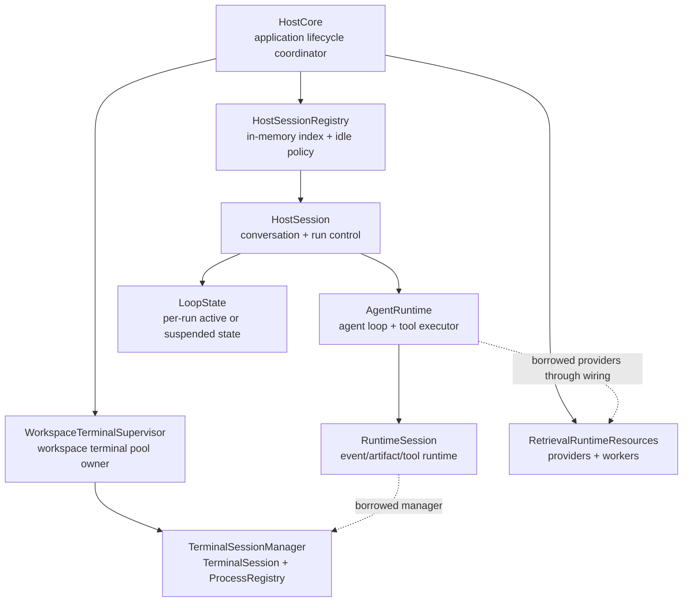

# Host / Session Ownership 与 Workspace Terminal Supervisor 集成审计

_创建时间：2026-07-01_

本文是对 Pulsara 当前 Host / session ownership 实现的代码审计，也是后续收口 workspace-scoped terminal supervisor 的实施入口。

本文以当前代码为准，主要回答四个问题：

1. `HostCore`、`HostSession`、`RuntimeSession`、`WorkspaceTerminalSupervisor` 当前分别拥有哪一类状态与资源；
2. 它们与 agent runtime、pending interaction、permission、terminal tool、后台进程和 retrieval worker 的真实连接点在哪里；
3. host close、workspace close、idle sweep 和 application shutdown 当前实际执行什么；
4. 后续改造应该落在哪些文件，哪些边界必须先冻结，哪些坑不能靠“close 幂等”掩盖。

本文不是一次 hard cut 提案。`HostSession` 与 `RuntimeSession` 都是必要边界，workspace supervisor 也是已经落地的产品能力。需要收掉的是分散的生命周期协调权和 owned / borrowed 布尔兼容层，而不是这些层次本身。

---

## 0. 结论

### 0.1 总体判断

第五章所描述的债务仍然存在，而且当前代码已经足够复杂，应该在继续扩展 desktop/web host 之前收口。

当前主路径已经具备正确的基础能力：

- 一个 `HostSession` 跨多个 turn 复用同一个 `AgentRuntime` / `RuntimeSession`；
- 同一 project workspace 下的多个 host session 默认共享一个 `TerminalSessionManager`；
- terminal session、yielded process 和 `terminal_process` 操作均按 `owner_host_session_id` 隔离；
- session close 只杀本 owner 的进程，workspace close / supervisor shutdown 才 all-kill；
- active run、pending approval / plan interaction、stop、resume 已经由 `HostSession` 管理；
- retrieval provider、governance coordinator、vector worker 已经提升到 `HostCore` 生命周期。

但生命周期协调权并不唯一：

- `HostCore` 负责 attach / detach supervisor；
- `HostSessionRegistry` 仍能直接关闭 `HostSession`；
- `HostSession.close()` 会关闭 `AgentRuntime`；
- `RuntimeSession.close()` 会 shutdown owned manager 或 `kill_owned()` borrowed manager；
- `WorkspaceTerminalSupervisor.detach()` 又会再次 `kill_owned()`；
- `close_workspace()` 与 `shutdown()` 各自重新编排一套关闭流程。

因此当前正确性部分依赖以下偶然条件：

- `kill_owned()` 基本幂等；
- 大多数调用者走 `HostCore.close_session()`，没有直接走 registry；
- open / close / shutdown 很少并发；
- `host_session_id` 不重复；
- 共享 manager 的同步 kill 没有长时间阻塞 event loop。

这些条件不应该继续充当生命周期契约。

### 0.2 最重要的结构性结论

后续应冻结为：

> `HostCore` 是唯一 lifecycle coordinator；`WorkspaceTerminalSupervisor` 是共享 terminal pool 的唯一资源 owner；`HostSession` 是 conversation 与 run-control state 的 owner；`RuntimeSession` 只持有明确的 terminal lease/binding，不再自行解释一个 borrowed manager 应该如何 detach。

`HostSessionRegistry` 应退化成纯索引和 idle candidate 发现器，不能再成为第二个关闭协调者。

### 0.3 不建议做的事情

- 不合并 `HostSession` 与 `RuntimeSession`。
- 不删除 workspace-scoped supervisor。
- 不把 terminal manager 下沉回每个 turn。
- 不把 `workspace_key`、`host_session_id`、`conversation_id`、`runtime_session_id` 合并成一个“session id”。
- 不让 CLI、UI、registry 分别拼自己的 close 顺序。
- 不用更多 `owns_xxx: bool` 扩展资源所有权矩阵。

---

## 1. 审计范围与代码真值

### 1.1 核心代码

- [`src/pulsara_agent/host/core.py`](/Users/plumliu/Desktop/python_workspace/pulsara_agent/src/pulsara_agent/host/core.py)
- [`src/pulsara_agent/host/session.py`](/Users/plumliu/Desktop/python_workspace/pulsara_agent/src/pulsara_agent/host/session.py)
- [`src/pulsara_agent/host/registry.py`](/Users/plumliu/Desktop/python_workspace/pulsara_agent/src/pulsara_agent/host/registry.py)
- [`src/pulsara_agent/host/supervisor.py`](/Users/plumliu/Desktop/python_workspace/pulsara_agent/src/pulsara_agent/host/supervisor.py)
- [`src/pulsara_agent/host/identity.py`](/Users/plumliu/Desktop/python_workspace/pulsara_agent/src/pulsara_agent/host/identity.py)
- [`src/pulsara_agent/runtime/session.py`](/Users/plumliu/Desktop/python_workspace/pulsara_agent/src/pulsara_agent/runtime/session.py)
- [`src/pulsara_agent/runtime/wiring.py`](/Users/plumliu/Desktop/python_workspace/pulsara_agent/src/pulsara_agent/runtime/wiring.py)
- [`src/pulsara_agent/runtime/agent.py`](/Users/plumliu/Desktop/python_workspace/pulsara_agent/src/pulsara_agent/runtime/agent.py)
- [`src/pulsara_agent/runtime/terminal/manager.py`](/Users/plumliu/Desktop/python_workspace/pulsara_agent/src/pulsara_agent/runtime/terminal/manager.py)
- [`src/pulsara_agent/runtime/terminal/process.py`](/Users/plumliu/Desktop/python_workspace/pulsara_agent/src/pulsara_agent/runtime/terminal/process.py)
- [`src/pulsara_agent/tools/builtins/terminal.py`](/Users/plumliu/Desktop/python_workspace/pulsara_agent/src/pulsara_agent/tools/builtins/terminal.py)
- [`src/pulsara_agent/tools/builtins/terminal_process.py`](/Users/plumliu/Desktop/python_workspace/pulsara_agent/src/pulsara_agent/tools/builtins/terminal_process.py)
- [`src/pulsara_agent/retrieval/runtime.py`](/Users/plumliu/Desktop/python_workspace/pulsara_agent/src/pulsara_agent/retrieval/runtime.py)

### 1.2 主要测试

- [`tests/test_host_core.py`](/Users/plumliu/Desktop/python_workspace/pulsara_agent/tests/test_host_core.py)
- [`tests/test_terminal_runtime.py`](/Users/plumliu/Desktop/python_workspace/pulsara_agent/tests/test_terminal_runtime.py)
- [`tests/test_cli_host.py`](/Users/plumliu/Desktop/python_workspace/pulsara_agent/tests/test_cli_host.py)
- [`tests/test_retrieval_runtime.py`](/Users/plumliu/Desktop/python_workspace/pulsara_agent/tests/test_retrieval_runtime.py)
- `tests/test_real_llm_*.py`

### 1.3 已存在但不能代替当前审计的文档

- `ARCHITECTURE_DEBT_AUDIT.zh.md` 第五章正确指出了问题类别，但没有展开真实调用链和失败窗口。
- `HOST_CORE_AND_INMEMORY_SUPERVISOR_PLAN.zh.md` 记录了原始演进意图；当前 PR1–PR6 的大部分能力已经落地，不能再把它当作现状说明。
- terminal、permission、recovery 契约分别约束自己的 surface，但当前还没有一份统一的 workspace terminal lifecycle contract。

---

## 2. 四种 identity 必须保持分离

当前系统里至少有四种经常被口头简称为 session 的 identity：

| Identity | 当前来源 | 实际语义 | 不应承担的语义 |
|---|---|---|---|
| `workspace_key` | `resolve_workspace()` | workspace supervisor 的缓存键和 workspace close 目标 | 不代表 conversation 或 runtime run |
| `host_session_id` | `HostCore.open_session()` | host 进程内 session handle，也是 terminal owner principal | 不等于 durable conversation id |
| `conversation_id` | caller 或自动生成 | 产品层 conversation/thread identity | 当前不是 terminal 强制 owner key |
| `runtime_session_id` | `RuntimeSession` / event log | event、artifact、runtime 的持久化归属 | 不代表 workspace terminal pool |

### 2.1 Project workspace

project workspace 的 `workspace_key` 来自 canonical project path 的 hash scope，因此同一路径打开的多个 host session 会命中同一个 supervisor。

当前 `memory_domain_id` 不参与 `workspace_key`。如果未来一个 `HostCore` 同时服务多个安全租户，而这些租户可能指向相同本地路径，仅按 path 共享 terminal pool 将不再足够；届时必须把 security principal 纳入 workspace identity，而不能只依赖 process owner 过滤。

### 2.2 Transient workspace

transient workspace 每次 resolve 都生成新的 `workspace_key`，即使两个 session 显式传入同一个目录，也不会共享 supervisor。这避免了临时目录清理与跨 session terminal ownership 纠缠。

未来若要让 transient session 共享目录或 supervisor，必须先重审 `cleanup_workspace_root_on_close`；否则一个 session close 可能删除另一个 session 仍在使用的目录。

### 2.3 Terminal owner

当前真正用于 terminal 强制隔离的是 `owner_host_session_id`：

- `TerminalSessionManager` 以 `(owner_host_session_id, terminal_session_id)` 为 terminal session key；
- `ProcessRegistry._get()` 对 poll / log / wait / write / kill 做 owner 校验；
- `terminal_process list` 只列当前 owner 的 process；
- supervisor summary 才用 `include_owner=True` 显示 workspace 全局视图。

`TerminalTool` 与 process model 已经支持 `owner_conversation_id`，但当前 `RuntimeSession` / registry wiring 没有把 `conversation_id` 传进去，因此该字段在正常 HostCore 路径通常为空。这是诊断信息缺口，不是当前授权绕过；授权仍由 `host_session_id` 强制。

---

## 3. 当前真实所有权图



这张图里最需要警惕的是两条反向责任：

1. registry 不只是索引，还能直接 `session.aclose()`；
2. borrowed manager 的 owner cleanup 同时由 `RuntimeSession.close()` 和 supervisor detach 执行。

因此代码结构看起来是树，关闭控制流实际上不是树。

### 3.1 `HostCore` 当前拥有的资源

`HostCore` 当前持有：

- `HostSessionRegistry`；
- `_supervisors: dict[workspace_key, WorkspaceTerminalSupervisor]`；
- application 级 `RetrievalRuntimeResources`；
- application 级 `MemoryGovernanceCoordinator` 与 vector worker；
- `_shutting_down` 标志；
- supervisor / retrieval 两把 async lock。

这已经说明 `HostCore` 是自然的 composition root 和 application lifecycle owner。

### 3.2 `WorkspaceTerminalSupervisor` 当前拥有的资源

每个 supervisor 在构造时创建一个 `TerminalSessionManager`，并维护 `owner_sessions: set[str]`。

- `attach(owner)`：把 host session id 放入集合；
- `detach(owner, kill_owned=True)`：移除集合成员并 kill 该 owner 的 process；
- `shutdown()`：all-kill manager 中的 running process，并清空 owner set；
- `summary()`：给出 workspace 全部 yielded process 的诊断视图。

它目前已经是共享 terminal pool 的事实 owner，但没有独立 lifecycle state，也没有 lease 对象，attach 只是一次 set mutation。

### 3.3 `HostSession` 当前拥有的状态

`HostSession` 是 conversation 与 run-control 边界，持有：

- `conversation_id` 与 resolved workspace；
- 长生命周期 `AgentRuntimeWiring`；
- active run id、active task、active `LoopState`；
- suspended `LoopState` 与 `PendingInteraction`；
- stopping run id 与 typed `StopRequest`；
- plan workflow state；
- run / stop 两把 async lock；
- owner-scoped terminal summary 视图。

这些状态不适合下沉进 `RuntimeSession`。它们面向 host/UI 控制面，而不是 agent loop 的底层事件与工具执行面。

但“持有 active task”目前并未覆盖所有执行入口：只有非 streaming 的 `run_turn()` 显式 `asyncio.create_task()` 并写 `_active_task`。`stream_turn()` 在 transport caller 的 task 中直接迭代 runtime stream；approval / plan resume 的 streaming 和非 streaming 路径也没有统一写入 `_active_task` / `_active_state`。因此该字段目前只是部分路径的 task handle，不是真正的 HostSession execution owner。

### 3.4 `RuntimeSession` 当前拥有和借用的资源

`RuntimeSession` 持有：

- event log 与 publisher；
- hook manager；
- memory proposal sink；
- artifact store / tool result artifact index；
- terminal manager 引用；
- terminal owner host session id；
- `owns_terminal_session_manager: bool`。

如果没有注入 manager，它自行创建并拥有 `TerminalSessionManager`；如果注入 shared manager，它借用 manager。

问题在于 borrowed 情况下 `RuntimeSession.close()` 不只是“释放 runtime”，还主动 `kill_owned(owner_host_session_id)`。这使 `RuntimeSession` 知道了 supervisor 的 detach policy，却并不知道 supervisor 的 owner set，也无法完成完整 detach。

### 3.5 `AgentRuntime` 当前拥有的执行面

`AgentRuntime` 构造时从 `RuntimeSession` 创建一个长生命周期 `ToolExecutor`。terminal tools 捕获：

- shared 或 local `TerminalSessionManager`；
- `owner_host_session_id`；
- mutable permission state。

因此 mode 切换不重建 executor，也不会丢 terminal session；而 terminal ownership 一旦 wiring 完成，就固定到该 `AgentRuntime`。

---

## 4. Session open 的真实调用链

当前 `HostCore.open_session()` 顺序如下：

```text
check HostCore._shutting_down
  -> resolve_workspace
  -> choose host_session_id / conversation_id
  -> _attach_supervisor(workspace, host_session_id)
  -> get/start HostCore retrieval resources (durable only)
  -> build_agent_runtime_wiring
       -> build RuntimeSession
       -> inject shared TerminalSessionManager
       -> build memory / graph / event / artifact services
       -> build AgentRuntime and ToolExecutor
  -> construct HostSession
  -> registry.add(session)
```

### 4.1 正确的部分

- workspace identity 在 wiring 前 resolve；
- shared manager 在 RuntimeSession 构造时注入，而不是运行中替换；
- terminal owner id 同时进入 RuntimeSession 和 tools；
- durable retrieval resources 由 HostCore 创建一次并被多个 session 借用；
- HostSession 注册完成后才向调用者返回。

### 4.2 当前 open 不是异常安全事务

supervisor attach 发生在 wiring 和 registry add 之前。如果以下任一步失败：

- retrieval provider / worker 初始化；
- durable storage wiring；
- LLM runtime 构造；
- HostSession 构造；
- registry 因容量限制拒绝；

则当前没有 rollback detach，`owner_sessions` 可能留下不存在的 host session，创建出的 runtime 资源也可能没有关闭。

这不是理论上的“清理优化”。一旦 owner id 泄漏，supervisor diagnostics、容量判断和未来 workspace close 都会看到错误状态。

### 4.3 Duplicate id 会破坏所有权

`HostSessionRegistry.add()` 当前对重复 `host_session_id` / `conversation_id` 不报错，而是直接覆盖 dict entry。`WorkspaceTerminalSupervisor.owner_sessions` 又是 set，不是 attachment token 或 refcount。

结果可能是：

- 旧 HostSession 从 registry 消失但未 close；
- 两个 runtime 使用相同 terminal owner id；
- 关闭新 session 时 `kill_owned()` 同时杀掉旧 session 的 process；
- supervisor detach 一次就删除唯一的 set 成员，无法表达仍有旧 borrower。

因此 registry uniqueness 是 terminal ownership 的正确性条件，必须 fail closed。

### 4.4 Open 与 close/shutdown 的竞态

`open_session()` 只在入口读取一次 `_shutting_down`。检查后没有 lifecycle lock 或 generation token 覆盖整个 open transaction。

可能出现：

1. open 通过 `_shutting_down` 检查；
2. shutdown 设置标志并 snapshot 当前 sessions；
3. open 继续 attach / build / registry.add；
4. shutdown 关闭旧 snapshot 后返回；
5. 新 session 留在一个已经 shutdown 的 HostCore 内。

`close_workspace()` 也没有 workspace closing tombstone。并发 open 可能在 workspace session snapshot 之后注册，或者拿到即将被 `supervisor.shutdown()` 的 manager。

这两条都需要状态机或 generation/lease 机制，不能只靠更大的局部锁修补。

---

## 5. 与 Agent Runtime 的关键连接点

### 5.1 Turn 创建与长期 runtime 复用

每个普通 turn：

1. `HostSession` 从 event log 重建 prior messages；
2. 从 plan state 生成 host runtime messages；
3. 调 `AgentRuntime.new_state()` 创建新的 `LoopState`；
4. 把 host session id 与 plan state 放入 state；
5. 在同一个长生命周期 `AgentRuntime` 上执行；
6. turn 结束后清理 active handle，但不 close RuntimeSession。

因此边界是：

- `LoopState`：per run；
- `AgentRuntime` / `RuntimeSession`：per HostSession；
- terminal manager：默认 per workspace；
- retrieval resources：per HostCore。

这四层不能再用“session”一词笼统描述。

### 5.2 Pending approval / plan interaction

当 runtime 进入 `WAITING_USER`：

- `HostSession` 从 `LoopState` 投影 `PendingInteraction`；
- 保存原 `_suspended_state`；
- 后续 approve / deny / plan answer 继续同一个 run；
- 普通新 turn、mode switch、enter plan 都被拒绝。

这进一步证明 `HostSession` 是 host workflow state owner。registry 与 supervisor 不应理解 pending interaction 的内部结构，但 lifecycle coordinator 在 close 前必须询问 HostSession 如何终止该 suspended run。

### 5.3 Stop 与 teardown cancellation 不同

显式 user stop 已经使用 typed `StopRequest`：

- HostSession 写入 request；
- cancel active task；
- run wrapper 识别 request 并调用 `AgentRuntime.abort_run()`；
- runtime 产出 typed aborted terminal state。

但 `drain_active_run()` 为 teardown 直接 `task.cancel()`，没有 stop request；`run_turn()` 会重新抛出这类 cancellation。当前这隐式表达了“host teardown cancellation 不是 user stop”，方向合理，但没有形成完整的 close/finalization 契约。

尤其是 suspended pending interaction：`HostSession.close()` 直接清空 `_suspended_state`，并不会对该 run 调 `abort_run()`。如果 durable event log 需要每个已开始 run 都有 terminal outcome，这里仍是显式决策缺口。

必须在实施前拍板：

- close 是否产生新的 host-teardown `AbortKind` / `RunEndEvent`；
- 还是明确允许 session destruction 留下非 terminal run，并由 cross-run recovery 解释；
- active 与 suspended close 是否采用同一规则。

不能继续让 `task.cancel()` 与字段清空偶然决定可审计语义。

此外，当前 stop/drain 只能可靠覆盖 `run_turn()`：

- `stream_turn()` 设置 `_active_state`，但不设置 `_active_task`；
- approval / plan resume 设置 `active_run_id`，但没有统一设置 active task/state；
- `stop_current_turn()` 依赖 `_active_task + _active_state`；
- `drain_active_run()` 只检查 `_active_task`。

所以 streaming turn 或正在 resume 的 run 可能显示为 active，却没有可被 HostSession 取消和 drain 的统一 handle。HostCore shutdown 也可能在这些执行仍存活时继续关闭 provider 或 terminal pool。

后续必须让所有 run/resume/stream 入口共用一个 execution primitive：HostSession 始终拥有内部 task/cancel scope，transport 只消费事件；不能再由是否使用 async generator 决定生命周期归属。

### 5.4 Terminal tool ownership plumbing

`AgentRuntime` 构造时创建 ToolExecutor，registry 将 RuntimeSession 中的 manager 与 owner id 注入：

```text
HostCore.host_session_id
  -> RuntimeSession.terminal_owner_host_session_id
  -> TerminalTool.owner_host_session_id
  -> TerminalSessionManager.get_or_create(owner=...)
  -> TerminalProcessState.owner_host_session_id
  -> terminal_process owner-scoped lookup
```

这条链是当前 cross-session isolation 的强制链，不能在 lifecycle 重构中只改 supervisor 而漏掉 tools registry。

### 5.5 Yielded process 与 RuntimeSession 强引用

yielded process 会保存 origin event context 和 `RuntimeThreadRecorder`，以便进程自然结束后写 `TerminalProcessCompletedEvent`。recorder 强引用 RuntimeSession。

teardown kill 会：

- 标记 `completion_suppressed=True`；
- 清掉 `record_event`；
- kill process group；
- join reader thread（有界等待）。

因此 session close 的 terminal cleanup 不只是杀 OS process，也是在释放 RuntimeSession/event publisher 的跨线程引用。若未来把 session close 改成“只 detach、不 kill”，必须同时定义 completion event 的 sink 和 recorder 生命周期，不能只删除 `kill_owned()`。

### 5.6 Permission state

permission mode 是 HostSession 可变状态，但强制 holder 位于 AgentRuntime，并被 gate 与 terminal tools 共享。mode switch 不重建 RuntimeSession 或 terminal manager。

这意味着 lifecycle 重构不能通过“close/rebuild AgentRuntime”实现 owner 切换，否则会丢失：

- live terminal session cwd；
- yielded process handle；
- pending interaction state；
- event publisher / artifact ownership；
- mutable permission state。

### 5.7 Governance 与 retrieval lifecycle

当前 retrieval resources 是更清晰的所有权参考：

- `HostCore` 创建 provider、coordinator、worker；
- HostSession / RuntimeSession 借用；
- borrower 不 close provider；
- HostCore shutdown 先 drain active run，再有界关闭 workers/provider。

不过 HostSession turn finally 会 `_notify_governance()`，因此 HostCore shutdown 必须先禁止新 run、drain 所有 run，让 finally 完成 notify，再关闭 retrieval resources。所有 facade 操作都需要遵守 shutdown gate，而不能只禁止 `open_session()`。

---

## 6. 当前四条关闭路径

| 路径 | 当前调用链 | Terminal 效果 | 主要问题 |
|---|---|---|---|
| Host session close | `HostCore.close_session` → registry close → `HostSession.aclose` → `AgentRuntime.close` → `RuntimeSession.close` → supervisor detach | borrowed manager 上对同一 owner 执行两次 `kill_owned` | cleanup owner 重复；registry remove 与 detach 非原子 |
| Idle sweep | `HostSessionRegistry.sweep_idle` → registry 自己 close | RuntimeSession 会 kill owner，但 supervisor owner set 不 detach | 绕过唯一协调者，留下 supervisor 元数据漂移 |
| Workspace close | snapshot sessions → registry 逐个 close → pop supervisor → supervisor shutdown | 每个 owner 先 kill，最后 all-kill | 无 workspace closing gate；未统一走 HostCore close；并发 open 可借到即将关闭的 manager |
| HostCore shutdown | 标记 shutting down → drain active runs → close retrieval → `close_session` all → shutdown residual supervisors | owner kill 后清残余 pool | 只有 open 被 gate；并发 resume/stop/close 仍可进入；顺序分散 |

### 6.1 Session close 的重复 cleanup

shared manager 路径中：

1. `RuntimeSession.close()` 发现 `owns_terminal_session_manager=False`，调用 `kill_owned()`；
2. registry close 返回后，`HostCore._detach_supervisor()` 再调用 `supervisor.detach(..., kill_owned=True)`；
3. supervisor 再次 `kill_owned()`。

这目前通常不出错，但它让“谁负责释放 lease”没有唯一答案。未来一旦 cleanup 增加计费、事件、metrics、awaitable drain 或错误上报，重复执行会立刻变成行为 bug。

### 6.2 Registry close 旁路

`HostSessionRegistry.sweep_idle()` 默认直接调用自己的 `close_session()`。该方法只知道 HostSession，不知道 workspace supervisor。

它虽然接受 `close_session` callback，但类型是同步 `Callable[[str], None]`，调用时也不 await，因此不能自然传入 async `HostCore.close_session()`。

推荐把 sweep 改成只返回 idle candidates，关闭统一由 HostCore 执行；不要在 registry 内再注入一个异步 lifecycle callback。

### 6.3 Close 失败后的半关闭状态

registry 当前先从索引移除 session，再 await `session.aclose()`。如果 close 抛异常：

- session 已不可通过 registry 找到；
- HostCore 后续 detach 不会执行；
- caller 很难重试；
- workspace owner metadata 可能永久漂移。

相反，如果先 close 再 remove，又会产生关闭中的 session 被并发 get/resume 的问题。因此需要显式 `CLOSING` 状态与 finally cleanup，而不是简单交换两行顺序。

### 6.4 Core-level close 不是幂等 API

`HostSession.close()` 自身幂等，但 `HostCore.close_session()` 会先 `registry.get()`，重复调用会得到 `KeyError`。对于 web disconnect、UI close、shutdown race 来说，application-level close 最好有明确的幂等语义。

---

## 7. 已经成立、必须守住的行为

### 7.1 Owner isolation

当前测试已经证明：

- session B 不能 poll session A 的 process；
- close A 会 kill A-owned process；
- B-owned process 保持运行；
- workspace close 会 kill B；
- terminal cwd 也按 owner 隔离。

任何 lease 重构都必须保留这些行为。

### 7.2 Turn 结束不等于 session 结束

普通 FINISHED / FAILED / WAITING_USER 后都不会自动关闭 RuntimeSession 或 terminal manager。yielded process 能跨 turn 存活，这是产品能力，不是泄漏。

### 7.3 Model-facing 与 admin-facing 视图分离

- model-facing `terminal_process` 只能看 owner-scoped process；
- HostSession summary 也是 owner-scoped；
- workspace supervisor summary 是 admin/host 视图，可以包含 owner metadata。

统一 summary 不等于放宽模型权限。后续可以统一 schema，但必须保留 viewer capability 和过滤边界。

### 7.4 Teardown 不伪造自然 completion

session/workspace shutdown 杀进程时 suppression completion event 是正确语义。否则用户会收到一个看似自然完成、实际由 teardown 杀死的后台任务通知。

### 7.5 Host-process 级软恢复边界

registry 与 supervisor 都是 in-memory：

- transport 断开但 HostCore 存活，可以按 host session id reconnect；
- HostCore 进程崩溃后不承诺重建 registry、adopt OS process 或恢复 terminal stdin；
- 本次 ownership 收口不应顺手扩展成 disk crash recovery。

---

## 8. 风险与坑

### P0-1：生命周期协调权旁路

registry 可以直接 close session，导致 supervisor detach 被绕过。这是当前最明确、最容易复现的 ownership bug。

### P0-2：Open / workspace close / shutdown 非线性化

没有一个原子状态转换能保证：

- shutdown 开始后绝不会注册新 session；
- workspace close 开始后绝不会 attach 新 borrower；
- manager shutdown 时不存在正在 wiring 的新 runtime。

必须用 application/workspace lifecycle state 解决，而不是只给 `_supervisor_lock` 扩大范围。

### P0-3：Duplicate host session id 破坏 owner principal

registry overwrite + supervisor set 会让两个 borrower 共用一个 owner principal，关闭任一方都可能杀错 process。所有显式 id 必须在 attach 前完成 uniqueness reservation。

### P0-4：Open 失败没有 rollback

attach、resource build、registry add 不是一个可回滚 transaction。必须引入 reservation/lease，并在异常路径 exactly-once release。

### P0-5：Close 对 active / suspended run 的审计语义未冻结

active teardown cancellation 与 suspended-state 丢弃没有统一 RunEnd/finalization 规则。它会直接影响 recovery contract、durable transcript 与 pending approval 的安全语义。

### P0-6：Streaming / resume 执行没有统一 active task owner

`_active_task` 只覆盖 `run_turn()`，而 streaming 与 interaction resume 路径由 caller task 承载。stop、close、shutdown 无法对所有 active execution 进行同样的 cancel/drain。

这不是单纯的 API 对称性问题：如果 shutdown 在未被追踪的 stream 仍执行时关闭 retrieval provider 或 workspace terminal pool，就会形成真实的 use-after-close。

### P0-7：Owner detach 不释放 `TerminalSessionManager._sessions`

`WorkspaceTerminalSupervisor.detach()` 调用的 `kill_owned()` 只清理 `ProcessRegistry` 中的 owner process，不会删除 `TerminalSessionManager._sessions` 中以 `(owner_host_session_id, terminal_session_id)` 为键的 terminal session。

共享 manager 默认 `max_sessions=4`。只要 workspace 中仍有一个长期 host session，使 supervisor 不被整体移除，其他 session 反复 open → 使用默认 terminal → close，就会留下越来越多 stale terminal session key，并最终触发 manager session limit。此时所有进程可能都已结束，容量仍不会恢复。

supervisor lease release 必须同时定义：

- kill/drain owner process；
- 删除 owner 的 terminal session 与 cwd state；
- 释放 owner 所占 manager capacity；
- 清掉会强引用 RuntimeSession 的 completion recorder。

不能只把 `ProcessRegistry.kill_owned()` 改名成 detach。

### P1-1：Borrowed manager cleanup 重复

`RuntimeSession.close()` 和 `WorkspaceTerminalSupervisor.detach()` 都 kill owner。当前靠幂等掩盖责任冲突。

### P1-2：同步 process teardown 阻塞 event loop

`kill_process()` 包含同步 wait 和 reader thread join。`_detach_supervisor()` 在持有 `asyncio.Lock` 时直接调用它；多个 process 最坏会串行阻塞数秒，并阻塞同一 HostCore 上其他 workspace 的 attach/detach。

改造时应：

- 在锁内只做状态转换和取出待清理 lease；
- 在锁外 `asyncio.to_thread()` 执行同步 kill；
- 对整个 owner cleanup 设置有界超时；
- 最后在锁内 finalize / prune。

不要在 supervisor 的同步方法里偷偷创建 background task，否则 close 完成语义会再次模糊。

### P1-3：Feature flag 形成两套容量与关闭语义

`use_workspace_supervisor=True` 是默认值，但大量 deterministic / real LLM 测试显式设为 `False`。

这两条路径不仅资源归属不同，容量语义也不同：

- local manager：`max_sessions=4`、`max_live_processes=8` 是 per HostSession；
- shared manager：同样的默认值变成 per workspace，多 host session 竞争同一额度。

而且当前 owner detach 不删除 manager 中的 terminal session，shared 路径的额度还会被已关闭 owner 永久占用，直到整个 supervisor 被销毁。

因此共享路径可能在两个 session 各创建少量 named terminal session 时提前触发全 workspace 上限，而 real LLM dogfood 未必覆盖。

最终应把 workspace supervisor 作为 HostCore 主路径，legacy local manager 只保留低层 RuntimeSession 单测或显式 standalone runtime，不再作为 HostCore feature fork。

### P1-4：`owner_conversation_id` 数据流断裂

process model 和 terminal tool 支持 conversation owner，但 HostCore wiring 只传 host session id。workspace diagnostics 无法直接把 process 映射到产品 conversation。

修复时应补 typed terminal owner context，而不是继续给 RuntimeSession 增加平行 string 字段。

### P1-5：Summary schema 分叉且使用裸 dict

`HostSession.terminal_summary` 与 `WorkspaceTerminalSupervisor.summary()` 返回不同形状的 dict：

- owner 视图不含 workspace identity；
- workspace 视图含 owner metadata；
- CLI inspect 当前甚至静态返回空 `workspace_supervisors`，没有连接 live HostCore。

外部 UI 若直接消费这些 dict，会固化内部 owned / borrowed 结构。应先定义 typed workspace terminal snapshot，再提供按 viewer 过滤的投影。

### P1-6：Supervisor attachment 不是 lease

`owner_sessions: set[str]` 只能表达“见过这个 id”，不能表达：

- attaching / active / releasing；
- attachment generation；
- rollback token；
- duplicate borrower；
- close error；
- workspace closing 后拒绝新 attach。

这正是 open/close race 难以收口的根源。

### P1-7：HostCore facade 没有统一 shutdown gate

当前只有 `open_session()` 检查 `_shutting_down`。get、resume、stop、mode switch、plan interaction 等 facade 仍可在 shutdown 中进入。

最危险的是 resume：shutdown 可能认为 active borrowers 已 drain，另一个请求却重新启动 suspended run，随后 retrieval provider 或 terminal pool 被关闭。

### P1-8：Manager prune 与 finished diagnostics 的策略未定义

最后一个 owner detach 且无 live process 时 supervisor 会立即从 map 删除，即使仍有 finished process summaries。因此 finished diagnostics 的保留期实际受 owner 生命周期影响，而不完全由 `finished_ttl_seconds` 决定。

这未必是 bug，但必须成为产品策略：workspace summary 是只展示 active workspace，还是在 TTL 内保留 finished inventory。

### P2-1：Workspace key 的 security domain

当前 project path 是 supervisor identity 的主要输入。若未来 HostCore 多租户化，必须加入 tenant/security principal，避免同路径跨租户共享 manager。

### P2-2：共享 manager 内部容量与公平性

manager 当前没有 per-owner session/process quota，也没有公平调度。一个 host session 可以耗尽 workspace 的 terminal session 或 live process 上限，阻止 sibling session。

v1 可以接受 workspace 总上限，但 diagnostics 和错误必须显示 owner 分布；后续再决定 per-owner quota。

---

## 9. 推荐目标契约

### 9.1 HostCore：唯一 lifecycle coordinator

HostCore 负责：

- reserve / publish / reject host session identity；
- reserve workspace attachment；
- 编排 HostSession close；
- 释放 workspace terminal lease；
- close workspace；
- application shutdown；
- idle candidate 的实际关闭；
- 对所有 public facade 应用 lifecycle gate。

registry、HostSession、RuntimeSession、supervisor 都不应再跨层协调彼此。

### 9.2 Registry：纯索引，不执行 teardown

推荐接口形态：

```python
reserve(host_session_id, conversation_id) -> SessionReservation
publish(reservation, session) -> None
get(host_session_id) -> HostSession
begin_close(host_session_id) -> HostSession | None
finish_close(host_session_id) -> None
list_idle_candidates(now) -> list[str]
```

具体命名可调整，但必须满足：

- duplicate id fail closed；
- `CLOSING` session 不再接受普通操作；
- registry 不调用 `session.aclose()`；
- sweep 只发现 candidate，不产生外部副作用。

### 9.3 Supervisor：唯一 shared terminal pool owner

推荐引入 typed attachment：

```python
@dataclass(frozen=True, slots=True)
class WorkspaceTerminalLease:
    workspace_key: str
    owner: TerminalOwnerContext
    generation: int
    manager: TerminalSessionManager
```

以及 typed owner：

```python
@dataclass(frozen=True, slots=True)
class TerminalOwnerContext:
    host_session_id: str
    conversation_id: str
    runtime_session_id: str | None = None
```

核心语义：

- attach 成功返回唯一 lease；
- release 幂等且按 lease generation 校验；
- workspace closing 后 attach 必须失败；
- release 负责 owner-scoped process cleanup；
- shutdown 负责 all-kill；
- manager 不直接暴露为 HostCore 外部生命周期 API。

### 9.4 RuntimeSession：持有 binding，不解释 supervisor policy

`owns_terminal_session_manager` 与 `terminal_owner_host_session_id` 应收成一个 typed binding：

```python
TerminalRuntimeBinding = OwnedTerminalRuntime | BorrowedWorkspaceTerminalRuntime
```

- standalone RuntimeSession 可以拥有 local manager，close 时 shutdown；
- HostCore 路径传入 borrowed binding；
- borrowed RuntimeSession close 只关闭 runtime-local publisher/hooks 等资源，不自行 kill/detach workspace lease；
- lease release 由 HostCore / supervisor 完成一次。

如果 RuntimeSession 当前没有其他 closeable local resource，也仍应保留 `close()`；但它的职责必须是 runtime-local，而不是猜测上层 attachment 生命周期。

### 9.5 HostSession：拥有 run state machine

HostSession 应有显式状态：

```text
OPEN -> CLOSING -> CLOSED
```

并统一处理：

- active run；
- stopping run；
- suspended approval / plan interaction；
- plan workflow state；
- runtime-local close。

所有 `run_turn` / `stream_turn` / approval resume / plan resume 必须走同一个内部 execution handle。是否向 caller 返回完整结果或 event stream 只能是观察方式差异，不能改变 task ownership、stop、drain 与 close 语义。

HostCore 不应手工读写 `_active_task` 或 `_suspended_state`，只调用一个有界、幂等的 `HostSession.aclose(reason=...)`。

### 9.6 三种 close 的推荐语义

#### Host session close

1. session 标记 `CLOSING`，拒绝新 turn/resume/mode switch；
2. 按冻结的 run-finalization 规则终止 active / suspended run；
3. 等待 host runtime hooks/finally 有界完成；
4. 关闭 runtime-local resources；
5. release workspace terminal lease，kill owner process；
6. registry finish_close；
7. 如果 transient root 由 host 创建且允许清理，最后删除目录。

#### Workspace close

1. workspace 标记 `CLOSING`，拒绝新 attach；
2. snapshot 并关闭该 workspace 全部 HostSession；
3. supervisor shutdown，兜底 all-kill；
4. 从 supervisor registry 删除 workspace；
5. workspace 标记 `CLOSED`。

#### HostCore shutdown

1. HostCore 原子进入 `CLOSING`，所有 facade 拒绝新工作；
2. snapshot sessions / workspaces；
3. 有界关闭所有 HostSession，让 run finally 与 governance notify 完成；
4. 关闭剩余 workspace supervisor；
5. drain/cancel governance/vector worker，再关闭 retrieval provider；
6. 标记 `CLOSED`。

retrieval 与 terminal 的具体先后可以微调，但硬约束是：provider 关闭前不能再有可恢复/可启动的 agent borrower，terminal all-kill 前不能再有执行中的 terminal tool。

---

## 10. 代码落脚点

### 10.1 `src/pulsara_agent/host/core.py`

主要改动：

- 引入 HostCore lifecycle state，而不是单一 `_shutting_down: bool`；
- open 使用 reservation + rollback；
- 所有 public facade 统一 lifecycle gate；
- `close_session()` 成为唯一 session close coordinator；
- idle sweep 由 HostCore 调 registry 的 candidate API后逐个 close；
- `close_workspace()` 引入 workspace closing gate；
- shutdown 使用同一 close primitive，不再复制清理逻辑；
- 同步 terminal teardown 移出 async lock / event loop。

### 10.2 `src/pulsara_agent/host/registry.py`

主要改动：

- duplicate host session / conversation id 拒绝；
- 增加 reserved / active / closing 状态或等价 token；
- 删除 registry 内的 `session.aclose()`；
- `sweep_idle()` 改为 `list_idle_candidates()` 或同义纯查询；
- 修正 callback 不能 await 的兼容接口，不保留第二套关闭入口。

### 10.3 `src/pulsara_agent/host/supervisor.py`

主要改动：

- `owner_sessions: set[str]` 升级为 typed lease/attachment registry；
- 引入 `OPEN/CLOSING/CLOSED`；
- attach / release / shutdown 幂等且 generation-safe；
- 统一 owner cleanup；
- release 时同时清理 owner terminal sessions / cwd state，而不只 kill process；
- 提供 typed workspace snapshot；
- 明确 finished process retention / prune 策略；
- 不在持有 asyncio lock 时执行同步 kill。

可以保留类名 `WorkspaceTerminalSupervisor`；问题不在命名，而在它当前只是 manager + set。

### 10.4 `src/pulsara_agent/host/session.py`

主要改动：

- 增加显式 lifecycle state；
- `aclose(reason=...)` 成为有界、幂等的 run-control close；
- 所有 run/stream/resume 入口共用一个 active execution task/cancel handle；
- 冻结 active 与 suspended run 的 finalization 语义；
- close 不直接承担 shared terminal lease release；
- summary 从内部字段拼 dict 改为 typed host session snapshot；
- transient root cleanup 保持在所有 borrower/resource release 之后。

### 10.5 `src/pulsara_agent/runtime/session.py`

主要改动：

- `terminal_session_manager + owns_terminal_session_manager + terminal_owner_host_session_id` 收成 typed binding；
- borrowed close 不再 `kill_owned()`；
- local owned manager 仍允许 standalone runtime 使用；
- close 明确幂等；
- terminal owner context 包含 conversation id，并进入 tool registry。

### 10.6 `src/pulsara_agent/runtime/wiring.py`

主要改动：

- 所有 in-memory / durable / agent wiring builder 改接 typed terminal binding；
- 不在多层 builder 继续平铺三个 ownership 参数；
- 保持 HostCore retrieval resources 为 borrowed application resource；
- 增加构造失败时 runtime-local cleanup 的明确边界。

### 10.7 `src/pulsara_agent/runtime/agent.py`

预计不需要大改 agent loop，但必须核对：

- ToolExecutor 从 typed binding 得到 owner context；
- close 不再触发 shared terminal cleanup；
- teardown cancel 与 user stop 的 typed 语义；
- shutdown gate 后不会再 resume suspended state。

### 10.8 `src/pulsara_agent/runtime/terminal/*`

主要改动：

- 保留 owner-scoped 强制；
- 为 manager 增加 owner-scoped release，删除 `_sessions` 中对应 owner 的 terminal session；
- 如引入 async cleanup adapter，不要把 subprocess primitive 全量 async 化；
- 补 per-workspace / per-owner capacity diagnostics；
- 保留 teardown completion suppression；
- 检查 ProcessRegistry 多线程快照与 cleanup 的同步边界。

### 10.9 CLI / UI adapter

`src/pulsara_agent/cli.py` 只能调用 HostCore lifecycle API，不能直接 new/close RuntimeSession 来伪造 live host diagnostics。

`host inspect` 当前是静态 workspace capability inspect，不是真正的 HostCore live snapshot。后续应二选一：

- 改名，明确它是 static workspace inspect；
- 或连接一个真实 live HostCore admin endpoint。

不要让 `workspace_supervisors: []` 被 UI 当作真实运行时空列表。

---

## 11. 推荐实施顺序

### PR H0：冻结 lifecycle contract 与回归测试

- 新增 workspace terminal lifecycle contract；
- 冻结 identity、owner isolation、三种 close 语义；
- 拍板 active/suspended run close 的 RunEnd 规则；
- 先写 duplicate id、open rollback、idle bypass、concurrent open/close 的失败测试。

此 PR 不改主结构，但必须让后续 PR 有唯一判定标准。

### PR H1：HostCore 单一协调入口

- registry 退化为纯索引；
- idle sweep 返回 candidates；
- HostCore close 幂等；
- 全 facade shutdown gate；
- registry uniqueness reservation。

这一 PR 先消除控制面旁路，不碰 terminal binding 结构。

### PR H2：Workspace terminal lease

- supervisor attachment 升级为 typed lease；
- open rollback exactly once；
- workspace closing gate；
- conversation owner context 补齐；
- cleanup 移到锁外 thread；
- shared capacity diagnostics。

### PR H3：RuntimeSession typed terminal binding

- 删除 HostCore 路径上的 owned/borrowed 三参数组合；
- borrowed RuntimeSession 不再 kill owner；
- lease release 只在 HostCore/supervisor；
- standalone RuntimeSession 保留 local owned manager。

### PR H4：统一 close 状态机与 diagnostics

- HostSession `OPEN/CLOSING/CLOSED`；
- active/suspended close 统一 finalization；
- close workspace / shutdown 共用 primitive；
- typed workspace/session terminal snapshot；
- 移除 HostCore 的 `use_workspace_supervisor` 兼容分叉；
- CLI/UI 只消费统一 admin summary。

---

## 12. 测试矩阵

### 12.1 Identity 与 open transaction

- duplicate `host_session_id` 被拒绝，旧 session/runtime/process 不受影响；
- duplicate `conversation_id` 的策略被钉死（拒绝或显式 reconnect，不能覆盖）；
- registry capacity failure 会 rollback supervisor lease；
- wiring 构造失败会 rollback lease并关闭已建 runtime-local resource；
- transient workspace 即使根目录相同也保持独立，除非未来契约主动改变。

### 12.2 Session close

- close A 只 kill A-owned process，B 继续运行；
- lease release 与 owner cleanup exactly once；
- close 重复调用幂等；
- close active run 的 terminal outcome 符合冻结契约；
- close suspended approval / plan interaction 的 terminal outcome 符合冻结契约；
- close 失败后 session 保持可诊断且可重试，不成为 registry orphan；
- teardown kill 不产出自然 completion event；
- RuntimeThreadRecorder 强引用最终释放。
- owner terminal session / cwd state 被删除，manager session capacity 恢复；
- streaming turn 与 streaming/non-streaming resume 都能被同一 stop/close primitive drain。

### 12.3 Idle sweep

- active run 不进入 candidate；
- live process 默认阻止普通 idle close；
- 允许 close 的 idle session 必须经 HostCore coordinator；
- sweep 后 supervisor attachment 不残留；
- sweep 与显式 close 竞态只执行一次 cleanup。

### 12.4 Workspace close

- close 开始后新 attach 被拒绝；
- workspace 全 sessions 进入 closing；
- 全 workspace process 被 kill；
- sibling workspace 不受影响；
- 并发 session close / workspace close 幂等；
- shutdown manager 后不存在仍可执行 terminal tool 的 borrower。

### 12.5 HostCore shutdown

- shutdown 开始后 open、new turn、resume、mode switch 均被拒绝；
- active run 有界 drain/finalize；
- suspended run 被一致处理；
- governance notify 在 provider close 前完成；
- worker/provider exactly once close；
- terminal pools exactly once shutdown；
- shutdown 重复调用幂等；
- shutdown 与刚通过 open 入口检查的并发 transaction 不会遗留 session。

### 12.6 Event-loop responsiveness

- mock 一个慢 `kill_owned()`，验证 supervisor lock 不跨同步 kill；
- cleanup 期间另一 workspace 的只读 list/attach 不被数秒阻塞；
- teardown 超时后有结构化 diagnostics，而不是永久挂住 shutdown。

### 12.7 Shared capacity

- 多 host session 的 named terminal session 共同消耗 workspace额度；
- 达到上限时错误包含 workspace/owner 诊断；
- 已关闭 owner 不会通过 stale terminal session key 永久挤占 session capacity；
- 如引入 per-owner quota，验证 sibling fairness。

### 12.8 Real LLM dogfood

- 两个 HostSession 在同一 workspace 启动不同长任务，各自只能 list/poll/kill 自己的任务；
- 关闭一个 conversation 后另一个任务仍可被模型继续操作；
- transport reconnect 后同一个 HostSession 能继续 poll 上一轮 process；
- workspace close 后模型不能继续使用旧 process id；
- pending approval 时执行 host close，不出现可恢复但已无 owner 的悬空 run；
- HostCore shutdown 后任何 resume 请求均被拒绝，而不是在已关闭 provider 上失败。

现有大量 real LLM 测试使用 `use_workspace_supervisor=False`。在移除兼容分叉前，至少应增加一组明确使用默认 shared supervisor 的 dogfood；否则最重要的 ownership 主路径仍主要由 scripted test 覆盖。

---

## 13. 开工前必须明确的决策

### 决策 1：Session close 对 suspended run 的持久化语义

推荐：增加 host-teardown 类型的 typed abort/finalization，active 与 suspended run 都产生可审计 terminal outcome；它不应伪装成 `USER_STOP`。

若暂不增加 AbortKind，也必须在契约中明确 unfinished run 如何被 recovery producer 识别，不能直接丢 `_suspended_state` 而没有解释。

### 决策 2：关闭 HostSession 是否总是 kill owner process

推荐 v1：是。保持当前行为与现有测试。

“关闭 UI tab 但保留 server”应建模为 transport disconnect，而不是 close HostSession。未来若需要 process adoption，新增显式 workspace-admin transfer API，不把 detach-preserve 混进普通 close。

### 决策 3：HostCore 是否还保留 `use_workspace_supervisor=False`

推荐：HostCore 主路径删除该开关。standalone RuntimeSession 仍可自行拥有 local manager，满足低层单测与非 HostCore 嵌入场景。

### 决策 4：Finished process diagnostics 是否跨最后一个 owner 保留

推荐 v1：不保留；最后一个 owner close 后 workspace pool可以释放。若产品需要历史任务面板，应从 event/artifact projection 构建，不靠活 manager 的 finished registry 假装 durable history。

### 决策 5：Conversation id 是否进入 terminal owner context

推荐：进入 diagnostics metadata，但授权 principal 仍保持 `host_session_id`。不要同时用两个 id 做“任一匹配即可”的授权。

### 决策 6：Workspace capacity 是全局额度还是 per-owner 额度

推荐 v1：明确为 workspace 总额度，增加 owner 分布 diagnostics；只有 dogfood 证明饥饿真实发生时再加 per-owner 子额度。

---

## 14. 完成标准

只有同时满足以下条件，ARCHITECTURE_DEBT_AUDIT 第五章的债务才算真正收口：

- HostCore 是唯一 session/workspace/application lifecycle coordinator；
- registry 不再直接 close HostSession；
- open、close workspace、shutdown 存在线性化边界；
- duplicate identity 不会覆盖 live owner；
- open 失败会 rollback attachment 与 runtime-local resource；
- workspace terminal supervisor 使用 typed lease，不再只靠 owner set；
- borrowed RuntimeSession 不再重复执行 supervisor owner cleanup；
- active / suspended run close 有统一、typed、可审计语义；
- synchronous process teardown 不阻塞 event loop，也不跨持有 async lock；
- HostCore 主路径只有 workspace supervisor 一种 terminal ownership 模式；
- external admin surface 只消费统一的 typed workspace terminal snapshot；
- owner-scoped model权限、teardown completion suppression、跨 turn process 存活全部保持；
- deterministic integration tests 与至少一组 shared-supervisor real LLM dogfood 通过。

---

## 15. 编码前风险实验（2026-07-01）

本节记录在不修改生产代码的前提下，对上述风险做的六个可重复实验。实验使用仓库 `.venv`、临时目录和 in-memory fake；现有测试基线使用 `uv run pytest`。

### 15.1 实验结果总表

| 实验 | 构造方式 | 观察结果 | 判断 |
|---|---|---|---|
| stale terminal session capacity | 保留一个 anchor owner，另外 5 个 owner 依次 attach → `get_or_create(default)` → detach | manager `_sessions` 依次为 1/2/3/4；第 5 次报 `terminal session limit reached: max 4` | P0-7 已复现 |
| idle sweep lifecycle bypass | registry 与 supervisor 同时登记 `host:idle`，让 registry 直接 sweep | session 被 close 并从 registry 移除，但 supervisor `owner_sessions` 仍含 `host:idle` | P0-1 已复现 |
| duplicate identity overwrite | 向真实 registry 连续 add 两个相同 `host_session_id`、不同 conversation 的 session | current 指向第二个；第一个未 close；旧 conversation 也错误解析到第二个；conversation index 有两个 entry | P0-3 已复现 |
| streaming task ownership | 让真实 `HostSession.stream_turn()` 停在一个受控 async stream 中 | `active_run_id` 与 `_active_state` 已设置，但 `_active_task is None`；`stop_current_turn()` 返回 `None` | P0-6 已复现 |
| open / shutdown race | 在 `_attach_supervisor` 边界暂停 open，让 HostCore 完成 shutdown 后再放行 | `_shutting_down=True` 时仍注册出 late session，并新建一个 supervisor | P0-2 已复现 |
| event-loop blocking | 给 detach 注入一个同步阻塞 350ms 的 `kill_owned()`，并运行 10ms ticker | detach 耗时约 355ms，event-loop 最大 tick gap 约 364ms | P1-2 的同步传播已复现 |

### 15.2 实验 1：stale terminal session 容量

实验直接使用真实 `WorkspaceTerminalSupervisor` 与 `TerminalSessionManager`，不需要启动 OS process：

```text
attempt 1 -> manager_session_count=1
attempt 2 -> manager_session_count=2
attempt 3 -> manager_session_count=3
attempt 4 -> manager_session_count=4
attempt 5 -> ValueError: terminal session limit reached: max 4
```

每轮 detach 都成功执行，但 manager session count 不下降。这确认问题位于 manager 的 owner session map，不是 process 尚未退出或 reader thread 未 drain。

它也说明该问题不能只通过扩大 `max_sessions` 缓解：扩大上限只会推迟耗尽，release contract 仍然不完整。

### 15.3 实验 2：idle sweep 绕过 supervisor detach

实验让真实 `HostSessionRegistry` 管理一个满足 idle close 条件的 lightweight session，同时把同一 host id attach 到真实 supervisor。

结果：

```json
{
  "sweep_returned": ["host:idle"],
  "session_close_count": 1,
  "still_registered": false,
  "supervisor_owner_sessions": ["host:idle"]
}
```

这证明 registry close 与 supervisor attachment 会产生可观察漂移。即使当前 RuntimeSession 可能已经 kill owner process，supervisor 的 lifecycle metadata 仍不正确，且 stale manager terminal session 仍可能存在。

### 15.4 实验 3：duplicate identity 覆盖

真实 registry 接受了第二个同 id session：

```json
{
  "current_is_second": true,
  "old_session_close_count": 0,
  "old_conversation_resolves_to_second": true,
  "session_index_size": 1,
  "conversation_index_size": 2
}
```

最危险的观察不是简单 overwrite，而是旧 conversation 索引仍保存同一个 host id，于是查询旧 conversation 会返回全新的第二个 session。这会把错误从 resource leak 扩大为 conversation routing 错误。

### 15.5 实验 4：streaming stop/drain 缺口

实验使用真实 `HostSession.stream_turn()`，只把底层 AgentRuntime stream 替换成可控 async generator，以便稳定停在 active window。

观察值：

```json
{
  "active_run_id_is_set": true,
  "active_state_is_set": true,
  "active_task_is_set": false,
  "stop_returned_none": true
}
```

因此当前 UI 可以看到 active run，但 host stop API 会判断“没有 active task”。这验证了 lifecycle ownership 取决于 API 形态，而不是统一 run state machine。

approval / plan streaming resume 使用相同的 caller-owned streaming 形态，应在实施测试中分别覆盖，不能只修 `stream_turn()`。

### 15.6 实验 5：open 晚于 shutdown 完成

实验只在真实 `_attach_supervisor` 前加一个可控 barrier：open 已通过 `_shutting_down` 检查后暂停，让 `HostCore.shutdown()` 完整返回，再继续原 attach 与 registry add。

结果：

```json
{
  "core_shutting_down": true,
  "late_session_registered": true,
  "late_supervisor_count": 1
}
```

该 barrier 不创造代码中不存在的状态，只把实际可发生的调度窗口确定化。它证明入口 bool check 不是线性化边界。

### 15.7 实验 6：同步 teardown 阻塞 event loop

实验给 supervisor 注入一个同步耗时 350ms 的 manager cleanup。结果：

```json
{
  "detach_elapsed_ms": 355.1,
  "max_ticker_gap_ms": 364.2
}
```

这里的 350ms 是人工注入值，不代表典型真实 kill 时延；实验验证的是传播方式：cleanup 会原样阻塞 event loop，并且当前还发生在 `_supervisor_lock` 临界区内。真实 `kill_process()` 包含 process wait 与 reader join，多 process teardown 具备达到同量级甚至更高时延的条件。

### 15.8 现有测试基线

使用仓库约定的 uv 环境执行：

```bash
uv run pytest -q \
  tests/test_host_core.py \
  tests/test_terminal_runtime.py \
  tests/test_host_retrieval_lifecycle.py
```

结果：

```text
126 passed in 49.22s
```

这组结果很关键：现有 owner isolation、terminal runtime 与 retrieval shutdown 正常路径仍全部通过，同时六个风险实验独立复现。因此它们应被视为缺失的 regression coverage，而不是现有基线已经覆盖或偶发失败。

### 15.9 实施优先级调整

实验后建议把 H0/H1 的必测项固定为：

1. duplicate identity fail closed；
2. idle sweep 不得自行 close；
3. open 与 shutdown/workspace close 线性化；
4. 所有 stream/resume 入口共用 active execution handle；
5. owner release 删除 manager terminal session 并恢复容量。

event-loop teardown 搬出锁可以放在 H2，但不能拖到 diagnostics PR；它直接影响 HostCore 在关闭一个 workspace 时服务其他 workspace 的能力。

---

## 16. Bottom line

当前 Pulsara 已经有正确的层次，只是关闭权还没有跟着层次一起归位。

`HostSession` 应继续拥有 conversation 与 run-control，`RuntimeSession` 应继续拥有 event/tool runtime，workspace supervisor 应继续拥有共享 terminal pool，HostCore 应继续拥有 application 级 retrieval resources。真正要做的是给这些关系加上唯一协调者、typed lease、可回滚 open transaction 和统一 close state machine。

最先要修的不是 supervisor 的实现细节，而是 registry close 旁路与 open/close 非线性化。只要这两点还存在，再漂亮的 terminal owner flag 都只是把竞态藏进另一个 dataclass。
