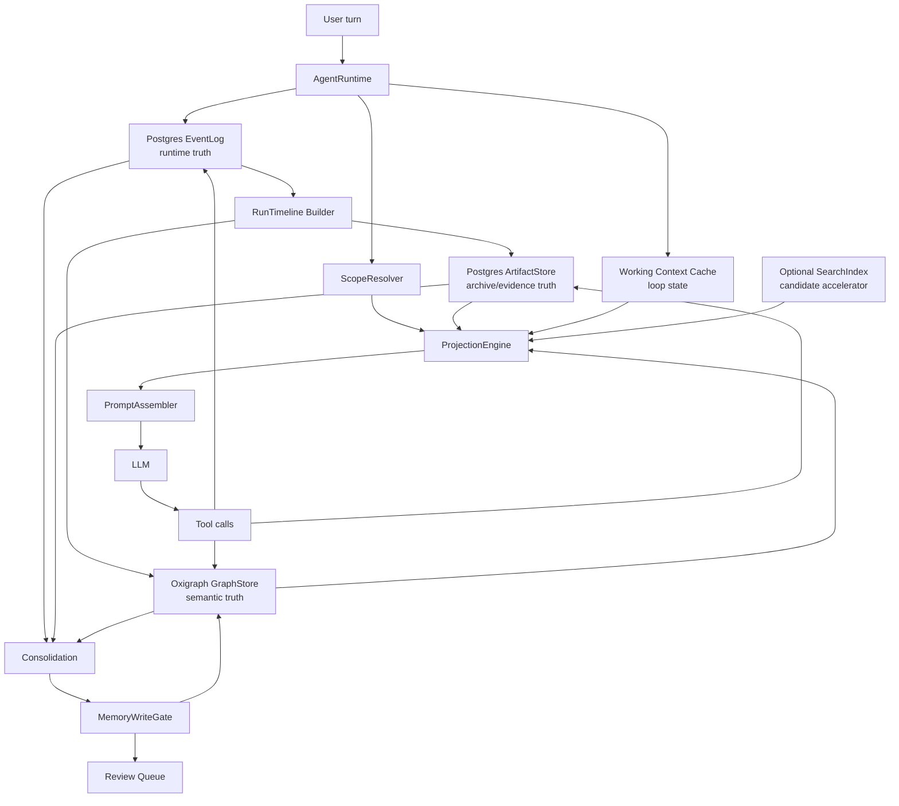

# Pulsara 记忆系统最终形态蓝图

## 0. 文档定位

本文档描述 Pulsara 记忆系统的最终自洽形态。它不讨论阶段性简化，也不把当前代码状态当成设计上限。它回答四个问题：

1. Agent 在真实运行中如何使用记忆。
2. Prompt 如何由当前任务、运行状态、记忆投影和工具边界组装。
3. 记忆如何组织、写入、落盘、召回、更新和遗忘。
4. 如何吸收 MiMo-Code 的工程经验，同时避免退化成全文检索驱动的普通 RAG。

配套文档分工：

```text
MEMORY_SYSTEM_IMPLEMENTATION_DETAILS.zh.md
  定义 JSON-LD / RDF / ontology / scope / write gate / recall 的实现细则。

MEMORY_RUNTIME_GOVERNANCE.zh.md
  定义运行时治理、写入边界、projection 和 maintenance 的规则。

RUNTIME_STORAGE_ARCHITECTURE.zh.md
  定义 Postgres + Oxigraph + ArtifactStore 的事实边界。

本文档
  定义最终系统在真实 agent 行为中的端到端形态。
```

本文档的核心立场：

```text
Pulsara 的记忆不是聊天记录。
Pulsara 的记忆不是向量库 top-k。
Pulsara 的记忆不是 Markdown 摘要。
Pulsara 的记忆不是让模型每轮主动搜索一堆工具。

Pulsara 的记忆是 evidence-backed semantic projection system:
  Postgres 保存 runtime truth。
  ArtifactStore 保存 evidence truth。
  Oxigraph 保存 semantic truth。
  ProjectionEngine 生成当前 prompt 可用的最小记忆视图。
  Agentic memory tools 只在需要深查、写入、审查、遗忘时介入。
```

## 1. 从 MiMo-Code 吸收什么，不吸收什么

MiMo-Code 的记忆系统可以概括为：

```text
raw trajectory
  -> checkpoint.md / MEMORY.md / notes.md
  -> SQLite FTS5 / BM25
  -> memory tool search
  -> dream / distill 离线整理
```

它最值得学习的是治理，而不是存储本体。

Pulsara 应吸收：

```text
raw trajectory authoritative
  原始运行轨迹永远比整理后的记忆更权威。

checkpoint discipline
  当前任务状态必须能被压缩、恢复、继续执行。

budgeted injection
  进入 prompt 的记忆必须有预算，不能无限堆积。

dream / distill separation
  durable memory consolidation 和 reusable workflow packaging 是两件事。

write guard
  不是所有 agent 都能直接改长期记忆。

verification against raw trajectory
  长期记忆必须能回到原始证据。
```

Pulsara 不应照搬：

```text
Markdown 文件作为 canonical memory store
  Markdown 可以作为导出视图，但不能作为长期语义记忆的事实源。

BM25 命中直接进入 prompt
  全文检索只能生成候选，不能决定最终召回内容。

项目 MEMORY.md 作为唯一长期记忆
  长期记忆必须有 scope、type、evidence、status 和 lifecycle。

手工搜索作为默认记忆路径
  默认路径应该是自动 projection，agentic search 只用于深查。
```

MiMo-Code 中的概念在 Pulsara 中应被这样转译：

```text
MiMo raw trajectory
  -> Pulsara Postgres EventLog + ArtifactStore

MiMo checkpoint.md
  -> Pulsara RunTimeline + Task Graph + recoverable projection snapshot

MiMo MEMORY.md
  -> Pulsara Durable Semantic Memory 的人类可读导出视图

MiMo SQLite FTS
  -> Pulsara SearchIndex 候选器，可删除、可重建、不可作为事实源

MiMo dream
  -> Pulsara Consolidation pipeline + MemoryWriteGate

MiMo distill
  -> Pulsara Skill / Workflow / ActionBoundary extraction

MiMo memory path guard
  -> Pulsara MemoryWriteGate + scope/write policy
```

## 2. 最终系统拓扑



最终系统中有三类真相源：

```text
EventLog
  runtime truth: 发生过什么，顺序是什么，能否 replay。

ArtifactStore
  evidence truth: 原文、工具输出、timeline snapshot、大对象和附件在哪里。

GraphStore
  semantic truth: 什么值得记住，它是什么类型，属于哪个 scope，由什么证据支撑，是否 active。
```

SearchIndex 不是真相源。它只是可重建的候选器。

## 3. 五层职责与物理落盘

### 3.1 Working Context Cache

职责：

```text
保存当前 loop 的短期状态。
帮助模型继续当前步骤。
记录当前 projection 中出现过的 @id，支持 context fencing。
```

典型内容：

```text
current run / turn / reply
active task id
tool queue
recent tool failures
token budget estimate
projection item ids
temporary scratchpad
current user intent
```

落盘策略：

```text
默认不作为长期事实落盘。
必要时可被 RunTimeline snapshot 捕获为恢复线索。
只有经过 MemoryCandidate + MemoryWriteGate 后，才可能晋升为长期语义记忆。
```

禁止事项：

```text
不得保存完整历史。
不得保存大段工具输出。
不得把 recalled memory 原样变成新 memory。
不得被当作 GraphStore 的事实来源。
```

### 3.2 Task Graph / Blackboard

职责：

```text
表示当前 run / task 的执行证据图。
记录工具结果、artifact、evidence、claim、decision 的关系。
支持当前任务内的推理、回放和解释。
```

核心节点：

```text
RunTimeline
Turn
ToolResult
Artifact
Evidence
Claim
Decision
```

落盘策略：

```text
EventLog 保存原始事件。
ArtifactStore 保存 timeline payload、长工具输出和原始证据。
GraphStore 保存可查询的 execution/evidence JSON-LD 节点。
```

边界：

```text
Turn / ToolResult / Artifact / Evidence 是 runtime provenance，可以由 runtime 自动追加。
Claim / Decision 是结论节点，必须经过 gate 才能成为 active 结论。
Task Graph 默认不是跨 session 长期记忆，但可以作为长期记忆的证据来源。
```

### 3.3 Durable Semantic Memory

职责：

```text
保存跨 session 有未来行动价值的语义记忆。
以 JSON-LD 为 canonical object。
以 RDF quads / SPARQL 为查询事实层。
```

核心类型：

```text
Preference
ActionBoundary
Decision
WorldFact
ExperienceFact
Observation
MentalModel
Skill
Tool
ProjectionPolicy
MemoryPolicyVersion
```

每条 durable memory 必须包含：

```text
@id
@type
scope
statement or summary
createdFrom or hasEvidence
confidenceLevel
verificationStatus
sourceAuthority
status
createdAt
updatedAt
```

强烈建议包含：

```text
why
howToApply
appliesWhen
doNotApplyWhen
staleAfter
expiresAt
supersedes
contradicts
relatedSkill
relatedArtifact
```

禁止事项：

```text
不保存完整聊天记录。
不保存原始工具输出全文。
不保存可通过文件/git/实时工具重新获得的信息。
不保存未经确认的敏感推断。
不保存一次性情绪或闲聊。
```

### 3.4 Archive / Blob Store

职责：

```text
保存原文和大对象。
提供 evidence replay。
为 GraphStore 的 semantic node 提供 provenance target。
```

保存对象：

```text
完整 RunTimeline JSON
完整 tool stdout/stderr
完整 LLM response
大文档正文
网页抓取原文
截图、文件快照、附件
长错误日志
compaction boundary payload
```

落盘策略：

```text
PostgresArtifactStore 先承载 artifact。
未来可迁移到 S3/R2/local blob。
GraphStore 只引用 artifact id，不依赖具体 blob 后端。
```

图中只保存：

```text
artifact @id
storedAs / storedAt
digest
mediaType
summary
createdFrom
scope
```

### 3.5 Prompt Projection

职责：

```text
把 GraphStore、ArtifactStore、EventLog、Working Context 中的材料转成当前 prompt 可用的最小视图。
它是 view，不是 store。
它是每轮默认记忆访问路径。
```

Projection 输出应包含：

```text
selected memory items
short summaries
@id references
scope and status
confidence and verification
warnings
stale / contradiction notes
deep recall affordances
```

Projection 不允许：

```text
不允许作为 canonical memory 写回。
不允许省略 @id。
不允许把 SearchIndex snippet 直接塞给模型。
不允许把 recalled memory 混同为本轮用户新输入。
```

## 4. Scope 与 named graph 组织

每轮必须解析 scope。scope 不是装饰字段，而是记忆系统的主索引之一。

常见 scope：

```text
ctx:user/<user_id>
ctx:agent/<agent_id>
ctx:session/<session_id>
ctx:task/<task_id>
ctx:workspace/<workspace_id>
ctx:domain/<domain_id>
ctx:artifact/<artifact_id>
ctx:skill/<skill_id>
ctx:team/<team_id>
```

`ScopeResolver` 输入：

```text
user message
runtime_session_id
run_id / turn_id
active task id
workspace root / git root
attached artifacts
recent tool calls
current projection ids
explicit scope phrases
```

显式 scope 短语示例：

```text
"以后都这样"
  倾向 UserScope 或 AgentScope，但仍需看内容是否过宽。

"只在这个项目"
  WorkspaceScope。

"这次会话"
  SessionScope。

"这个 repo 以后"
  WorkspaceScope + possible DomainScope。

"写 Python agent 时"
  DomainScope 或 SkillScope。
```

`ScopeResolver` 输出：

```json
{
  "activeScopes": [
    "ctx:user/plumliu",
    "ctx:agent/pulsara-default",
    "ctx:session/runtime-20260612",
    "ctx:workspace/pulsara-agent",
    "ctx:domain/jsonld-memory-system"
  ],
  "writeDefaultScope": "ctx:workspace/pulsara-agent",
  "recallScopes": [
    "ctx:user/plumliu",
    "ctx:workspace/pulsara-agent",
    "ctx:domain/jsonld-memory-system"
  ],
  "scopeWarnings": []
}
```

Named graph 建议：

```text
graph:user/<user_id>
graph:agent/<agent_id>
graph:session/<session_id>
graph:runtime/<runtime_session_id>
graph:workspace/<workspace_id>
graph:domain/<domain_id>
graph:skill/<skill_id>
```

同一个 semantic node 可以被多个 scope 引用，但不应无意义复制。跨 scope 复用时，应优先用关系边表达：

```text
mem:relatedTo
mem:appliesToScope
mem:derivedFrom
mem:supersedes
```

## 5. Prompt 组装

Prompt 不是把所有记忆拼成一大段。最终系统的 prompt 组装应由 `PromptAssembler` 完成，输入来自：

```text
static system/developer policy
runtime state
tool registry
scope resolution
memory projection
recent conversation reducer
current user message
```

推荐顺序：

```text
1. Core system contract
2. Tool and runtime contract
3. Current task/run state
4. Memory projection
5. Recent conversation window
6. Current user message
7. Response/output constraints
```

### 5.1 Core system contract

这部分稳定、短小、优先级最高。它定义 agent 的身份、边界、安全规则和工具使用总原则。

它不应包含大量项目记忆。

### 5.2 Tool and runtime contract

这部分告诉模型：

```text
有哪些工具
哪些工具需要谨慎
工具结果如何被记录
何时使用 memory tools
何时不使用 memory tools
```

关键规则：

```text
默认不为每轮用户消息调用 memory_search。
如果 projection 已提供足够记忆，不要重复搜索。
如果需要完整证据，通过 @id 调用 memory_get 或 history_search。
memory_write 只提交候选或明确请求，不绕过 gate。
```

### 5.3 Current task/run state

这部分来自 Working Context Cache 和 RunTimeline summary。它回答：

```text
当前用户要什么？
当前任务做到哪一步？
哪些工具调用刚刚发生？
哪些文件/资源处于 active 状态？
有没有未解决错误？
有没有正在运行的子任务？
```

它可以包含短期状态，但不能假装是长期事实。

### 5.4 Memory projection

Projection 是默认记忆入口。它应以清晰 fence 注入：

```text
<memory_projection source="pulsara" policy="do-not-write-back-verbatim">
Scope:
  active: ctx:user/plumliu, ctx:workspace/pulsara-agent
  write_default: ctx:workspace/pulsara-agent

Action boundaries:
  - [mem:boundary/git-commit-after-user-approval]
    Summary: 用户希望在重大 runtime 修改前后显式确认 git add/commit 节点。
    Applies when: 修改 runtime 或 durable storage 代码。
    Status: active, verified: user_confirmed.

Decisions:
  - [mem:decision/postgres-eventlog-oxigraph-graphstore]
    Summary: EventLog 和 ArtifactStore 使用 Postgres，GraphStore 使用 Oxigraph。
    Why: 运行事实与语义事实分离，图只引用 event/artifact id。
    Status: active.

Warnings:
  - [mem:decision/searchindex-candidate-only]
    SearchIndex 只能作为候选器，不能作为事实源。

Deep recall:
  Use memory_get(@id) if exact evidence or full JSON-LD is needed.
</memory_projection>
```

模型必须知道：

```text
projection 是 recalled memory。
projection 可以指导行动。
projection 不能被原样写成新 memory。
projection 中的 @id 是深查入口。
projection 中的 stale/contradicted item 必须谨慎使用。
```

### 5.5 Recent conversation window

近期对话窗口解决语言连续性、短期引用和当前上下文。但它不替代 EventLog。

Reducer 应优先保留：

```text
最新用户请求
未完成承诺
工具结果摘要
assistant 当前推理结论
用户纠正
可能影响后续行动的约束
```

### 5.6 Current user message

当前用户消息应保持原文，不被 projection 或 summary 改写。

如果当前用户消息与 memory projection 冲突，模型应优先处理冲突：

```text
用户明确覆盖旧规则时，遵循当前用户消息，并提交 memory_update candidate。
用户只是临时例外时，遵循当前消息，但不自动改长期记忆。
旧 memory stale 时，提示需要验证或走 memory_get/history_search。
```

## 6. 每轮 agent 行为模拟

### 6.1 普通执行轮

用户说：

```text
帮我审查刚刚新写的 PostgresArtifactStore。
```

系统行为：

```text
1. RuntimeSession emit RunStartEvent。
2. EventLog append runtime event，分配 canonical sequence。
3. ScopeResolver 解析 workspace scope、session scope、domain scope。
4. ProjectionEngine 查询 Oxigraph：
   - 当前 workspace 下 active ActionBoundary。
   - storage/domain 相关 Decision。
   - 最近与 PostgresArtifactStore 相关 RunTimeline。
   - stale/contradicted warnings。
5. PromptAssembler 注入 memory_projection。
6. LLM 发现需要看代码，调用 read_file / rg。
7. 工具调用事件进入 EventLog。
8. 长工具输出进入 ArtifactStore，并在 GraphStore 留 artifact metadata。
9. Runtime hook 记录 ToolResult / RunTimeline。
10. LLM 输出审查 findings。
11. RuntimeSession emit RunEndEvent。
12. RunTimelinePersistenceHook 把 timeline snapshot 写入 ArtifactStore，把 RunTimelineRecord 写入 Oxigraph。
13. Consolidation 只产生候选，不自动把所有 findings 写入 Durable Semantic Memory。
```

进入长期记忆的可能内容：

```text
如果用户确认某个 storage 边界设计是长期决策：
  写入 mem:Decision。

如果审查发现重复出现的坑：
  先写入 mem:ExperienceFact candidate。

如果用户说"以后遇到 Postgres parent ownership 都要测 race":
  写入 mem:ActionBoundary candidate，gate 后 active。
```

不会进入长期记忆的内容：

```text
完整 pytest 输出。
一次性失败堆栈。
read_file 的完整源码。
assistant 临时推理草稿。
已经存在于代码文件里的普通结构信息。
```

### 6.2 用户明确要求记住

用户说：

```text
以后审查 runtime publisher 时，先看是否会阻塞工具线程。
```

系统行为：

```text
1. ScopeResolver 识别 "以后"。
2. 根据内容判断 scope:
   - 若当前在 pulsara_agent repo 内，优先 WorkspaceScope。
   - 若用户说所有 agent runtime 都这样，扩大到 DomainScope。
3. MemoryCandidate:
   type: ActionBoundary
   statement: 审查 runtime publisher 时，先检查工具线程是否被 subscriber 反压阻塞。
   appliesWhen: code review or design review for runtime publisher / emit_from_thread / hook publishing.
   doNotApplyWhen: user asks unrelated feature or non-runtime module.
   sourceAuthority: explicit_user_instruction
   verificationStatus: user_confirmed
   evidence: current turn event id
4. MemoryWriteGate 检查 scope、future utility、敏感性、重复项。
5. 若通过，写入 Oxigraph Durable Semantic Memory。
6. Postgres EventLog 保留原始用户句子作为 evidence。
```

下一次相关审查时，Projection 自动包含这条 ActionBoundary。模型不需要主动搜索。

### 6.3 用户模糊追问旧事

用户说：

```text
上次那个 emit_from_thread 卡住的问题到底是什么来着？
```

系统行为：

```text
1. ScopeResolver 识别当前 workspace/domain。
2. ProjectionEngine 先用 SPARQL 查相关 ActionBoundary / Decision / ExperienceFact。
3. 如果结构化候选不足，再使用 SearchIndex 作为候选器，查 "emit_from_thread 卡住"。
4. SearchIndex 返回 candidate ids，不直接进入 prompt。
5. Oxigraph 根据 candidate ids 查：
   - status 是否 active。
   - 是否被 superseded。
   - 关联 evidence / RunTimeline / artifact。
6. 如果需要原文，ArtifactStore/EventLog 加载相关 timeline 或 event slice。
7. Projection 注入简短解释和 @id。
8. LLM 回答，并可引用 "我可以继续拉完整 evidence"。
```

这不是每轮 agentic RAG，而是 projection 不足时的深查。

### 6.4 旧记忆被当前用户覆盖

旧 memory：

```text
mem:boundary/no-auto-commit
  statement: 不要自动 commit，除非用户明确要求。
```

用户说：

```text
这次你可以直接 commit。
```

系统行为：

```text
1. 当前用户消息优先于旧 projection。
2. 因为用户说"这次"，ScopeResolver 标记为 SessionScope override。
3. Agent 可以执行 commit。
4. 不更新长期 ActionBoundary。
5. RunTimeline 记录这次例外。
```

如果用户说：

```text
以后你完成修改后可以直接 commit。
```

系统行为：

```text
1. 生成 memory_update candidate。
2. 找到旧 boundary。
3. 需要确认这是否覆盖旧规则，或标记旧规则 superseded。
4. MemoryWriteGate 要求 sourceAuthority 为 explicit_user_instruction。
5. Projection 后续只召回 active 版本，并在需要时保留 supersedes 关系。
```

### 6.5 长工具输出

工具返回 20,000 字 pytest 输出。

系统行为：

```text
1. EventLog 保存 tool result event 和 sequence。
2. ArtifactStore 保存完整输出，带 digest 和 media_type。
3. GraphStore 写 ToolResult:
   - outputSummary: 简短摘要。
   - truncated: true。
   - storedAs: artifact:<id>。
   - eventSpan: sequence 范围。
4. Projection 只使用 outputSummary。
5. 如果 LLM 需要完整失败细节，再通过 artifact id 深查。
```

完整输出不进 Durable Semantic Memory。

### 6.6 Consolidation

Consolidation 不是总结聊天记录。它负责把短期材料转成可治理的长期记忆。

输入：

```text
RunTimeline
ToolResult
Evidence
explicit remember requests
user corrections
failed actions
repeated recall hits
existing memory graph
artifact summaries
```

输出：

```text
MemoryCandidate
ReviewItem
supersede proposal
stale proposal
Skill extraction proposal
```

Consolidation 不能直接绕过 gate。

## 7. 记忆写入管线

写入入口分为三类：

```text
explicit user write
  用户明确要求记住、以后这样、不要再这样。

runtime evidence write
  runtime 自动记录 ToolResult、Artifact、RunTimeline、Evidence。

consolidated semantic write
  后台从 evidence 中提取长期候选。
```

完整管线：

```text
source material
  -> source attribution
  -> ScopeResolver
  -> MemoryCandidate
  -> type classification
  -> evidence attach
  -> sensitive data scan
  -> derivability check
  -> duplicate search
  -> contradiction search
  -> lifecycle decision
  -> MemoryWriteGate
  -> JSON-LD canonical object
  -> RDF quads in Oxigraph
  -> optional SearchIndex update
  -> projection cache invalidation
```

`MemoryCandidate` 应至少包含：

```text
candidate_id
candidate_type
statement
scope
source_material_refs
evidence_refs
source_authority
verification_status
confidence_signal
proposed_status
applies_when
do_not_apply_when
stale_after
supersedes
contradicts
created_from_projection_ids
```

Gate 必须检查：

```text
future utility
scope correctness
evidence availability
sensitive data
derivable from live tools
duplicate or near duplicate
contradiction
staleness policy
user authority
action impact
context fencing
```

Gate 决策：

```text
accept_active
accept_candidate
needs_review
reject_duplicate
reject_derivable
reject_sensitive
reject_low_utility
reject_unscoped
reject_memory_echo
supersede_existing
mark_stale
```

## 8. 记忆召回与 projection

默认召回不是全文检索。默认召回应优先使用结构化语义。

召回顺序：

```text
1. ScopeResolver 确定 recall scopes。
2. SPARQL 查询 scope/type/status/relation。
3. 当前 run 的 Working Context 和 RunTimeline 提供短期材料。
4. ArtifactStore 只在需要证据细节时加载。
5. SearchIndex 仅在结构化查询不足或用户表述模糊时补充候选。
6. Reranker 合并、过滤、排序。
7. ProjectionEngine 生成当前角色和预算下的 projection。
```

排序信号：

```text
scope match
type relevance
relation distance
status
verificationStatus
sourceAuthority
evidence strength
recency
staleness risk
tool/action relevance
user explicit recall request
token cost
```

Projection budget 应按类型分配：

```text
ActionBoundary
  最高优先级。它改变 agent 行动。

UserPreference
  高优先级。但不能覆盖当前用户消息。

Decision
  高优先级。解释为什么系统当前这样设计。

Recent RunTimeline
  中高优先级。帮助恢复当前任务。

ExperienceFact / Observation
  中优先级。帮助避免重复失败。

WorldFact
  中低优先级。除非当前问题需要。

Raw artifact summary
  低优先级。只有必要时进入。
```

Projection item 格式：

```json
{
  "@id": "mem:decision/postgres-eventlog-oxigraph",
  "@type": "Decision",
  "scope": "ctx:workspace/pulsara-agent",
  "summary": "EventLog 和 ArtifactStore 使用 Postgres，GraphStore 使用 Oxigraph。",
  "why": "运行事实和语义事实分离，图只引用 event/artifact id。",
  "status": "active",
  "verificationStatus": "user_confirmed",
  "sourceAuthority": "explicit_user_instruction",
  "evidence": ["event:runtime-123:seq:42"],
  "deepRecall": "memory_get mem:decision/postgres-eventlog-oxigraph"
}
```

Projection warnings：

```text
stale memory included
conflicting memories found
scope ambiguity
evidence unavailable
candidate only, not active
search-index-only candidate omitted
```

## 9. SearchIndex 的位置

SearchIndex 可以存在，但必须被约束。

它不是第四个真相源，不是 EventLog 的升级版，也不是 GraphStore 的替代品。

正确定位：

```text
SearchIndex = recall candidate accelerator
```

允许索引：

```text
semantic node @id
graph_id
scope
type
statement
summary
aliases
status
artifact_id
source_event_id
updated_at
```

不允许索引成为唯一来源：

```text
不能只存在于 SearchIndex。
不能直接写入 prompt。
不能决定 active/stale/superseded。
不能绕过 Oxigraph relation expansion。
不能承担 memory_write。
```

SearchIndex 查询结果必须是候选 id：

```text
candidate node ids
candidate artifact ids
candidate event refs
score and snippet for debugging
```

随后必须回到 GraphStore / ArtifactStore：

```text
SearchIndex hit
  -> Oxigraph status/relation/evidence expansion
  -> ArtifactStore evidence load if needed
  -> ProjectionEngine
```

系统必须支持禁用 SearchIndex：

```text
没有 SearchIndex 时，ScopeResolver + SPARQL + ArtifactStore 仍能生成有效 projection。
删除 SearchIndex 不丢事实。
SearchIndex 可从 Oxigraph JSON-LD + Postgres artifacts 重建。
```

## 10. Agentic memory tools

Memory tools 是深查、写入、审查和治理入口，不是每轮默认动作。

推荐工具：

```text
memory_project
  为当前 role/scope/budget 生成 projection。通常由系统自动调用，不必暴露给模型频繁使用。

memory_search
  按 query + scope + type 查候选 semantic memories。返回 @id，不返回最终真相。

memory_get
  按 @id 获取完整 JSON-LD 和证据摘要。

memory_explain
  解释某条 memory 的 evidence、supersedes、contradicts、status 和 provenance。

memory_write
  提交 MemoryCandidate。不能绕过 gate。

memory_update
  提交 merge / replace / supersede / mark stale 候选。

memory_forget
  删除、redact 或标记 deleted / archived / stale。需要权限和审计。

memory_review
  查看 needs_review、冲突、重复、过期候选。

history_search
  搜原始 EventLog / ArtifactStore，用于找旧对话、原始工具输出、verbatim evidence。
```

何时使用 memory tools：

```text
用户明确要求回忆过去。
projection 给出 @id 但细节不足。
当前任务需要验证旧决策的证据。
用户要求保存、修改或忘记记忆。
出现 projection conflict。
需要查找原始 verbatim 信息。
```

何时不要使用：

```text
projection 已足够回答。
问题完全依赖当前文件/工具实时读取。
用户问一次性闲聊。
只是为了增加上下文而搜索。
模型想验证自己刚刚生成的内容。
```

## 11. 落盘组织

### 11.1 EventLog: Postgres

职责：

```text
append-only runtime event stream
canonical sequence allocation
replay and recovery
runtime audit
tool execution records
```

典型表：

```text
sessions
runs
turns
agent_events
tool_execution_records
```

约束：

```text
EventLog 不保存 canonical semantic memory。
EventLog 不负责 memory recall。
EventLog 可被 history_search 索引，但不是 memory_search 的事实层。
```

### 11.2 ArtifactStore: Postgres first, blob later

职责：

```text
store immutable artifact payloads
store media type and metadata
store digest
support artifact id lookup
support provenance references
```

典型表：

```text
artifacts
  id
  media_type
  content
  digest
  metadata
  session_id
  run_id
  created_at
```

约束：

```text
artifact id 不应因后端迁移改变。
GraphStore 只引用 artifact id。
artifact payload 不直接进入 GraphStore。
```

### 11.3 GraphStore: Oxigraph

职责：

```text
store JSON-LD semantic nodes as RDF quads
support named graph isolation
support SPARQL relation query
support lifecycle filtering
support provenance graph traversal
```

核心 named graph：

```text
graph:runtime/<runtime_session_id>
graph:session/<session_id>
graph:workspace/<workspace_id>
graph:domain/<domain_id>
graph:user/<user_id>
graph:agent/<agent_id>
```

核心关系：

```text
mem:scope
mem:createdFrom
mem:hasEvidence
mem:derivedFrom
mem:storedAs
mem:supports
mem:contradicts
mem:supersedes
mem:appliesWhen
mem:doNotApplyWhen
```

约束：

```text
GraphStore 不保存完整 event stream。
GraphStore 不保存大 blob。
GraphStore 是 semantic truth。
GraphStore 的 JSON-LD 必须可展开为 RDF quads。
```

### 11.4 SearchIndex: optional

职责：

```text
accelerate fuzzy recall
support lexical / vector / hybrid candidate search
return ids only
```

约束：

```text
可删除。
可重建。
不可作为事实源。
不可直接进 prompt。
```

## 12. Lifecycle 与冲突治理

每条 durable memory 必须有 lifecycle status：

```text
candidate
active
needs_review
stale
superseded
contradicted
deleted
archived
```

Projection 默认只召回：

```text
active
needs_review when user asks for review
stale only with warning
contradicted only with conflict warning
superseded only when explaining history
```

冲突处理：

```text
新记忆与旧记忆冲突
  -> 查 sourceAuthority 和 verificationStatus。
  -> 用户明确指令优先于推断。
  -> 当前用户消息优先于旧 projection。
  -> 不自动删除旧记忆，优先建立 contradicts/supersedes。

旧记忆过期
  -> 标记 stale。
  -> Projection 提醒验证。
  -> 重新验证后 active 或 superseded。

用户要求忘记
  -> 根据权限执行 redaction / deleted / archived。
  -> EventLog 是否可物理删除取决于合规策略。
  -> GraphStore semantic node 不再进入 projection。
```

## 13. Context fencing

Context fencing 是防止 memory echo 的核心机制。

每轮输入材料必须标注来源：

```text
new_user_message
assistant_generated_this_turn
tool_result_this_turn
recalled_memory_projection
history_search_result
artifact_loaded_by_id
system_policy
```

写入规则：

```text
recalled_memory_projection 不能原样写回。
history_search_result 不能直接变成 durable memory，必须有新证据或用户确认。
tool_result 可以生成 evidence，但不自动生成 active claim。
assistant_generated_this_turn 可以生成 candidate，但需要 evidence 和 gate。
new_user_message 中的明确指令可成为 high-authority candidate。
```

Projection 中应包含 fence metadata：

```json
{
  "projectionId": "projection:runtime-123:turn-9",
  "items": [
    {
      "@id": "mem:boundary/publisher-nonblocking",
      "source": "recalled_memory",
      "writeBackPolicy": "do_not_write_back_verbatim"
    }
  ]
}
```

Consolidation 必须知道哪些 candidate 使用了 recalled memory。没有新证据时，应拒绝 memory echo。

## 14. 角色化 projection

不同 agent role 不应看到同一份记忆。

示例角色：

```text
Planner
  需要目标、约束、决策、任务状态、风险。

Executor
  需要当前步骤、文件范围、工具边界、最近失败、动作限制。

Reviewer
  需要历史 bug、代码审查偏好、相关设计决策、风险模式。

Curator
  需要 evidence、candidate、重复项、冲突、staleness。

Skill Distiller
  需要重复 workflow、工具序列、失败模式、已有 skill。
```

同一条 memory 在不同 role 中的投影不同：

```text
ActionBoundary
  Executor: "不要做 X，除非 Y。"
  Reviewer: "检查实现是否违反 X。"
  Curator: "该 boundary 是否过期、重复、被覆盖？"

Decision
  Planner: "当前架构为何如此。"
  Executor: "实现时遵守该决策。"
  Reviewer: "评估变更是否破坏该决策。"
```

## 15. 与真实 LLM 的交互方式

模型不应被要求理解整个存储系统。它只需要看到清晰的行为合同：

```text
1. 你会收到一个 memory_projection。
2. projection 是 recalled memory，不是当前用户新说的话。
3. projection 中的 @id 可用于 deep recall。
4. 不要每轮默认搜索记忆。
5. 当用户要求记住、修改、忘记时，调用 memory_write/update/forget。
6. 当旧记忆与当前用户冲突时，当前用户优先，并提交 update candidate。
7. 不要把 projection 原样写回 memory。
8. 需要 verbatim evidence 时，用 history_search 或 artifact lookup。
```

模型看见的 memory tools 描述必须短、强约束、示例清楚。不要把 ontology 全塞给模型。

## 16. 最终验收标准

系统达到最终形态时，应满足这些性质：

```text
禁用 SearchIndex 后，projection 仍能基于 scope/type/relation 工作。

删除 ArtifactStore payload 会让 evidence 不完整，但 GraphStore 能报告 evidence unavailable。

删除 GraphStore semantic nodes 不影响 EventLog replay。

删除 EventLog 会破坏 runtime audit，因此 GraphStore 不能声称孤立记忆仍完全可信。

LLM 无法绕过 MemoryWriteGate 写 active durable memory。

Projection 中的每个长期记忆都有 @id。

Projection 中 stale/contradicted memory 带 warning。

ActionBoundary 缺少 appliesWhen / doNotApplyWhen / sourceAuthority 时不能 active。

用户明确纠正会生成 update candidate，而不是简单追加重复 memory。

长工具输出只进 ArtifactStore，GraphStore 只保留 summary 和 storedAs。

RunTimeline 可以从 Postgres EventLog + ArtifactStore + Oxigraph record 回放。

memory_search 返回候选，memory_get 返回证据，ProjectionEngine 决定进入 prompt 的最终视图。

Consolidation 输出 candidate/review/supersede proposal，不直接污染 durable semantic memory。
```

## 17. 一句话最终形态

Pulsara 的最终记忆系统应是：

```text
以 Postgres EventLog 保存可 replay 的运行事实，
以 Postgres ArtifactStore 保存可验证的原文证据，
以 Oxigraph 保存有 scope、type、evidence、status 和关系的 JSON-LD/RDF 语义事实，
以 ProjectionEngine 为每轮 prompt 生成短小、带 @id、可追溯、受预算控制的记忆视图，
以 MemoryWriteGate 和 context fencing 防止长期记忆污染，
以 agentic memory tools 支持按需深查、写入、审查和遗忘，
以 SearchIndex 作为可删除可重建的候选加速器，而不是事实源。
```

这就是 Pulsara 与 MiMo-Code 的根本区别：

```text
MiMo-Code 把 raw trajectory 整理成高质量 Markdown memory，再用全文检索召回。
Pulsara 把 raw trajectory 转化为 evidence-backed semantic graph，再用 projection 控制进入模型的记忆视图。
```

最终目标不是让模型更会搜索过去，而是让模型在每一轮都站在正确、可验证、不过量、不过期的记忆视图上行动。
