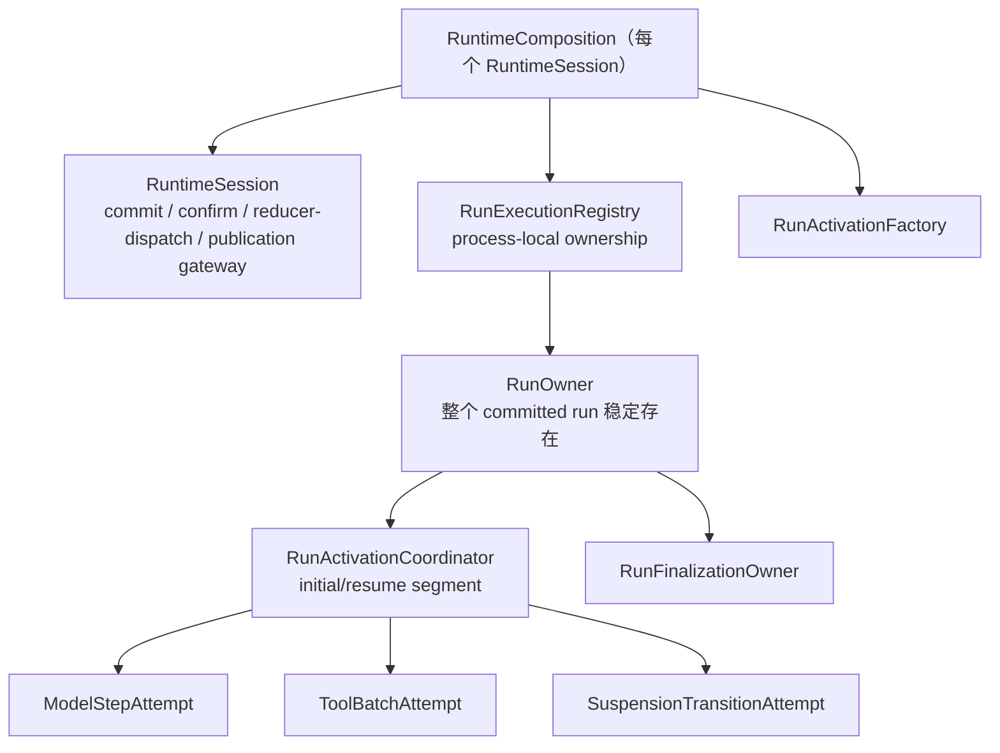

# Pulsara AgentRuntime / HostSession Run Ownership Hard Cut 实施规格

_状态：D6 CLOSED（2026-07-29，D6-0–D6-5 与 DoD 已核验）_

_起草日期：2026-07-28_

_债务编号：`D6`_

本文档冻结 `PULSARA_RUNTIME_ARCHITECTURE_DEBT_REBASE.zh.md` 中 D6 的代码落地方案。目标不是简单拆小 `runtime/agent.py` 与 `host/session.py`，而是完成一次 run ownership hard cut：

1. 将一个 committed run 的稳定 ownership 与每次 initial/resume activation 的短期 execution ownership 分开；
2. 将 `RunWorkingSet` 中混合的 genesis authority、可换版 authority、进度状态与物理资源拆成四类单一 owner；
3. 让 Host 只消费 typed run handle、activation outcome 与 observer stream，不再读取 `LoopState`；
4. 将通用 run registry/factory 下沉为 session-scoped process-local service，供 Host 与 child/subagent 共用；
5. 将 model step、tool batch、interaction suspension 与 run terminalization 收敛为独立 typed attempt；
6. 删除 production `LoopState.scratchpad`、Host/Agent 双驱动、child 手工构造 `AgentRuntime` 与全能 `RuntimeSession` service-locator 依赖；
7. 关闭 D4/D5 后保留的 `host/runtime/llm/memory/...` 全局 import SCC。

这是一轮不兼容 hard cut。旧 `AgentRunResult.state`、旧 scratchpad key、旧 Host 驱动入口和旧 child callback 不提供兼容 shim、双写期或 lazy import facade。

---

## 0. 结论先行

最终结构必须明确区分稳定 run 与可轮换 activation：



一个 run 的合法轨迹是：

```text
RunOwner
  INITIALIZING + AWAITING_INITIAL_REVISION + BOUND      # normal live handoff
  -> OPEN + ACTIVE(activation generation 1)
  -> SUSPENDED
  -> INITIALIZING + INSTALLED_CONTINUATION              # resolution FULL, activation pending
  -> OPEN + ACTIVE(activation generation 2)
  -> SUSPENDED
  -> INITIALIZING + INSTALLED_CONTINUATION
  -> OPEN + ACTIVE(activation generation 3)
  -> TERMINALIZING
  -> TERMINAL

reopen-only resource branch:
  INITIALIZING + UNBOUND(rebind-pending | terminal-only)
```

因此：

- 不新增一个同时代表 durable run 与 active segment 的长期 `AgentRunCoordinator`；
- 若保留 `AgentRuntime` 名称，它只可作为窄的 activation service/facade，不能成为 run authority、segment task owner或 `RuntimeSession` service locator；
- 一个 committed run 只有一个稳定 `RunOwner`；
- 每次 initial/resume 都创建新的 `RunActivationCoordinator` 与单调递增的 activation generation；
- run finalization 挂在 `RunOwner` 上，不能依赖 active activation 仍存活；
- Host 的 `run_turn()` 与 `stream_turn()` 使用同一个 service-owned driver；streaming 只是 observer subscription，不拥有或取消 driver；
- `RuntimeSession` 是唯一 commit/confirm/reducer-dispatch/publication gateway，不是所有领域语义的唯一 owner，也不再兼任 execution registry。

### 0.1 审查意见闭环索引

| 审查意见 | 本规格冻结位置 |
|---|---|
| `AgentRunCoordinator` 混淆 durable run 与 active segment | 4、6、7：稳定 `RunOwner` + 每 activation 一个 coordinator |
| `RunWorkingSet` 只拆 authority/live 两层仍不够 | 5：genesis、authority revision、progress、resources 四层 |
| Host opaque contract 缺 outcome/handle | 8：closed outcome union、双 completion、observer contract |
| 通用 run registry 不能继续放在 Host | 4、6、16：session-scoped registry/factory 下沉到 runtime composition |
| 单一扁平 `RunPhase` 形成笛卡尔积 | 7：RunLifecycle、ActivationPhase、AttemptState 三层状态机 |
| ports 不能聚合成大包 | 11：按 capability 发放七类窄 port，禁止 `AgentRunPorts` |
| finalization 必须独立于 activation | 10：稳定 candidate、FULL/NONE/UNKNOWN、run completion |
| Host/child 必须共用 owner path | 13：共同 registry/factory 与 `CommittedRunEntry` union |
| scratchpad 必须逐 PR 删除 | 14、17：54 个已知 key 的 owner/删除阶段与单调 gate |
| golden 不应冻结内部实现 | 15：只冻结 durable trace、provider semantic input 与 typed outcome |
| SCC gate 不能只比较残余数量 | 18：exact canonical AST observation 集合与 forbidden-edge gate |
| durable schema范围必须最小且不能制造process-local dual truth | 3.4、3.5、17.1：强制child basis subcut与额外缺口规则 |
| pre-commit 尚无 RunStart sequence | 5.0、6.3：prepared reservation key 与 FULL 后 owner identity 分离 |
| RunStart FULL 到 initial exposure FULL 的中间态无法表达 | 5.2、6.2、7.1：initializing lifecycle、authority head与resource slot |
| genesis carrier与RunStart durable truth不一致 | 3.5、5.1：直接冻结完整RunStart typed facts，并强制补child capability basis |
| pending interaction使用不存在/重复DTO | 9：按四类真实durable event/fact exact-read，不重复MCP suspension字段 |
| resume试图改写已完成activation receipt | 9.3：immutable `InteractionResumeLinkReceipt` |
| child execution存在双owner | 13：child admission/session owner与common RunOwner穷尽拆分 |
| D6阶段存在opaque Host/child key删除冲突 | 14、17：typed outcome前移D6-1，child-specific删除延至D6-5 |
| scratchpad inventory漏四项 | 14、16：54项完整基线及memory/compaction修改面 |
| reconciliation没有repair出口 | 7.4：prior-state-bound exact repair receipt |
| generic commit port是writer escape hatch | 11.1：generic gateway仅implementation内部可见，公开port只接closed candidate handle |
| final output无法在reopen重建 | 8.1：唯一`RunFinalOutputMaterializer`与terminal completion规则 |
| live RunStart handoff后handle与`Unbound`冲突 | 5.2、6.3：promote与handle transfer原子生成`BoundRunResources`；`Unbound`仅用于reopen/rebind |
| 新activation identity与既有durable attribution双真源 | 5.0：closed `RunActivationSource`到`RunExecutionActivationFact`的唯一projection/join |
| continuation FULL后、activation安装前没有合法reopen状态 | 5.2、7.1、19.4：通用`INITIALIZING`与continuation rebind-pending |
| D6-1删除Host state早于interaction transition接线 | 11.6、17.2、17.4：最小transition/Host routing/slot consumption前移D6-1 |
| progress复制suspension/activation/finalization真值 | 5.3：删除三个镜像字段，snapshot在registry锁内组合 |
| child reopen没有可构造的capacity owner | 13.2、19.4：closed capacity slot与recovered occupancy barrier |
| reconciliation DTO与live/recovery repair矩阵不完整 | 7.4：完整owner-state identity、attempt/receipt与双模式repair |
| child basis validator越过nested fact可见边界 | 3.5：nested、RunStart、stored envelope、initial exposure四层validator |

---

## 1. 范围与非目标

### 1.1 本轮必须完成

- Host run boundary FULL 后，将 committed entry 与 execution handles 唯一移交给 `RunExecutionRegistry`；
- 初始 activation、每次 resume activation、child activation 都经过同一 registry/factory；
- Host 不再持有 `_active_state`、`_suspended_state`、`_preparing_state` 或 active driver task；
- `AgentRunResult` 不再暴露 `.state`，最终由 typed handle/outcome 取代；
- `RunWorkingSet.install_continuation()` 原地改写删除，改为 FULL 后的 immutable revision CAS；
- model/tool/interaction/finalization 只消费各自窄 port；
- `RuntimePublishedEvent` 与 hook input 不再携带完整 `LoopState`；
- production scratchpad 任意 key 归零，`LoopState.scratchpad` 字段物理删除；
- `AgentRuntime` 不再保存、读取或修改完整 `RuntimeSession`；
- HostCore 不再读取 `AgentRuntime` private field；
- remaining global package SCC 被 exact AST gate 证明关闭。

### 1.2 明确不做

- 不设计通用 workflow/DAG orchestration；
- 不重写 LLM provider adapter 或 model stream lifecycle；`LLMRuntime` 继续拥有 model physical lifecycle；
- 不重做 D3 projection job、D5 compaction-memory extraction 或 terminal monitor durable ownership；
- 不改变用户可见的 run/stream、approval、plan、MCP input-required、stop/close 语义；
- 不以缩短文件行数作为正确性证明；
- 不为旧 scratchpad、旧 `LoopState` 或旧 Host direct-driver API 保留兼容入口；
- 除3.5冻结的child initial capability basis最小schema subcut外，不扩大durable event vocabulary；任何新增缺口仍须先完成独立typed schema subcut。

### 1.3 行为冻结

硬切前后必须保持：

- 相同 human ingress 产生相同 durable run boundary 和 provider semantic input；
- 相同 model/tool outcome 产生相同 durable event vocabulary、ToolResult terminal projection 与 run terminal status；
- suspend/resume 的用户可见 interaction 内容和 permission/exposure semantics 不变；
- observer detach 不等于 stop；显式 stop/close 的优先级不变；
- child run 的 capacity、ledger、settlement 与 parent graph semantics 不变；
- restart repair 只依据 durable authority，不依据遗留 process-local state。

---

## 2. 当前代码真值

### 2.1 已经正确存在的 ownership 基础

`src/pulsara_agent/host/run_boundary.py` 已经区分：

- `HostRunBoundaryAttempt`：RunStart 前后的 boundary prepare/commit owner；
- `CommittedRunExecutionOwner`：committed run 的稳定 process-local owner；
- `RunExecutionSegmentOwner`：initial/resume segment owner；
- `RunExecutionOwnerRegistry`：run/segment registry；
- `RunTerminationIntent`：termination precedence；
- `RunExecutionSegmentResult`：segment completion carrier。

现有测试已经覆盖：segment task 启动前 owner 安装、termination 阻止新 segment、stale segment completion 不清除新 generation、execution handle retirement，以及 waiter cancellation 只 detach。

D6 不推翻这些正确语义。它把通用 registry/owner 从 Host package 下沉，补齐 typed authority/progress/resources/outcome，并删除 Host 对内部 state 的直接解释。

### 2.2 `RunWorkingSet` 混合四种生命周期

`src/pulsara_agent/runtime/run_entry.py::RunWorkingSet` 当前同时包含：

1. RunStart、long-horizon、transcript seed 等 committed genesis authority；
2. continuation 后会变化的 target、permission、effective capability exposure；
3. turn/reply/model index、pending interaction 等 mutable semantic progress；
4. segment ID、model control owner、borrow authority等 live execution resources。

`install_continuation()` 会原地替换 target、permission、surface 与 resume boundary。它证明这些字段不是 genesis，也不能继续放在一个所谓 frozen committed authority 中。

### 2.3 Host 仍直接解释 runtime state

当前 `AgentRunResult` 返回完整 `LoopState`。`HostSession` 保存 active/suspended/preparing state，并从 state/scratchpad 推断：

- pending approval、plan interaction、MCP input-required；
- resume boundary 与 capability continuation；
- pending RunEnd/finalization；
- model/control、tool batch 与 streaming 状态。

这使 Host 同时成为 ingress owner、run driver、runtime state reducer 和 observer。D6 必须物理删除这条信息通道。

### 2.4 `AgentRuntime` 仍将 `RuntimeSession` 当 service locator

当前 `AgentRuntime` 直接触达约 42 个 `RuntimeSession` 成员，覆盖 event write、publisher、context input、provider input、tool terminalization、MCP、terminal、subagent、compaction、reconciliation 与 close。

因此，仅把大函数移动到多个 coordinator 文件而继续注入完整 `RuntimeSession`，会把现有循环依赖扩散到更多模块。D6 的单位必须是 capability port，不是 class/file。

### 2.5 child 仍有旁路

child/subagent 当前由 parent `AgentRuntime` 手工创建新的 runtime、安装 activation/control owner，并通过 callback 驱动。通用 registry 仍是 `HostSession` 私有字段。

最终 Host 与 child 必须消费同一 `RunActivationFactory` 和同一类 `RunExecutionRegistry`；不得保留 parent `AgentRuntime._run_child_agent()` 旁路。

### 2.6 `LoopState` 还通过 publisher 与 hooks 泄漏

除 Host/Agent 主循环外：

- `runtime/publisher.py::RuntimePublishedEvent` 携带 `LoopState | None`；
- `runtime/hooks.py::HookContext` 和 memory hooks 接收完整 `LoopState`；
- model control、inline compaction、recovery 与 external execution 也消费或修改 state。

所以 D6 的删除面不能只看 `host/session.py` 与 `runtime/agent.py`。

---

## 3. 不可协商的长期 invariant

### 3.1 Run ownership

1. 一个 `(runtime_session_id, run_id)` 同一时刻最多有一个 resident `RunOwner`。
2. 一个 `RunOwner` 同一时刻最多有一个 active activation。
3. activation generation 单调递增，永不复用；stale generation 不能写 progress、清理新 activation 或完成 run。
4. `RunOwner` 从 matching RunStart FULL 后存在；matching RunEnd FULL撤销execution capability，final output materialization FULL后才退休为terminal tombstone。
5. activation completion 可以发生于 suspension；run completion只能在exact matching RunEnd FULL之后，并且必须携带可重建的final output view。

### 3.2 Authority

1. genesis authority 永不原地修改；
2. effective target、permission、exposure 与 continuation 只通过 immutable `RunAuthorityRevision` 换版；
3. revision 只能在其 source event/batch FULL 后，以 expected revision/fingerprint CAS 安装；
4. NONE 不安装，UNKNOWN/PARTIAL 进入 reconciliation，不能猜测 winner；
5. process-local progress/resource 不得被当作 durable authority；restart 必须从 ledger 重建。

### 3.3 Driver 与 observer

1. 每个 activation 只有一个 service-owned driver task；
2. `run_turn()`、`stream_turn()`、CLI 与 Inspector 只借用 handle/observer；
3. waiter cancellation 或 observer detach 不取消 driver；
4. 只有 typed stop/close/termination intent 能要求 driver停止；
5. observer payload 不携带 mutable runtime state，也不拥有 commit 权限。

### 3.4 Durable authority 优先

D6-0 必须为每个迁移字段记录恢复来源：

```text
scratchpad/state field
  -> exact durable event/projection reference
  -> reducer/fold contract
  -> process-local cache owner
  -> invalidation rule
```

若某项必要 authority没有 durable来源：

1. 停止该 owner 的后续 hard cut；
2. 先定义最小 typed event/fact、schema fingerprint、reducer与restart repair；
3. 按既有 reset/migration policy落地；
4. 再删除 process-local旧真值。

禁止用新的 dict、optional field、hidden cache 或 second process-local mirror 掩盖缺口。

### 3.5 D6-0 强制 event-schema subcut

代码真值已证明child initial capability basis不能从现有RunStart重建：Host branch的`NewRunBoundaryFact.capability_basis`已持久化，而child branch的`SubagentRunEntryFact`只保存profile/model/permission/MCP等fingerprint，缺少完整`CapabilityResolveBasisFact`。

因此D6-0不是“审计后可选”，而是必须原子完成：

```python
class SubagentRunEntryFact(BaseModel):
    # existing fields unchanged
    capability_basis: CapabilityResolveBasisFact
```

validator按authority可见范围分成四层，禁止nested fact伪装成stored-envelope validator：

| Validator owner | 必须验证 | 不得自行证明 |
|---|---|---|
| `SubagentRunEntryFact` nested validator | `basis_kind == initial`；owner kind为`subagent_run_start`且`host_boundary_kind is None`；basis permission snapshot、MCP installation与entry字段一致；basis execution-surface MCP identity自洽 | 外层RunStart ID、stored sequence、ledger runtime-session |
| `RunStartEvent` validator | `capability_basis.owner.owner_id == RunStartEvent.id`；owner run ID与`RunStartEvent.run_id`一致；subagent run ID、permission/model/MCP/current-user/child rollout与外层字段exact join | ledger runtime-session、assigned sequence与EventLog envelope identity |
| stored-envelope / `RunGenesisAuthority` factory | `capability_basis.owner.runtime_session_id == envelope.runtime_session_id`；exact stored RunStart ID、positive sequence、payload/schema fingerprint；`RunOwnerIdentity`与stored envelope exact join | initial exposure是否已经FULL |
| initial exposure validator | exposure owner、resolve basis、execution-surface identity、permission、MCP installation与genesis中的child basis exact join；revision必须为initial/1 | 重新解释或替换RunStart中的basis |

`PreparedSubagentRunEntry.capability_basis.fact`与最终nested fact必须byte-identical；child RunStart FULL后不再从scratchpad或live parent重建basis。

该subcut同时要求：

1. bump event schema/manifest contract；
2. 更新RunStart decoder、serializer、schema fingerprint与child contract tests；
3. 按项目hard-cut策略reset旧PostgreSQL/EventLog world，不保留缺字段historical fallback；
4. 在任何common RunOwner child handoff前完成部署；
5. golden明确记录这是D6唯一预先确认的durable schema变化。

---

## 4. 最终 composition topology

每个 `RuntimeSession` 对应一个 process-local `RuntimeComposition`：

```text
RuntimeComposition
├── RuntimeSession
│   └── 唯一 commit / confirm / reducer-dispatch / publication gateway
├── RunExecutionRegistry
│   └── RunOwner registry、activation generations、stable completion
├── RunActivationFactory
│   └── 按 capability port 构造 activation/attempt
├── AgentRuntime
│   └── 可选的窄 activation service；不保存 RuntimeSession
└── domain services
    ├── LLMRuntime
    ├── ToolExecutor / ToolExecutionTerminalRegistry
    ├── Interaction services
    └── SubagentRuntime
```

`RuntimeSession` 不保存 `RunExecutionRegistry`，也不充当其 service locator。composition root 同时构造二者，并向具体 attempt 发放窄 port adapter。

### 4.1 `AgentRuntime` 的最终职责

若保留 `AgentRuntime` symbol，其最终公开面只允许：

```python
class AgentRuntime:
    def activate(
        self,
        installation: RunActivationInstallation,
        *,
        execution_handle_borrow: RunExecutionHandleBorrow,
    ) -> RunHandle: ...

    def get_run(self, identity: RunOwnerIdentity) -> RunHandle: ...
```

committed entry的adoption只由registry handoff/recovery API执行；`AgentRuntime.activate()`不能再次创建RunOwner，也不能把process-local `installation_reason`重编码成新的durable activation kind。

它不得：

- 保存完整 `RuntimeSession`；
- 写回 session service；
- 读取 event log、publisher 或 concrete MCP/terminal/subagent manager；
- 保存 `LoopState`；
- 自行构造 child runtime；
- 暴露 private service 给 HostCore。

如果最终该 facade 只转发 registry/factory 且没有独立语义，应物理删除，由 composition 直接暴露 `RunActivationServicePort`。不得为了保留名称而保留空壳。

---

## 5. 四类 run state 的唯一 owner

### 5.0 Identity、carrier 与 fingerprint 规则

所有中心 identity 由单一 factory 构造，caller不能自报 fingerprint：

```python
class PreparedRunOwnerReservationKey(FrozenRuntimeStateBase):
    schema_version: Literal[1]
    runtime_session_id: str
    run_id: str
    run_start_event_id: str
    reservation_key_fingerprint: Fingerprint


class RunOwnerIdentity(FrozenRuntimeStateBase):
    schema_version: Literal[1]
    runtime_session_id: str
    run_id: str
    run_start_event_id: str
    run_start_sequence: PositiveInt
    owner_fingerprint: Fingerprint


class HostRunBoundaryActivationSource(FrozenRuntimeStateBase):
    source_kind: Literal["host_run_boundary"]
    source_run_start_event_reference: ContextEventReferenceFact
    source_boundary: NewRunBoundaryFact
    source_fingerprint: Fingerprint


class HostResumeBoundaryActivationSource(FrozenRuntimeStateBase):
    source_kind: Literal["host_resume_boundary"]
    source_resume_boundary_event_reference: ContextEventReferenceFact
    source_resume_boundary: InteractionResumeBoundaryFact
    source_fingerprint: Fingerprint


class SubagentRunStartActivationSource(FrozenRuntimeStateBase):
    source_kind: Literal["subagent_run_start"]
    source_run_start_event_reference: ContextEventReferenceFact
    source_entry: SubagentRunEntryFact
    source_fingerprint: Fingerprint


RunActivationSource = (
    HostRunBoundaryActivationSource
    | HostResumeBoundaryActivationSource
    | SubagentRunStartActivationSource
)


class RunActivationIdentity(FrozenRuntimeStateBase):
    schema_version: Literal[1]
    owner_identity: RunOwnerIdentity
    durable_activation: RunExecutionActivationFact
    source: RunActivationSource
    activation_fingerprint: Fingerprint


@dataclass(frozen=True)
class RunActivationInstallation:
    identity: RunActivationIdentity
    installation_reason: Literal["live_initial", "live_resume", "reopen_rebind"]


class PendingInteractionIdentity(FrozenRuntimeStateBase):
    schema_version: Literal[1]
    owner_identity: RunOwnerIdentity
    interaction_kind: PendingInteractionKind
    interaction_id: str
    source_interaction_event_reference: ContextEventReferenceFact
    interaction_fingerprint: Fingerprint


class RunFinalizationOwnerIdentity(FrozenRuntimeStateBase):
    schema_version: Literal[1]
    owner_identity: RunOwnerIdentity
    terminal_event_id: str
    terminal_candidate_fingerprint: Fingerprint
    finalization_fingerprint: Fingerprint
```

ID/fingerprint 规则：

```text
prepared reservation = H("prepared-run-owner-reservation:v1",
                         runtime_session_id, run_id, run_start_event_id)

run owner = H("run-owner:v1", runtime_session_id, run_id,
              run_start_event_id, run_start_sequence)

activation = H("run-activation:v1", run_owner_fingerprint,
               durable RunExecutionActivationFact fingerprint,
               source fingerprint)

pending interaction = H("pending-interaction:v1", run_owner_fingerprint,
                        interaction_kind, interaction_id,
                        source interaction event reference fingerprint)

finalization owner = H("run-finalization-owner:v1", run_owner_fingerprint,
                       terminal_event_id, terminal_candidate_fingerprint)
```

- `H` 使用项目中央 domain-separated canonical JSON SHA-256 factory；
- `PreparedRunOwnerReservationKey`在RunStart candidate冻结后即可构造，因为它不需要sequence；
- `RunOwnerIdentity`只能由FULL/exact-confirm receipt返回的positive sequence构造；pre-commit代码不得调用其factory；
- `RunActivationSource.source_kind`与既有`RunExecutionActivationFact.activation_owner_kind`一一对应；Host initial owner ID必须等于`NewRunBoundaryFact.identity.boundary_id`，Host resume owner ID必须等于stored resume-boundary event ID，child owner ID必须等于stored child RunStart event ID；
- `durable_activation.segment_generation`是唯一activation generation；新DTO不得另存第二个generation字段；factory必须将source kind/owner ID/generation exact投影为既有`RunExecutionActivationFact`并重算其fingerprint；
- `reopen_rebind`只是process-local `RunActivationInstallation.installation_reason`，不进入durable activation attribution或semantic fingerprint；reopen仍引用原`host_run_boundary | host_resume_boundary | subagent_run_start`source；
- reservation attempt拥有`PREPARED -> COMMITTING -> PROMOTED | RELEASED | RECONCILIATION_REQUIRED`状态；NONE释放、FULL原子promote、UNKNOWN保留原reservation attempt；
- physical task、future、deadline、borrow handle、observer和Python object identity不进入fingerprint；
- identity DTO递归immutable；process-local capability使用frozen dataclass/Protocol，不能放进Pydantic fact；
- `CommittedRunEntry` 可以作为boundary到registry的短期handoff carrier，但不能直接嵌入长期authority fingerprint，因为其中的`RunStartEvent`仍是event object；registry必须从stored RunStart/reference重建immutable facts；
- raw `AgentEvent`、mutable metadata与live object不能进入`RunOwner` authority。

现有 `BoundaryExecutionHandles` 在 D6-1 hard-cut 为 `RunExecutionHandleSet`：

```python
@dataclass(slots=True)
class RunExecutionHandleSet:
    handle_id: str
    generation: int
    owner: PreparedRunOwnerReservationKey | RunOwnerIdentity
    state: Literal["boundary_owned", "run_owned", "retiring", "closed"]
    mcp_installation: McpInstallationBorrow
    capability_runtime: CapabilityRuntimeBorrow
    tool_registry: ToolRegistryBorrow
    frozen_execution_surface: FrozenCapabilityExecutionSurface
    borrow_tracker: CapabilityExecutionBorrowTracker


@dataclass(slots=True)
class RunExecutionHandleBorrow:
    borrow_id: str
    source_handle_id: str
    source_handle_generation: PositiveInt
    activation_fingerprint: Fingerprint
    state: Literal["active", "released"]
    _authority: _RunExecutionHandleBorrowAuthority = field(repr=False)
```

`_RunExecutionHandleBorrowAuthority`是module-private、不可序列化capability，只提供`validate_exact()`与幂等`release()`；borrow不能自行transfer/revoke source set。它保留现有 transfer/revoke/drain 语义，但每个operation必须校验handle generation、activation fingerprint与owner；`boundary_owned -> run_owned`必须与reservation promote使用同一个registry critical section，`run_owned`后不能退回`boundary_owned`。

### 5.1 `RunGenesisAuthority`

`RunGenesisAuthority` 是 immutable、fingerprinted、可从 RunStart 与 committed entry exact-rebind 的 authority：

```python
class HostRunGenesisEntry(FrozenRuntimeStateBase):
    entry_kind: Literal["host"]
    new_run_boundary: NewRunBoundaryFact
    host_run_ingress: HostRunIngressFact
    host_ingress_admission_proof: HostIngressAdmissionProofFact


class SubagentRunGenesisEntry(FrozenRuntimeStateBase):
    entry_kind: Literal["subagent"]
    subagent_run_entry: SubagentRunEntryFact
    child_rollout_subaccount: ChildRolloutSubaccountFact


RunGenesisEntry = HostRunGenesisEntry | SubagentRunGenesisEntry


class RunGenesisAuthority(FrozenRuntimeStateBase):
    schema_version: Literal[1]
    owner_identity: RunOwnerIdentity
    run_start_event_reference: ContextEventReferenceFact
    run_start_payload_fingerprint: Fingerprint
    entry: RunGenesisEntry
    current_user_message: CurrentUserMessageFact
    run_model_target: ResolvedModelTargetFact
    permission_snapshot: RunPermissionSnapshotFact
    subagent_graph_reducer_contract: SubagentGraphReducerContractFact
    long_horizon: RunLongHorizonContractFact
    mcp_installation_id: str
    mcp_installation_owner_runtime_session_id: str
    transcript_seed_semantic: RunTranscriptSeedSemanticFact
    transcript_seed_reference: RunTranscriptSeedReferenceFact
    terminal_run_end_event_id: str
    genesis_fingerprint: Fingerprint
```

规则：

- factory只能exact-read stored `RunStartEvent`，禁止从prepare-time scratchpad拼装genesis；
- `run_start_event_reference`、payload fingerprint、owner identity与stored sequence/id/run必须 exact join；
- `entry`直接冻结RunStart内部已有的typed facts，不为`host_run_ingress`、`SubagentRunEntryFact`或transcript seed伪造独立event reference；
- Host branch要求`NewRunBoundaryFact.capability_basis`；child branch要求3.5新增的`SubagentRunEntryFact.capability_basis`；
- permission fact由RunStart的permission字段加runtime-session/run identity中央重算，并与entry capability basis exact join；
- transcript reference使用真实artifact-backed `RunTranscriptSeedReferenceFact`，并与`RunTranscriptSeedSemanticFact`互验；
- current user、long-horizon、graph reducer、MCP installation、child rollout与terminal RunEnd ID均来自完整RunStart truth，不缩成无法恢复的若干fingerprint；
- Host/subagent使用discriminated union，不用optional resource field表达branch；
- genesis fingerprint 不包含 live handle、task、deadline或observer；
- initial capability exposure 若尚未 FULL，不伪造进 genesis；model dispatch 在有效 revision 安装前被禁止。

### 5.2 `RunAuthorityRevision`

每次 effective authority 变化创建新 immutable revision：

```python
class InitialRunAuthorityRevision(FrozenRuntimeStateBase):
    schema_version: Literal[1]
    owner_identity: RunOwnerIdentity
    revision_kind: Literal["initial"]
    revision: Literal[1]
    source_exposure_event_reference: ContextEventReferenceFact
    source_exposure: CapabilityExposureSnapshotFact
    effective_model_target: ResolvedModelTargetFact
    effective_permission: RunPermissionSnapshotFact
    execution_surface_identity: CapabilityExecutionSurfaceIdentityFact
    authority_fingerprint: Fingerprint


class ContinuationRunAuthorityRevision(FrozenRuntimeStateBase):
    schema_version: Literal[1]
    owner_identity: RunOwnerIdentity
    revision_kind: Literal["continuation"]
    revision: int  # >= 2
    predecessor_revision: PositiveInt
    predecessor_fingerprint: Fingerprint
    source_resume_boundary_event_reference: ContextEventReferenceFact
    source_resume_boundary: InteractionResumeBoundaryFact
    source_exposure_event_reference: ContextEventReferenceFact
    source_exposure: CapabilityExposureSnapshotFact
    effective_model_target: ResolvedModelTargetFact
    effective_permission: RunPermissionSnapshotFact
    execution_surface_identity: CapabilityExecutionSurfaceIdentityFact
    authority_fingerprint: Fingerprint


RunAuthorityRevision = (
    InitialRunAuthorityRevision | ContinuationRunAuthorityRevision
)


class AwaitingInitialRevision(FrozenRuntimeStateBase):
    head_kind: Literal["awaiting_initial_revision"]
    owner_identity: RunOwnerIdentity
    source_run_start_event_reference: ContextEventReferenceFact
    capability_basis: CapabilityResolveBasisFact
    head_fingerprint: Fingerprint


class InstalledRunAuthorityRevision(FrozenRuntimeStateBase):
    head_kind: Literal["installed_revision"]
    revision: RunAuthorityRevision
    head_fingerprint: Fingerprint


RunAuthorityHead = AwaitingInitialRevision | InstalledRunAuthorityRevision
```

process-local physical resource另用closed slot表达：

```python
@dataclass(frozen=True)
class UnboundRunResources:
    slot_kind: Literal["unbound"]
    reason: Literal[
        "reopen_initial_rebind_pending",
        "reopen_continuation_rebind_pending",
        "terminal_only_recovery",
    ]


@dataclass(frozen=True)
class BoundRunResources:
    slot_kind: Literal["bound"]
    handle_set: RunExecutionHandleSet


@dataclass(frozen=True)
class RetiringRunResources:
    slot_kind: Literal["retiring"]
    handle_set: RunExecutionHandleSet


@dataclass(frozen=True)
class ClosedNeverBoundRunResources:
    slot_kind: Literal["closed_never_bound"]


@dataclass(frozen=True)
class ClosedBoundRunResources:
    slot_kind: Literal["closed_bound"]
    closed_handle_id: str
    closed_handle_generation: int


RunResourceSlot = (
    UnboundRunResources
    | BoundRunResources
    | RetiringRunResources
    | ClosedNeverBoundRunResources
    | ClosedBoundRunResources
)


@dataclass
class RunRetiringResourceSet:
    owner_identity: RunOwnerIdentity
    handles_by_id: dict[str, RunExecutionHandleSet]
    set_generation: int
```

current `RunResourceSlot`只拥有当前可借用handle或整个run正在退休的current handle。continuation换版产生的旧generation必须先移交给`RunRetiringResourceSet`，不能与new Bound handle塞进同一个union branch，也不能由旧activation或boundary继续持有。该set是registry-private，任何public snapshot不得返回其dict/live handle；set停止新borrow，按handle ID唯一保存，borrow归零后close并删除；RunOwner退休前必须为空。

`RunResourceSlotIdentity`由slot kind以及可用的handle ID/generation或unbound reason中央派生，绝不hash live handle object。retiring set另生成按`(handle_generation, handle_id)`排序的identity tuple/accumulator。reconciliation snapshot保存current slot identity与retiring accumulator，repair时与registry resident owner exact join。

安装算法：

```text
prepare immutable revision candidate
-> commit exact source event/batch through RuntimeSession gateway
-> FULL/exact confirmation
-> registry CAS(expected revision + predecessor fingerprint)
-> install new revision
```

- live RunStart FULL后，reservation promote、`boundary_owned -> run_owned` handle transfer、owner insert必须在同一个registry critical section完成，产生`INITIALIZING + AwaitingInitialRevision + BoundRunResources + empty retiring set`；任何一步失败都不得暴露半安装owner；
- `UnboundRunResources`只能由reopen factory构造：尚无initial revision时使用`reopen_initial_rebind_pending`，已有FULL continuation但没有process-local replacement handles时使用`reopen_continuation_rebind_pending`，只需关闭run时使用`terminal_only_recovery`；live boundary attempt不得把已transfer的handle留在owner之外；
- initial revision factory要求stored exposure `resolution_kind == initial`、`exposure_revision == 1`，并与genesis model target/permission/capability basis/execution surface exact join；
- continuation factory要求stored resume boundary引用original RunStart ID/sequence、interaction identity和source/effective exposure，stored exposure revision与new revision相等；
- initial exposure FULL后，在registry锁内安装第一个revision与initial activation；live handoff的resource slot已经是`Bound`，两者成功后才原子进入OPEN并使driver runnable；
- reopen发现exposure FULL但physical resource尚未rebind时，保持`INITIALIZING + InstalledRunAuthorityRevision + Unbound(reopen_initial_rebind_pending)`，不得伪造activation；
- resume exposure/boundary FULL后先拥有durable continuation authority；其revision、incoming handle transfer、old handle移交owner retiring set、new activation安装必须在一个registry transaction中完成，成功后才从`INITIALIZING`进入OPEN；
- continuation FULL后在activation安装前crash时，reopen构造`INITIALIZING + InstalledRunAuthorityRevision(continuation) + Unbound(reopen_continuation_rebind_pending)`；它既不是OPEN，也不能回退为仍待用户resolution的SUSPENDED；
- `RunWorkingSet.install_continuation()` 删除；
- stale candidate 只能 exact-confirm已有 winner，不能覆盖；
- continuation准备的新`RunExecutionHandleSet`先保持`boundary_owned`；revision FULL后，revision CAS、new handle transfer、old handle进入retiring、activation installation在同一registry critical section完成；
- old handle只在其全部borrow退出后closed，不能因revision换版提前释放physical dependency；
- initial exposure preparation/commit NONE由boundary/authority attempt重试；UNKNOWN保存prior `INITIALIZING` snapshot并进入reconciliation；deterministic failure可直接安装finalization owner；
- crash-before-exposure和terminal-only recovery不要求重新绑定MCP/capability surface，`INITIALIZING/UNBOUND` owner始终允许terminalize但禁止model/tool dispatch。

### 5.3 `RunProgressState`

`RunProgressState` 是 typed mutable process state，不是 event authority：

```python
@dataclass
class RunUsageAccumulator:
    input_tokens: int
    cached_input_tokens: int
    output_tokens: int
    reasoning_output_tokens: int
    settled_model_call_count: int
    source_usage_accumulator: Fingerprint


@dataclass
class RunProgressState:
    owner_identity: RunOwnerIdentity
    progress_generation: int
    turn_index: int
    reply_index: int
    model_call_index: int
    accumulated_usage: RunUsageAccumulator
    latest_context_reference: ContextEventReferenceFact | None
```

规则：

- 只能由 registry/activation/finalization owner 在其锁内更新；
- 每项跨 restart 必需值必须有 durable fold 来源；
- usage accumulator只消费FULL model terminal/usage settlement reference，按source sequence单调fold并重算accumulator；snapshot投影为既有immutable `ModelTokenUsageFact`，reopen不得从旧LoopState计数恢复；
- Host、observer、hook 不能取得 mutable reference；只可取得 immutable snapshot；
- plan、MCP、tool、long-horizon等领域状态仍由各自 reducer拥有，progress 只保存必要 reference/index，不复制领域 payload；
- pending interaction只由`RunSuspensionSlot`拥有，active generation只由`RunActivationSlot`拥有，terminal summary/output只由`RunFinalizationSlot`拥有；`RunProgressState`禁止重新加入这三项镜像；
- public progress snapshot必须在registry同一锁内由`RunProgressState` counters、authority head、resource/activation/suspension/finalization slot identities组合生成；不得先后读取多个mutable owner并拼接出跨generation视图；
- progress mutation 不参与 durable semantic fingerprint。

公开的immutable view冻结为：

```python
class RunProgressSnapshot(FrozenRuntimeStateBase):
    state_identity: RunOwnerStateIdentity
    turn_index: NonNegativeInt
    reply_index: NonNegativeInt
    model_call_index: NonNegativeInt
    accumulated_usage: ModelTokenUsageFact
    latest_context_reference: ContextEventReferenceFact | None
    snapshot_fingerprint: Fingerprint
```

该snapshot不单独保存pending interaction、active activation或terminal payload；consumer按`state_identity`中的closed slot identity读取bounded状态，需完整payload时再使用对应narrow read port。

### 5.4 `RunActivationResources`

live resource 与 progress 分离：

```python
@dataclass(frozen=True)
class RunActivationResources:
    activation_identity: RunActivationIdentity
    execution_handle_borrow: RunExecutionHandleBorrow
    driver_task_handle: RunDriverTaskHandle
    model_control_owner: RunModelCallControlOwner
    revocable_leases: tuple[RunActivationLease, ...]
```

规则：

- resources 不进入 authority fingerprint；
- `RunExecutionHandleSet`由`RunOwner`唯一持有；activation只取得与set generation绑定的borrow，不复制MCP/capability/tool owner；
- observer registry由稳定RunOwner拥有，不随activation task取消；activation只能publish typed observation；
- 全部 handle/lease borrower-scoped、generation-aware；activation 结束先 revoke，再 drain physical task；
- stale activation 的 lease/handle 不能操作新 generation；
- suspension 可将必要的 MCP pending physical owner移交给 `RunOwner` 的 suspension resources，但不能暴露给 Host；
- close 在释放 RuntimeSession/LLM/tool dependencies前必须 drain resources。

---

## 6. `RunExecutionRegistry` 与稳定 `RunOwner`

### 6.1 Registry 位置

通用 registry 从 `host/run_boundary.py` 移入：

```text
src/pulsara_agent/runtime/run_execution/registry.py
```

它是 `RuntimeComposition` 拥有的 session-scoped service。Host、subagent、resume repair 与 close coordinator都通过 port消费它。

`RuntimeSession` 不持有 registry；HostSession 也不再私有创建 `_run_execution_owners`。

### 6.2 `RunOwner`

```python
@dataclass(frozen=True)
class NoActiveActivation:
    slot_kind: Literal["none"]


@dataclass(frozen=True)
class ActiveRunActivation:
    slot_kind: Literal["active"]
    coordinator: RunActivationCoordinator


RunActivationSlot = NoActiveActivation | ActiveRunActivation


@dataclass(frozen=True)
class NoActiveSuspension:
    slot_kind: Literal["none"]


@dataclass(frozen=True)
class ActiveRunSuspension:
    slot_kind: Literal["active"]
    authority: PendingInteractionAuthority
    resources: RunSuspensionResources


RunSuspensionSlot = NoActiveSuspension | ActiveRunSuspension


@dataclass
class RunOwner:
    identity: RunOwnerIdentity
    genesis: RunGenesisAuthority
    authority_head: RunAuthorityHead
    progress: RunProgressState
    lifecycle: RunLifecycle
    resource_slot: RunResourceSlot
    retiring_resources: RunRetiringResourceSet
    activation_slot: RunActivationSlot
    suspension_slot: RunSuspensionSlot
    finalization_slot: RunFinalizationSlot
    observer_registry: RunObserverRegistry
    activation_completion_history: BoundedActivationReceiptStore
    run_completion: SharedRunCompletion
```

`RunOwner` 不直接执行 model/tool loop。它负责：

- authority head revision CAS；
- activation generation分配和唯一 active activation；
- suspension/result ownership；
- termination precedence；
- stable finalization；
- run completion与close blocker。

`RunFinalizationSlot`在RunOwner创建时即存在，状态机为：

```text
EMPTY
-> ACTIVE(exact RunFinalizationOwner)
-> RUN_END_FULL_PENDING_OUTPUT(exact RunEnd receipt + materialization owner)
-> COMPLETED(TerminalRunReceipt)
 | RECONCILIATION_REQUIRED(exact owner)
```

slot只允许一次`EMPTY -> ACTIVE` CAS，因此两个activation/stop winner不能各自安装finalization owner。

matching RunEnd FULL 后，registry先撤销全部live capability并进入TERMINAL；`RunFinalOutputMaterializer` FULL后才把resident owner替换成immutable `TerminalRunReceipt` tombstone。tombstone只为已经存在的handle waiter、Inspector live view与duplicate exact-confirm保留，按固定borrow-count/recovery-horizon回收；它不能安装activation或重新取得domain service。

`INITIALIZING`表示“某一版durable authority已经存在或正在exact-confirm，但对应activation尚未安装并可运行”。它覆盖：live initial exposure前、reopen initial rebind、continuation FULL后的rebind/install，以及这些阶段的reconciliation恢复。它可以是`AwaitingInitialRevision | InstalledRunAuthorityRevision`，resource可以是live handoff后的`Bound`或reopen的`Unbound`；它始终没有active activation，可以接受stop/close并terminalize。

observable slot matrix固定为：

| Lifecycle | Activation slot | Suspension slot |
|---|---|---|
| initializing | none | none |
| open | active | none |
| suspended | none | active |
| terminalizing | none（active先移交/退出） | none或正在terminal handoff的active suspension |
| terminal | none | none |
| reconciliation_required | frozen prior slot snapshot | frozen prior slot snapshot |

registry transition在同一锁内更新lifecycle与slot；外部不能观察`OPEN + no activation`或`SUSPENDED + no suspension`半状态。

### 6.3 Host boundary handoff

保留现有 `HostRunBoundaryAttempt`，不创建重叠的 `HostRunBoundaryOwner`。

线性化顺序：

```text
Host ingress reservation
-> HostRunBoundaryAttempt PREPARED
-> registry reserve PreparedRunOwnerReservationKey（dormant，不可 dispatch）
-> RunStart/boundary batch commit
   NONE     -> release dormant reservation/handles，retry exact candidate
   UNKNOWN  -> retain attempt + reservation，reconciliation
   FULL     -> exact-confirm committed entry + assigned sequence
-> build RunOwnerIdentity from FULL receipt
-> registry.promote_committed_entry(
     reservation key, owner identity, genesis, transferred execution handles
   )
-> in one registry critical section:
     validate boundary-owned handle identity/generation
     transfer handles to run owner
     create INITIALIZING/AwaitingInitialRevision/Bound RunOwner + empty retiring set
     consume dormant reservation
-> install initial authority revision when exposure FULL
-> install activation owner before driver task becomes runnable
-> return RunHandle to Host
```

promote必须在registry锁内exact验证reservation key的session/run/event ID与FULL identity一致，同时验证`RunExecutionHandleSet.owner == reservation key`且state为`boundary_owned`；不能先删除reservation、先transfer handle或先创建owner。成功后的handle只能由新`BoundRunResources`持有，boundary attempt必须清空自身引用。UNKNOWN reservation没有owner identity，也不能出现在普通run lookup中。

reopen没有live boundary handle可移交，因此不调用该promote API；它通过独立`reconstruct_unbound_owner()` exact-fold ledger并构造带明确reason的`UnboundRunResources`。两条入口不得共享一个带optional handle的builder。

如果 durable FULL 后 process在 registry handoff前崩溃，reopen 从 ledger重建 owner。Host 不允许以 direct `AgentRuntime.run(state)` 补跑。

### 6.4 Registry invariant

每个 mutation验证：

- exact runtime session/run identity；
- expected owner generation；
- expected authority revision/fingerprint；
- expected active activation generation；
- lifecycle允许该 transition；
- termination/close revision未变化。

任何 mismatch 是 typed stale/conflict，不是静默 no-op。

---

## 7. 三层状态机

### 7.1 Run lifecycle

```python
RunLifecycle = Literal[
    "initializing",
    "open",
    "suspended",
    "terminalizing",
    "terminal",
    "reconciliation_required",
]
```

合法主线：

```text
INITIALIZING -> OPEN               # matching revision + resources + activation原子安装
INITIALIZING -> TERMINALIZING      # exposure failure/stop/close/recovery closure
OPEN -> SUSPENDED
SUSPENDED -> INITIALIZING         # continuation FULL，旧interaction已被durably消费
INITIALIZING -> OPEN              # continuation resources + new activation原子安装
OPEN -> TERMINALIZING
SUSPENDED -> TERMINALIZING       # stop/close/expiry/unsupported child
TERMINALIZING -> TERMINAL         # exact RunEnd FULL
INITIALIZING|OPEN|SUSPENDED|TERMINALIZING|TERMINAL
  -> RECONCILIATION_REQUIRED      # UNKNOWN/PARTIAL or authority conflict
```

`TERMINAL`与`RECONCILIATION_REQUIRED`不允许安装新activation。`INITIALIZING`禁止ordinary dispatch，但registry repair/installation owner可以在验证authority head、resource slot、termination revision和source activation attribution后，原子安装唯一activation并进入`OPEN`；外部永远不能观察`OPEN + no activation`。`SUSPENDED -> INITIALIZING`发生后，原suspension receipt保持不变且该interaction不再接受第二次resolution。

### 7.2 Activation phase

```python
ActivationPhase = Literal[
    "safe_point",
    "model_step",
    "tool_batch",
    "suspending",
    "completed",
]
```

唯一 phase transition owner 是 `RunActivationCoordinator`：

```text
SAFE_POINT
  -> MODEL_STEP
  -> TOOL_BATCH -> SAFE_POINT
  -> SUSPENDING -> COMPLETED
  -> COMPLETED                    # terminalization handoff
```

model step内部 context preparation、provider input、model dispatch和terminal projection使用自己的 typed stage/attempt；不要继续把所有组合塞进 `ActivationPhase`。

`SAFE_POINT` 是唯一允许开始下一次模型采样的位置。进入它时必须按固定顺序：

```text
validate active activation generation
-> observe termination/close revision
-> settle prior model/tool/interaction attempt
-> apply already-FULL authority revision CAS
-> consume eligible PRE_MODEL_STEP runtime notification
-> validate pending interaction/open tool-pair frontier为空
-> freeze next ModelStepAttempt
```

model call一旦physical dispatch，后到的stop/permission/notification不能修改已dispatch输入；它们只影响terminal control或下一SAFE_POINT。`TOOL_BATCH`与`SUSPENDING`不能直接dispatch新model call。

### 7.3 Attempt state

所有 durable attempt 使用相同 closed vocabulary：

```python
AttemptState = Literal[
    "prepared",
    "committing",
    "full",
    "none",
    "unknown",
    "retired",
]
```

- stable candidate在 `PREPARED` 冻结；
- `NONE` 保持 candidate不变并允许新 physical generation/deadline；
- `UNKNOWN` 保留 owner并 latch reconciliation；
- `FULL` 后才允许推进 authority/phase；
- `RETIRED` 后全部 capability fail closed。

Tool batch内并发 ToolResult terminal owner继续使用现有专用 registry，不强行压入一个 batch-level attempt state。

### 7.4 Reconciliation repair

RunStart handoff的UNKNOWN发生在`RunOwnerIdentity`存在之前，不能伪装成RunOwner reconciliation。它由独立dormant reservation owner冻结：

```python
class PreparedRunOwnerReservationReconciliationSnapshot(FrozenRuntimeStateBase):
    schema_version: Literal[1]
    reservation_key: PreparedRunOwnerReservationKey
    boundary_attempt_generation: PositiveInt
    stable_candidate_event_ids: tuple[str, ...]
    stable_candidate_batch_fingerprint: Fingerprint
    boundary_handle_id: str
    boundary_handle_generation: PositiveInt
    expected_ledger_horizon: LedgerHorizonFact
    snapshot_fingerprint: Fingerprint
```

它只接受既有`BoundaryBatchConfirmation`的FULL/NONE/CONFLICT/UNRESOLVED exact outcome：FULL取得assigned RunStart sequence后执行6.3的原子promote；NONE释放reservation与boundary handles；CONFLICT/UNRESOLVED保留attempt并fail closed。它永远不构造`RunOwnerStateIdentity`，也不进入普通run lookup。

以下通用repair只适用于已经拥有`RunOwnerIdentity`的committed run。先冻结各slot的process-local identity；identity只覆盖可比较的ID、generation、closed reason与fingerprint，不hash live Python object：

```python
class UnboundRunResourceSlotIdentity(FrozenRuntimeStateBase):
    slot_kind: Literal["unbound"]
    reason: Literal[
        "reopen_initial_rebind_pending",
        "reopen_continuation_rebind_pending",
        "terminal_only_recovery",
    ]
    identity_fingerprint: Fingerprint


class HandleBackedRunResourceSlotIdentity(FrozenRuntimeStateBase):
    slot_kind: Literal["bound", "retiring", "closed_bound"]
    handle_id: str
    handle_generation: PositiveInt
    handle_owner_fingerprint: Fingerprint
    identity_fingerprint: Fingerprint


class ClosedNeverBoundRunResourceSlotIdentity(FrozenRuntimeStateBase):
    slot_kind: Literal["closed_never_bound"]
    identity_fingerprint: Fingerprint


RunResourceSlotIdentity = (
    UnboundRunResourceSlotIdentity
    | HandleBackedRunResourceSlotIdentity
    | ClosedNeverBoundRunResourceSlotIdentity
)


class NoRunActivationSlotIdentity(FrozenRuntimeStateBase):
    slot_kind: Literal["none"]
    identity_fingerprint: Fingerprint


class ActiveRunActivationSlotIdentity(FrozenRuntimeStateBase):
    slot_kind: Literal["active"]
    activation_identity: RunActivationIdentity
    activation_phase: ActivationPhase
    driver_generation: PositiveInt
    identity_fingerprint: Fingerprint


RunActivationSlotIdentity = (
    NoRunActivationSlotIdentity | ActiveRunActivationSlotIdentity
)


class NoRunSuspensionSlotIdentity(FrozenRuntimeStateBase):
    slot_kind: Literal["none"]
    identity_fingerprint: Fingerprint


class ActiveRunSuspensionSlotIdentity(FrozenRuntimeStateBase):
    slot_kind: Literal["active"]
    pending_interaction_identity: PendingInteractionIdentity
    authority_fingerprint: Fingerprint
    resource_kind: Literal["approval", "plan_question", "plan_exit", "mcp_input_required"]
    resource_generation: PositiveInt
    resource_identity_fingerprint: Fingerprint
    identity_fingerprint: Fingerprint


RunSuspensionSlotIdentity = (
    NoRunSuspensionSlotIdentity | ActiveRunSuspensionSlotIdentity
)


class RunFinalizationSlotIdentity(FrozenRuntimeStateBase):
    slot_state: Literal[
        "empty",
        "active",
        "run_end_full_pending_output",
        "completed",
        "reconciliation_required",
    ]
    owner_or_receipt_id: str | None
    owner_or_receipt_fingerprint: Fingerprint | None
    stable_candidate_id: str | None
    stable_candidate_fingerprint: Fingerprint | None
    identity_fingerprint: Fingerprint


class RunOwnerStateIdentity(FrozenRuntimeStateBase):
    schema_version: Literal[1]
    owner_identity: RunOwnerIdentity
    lifecycle: Literal[
        "initializing", "open", "suspended", "terminalizing", "terminal",
        "reconciliation_required",
    ]
    authority_head_fingerprint: Fingerprint
    resource_slot: RunResourceSlotIdentity
    retiring_resource_identities: tuple[HandleBackedRunResourceSlotIdentity, ...]
    retiring_resource_accumulator: Fingerprint
    activation_slot: RunActivationSlotIdentity
    suspension_slot: RunSuspensionSlotIdentity
    finalization_slot: RunFinalizationSlotIdentity
    progress_generation: NonNegativeInt
    termination_revision: NonNegativeInt
    state_fingerprint: Fingerprint
```

`RunFinalizationSlotIdentity`的nullable字段由`slot_state`中央validator形成穷尽矩阵：`empty`全部为空；`active`要求owner与candidate；`run_end_full_pending_output`要求RunEnd receipt/materializer identity；`completed`只要求terminal receipt；`reconciliation_required`要求原owner/candidate。caller不能自行组合。`retiring_resource_identities`必须只含`slot_kind == retiring`、按generation/ID严格排序且与accumulator重算一致。

attempt vocabulary冻结为：

```python
ReconciliationAttemptKind = Literal[
    "initial_authority_commit",
    "continuation_authority_commit",
    "activation_installation",
    "suspension_commit",
    "interaction_resolution_commit",
    "run_end_commit",
    "final_output_materialization",
    "resource_rebind",
    "publication_terminal_maintenance",
]

ClosedReconciliationDiagnosticCode = Literal[
    "stored_candidate_conflict",
    "stored_authority_shape_conflict",
    "resident_owner_identity_mismatch",
    "physical_operation_deadline_exceeded",
    "ledger_confirmation_unavailable",
    "resource_rebind_unavailable",
]


class RunReconciliationSnapshot(FrozenRuntimeStateBase):
    schema_version: Literal[1]
    repair_mode: Literal["live_resident", "reopen_recovery"]
    prior_state: RunOwnerStateIdentity
    active_attempt_kind: ReconciliationAttemptKind
    stable_candidate_id: str
    stable_candidate_fingerprint: Fingerprint
    expected_ledger_horizon: LedgerHorizonFact
    resident_owner_generation: PositiveInt | None
    snapshot_fingerprint: Fingerprint
```

`live_resident`要求`resident_owner_generation`并与registry中的attempt/task/handle generation exact join；`reopen_recovery`要求其为空，禁止借用旧task或handle identity。

confirmation与receipt为closed union：

```python
class ReconciliationFullConfirmation(FrozenRuntimeStateBase):
    disposition: Literal["full"]
    stored_candidate_id: str
    stored_candidate_fingerprint: Fingerprint
    exact_event_references: tuple[ContextEventReferenceFact, ...]
    observed_ledger_horizon: LedgerHorizonFact
    confirmation_fingerprint: Fingerprint


class ReconciliationNoneConfirmation(FrozenRuntimeStateBase):
    disposition: Literal["none"]
    observed_ledger_horizon: LedgerHorizonFact
    confirmation_fingerprint: Fingerprint


class ReconciliationConflictConfirmation(FrozenRuntimeStateBase):
    disposition: Literal["conflict"]
    conflicting_authority_references: tuple[ContextEventReferenceFact, ...]
    diagnostic_code: ClosedReconciliationDiagnosticCode
    confirmation_fingerprint: Fingerprint


class ReconciliationUnresolvedConfirmation(FrozenRuntimeStateBase):
    disposition: Literal["unresolved"]
    diagnostic_code: ClosedReconciliationDiagnosticCode
    confirmation_fingerprint: Fingerprint


ReconciliationConfirmation = (
    ReconciliationFullConfirmation
    | ReconciliationNoneConfirmation
    | ReconciliationConflictConfirmation
    | ReconciliationUnresolvedConfirmation
)


class ReconciliationResolutionReceipt(FrozenRuntimeStateBase):
    schema_version: Literal[1]
    snapshot_fingerprint: Fingerprint
    physical_attempt_generation: PositiveInt
    confirmation: ReconciliationConfirmation
    resulting_state: RunOwnerStateIdentity
    retry_owner_retained: bool
    receipt_fingerprint: Fingerprint
```

confirmation service只能报告ledger/physical observation；`resulting_state`与`retry_owner_retained`由registry reducer根据snapshot、repair mode与confirmation中央生成，不能由caller传入。receipt factory重算完整state fingerprint并在同一registry CAS安装。

repair矩阵冻结为：

| Exact result | `live_resident` | `reopen_recovery` |
|---|---|---|
| FULL initial authority | exact Bound handle与prepared activation仍resident时可原子进入OPEN；否则留在INITIALIZING等待rebind | `INITIALIZING/UNBOUND(reopen_initial_rebind_pending)` |
| FULL continuation authority/resolution | exact incoming handle与prepared activation仍resident时原子进入OPEN；否则`INITIALIZING` | `INITIALIZING/UNBOUND(reopen_continuation_rebind_pending)`；不得回到SUSPENDED |
| FULL activation installation/resource rebind | 只有active task、handle和source activation generation全部exact resident才进入OPEN | 旧physical install永不算FULL；构造新generation rebind attempt并保持INITIALIZING |
| FULL suspension | exact suspension resources仍resident则SUSPENDED | approval/plan可由durable authority签发新generation resources后SUSPENDED；MCP lease不可恢复则进入typed closure与TERMINALIZING |
| FULL RunEnd | TERMINAL并安装final-output materialization owner | 同左 |
| FULL final output | TERMINAL + immutable `TerminalRunReceipt` | 同左 |
| NONE | 保持RECONCILIATION，保留同一stable candidate并进入bounded retry；ordinary admission关闭 | 同左；绝不恢复一个没有driver的OPEN |
| CONFLICT | 保持RECONCILIATION，fail closed diagnostic | 同左 |
| UNRESOLVED | 保持RECONCILIATION，保留owner等待新physical attempt | 同左 |

只有FULL且矩阵生成的`resulting_state`满足全部slot invariant时才能离开reconciliation。`OPEN`必须同时拥有Installed revision、Bound resource与Active activation；`SUSPENDED`必须拥有Active suspension。stable candidate仍需重试时，即使prior lifecycle是OPEN，也不得重新开放ordinary model/tool/interaction admission。

---

## 8. Host opaque handle、outcome 与 observer contract

### 8.0 Public process-local DTO

`RunFinalOutputView` 是递归immutable的bounded public carrier：

```python
class RunFinalOutputView(FrozenRuntimeStateBase):
    schema_version: Literal[1]
    status: RunTerminalStatus
    stop_reason: RunStopReason
    final_text: str | None
    ordered_message_references: tuple[ContextEventReferenceFact, ...]
    usage: RunUsageFact
    output_fingerprint: Fingerprint
```

正文必须满足既有public output bound；完整历史由EventLog/Inspector读取，不复制进handle。

Observer使用closed union：

```python
RunObserverEvent = (
    RunModelOutputDelta
    | RunToolActivityObservation
    | RunInteractionObservation
    | RunLifecycleObservation
    | RunObserverGap
)
```

每个branch包含run/activation identity、monotonic observer cursor与exact durable/physical attribution。`RunObserverGap`只声明丢失的cursor区间并携带latest immutable snapshot；它不能伪造缺失事件正文。

`RunHandle`、`RunObserver`、task/future与borrow lease均为frozen process-local dataclass/protocol：

- 不继承Pydantic model；
- 不参与semantic fingerprint；
- 不可pickle/serialize；
- 每次调用校验registry identity、borrow generation与ACTIVE状态；
- registry close/revoke后fail closed。

### 8.1 `RunFinalOutputMaterializer`

`RunEndEvent`不保存final text、完整messages或完整usage，因此不能把它单独当作public outcome。删除`LoopState.messages`前必须建立唯一materializer：

```python
class RunFinalOutputMaterializationOwnerIdentity(FrozenRuntimeStateBase):
    owner_identity: RunOwnerIdentity
    run_end_event_reference: ContextEventReferenceFact
    materializer_contract_fingerprint: Fingerprint
    owner_fingerprint: Fingerprint


class RunFinalOutputMaterializer:
    async def materialize(
        self,
        *,
        owner_identity: RunOwnerIdentity,
        run_end_event_reference: ContextEventReferenceFact,
        deadline_monotonic: float,
    ) -> RunFinalOutputMaterializationOutcome: ...
```

owner fingerprint由run owner、RunEnd reference和materializer contract中央生成；live/reopen复用同一identity，physical retry generation/deadline不进入。

它在同一ledger horizon内exact-read并join：

1. matching stored `RunEndEvent`；
2. accepted model-control disposition与matching terminal projection；
3. canonical transcript projection/checkpoint到RunEnd horizon；
4. rollout、model usage与reservation settlement facts；
5. terminal tool-pair frontier/interaction closure证明。

materialization horizon固定为RunEnd sequence。canonical transcript checkpoint只是bounded加速authority；若checkpoint落后，materializer必须按页fold`(checkpoint, RunEnd]`并验证continuity，不能把projection lag解释成空messages，也不能读取RunEnd之后的event。

唯一算法：

- status/stop reason只来自RunEnd；
- final text来自最后一个被accepted disposition拥有、已进入canonical transcript的assistant terminal projection；不存在则为`None`；
- ordered public messages从canonical transcript projection按当前public-result contract生成，不读live state；超过bound时使用既有artifact/accumulator规则，不静默截断authority；
- usage从settled model/rollout facts fold，不能使用process accumulator作为最终真值；
- view fingerprint覆盖source horizon、ordered source refs、bounded正文/artifact identity、usage与materializer contract fingerprint；
- live terminalization与reopen必须产生byte-identical `RunFinalOutputView`。

outcome是：

```text
FULL(RunFinalOutputView)
RETRYABLE_UNAVAILABLE(stable materialization owner)
RECONCILIATION_REQUIRED(exact conflicting source refs)
```

FULL后构造：

```python
class TerminalRunReceipt(FrozenRuntimeStateBase):
    owner_identity: RunOwnerIdentity
    run_end_event_reference: ContextEventReferenceFact
    finalization_receipt_fingerprint: Fingerprint
    output: RunFinalOutputView
    receipt_fingerprint: Fingerprint
```

receipt fingerprint单向覆盖output，不由output反向引用receipt，避免identity环。

RunEnd FULL时RunLifecycle进入`TERMINAL`并撤销execution capability，但`run_completion`要等materializer FULL后才完成。若此窗口崩溃，reopen看到RunEnd且没有terminal tombstone，就重新运行materializer；不得从遗留`LoopState`恢复。registry只有在view FULL后才安装`TerminalRunReceipt` tombstone并退休RunOwner。

### 8.2 Closed activation outcome

```python
RunActivationOutcome = (
    RunSuspendedOutcome
    | RunTerminalOutcome
    | RunTerminalizationPending
    | RunTerminalOutputPending
    | RunReconciliationRequired
)
```

`RunSuspendedOutcome`：

- run/activation identity；
- installed authority revision/fingerprint；
- exact source interaction/suspension event reference；
- typed `PendingInteractionAuthority`；
- immutable output/progress snapshot；
- 不含 `LoopState` 或 physical pending handle。

`RunTerminalOutcome`：

- matching RunEnd reference；
- terminal status/stop reason；
- immutable `RunFinalOutputView`；
- exact finalization receipt。

`RunTerminalizationPending`：

- finalization owner identity；
- stable terminal candidate identity；
- current attempt/disposition；
- Host只可等待、stop/close或报告，不得自己提交 RunEnd。

`RunTerminalOutputPending`：

- matching RunEnd已经FULL；
- RunLifecycle已经TERMINAL；
- 携带exact RunEnd reference与final-output materialization owner identity；
- Host只可继续等待或detach，不能再次stop/terminalize该run。

`RunReconciliationRequired`：

- fault domain；
- stable owner identity；
- durable high-water/reference；
- bounded sanitized diagnostic；
- 不完成 `run_completion`。

### 8.3 两种 completion

`RunHandle` 暴露两种明确不同的 completion：

```python
class RunHandle(Protocol):
    @property
    def identity(self) -> RunOwnerIdentity: ...

    async def wait_activation(
        self,
        activation_generation: int,
    ) -> RunActivationOutcome: ...

    async def wait_run_completion(self) -> RunTerminalOutcome: ...

    def subscribe(self, *, from_cursor: int | None = None) -> RunObserver: ...

    async def request_stop(self, intent: RunTerminationIntent) -> StopRequestOutcome: ...
```

规则：

- `activation_completion` 可以返回 WAITING_USER；
- `run_completion` 只有 matching RunEnd FULL且`RunFinalOutputMaterializer` FULL 后完成；
- reconciliation、waiter cancel、observer detach不伪造 run completion；
- handle 是 borrower-scoped process-local capability，不进入 event或序列化。

### 8.4 Streaming 只是 observer

`HostSession.run_turn()` 与 `stream_turn()` 都调用同一 ingress/boundary/activation path：

```text
submit ingress
-> obtain RunHandle
-> optionally subscribe observer
-> wait activation/run outcome
```

`stream_turn()` 不再创建另一套 driver task。observer：

- 只读取 ordered typed `RunObserverEvent`；
- 使用 bounded queue/cursor；
- lag时返回 typed gap + latest immutable snapshot；
- detach/cancel只释放 observer borrow；
- 无 event write、phase transition、stop或resource ownership。

`RuntimePublishedEvent.state` 删除。observer event只携带 event reference、model/tool/output delta或 immutable progress view。

### 8.5 `AgentRunResult` hard cut

旧 `AgentRunResult` 删除或改为不含 state的纯 public outcome alias。生产代码禁止：

```python
result.state
host._active_state
host._suspended_state
host._preparing_state
```

Host 的 waiting/terminal/reconciliation 决策只允许 pattern-match closed `RunActivationOutcome`。

---

## 9. Pending interaction authority

### 9.1 Closed union

```python
PendingInteractionAuthority = (
    PendingApprovalAuthority
    | PendingPlanQuestionAuthority
    | PendingPlanExitAuthority
    | PendingMcpInputRequiredAuthority
)
```

每个branch只引用真实durable source，不发明平行request DTO：

```python
class PendingApprovalAuthority(FrozenRuntimeStateBase):
    interaction_kind: Literal["approval"]
    identity: PendingInteractionIdentity
    source_require_user_confirm_event_reference: ContextEventReferenceFact
    source_event_payload_fingerprint: Fingerprint
    authority_fingerprint: Fingerprint


class PendingPlanQuestionAuthority(FrozenRuntimeStateBase):
    interaction_kind: Literal["plan_question"]
    identity: PendingInteractionIdentity
    source_plan_question_asked_event_reference: ContextEventReferenceFact
    source_event_payload_fingerprint: Fingerprint
    authority_fingerprint: Fingerprint


class PendingPlanExitAuthority(FrozenRuntimeStateBase):
    interaction_kind: Literal["plan_exit"]
    identity: PendingInteractionIdentity
    source_plan_exit_requested_event_reference: ContextEventReferenceFact
    source_event_payload_fingerprint: Fingerprint
    authority_fingerprint: Fingerprint


class PendingMcpInputRequiredAuthority(FrozenRuntimeStateBase):
    interaction_kind: Literal["mcp_input_required"]
    identity: PendingInteractionIdentity
    source_tool_execution_suspended_event_reference: ContextEventReferenceFact
    suspension: McpInputRequiredSuspensionFact
    authority_fingerprint: Fingerprint
```

exact source mapping固定为：

| Branch | Durable source | Materialization |
|---|---|---|
| approval | `RequireUserConfirmEvent` | exact-read event，冻结其ordered tool calls与payload fingerprint |
| plan question | `PlanQuestionAskedEvent` | exact-read question/options/free-text policy |
| plan exit | `PlanExitRequestedEvent` | exact-read plan text/artifact/summary |
| MCP input required | `ToolExecutionSuspendedEvent`中的`McpInputRequiredSuspensionFact` | authority直接嵌已有frozen suspension fact |

`PendingInteractionIdentity.interaction_id`唯一映射为：approval=`RequireUserConfirmEvent.id`；plan question=`question_id`；plan exit=`exit_request_id`；MCP=`suspension.interaction.interaction_id`。factory必须验证source event的run/turn/reply与owner一致。

approval/plan event model当前不是递归frozen authority，因此RunOwner不长期保存raw event object；`PendingInteractionMaterializer`按reference exact-read、验证event type/run/interaction ID与payload fingerprint，再生成bounded immutable Host view。

MCP suspension已经完整拥有binding、pending reservation、request envelope、predecessor与可空canonical deadline。D6 authority不得再次展开这些字段，也不得把nullable deadline改成required datetime。真实request类型继续是`McpUserVisibleInputRequestFact`，不新增`McpInputRequestFact`。

raw suspended token和physical pending lease属于`RunSuspensionResources`，不属于durable authority；authority不能持有一个无法从其source event证明的token fingerprint。

不得通过一组 optional fields 共享 approval/plan/MCP physical owner。

### 9.2 Process-local suspension resources

`RunSuspensionResources` 与 public authority 分离，并使用closed process-local union：

```python
@dataclass(frozen=True)
class ApprovalSuspensionResources:
    resource_kind: Literal["approval"]
    raw_suspended_token: SecretProcessToken
    continuation_capability: RevocableContinuationCapability


@dataclass(frozen=True)
class PlanSuspensionResources:
    resource_kind: Literal["plan_question", "plan_exit"]
    raw_suspended_token: SecretProcessToken
    continuation_capability: RevocableContinuationCapability


@dataclass(frozen=True)
class McpSuspensionResources:
    resource_kind: Literal["mcp_input_required"]
    raw_suspended_token: SecretProcessToken
    pending_handle: McpPendingInputHandle
    pending_lease: McpPendingLeaseBorrow
    continuation_capability: RevocableContinuationCapability


RunSuspensionResources = (
    ApprovalSuspensionResources
    | PlanSuspensionResources
    | McpSuspensionResources
)
```

execution handle replacement reservation只在resume attempt中创建，由`InteractionTransitionPort`持有；它不提前塞入长期suspension slot。所有resource branch绑定pending interaction fingerprint与RunOwner generation，虽然为简化伪代码未重复列出common identity字段。

Host 只能持有 authority与 resolution input；不能取得 MCP manager state、pending lease或 mutable request payload。

reopen不恢复旧resource object：approval/plan在exact fold证明interaction仍open后签发新generation token并使旧token失效；MCP pending physical owner不可重获，继续遵循既有`live_pending_lease_unavailable` typed closure/ToolResult/finalization规则，不能按同名binding重新执行协议。

### 9.3 Resume

```text
HostIngress resolution admitted
-> InteractionTransitionAttempt prepares exact resolution/boundary candidates
-> durable commit FULL
-> registry validates matching suspension identity and termination revision
-> live fast path, in one registry critical section:
     install next RunAuthorityRevision
     consume matching suspended authority/resources
     transfer replacement execution handles
     allocate next RunExecutionActivationFact.segment_generation
     install activation before task runnable
     enter OPEN
-> if live installation cannot finish: enter RECONCILIATION_REQUIRED;
   reopen later folds the FULL continuation into INITIALIZING/rebind-pending
-> append immutable InteractionResumeLinkReceipt
```

- NONE：同一 stable candidate重试，不消费 suspension resources；
- UNKNOWN/PARTIAL：保留 suspension与candidate，进入 reconciliation；
- stale/duplicate resolution：只接受 exact winner；
- resume不能复用旧 activation generation/task/control owner。

已经完成为`RunSuspendedOutcome`的activation receipt永久不可修改。resume关系使用独立process-local immutable receipt：

```python
class InteractionResumeLinkReceipt(FrozenRuntimeStateBase):
    owner_identity: RunOwnerIdentity
    previous_activation_identity: RunActivationIdentity
    pending_interaction_identity: PendingInteractionIdentity
    resume_boundary_event_reference: ContextEventReferenceFact
    installed_authority_revision_fingerprint: Fingerprint
    resumed_by_activation_identity: RunActivationIdentity
    link_fingerprint: Fingerprint
```

RunOwner以`previous_activation_identity.durable_activation.segment_generation -> link receipt`单次赋值保存；new activation通过predecessor identity指回旧activation。两个waiter永远看到相同的旧`RunSuspendedOutcome`。restart后的历史关系由resume boundary/authority revision展示；不得为了重建process-localactivation receipt伪造旧future。

---

## 10. Attempt ownership

### 10.1 `RunActivationCoordinator`

每个 initial/resume segment一个 coordinator。它只负责：

- 唯一 phase ordering；
- 构造并等待 one-step attempts；
- 在 safe point检查 stop/close/permission/monitor delivery；
- 将 suspension或terminalization移交给稳定 RunOwner；
- 完成本 activation completion。

它不拥有 durable run、run completion或 finalization retry。

### 10.2 `ModelStepAttempt`

`ModelStepAttempt` 拆成单次 step，不搬运整个旧 `_stream_model_loop()`：

```text
prepare context
-> freeze provider input / control guard
-> ask ModelExecutionPort dispatch
-> consume committed model result handle
-> derive ModelStepOutcome
```

closed outcome至少包含：

- reply/tool-call ready；
- interaction required；
- context/permission replan；
- terminal stop；
- reconciliation required。

`LLMRuntime` 继续拥有 stream、Start/End、usage与physical cancel。`ModelStepAttempt` 不重新拥有 model stream，也不接受完整 `RuntimeSession`。

### 10.3 `ToolBatchAttempt`

Tool batch owner负责：

- committed tool calls的 ordered batch identity；
- ToolExecutor dispatch handle；
- existing ToolExecutionTerminalRegistry的 stable terminal candidates；
- batch completion/interaction/unknown outcome；
- 当前 tool result receipts。

它不复制每个 tool physical owner，也不重做 ToolResult reducer。

每个并发 call 的 commit state仍由现有 terminal registry拥有；batch只在所有 required receipts可证明后推进 activation phase。

### 10.4 `SuspensionTransitionAttempt`

负责：

- pending interaction authority构造；
- suspension event/boundary stable candidate；
- physical resource handoff；
- FULL/NONE/UNKNOWN；
- activation completion与 RunOwner lifecycle从 OPEN到SUSPENDED的原子 process-local transition。

### 10.5 `RunFinalizationOwner`

finalization 是 `RunOwner` 的稳定子 owner，不属于 activation：

```python
@dataclass
class RunFinalizationOwner:
    identity: RunFinalizationOwnerIdentity
    terminal_request: RunTerminalizationRequest
    prepared_candidate: PreparedRunTerminalCandidate
    candidate_fingerprint: Fingerprint
    attempt_generation: int
    attempt_state: AttemptState
    maintenance_lease: PublicationTerminalMaintenanceLeaseHandle | None
    completion: SharedFinalizationCompletion
```

规则：

- immutable terminal request与 RunEnd candidate只构造一次；
- `terminal_request`递归immutable；adapter/reopen可重新签发opaque prepared handle，但必须重建相同candidate ID/bytes/fingerprint；
- 每次 physical write attempt拥有新 generation与absolute deadline，candidate bytes不变；
- NONE可用新 physical deadline重试相同 candidate；
- FULL exact-confirm matching RunEnd后，RunOwner进入TERMINAL并启动/恢复final output materializer；materializer FULL后才完成run completion；
- UNKNOWN/PARTIAL保留 owner并进入 reconciliation；
- activation task、observer或caller退出不影响 finalization；
- stop/close不能自行写第二个 RunEnd；
- finalization hook通过 typed receipt触发，不再使用 scratchpad `run_finalization_hook_done`。

---

## 11. Capability-scoped ports

禁止定义包含全部能力的 `AgentRunPorts`、`RunServices` 或把完整 `RuntimeSession`藏进一个 facade。每个 attempt只获得所需 port。

### 11.1 Internal commit gateway 与 authority commit port

generic writer只能存在于RuntimeSession implementation内部：

```text
RuntimeEventCommitGateway（module-private）
  accepts FrozenEventWriteCandidate / EventLogTransactionCompanion
  validates RuntimeSession writer contract
  never enters ports or coordinator constructors
```

只有`runtime/session.py`、`runtime/run_execution/commit_gateway.py`和closed domain commit adapter allowlist可以import event-log writer/companion类型；registry、owner、activation、model/tool/interaction/finalization coordinator均禁止。

coordinator只取得closed authority capability：

```python
PreparedRunAuthorityCommitHandle = (
    PreparedInitialAuthorityCommitHandle
    | PreparedContinuationAuthorityCommitHandle
)


class RunAuthorityRevisionCommitPort(Protocol):
    def prepare_initial(
        self,
        request: InitialAuthorityCommitRequest,
    ) -> PreparedInitialAuthorityCommitHandle: ...

    def prepare_continuation(
        self,
        request: ContinuationAuthorityCommitRequest,
    ) -> PreparedContinuationAuthorityCommitHandle: ...

    async def commit(
        self,
        handle: PreparedRunAuthorityCommitHandle,
        *,
        attempt_generation: int,
        deadline_monotonic: float,
    ) -> RunAuthorityCommitOutcome: ...
```

prepared handle是不可序列化、borrower-scoped capability，只暴露candidate ID/fingerprint与closed kind；真实event candidates/transaction companion由adapter private owner保存。initial adapter只允许`CapabilityExposureResolvedEvent(resolution_kind=initial)`；continuation adapter只允许matching `RunInteractionResumeBoundaryEvent + CapabilityExposureResolvedEvent`及冻结的companion kind。

### 11.2 `RunAuthorityReadPort`

```python
class RunAuthorityReadPort(Protocol):
    async def hydrate_genesis(
        self,
        identity: RunOwnerIdentity,
        *,
        deadline_monotonic: float,
    ) -> RunGenesisAuthority: ...

    async def hydrate_latest_revision(
        self,
        identity: RunOwnerIdentity,
        *,
        through_sequence: int,
        deadline_monotonic: float,
    ) -> RunAuthorityRevision: ...

    async def fold_recovery_state(
        self,
        identity: RunOwnerIdentity,
        *,
        deadline_monotonic: float,
    ) -> RunRecoveryAuthority: ...

    async def hydrate_final_output_sources(
        self,
        identity: RunOwnerIdentity,
        *,
        run_end_event_reference: ContextEventReferenceFact,
        deadline_monotonic: float,
    ) -> RunFinalOutputSourceBundle: ...
```

`RunFinalOutputSourceBundle`是closed immutable bundle，包含matching RunEnd、accepted model disposition/terminal projection refs、canonical transcript projection receipt与settled usage refs。只提供 exact event/projection read、authority revision fold与restart rebuild；不得返回 RuntimeSession或任意 store。

### 11.3 `ContextPreparationPort`

```python
class ContextPreparationPort(Protocol):
    async def prepare(
        self,
        request: ContextPreparationRequest,
        *,
        deadline_monotonic: float,
    ) -> ContextPreparationOutcome: ...
```

`ContextPreparationRequest` required包含owner/activation identity、authority revision/fingerprint、immutable progress snapshot、expected provider-input generation/revision与model-step ordinal。outcome是`PreparedContext | ReplanRequired | InteractionRequired | ContextReconciliationRequired` closed union。它不接收 `LoopState`。

### 11.4 `ModelExecutionPort`

```python
class ModelExecutionPort(Protocol):
    async def dispatch(
        self,
        request: ModelExecutionRequest,
        *,
        deadline_monotonic: float,
    ) -> CommittedModelResultHandle: ...
```

request包含prepared context reference、model target、provider-input generation/revision、exact model control guard与purpose attribution；返回handle只允许等待/取消borrow/读取committed result。model stream lifecycle仍由 LLM runtime拥有。

### 11.5 `ToolBatchExecutionPort`

```python
class ToolBatchExecutionPort(Protocol):
    async def dispatch(
        self,
        request: ToolBatchExecutionRequest,
        *,
        deadline_monotonic: float,
    ) -> ToolBatchExecutionHandle: ...
```

request包含owner/activation、model-call reference、ordered committed ToolCall、authority revision与execution-surface identity。handle返回`CompletedToolBatch | SuspendedToolBatch | TerminalizationPendingToolBatch | ToolBatchReconciliationRequired`。不得暴露 concrete ToolExecutor。

### 11.6 `InteractionTransitionPort`

```python
class InteractionTransitionPort(Protocol):
    async def suspend(
        self,
        request: InteractionSuspensionRequest,
        *,
        deadline_monotonic: float,
    ) -> InteractionSuspensionOutcome: ...

    async def resume(
        self,
        request: InteractionResumeRequest,
        *,
        deadline_monotonic: float,
    ) -> InteractionResumeOutcome: ...
```

outcome均为FULL/NONE/UNKNOWN/CONFLICT closed union并携带stable candidate/registry handoff receipt。port管理transition，不向Host暴露 concrete approval/plan/MCP service或physical handle。

该port不是D6-3才启用的后续抽象。D6-1完成Host opaque cut的同一PR必须接通最小完整路径：

```text
public Host resolution input
-> exact RunHandle + PendingInteractionIdentity lookup
-> InteractionTransitionPort.resume()
-> stable boundary/resolution candidate commit/confirm
-> RunSuspensionSlot consume CAS
-> continuation authority install
-> INITIALIZING
-> resource/activation install
-> OPEN or typed reconciliation
```

Host不得在port外读取pending interaction payload、raw token或legacy suspended state。D6-1 adapter可以调用已有approval/plan/MCP领域服务准备branch-specific typed input，但这些服务不再拥有transition candidate、slot consumption或Host routing。D6-3只迁移branch内部计算/physical settlement并删除剩余cache/旁路，不能再次改变public transition authority。

### 11.7 `RunTerminalizationPort`

```python
class RunTerminalizationRequest(FrozenRuntimeStateBase):
    schema_version: Literal[1]
    owner_identity: RunOwnerIdentity
    expected_authority_head_fingerprint: Fingerprint
    expected_termination_revision: NonNegativeInt
    terminal_run_end_event_id: str
    status: Literal["finished", "failed", "aborted"]
    stop_reason: RunStopReason
    terminalization_kind: RunTerminalizationKind
    abort_kind: Literal["user_stop", "host_teardown"] | None
    redacted_error_message: str | None
    mcp_closure_event_reference: ContextEventReferenceFact | None
    publication_latched_termination: PublicationLatchedRunTerminationFact | None
    request_fingerprint: Fingerprint


class RunTerminalizationPort(Protocol):
    def freeze_candidate(
        self,
        request: RunTerminalizationRequest,
    ) -> PreparedRunTerminalCandidate: ...

    async def commit(
        self,
        candidate: PreparedRunTerminalCandidate,
        *,
        attempt_generation: int,
        deadline_monotonic: float,
    ) -> RunTerminalizationCommitOutcome: ...
```

request validator复用`RunEndEvent`的closed terminal matrix，并要求error文本已通过既有durable diagnostic sanitizer；它不接受raw exception。只允许 stable RunEnd candidate写入、confirmation、maintenance lease与terminal receipt。普通 model/tool attempt不得取得该 capability。`PreparedRunTerminalCandidate`是opaque handle；真实`FrozenEventWriteCandidate`与maintenance companion只由adapter private owner保存，`commit()`不接受caller event或generic companion。

### 11.8 Event/companion capability matrix

| Port | Allowed event/candidate family | Companion owner |
|---|---|---|
| authority revision | initial exposure；或resume boundary + continuation exposure | authority adapter closed companion |
| model execution | provider-input/model lifecycle与既有model-control companion | LLM commit adapter |
| tool batch execution | committed ToolCall、ToolResult terminal family | ToolExecutionTerminalRegistry |
| interaction transition | approval/plan/MCP suspension/resolution/closure family | interaction adapter |
| run terminalization | exact matching RunEnd与publication maintenance | finalization adapter |

每个adapter在调用internal gateway前验证event type、run/activation attribution、ordered batch fingerprint和companion kind。architecture test禁止coordinator/ports导入`EventLogTransactionCompanion`或直接构造`FrozenEventWriteCandidate`。

### 11.9 发放规则

- composition factory按 attempt构造独立 adapter；
- port object borrower-scoped并绑定 run/activation generation；
- activation退出后全部 port fail closed；finalization port由 RunOwner单独持有；
- port module可以依赖低层 primitives/event schema，不能反向依赖 host或 concrete coordinator；
- architecture test拒绝 `runtime/run_execution/*` 访问未声明的 `RuntimeSession`成员。

---

## 12. RuntimeSession、publisher 与 hooks 边界

### 12.1 RuntimeSession 的准确表述

长期契约使用：

> `RuntimeSession` 是唯一 commit、confirmation、reducer dispatch 与 publication gateway；各领域 reducer 的语义所有权仍属于对应领域模块。

不能表述成“RuntimeSession 是所有 reducer 的唯一 owner”，也不能把 run registry塞回 RuntimeSession。

### 12.2 `RuntimePublishedEvent`

删除：

```python
state: LoopState | None
```

替换为：

- event/reference；
- publication sequence/cursor；
-可选 immutable run/activation attribution；
- bounded typed projection，不含 mutable state。

publisher只负责 O(1) publication/wake，不成为 run progress owner。

### 12.3 Hooks

删除接收完整 `LoopState` 的 `HookContext`。按 capability定义：

- `RunStartedHookInput`；
- `ToolBatchCommittedHookInput`；
- `RunTerminalHookInput`；
- `RunUsageHookInput`。

每个 input只含 exact event refs、immutable authority/progress view与hook所需字段。hook失败语义继续遵循现有 typed audit/outbox contract，不得回写 run state。

### 12.4 Model control / compaction / recovery

- `llm/control.py` 消费 `ModelExecutionPort`/typed activation guard，不导入 `RuntimeSession`、`HostSession` 或 `LoopState`；
- inline compaction消费 immutable context/usage view；
- recovery从 `RunAuthorityReadPort` fold durable authority，再调用 registry recovery API；
- external execution只接收 execution handle与typed result view。

---

## 13. Host 与 child parity

### 13.1 共同入口

继续使用：

```python
CommittedRunEntry = CommittedHostRunEntry | CommittedSubagentRunEntry
```

Host与child都调用同一：

```text
RuntimeComposition.run_execution_registry
RuntimeComposition.run_activation_factory
```

如果 child有独立 RuntimeSession/ledger，则由相同 composition factory构造对应 registry实例；不允许 parent创建第二套旁路 registry。共享同一 RuntimeSession时必须共享同一 registry实例。

### 13.2 删除 child callback 旁路

删除：

- parent `AgentRuntime._run_child_agent()` 手工构造 child `AgentRuntime`；
- `SubagentRuntime` 注入 concrete child runner callback；
- child路径手工安装 model control/activation owner；
- HostCore读取 AgentRuntime private subagent fields完成repair。

替换为 `SubagentChildActivationPort`：

- materialize committed child entry；
- 经共同 factory安装 child activation；
- 返回 child `RunHandle`；
- graph/parent settlement只消费 typed child terminal outcome。

现有`ChildExecutionRegistry`同时拥有child session、coroutine、capacity与execution handles，必须hard-cut成窄的`ChildAdmissionSessionRegistry`：

```python
class RecoveredChildOccupancyProof(FrozenRuntimeStateBase):
    schema_version: Literal[1]
    parent_runtime_session_id: str
    parent_run_id: str
    subagent_run_id: str
    spawn_edge_id: str
    parent_graph_horizon: LedgerHorizonFact
    parent_graph_state_fingerprint: Fingerprint
    proof_fingerprint: Fingerprint


@dataclass(frozen=True)
class LiveChildCapacityReservationSlot:
    slot_kind: Literal["live_reservation"]
    reservation: ChildCapacityReservation
    reservation_generation: PositiveInt


@dataclass(frozen=True)
class RecoveredChildCapacityOccupancySlot:
    slot_kind: Literal["recovered_occupancy"]
    occupancy_id: str
    proof: RecoveredChildOccupancyProof


@dataclass(frozen=True)
class ReleasedChildCapacitySlot:
    slot_kind: Literal["released"]
    release_receipt_id: str
    released_from_fingerprint: Fingerprint


ChildCapacitySlot = (
    LiveChildCapacityReservationSlot
    | RecoveredChildCapacityOccupancySlot
    | ReleasedChildCapacitySlot
)


@dataclass
class ParentSubagentGraphSlot:
    parent_runtime_session_id: str
    parent_run_id: str
    subagent_run_id: str
    spawn_edge_id: str
    generation: PositiveInt
    state: Literal[
        "active",
        "terminal_settlement_pending",
        "terminal_settlement_full",
        "reconciliation_required",
    ]
    source_horizon: LedgerHorizonFact
    slot_fingerprint: Fingerprint


@dataclass
class ChildRuntimeCompositionLease:
    lease_id: str
    child_runtime_session_id: str
    generation: PositiveInt
    state: Literal["active", "closing", "released"]


ChildAdmissionSettlementState = Literal[
    "active",
    "child_terminal_full",
    "parent_graph_pending",
    "composition_closing",
    "capacity_releasing",
    "released",
    "reconciliation_required",
]


@dataclass
class ChildAdmissionSessionOwner:
    subagent_run_id: str
    child_runtime_session_id: str
    capacity_slot: ChildCapacitySlot
    parent_graph_slot: ParentSubagentGraphSlot
    child_composition_lease: ChildRuntimeCompositionLease
    settlement_state: ChildAdmissionSettlementState
```

`ChildCapacityReservation | None`不是合法最终contract。fresh child admission必须使用`LiveChildCapacityReservationSlot`；reopen时原reservation已经失效，必须先从parent graph的exact fold/high-water构造`RecoveredChildCapacityOccupancySlot`。两者都计入同一个capacity account余额，`ReleasedChildCapacitySlot`计数为零。

child reopen顺序固定为：

```text
fold parent graph at one frozen horizon
-> prove child node/edge仍占用active or terminal-settlement-pending slot
-> CAS install recovered occupancy barrier（计入capacity）
-> construct ChildAdmissionSessionOwner
-> repair child RunOwner / MCP closure / RunEnd
```

在occupancy barrier FULL前不得repair或重新dispatch dangling child，否则并发fresh spawn可能越过capacity。重复reopen只接受同一proof/horizon的exact occupancy winner；不同proof是reconciliation。若graph已证明完整terminal settlement与capacity release，则不构造child owner。

穷尽ownership矩阵：

| Resource | Final owner |
|---|---|
| live capacity reservation或recovered occupancy | `ChildAdmissionSessionOwner.capacity_slot` |
| parent graph slot/settlement | `ChildAdmissionSessionOwner` |
| child RuntimeSession composition lease | `ChildAdmissionSessionOwner` |
| child execution handle set | common `RunOwner` |
| child activation/driver task | common `RunOwner.activation_slot` |
| child finalization/run completion | common `RunOwner` |
| observer/control borrows | common registry/activation resources |

必须删除：

- `ChildExecutionHandle.coroutine`；
- `ChildExecutionHandle.execution_handles`；
- `ChildExecutionRegistry.attach_coroutine()`；
- `ChildExecutionRegistry.attach_execution_handles()`；
- `_execution_borrow_changed()`及由child registry关闭run handle的逻辑。

child admission registry只等待/借用`RunHandle`，不能取消或释放common owner内部task。

### 13.3 Child suspension

V1 child不支持直接等待 human input时：

```text
child activation -> RunSuspendedOutcome
-> child_pending_unsupported typed closure/ToolResult/settlement
-> RunOwner finalization
-> child RunEnd FULL
-> parent graph terminal reference
```

restart也按同一顺序，不允许 generic dangling-child repair跳过 active interaction closure。

terminal release顺序冻结为：

```text
child RunEnd FULL + final output materialized
-> parent graph terminal reference/settlement FULL
-> close/drain child RuntimeComposition lease
-> prove common RunOwner/tombstone has no live physical borrow
-> atomically transition live reservation/recovered occupancy to released
-> retire ChildAdmissionSessionOwner
```

parent graph settlement NONE/UNKNOWN时必须保留child composition lease与capacity owner；不能因child coroutine已结束提前释放。close deadline耗尽返回typed blocked，不进行反向顺序清理。

---

## 14. Scratchpad hard cut 地图

D6-0 生成 canonical AST inventory。下列 54 个当前已知 production key 是初始冻结集合；实现时若发现新增/动态 key，gate直接失败并要求先归类。

### 14.1 D6-1：genesis、boundary、authority 与 execution handoff

删除并迁移：

```text
host_ingress_admission_proof
host_run_boundary_identity
host_run_boundary_mcp
host_run_boundary_plan
host_run_boundary_transcript
host_run_ingress
host_session_id
new_run_boundary_fact
suspended_state_token
resume_activation_blocked
resume_boundary_attempts
latest_mcp_input_required_resolution_reference
```

最终 owner：`RunGenesisAuthority`、prepared reservation、HostRunBoundaryAttempt typed field、`RunSuspensionSlot`、D6-1已接线的`InteractionTransitionPort`与opaque RunHandle。child/shared key在D6-5共同owner接线前继续由旧内部路径拥有，但Host在D6-1后不得再读取它们。

### 14.2 D6-2：terminalization

```text
pending_run_end_candidate
pending_run_terminal_candidates
publication_latched_run_termination
publication_run_end_maintenance_lease
publication_terminal_deadline_budget
run_end_commit_state
run_finalization_hook_done
terminal_run_end_event_id
context_input_latch_after_terminalization
long_horizon_child_drain_done
run_terminal_replan_count
mcp_input_required_closure_event_reference
mcp_input_required_publication_closure_reason
```

最终 owner：`RunFinalizationOwner`、publication maintenance owner与typed finalization receipt。

### 14.3 D6-3：interaction branch internals hard cut

```text
plan_active
plan_state
plan_entry_audit
plan_entry_audit_emitted
plan_exit_revisions
plan_interactions
plan_revision_feedback
plan_revision_required
```

transition、slot consumption与Host routing已在D6-1由`PendingInteractionAuthority`、`RunSuspensionResources`、`RunAuthorityRevision`和`InteractionTransitionPort`唯一拥有。D6-3只迁移上述plan branch cache以及AST inventory识别出的非scratchpad MCP concrete dependencies，将其放入typed reducer state/physical owner并删除旧旁路；不能保留第二条resume路径。

### 14.4 D6-4：model/tool/progress

```text
model_call_index
current_model_call_index
latest_model_control_disposition_event_id
latest_model_control_disposition_model_call_index
tool_result_audit_consumed_call_ids
tool_result_event_spans
working_context_refresh_model_step_key
working_context_refresh_attempted_model_step_key
active_context_window_id
```

最终 owner：`RunProgressState`、`ModelStepAttempt`、`ToolBatchAttempt`、typed compaction/context attempt与现有 typed receipt/cache owner。

### 14.5 D6-5：child/shared resource与memory hook residual

```text
run_execution_handle_id
run_start_event_id
subagent_run_entry_fact
current_user_message_fact
current_context_id
capability_resolve_basis
capability_resolve_basis_fact
frozen_capability_execution_surface
capability_execution_borrow_authority
capability_execution_borrow_kind
memory_projection_ledger
durable_memory_recall_projection_cache
```

最终owner分别是common RunOwner genesis/authority/resource slot、child admission/session owner、typed memory projection ledger owner与durable recall projection cache owner。memory owner必须有独立generation/invalidation contract，不能搬成RunProgressState中的任意dict。

### 14.6 D6-5最终清扫

D6-5 重新运行 AST inventory：

- production `.scratchpad[...]`、`.scratchpad.get/update/pop/setdefault` 为零；
- `LoopState.scratchpad` 字段删除；
- 不允许通过 `metadata: dict[str, Any]`、`extras`、`runtime_context` 等改名重建；
- 不允许 dynamic key或 typed facade内部继续存任意 dict。

每个 PR 的 scratchpad allowlist必须是上一 PR 的严格子集或相等；接线新 owner的同一 PR必须删除对应旧读写，不能留到 D6-5统一清理。

---

## 15. Golden 与行为证据

D6-0 先冻结外部/持久语义，不冻结实现细节。

### 15.1 允许冻结

- ordered durable event type、stable ID、schema fingerprint与关键 source refs；
- provider input semantic fingerprint、message/tool ordering；
- model/tool call次数与typed terminal outcome；
- activation generation、suspension/resume/RunEnd关系；
- permission/exposure revision identity；
- final user-visible text/status；
- child parent/terminal graph reference。

### 15.2 禁止冻结

- scratchpad内容；
- private method调用顺序；
- coordinator类名；
- task object identity；
- internal lock次数；
- file/line count；
- RuntimeSession member access数量本身。

### 15.3 核心 golden 场景

1. normal text reply；
2. model -> parallel tool batch -> model -> terminal；
3. approval suspend -> resume -> terminal；
4. plan question/exit/revision；
5. MCP input-required多轮 suspend/resume；
6. stop during model step、tool batch与suspension；
7. publication failure -> terminalization pending/reconciliation；
8. crash after RunStart FULL before activation install；
9. crash after suspension FULL before Host receives outcome；
10. one run with at least two resume activations；
11. child success/error/pending-unsupported/reopen repair；
12. stream observer detach while driver continues。

---

## 16. 文件级修改面

以下是 normative minimum。实施中发现新的 concrete access必须纳入同阶段，不能留 hidden side path。

### 16.1 新增：低层 contracts/ports

- `src/pulsara_agent/ports/run_execution.py`
  - prepared/committed run identity、closed activation source及既有`RunExecutionActivationFact` projection；
  - authority/outcome/handle/observer contracts；
  - resource/activation/suspension/finalization slot identities、`RunOwnerStateIdentity`与closed reconciliation receipt；
  - closed lifecycle/phase/attempt vocabularies。
- `src/pulsara_agent/ports/run_authority.py`
  - `RunAuthorityReadPort`、closed authority commit handles/outcomes；不导出generic writer/companion。
- `src/pulsara_agent/ports/context_preparation.py`
  - typed context preparation request/outcome。
- `src/pulsara_agent/ports/model_execution.py`
  - committed model request/result handle。
- `src/pulsara_agent/ports/interaction_transition.py`
  - pending interaction union与suspend/resume port。
- `src/pulsara_agent/ports/run_terminalization.py`
  - finalization candidate/receipt/maintenance capability。
- `src/pulsara_agent/ports/subagent.py`
  - 增加 `SubagentChildActivationPort`、child capacity slot/recovered occupancy proof；复用现有closed subagent vocabulary。
- `src/pulsara_agent/ports/tool_execution.py`
  - 增加 `ToolBatchExecutionPort`/handle；不复制现有 ToolCall/ToolResult facts。

`ports` 不导入 `runtime`、`host`、concrete `llm`/tool implementation。

### 16.2 新增：run execution implementation

- `src/pulsara_agent/runtime/run_execution/registry.py`
- `src/pulsara_agent/runtime/run_execution/owner.py`
- `src/pulsara_agent/runtime/run_execution/authority.py`
- `src/pulsara_agent/runtime/run_execution/progress.py`
- `src/pulsara_agent/runtime/run_execution/activation.py`
- `src/pulsara_agent/runtime/run_execution/model_step.py`
- `src/pulsara_agent/runtime/run_execution/tool_batch.py`
- `src/pulsara_agent/runtime/run_execution/interaction.py`
- `src/pulsara_agent/runtime/run_execution/finalization.py`
- `src/pulsara_agent/runtime/run_execution/factory.py`
- `src/pulsara_agent/runtime/run_execution/recovery.py`
  - live-resident与reopen-recovery两类reconciliation reducer；不允许caller选择resulting lifecycle。
- `src/pulsara_agent/runtime/run_execution/commit_gateway.py`
  - module-private RuntimeSession writer adapter，仅供closed domain ports组合。
- `src/pulsara_agent/runtime/run_execution/authority_commit_adapter.py`
- `src/pulsara_agent/runtime/run_execution/terminalization_commit_adapter.py`
  - 分别私有持有allowed event candidate/companion并实现closed port；coordinator只持opaque handle。
- `src/pulsara_agent/runtime/run_execution/final_output.py`
  - deterministic `RunFinalOutputMaterializer`。

`runtime/run_execution/__init__.py` 只作 package marker或极小稳定导出，不建大型 convenience facade。

### 16.3 修改：Host

- `src/pulsara_agent/host/run_boundary.py`
  - 保留 `HostRunBoundaryAttempt`；
  - 移出通用 registry/owner类型；
  - boundary FULL 后调用 registry handoff port。
- `src/pulsara_agent/host/session.py`
  - 删除 active/suspended/preparing `LoopState`；
  - 删除 active driver ownership；
  - run/stream统一为handle+observer；
  - pending interaction只读typed outcome；
  - close/drain registry。
- `src/pulsara_agent/host/core.py`
  - composition中构造/取得 registry/factory；
  - 不读取 AgentRuntime private fields；
  - reopen顺序调用 run recovery service。
- `src/pulsara_agent/host/resume.py`
  - durable fold -> registry recovery；
  - active MCP/child closure优先级保持。

### 16.4 修改：runtime 主线

- `src/pulsara_agent/runtime/run_entry.py`
  - `RunWorkingSet` 拆为四类 owner；
  - 删除 `install_continuation()` 原地改写；
  - committed entry union继续作为共同入口。
- `src/pulsara_agent/primitives/run_entry.py`
  - D6-0为`SubagentRunEntryFact`增加required `CapabilityResolveBasisFact`及exact validators。
- `src/pulsara_agent/event/events.py`
- `src/pulsara_agent/event_log/serialization.py`
  - bump/注册D6-0 RunStart schema contract；不保留缺child basis fallback。
- `src/pulsara_agent/runtime/agent.py`
  - 按阶段迁出 finalization、interaction、tool batch、model step；
  - 删除 `AgentRunResult.state`；
  - 最终不保存完整 RuntimeSession；
  - 删除child concrete runner。
- `src/pulsara_agent/runtime/state.py`
  - 每阶段删对应scratchpad依赖；
  - D6-5删除`scratchpad`，若 `LoopState`无剩余合法职责则删除整个类型/文件。
- `src/pulsara_agent/runtime/wiring.py`
  - 构造 `RuntimeComposition`、registry/factory与窄port adapter；
  - 不再只返回含concrete AgentRuntime的wiring。
- `src/pulsara_agent/runtime/session.py`
  - 保留gateway/physical services；
  - 提供窄port adapter所需接口；
  - 不吸收run registry。
- `src/pulsara_agent/runtime/publisher.py`
  - 删除published state。
- `src/pulsara_agent/runtime/hooks.py`
  - 用typed hook inputs替换LoopState。
- `src/pulsara_agent/runtime/tool_loop.py`
- `src/pulsara_agent/runtime/tool_execution.py`
- `src/pulsara_agent/runtime/tool_executor.py`
  - 接入ToolBatchAttempt/port，保持per-call terminal registry真源。
- `src/pulsara_agent/runtime/approval.py`
- `src/pulsara_agent/runtime/plan.py`
- `src/pulsara_agent/runtime/mcp/tool_execution_port.py`
  - 产出typed PendingInteractionAuthority，不向Host泄漏physical handle。
- `src/pulsara_agent/runtime/recovery.py`
- `src/pulsara_agent/runtime/external_execution.py`
- `src/pulsara_agent/runtime/compaction/inline.py`
  - 改用immutable view/port。
- `src/pulsara_agent/runtime/compaction/service.py`
  - 删除`active_context_window_id` scratchpad owner，改用typed compaction/context attempt。
- `src/pulsara_agent/memory/recall/projection_ledger.py`
  - 将`memory_projection_ledger`迁入generation-aware typed owner。
- `src/pulsara_agent/memory/hooks/durable.py`
  - 迁移`durable_memory_recall_projection_cache`与两类working-context refresh key，不再读取LoopState scratchpad。

### 16.5 修改：LLM

- `src/pulsara_agent/llm/control.py`
  - 删除对 runtime state/session concrete import；
  - 使用 model execution/control port。
- `src/pulsara_agent/llm/runtime.py`
- `src/pulsara_agent/llm/commit.py`
  - 暴露 committed result handle与现有lifecycle ownership；
  - 不把model stream task移交给ModelStepAttempt。

### 16.6 修改：subagent

- `src/pulsara_agent/runtime/subagent/runtime.py`
- `src/pulsara_agent/runtime/subagent/execution.py`
- `src/pulsara_agent/runtime/subagent/run_entry.py`
- `src/pulsara_agent/runtime/subagent/recovery.py`（若从现有runtime拆出）
  - 使用共同registry/factory；
  - 删除concrete AgentRuntime callback；
  - child terminal outcome通过handle settlement。
  - `ChildExecutionRegistry`收敛为admission/session owner，删除coroutine/execution handles与两类attach API。

### 16.7 测试与 architecture evidence

- 修改 `tests/test_run_boundary_host_lifecycle.py`；
- 新增 `tests/test_run_execution_registry.py`；
- 新增 `tests/test_run_authority_revision.py`；
- 新增 `tests/test_run_owner_initialization.py`；
- 新增 `tests/test_run_owner_reservation_promotion.py`；
- 新增 `tests/test_run_activation_lifecycle.py`；
- 新增 `tests/test_run_finalization_owner.py`；
- 新增 `tests/test_host_session_opaque_run_contract.py`；
- 新增 `tests/test_interaction_suspension_resume.py`；
- 新增 `tests/test_model_step_attempt.py`；
- 新增 `tests/test_tool_batch_attempt.py`；
- 新增 `tests/test_subagent_run_execution_parity.py`；
- 新增 `tests/test_run_final_output_materializer.py`；
- 更新child RunStart/event schema contract与reset-world测试；
- 修改 `tests/test_dependency_architecture.py`；
- 新增/更新 canonical D6 scratchpad/import observation fixture。

---

## 17. 分阶段实施与 gate

每个阶段都是单一真源切换。新 owner接线的同一个 PR必须删除旧 owner的读写。

### 17.1 D6-0：真值、删除地图与最终 type ownership

工作：

1. AST列出所有 scratchpad producer/consumer、动态访问、RuntimeSession concrete member access、Host `.state`读取与 child AgentRuntime构造；
2. 为每项记录生命周期、durable恢复来源、最终owner与删除阶段；
3. 冻结 golden场景；
4. 新增最终 low-level identity/state/outcome/handle/port type owner，包括closed activation source、完整slot/state/reconciliation identity和child capacity slot；旧模块只允许 direct exact re-export，不能复制 class/alias；
5. 完成reconstructability audit；
6. 原子完成3.5的child capability basis event-schema subcut并reset旧event world；
7. 冻结四类pending interaction exact source mapping和final output materializer contract。

Gate：

- Host durable trace不变；child RunStart只允许出现3.5明确的schema/fingerprint变化；
- old world reset、new child RunStart encode/decode/reopen通过；
- child basis的nested、RunStart、stored-envelope/genesis、initial-exposure四层validator分别有negative test，任何一层不能代替下一层；
- type owner identity/AST gate通过；
- scratchpad inventory完整且无dynamic unknown；
- 每个跨restart字段都有exact durable来源；
- D4 forbidden import不回归。

### 17.2 D6-1：公共 run ownership 基础 + Host boundary hard cut

工作：

1. 下沉 `RunExecutionRegistry`、`RunOwner`、四类state与activation factory；
2. 实现prepared reservation key -> FULL owner identity promote，以及live `Bound`/reopen `Unbound`的INITIALIZING/authority/resource slots；
3. 保留并改造 `HostRunBoundaryAttempt`，FULL后将reservation、genesis与execution handles原子handoff到registry；
4. suspension event FULL后由central materializer安装唯一`PendingInteractionAuthority`与最小`RunSuspensionResources`；raw token/MCP physical handle不再由Host或scratchpad拥有；
5. 接通最小`InteractionTransitionPort`：approval/plan/MCP public resolution全部通过exact handle/identity路由，FULL后由registry消费suspension slot、安装continuation并创建下一activation；
6. production activation即刻返回D6-0已定义的closed outcome，不再返回state；
7. Host取得opaque `RunHandle`，run/stream共享由activation owner安装的driver与observer；
8. 删除`AgentRunResult.state`、Host active/suspended/preparing state、raw suspended token、Host direct driver与direct resolution ownership；
9. 删除14.1对应Host-only scratchpad读写与Host私有registry。child/shared keys保留至D6-5。

Gate：

- owner先于eager task安装；
- pre-commit无法构造RunOwnerIdentity的negative gate通过；
- 三类activation source只能生成对应kind/owner ID的既有`RunExecutionActivationFact`，`reopen_rebind`不能进入durable attribution；
- initial exposure NONE/UNKNOWN/failure与crash-before-exposure矩阵通过；
- INITIALIZING/UNBOUND可以terminalize且不能dispatch；
- live RunStart handoff必须得到INITIALIZING/Awaiting/BOUND，handle在boundary attempt中的引用已清空；
- RunStart FULL/handoff crash可reopen；
- D6-1结束时approval/plan/MCP public resolution均不读取LoopState/Host suspended state，FULL/NONE/UNKNOWN矩阵通过；
- continuation FULL后、slot/resource/activation CAS前crash，reopen只能得到INITIALIZING/rebind-pending；
- stale segment不能清理新generation；
- waiter cancellation只detach；
- Host不再创建/持有run driver task；
- Host production import中没有`LoopState`，observer detach不取消run；
- D6-1 scratchpad allowlist严格缩小。

### 17.3 D6-2：稳定 terminalization owner

工作：

1. 将pending RunEnd、publication maintenance、finalization hook与replan计数移入RunOwner；
2. 冻结stable candidate与FULL/NONE/UNKNOWN；
3. 接入`RunFinalOutputMaterializer`，run completion只在matching RunEnd FULL + output FULL后完成；
4. activation/observer/caller退出不影响finalization/materialization；
5. 删除14.2 key。

Gate：

- NONE重试byte-identical candidate；
- UNKNOWN保留owner并latch；
- stop/close并发只产生一个RunEnd；
- terminalization在activation已退出后仍能完成；
- crash-after-RunEnd-before-live-completion可重建byte-identical output；
- publication unavailable/maintenance closure矩阵通过。

### 17.4 D6-3：interaction branch internals hard cut

工作：

1. 保持D6-1已经生效的Host routing、stable transition candidate与slot-consumption contract不变；
2. 将approval/plan/MCP branch-specific candidate preparation、resolution lowering、physical pending settlement迁入dedicated typed adapter/reducer；
3. 删除这些branch对LoopState scratchpad、process callback和AgentRuntime private method的依赖；
4. 完成MCP multi-round predecessor/lease closure与plan reducer reference的exact join；
5. 安装immutable`InteractionResumeLinkReceipt`，永不改写旧activation outcome；
6. 删除14.3 key与旧pending physical owner旁路。

Gate：

- approval/plan/MCP每个分支都有initial + 至少两次resume generation回归；
- stale/duplicate resolution exact-confirm；
- old suspended activation receipt在resume前后byte-identical；
- Host无法取得MCP physical pending handle；
- D6-3前后public transition trace与D6-1 golden相同，且不存在第二个slot-consumption owner。

### 17.5 D6-4A：ToolBatch one-step owner

工作：

1. 抽出单次`ToolBatchAttempt`；
2. 复用ToolExecutor和per-call terminal registry；
3. batch completion返回closed outcome；
4. 删除tool batch相关scratchpad key。

Gate：

- parallel tools、artifact failure、MCP suspension、terminal UNKNOWN矩阵通过；
- per-call owner无双写；
- tool batch不持有RuntimeSession。

### 17.6 D6-4B：ModelStep one-step owner

工作：

1. 把旧`_stream_model_loop()`收敛为phase loop + `execute_model_step()`；
2. context preparation、PRE_MODEL_STEP monitor delivery、model lifecycle与control disposition通过窄port；
3. LLMRuntime继续拥有physical stream；
4. 删除14.4剩余key。

Gate：

- text/tool/stop/context replan/model error/cancel矩阵通过；
- provider semantic input与D6-0 golden一致；
- immutable progress snapshot由registry在同一锁内组合，`RunProgressState`没有interaction/activation/finalization镜像字段；
- ModelStepAttempt不import/持有RuntimeSession或model stream task；
- model waiter cancellation不取消service-owned driver。

### 17.7 D6-5：child parity、composition 与物理删除

工作：

1. Host/child共同registry/factory；
2. 将ChildExecutionRegistry hard-cut为ChildAdmissionSessionRegistry，接入`live_reservation | recovered_occupancy | released` capacity slot并删除coroutine/execution handle双owner；
3. 删除child concrete AgentRuntime callback/旁路，并按13.3顺序settle/close/release；
4. publisher/hooks/recovery/external execution完成typed view切换；
5. `AgentRuntime`收敛为合法窄service或物理删除；
6. 删除14.5 residual、`scratchpad`字段、空旧facade、compat import；
7. 更新dependency baseline与债务文档。

Gate：

- Host/child经过同一registry/factory的machine assertion；
- child suspend/reopen/terminal settlement通过；
- dangling child reopen在任何RunOwner repair前已经安装并计入recovered occupancy，duplicate reopen exact-confirm同一barrier；
- child graph FULL前composition/capacity不提前释放；
- `attach_coroutine`/`attach_execution_handles`物理不存在；
- production scratchpad access为零；
- `AgentRunResult.state`、Host state字段、full RuntimeSession注入为零；
- exact forbidden AST observations为零；
- remaining global package SCC关闭。

---

## 18. Architecture gates

### 18.1 Exact import observations

不以“残余数量从391下降”作为完成证明。scanner输出canonical observation：

```text
source module
source symbol/scope
import kind
target module
target symbol
line-independent AST fingerprint
```

每个PR比较exact observation set。最终至少禁止：

```text
host.* -> runtime.state.LoopState
host.* -> runtime.agent.AgentRuntime concrete internals
runtime.run_execution.* -> host.*
runtime.run_execution.* -> runtime.session.RuntimeSession concrete type
llm.* -> runtime.session / host.*
memory.hooks.* -> runtime.state
runtime.subagent.* -> runtime.agent concrete child runner
ports.* / runtime.run_execution coordinators -> EventLogTransactionCompanion
ports.* / runtime.run_execution coordinators -> generic FrozenEventWriteCandidate factory
src/** -> tests.support
```

package SCC是该observation graph的派生诊断。D6关闭时，D4/D5债务文档声明的remaining global SCC必须不存在；不能只更新baseline fingerprint。

### 18.2 Service-locator gate

AST/semantic test为每个coordinator维护allowed port method set。禁止：

- constructor参数为`RuntimeSession`/`HostSession`；
- `getattr(session, ...)`或`session.__dict__`；
- generic `services: dict[str, object]`；
- `AgentRunPorts`聚合包；
- live object塞入metadata/scratchpad。

### 18.3 State leakage gate

生产代码中以下为零：

```text
LoopState.scratchpad
AgentRunResult.state
RuntimePublishedEvent.state
HookContext.state
HostSession._active_state
HostSession._suspended_state
HostSession._preparing_state
RunProgressState.pending_interaction_identity
RunProgressState.active_activation_generation
RunProgressState.terminal_summary
RunActivationIdentity.activation_kind
RunActivationIdentity.generation
```

最后两项防止重新建立与`RunExecutionActivationFact`平行的kind/generation真源；process-local installation reason只能存在于`RunActivationInstallation`。

测试fake也应实现最终port，不通过旧production入口选择fake architecture。

---

## 19. Cancellation、stop、close 与 recovery

### 19.1 Cancellation

- ingress waiter取消：仅withdraw未commit ingress，或detach已commit handle；
- activation waiter取消：detach，不取消driver；
- observer取消：detach，不取消driver；
- physical model/tool caller取消：由对应service-owned task处理；
- only typed stop/close intent改变RunLifecycle。

### 19.2 Stop precedence

RunOwner维护单一termination revision。stop与concurrent suspension/model/tool completion通过CAS选择winner：

- 已commit suspension可转terminalizing；
- 已开始finalization不创建第二candidate；
- stale activation不能覆盖termination intent；
- Host只提交stop request，不直接cancel任意内部task。

### 19.3 Close顺序

```text
close ingress/admission
-> drain prepared RunOwner reservations / boundary commit reconciliation
-> detach/revoke observers
-> install close termination intents
-> stop new activation/model/tool admission
-> drain active activation physical tasks
-> drain suspension physical owners
-> drain RunFinalizationOwner / final-output materializer / reconciliation owners
-> assert registry has no unsafe physical owner
-> close RuntimeSession/domain dependencies
-> revoke handles and release composition
```

如果deadline内仍有physical owner，close返回typed blocked/reconciliation，不能释放dependencies后谎报成功。

### 19.4 Reopen

单一reopen absolute deadline贯穿：

```text
model/control recovery
-> fold RunGenesisAuthority + latest RunAuthorityRevision
-> fold pending interaction/finalization
-> rebuild dormant RunOwner
-> for each dangling child: fold parent graph and install recovered occupancy barrier
-> MCP/child specialized closure or resource rebind
-> dangling activation/run repair
-> materialize any RunEnd-FULL terminal output/tombstone
-> optional new activation
```

reopen不恢复旧task/observer/borrow handle。所有process-local resource生成新generation。FULL continuation但没有新activation的run必须重建为`INITIALIZING + installed continuation + unbound(reopen_continuation_rebind_pending)`；不得映射为OPEN或仍接受原interaction的SUSPENDED。child capacity barrier与上述所有child repair共享同一reopen absolute deadline。

---

## 20. 测试矩阵

### 20.1 Registry/authority

- pre-commit reservation key无法冒充sequenced owner identity；
- live RunStart promote得到initializing/awaiting/bound，boundary不再持有handle；
- reopen initial/continuation/terminal-only三种initializing/unbound reason；
- 三类`RunActivationSource`与既有`RunExecutionActivationFact` kind/owner ID/generation exact join；
- initial exposure NONE/UNKNOWN/deterministic failure；
- crash-before-exposure与terminal-only recovery；
- continuation FULL后、resource/activation install前crash；
- duplicate owner reservation；
- FULL handoff、NONE retry、UNKNOWN reconciliation；
- revision predecessor mismatch；
- continuation FULL前不可见；
- stale activation completion；
- generation 1 suspend、2 resume、3 resume。

### 20.2 Host opaque contract

- Host无LoopState import/access；
- suspended outcome直接携带typed authority；
- run completion在RunEnd FULL前不完成；
- run/stream共享driver；
- stream detach后terminal事件仍提交。

### 20.3 Finalization

- normal/error/stop/close；
- NONE多次后FULL；
- commit UNKNOWN；
- activation task先退出；
- publication unavailable；
- concurrent stop和model terminal只写一个RunEnd。
- RunEnd FULL后、output materialization前crash；
- live/reopen final output fingerprint完全相同；
- canonical transcript/usage source conflict进入reconciliation。

### 20.4 Model/tool

- context preparation stale revision；
- PRE_MODEL_STEP monitor delivery；
- model stream cancel/timeout/error；
- malformed tool call；
- parallel ToolResult terminalization；
- artifact processing failure；
- tool suspension/resume；
- terminal projection UNKNOWN。

### 20.5 Interaction

- approval accept/reject/cancel；
- plan question/exit/revision；
- MCP multi-round input；
- duplicate/stale resolution；
- D6-1即覆盖public resolution routing、slot consumption与continuation activation，不依赖D6-3内部迁移；
- suspended activation receipt在resume前后保持byte-identical，link receipt单独创建；
- restart丢失physical MCP owner；
- child pending unsupported closure。

### 20.6 Close/recovery

- close during every ActivationPhase；
- caller cancellation at each commit disposition；
- crash at RunStart FULL/handoff；
- live handoff在reservation/owner/handle三个位置不存在中间可观察状态；
- crash at suspension FULL/outcome delivery；
- continuation FULL/activation install前crash恢复为INITIALIZING而非OPEN/SUSPENDED；
- crash at RunEnd FULL/run completion；
- reconciliation NONE在live/reopen两种模式都保留candidate并关闭ordinary admission；
- child recovered occupancy先于dangling child repair，并在graph settlement前保持计数；
- multiple dangling parent/child under one shared reopen deadline。

### 20.7 Gate执行

每个PR至少运行：

```bash
uv run pytest -q <D6 changed focused tests>
uv run pytest -q tests/test_dependency_architecture.py
uv run pytest -q tests/test_runtime_event_architecture.py
uv run pytest -q tests/test_d4_port_contracts.py tests/test_tool_binding_contracts.py
```

最终运行全量pytest与冻结dogfood。若全量因已确认passed集合耗时，测试证明仍必须形成明确的“首次全量结果 + 仅复跑受修改失败集合”的并集全绿记录；不得遗漏未复跑的受影响失败。

---

## 21. 部署与 hard-cut 规则

### 21.1 Process cutover

D6修改process-local class identity、handle与composition，禁止live binary cutover：

1. 停止新Host admission；
2. drain/close当前process；
3. 部署新binary；
4. 从durable ledger reopen；
5. 旧process-local handle全部失效。

### 21.2 Durable schema

- D6-0强制执行3.5的child capability basis RunStart schema subcut，并reset旧event world；
- `RunActivationSource`/`RunActivationIdentity`是process-local typed materialization；durable model/control attribution继续唯一使用现有`RunExecutionActivationFact`三种owner kind，不为recovery新增event schema branch；
- 除该已知subcut外，若reconstructability audit发现额外缺口，必须独立记录migration/reset、event manifest与consumer顺序后才能扩展；
- 不允许同一production world混跑旧scratchpad binary与新owner binary。

### 21.3 回滚

这是hard cut，不提供代码级dual-read/dual-write回滚。回滚只能：

- 在D6-0 schema subcut前整体回到旧binary并重新open；或
- D6-0后使用明确的数据世界reset/migration策略，不能让旧binary读取新child RunStart。

不得重新加入compat scratchpad、Host state解析或child concrete callback。

---

## 22. Definition of Done

只有以下全部满足，D6才可在债务文档标记 `CLOSED`。

### 22.1 Ownership

- [x] 每个 committed run只有一个稳定 `RunOwner`；
- [x] 每个 initial/resume segment有独立activation generation/coordinator；
- [x] finalization不依赖active segment存活；
- [x] activation driver的每个物理出口都terminalize、suspend或移交reconciliation/finalization，不遗留active segment/carrier/borrow；
- [x] activation completion与run completion物理分离；
- [x] Host与child经过共同registry/factory path；
- [x] control driver与event observer物理分离。
- [x] child admission/session owner不再持有coroutine、execution handles、finalization或run completion。
- [x] live RunStart handoff原子产生`BoundRunResources`，已transfer handle没有owner gap；
- [x] child reopen使用parent-graph-backed recovered occupancy，而不是伪造旧capacity reservation。

### 22.2 Authority/state

- [x] `RunGenesisAuthority` immutable；
- [x] continuation只在durable FULL后CAS安装新`RunAuthorityRevision`；
- [x] `RunProgressState`与`RunActivationResources`分离；
- [x] progress不复制pending interaction、active activation generation或terminal summary，snapshot只在registry锁内组合；
- [x] 所有跨restart字段有exact durable恢复来源；
- [x] 不存在新的process-local dual truth。
- [x] pre-commit只使用`PreparedRunOwnerReservationKey`，sequenced identity只来自FULL receipt；
- [x] initializing authority/resource slots与initial/continuation revision union通过contract测试；
- [x] continuation FULL后、activation安装前可确定性reopen为INITIALIZING/rebind-pending；
- [x] `RunActivationIdentity`只投影既有三类`RunExecutionActivationFact`，recovery reason不进入durable attribution；
- [x] child RunStart持久化并验证完整initial capability basis。

### 22.3 Host/API

- [x] HostSession production import中没有`LoopState`；
- [x] `AgentRunResult`不再暴露`.state`；
- [x] Host不保存active/suspended/preparing state或driver task；
- [x] `RunSuspendedOutcome`直接携带typed pending interaction authority；
- [x] D6-1结束时Host public interaction resolution已唯一经过`InteractionTransitionPort`并消费`RunSuspensionSlot`；
- [x] run/stream共享唯一service-owned driver；
- [x] observer detach不取消run。
- [x] final output不读取LoopState，live/reopen materialization byte-identical。
- [x] final output只从canonical transcript checkpoint + bounded delta及分页usage fold重建，不同步扫描完整run或raw reply；
- [x] RunEnd FULL到output receipt完成之间，finalization owner持续保存immutable confirmed RunEnd reference。

### 22.4 Runtime/composition

- [x] `AgentRuntime`不保存或修改完整`RuntimeSession`；
- [x] HostCore不读取AgentRuntime private fields；
- [x] registry不在HostSession或RuntimeSession内部私有构造；
- [x] coordinator只接收capability-scoped ports；
- [x] LLMRuntime继续拥有model physical lifecycle；
- [x] child不再手工创建AgentRuntime。
- [x] coordinator/ports不能取得generic event writer或transaction companion。

### 22.5 Scratchpad与删除

- [x] scratchpad allowlist按PR单调缩小；
- [x] production任意scratchpad访问为零；
- [x] `LoopState.scratchpad`字段物理删除；
- [x] 没有metadata/extras/dict改名fallback；
- [x] old Host direct-driver、child callback、compat import/re-export物理删除。

### 22.6 Correctness与architecture

- [x] 一个suspended run至少两个resume generation回归通过；
- [x] pending interaction在source event FULL时冻结exact reference，builder不扫描run或选择latest match；
- [x] child timeout先确认child RunEnd，再提交带exact terminal reference的parent failure；
- [x] RunEnd FULL前run completion不完成；
- [x] FULL/NONE/UNKNOWN/PARTIAL、cancel、stop、close、restart矩阵通过；
- [x] reconciliation只通过exact resolution receipt回到中央计算的合法state；
- [x] reconciliation snapshot覆盖完整owner/slot/termination identity，NONE或无resident driver不能恢复OPEN；
- [x] durable trace/provider semantic input/typed outcome golden通过；
- [x] exact forbidden AST observations为零；
- [x] D4/D5后剩余global package SCC关闭，不只是更新数量/fingerprint；
- [x] 全量pytest与冻结dogfood按项目测试政策全绿。

### 22.7 文档

- [x] 新增长期 `contracts/RUN_EXECUTION_OWNERSHIP_CONTRACT.zh.md`；
- [x] 更新Host、subagent、MCP、model lifecycle相关长期contract；
- [x] 更新`PULSARA_RUNTIME_ARCHITECTURE_DEBT_REBASE.zh.md`，只在全部DoD后将D6标记CLOSED；
- [x] 记录每阶段gate、最终测试证据与任何最小schema subcut。

### 22.8 实施证据

| 阶段 | 已落地的单一 owner 与 gate |
|---|---|
| D6-0 | `PreparedRunOwnerReservationKey`、sequenced `RunOwnerIdentity`、AgentEvent catalog v7中的child initial capability basis RunStart fingerprint subcut、typed genesis/authority/slot/outcome；event/RunStart/architecture contract通过 |
| D6-1 | composition-owned `RunExecutionRegistry`、live `BoundRunResources` handoff、opaque Host handle/outcome、共享driver/observer、最小 interaction transition；boundary/Host lifecycle通过 |
| D6-2 | stable `RunFinalizationOwner`、RunEnd candidate confirmation、terminal output materializer与独立run completion；stop/close/reopen矩阵通过 |
| D6-3 | approval/plan/MCP typed suspension slot与immutable resume link；两次resume generation、stale/duplicate resolution、MCP settlement通过 |
| D6-4 | one-step model/tool attempts、capability-scoped RuntimeSession ports、LLM physical lifecycle保留在LLMRuntime；agent/LLM/tool矩阵通过 |
| D6-5 | Host/child共同factory/registry、child recovered occupancy、旧child execution attach API与production scratchpad物理删除；subagent、dependency与real dogfood通过 |

最终机器证据位于：

`benchmarks/suites/core/v1/d6_dod_evidence.json`

证据口径：

- 基线全量pytest collection为2,572项；首次分区中20项先行通过，其余执行得到2,518 passed、31 failed、2 skipped，31个失败节点在夹具/实现修复后全部定向复跑通过；两轮post-review新增回归/architecture节点后当前collection为2,581，全部受影响节点按“既有全量基线 + 仅复跑修改失败节点”口径闭环；
- D6核心ownership/Host/child/recovery矩阵320 passed；机械import清理后的三个完整测试文件186 passed；durable dataset runner原12个失败节点全部通过；
- `ruff check src tests benchmarks`、`compileall`、`git diff --check`通过；3,383条canonical import observations中D4 forbidden为0，cross-package SCC residual为0；
- AgentEvent catalog推进至v7并重算child RunStart schema fingerprint；V9 reset-only subcut同步重置PostgreSQL/Oxigraph，staged migration推进至v9，deep catalog verify通过，runtime role无public DDL权限；
- frozen real-provider suite六个scenario全部通过，45次model call、38次tool call、790,579 tokens，其中550,656 cached input tokens；`manual-compaction-trail`同时证明D5 Call B与D6 Host/runtime ownership在真实轨迹中闭环。

Post-review remediation证据：

- activation driver异常出口与task-done backstop、child timeout child-first terminalization、canonical bounded final-output materialization、pending interaction exact source以及RunEnd FULL期间finalization snapshot五项均已加入生产不变量；
- 定向与受影响矩阵形成`24 + 150 + 106 + 106 + 1` passed；物理删除RunOwner terminal alias后，finalization/Host lifecycle follow-up另有80 passed，随后`ruff`、`compileall`与`git diff --check`通过；
- 最后一轮进一步删除legacy public completion/waiter，让Host与child只消费closed `RunActivationOutcome`；无durable candidate的driver异常改由stable terminalization repair owner冻结唯一RunEnd；pending interaction直接rebind commit receipt中的frozen candidate，不在event loop同步读取PostgreSQL；finalization task/terminal ID只由`RunFinalizationOwner`持有；
- 最后一轮定向证据为Host/MCP closed-outcome失败集合31 passed、最新ownership runtime matrix 18 passed、architecture/contract gates 75 passed；新增“driver在candidate前异常”回归证明active segment被清除、唯一RunEnd FULL且不安装伪activation reconciliation；当前collection为2,581，`ruff check`、`ruff format --check`、`compileall`与`git diff --check`全部通过；
- review后冻结real-provider suite首次执行5/6，唯一失败是`manual-compaction-trail`把两个正确事实格式化为`Asterford-House Veylan`，全部lifecycle/compaction/memory assertions通过；该场景按并集全绿政策定向重跑通过（12 model calls、7 tool calls、250,812 tokens），最终scenario集合6/6通过。

---

## 23. 最终裁决

D6 的正确切法不是把 `LoopState + scratchpad` 机械搬到 `AgentRunCoordinator + RunExecutionContext`。真正的hard cut是：

```text
稳定 RunOwner
  + immutable authority revisions
  + typed mutable progress
  + revocable activation resources
  + 每segment一个activation coordinator
  + stable finalization owner
  + opaque Host handle/outcome
  + Host/child共同registry/factory
```

新owner接线与旧scratchpad删除必须发生在同一个PR。完成后，HostSession只负责Host ingress、session resource与lifecycle；run execution由session-scoped registry/factory拥有；AgentRuntime不再是一个跨越Host、RuntimeSession、LLM、tools与child的全能service locator。

只有这种结构变化，才算真正关闭 D6，而不是把现有ownership换一组类名。
