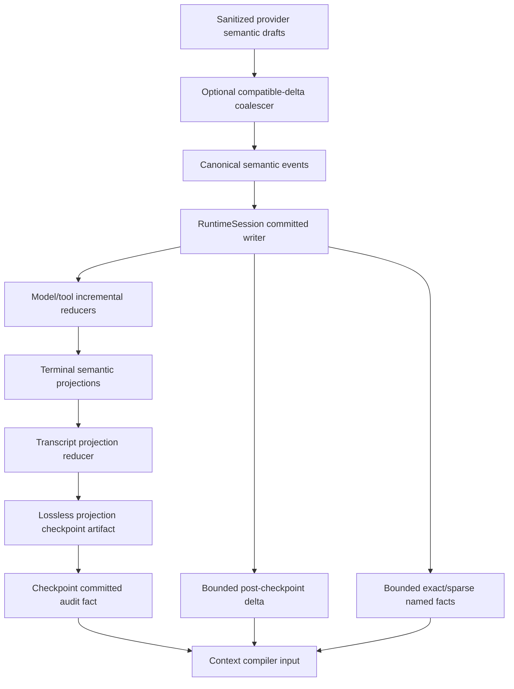

# Pulsara Authority Materialization 与 Lossless Transcript Projection 设计稿

> 状态：**待讨论设计稿，不是实施规格，不是当前生产契约**
>
> 日期：2026-07-15
>
> 讨论输入：`PULSARA_LONG_HORIZON_CONTEXT_WINDOWS_HARD_CUT_IMPLEMENTATION.zh.md`
>
> 相关阶段：Stage 4 Long-Horizon Context Windows boundedness 修正
>
> 当前结论：方向推荐，但 DTO、事件落点、raw-delta 保留粒度和 PR 边界尚未冻结

---

## 0. 文档目的

本文讨论一个已经由真实代码确认的架构问题：Pulsara 虽然已经把模型可见上下文改为 resolved token budget，并支持
context window compaction，但 context compiler 仍需要物化 bounded raw event authority。当前固定的 event/byte 上限可能先于
token pressure 被触发，从而形成一个独立的执行失败边界。

这个边界不能通过删除所有物理限制来解决。Pulsara 同时需要：

1. **模型上下文预算**：决定哪些内容可以进入 provider payload；
2. **物理安全限制**：限制单次数据库读取、对象解码、内存占用、CPU 时间和未 checkpoint delta；
3. **lossless projection acceleration**：让 compiler 不必为每次 model call 重放全部 raw semantic deltas。

本文目标是提出一套可讨论的长期形态：

```text
canonical semantic EventLog
        |
        v
committed incremental semantic reducers
        |
        +--> per-call / per-tool terminal projections
        |
        +--> lossless transcript projection checkpoint
                    +
              bounded delta
                    |
                    v
             ContextFactSnapshot
```

这套方案保持：

- EventLog 是最终 authority；
- checkpoint 是 durable、可丢弃、可重建的 memoization；
- checkpoint schedule 不改变模型可见语义或 semantic fingerprint；
- physical limits 仍然存在，但不再定义整个 active context 的语义容量；
- LLM context-window compaction 仍只处理 token pressure，不处理 transport fragmentation。

本文不直接修改当前代码，也不宣称该设计已经冻结。

---

## 1. 当前问题

### 1.1 当前 authority 限制

当前 live context collector 使用固定限制：

```python
_MAX_LIVE_AUTHORITY_EVENTS = 16_384
_MAX_LIVE_AUTHORITY_PAYLOAD_BYTES = 16 * 1024 * 1024
```

落点：

- `src/pulsara_agent/runtime/context_input/live.py`
- `src/pulsara_agent/event_log/postgres.py`

这些限制目前同时承担两种职责：

1. 防止一次数据库读取或 Python decode 无界增长；
2. 限制 compiler 能够看到的 raw event authority horizon。

第一项是必要的物理防线，第二项不应存在。

当 active authority cache 达到上限时，下一次 compile 无法扩展 cache；PostgreSQL reader 也会拒绝超过 event cap 的范围。此时
错误发生在：

```text
read authority
    -> build snapshot
        -> measure model-visible tokens
            -> plan projection/window compaction
```

也就是说，系统可能在有机会判断 token pressure、执行 projection rewrite 或 window compaction 之前失败。

### 1.2 Token 数与 event 数不存在稳定比例

模型 token budget 和 durable event count 是两个正交维度。

以下轨迹都可能具有很低的 model-visible token 数，却产生很多 durable events：

- provider 按单 token 或很小片段返回 text delta；
- tool-call arguments 被拆成大量 delta；
- 很多短工具产生 start/data/end 生命周期事件；
- tool result 正文已 artifact-backed，但 streaming delta 仍完整持久化；
- provider output 被 suppression，最终不进入 canonical transcript，但 raw stream events 仍存在；
- background lifecycle、gate、rollout、projection audit 事件持续插入。

因此不能用：

```text
model context window tokens -> authority max events
```

作为唯一推导公式。

### 1.3 当前 batching 没有降低 durable event count

`src/pulsara_agent/llm/runtime.py` 当前按以下边界 flush semantic batch：

```python
_SEMANTIC_BATCH_MAX_EVENTS = 16
_SEMANTIC_BATCH_MAX_CHARS = 4_096
_SEMANTIC_BATCH_MAX_AGE_SECONDS = 0.025
```

这减少 transaction 数量，但没有合并 semantic events。16 个 delta 仍写成 16 行 durable events。

所以 batching 解决的是：

```text
transaction amplification
```

不是：

```text
event amplification
```

### 1.4 单个 model call 也有同源限制

`src/pulsara_agent/llm/materialize.py` 当前还有：

```python
MAX_MODEL_CALL_MATERIALIZATION_EVENTS = 16_384
MAX_MODEL_CALL_MATERIALIZATION_PAYLOAD_BYTES = 16 * 1024 * 1024
```

所以即使 context compiler 不再读取 raw delta，单个超长 model stream 仍可能在 terminal materialization 时失败。

这说明修复不能只增加 transcript checkpoint。还需要处理：

- live model stream 的增量 semantic reducer；
- completed call 的 terminal projection；
- incomplete call recovery 的 bounded projection basis；
- raw event delta 的可选 coalescing。

### 1.5 PostgreSQL byte cap 不是完整的 physical bound

当前部分 PostgreSQL range reader 会先 `fetchall()`，再统计 canonical payload bytes。这样可以限制返回给 caller 的逻辑结果，但无法完全限制：

- PostgreSQL 到 Python 的传输量；
- cursor materialization；
- row object 峰值内存；
- decode 前的 payload 峰值。

长期 physical read contract 应使用：

- server-side cursor 或逐批 fetch；
- events cap；
- bytes cap；
- absolute deadline / statement timeout；
- cancellation / physical-operation owner；
- 超限时不返回半个 logical snapshot。

---

## 2. 术语

### 2.1 Model context budget

决定 provider payload 能包含多少模型可见内容，由 `ResolvedModelCall`、token estimator 与 context allocation policy 决定。

它是语义预算。

### 2.2 Authority materialization limits

限制一次 authority 读取、projection delta、checkpoint artifact、decode 或 reducer operation 的物理资源。

建议使用以下术语，不再称为“第二上下文窗口”：

- `AuthorityMaterializationLimits`
- `ProjectionDeltaReadLimits`
- `ModelStreamRecoveryReadLimits`
- `NamedAuthorityReadLimits`

这些是 operational limits，不是模型上下文语义。

### 2.3 Transport source item

sanitizing transport 产生的一个 typed provider semantic draft。它已经不是原始 HTTP packet，但仍可能保留 provider/SDK 的 chunk 边界。

### 2.4 Canonical semantic event

EventLog 中用于重建 assistant semantic stream 的 typed event，例如：

- `TextBlockStartEvent`
- `TextBlockDeltaEvent`
- `TextBlockEndEvent`
- `ToolCallStartEvent`
- `ToolCallDeltaEvent`
- `ToolCallEndEvent`

### 2.5 Terminal semantic projection

从一段已经 committed 的 model/tool stream 纯派生的完整、versioned、fingerprinted semantic result。

它不是 raw events 的替代 authority，而是可被 production compiler 直接消费的 durable projection。

### 2.6 Lossless transcript projection checkpoint

从 committed terminal projections、control disposition、tool pairing 和 transcript lifecycle facts 纯派生的完整 transcript reducer state。

它：

- 不总结正文；
- 不删除模型可见内容；
- 不触发新 model call；
- 不改变 context window generation；
- 不参与 semantic identity；
- 可被删除并从 EventLog 重建。

### 2.7 Context-window compaction

现有 Stage 4 的 LLM-assisted、可能有损的 token-pressure 操作。它会关闭旧 context window、创建 summary/retained baseline，并打开新 generation。

它不能和 lossless projection checkpoint 混为一谈。

---

## 3. 设计原则

### 3.1 EventLog 仍是最终 authority

所有 terminal projection 与 transcript checkpoint 必须满足：

```text
projection == pure_reducer(canonical EventLog source)
```

Checkpoint 不能成为第二真源。

### 3.2 Semantic source 与 acceleration identity 分离

必须拆成：

```text
TranscriptProjectionSemanticSourceFact
TranscriptProjectionAccelerationFact
```

第一类描述：

- reducer contract；
- source event domain；
- source through sequence；
- semantic event count；
- semantic accumulator；
- resulting normalized transcript fingerprint。

第二类描述：

- checkpoint ID；
- artifact ID/hash；
- physical generation；
- previous checkpoint；
- checkpoint byte count；
- build/verification timestamps；
- cache/read outcome。

Checkpoint 被 rebase、重建或换 artifact ID 时，semantic source 不得变化。

### 3.3 Physical cap 约束 delta，不约束总历史

Production compile 应满足：

```text
checkpoint baseline
    + bounded delta since checkpoint
    + bounded exact/sparse named facts
```

而不是：

```text
RunStart
    + every raw semantic event
    + hard total event cap
```

### 3.4 Lossless checkpoint 与 LLM compaction 正交

以下场景只需要 lossless checkpoint：

- 8,000 tokens 被拆成 8,000 个 delta；
- 很多短 lifecycle events；
- raw tool stream 很碎，但最终 artifact 很小；
- 大量 audit-only provider fragments；
- model-visible context 仍远低于 token trigger。

只有模型可见 token projection 过大时才触发 context-window compaction。

### 3.5 Production hot path 不做 full raw replay

Production compiler、resume 与 ordinary recovery 只允许：

- terminal projection；
- confirmed checkpoint；
- bounded delta；
- exact/sparse indexed facts。

从 sequence 1 full replay 只允许进入 privileged offline doctor 或 migration/rebuild command。

### 3.6 Checkpoint schedule 不改变模型输入

对于相同 EventLog semantic prefix：

```text
checkpoint at sequence 100
checkpoint at sequence 200
no checkpoint
```

在可完成重建的情况下必须产生相同：

- normalized transcript；
- tool pairing；
- tool result units；
- candidate semantic fingerprints；
- provider-neutral payload；
- context semantic fingerprint。

---

## 4. 推荐总体架构



推荐分成两层 durable projection。

### 4.1 第一层：per-operation terminal projection

每个 completed model call / tool result 在 terminal boundary 生成完整 semantic projection。

它解决：

- compiler 不再读取 text/tool raw deltas；
- 单 call terminal materialization 不再每次读取最多 16K raw events；
- completed reply/result 成为一个 bounded semantic unit；
- transcript reducer 输入从 raw stream events 降为 terminal facts。

### 4.2 第二层：window-scoped lossless transcript checkpoint

在同一个 context window 内周期性保存 transcript reducer state。

它解决：

- 每次 compile 不再重放本 active window 全部 terminal units；
- 高频短工具不会因 lifecycle fact 数量形成新的 active-window上限；
- restart 可以从 checkpoint + bounded terminal delta 恢复；
- context-window compaction 前后可以稳定交接 reducer baseline。

---

## 5. 可选 semantic delta coalescing

### 5.1 为什么值得做

当前 batch 只合并 transaction，不合并 events。即使引入 checkpoint，raw ledger、recovery 和 Inspector 仍会承担大量 event amplification。

Coalescing 可以减少：

- PostgreSQL rows；
- event schema decode；
- per-call semantic cursor长度；
- checkpoint delta构建成本；
- recovery读取成本。

### 5.2 什么可以合并

只有相邻、同 owner、同 block/tool identity、同 semantic kind 的 delta 可以合并：

- text delta；
- thinking delta；
- data delta（media type相同）；
- tool-call argument delta。

必须保持：

- 原始字符/bytes顺序；
- block identity；
- tool-call identity；
- source item index range；
- source item count；
- source draft accumulator；
- first/last observation timing。

以下事件禁止合并：

- start/end；
- provider error；
- model terminal；
- control disposition；
- 不同 block/tool identity 的 delta；
- 会跨越 semantic ordering barrier 的 event。

### 5.3 Attribution 草案

当前 `ModelStreamSemanticAttributionFact` 表达一个 source index。若做 hard cut，可讨论：

```python
class ModelStreamSemanticAttributionRangeFact:
    schema_version: Literal["model_stream_semantic_attribution.v2"]
    resolved_model_call_id: str
    model_call_start_event_id: str
    source_first_transport_index: int
    source_last_transport_index: int
    source_item_count: int
    source_draft_accumulator: str
    durable_semantic_kind: str
    durable_payload_fingerprint: str
    attribution_fingerprint: str
```

相邻 durable semantic events 的 source index ranges 必须连续、无重叠、无缺口。

### 5.4 尚未冻结的分叉

**方案 A：继续每个 source item 写一个 event**

- 优点：最直接的逐 item audit；
- 缺点：event amplification 保留；
- checkpoint 仍能解决 compiler horizon。

**方案 B：EventLog 保存 coalesced canonical semantic events**

- 优点：大幅降低 rows 和 decode 成本；
- 缺点：不再把 provider/SDK chunk boundary 当作一等 durable event；
- 仍可用 source range/count/accumulator保留完整语义归因。

当前推荐方案 B。理由是 provider packet/chunk boundary 属于 transport framing，不是 assistant semantic truth。但此项留待后续讨论，不是
本设计稿的必选前置。

---

## 6. Model terminal projection

### 6.1 当前问题

当前 `CommittedModelCallResult` 在 terminal 后通过读取该 call 的完整 raw semantic events 重建。

长期希望改为：

1. 每个 semantic batch durable FULL commit 后，service-owned handle 的 pure reducer同步 apply committed events；
2. reducer state只来自 committed canonical events，不消费未提交 drafts；
3. terminal candidate冻结完整 projection；
4. terminal batch原子保存 projection attribution；
5. caller从 terminal projection materialize结果，不扫描全部 delta。

### 6.2 DTO 草案

```python
class ModelCallSemanticSourceFact:
    schema_version: Literal["model_call_semantic_source.v1"]
    resolved_model_call_id: str
    model_call_start_event_id: str
    source_semantic_item_count: int
    source_first_transport_index: int | None
    source_last_transport_index: int | None
    source_semantic_accumulator: str
    source_event_domain_fingerprint: str
    reducer_contract_fingerprint: str
    source_fingerprint: str


class ModelCallTerminalProjectionFact:
    schema_version: Literal["model_call_terminal_projection.v1"]
    source: ModelCallSemanticSourceFact
    terminal_outcome: Literal[
        "completed", "provider_error", "cancelled", "runtime_error"
    ]
    text_blocks: tuple[...]
    thinking_blocks: tuple[...]
    data_blocks: tuple[...]
    tool_calls: tuple[...]
    provider_errors: tuple[...]
    usage_status: Literal["reported", "missing"]
    usage: ModelTokenUsageFact | None
    reported_model_id: str | None
    projection_fingerprint: str
```

### 6.3 Event 落点分叉

**方案 A：作为 `ModelCallEndEvent` required 字段**

- terminal batch天然原子；
- 少一个事件；
- End payload可能较大；
- projection schema升级会放大 End event迁移。

**方案 B：独立 `ModelCallTerminalProjectionCommittedEvent`，与 End 同 batch**

- lifecycle event保持紧凑；
- projection schema独立版本化；
- 多一个 durable event；
- 必须冻结 batch order 和二者 exact join。

**方案 C：projection artifact + End 中 required bounded ref**

- EventLog payload最小；
- artifact put-confirm与terminal commit需要稳定 owner；
- orphan artifact可接受，但 End 不得引用未确认 artifact。

当前倾向 **C 或 B+C**：large projection正文进入 content-addressed artifact，独立 event或 End 保存 bounded fact/ref。

### 6.4 Control disposition

`terminal_outcome="completed"` 不表示 reply 已进入 canonical transcript。

Projection 保存 completed semantic result；真正模型可见还必须满足：

```text
ModelCallControlDispositionResolvedEvent.disposition == ACCEPTED
```

provider error、cancelled、runtime error 或 suppressed completed call：

- projection可供 audit/Inspector；
- 不进入 canonical transcript；
- 不执行 tool calls；
- 不交付 final reply。

### 6.5 Recovery

Start-without-End recovery 需要：

- live reducer state仍存在：从 committed cursor继续；
- process restart：从 durable per-call projection checkpoint/page + bounded tail恢复；
- 没有 projection checkpoint且 raw semantic range超过 recovery limit：fail closed，进入 offline repair；
- 不能为了完成 recovery读取无界 raw call history。

是否需要 per-call intermediate projection pages，取决于是否采用 coalescing及最大 output contract。此项需要静态可行性检查。

---

## 7. Tool-result terminal projection

### 7.1 当前问题

`ToolResultEndEvent` 已保存：

- result state；
- artifact refs；
- observation timing；
- render profile；
- essential result；
- rollup semantics。

但 normalized `ToolResultBlock` 正文仍主要由 start/text/data/end events重建。

### 7.2 推荐形态

ToolExecutor 维护 commit-confirmed result reducer，在 terminal batch中保存：

```python
class ToolResultSemanticSourceFact:
    tool_call_id: str
    tool_result_start_event_id: str
    source_delta_count: int
    source_semantic_accumulator: str
    reducer_contract_fingerprint: str
    source_fingerprint: str


class ToolResultTerminalProjectionFact:
    source: ToolResultSemanticSourceFact
    canonical_result_block_artifact_id: str
    canonical_result_block_sha256: str
    canonical_result_block_chars: int
    execution_semantics: ToolResultExecutionSemanticsFact
    observation_timing: ToolObservationTimingFact
    artifacts: tuple[ToolResultArtifactRef, ...]
    projection_fingerprint: str
```

`ToolResultEndEvent` 应 required 地携带该 projection 或其 confirmed ref。

### 7.3 Pairing

Lossless transcript reducer只能在以下条件下把一个 tool interaction写入稳定 checkpoint：

- assistant tool call terminal projection存在；
- capability/control gate允许进入执行路径；
- exact `tool_call_id` result terminal projection存在；
- call/result model tool name一致；
- ordering与block位置可确定；
- suspension 已终结，或该 interaction明确保留在 pending reducer state。

V1 更简单的策略是：只在 pairing-complete safe point生成 checkpoint，不在 checkpoint 中持久化半截 tool interaction。

---

## 8. Incremental transcript projection reducer

### 8.1 Reducer 输入

推荐 reducer 消费：

- `RunStartEvent.current_user_message`；
- accepted model terminal projection；
- model control disposition；
- tool-result terminal projection；
- external execution requirement/result projection；
- plan/recovery lifecycle facts；
- context-window open/close/compaction facts；
- bounded terminal process lifecycle notes；
- existing durable compaction retained baseline。

Reducer 不消费：

- raw text/thinking/data delta正文；
- raw tool-call argument delta正文；
- raw tool-result delta正文；
- process-local LoopState messages；
- current live cache作为事实源。

### 8.2 Reducer contract

```python
class TranscriptProjectionReducerContractFact:
    schema_version: Literal["transcript_projection_reducer_contract.v1"]
    reducer_id: str
    reducer_version: str
    reducer_contract_fingerprint: str
    input_event_domain_fingerprint: str
    terminal_projection_contract_fingerprint: str
    normalized_message_contract_fingerprint: str
    tool_pairing_contract_fingerprint: str
    compaction_baseline_contract_fingerprint: str
```

任何会改变相同 source input 所产生 normalized transcript 的变更都必须升级 version 或 contract fingerprint。

### 8.3 Reducer state

```python
class TranscriptProjectionStateFact:
    schema_version: Literal["transcript_projection_state.v1"]
    runtime_session_id: str
    run_id: str
    window_id: str
    window_generation: int
    source_through_sequence: int
    semantic_source_event_count: int
    semantic_source_accumulator: str
    messages: tuple[TranscriptMessageFact, ...]
    tool_pairs: tuple[ToolInteractionPairFact, ...]
    tool_result_units: tuple[ToolResultRenderUnit, ...]
    stripped_unfinished_call_ids: tuple[str, ...]
    omitted_non_model_block_ids: tuple[str, ...]
    state_semantic_fingerprint: str
```

若 checkpoint 只在 pairing-safe safe point生成，state 不需要保存 mutable/incomplete assembler internals。

### 8.4 Live ownership

`RuntimeSession` 持有 process-local：

- `TranscriptProjectionStateStore`；
- reducer contract binding；
- source counters；
- last confirmed checkpoint attribution；
- pending checkpoint owner；
- physical operation/drain state。

每次 EventLog commit 后：

```text
durable commit/confirm
    -> synchronous committed reducer apply
        -> ordered publication
```

Transcript reducer 必须位于 committed-reducer phase，不能依赖 observer callback。

---

## 9. Lossless transcript projection checkpoint

### 9.1 Checkpoint DTO 草案

```python
class TranscriptProjectionSemanticSourceFact:
    reducer_contract: TranscriptProjectionReducerContractFact
    runtime_session_id: str
    run_id: str
    window_id: str
    window_generation: int
    source_through_sequence: int
    semantic_source_event_count: int
    semantic_source_accumulator: str
    resulting_state_fingerprint: str
    semantic_source_fingerprint: str


class TranscriptProjectionAccelerationFact:
    checkpoint_id: str
    checkpoint_artifact_id: str
    checkpoint_artifact_sha256: str
    checkpoint_artifact_bytes: int
    previous_checkpoint_id: str | None
    physical_generation: int
    build_contract_fingerprint: str
    acceleration_fingerprint: str


class TranscriptProjectionCheckpointFact:
    semantic_source: TranscriptProjectionSemanticSourceFact
    acceleration: TranscriptProjectionAccelerationFact
```

### 9.2 Event 草案

```python
class TranscriptProjectionCheckpointCommittedEvent(EventBase):
    type = EventType.TRANSCRIPT_PROJECTION_CHECKPOINT_COMMITTED
    checkpoint: TranscriptProjectionCheckpointFact
```

只有该 event FULL commit 且 artifact 已确认存在时，checkpoint 才可被 production reader 使用。

Artifact 成功但 event 未提交：

- artifact 是 orphan acceleration object；
- 不影响 semantic truth；
- 后续 GC 可清理；
- production reader不得自行猜测并采用。

### 9.3 Safe point

推荐只在以下 safe point生成 checkpoint：

- completed model call 已有 terminal projection与 durable control disposition；
- final text call已 ACCEPTED；
- tool-call batch已全部产生 terminal result或稳定 denied result；
- 没有 provider read in flight；
- 没有不完整 ToolResultStart→End；
- 没有 commit outcome UNKNOWN/PARTIAL；
- ledger/reducer没有 reconciliation latch。

MCP input-required、approval或plan pending时：

- 不需要抢占 Host pending slot；
- 可以保持上一个 confirmed checkpoint；
- resume terminal result完成后再推进 checkpoint。

### 9.4 与 context window 的关系

Checkpoint scope 建议绑定：

```text
runtime_session_id + run_id + window_id + window_generation
```

同一个 context window 可以有多个 lossless checkpoints。

当 LLM context-window compaction成功：

1. source window关闭；
2. durable retained normalized baseline成为 target window初始 transcript state；
3. target window打开；
4. 新 window checkpoint chain从该 baseline开始；
5. 旧 window checkpoint仅供 replay/doctor，不参与新 live compile。

Lossless checkpoint 本身：

- 不关闭 window；
- 不递增 window generation；
- 不写 summary；
- 不改变 model-visible content。

---

## 10. Physical limits 与 pressure 状态机

### 10.1 Limits 不应只是一组全局常量

建议拆分：

```python
class AuthorityMaterializationLimits:
    max_uncheckpointed_events: int
    max_uncheckpointed_payload_bytes: int
    soft_checkpoint_events: int
    soft_checkpoint_payload_bytes: int
    max_checkpoint_artifact_bytes: int
    max_named_authority_events: int
    max_named_authority_payload_bytes: int
    max_model_stream_source_items_per_call: int
    max_model_stream_recovery_events: int
    max_model_stream_recovery_payload_bytes: int
    operation_timeout_seconds: float
```

这些 limits 主要由 Host/process resource policy决定，不属于 `ResolvedModelCall` 的模型语义。

但 admission reserve 可以读取当前 resolved call 的 output cap，估算下一 operation 的最坏物理增量。

### 10.2 状态机

```text
HEALTHY
  -> CHECKPOINT_DUE
  -> CHECKPOINT_REQUIRED
  -> CHECKPOINTING
  -> HEALTHY

CHECKPOINTING
  -> RETRYABLE_FAILURE
  -> CHECKPOINTING

CHECKPOINT_REQUIRED + unrecoverable/unknown
  -> BLOCKED_UNTRUSTED
```

### 10.3 Soft watermark

达到 soft watermark：

- 不取消当前已开始 operation；
- 在下一个 pairing-safe safe point安排 checkpoint；
- 不写 model-visible hint；
- 不触发 LLM compaction；
- Inspector可显示 pressure。

### 10.4 Admission watermark

发起下一次 model/tool operation前需要预留物理 headroom：

```text
current_uncheckpointed_usage
  + worst_case_next_operation_usage
  <= hard_physical_limit
```

如果不可满足：

1. 先生成 lossless checkpoint；
2. checkpoint FULL 后重新 admission；
3. checkpoint 失败则不得发起 operation；
4. 不把 provider 当作 physical pressure探针。

### 10.5 Worst-case operation estimate

仅凭 output tokens 无法可靠估算 provider source item count。因此需要同时冻结：

- transport source item hard cap；
- optional coalescer的最大 durable chunk chars/bytes；
- structural event上界；
- resolved output token cap；
- conservative output bytes/token contract；
- tool result streaming/artifact fallback policy。

若无法为一个 production target/tool profile证明单 operation可落在 physical limits内，应在配置/doctor阶段拒绝，而不是运行中才发现。

### 10.6 Hard limit 的语义

Hard limit 只应表示：

```text
checkpoint/reducer maintenance没有在预期safe point推进
```

它不应表示：

```text
用户的模型上下文太大
```

若 compiler 发现 uncheckpointed delta 已超过 hard limit：

- 不读取半截 authority；
- 不发起 model call；
- 写 typed operational failure/pressure fact；
- 尝试由已有 incremental reducer materialize stable checkpoint；
- 无法确认 source continuity时 fail closed；
- 不自动改写成 LLM context compaction。

---

## 11. Compiler input hard cut

### 11.1 新输入形态

长期 production compiler 不再消费 raw continuous semantic range：

```python
class PreparedTranscriptProjectionInput:
    semantic_source: TranscriptProjectionSemanticSourceFact
    acceleration: TranscriptProjectionAccelerationFact | None
    checkpoint_state: TranscriptProjectionStateFact | None
    bounded_terminal_projection_delta: tuple[...]
    exact_named_authority_facts: tuple[...]
    final_normalized_transcript: NormalizedContextTranscript
    input_fingerprint: str
```

Compiler 只消费 `final_normalized_transcript` 与 typed source facts。

### 11.2 Context snapshot attribution

现有 `primary_event_range` 以 contiguous raw range为中心。Hard cut 后建议升级为显式 authority parts：

```python
class ContextTranscriptAuthorityFact:
    semantic_source: TranscriptProjectionSemanticSourceFact
    checkpoint_acceleration: TranscriptProjectionAccelerationFact | None
    terminal_delta_refs: tuple[ContextEventReferenceFact, ...]
    named_fact_refs: tuple[ContextEventReferenceFact, ...]
    authority_fingerprint: str
```

Primary/named raw ranges仍可保留在 operational manifest用于 audit，但不能继续成为 transcript semantic identity 的唯一表达。

### 11.3 Raw delta dependency gate

Hard cut 完成后，production compiler依赖图中应禁止：

- `TextBlockDeltaEvent` reconstruction；
- `ThinkingBlockDeltaEvent` reconstruction；
- `DataBlockDeltaEvent` reconstruction；
- `ToolCallDeltaEvent` reconstruction；
- `ToolResultTextDeltaEvent` reconstruction；
- `ToolResultDataDeltaEvent` reconstruction。

这些类型仍可用于：

- EventLog authority；
- live UI/Inspector；
- bounded recovery；
- privileged exact replay/doctor；
- terminal projection reducer input。

---

## 12. Replay、recovery 与验证

### 12.1 Live replay

Production reopen流程：

1. 读取 latest compatible checkpoint metadata；
2. 验证 reducer ID/version/contract fingerprint；
3. read-confirm checkpoint artifact；
4. restore transcript projection state；
5. 读取 bounded terminal projection delta；
6. 扩展 semantic accumulator；
7. 验证 source through/high-water；
8. 生成 final normalized transcript。

### 12.2 Checkpoint 不兼容

以下情况 checkpoint 不可使用：

- reducer contract mismatch；
- artifact missing/hash mismatch；
- semantic source accumulator不一致；
- checkpoint source超出ledger high-water；
- terminal projection contract unsupported；
- previous checkpoint chain出现冲突；
- checkpoint event attribution不属于当前run/window。

Fallback：

- 若上一个 compatible checkpoint + delta仍在 physical recovery limits内，回退并重建；
- 否则 production fail closed；
- privileged offline doctor可以从 raw EventLog full replay并 materialize新 checkpoint。

### 12.3 Exact replay

需要区分：

**Production exact replay**

- 证明 checkpoint contract、artifact、source accumulator、bounded delta和最终 payload一致；
- 不要求每次从 raw sequence 1重算。

**Privileged full-source verification**

- 从 raw semantic EventLog重算 terminal projections和 transcript state；
- 比较 checkpoint semantic source/result；
- 仅用于 doctor、migration、debug或测试；
- 可以是昂贵操作，但必须有显式授权和资源限制。

### 12.4 Crash matrix

必须覆盖：

- artifact put前崩溃；
- artifact put后、checkpoint event前崩溃；
- checkpoint event commit outcome NONE；
- FULL commit后 publication failure；
- UNKNOWN/PARTIAL confirmation；
- reducer apply failure；
- checkpoint candidate生成后 source继续推进；
- old generation late writer；
- close与checkpoint worker竞争；
- restart读取到 orphan artifact；
- checkpoint rebase期间 reader持有旧 artifact lease。

---

## 13. Storage 与 GC

### 13.1 Artifact

Checkpoint artifact应：

- content-addressed或稳定ID + content hash；
- 使用canonical JSON/typed binary contract；
- 保存byte count；
- bounded；
- immutable；
- 不包含secret-like raw diagnostics；
- 不包含process-local build fingerprint作为兼容性依据。

### 13.2 PostgreSQL

需要支持：

- 按 runtime/run/window/generation查 latest checkpoint；
- 按 resolved model call ID读取 terminal projection；
- 按 tool call ID读取 terminal result projection；
- 按 event type + sequence读取 bounded delta；
- server-side/streaming bytes cap；
- absolute statement deadline；
- read lease或artifact generation保护。

### 13.3 GC

Checkpoint physical GC应满足：

- EventLog semantic facts不删除；
- 只删除不再被 active/replay/read lease引用的 acceleration artifacts；
- closed/quiescent session；
- privileged maintenance owner；
- PostgreSQL advisory lock或等价exclusive authority；
- rebase后保留至少一个 verified fallback generation；
- orphan artifact可以按TTL清理。

### 13.4 Raw event retention

本文假设 raw semantic EventLog仍是最终 authority，因此不设计删除 raw delta。

未来若需要冷存储/分区归档，应另写 storage retention contract，不能把 checkpoint 当作删除 raw authority 的理由。

---

## 14. Inspector 与 observability

Inspector 建议投影：

```text
transcript_projection:
  reducer_id
  reducer_version
  reducer_contract_fingerprint
  semantic_source_through_sequence
  semantic_source_event_count
  semantic_source_accumulator
  state_fingerprint

checkpoint_acceleration:
  checkpoint_id
  checkpoint_artifact_id
  physical_generation
  previous_checkpoint_id
  artifact_bytes
  restore_outcome
  delta_event_count
  delta_payload_bytes

authority_pressure:
  state
  events_since_checkpoint
  payload_bytes_since_checkpoint
  next_operation_reserved_events
  next_operation_reserved_bytes
  hard_event_limit
  hard_byte_limit
```

Inspector 不应：

- 把 checkpoint ID当 semantic source；
- 根据当前配置重算旧 pressure；
- 把 checkpoint schedule变化显示为context语义变化；
- 隐藏 fallback/rebase/incompatible outcome；
- 读取 raw event正文来推断 projection status。

---

## 15. Failure taxonomy 草案

建议区分：

```text
transcript_projection_checkpoint_due
transcript_projection_checkpoint_required
transcript_projection_checkpoint_artifact_write_failed
transcript_projection_checkpoint_commit_unknown
transcript_projection_checkpoint_contract_mismatch
transcript_projection_checkpoint_artifact_missing
transcript_projection_checkpoint_source_drift
transcript_projection_delta_event_limit_exceeded
transcript_projection_delta_byte_limit_exceeded
model_terminal_projection_missing
model_terminal_projection_contract_mismatch
tool_terminal_projection_missing
tool_terminal_projection_contract_mismatch
authority_materialization_deadline_exceeded
authority_materialization_recovery_required
```

普通 soft checkpoint schedule不必写 durable noise event。只有：

- checkpoint committed；
- checkpoint required；
- checkpoint失败影响下一次admission；
- incompatible/recovery/rebase；

才需要 durable audit。

Process-local cache miss、eviction和成功重建可进入 operational diagnostics/report。

---

## 16. 与现有 Stage 4 的关系

### 16.1 Subagent graph checkpoint

本设计复用同一哲学：

```text
semantic source != checkpoint acceleration
```

但 transcript reducer 与 subagent graph reducer 的 event domain、state shape、safe point和GC策略不同，不能复用同一个全能 checkpoint DTO。

### 16.2 Window compaction retained baseline

现有 `WindowCompactionSourceDocumentFact.retained_transcript_baseline` 已证明 normalized transcript可以作为durable typed baseline。

本设计可复用其 message/pair/unit schema，但不应直接复用整个 source document DTO，因为：

- window compaction baseline有summary/retained语义；
- lossless checkpoint没有summary或token reduction；
- source attribution和lifecycle不同；
- checkpoint可在同一window多次推进。

### 16.3 Context manifest

Context manifest未来应同时记录：

- transcript semantic source；
- selected checkpoint acceleration；
- bounded delta refs/count/bytes；
- final normalized transcript fingerprint；
- provider-neutral payload fingerprint。

Exact replay不能只由 checkpoint artifact自证。

### 16.4 Rollout budget

Lossless checkpoint：

- 不消耗 model-call reservation；
- 不计为window compaction；
- 不改变rollout phase；
- 可以有physical operation deadline/close drain；
- checkpoint失败可阻止下一operation admission。

---

## 17. 不推荐的方案

### 17.1 只提高 16K/16MiB

只能推迟失败，不能改变event/token解耦，也会提高单次读取峰值。

### 17.2 让 physical cap 按 model context window同比增长

模型token容量不是数据库/内存/CPU容量。大context模型不意味着Host应允许更大的单次EventLog materialization。

### 17.3 Event pressure直接触发 LLM compaction

Transport fragmentation不是模型语义压力。这样会让provider chunk行为改变模型最终上下文，违反determinism。

### 17.4 只做 process-local transcript cache

无法支持restart、exact replay和Host close；cache miss仍会重新撞raw range cap。

### 17.5 Compiler读失败后才建checkpoint

此时raw range可能已经超出checkpoint builder的读取能力。Checkpoint必须由committed reducer增量维护并在safe point提前materialize。

### 17.6 Checkpoint成为唯一历史

如果删除raw authority或让checkpoint无法从EventLog验证，它就不再是memoization，而会成为第二事实源。

### 17.7 用SQL view替代semantic reducer

SQL view不适合独立承担：

- block assembler state；
- control disposition；
- tool-call/result pairing；
- descriptor attribution；
- compaction baseline；
- versioned reducer contract。

数据库可以提供indexed inputs，但semantic reducer仍应是Pulsara-owned pure contract。

---

## 18. 建议的实施拓扑（尚未冻结）

### AP0：术语、limits 与 shadow metrics

- 定义 physical limit DTO；
- 分离 model stream recovery、transcript delta、named authority limits；
- writer/store增量统计events/bytes since checkpoint；
- Inspector shadow展示，不改变admission；
- 配置/doctor检查单operation物理可行性。

完成条件：现有生产行为不变，但能够解释何时将撞physical limit。

### AP1：Model/tool terminal projections

- model committed semantic reducer；
- tool-result committed reducer；
- terminal projection DTO/artifact；
- terminal batch atomic ref；
- recovery/negative validators；
- shadow compare current raw materializer与terminal projection。

完成条件：两条路径对所有测试轨迹产生相同 `CommittedModelCallResult`、normalized result block和fingerprints。

### AP2：Incremental transcript reducer

- reducer contract；
- RuntimeSession-owned store；
- committed event routing；
- pairing-safe state；
- source accumulator；
- current compiler继续旧路径，但shadow compare normalized transcript。

完成条件：live reducer与当前raw projector对相同authority产生完全一致结果。

### AP3：Durable lossless checkpoint

- checkpoint artifact/event；
- service-owned writer；
- stable candidate与commit confirmation；
- restart restore；
- fallback/rebase；
- read lease、close drain、orphan处理；
- physical pressure state机。

完成条件：checkpoint schedule变化不改变semantic output；restart只读checkpoint + bounded delta。

### AP4：Compiler input hard cut

- `PreparedTranscriptProjectionInput`；
- snapshot/manifest authority v3；
- production compiler删除raw delta reconstruction；
- context-window compaction改用projection state；
- replay按checkpoint+delta验证；
- pre-manifest typed failure更新。

完成条件：production compiler依赖图不读取model/tool raw delta正文。

### AP5：Coalescing、doctor、Inspector 与 deletion gates

- 若决定采用，hard cut semantic attribution range/coalescing；
- privileged full-source verifier；
- checkpoint doctor/rebase/GC；
- Inspector normalized projection；
- 删除旧raw hot-path materializer；
- architecture/grep guards。

Coalescing也可前移到AP1，取决于后续讨论结果。

---

## 19. 测试矩阵草案

### 19.1 核心 correctness

```text
test_checkpoint_schedule_does_not_change_transcript_semantics
test_checkpoint_schedule_does_not_change_provider_payload
test_checkpoint_identity_excluded_from_semantic_fingerprint
test_terminal_model_projection_matches_raw_reducer
test_terminal_tool_projection_matches_raw_reducer
test_suppressed_model_projection_remains_audit_only
test_tool_pairing_survives_projection_checkpoint
test_window_compaction_seeds_new_projection_chain
```

### 19.2 高频小 delta

```text
test_two_max_output_calls_do_not_exhaust_authority_materialization
test_many_small_text_deltas_checkpoint_before_hard_limit
test_many_short_tool_lifecycles_checkpoint_without_llm_compaction
test_low_token_high_event_pressure_does_not_change_model_visible_context
test_coalesced_delta_preserves_exact_text_and_order
test_coalesced_tool_arguments_preserve_exact_json_source_text
```

### 19.3 Admission

```text
test_next_model_call_reserves_physical_projection_headroom
test_next_tool_batch_reserves_physical_projection_headroom
test_checkpoint_required_blocks_provider_dispatch
test_soft_checkpoint_failure_retries_at_next_safe_point
test_hard_checkpoint_failure_fails_closed_without_llm_compaction
```

### 19.4 Restart/recovery

```text
test_restart_restores_projection_checkpoint_plus_bounded_delta
test_missing_checkpoint_artifact_uses_previous_compatible_generation
test_incompatible_reducer_contract_fails_closed
test_orphan_checkpoint_artifact_is_not_adopted
test_full_source_doctor_rebuilds_checkpoint
test_model_start_without_end_uses_bounded_projection_recovery
```

### 19.5 Failure/cancellation

```text
test_checkpoint_artifact_write_failure_does_not_create_durable_checkpoint
test_checkpoint_commit_unknown_preserves_owner_and_latches
test_checkpoint_publication_failure_does_not_revoke_committed_checkpoint
test_checkpoint_worker_cancel_preserves_retryable_candidate
test_host_close_drains_required_checkpoint_owner
test_reader_lease_prevents_checkpoint_gc
```

### 19.6 Physical I/O

```text
test_postgres_projection_delta_read_uses_server_side_byte_bound
test_projection_delta_read_honors_absolute_deadline
test_projection_delta_reader_does_not_fetchall_beyond_byte_cap
test_named_authority_limits_are_independent_from_transcript_delta_limits
```

### 19.7 Architecture guards

```text
test_production_compiler_does_not_decode_model_semantic_deltas
test_production_compiler_does_not_decode_tool_result_deltas
test_checkpoint_acceleration_not_used_as_semantic_authority
test_full_raw_transcript_fold_only_exists_in_privileged_doctor
test_physical_pressure_does_not_invoke_llm_compaction
```

---

## 20. Definition of Done 草案

该设计只有在以下条件全部满足时才能称为完成：

1. 总 EventLog 历史超过16K events或16MiB不会直接导致ordinary compile失败；
2. 单个 completed model/tool stream有durable terminal projection；
3. production compiler不再读取raw delta正文；
4. live/restart从compatible checkpoint + bounded delta恢复；
5. checkpoint schedule不改变normalized transcript、context fingerprint或provider payload；
6. physical event/byte/deadline limits仍然强制执行；
7. pressure在下一operation dispatch前被发现；
8. low-token/high-event pressure不会触发LLM summary compaction；
9. checkpoint failure/unknown/cancel拥有stable owner与fail-closed语义；
10. privileged full-source doctor能重建并验证checkpoint；
11. Inspector能区分semantic source与acceleration；
12. raw EventLog仍是最终authority；
13. architecture gates禁止旧raw compiler hot path回归；
14. real trajectory覆盖高频小delta、短tool loops、restart和window compaction交接。

---

## 21. 尚待讨论的关键分叉

### 21.1 是否 coalesce durable semantic delta

- 保留逐source item event；
- 或改为source range + aggregate fingerprint的coalesced canonical event。

当前倾向后者。

### 21.2 Model terminal projection 放在哪里

- required embedded `ModelCallEndEvent` field；
- 独立同batch event；
- artifact + bounded event ref。

当前倾向 artifact + required bounded ref，是否独立event待定。

### 21.3 Tool-result projection 放在哪里

- required embedded `ToolResultEndEvent` field；
- artifact + End ref；
- 复用现有tool-result artifact service并增加canonical block contract。

当前倾向复用artifact service，但必须增加typed canonical block projection contract。

### 21.4 Checkpoint scope

- runtime session；
- run；
- context window。

当前倾向 `runtime_session + run + context window generation`。

### 21.5 Checkpoint schedule

- 固定event/byte watermark；
- ratio-based watermark；
- operation-admission-driven；
- 三者组合。

当前倾向 soft watermark + next-operation admission reserve + hard cap组合。

### 21.6 是否允许 checkpoint 保存 incomplete interaction

- 只在pairing-safe safe point生成；
- 或持久化BlockAssembler/pending tool pairing state。

当前倾向 V1 只在pairing-safe safe point生成，减少状态面。

### 21.7 Context manifest schema

- 在v2 additive增加projection attribution；
- 或hard cut为v3并删除raw primary range中心语义。

Pulsara尚未上线，当前倾向hard cut v3。

### 21.8 Raw event retention

- 永久保留hot PostgreSQL；
- PostgreSQL分区 + cold archive；
- 未来受治理的raw-event archival。

本设计不做决定，且禁止用checkpoint作为未经设计的删除依据。

---

## 22. 当前推荐结论

当前更合理的长期方案不是删除16K/16MiB，也不是按token budget放大它，而是：

```text
optional compatible-delta coalescing
    +
per-model/per-tool terminal projections
    +
session-owned incremental transcript reducer
    +
durable lossless window-scoped checkpoint
    +
bounded delta and named facts
```

原有固定上限可以保留为某类 `ProjectionDeltaReadLimits` 的默认物理防线，但必须从：

```text
compiler total authority capacity
```

降级为：

```text
one uncheckpointed delta/read/recovery operation capacity
```

最终系统应满足：

> Raw EventLog 可以很长，模型可见 context 可以按 token budget演进，production compiler每次只处理一个confirmed lossless baseline、
> bounded semantic delta和少量exact named facts。Physical limits保护Host资源，但不再决定用户长程任务能否继续。

本文到此仍是设计输入。后续讨论应先冻结第21节分叉，再生成正式 hard-cut 实施规格。
