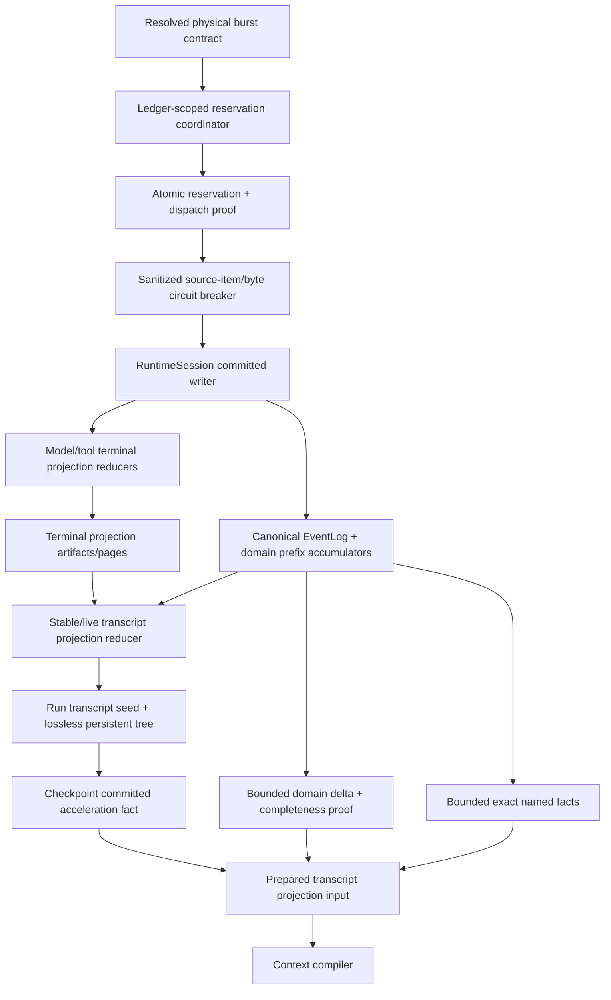

# Pulsara Authority Materialization 与 Lossless Transcript Projection Hard Cut 实施规格

> 状态：**AP0–AP5 已完成生产实现；Definition of Done 65项已完成最终核验**
>
> 日期：2026-07-15
>
> 讨论输入：`PULSARA_LONG_HORIZON_CONTEXT_WINDOWS_HARD_CUT_IMPLEMENTATION.zh.md`
>
> 相关阶段：Stage 4 Long-Horizon Context Windows boundedness 修正
>
> 当前结论：semantic/acceleration、run seed、stable/live reducer、sparse completeness、bounded-fanout persistent tree、multi-consumer ledger
> materialization generation、deterministic physical charge、segmented burst/terminal/account/checkpoint/compiler-input central DTO与producer coverage 已冻结并完成
> hard cut；旧数据库不进入兼容、迁移或运行时补事实路径，开发和部署阶段必须显式reset后使用fresh schema。
>
> 2026-07-18 后续 hard cut：model stream 的四类 raw durable delta 已由
> `PULSARA_MODEL_STREAM_DELTA_SEGMENT_COALESCING_HARD_CUT_IMPLEMENTATION.zh.md`替换为bounded durable segment。
> 本文的terminal projection、transcript checkpoint与ledger account架构保持权威；model transport fragmentation、burst DTO及producer
> vocabulary以该后续规格和当前`TransportSegmentedBurstContractFact`为准。

---

## 0. 文档目的

本文讨论一个已经由真实代码确认的架构问题：Pulsara 虽然已经把模型可见上下文改为 resolved token budget，并支持
context window compaction，但 context compiler 仍需要物化 bounded raw event authority。当前固定的 event/byte 上限可能先于
token pressure 被触发，从而形成一个独立的执行失败边界。

这个边界不能通过删除所有物理限制来解决。Pulsara 同时需要：

1. **模型上下文预算**：决定哪些内容可以进入 provider payload；
2. **物理安全限制**：限制单次数据库读取、对象解码、内存占用、CPU 时间和未 checkpoint delta；
3. **lossless projection acceleration**：让 compiler 不必为每次 model call 重放全部 raw semantic deltas。

本文目标是冻结一套可逐步落地的长期形态：

```text
canonical semantic EventLog
        |
        v
committed incremental semantic reducers
        |
        +--> per-call / per-tool terminal projections
        |
        +--> lossless transcript projection checkpoint
                    +
              bounded delta
                    |
                    v
             ContextFactSnapshot
```

这套方案保持：

- EventLog 是最终 authority；
- checkpoint 是 durable、可丢弃、可重建的 memoization；
- 在相同compile invocation facts下，checkpoint schedule不改变模型可见语义或semantic fingerprint；compile-time timing projection另有本次调用身份；
- physical limits 仍然存在，但不再定义整个 active context 的语义容量；
- LLM context-window compaction 仍只处理 token pressure，不处理 transport fragmentation。

本文既是冻结契约，也是AP0–AP5实现与验收的权威规格。只有仍明确标注为future的能力可以留待后续规格；实现、恢复、Inspector、doctor与
测试不得重新打开第21节已经关闭的分叉，也不得为旧ledger增加migration、backfill、legacy fallback或live repair authority。

---

## 1. 当前问题

### 1.1 当前 authority 限制

当前 live context collector 使用固定限制：

```python
_MAX_LIVE_AUTHORITY_EVENTS = 16_384
_MAX_LIVE_AUTHORITY_PAYLOAD_BYTES = 16 * 1024 * 1024
```

落点：

- `src/pulsara_agent/runtime/context_input/live.py`
- `src/pulsara_agent/event_log/postgres.py`

这些限制目前同时承担两种职责：

1. 防止一次数据库读取或 Python decode 无界增长；
2. 限制 compiler 能够看到的 raw event authority horizon。

第一项是必要的物理防线，第二项不应存在。

当 active authority cache 达到上限时，下一次 compile 无法扩展 cache；PostgreSQL reader 也会拒绝超过 event cap 的范围。此时
错误发生在：

```text
read authority
    -> build snapshot
        -> measure model-visible tokens
            -> plan projection/window compaction
```

也就是说，系统可能在有机会判断 token pressure、执行 projection rewrite 或 window compaction 之前失败。

### 1.2 Token 数与 event 数不存在稳定比例

模型 token budget 和 durable event count 是两个正交维度。

以下轨迹都可能具有很低的 model-visible token 数，却产生很多 durable events：

- provider 按单 token 或很小片段返回 text delta；
- tool-call arguments 被拆成大量 delta；
- 很多短工具产生 start/data/end 生命周期事件；
- tool result 正文已 artifact-backed，但 streaming delta 仍完整持久化；
- provider output 被 suppression，最终不进入 canonical transcript，但 raw stream events 仍存在；
- background lifecycle、gate、rollout、projection audit 事件持续插入。

因此不能用：

```text
model context window tokens -> authority max events
```

作为唯一推导公式。

### 1.3 当前 batching 没有降低 durable event count

`src/pulsara_agent/llm/runtime.py` 当前按以下边界 flush semantic batch：

```python
_SEMANTIC_BATCH_MAX_EVENTS = 16
_SEMANTIC_BATCH_MAX_CHARS = 4_096
_SEMANTIC_BATCH_MAX_AGE_SECONDS = 0.025
```

这减少 transaction 数量，但没有合并 semantic events。16 个 delta 仍写成 16 行 durable events。

所以 batching 解决的是：

```text
transaction amplification
```

不是：

```text
event amplification
```

### 1.4 单个 model call 也有同源限制

`src/pulsara_agent/llm/materialize.py` 当前还有：

```python
MAX_MODEL_CALL_MATERIALIZATION_EVENTS = 16_384
MAX_MODEL_CALL_MATERIALIZATION_PAYLOAD_BYTES = 16 * 1024 * 1024
```

所以即使 context compiler 不再读取 raw delta，单个超长 model stream 仍可能在 terminal materialization 时失败。

这说明修复不能只增加 transcript checkpoint。还需要处理：

- live model stream 的增量 semantic reducer；
- completed call 的 terminal projection；
- incomplete call recovery 的 bounded projection basis；
- V1 finite fragmentation contract；future coalescing不属于当前正确性前提。

### 1.5 Real dogfood 暴露的迁移期 checkpoint 可行性缺口

本设计形成期间的一次全量 real-LLM + dogfood 验证中，
`tests/test_real_llm_dogfood_plan_mode.py::test_real_plan_mode_job_queue_long_dogfood` 暴露了一个确定性的配置不变量缺口，而不是随机的
模型质量问题。

当时两个生产边界分别为：

```text
单次合法 model-call materialization:
  16_384 events / 16 MiB

Subagent graph checkpoint 未 checkpoint delta:
  1_024 events / 4 MiB
```

长 reasoning stream 在 model-call materializer 看来完全合法，但它可以在下一次 pairing-safe checkpoint 前产生超过
`1_024 events / 4 MiB` 的 durable events。虽然这些 model stream events 对 subagent graph reducer 大多是 deterministic no-op，
它们仍参与 ledger continuity accumulator，不能跳过。所以下一次 compile 恢复 graph checkpoint 时会先遇到
`subagent_checkpoint_delta_bound_exceeded`，尚未进入模型 token measurement、projection rewrite 或 window compaction。

这条真实轨迹证明了一个必须保持的物理可行性不变量：

```text
consumer 可恢复的未 checkpoint delta
  >= producer 在下一个安全 checkpoint 前允许产生的最大不可切分 durable burst
```

当时代码先采用了明确的迁移期修复：

```text
checkpoint_max_delta_events
  = 2 * MAX_MODEL_CALL_MATERIALIZATION_EVENTS
  = 2 * (16_384 source items + 32 structural tail events)
  = 32_832

checkpoint_max_delta_bytes
  = 2 * MAX_MODEL_CALL_MATERIALIZATION_PAYLOAD_BYTES
  = 2 * (16 MiB sanitized payload + 512 KiB structural tail)
  = 33 MiB
```

第一份容量覆盖一次达到当前合法上限的 model stream；额外一倍是尚未被统一建模的 lifecycle/control、tool、safe-point 尾部与
checkpoint 调度延迟的保守余量。它是简单、确定、可回归的 V1 safety factor，不是这些尾部的数学精确上界，也不是新的模型上下文
预算。对应确定性回归最初锁住“至少覆盖一个最大model call”。该固定倍数现已在AP5退役，当前回归为
`tests/test_long_horizon_checkpoint.py::test_graph_checkpoint_delta_bound_uses_shared_ledger_hard_horizon`。

该 `2x` 规则只修复了当时 graph checkpoint 通道的即时可行性，不能解决 compiler 物化整段 raw authority 的长期 horizon，也不能替代
本设计第 10 节的 operation admission。现在所有production producer都使用同一ledger materialization account做resolved reservation，graph
continuity delta bound直接绑定`AuthorityMaterializationLimits.max_unreclaimable_*` hard horizon；固定倍数不再进入production policy、
semantic identity或architecture dependency。

### 1.6 PostgreSQL byte cap 不是完整的 physical bound

当前部分 PostgreSQL range reader 会先 `fetchall()`，再统计 canonical payload bytes。这样可以限制返回给 caller 的逻辑结果，但无法完全限制：

- PostgreSQL 到 Python 的传输量；
- cursor materialization；
- row object 峰值内存；
- decode 前的 payload 峰值。

长期 physical read contract 应使用：

- server-side cursor 或逐批 fetch；
- events cap；
- bytes cap；
- absolute deadline / statement timeout；
- cancellation / physical-operation owner；
- 超限时不返回半个 logical snapshot。

---

## 2. 术语

### 2.1 Model context budget

决定 provider payload 能包含多少模型可见内容，由 `ResolvedModelCall`、token estimator 与 context allocation policy 决定。

它是语义预算。

### 2.2 Authority materialization limits

限制一次 authority 读取、projection delta、checkpoint artifact、decode 或 reducer operation 的物理资源。

建议使用以下术语，不再称为“第二上下文窗口”：

- `AuthorityMaterializationLimits`
- `ProjectionDeltaReadLimits`
- `ModelStreamRecoveryReadLimits`
- `NamedAuthorityReadLimits`

这些是 operational limits，不是模型上下文语义。

### 2.3 Transport source item

sanitizing transport 产生的一个 typed provider semantic draft。它已经不是原始 HTTP packet，但仍可能保留 provider/SDK 的 chunk 边界。

### 2.4 Canonical semantic event

EventLog 中用于重建 assistant semantic stream 的 typed event，例如：

- `TextBlockStartEvent`
- `TextBlockSegmentEvent`
- `TextBlockEndEvent`
- `ToolCallStartEvent`
- `ToolCallArgumentsSegmentEvent`
- `ToolCallEndEvent`

### 2.5 Terminal semantic projection

从一段已经 committed 的 model/tool stream 纯派生的完整、versioned、fingerprinted semantic result。

它不是 raw events 的替代 authority，而是可被 production compiler 直接消费的 durable projection。

### 2.6 Lossless transcript projection checkpoint

从committed terminal projections、control disposition、tool pairing和transcript lifecycle facts纯派生的bounded root manifest与
bounded-fanout immutable persistent tree。

它：

- 不总结正文；
- 不删除模型可见内容；
- 不触发新 model call；
- 不改变 context window generation；
- 不参与 semantic identity；
- 可被删除并从 EventLog 重建。

### 2.7 Context-window compaction

现有 Stage 4 的 LLM-assisted、可能有损的 token-pressure 操作。它会关闭旧 context window、创建 summary/retained baseline，并打开新 generation。

它不能和 lossless projection checkpoint 混为一谈。

### 2.8 Run transcript seed

PRE_RUN为新run冻结的content-addressed prior normalized transcript初态。Seed ref是RunStart required durable fact；它解决run-scoped首个
checkpoint前重启恢复，且不包含当前user message，后者仍由RunStart canonical fact fold进入本run。

### 2.9 Live assembly state

Committed reducer持有的process-local中间态，包括pending model disposition、tool pairing、MCP suspension与external requirement。它可从
stable seed/checkpoint + bounded complete delta重建，但不能被误写成stable checkpoint。

### 2.10 Transcript-domain completeness proof

由storage-maintained domain prefix count/accumulator与一次repeatable-read sparse selection共同证明“checkpoint后全部transcript-domain facts
均已读取”的typed proof。Event-type allowlist本身不构成完整性证明。

### 2.11 Physical operation reservation

在model/tool operation dispatch前，针对目标EventLog ledger原子预留的最大durable events/bytes burst。它是并发安全的物理资源ownership，
与rollout/token budget reservation正交。

---

## 3. 设计原则

### 3.1 EventLog 仍是最终 authority

所有 terminal projection 与 transcript checkpoint 必须满足：

```text
projection == pure_reducer(canonical EventLog source)
```

Checkpoint 不能成为第二真源。

### 3.2 Semantic source 与 acceleration identity 分离

必须拆成：

```text
TranscriptProjectionSemanticSourceFact
TranscriptProjectionAccelerationFact
```

第一类描述：

- reducer contract；
- transcript-semantic event-domain subset contract；
- transcript-domain event count；
- transcript semantic accumulator；
- resulting normalized transcript fingerprint。

第二类描述：

- runtime/run/window scope；
- ledger through sequence与continuity accumulator；
- checkpoint ID；
- checkpoint materialization event ID/sequence；
- artifact ID/hash；
- physical generation；
- previous checkpoint；
- checkpoint candidate ledger high-water与post-checkpoint delta range；
- checkpoint byte count；
- build/verification timestamps；
- cache/read outcome。

Checkpoint 被 rebase、重建或换 artifact ID 时，semantic source 不得变化。

`TranscriptProjectionSemanticSourceFact` **禁止**携带以下 physical/storage identity：

- `source_through_sequence`或任意ledger sequence；
- checkpoint/materialization event ID；
- artifact ID、generation或delta range；
- build time、cache outcome或read outcome。

Checkpoint candidate 的 ledger high-water必须严格早于该candidate自己的
`TranscriptProjectionCheckpointCommittedEvent.sequence`。Checkpoint event属于`transcript_acceleration` domain，对 transcript semantic
reducer是versioned deterministic no-op；它只推进 ledger continuity。仅改变checkpoint频率、event sequence、artifact generation或rebase
位置，不能改变semantic event count、semantic accumulator、resulting state fingerprint；在相同compile-time/timezone/source timing facts下也不能改变
provider payload。Invocation timing变化只能改变本次Context manifest/provider projection，不能改变checkpoint semantic source。

### 3.3 Physical cap 约束 delta，不约束总历史

Production compile 应满足：

```text
checkpoint baseline
    + bounded delta since checkpoint
    + bounded exact/sparse named facts
```

而不是：

```text
RunStart
    + every raw semantic event
    + hard total event cap
```

### 3.4 Lossless checkpoint 与 LLM compaction 正交

以下场景只需要 lossless checkpoint：

- 8,000 tokens 被拆成 8,000 个 delta；
- 很多短 lifecycle events；
- raw tool stream 很碎，但最终 artifact 很小；
- 大量 audit-only provider fragments；
- model-visible context 仍远低于 token trigger。

只有模型可见 token projection 过大时才触发 context-window compaction。

### 3.5 Production hot path 不做 full raw replay

Production compiler、resume 与 ordinary recovery 只允许：

- terminal projection；
- confirmed checkpoint；
- bounded delta；
- exact/sparse indexed facts。

从 sequence 1 full replay 只允许进入面向当前schema的privileged offline doctor/rebuild command；它不承担旧schema migration或backfill。

### 3.6 Checkpoint schedule 不改变模型输入

对于相同 EventLog semantic prefix：

```text
checkpoint at sequence 100
checkpoint at sequence 200
no checkpoint
```

在可完成重建的情况下必须产生相同：

- normalized transcript；
- tool pairing；
- tool result units；
- candidate semantic fingerprints；
- provider-neutral payload；
- context semantic fingerprint。

---

## 4. 推荐总体架构



整体分成per-operation terminal projection、run seed/window checkpoint和ledger-scoped physical admission三条协作边界。

### 4.1 第一层：per-operation terminal projection

每个 completed model call / tool result 在 terminal boundary 生成完整 semantic projection。

它解决：

- compiler 不再读取 text/tool raw deltas；
- 单 call terminal materialization 不再每次读取最多 16K raw events；
- completed reply/result 成为一个 bounded semantic unit；
- transcript reducer 输入从 raw stream events 降为 terminal facts。

### 4.2 第二层：window-scoped lossless transcript checkpoint

每个RunStart先冻结prior transcript seed，再在同一个context window内周期性保存bounded root + persistent-tree state。

它解决：

- 每次 compile 不再重放本 active window 全部 terminal units；
- 高频短工具不会因 lifecycle fact 数量形成新的 active-window上限；
- restart 可以从 checkpoint + bounded terminal delta 恢复；
- context-window compaction 前后可以稳定交接 reducer baseline。

### 4.3 第三层：ledger-scoped physical reservation admission

每个可能向目标EventLog产生bounded burst的model/tool/external/MCP/child-parent operation，都必须先在该ledger唯一account上原子预留events与
bytes。Reservation与dispatch proof同batch，terminal按deterministic-charge settlement；并行caller不能各自读取旧high-water后绕过总量约束。

### 4.4 公共 frozen DTO / event 基座

AP0先下沉唯一公共基座；本文后续所有durable `*Fact`、contract和event都必须直接或间接继承它们：

```python
@dataclass(frozen=True, slots=True)
class DurableFingerprintJoinSpec:
    joined_field: str
    join_kind: Literal["nested_path", "hydrated_reference", "transaction_context"]
    source_path: tuple[str, ...] | None
    proof_owner: Literal["dto_validator", "artifact_hydrator", "postgres_writer"]


@dataclass(frozen=True, slots=True)
class DurableFactFingerprintSpec:
    schema_version: str
    own_fingerprint_field: str | None
    domain_separator: str
    joined_fingerprints: tuple[DurableFingerprintJoinSpec, ...]


class FrozenFactBase(BaseModel):
    model_config = ConfigDict(frozen=True, extra="forbid")

    @model_validator(mode="after")
    def _validate_registered_fingerprint(self):
        return DURABLE_FACT_FINGERPRINT_REGISTRY.validate(self)


class FrozenAgentEventBase(EventBase):
    model_config = ConfigDict(frozen=True, extra="forbid")


class FrozenRuntimeStateBase(BaseModel):
    model_config = ConfigDict(frozen=True, extra="forbid")


class StableEventIdentityFact(FrozenFactBase):
    schema_version: Literal["stable_event_identity.v2"]
    runtime_session_id: str
    event_id: str
    event_type: str
    event_schema_version: str
    event_schema_fingerprint: str
    payload_fingerprint: str
    identity_fingerprint: str


@dataclass(frozen=True, slots=True)
class PreparedRuntimeValueBase:
    """Process-local prepared value；不能进入EventLog或artifact schema。"""
```

Fingerprint helper固定使用domain-separated canonical JSON，排除且仅排除当前DTO的`own_fingerprint_field`；不得通过`model_dump()`后手工删除一组
临时字段。**一个schema最多拥有一个自身fingerprint**。Semantic payload、outer fact与storage reference必须物理拆成不同DTO，各自分别拥有
`semantic_fingerprint`、`fact_fingerprint`或`reference_fingerprint`。Outer DTO可以复制nested fingerprint作为equality join，但它不是outer层的第二个
自身fingerprint。`nested_path`由DTO validator立即验证；artifact document或exact event尚未hydrate时使用`hydrated_reference`，同UOW stable candidate
使用`transaction_context`。后二者必须在spec中声明proof owner，hydrator/writer完成校验前不得把对象标记为confirmed authority；不能让registry假装
仅凭reference DTO已经证明外部内容。

`DURABLE_FACT_FINGERPRINT_REGISTRY`按schema version冻结own field、domain separator与join rules；`source_path`仅在`nested_path`时required，其他kind
必须为`None`并由对应proof owner消费。Composition root拒绝缺失、重复、无人认领或实现漂移的spec。
没有own fingerprint的纯value fact也必须显式注册`own_fingerprint_field=None`，不能无意绕过校验。Tuple/set-like字段在validator中先做sorted/unique
校验，不能在fingerprint helper里静默排序并接受非canonical输入。所有durable event
继续携带当前`EventBase` required context/identity字段，但其payload fact同样必须frozen/extra-forbid。

本文代码块中的`FrozenFactBase`与`FrozenAgentEventBase`是required实现类型，不是伪代码别名。删除`FingerprintedFactBase` marker：是否拥有自身
fingerprint只由registry spec决定，architecture guard要求每个concrete durable schema恰好注册一次。Prepared/compiler-only DTO使用
`@dataclass(frozen=True, slots=True)`，不得复用Pydantic durable fact以免将process-local hydrated objects误写入ledger。

`StableEventIdentityFact`用于同一stable candidate batch内的因果join，故意不含数据库分配的sequence；FULL后按event ID读取stored envelope并校验
type/schema version/**event schema fingerprint**/payload fingerprint，Inspector再投影带sequence的`ContextEventReferenceFact`。Identity fingerprint覆盖
这五项及runtime session/event ID；禁止在pre-commit payload中伪造未来sequence。相同type/version但schema fingerprint漂移必须拒绝。

Frozen必须递归成立。被本规格嵌套的现有`ModelTokenUsageFact`、artifact/timing/execution-semantics/event-ref DTO若尚未使用frozen/extra-forbid基座，
AP0必须原子升级或定义event-safe frozen counterpart；外层`frozen=True`不能掩盖可变nested model/list/dict。Durable DTO中禁止裸`dict/list/Any`，JSON
一律使用Stage 3 `FrozenJsonValue`体系。

---

## 5. V1 segmentation 与 physical burst contract

### 5.1 V1 冻结：bounded durable segment

AP0–AP5最初使用“每个sanitized source item最多一个durable event”证明最坏物理可行性；2026-07-18的后续hard cut在不改变该worst-case
reservation上界的前提下，将连续、同kind、同block的text/thinking/data/tool-call arguments聚合为bounded durable segment。Sanitizing transport
仍必须在dispatch前绑定有限的source-item与source payload hard cap，达到cap时产生受信terminal failure并停止读取，不允许先无界写入EventLog再由materializer拒绝。

当前production contract是：

```text
max_transport_source_items_per_model_call = 16_384
max_sanitized_source_payload_bytes_per_model_call = 16 MiB
segmentation_mode = contiguous_model_delta_segment_v1
max_segment_source_items = 4_096
max_segment_content_utf8_bytes = 128 KiB
max_segment_canonical_event_bytes = 256 KiB
max_unconfirmed_age = 1s
```

这些值是V1 physical product circuit breaker，不是模型上下文预算。Reservation继续按“每个source item最坏仍可形成一个durable event”报价，实际settlement按segment后的event/batch数量结算并释放余额。每个production provider binding、tool execution profile与external
execution ingress都必须有有限contract；缺失、为零、unbounded或无法计算worst-case durable burst的配置在composition root/doctor阶段
直接拒绝。

### 5.2 PhysicalBurstContractFact

```python
class PhysicalOperationKind(StrEnum):
    LEDGER_GENESIS = "ledger_genesis"
    MODEL_CALL = "model_call"
    TOOL_CALL = "tool_call"
    EXTERNAL_EXECUTION = "external_execution"
    MCP_RESUME = "mcp_resume"
    CHILD_PARENT_GRAPH_WRITE = "child_parent_graph_write"
    HOST_RUN_BOUNDARY = "host_run_boundary"
    CHECKPOINT_COMMIT = "checkpoint_commit"
    RUNTIME_INTERNAL_WRITE = "runtime_internal_write"


ReservablePhysicalOperationKind: TypeAlias = Literal[
    PhysicalOperationKind.MODEL_CALL,
    PhysicalOperationKind.TOOL_CALL,
    PhysicalOperationKind.EXTERNAL_EXECUTION,
    PhysicalOperationKind.MCP_RESUME,
    PhysicalOperationKind.CHILD_PARENT_GRAPH_WRITE,
    PhysicalOperationKind.HOST_RUN_BOUNDARY,
    PhysicalOperationKind.CHECKPOINT_COMMIT,
    PhysicalOperationKind.RUNTIME_INTERNAL_WRITE,
]


class PhysicalBurstContractBase(FrozenFactBase):
    contract_id: str
    contract_version: str
    operation_kind: PhysicalOperationKind
    max_commit_batches: int
    max_structural_tail_events: int
    max_structural_tail_payload_bytes: int
    max_terminal_recovery_events: int
    max_terminal_recovery_payload_bytes: int
    terminal_tail_reserved_events: int
    terminal_tail_reserved_payload_bytes: int
    max_total_reserved_events: int
    max_total_reserved_payload_bytes: int
    event_domain_registry_contract_fingerprint: str
    canonical_event_serialization_contract_fingerprint: str
    physical_charge_contract_fingerprint: str
    contract_fingerprint: str


class TransportSegmentedBurstContractFact(PhysicalBurstContractBase):
    schema_version: Literal["transport_segmented_burst_contract.v1"]
    burst_shape: Literal["transport_segmented"]
    operation_kind: Literal[PhysicalOperationKind.MODEL_CALL]
    segmentation_mode: Literal["contiguous_model_delta_segment_v1"]
    max_source_items: int
    max_source_payload_bytes: int
    max_single_source_item_canonical_bytes: int
    max_segment_source_items: int
    max_segment_content_utf8_bytes: int
    max_segment_canonical_event_bytes: int
    max_unconfirmed_age_millis: int
    max_durable_events_per_source_item: int
    max_durable_event_wrapper_overhead_bytes: int
    max_synthetic_semantic_tail_events: int
    max_synthetic_semantic_tail_payload_bytes: int
    segment_policy_contract_fingerprint: str
    sanitization_contract_fingerprint: str


class ToolDeltaBurstContractFact(PhysicalBurstContractBase):
    schema_version: Literal["tool_delta_burst_contract.v1"]
    burst_shape: Literal["tool_delta"]
    operation_kind: Literal[
        PhysicalOperationKind.TOOL_CALL,
        PhysicalOperationKind.EXTERNAL_EXECUTION,
    ]
    max_result_delta_items: int
    max_result_delta_payload_bytes: int
    max_durable_events_per_delta_item: int
    max_canonical_wrapper_payload_bytes_per_delta_item: int
    result_capture_contract_fingerprint: str
    artifact_fallback_contract_fingerprint: str


class FixedBatchBurstContractFact(PhysicalBurstContractBase):
    schema_version: Literal["fixed_batch_burst_contract.v1"]
    burst_shape: Literal["fixed_batch"]
    operation_kind: Literal[
        PhysicalOperationKind.LEDGER_GENESIS,
        PhysicalOperationKind.EXTERNAL_EXECUTION,
        PhysicalOperationKind.MCP_RESUME,
        PhysicalOperationKind.CHILD_PARENT_GRAPH_WRITE,
        PhysicalOperationKind.HOST_RUN_BOUNDARY,
        PhysicalOperationKind.CHECKPOINT_COMMIT,
        PhysicalOperationKind.RUNTIME_INTERNAL_WRITE,
    ]
    max_business_events: int
    max_business_candidate_payload_bytes: int
    batch_event_contracts: tuple["FixedBatchEventContractFact", ...]
    batch_contract_fingerprint: str


PhysicalBurstContractFact: TypeAlias = Annotated[
    TransportSegmentedBurstContractFact
    | ToolDeltaBurstContractFact
    | FixedBatchBurstContractFact,
    Field(discriminator="burst_shape"),
]


class FixedBatchEventContractFact(FrozenFactBase):
    schema_version: Literal["fixed_batch_event_contract.v1"]
    event_type: str
    event_schema_version: str
    event_schema_fingerprint: str
    minimum_occurrences: int
    maximum_occurrences: int
    max_candidate_payload_bytes_per_occurrence: int
    event_contract_fingerprint: str


class PhysicalChargeContractFact(FrozenFactBase):
    schema_version: Literal["physical_charge_contract.v1"]
    contract_id: str
    contract_version: str
    candidate_payload_canonicalization_fingerprint: str
    stored_envelope_identity_bounds: "StoredEnvelopeIdentityBoundsFact"
    bookkeeping_event_bounds: tuple["PhysicalBookkeepingEventBoundFact", ...]
    stored_envelope_bounds_contract_fingerprint: str
    fixed_sequence_wrapper_charge_bytes_per_event: int
    fixed_schema_wrapper_charge_bytes_per_event: int
    reservation_bookkeeping_charge_events: int
    reservation_bookkeeping_charge_bytes: int
    charge_applied_bookkeeping_charge_events: int
    charge_applied_bookkeeping_charge_bytes: int
    suspension_bookkeeping_charge_events: int
    suspension_bookkeeping_charge_bytes: int
    settlement_bookkeeping_charge_events: int
    settlement_bookkeeping_charge_bytes: int
    operational_observation_excluded_from_settlement: Literal[True]
    contract_fingerprint: str


class StoredEnvelopeIdentityBoundsFact(FrozenFactBase):
    schema_version: Literal["stored_envelope_identity_bounds.v1"]
    maximum_ledger_sequence: int
    sequence_encoding: Literal["unsigned_decimal"]
    max_sequence_encoded_bytes: int
    max_event_id_utf8_bytes: int
    max_runtime_session_id_utf8_bytes: int
    max_run_id_utf8_bytes: int
    max_turn_id_utf8_bytes: int
    max_context_id_utf8_bytes: int
    max_event_type_utf8_bytes: int
    max_event_schema_version_utf8_bytes: int
    max_created_at_utc_utf8_bytes: int
    max_wrapper_metadata_canonical_bytes: int
    bounds_contract_fingerprint: str


class PhysicalBookkeepingEventBoundFact(FrozenFactBase):
    schema_version: Literal["physical_bookkeeping_event_bound.v1"]
    event_type: str
    event_schema_version: str
    event_schema_fingerprint: str
    max_payload_canonical_bytes: int
    max_stored_envelope_bytes: int
    bound_fingerprint: str
```

`PhysicalBurstContractBase`是schema-less abstract field base，不注册、不序列化且不得直接实例化；只有三个带`schema_version + burst_shape`的分支是
concrete durable schemas。Architecture test必须拒绝composition root注册base class本身。

三种burst shape分别满足：

```text
transport.max_total_reserved_events
  >= max_source_items * max_durable_events_per_source_item
     + max_structural_tail_events
     + max_terminal_recovery_events

transport.max_total_reserved_payload_bytes
  >= max_sanitized_source_payload_bytes
     + max_source_items * max_canonical_wrapper_payload_bytes_per_source_item
     + max_structural_tail_payload_bytes
     + max_terminal_recovery_payload_bytes

tool_delta.max_total_reserved_events
  >= max_result_delta_items * max_durable_events_per_delta_item
     + max_structural_tail_events
     + max_terminal_recovery_events

tool_delta.max_total_reserved_payload_bytes
  >= max_result_delta_payload_bytes
     + max_result_delta_items * max_canonical_wrapper_payload_bytes_per_delta_item
     + max_structural_tail_payload_bytes
     + max_terminal_recovery_payload_bytes

fixed_batch.max_total_reserved_events
  >= max_business_events
     + max_structural_tail_events
     + max_terminal_recovery_events

fixed_batch.max_total_reserved_payload_bytes
  >= max_business_candidate_payload_bytes
     + max_structural_tail_payload_bytes
     + max_terminal_recovery_payload_bytes
```

`max_structural_tail_*`必须显式包含该shape适用的dispatch proof与bookkeeping charge。Ordinary operation包含reservation、每个committed business
batch至多一个charge-applied transition、可选suspension和settlement；`max_commit_batches`必须有限，structural tail至少覆盖
`max_commit_batches * charge_applied_bookkeeping_charge`。

`max_structural_tail_*`是整个operation生命周期的bookkeeping总上界，不等于必须一直保留到terminal的余额。`terminal_tail_reserved_*`只覆盖尚未发生的
terminal candidate、settlement与recovery收口，并且必须不大于`max_structural_tail_* + max_terminal_recovery_*`。Dispatch FULL后，intermediate
business/charge-applied batch可以消费structural quote，但任何时刻都必须保留`terminal_tail_reserved_*`；把完整structural quote误当terminal tail会让合法
semantic stream在远未达到burst上界时被错误拒绝。

Runtime必须在提交第`max_commit_batches + 1`个intermediate batch之前fail closed，不能只依赖reservation最终耗尽。默认model contract同时冻结：

```text
max_source_items = 16384
max_source_payload_bytes = 16 MiB
max_commit_batches = 16389  # worst-case one event/source + lifecycle/recovery
charge-applied stored-envelope quote = 7680 + business_event_count * 2048 bytes
per-durable-event sequence/schema wrapper quote = 2 KiB
```

Charge-applied bound必须由最大长度runtime/run/turn/event identity与最多16-event semantic batch maximal fixture证明，并继续接受EventLog transaction内的
actual-envelope pre-commit校验；任何超界都会rollback整批。Base/per-business-event公式避免singleton过度收费，也覆盖最大batch中内嵌的全部business candidate identities。Doctor必须联合验证commit-batch charge、wrapper floor、总reservation与normal/maintenance
headroom，不能分别验证后假定组合可行。本轮real compaction dogfood曾在HTTP 200后的正常semantic stream触发
`business charge would consume the reserved terminal tail`，正是该错误分层的动态证据。
checkpoint maintenance包含intent/barrier/install/terminal/release；ledger genesis包含genesis、consumer registrations与account transition，但明确不收取普通
reservation/suspension/settlement charge。
transport/tool-delta分支的per-item wrapper上界必须不小于绑定charge contract的fixed sequence + schema wrapper charge；fixed-batch分支的
`batch_event_contracts`必须sorted/unique，min/max occurrence与`max_business_*`闭合。Doctor同时验证这些cross-contract invariant，禁止两个contract
分别成立但组合后低估。

`sanitization_contract_fingerprint`只存在于`TransportSegmentedBurstContractFact`。Genesis、checkpoint、Host boundary等固定批次不得伪造
sanitized source item；tool/external delta使用自己的capture/artifact contract。`LEDGER_GENESIS`只允许绑定`FixedBatchBurstContractFact`，且明确不属于
`ReservablePhysicalOperationKind`：它只能通过第10.4节empty-ledger genesis transaction准入，不能构造普通
`PhysicalOperationReservationFact(owner_kind=LEDGER_GENESIS)`。

`implementation_build_fingerprint`只允许进入process-local binding/Inspector diagnostic，不进入durable contract或准入兼容性判断。同一
`contract_id + contract_version`只能注册一个`contract_fingerprint`。

物理结算不使用commit后“真实stored envelope bytes”作为durable identity。每个非bookkeeping event在sequence分配前先冻结canonical candidate
payload bytes；sequence/schema/storage wrapper按`PhysicalChargeContractFact`中的固定保守值收费。Reservation/settlement bookkeeping event不测量
包含自身字段的serialized bytes，而分别收取reservation/suspension/settlement固定structural charge。

固定charge只有在以下schema上界全部进入contract后才合法：ledger sequence最大值与编码位数、所有wrapper identity字符串的UTF-8 byte cap、
metadata canonical byte cap，以及每一种bookkeeping event所有字符串/list/object字段的长度/count/bytes上界。`PhysicalBookkeepingEventBoundFact`
必须覆盖本contract可生成的完整event type矩阵；任何unbounded `str`、无max length diagnostics或未登记新event schema都会使composition root/doctor
拒绝该contract。Doctor使用每种schema的maximal fixture证明fixed charge覆盖全部合法输入，不能用“当前样例通常较短”代替证明。

这些上界不是doctor-only假设。Event DTO/ingress validator必须在candidate冻结前拒绝超长identity、metadata或bookkeeping字段；PostgreSQL writer必须在
sequence分配前拒绝`next_sequence > maximum_ledger_sequence`，并在transaction内再次校验stored envelope。Pydantic、external ingress与数据库三层
必须消费同一个versioned bounds contract，禁止某一层接受doctor未覆盖的更大合法值。Sequence耗尽属于typed hard contract failure，不允许换一种
更长编码、截断ID或绕过account继续写入。

这样settlement candidate在commit前即可字节稳定：数据库分配不同位数的sequence、重试、FULL confirmation或storage wrapper实现差异都不会改写
其payload。Writer必须在同一PostgreSQL transaction内：分配最终sequence、构造真实stored envelope、验证每个wrapper/bookkeeping envelope不超过
frozen conservative charge，然后才允许commit。任何underestimation都rollback整个batch，返回typed architecture fault，并保持原reservation/
barrier owner待恢复；低估事件、settlement和account projection更新都不得durable。

Commit后可以记录真实stored bytes作为bounded operational observation，但它只能证明margin/提供诊断，不能成为首次underestimation检测点，也不得
进入reservation reducer、settlement fingerprint、capacity release或exact replay identity。

### 5.3 Future coalescing 边界

Compatible-delta coalescing可以在未来作为新的fragmentation contract version降低rows与decode成本，但不能在V1实现过程中静默改变
event attribution。未来若引入，必须同时冻结：

- source first/last index与count；
- source draft accumulator；
- canonical payload byte cap；
- block/tool identity与ordering barrier；
- first/last observation timing；
- coalesced event upper bound；
- historical decoder与exact replay迁移。

在新contract完整落地前，AP0 doctor只按V1 finite source-item cap证明worst-case burst，不得假设“通常可以合并”。AP5也不负责临时决定
是否coalesce。

---

## 6. Model terminal projection

### 6.1 当前问题

当前 `CommittedModelCallResult` 在 terminal 后通过读取该 call 的完整 raw semantic events 重建。

长期希望改为：

1. 每个 semantic batch durable FULL commit 后，service-owned handle 的 pure reducer同步 apply committed events；
2. reducer state只来自 committed canonical events，不消费未提交 drafts；
3. terminal candidate冻结完整 projection；
4. terminal batch原子保存 projection attribution；
5. caller从 terminal projection materialize结果，不扫描全部 delta。

### 6.2 共享 terminal projection document/reference contract

```python
class DataMediaTypeNormalizationRuleFact(FrozenFactBase):
    schema_version: Literal["data_media_type_normalization_rule.v1"]
    source_kind: Literal["typed_text", "typed_json", "typed_data", "unknown_data"]
    type_subtype_case: Literal["lowercase"]
    parameter_name_case: Literal["lowercase"]
    parameter_order: Literal["lexicographic"]
    parameter_whitespace: Literal["trim_ows"]
    charset_normalization: Literal["lowercase_ascii", "not_applicable"]
    invalid_media_type_outcome: Literal["reject", "application_octet_stream"]
    rule_fingerprint: str


class DataMediaTypeNormalizationContractFact(FrozenFactBase):
    schema_version: Literal["data_media_type_normalization_contract.v1"]
    contract_id: str
    contract_version: str
    rules: tuple[DataMediaTypeNormalizationRuleFact, ...]
    max_input_media_type_utf8_bytes: int
    max_normalized_media_type_utf8_bytes: int
    contract_fingerprint: str


class TerminalContentCanonicalizationContractFact(FrozenFactBase):
    schema_version: Literal["terminal_content_canonicalization_contract.v2"]
    contract_id: str
    contract_version: str
    text_media_type: Literal["text/plain; charset=utf-8"]
    thinking_media_type: Literal["text/plain; charset=utf-8"]
    canonical_json_media_type: Literal["application/json"]
    text_encoding: Literal["utf-8"]
    unicode_normalization: Literal["preserve"]
    newline_normalization: Literal["preserve"]
    digest_algorithm: Literal["sha256"]
    data_media_type_normalization_contract: DataMediaTypeNormalizationContractFact
    contract_fingerprint: str


class TerminalContentArtifactCodecContractFact(FrozenFactBase):
    schema_version: Literal["terminal_content_artifact_codec_contract.v1"]
    contract_id: str
    contract_version: str
    codec: Literal["identity_utf8"]
    artifact_service_contract_fingerprint: str
    max_artifact_bytes: int
    contract_fingerprint: str


class TerminalContentSemanticFact(FrozenFactBase):
    schema_version: Literal["terminal_content_semantic.v2"]
    canonical_content_sha256: str
    utf8_bytes: int
    media_type: str
    content_canonicalization_contract_fingerprint: str
    semantic_fingerprint: str


class TerminalInlineContentFact(FrozenFactBase):
    schema_version: Literal["terminal_inline_content.v2"]
    storage_kind: Literal["inline"]
    semantic_identity: TerminalContentSemanticFact
    text: str
    reference_fingerprint: str


class TerminalArtifactContentReferenceFact(FrozenFactBase):
    schema_version: Literal["terminal_artifact_content_ref.v2"]
    storage_kind: Literal["artifact"]
    semantic_identity: TerminalContentSemanticFact
    artifact_id: str
    artifact_sha256: str
    artifact_bytes: int
    media_type: str
    artifact_codec: Literal["identity_utf8"]
    artifact_codec_contract_fingerprint: str
    reference_fingerprint: str


TerminalContentFact: TypeAlias = Annotated[
    TerminalInlineContentFact | TerminalArtifactContentReferenceFact,
    Field(discriminator="storage_kind"),
]


class ModelTextBlockSemanticFact(FrozenFactBase):
    schema_version: Literal["model_text_block_semantic.v1"]
    block_kind: Literal["text"]
    block_id: str
    block_index: int
    projection_order: int
    completion_status: Literal["completed", "interrupted"]
    content_semantic_identity: TerminalContentSemanticFact
    semantic_fingerprint: str


class ModelThinkingBlockSemanticFact(FrozenFactBase):
    schema_version: Literal["model_thinking_block_semantic.v1"]
    block_kind: Literal["thinking"]
    block_id: str
    block_index: int
    projection_order: int
    completion_status: Literal["completed", "interrupted"]
    content_semantic_identity: TerminalContentSemanticFact
    semantic_fingerprint: str


class ModelDataBlockSemanticFact(FrozenFactBase):
    schema_version: Literal["model_data_block_semantic.v1"]
    block_kind: Literal["data"]
    block_id: str
    block_index: int
    projection_order: int
    media_type: str
    completion_status: Literal["completed", "interrupted"]
    content_semantic_identity: TerminalContentSemanticFact
    semantic_fingerprint: str


class ModelToolCallBlockSemanticFact(FrozenFactBase):
    schema_version: Literal["model_tool_call_block_semantic.v1"]
    block_kind: Literal["tool_call"]
    block_id: str
    block_index: int
    projection_order: int
    tool_call_id: str
    tool_name: str
    completion_status: Literal["completed", "interrupted"]
    arguments_status: Literal["valid_object", "invalid_json", "non_object_json"]
    parsed_arguments: FrozenJsonObjectFact | None
    parse_error_code: ToolArgumentsParseErrorCode | None
    raw_arguments_json: str
    semantic_fingerprint: str


class ModelProviderErrorSemanticFact(FrozenFactBase):
    schema_version: Literal["model_provider_error_semantic.v1"]
    block_kind: Literal["provider_error"]
    projection_order: int
    stable_error_code: str
    sanitized_diagnostics: tuple[str, ...]
    semantic_fingerprint: str


ModelProjectionItemSemanticFact: TypeAlias = Annotated[
    ModelTextBlockSemanticFact
    | ModelThinkingBlockSemanticFact
    | ModelDataBlockSemanticFact
    | ModelToolCallBlockSemanticFact
    | ModelProviderErrorSemanticFact,
    Field(discriminator="block_kind"),
]


class ModelProjectionItemFact(FrozenFactBase):
    schema_version: Literal["model_projection_item.v1"]
    semantic_identity: ModelProjectionItemSemanticFact
    content: TerminalContentFact | None
    fact_fingerprint: str


class ModelCallSemanticSourceFact(FrozenFactBase):
    schema_version: Literal["model_call_semantic_source.v1"]
    resolved_model_call_id: str
    model_call_start_event_identity: StableEventIdentityFact
    source_semantic_item_count: int
    source_first_transport_index: int | None
    source_last_transport_index: int | None
    source_semantic_accumulator: str
    model_stream_semantic_domain_contract_fingerprint: str
    reducer_contract_fingerprint: str
    source_fingerprint: str


class ModelTerminalProjectionSemanticFact(FrozenFactBase):
    schema_version: Literal["model_terminal_projection_semantic.v1"]
    projection_kind: Literal["model_call"]
    terminal_outcome: Literal[
        "completed", "provider_error", "cancelled", "runtime_error"
    ]
    ordered_item_semantic_fingerprints: tuple[str, ...]
    semantic_fingerprint: str


class CanonicalToolResultTextBlockSemanticFact(FrozenFactBase):
    schema_version: Literal["canonical_tool_result_text_block_semantic.v1"]
    content_kind: Literal["text"]
    block_id: str
    block_index: int
    content_semantic_identity: TerminalContentSemanticFact
    semantic_fingerprint: str


class CanonicalToolResultDataBlockSemanticFact(FrozenFactBase):
    schema_version: Literal["canonical_tool_result_data_block_semantic.v2"]
    content_kind: Literal["data"]
    block_id: str
    block_index: int
    name: str | None
    media_type: str
    source_kind: str
    content_semantic_identity: TerminalContentSemanticFact | None
    artifact_content_fingerprints: tuple[str, ...]
    semantic_fingerprint: str


CanonicalToolResultContentBlockSemanticFact: TypeAlias = Annotated[
    CanonicalToolResultTextBlockSemanticFact
    | CanonicalToolResultDataBlockSemanticFact,
    Field(discriminator="content_kind"),
]


class CanonicalToolResultContentBlockFact(FrozenFactBase):
    schema_version: Literal["canonical_tool_result_content_block.v1"]
    semantic_identity: CanonicalToolResultContentBlockSemanticFact
    content: TerminalContentFact | None
    fact_fingerprint: str


class CanonicalToolResultBlockSemanticFact(FrozenFactBase):
    schema_version: Literal["canonical_tool_result_block_semantic.v1"]
    tool_call_id: str
    model_tool_name: str
    result_state: ToolResultStateFact
    ordered_content_semantic_fingerprints: tuple[str, ...]
    artifact_content_fingerprints: tuple[str, ...]
    semantic_fingerprint: str


class CanonicalToolResultBlockFact(FrozenFactBase):
    schema_version: Literal["canonical_tool_result_block.v1"]
    semantic_identity: CanonicalToolResultBlockSemanticFact
    content_blocks: tuple[CanonicalToolResultContentBlockFact, ...]
    artifact_refs: tuple[ContextToolResultArtifactRefFact, ...]
    fact_fingerprint: str


class ToolTerminalProjectionSemanticFact(FrozenFactBase):
    schema_version: Literal["tool_terminal_projection_semantic.v1"]
    projection_kind: Literal["tool_result"]
    canonical_result_block_semantic: CanonicalToolResultBlockSemanticFact
    execution_semantics: ToolResultExecutionSemanticsFact
    observation_timing: ToolObservationTimingFact
    semantic_artifact_content_fingerprints: tuple[str, ...]
    semantic_fingerprint: str


TerminalProjectionSemanticIdentityFact: TypeAlias = Annotated[
    ModelTerminalProjectionSemanticFact | ToolTerminalProjectionSemanticFact,
    Field(discriminator="projection_kind"),
]


class ModelTerminalProjectionSemanticJoinFact(FrozenFactBase):
    schema_version: Literal["model_terminal_projection_semantic_join.v1"]
    projection_kind: Literal["model_call"]
    terminal_outcome: Literal[
        "completed", "provider_error", "cancelled", "runtime_error"
    ]
    projection_item_count: int
    semantic_fingerprint: str


class ToolTerminalProjectionSemanticJoinFact(FrozenFactBase):
    schema_version: Literal["tool_terminal_projection_semantic_join.v1"]
    projection_kind: Literal["tool_result"]
    tool_call_id: str
    model_tool_name: str
    result_state: ToolResultStateFact
    semantic_fingerprint: str


TerminalProjectionSemanticJoinFact: TypeAlias = Annotated[
    ModelTerminalProjectionSemanticJoinFact
    | ToolTerminalProjectionSemanticJoinFact,
    Field(discriminator="projection_kind"),
]


class ModelTerminalProjectionPayloadFact(FrozenFactBase):
    schema_version: Literal["model_terminal_projection_payload.v2"]
    projection_kind: Literal["model_call"]
    items: tuple[ModelProjectionItemFact, ...]


class ToolTerminalProjectionPayloadFact(FrozenFactBase):
    schema_version: Literal["tool_terminal_projection_payload.v2"]
    projection_kind: Literal["tool_result"]
    canonical_result_block: CanonicalToolResultBlockFact


TerminalProjectionPayloadFact: TypeAlias = Annotated[
    ModelTerminalProjectionPayloadFact | ToolTerminalProjectionPayloadFact,
    Field(discriminator="projection_kind"),
]


class TerminalProjectionDocumentContractFact(FrozenFactBase):
    schema_version: Literal["terminal_projection_document_contract.v2"]
    contract_id: str
    contract_version: str
    max_document_bytes: int
    max_model_blocks: int
    max_inline_content_bytes_per_block: int
    max_tool_artifact_refs: int
    max_sanitized_diagnostics: int
    max_sanitized_diagnostic_bytes: int
    document_canonicalization_contract_fingerprint: str
    content_canonicalization_contract_fingerprint: str
    artifact_codec_contract_fingerprint: str
    contract_fingerprint: str


class TerminalProjectionDocumentFact(FrozenFactBase):
    schema_version: Literal["terminal_projection_document.v2"]
    document_contract_fingerprint: str
    semantic_identity: TerminalProjectionSemanticIdentityFact
    payload: TerminalProjectionPayloadFact
    source_fact: ModelCallSemanticSourceFact | "ToolResultSemanticSourceFact"
    usage_status: Literal["reported", "missing"] | None
    usage: ModelTokenUsageFact | None
    reported_model_id: str | None
    tool_result_artifact_refs: tuple[ContextToolResultArtifactRefFact, ...]
    fact_fingerprint: str


class TerminalProjectionReferenceFact(FrozenFactBase):
    schema_version: Literal["terminal_projection_reference.v2"]
    projection_kind: Literal["model_call", "tool_result"]
    semantic_join: TerminalProjectionSemanticJoinFact
    document_fact_fingerprint: str
    document_artifact_id: str
    document_sha256: str
    document_byte_count: int
    document_contract_fingerprint: str
    reference_fingerprint: str
```

`TerminalProjectionSemanticIdentityFact.semantic_fingerprint`只覆盖normalized payload中会影响canonical transcript/tool rendering的内容，不覆盖source
Start ID、event sequence、artifact ID、usage、reported model ID或document placement。`TerminalProjectionDocumentFact.fact_fingerprint`覆盖完整document
事实；`TerminalProjectionReferenceFact.reference_fingerprint`再覆盖artifact placement。Reference复制的`document_fact_fingerprint`必须等于hydrated
document，bounded `semantic_join`必须与document semantic identity的kind/outcome或state/count/fingerprint逐字段相等。Reference不得嵌入完整ordered
semantic identity列表。三层各自只有一个own fingerprint。

`TerminalProjectionDocumentFact` validator要求semantic/payload/source三者projection kind匹配，并执行usage nullable matrix；model document的
`tool_result_artifact_refs=()`，tool document的`usage_status/usage/reported_model_id`必须全为`None`。Model payload中每个item的semantic identity必须按
`projection_order` strictly increasing且唯一；普通block保留现有`completion_status=completed|interrupted`，所以terminal时仍open的block不会被伪装成
正常闭合。Provider error与普通block共用同一`projection_order`，从而能lossless恢复全局顺序。

Terminal content不能只靠outer reference fingerprint“看起来一致”。`content_canonicalization_contract_fingerprint`唯一解析
`TerminalContentCanonicalizationContractFact`，且必须等于owning `TerminalProjectionDocumentContractFact`中的同名字段；
`artifact_codec_contract_fingerprint`同理唯一解析`TerminalContentArtifactCodecContractFact`并等于document contract字段。这两个字符串不允许指向任意
未注册contract，也不能借document-level canonicalization字段含混替代。

`TerminalContentCanonicalizationContractFact.data_media_type_normalization_contract`是media-type规则的唯一typed owner。Composition root与historical
hydrator必须按`contract_id + contract_version + contract_fingerprint`精确rebind `DataMediaTypeNormalizationContractFact`，并验证其rules按
`source_kind` sorted/unique且完整覆盖production typed data来源。外层content/document中的media-type contract fingerprint只允许作为到该nested owner的
equality join；禁止保留一个没有typed owner、只能靠当前代码猜含义的裸
`data_media_type_normalization_contract_fingerprint`。

`TerminalInlineContentFact` validator必须把`text`按contract规定的UTF-8/preserve规则编码，重算`canonical_content_sha256`与`utf8_bytes`；media type不是
从文本猜出来，而由owning typed block与contract共同决定：text/thinking固定等于contract的text/thinking media type，model/tool data必须等于owning data
block中已经normalized的`media_type`，canonical JSON使用contract固定media type。任一值与nested`semantic_identity`不一致即拒绝。
V1 artifact-backed terminal content固定为`artifact_codec="identity_utf8"`：read-confirm后的artifact bytes本身就是
canonical UTF-8 content，故`artifact_sha256 == semantic_identity.canonical_content_sha256`、
`artifact_bytes == semantic_identity.utf8_bytes`、`media_type == semantic_identity.media_type`，且codec contract必须由composition root精确解析。
未来若需要压缩、转码或从binary artifact提取文本，必须新增discriminated content-reference分支并冻结versioned extraction/codec contract，不能让
hydrator临场猜测。

`ModelTerminalProjectionSemanticFact.ordered_item_semantic_fingerprints`必须逐项等于payload items。`terminal_outcome="completed"`要求所有普通block
均为completed且不得携带provider-error item；provider-error item至多一个，只允许出现在`terminal_outcome="provider_error"`且必须是最后一个
projection order。Cancelled/runtime-error允许已经闭合的completed block与terminal时仍open的interrupted block并存。

Text/thinking/data item required matching`TerminalContentFact`，其nested content semantic identity逐字段相等；tool-call/provider-error item禁止携带
content reference。Tool-call arguments严格复用Stage 3状态：`valid_object | invalid_json | non_object_json`以及对应`ToolArgumentsParseErrorCode`；只有
valid object可以携带parsed object，raw JSON始终保留。`ToolResultStateFact`严格复用`success | error | interrupted | denied`，不新增completed/cancelled
别名。`CanonicalToolResultBlockFact`是领域DTO，不能回退为任意JSON object；只有data block内部本来允许任意JSON时才可使用`FrozenJsonValue`。
Canonical tool text block required matching`TerminalContentFact`，超过inline cap时使用artifact-backed content；data block只在其typed semantic attribution已由
artifact refs完整表达时允许`content=None`。因此typed projection不会重新引入“完整大文本必须内嵌document”的artifact-size窗口。

逐项content join同样是required invariant：model text/thinking/data block的`content_semantic_identity`必须与outer `content.semantic_identity`相等；
tool text block必须携带matching content；tool data block携带content时，
`CanonicalToolResultDataBlockSemanticFact.content_semantic_identity` required且必须相等，未携带content时该字段必须为`None`且至少存在一个bounded
`artifact_content_fingerprint`。`ModelTerminalProjectionSemanticFact.ordered_item_semantic_fingerprints`必须逐项等于实际items，
`CanonicalToolResultBlockSemanticFact.ordered_content_semantic_fingerprints`必须逐项等于实际content blocks；artifact semantic fingerprint列表也必须与
actual refs按canonical order精确相等。这样inline data、artifact bytes或block content的任何变化都会改变对应semantic identity，不能只改outer fact来
掩盖内容漂移。

所有inline content、diagnostics和artifact refs受terminal document contract的entry/byte上界约束。Model source count为0时first/last transport index必须
同时为`None`；count大于0时二者必须同时存在、`first <= last`，且`last - first + 1 == source_semantic_item_count`。Usage使用
`reported -> usage required`、`missing -> usage=None`的严格矩阵。

### 6.3 Model event 与 End join 冻结

```python
class ModelCallTerminalProjectionCommittedEvent(FrozenAgentEventBase):
    type: Literal[
        EventType.MODEL_CALL_TERMINAL_PROJECTION_COMMITTED
    ] = EventType.MODEL_CALL_TERMINAL_PROJECTION_COMMITTED
    resolved_model_call_id: str
    model_call_start_event_identity: StableEventIdentityFact
    projection_reference: TerminalProjectionReferenceFact


class ModelCallTerminalProjectionEndReferenceFact(FrozenFactBase):
    schema_version: Literal["model_call_terminal_projection_end_ref.v2"]
    projection_committed_event_identity: StableEventIdentityFact
    projection_reference: TerminalProjectionReferenceFact
    end_reference_fingerprint: str
```

`ModelCallEndEvent` hard cut新增required `terminal_projection: ModelCallTerminalProjectionEndReferenceFact`。V1固定顺序为：

1. service-owned model stream handle从已FULL commit semantic events维护pure reducer；
2. terminal前生成并read-confirm单个bounded immutable `TerminalProjectionDocumentFact` artifact；
3. projection committed event保存bounded reference与semantic/fact fingerprints；
4. projection event必须在同一个terminal atomic batch中位于`ModelCallEndEvent`之前；
5. End nested reference必须与同批committed event逐字段相等；
6. End的terminal outcome、usage status/usage、reported model ID必须与hydrated document及semantic identity完全一致；
7. End与projection任一缺失、顺序错误、kind/ref/fingerprint不一致或artifact未确认均为contract error。

Live committed reducer可以消费本次terminal owner已经验证的bounded root/page refs；restart/recovery必须从durable refs hydrate，不能读取
process-local candidate。Artifact成功但terminal batch为NONE时是orphan；FULL后publication failure不撤销projection；UNKNOWN/PARTIAL保留
owner并latch。

### 6.4 Control disposition

`terminal_outcome="completed"` 不表示 reply 已进入 canonical transcript。

Projection 保存 completed semantic result；真正模型可见还必须满足：

```text
ModelCallControlDispositionResolvedEvent.disposition == ACCEPTED
```

provider error、cancelled、runtime error 或 suppressed completed call：

- projection可供 audit/Inspector；
- 不进入 canonical transcript；
- 不执行 tool calls；
- 不交付 final reply。

### 6.5 Recovery

Start-without-End recovery 需要：

- live reducer state仍存在：从 committed cursor继续；
- process restart：按finite per-call source-item/byte contract读取bounded raw semantic range并恢复service-owned reducer；
- raw semantic range超过该call冻结的recovery limit：fail closed，进入offline repair；
- 不能为了完成 recovery读取无界 raw call history。

V1不引入per-call intermediate projection pages；第5节finite source-item/byte circuit breaker与terminal projection document artifact cap必须在
composition root静态证明单call可恢复。未来若改为coalescing或intermediate pages，必须升级fragmentation/recovery contract。

---

## 7. Tool-result terminal projection

### 7.1 当前问题

`ToolResultEndEvent` 已保存：

- result state；
- artifact refs；
- observation timing；
- render profile；
- essential result；
- rollup semantics。

但 normalized `ToolResultBlock` 正文仍主要由 start/text/data/end events重建。

### 7.2 V1 terminal projection contract

ToolExecutor 维护 commit-confirmed result reducer，在 terminal batch中保存：

```python
class ToolResultSemanticSourceFact(FrozenFactBase):
    schema_version: Literal["tool_result_semantic_source.v1"]
    tool_call_id: str
    tool_result_start_event_identity: StableEventIdentityFact
    source_delta_count: int
    source_first_delta_index: int | None
    source_last_delta_index: int | None
    source_semantic_accumulator: str
    tool_result_semantic_domain_contract_fingerprint: str
    reducer_contract_fingerprint: str
    source_fingerprint: str


class ToolResultTerminalProjectionCommittedEvent(FrozenAgentEventBase):
    type: Literal[
        EventType.TOOL_RESULT_TERMINAL_PROJECTION_COMMITTED
    ] = EventType.TOOL_RESULT_TERMINAL_PROJECTION_COMMITTED
    tool_call_id: str
    tool_result_start_event_identity: StableEventIdentityFact
    projection_reference: TerminalProjectionReferenceFact


class ToolResultTerminalProjectionEndReferenceFact(FrozenFactBase):
    schema_version: Literal["tool_result_terminal_projection_end_ref.v2"]
    projection_committed_event_identity: StableEventIdentityFact
    projection_reference: TerminalProjectionReferenceFact
    end_reference_fingerprint: str
```

Tool reducer生成第6.2节`ToolTerminalProjectionPayloadFact`与`TerminalProjectionDocumentFact`，不再维护另一份
`ToolResultTerminalProjectionFact` facade。`ToolResultEndEvent` hard cut新增required
`terminal_projection: ToolResultTerminalProjectionEndReferenceFact`。先read-confirm单个bounded document artifact，再在同一个terminal atomic batch中写
`ToolResultTerminalProjectionCommittedEvent`与`ToolResultEndEvent`；Projection event在前，End nested reference与event逐字段相等。

`ToolResultEndEvent`还必须逐字段校验`state`、observation timing、execution semantics、artifact refs/content fingerprints与hydrated
`CanonicalToolResultBlockFact`及`ToolTerminalProjectionSemanticFact`完全一致。任何一方出现success/error/interrupted/denied状态漂移、timing seed漂移、
semantics builder结果漂移或artifact集合漂移均拒绝整个terminal batch，不能让End和projection各自成为一套真值。

Source count为0时first/last delta index必须同时为`None`；count大于0时二者必须同时存在、`first <= last`且range count与fragmentation contract闭合。
External execution ingress也必须经typed source builder生成同一document/reference/event/End join，不允许另建弱化carrier或把external payload直接当作
`canonical_result_block`。

### 7.3 Pairing

Lossless transcript reducer只能在以下条件下把一个 tool interaction写入稳定 checkpoint：

- assistant tool call terminal projection存在；
- capability/control gate允许进入执行路径；
- exact `tool_call_id` result terminal projection存在；
- call/result model tool name一致；
- ordering与block位置可确定；
- suspension 已终结，或该 interaction明确保留在 pending reducer state。

V1固定只在pairing-complete safe point生成checkpoint，不在stable checkpoint中持久化半截tool interaction；中间态由第8.3节live
assembly持有并从bounded delta恢复。

### 7.4 AP1 producer coverage matrix

AP1必须原子迁移所有terminal projection producer，不能只覆盖普通`ToolExecutor`成功路径：

| Producer | Required terminal projection |
|---|---|
| normal tool execution | canonical result block + typed execution semantics + timing + artifacts |
| pre-execution deny / unknown descriptor | typed denied/error result；不得伪造执行期domain payload |
| workflow suppression / runtime synthetic failure | stable reason/result state + bounded diagnostic |
| MCP input-required suspend | suspension projection + exact binding/request attribution；尚不形成terminal result projection |
| MCP resume success/deny/cancel/unsupported | 使用原suspension requirement与tail reservation生成terminal projection |
| external execution result | 从committed `RequireExternalExecutionEvent` authority注入descriptor/policy，结果只提交typed ingress正文 |
| process/runtime cancellation | terminal cancelled/error projection，不能回退raw reconstruction |

Model producer矩阵同样必须覆盖：completed、provider error、cancelled、runtime error以及Start-without-End recovery。AP4 hard cut后，任何矩阵
分支缺少projection都必须fail closed；尤其`ExternalExecutionResultEvent`不得保留读取raw ToolResult delta或解析任意result JSON的fallback。

---

## 8. Incremental transcript projection reducer

### 8.1 Transcript event-domain registry

Sparse terminal projection读取必须由versioned event-domain registry证明完整性，不能靠调用者维护一组event type字符串：

```python
class TranscriptSemanticEventContractFact(FrozenFactBase):
    schema_version: Literal["transcript_semantic_event_contract.v1"]
    event_type: str
    event_schema_version: str
    event_schema_fingerprint: str
    event_domain: Literal["transcript_semantic"]
    event_domain_contract_fingerprint: str
    semantic_projection_contract_fingerprint: str
    supported_event_fingerprint: str


class TranscriptAccelerationEventContractFact(FrozenFactBase):
    schema_version: Literal["transcript_acceleration_event_contract.v1"]
    event_type: str
    event_schema_version: str
    event_schema_fingerprint: str
    event_domain: Literal["transcript_acceleration"]
    event_domain_contract_fingerprint: str
    deterministic_noop_contract_fingerprint: str
    supported_event_fingerprint: str


class NonTranscriptEventContractFact(FrozenFactBase):
    schema_version: Literal["non_transcript_event_contract.v1"]
    event_type: str
    event_schema_version: str
    event_schema_fingerprint: str
    event_domain: Literal["non_transcript"]
    event_domain_contract_fingerprint: str
    exclusion_contract_fingerprint: str
    supported_event_fingerprint: str


SupportedTranscriptEventContractFact: TypeAlias = Annotated[
    TranscriptSemanticEventContractFact
    | TranscriptAccelerationEventContractFact
    | NonTranscriptEventContractFact,
    Field(discriminator="event_domain"),
]


class TranscriptEventDomainRegistryContractFact(FrozenFactBase):
    schema_version: Literal["transcript_event_domain_registry.v1"]
    registry_id: str
    registry_version: str
    supported_events: tuple[SupportedTranscriptEventContractFact, ...]
    event_classification_contract_fingerprint: str
    transcript_semantic_domain_contract_fingerprint: str
    transcript_prefix_accumulator_contract_fingerprint: str
    ledger_continuity_accumulator_contract_fingerprint: str
    registry_contract_fingerprint: str
```

三种entry的contract字段互斥：semantic required projection contract；acceleration required deterministic no-op contract；non-transcript required explicit
exclusion contract。`extra="forbid"`保证任一分支不能同时携带另两种contract。所有concrete entry都有schema version，并各自只拥有
`supported_event_fingerprint`一个own fingerprint。

每个raw historical envelope已有的event type、schema version与schema fingerprint必须精确匹配registry entry。出现以下任一情况必须
fail closed并进入`ledger_untrusted`/contract mismatch，不能当作普通non-transcript event跳过：

- storage把event标记为transcript domain，但当前registry没有binding；
- 相同type/version的schema或domain fingerprint漂移；
- future graph/transcript-domain event未被当前reducer显式支持；
- historical decoder与registry对domain分类不一致。

`TranscriptProjectionCheckpointIntentEvent`及committed/failed/cancelled/recovered-interrupted terminal event全部属于`transcript_acceleration`，参与
ledger continuity但对semantic reducer deterministic no-op。`LedgerMaterializationConsumer*Event`与`LedgerMaterializationGenerationAdvancedEvent`同样属于`transcript_acceleration` deterministic
no-op；`LedgerMaterializationAccountGenesisEvent`与`CheckpointDispatchBarrierInstalledEvent/ReleasedEvent`也属于`transcript_acceleration` no-op；
`PhysicalOperationReservation*Event`与`PhysicalOperationChargeAppliedEvent`属于`non_transcript`。它们都必须进入ledger continuity/charged prefix，不能因不改变transcript而从storage
envelope accumulator中跳过。

`ModelCallTerminalProjectionCommittedEvent`与`ToolResultTerminalProjectionCommittedEvent`属于`transcript_semantic`，其End exact join同样由domain
registry支持；artifact placement/fact fingerprint变化不得单独制造semantic transition，reducer只消费document中的projection semantic payload及
control/pairing facts。

### 8.2 Reducer 输入与 contract

Reducer消费：

- `RunStartEvent.current_user_message`及required `RunTranscriptSeedSemanticFact`/`RunTranscriptSeedReferenceFact`；
- model/tool terminal projection committed facts；
- model control disposition；
- external execution requirement/result projection；
- plan/recovery lifecycle facts；
- context-window open/close/compaction facts；
- bounded terminal process lifecycle notes；
- durable compaction retained baseline。

Reducer不消费raw text/thinking/data/tool-call/tool-result delta正文、process-local LoopState messages或current live cache作为事实源。

```python
class TranscriptProjectionReducerContractFact(FrozenFactBase):
    schema_version: Literal["transcript_projection_reducer_contract.v2"]
    reducer_id: str
    reducer_version: str
    transcript_semantic_domain_contract_fingerprint: str
    message_provider_placement_contract: "TranscriptMessageProviderPlacementContractFact"
    data_media_type_normalization_contract: DataMediaTypeNormalizationContractFact
    checkpoint_terminal_contract: "CheckpointTerminalContractFact"
    terminal_projection_contract_fingerprint: str
    normalized_message_contract_fingerprint: str
    tool_pairing_contract_fingerprint: str
    compaction_baseline_contract_fingerprint: str
    stable_state_contract_fingerprint: str
    live_assembly_contract_fingerprint: str
    transition_contract_fingerprint: str
    reducer_contract_fingerprint: str
```

版本纪律冻结为：

```text
任何相同canonical input产生不同normalized transcript的修改
  => reducer_version必须升级
  => declarative reducer_contract_fingerprint必须改变
```

Fingerprint是防止漏升version的机器守卫，不是version纪律的替代品。Registry按`reducer_id + reducer_version`解析binding并精确校验
contract fingerprint；缺binding或fingerprint不匹配fail closed。`implementation_build_fingerprint`只作process-local诊断。

Reducer contract v2也是stable historical executable-semantics bundle：placement fact拥有segment/role到durable lane/scope/timing-policy分类规则，terminal
content绑定typed media-type normalization contract，checkpoint terminal绑定typed reason/stage/diagnostic contract。Run seed/checkpoint保存的reducer contract identity必须能从historical
registry解析到这组完整声明式facts；只找到相同hash字符串、却无法取得typed rules时仍视为unsupported binding。Nested fingerprint与外层复制值必须
精确相等，不能出现两个同ID/version但rules不同的owner。

Compile invocation使用的lowering order/header rendering不属于stable reducer contract；它由本次Context manifest内的
`TranscriptProviderInvocationRenderingContractFact`完整拥有。修改header格式或age rounding只改变新的invocation projection contract，不得要求重建
相同stable transcript checkpoint；修改segment到lane/scope/timing-policy分类才必须升级placement/reducer contract。

`transcript_semantic_domain_contract_fingerprint`只覆盖`transcript_semantic` entries及checkpoint acceleration的deterministic no-op规则；新增或
修改明确`non_transcript` entry只能改变完整`registry_contract_fingerprint`，不能改变reducer/semantic source identity。Sparse reader仍必须精确
校验完整registry fingerprint，防止把未知event误分类为non-transcript。
完整registry升级后，旧checkpoint只有在historical registry binding仍可解析其prefix/acceleration contract时才能rebind；失败属于acceleration/
completeness incompatibility，不得伪装成transcript semantic drift。

### 8.3 Stable state 与 live assembly 分离

Checkpointable state只保存已确定、pairing-safe的语义状态：

```python
class TranscriptProjectionStableSemanticStateFact(FrozenFactBase):
    schema_version: Literal["transcript_projection_stable_semantic_state.v1"]
    semantic_source_event_count: int
    semantic_source_accumulator: str
    normalized_transcript_fingerprint: str
    state_semantic_fingerprint: str
```

它不携带ledger sequence、checkpoint identity、artifact/root ref或tree layout，也不内嵌完整`ToolResultRenderUnit.content`。存储引用只能进入
第9节的checkpoint materialization fact。这样普通DTO equality、manifest canonicalization或未来新增fingerprint helper都不可能意外把
acceleration identity带回semantic identity。

Process-local committed reducer必须另外持有：

```python
class TranscriptProjectionLiveAssemblyState(FrozenRuntimeStateBase):
    schema_version: Literal["transcript_projection_live_assembly.v1"]
    stable_semantic_state: TranscriptProjectionStableSemanticStateFact
    pending_model_projection_ids: tuple[str, ...]
    pending_model_disposition_call_ids: tuple[str, ...]
    pending_assistant_tool_call_ids: tuple[str, ...]
    pending_tool_result_projection_ids: tuple[str, ...]
    pending_tool_pair_ids: tuple[str, ...]
    suspended_tool_call_ids: tuple[str, ...]
    pending_external_requirement_ids: tuple[str, ...]
    ledger_through_sequence: int
    ledger_continuity_accumulator: str
    transcript_semantic_event_count: int
    transcript_semantic_accumulator: str
    checkpointable: bool
    assembly_fingerprint: str
```

至少以下真实中间态必须被live assembly确定性表达：

- model terminal projection已提交、control disposition尚未提交；
- accepted assistant tool call已提交、gate/result尚未完成；
- MCP input-required已suspend；
- terminal result已提交、pairing/control fact尚未fold；
- external requirement已提交、result尚未提交。

Checkpoint只能在`checkpointable=True`且所有pending/suspended集合满足第9.5节invariant时导出stable semantic state。Restart从confirmed stable
checkpoint/Run seed加bounded完整delta重建live assembly；不得把process-local pending字段写入stable checkpoint，也不得因stable checkpoint
不含pending状态而丢弃delta中的中间事实。

### 8.4 Live ownership

`RuntimeSession`持有process-local `TranscriptProjectionStateStore`、reducer/domain registry bindings、live assembly、last confirmed checkpoint、
ledger materialization account/genesis owner、checkpoint dispatch barrier、physical reservation account、pending checkpoint owner及drain state。每次
EventLog commit后严格执行：

```text
durable commit/confirm
    -> synchronous committed transcript/domain-prefix reducer apply
        -> ordered publication
```

Reducer不得依赖observer callback。普通event即使对transcript reducer为no-op，也必须推进ledger continuity；只有registry标记为
`transcript_semantic`的event才推进semantic count/accumulator。

---

## 9. Lossless transcript projection checkpoint

### 9.1 Scope 与 durable run seed

V1 checkpoint scope固定为：

```text
runtime_session_id + run_id + window_id + window_generation
```

Run-scoped checkpoint不能依赖previous run checkpoint作为隐式初态。PRE_RUN必须从已经durable的session transcript projection生成
content-addressed prior-transcript seed；seed artifact/tree read-confirm后，`RunStartEvent` required地携带semantic fact与reference fact。两者与RunStart在同一个
atomic batch中提交；seed artifact确认失败时不得写RunStart。

```python
class TranscriptProjectionRootManifestContractFact(FrozenFactBase):
    schema_version: Literal["transcript_projection_root_manifest_contract.v1"]
    contract_id: str
    contract_version: str
    empty_root_schema_fingerprint: str
    non_empty_root_schema_fingerprint: str
    tree_contract_fingerprint: str
    normalized_transcript_fingerprint_contract_fingerprint: str
    root_canonicalization_contract_fingerprint: str
    max_root_manifest_bytes: int
    contract_fingerprint: str


class TranscriptProjectionRootManifestRefFact(FrozenFactBase):
    schema_version: Literal["transcript_projection_root_ref.v3"]
    root_kind: Literal["empty", "non_empty"]
    root_artifact_id: str
    root_sha256: str
    root_byte_count: int
    normalized_transcript_fingerprint: str
    materialization_fingerprint: str
    root_manifest_contract_fingerprint: str
    ref_fingerprint: str


class RunTranscriptSeedSemanticFact(FrozenFactBase):
    schema_version: Literal["run_transcript_seed_semantic.v2"]
    prior_semantic_source: TranscriptProjectionSemanticSourceFact
    prior_stable_semantic_state: TranscriptProjectionStableSemanticStateFact
    normalized_prior_transcript_fingerprint: str
    seed_semantic_fingerprint: str


class RunTranscriptSeedArtifactContractFact(FrozenFactBase):
    schema_version: Literal["run_transcript_seed_artifact_contract.v2"]
    contract_id: str
    contract_version: str
    seed_artifact_schema_fingerprint: str
    root_manifest_contract_fingerprint: str
    canonicalization_contract_fingerprint: str
    max_seed_artifact_bytes: int
    contract_fingerprint: str


class RunTranscriptSeedArtifactFact(FrozenFactBase):
    schema_version: Literal["run_transcript_seed_artifact.v2"]
    artifact_contract_fingerprint: str
    seed_semantic: RunTranscriptSeedSemanticFact
    root_manifest: "TranscriptProjectionRootManifestFact"
    fact_fingerprint: str


class RunTranscriptSeedReferenceFact(FrozenFactBase):
    schema_version: Literal["run_transcript_seed_ref.v1"]
    seed_artifact_id: str
    seed_artifact_sha256: str
    seed_artifact_bytes: int
    seed_semantic_fingerprint: str
    root_materialization_fingerprint: str
    seed_artifact_contract_fingerprint: str
    source_runtime_session_id: str
    source_ledger_through_sequence: int
    source_ledger_continuity_accumulator: str
    source_checkpoint_id: str | None
    reference_fingerprint: str
```

`RunTranscriptSeedSemanticFact`只表达prior transcript语义，并内嵌与source同一high-water导出的prior stable semantic state；
`RunTranscriptSeedArtifactFact`是content-addressed artifact的canonical内容，内含semantic
fact与一个empty/non-empty root manifest；`RunTranscriptSeedReferenceFact`只表达该seed document的materialization/provenance，不再重复保存一份
`prior_root_manifest_ref`。Ledger sequence、source checkpoint ID、artifact placement和tree layout只进入reference/acceleration，不进入
`seed_semantic_fingerprint`。三者必须用
`seed_semantic_fingerprint`精确join，任何外层manifest也必须分别保存semantic fingerprint与reference fingerprint，禁止把reference整体纳入
provider-visible semantic fingerprint。Reference的`root_materialization_fingerprint`必须等于artifact内root manifest；hydrate seed时先read-confirm
seed artifact，再从其中取得root。空session必须使用canonical empty semantic seed及其content-addressed empty root manifest，不能用`None`或伪造
ordinal表示另一条恢复语义。

`seed_artifact_contract_fingerprint`唯一指向`RunTranscriptSeedArtifactContractFact.contract_fingerprint`，并必须等于hydrated
`RunTranscriptSeedArtifactFact.artifact_contract_fingerprint`；它不是任意schema registry总fingerprint。
`RunTranscriptSeedArtifactContractFact.root_manifest_contract_fingerprint`、root document和
`TranscriptProjectionRootManifestRefFact.root_manifest_contract_fingerprint`必须共同绑定同一
`TranscriptProjectionRootManifestContractFact.contract_fingerprint`。该contract是empty/non-empty root union、tree contract、normalized transcript
fingerprint算法与root canonicalization的唯一事实owner；seed与checkpoint hydrator都从composition-root registry解析它，禁止checkpoint路径只校验
tree contract、seed路径另用一套union fingerprint。
Seed semantic/artifact validator必须同时证明：

```text
prior_semantic_source.semantic_source_event_count
  == prior_stable_semantic_state.semantic_source_event_count

prior_semantic_source.semantic_source_accumulator
  == prior_stable_semantic_state.semantic_source_accumulator

prior_semantic_source.resulting_state_fingerprint
  == prior_stable_semantic_state.state_semantic_fingerprint

normalized_prior_transcript_fingerprint
  == prior_stable_semantic_state.normalized_transcript_fingerprint
  == root_manifest.normalized_transcript_fingerprint
```

这组等式完整证明seed的semantic source、prior stable state与root来自同一prior transcript。最后一条只比较Run seed的prior root；后续
checkpoint root已经包含当前run增量，必须改为与stable state normalized transcript比较，不能错误地继续要求等于prior seed。

Parent/user run的seed由Host PRE_RUN从durable projection构造，不能从`prior_messages`或Host process-local cache拼出。Child的prior seed规则
冻结为：

- isolated child使用canonical empty prior-transcript semantic seed及empty materialization；
- spawn task/current-user只进入child `RunStartEvent.current_user_message`与`SubagentRunEntry`，不得再进入prior seed；
- explicit fork的seed只允许引用显式、durable、bounded的parent **prior-transcript** refs，不得把本次spawn task混入其中；
- handoff若承载当前任务上下文，必须作为Stage 3 candidate ingress中的
  `ContextSectionCandidate(source_kind="subagent_handoff", source_event_refs=...)`进入child compile，不得伪装成prior transcript；
- child RunStart同样required semantic seed + reference，不能伪造Host boundary。

因此同一task正文最多由child current-user路径注入一次。Seed builder必须断言current-user/task source IDs与seed entry source IDs不相交；违反时
在RunStart commit前fail closed。

Canonical empty child reference使用target child `runtime_session_id`、`source_ledger_through_sequence=0`与empty continuity accumulator；explicit
fork reference才允许指向parent runtime ledger。两者不得共享一个含混的“spawn source”序列语义。

Seed reference中的`source_runtime_session_id/source_ledger_through_sequence`只描述seed provenance。Target delta起点总是从stored
RunStart envelope与target ledger派生：同ledger parent/user run验证seed source high-water早于RunStart；cross-ledger child绝不把parent sequence
当作child delta cursor，child从自己的RunStart sequence开始fold。

RunStart提交后即使首个run-local checkpoint尚未生成，restart也可以从seed + RunStart/current-user + bounded delta确定性恢复。RunStart缺seed、
seed artifact缺失或reference与seed不一致均是hard-cut contract error，不允许full replay或process-local prior message fallback。
既有event log中的旧RunStart若没有required seed，不进入supported production reopen path；开发阶段必须reset DB，runtime和offline工具都不生成
兼容seed、不猜Host prior messages，也不提供legacy migration/backfill。

### 9.2 Semantic source 与 hydrated acceleration DTO

```python
class TranscriptProjectionScopeFact(FrozenFactBase):
    schema_version: Literal["transcript_projection_scope.v1"]
    runtime_session_id: str
    run_id: str
    window_id: str
    window_generation: int


class TranscriptProjectionSemanticSourceFact(FrozenFactBase):
    schema_version: Literal["transcript_projection_semantic_source.v1"]
    reducer_id: str
    reducer_version: str
    reducer_contract_fingerprint: str
    transcript_semantic_domain_contract_fingerprint: str
    semantic_source_event_count: int
    semantic_source_accumulator: str
    resulting_state_fingerprint: str
    semantic_source_fingerprint: str


class TranscriptProjectionAccelerationFact(FrozenFactBase):
    schema_version: Literal["transcript_projection_acceleration.v1"]
    scope: TranscriptProjectionScopeFact
    checkpoint_id: str
    checkpoint_committed_event_id: str
    checkpoint_committed_event_sequence: int
    checkpoint_candidate_ledger_through_sequence: int
    checkpoint_candidate_ledger_continuity_accumulator: str
    checkpoint_artifact_ref: TranscriptProjectionRootManifestRefFact
    previous_checkpoint_id: str | None
    ledger_materialization_generation: int
    consumer_horizon_revision: int
    delta_from_sequence: int
    delta_through_sequence: int
    delta_event_count: int
    delta_payload_bytes: int
    ledger_through_sequence: int
    ledger_continuity_accumulator: str
    event_domain_registry_contract_fingerprint: str
    build_contract_fingerprint: str
    acceleration_fingerprint: str
```

必须满足：

```text
checkpoint_candidate_ledger_through_sequence
  < checkpoint_committed_event_sequence

delta_from_sequence
  = checkpoint_candidate_ledger_through_sequence + 1

delta_through_sequence
  = ledger_through_sequence
```

Checkpoint materialization event本身正常进入delta/ledger continuity，对semantic reducer为no-op。Hydrated acceleration中的event sequence来自
stored envelope，不由event payload自报。

### 9.3 Bounded-fanout persistent tree

Checkpoint artifact固定为bounded root + immutable persistent tree，而不是不断增长的完整state JSON或平坦`ordered_page_refs`列表：

```python
class TranscriptProjectionOrdinalFact(FrozenFactBase):
    schema_version: Literal["transcript_projection_ordinal.v1"]
    encoding: Literal["u64_be_hex16"]
    value_hex: str = Field(pattern=r"^[0-9a-f]{16}$")


class TranscriptProjectionTreeContractFact(FrozenFactBase):
    schema_version: Literal["transcript_projection_tree_contract.v1"]
    tree_contract_id: str
    tree_contract_version: str
    max_internal_fanout: int
    max_leaf_entries: int
    max_inline_entry_bytes: int
    max_node_bytes: int
    max_tree_height: int
    maximum_representable_entries: int
    ordinal_contract_fingerprint: str
    node_canonicalization_contract_fingerprint: str
    ordering_contract_fingerprint: str
    tree_contract_fingerprint: str


@dataclass(frozen=True, slots=True)
class PreparedAuthorityArtifactWriteReservation(PreparedRuntimeValueBase):
    operation_id: str
    owner_kind: Literal["run_seed_materialization", "checkpoint_materialization"]
    max_artifact_count: int
    max_artifact_bytes: int
    max_artifact_batches: int
    absolute_deadline_monotonic: float
    limits_contract_fingerprint: str


class TranscriptProviderTextBlockSemanticFact(FrozenFactBase):
    schema_version: Literal["transcript_provider_text_block_semantic.v1"]
    block_kind: Literal["text"]
    text: str
    semantic_fingerprint: str


class TranscriptProviderThinkingBlockSemanticFact(FrozenFactBase):
    schema_version: Literal["transcript_provider_thinking_block_semantic.v1"]
    block_kind: Literal["thinking"]
    thinking: str
    lowering_policy: Literal["provider_neutral_structured"]
    semantic_fingerprint: str


class TranscriptProviderDataPlaceholderSemanticFact(FrozenFactBase):
    schema_version: Literal["transcript_provider_data_placeholder_semantic.v1"]
    block_kind: Literal["data_placeholder"]
    name: str | None
    media_type: str
    source_kind: str
    artifact_content_fingerprints: tuple[str, ...]
    semantic_fingerprint: str


class TranscriptProviderToolCallBlockSemanticFact(FrozenFactBase):
    schema_version: Literal["transcript_provider_tool_call_block_semantic.v1"]
    block_kind: Literal["tool_call"]
    tool_call_id: str
    model_tool_name: str
    raw_arguments_json: str
    arguments_status: Literal["valid_object", "invalid_json", "non_object_json"]
    parsed_arguments: FrozenJsonObjectFact | None
    parse_error_code: ToolArgumentsParseErrorCode | None
    state: Literal[ToolCallState.FINISHED]
    semantic_fingerprint: str


class TranscriptProviderToolResultRefSemanticFact(FrozenFactBase):
    schema_version: Literal["transcript_provider_tool_result_ref_semantic.v1"]
    block_kind: Literal["tool_result_ref"]
    tool_call_id: str
    tool_result_unit_semantic_fingerprint: str
    semantic_fingerprint: str


TranscriptProviderBlockSemanticFact: TypeAlias = Annotated[
    TranscriptProviderTextBlockSemanticFact
    | TranscriptProviderThinkingBlockSemanticFact
    | TranscriptProviderDataPlaceholderSemanticFact
    | TranscriptProviderToolCallBlockSemanticFact
    | TranscriptProviderToolResultRefSemanticFact,
    Field(discriminator="block_kind"),
]


class TranscriptInlineBlockAttributionFact(FrozenFactBase):
    schema_version: Literal["transcript_inline_block_attribution.v1"]
    block_id: str
    block_index: int
    source_projection_order: int | None
    attribution_fingerprint: str


class TranscriptInlineBlockFact(FrozenFactBase):
    schema_version: Literal["transcript_inline_block.v1"]
    provider_semantic_identity: TranscriptProviderBlockSemanticFact
    attribution: TranscriptInlineBlockAttributionFact
    fact_fingerprint: str


class TranscriptMessageProviderPlacementRuleFact(FrozenFactBase):
    schema_version: Literal["transcript_message_provider_placement_rule.v1"]
    source_segment: Literal[
        "compaction_summary",
        "prior_history",
        "current_user",
        "current_run_tail",
        "recovery_note",
        "terminal_lifecycle_note",
    ]
    message_role: Literal["system", "user", "assistant"]
    normalized_lane: Literal[
        "prior_history",
        "current_user",
        "current_run_tail",
        "runtime_system",
    ]
    lowering_scope: Literal[
        "transcript_prior",
        "leading_user",
        "transcript_current_run",
        "system_runtime",
    ]
    timing_overlay_kind: Literal[
        "historical_replay",
        "compacted_history",
        "current_user",
        "current_run_observation",
        "runtime_observation",
    ]
    rule_fingerprint: str


class TranscriptProviderLoweringOrderRuleFact(FrozenFactBase):
    schema_version: Literal["transcript_provider_lowering_order_rule.v1"]
    normalized_lane: Literal[
        "prior_history",
        "current_user",
        "current_run_tail",
        "runtime_system",
    ]
    lowering_scope: Literal[
        "transcript_prior",
        "leading_user",
        "transcript_current_run",
        "system_runtime",
    ]
    section_order: int
    section_grouping: Literal["contiguous_same_lane_and_scope"]
    within_section_order: Literal["stable_transcript_traversal"]
    rule_fingerprint: str


class TranscriptProviderLoweringOrderContractFact(FrozenFactBase):
    schema_version: Literal["transcript_provider_lowering_order_contract.v1"]
    contract_id: str
    contract_version: str
    rules: tuple[TranscriptProviderLoweringOrderRuleFact, ...]
    base_system_prompt_position: Literal["outside_transcript_projection"]
    contract_fingerprint: str


class TranscriptTimingOverlayRuleFact(FrozenFactBase):
    schema_version: Literal["transcript_timing_overlay_rule.v1"]
    timing_overlay_kind: Literal[
        "historical_replay",
        "compacted_history",
        "current_user",
        "current_run_observation",
        "runtime_observation",
    ]
    header_policy: Literal["full", "minimal", "none"]
    source_range_aggregation: Literal["section_min_start_max_end"]
    age_basis: Literal["compiled_at_minus_source_observed_at", "not_applicable"]
    rule_fingerprint: str


class TranscriptTimingOverlayContractFact(FrozenFactBase):
    schema_version: Literal["transcript_timing_overlay_contract.v1"]
    contract_id: str
    contract_version: str
    rules: tuple[TranscriptTimingOverlayRuleFact, ...]
    compiled_at_source: Literal["context_compile_request_compiled_at_utc"]
    local_date_source: Literal["session_timezone_from_compile_request"]
    age_rounding: Literal["floor_non_negative_seconds"]
    header_format_version: str
    max_rendered_header_characters: int
    max_rendered_header_utf8_bytes: int
    contract_fingerprint: str


class TranscriptProviderInvocationRenderingContractFact(FrozenFactBase):
    schema_version: Literal["transcript_provider_invocation_rendering_contract.v1"]
    contract_id: str
    contract_version: str
    lowering_order_contract: TranscriptProviderLoweringOrderContractFact
    timing_overlay_contract: TranscriptTimingOverlayContractFact
    contract_fingerprint: str


class TranscriptMessageProviderPlacementContractFact(FrozenFactBase):
    schema_version: Literal["transcript_message_provider_placement_contract.v2"]
    contract_id: str
    contract_version: str
    rules: tuple[TranscriptMessageProviderPlacementRuleFact, ...]
    contract_fingerprint: str


class TranscriptMessageProviderPlacementSemanticFact(FrozenFactBase):
    schema_version: Literal["transcript_message_provider_placement_semantic.v2"]
    normalized_lane: Literal[
        "prior_history",
        "current_user",
        "current_run_tail",
        "runtime_system",
    ]
    lowering_scope: Literal[
        "transcript_prior",
        "leading_user",
        "transcript_current_run",
        "system_runtime",
    ]
    timing_overlay_kind: Literal[
        "historical_replay",
        "compacted_history",
        "current_user",
        "current_run_observation",
        "runtime_observation",
    ]
    timing_policy_semantic_fingerprint: str
    placement_contract_id: str
    placement_contract_version: str
    placement_contract_fingerprint: str
    semantic_fingerprint: str


class TranscriptMessageProviderSemanticFact(FrozenFactBase):
    schema_version: Literal["transcript_message_provider_semantic.v3"]
    role: Literal["system", "user", "assistant"]
    name: str | None
    placement_semantic: TranscriptMessageProviderPlacementSemanticFact
    ordered_block_semantic_fingerprints: tuple[str, ...]
    semantic_fingerprint: str


class TranscriptProviderSectionTimingSemanticFact(FrozenFactBase):
    schema_version: Literal["transcript_provider_section_timing_semantic.v1"]
    timing_overlay_kind: Literal[
        "historical_replay",
        "compacted_history",
        "current_user",
        "current_run_observation",
        "runtime_observation",
    ]
    compiled_at_utc: str
    session_timezone: str | None
    compiled_local_date: str | None
    source_started_at_utc: str | None
    source_ended_at_utc: str | None
    source_observed_at_utc: str | None
    age_seconds: int | None
    rendered_timing_header: str | None
    timing_overlay_contract_id: str
    timing_overlay_contract_version: str
    timing_overlay_contract_fingerprint: str
    semantic_fingerprint: str


class TranscriptProviderSectionSemanticFact(FrozenFactBase):
    schema_version: Literal["transcript_provider_section_semantic.v1"]
    normalized_lane: Literal[
        "prior_history",
        "current_user",
        "current_run_tail",
        "runtime_system",
    ]
    lowering_scope: Literal[
        "transcript_prior",
        "leading_user",
        "transcript_current_run",
        "system_runtime",
    ]
    ordered_message_semantic_fingerprints: tuple[str, ...]
    timing_semantic: TranscriptProviderSectionTimingSemanticFact
    semantic_fingerprint: str


class TranscriptProviderSectionProjectionFact(FrozenFactBase):
    schema_version: Literal["transcript_provider_section_projection.v1"]
    section_id: str
    section_index: int
    semantic_identity: TranscriptProviderSectionSemanticFact
    ordered_message_attribution_fingerprints: tuple[str, ...]
    fact_fingerprint: str


class TranscriptProviderProjectionSemanticFact(FrozenFactBase):
    schema_version: Literal["transcript_provider_projection_semantic.v1"]
    stable_normalized_transcript_fingerprint: str
    ordered_section_semantic_fingerprints: tuple[str, ...]
    lowered_provider_messages_fingerprint: str
    semantic_fingerprint: str


class TranscriptProviderProjectionFact(FrozenFactBase):
    schema_version: Literal["transcript_provider_projection.v1"]
    context_id: str
    model_call_index: int
    compile_attempt_index: int
    semantic_identity: TranscriptProviderProjectionSemanticFact
    sections: tuple[TranscriptProviderSectionProjectionFact, ...]
    rendering_contract: TranscriptProviderInvocationRenderingContractFact
    fact_fingerprint: str


class TranscriptMessageAttributionFact(FrozenFactBase):
    schema_version: Literal["transcript_message_attribution.v2"]
    message_id: str
    run_id: str | None
    turn_id: str | None
    reply_id: str | None
    created_at_utc: str | None
    finished_at_utc: str | None
    segment: Literal[
        "compaction_summary",
        "prior_history",
        "current_user",
        "current_run_tail",
        "recovery_note",
        "terminal_lifecycle_note",
    ]
    attribution_fingerprint: str


class InlineNormalizedMessageContentFact(FrozenFactBase):
    schema_version: Literal["inline_normalized_message_content.v3"]
    content_kind: Literal["inline_normalized_message"]
    provider_semantic_identity: TranscriptMessageProviderSemanticFact
    blocks: tuple[TranscriptInlineBlockFact, ...]
    fact_fingerprint: str


class NormalizedMessageContentArtifactContractFact(FrozenFactBase):
    schema_version: Literal["normalized_message_content_artifact_contract.v1"]
    contract_id: str
    contract_version: str
    document_schema_fingerprint: str
    provider_message_semantic_contract_fingerprint: str
    provider_block_union_contract_fingerprint: str
    canonicalization_contract_fingerprint: str
    max_document_bytes: int
    max_block_count: int
    contract_fingerprint: str


class NormalizedMessageContentArtifactFact(FrozenFactBase):
    schema_version: Literal["normalized_message_content_artifact.v1"]
    artifact_contract_fingerprint: str
    provider_semantic_identity: TranscriptMessageProviderSemanticFact
    blocks: tuple[TranscriptInlineBlockFact, ...]
    fact_fingerprint: str


class NormalizedMessageContentArtifactReferenceFact(FrozenFactBase):
    schema_version: Literal["normalized_message_content_artifact_ref.v1"]
    content_kind: Literal["normalized_message_artifact_ref"]
    provider_semantic_identity: TranscriptMessageProviderSemanticFact
    document_fact_fingerprint: str
    document_artifact_id: str
    document_sha256: str
    document_byte_count: int
    artifact_contract_fingerprint: str
    reference_fingerprint: str


class TerminalProjectionMessageContentRefFact(FrozenFactBase):
    schema_version: Literal["terminal_projection_message_content_ref.v3"]
    content_kind: Literal["terminal_projection_ref"]
    provider_semantic_identity: TranscriptMessageProviderSemanticFact
    projection_reference: TerminalProjectionReferenceFact
    selected_projection_orders: tuple[int, ...]
    reference_fingerprint: str


TranscriptMessageContentFact: TypeAlias = Annotated[
    InlineNormalizedMessageContentFact
    | NormalizedMessageContentArtifactReferenceFact
    | TerminalProjectionMessageContentRefFact,
    Field(discriminator="content_kind"),
]


class TranscriptMessageLeafSemanticFact(FrozenFactBase):
    schema_version: Literal["transcript_message_leaf_semantic.v2"]
    semantic_kind: Literal["message"]
    message_provider_semantic_identity: TranscriptMessageProviderSemanticFact
    semantic_fingerprint: str


class TranscriptToolPairLeafSemanticFact(FrozenFactBase):
    schema_version: Literal["transcript_tool_pair_leaf_semantic.v2"]
    semantic_kind: Literal["tool_pair"]
    assistant_tool_call_id: str
    tool_name: str
    assistant_message_semantic_fingerprint: str
    tool_result_semantic_fingerprint: str
    call_block_position: int
    result_block_position: int
    semantic_fingerprint: str


class TranscriptToolResultLeafSemanticFact(FrozenFactBase):
    schema_version: Literal["transcript_tool_result_leaf_semantic.v2"]
    semantic_kind: Literal["tool_result_projection_ref"]
    tool_call_id: str
    tool_name: str
    projection_semantic_identity: ToolTerminalProjectionSemanticFact
    semantic_fingerprint: str


TranscriptProjectionLeafSemanticFact: TypeAlias = Annotated[
    TranscriptMessageLeafSemanticFact
    | TranscriptToolPairLeafSemanticFact
    | TranscriptToolResultLeafSemanticFact,
    Field(discriminator="semantic_kind"),
]


class TranscriptMessageLeafEntryFact(FrozenFactBase):
    schema_version: Literal["transcript_message_leaf_entry.v3"]
    entry_kind: Literal["message"]
    ordinal: TranscriptProjectionOrdinalFact
    semantic_identity: TranscriptMessageLeafSemanticFact
    attribution: TranscriptMessageAttributionFact
    content: TranscriptMessageContentFact
    source_event_refs: tuple[ContextEventReferenceFact, ...]
    fact_fingerprint: str


class TranscriptToolPairLeafEntryFact(FrozenFactBase):
    schema_version: Literal["transcript_tool_pair_leaf_entry.v3"]
    entry_kind: Literal["tool_pair"]
    ordinal: TranscriptProjectionOrdinalFact
    pair_id: str
    semantic_identity: TranscriptToolPairLeafSemanticFact
    source_event_refs: tuple[ContextEventReferenceFact, ...]
    fact_fingerprint: str


class TranscriptToolResultLeafEntryFact(FrozenFactBase):
    schema_version: Literal["transcript_tool_result_leaf_entry.v3"]
    entry_kind: Literal["tool_result_projection_ref"]
    ordinal: TranscriptProjectionOrdinalFact
    semantic_identity: TranscriptToolResultLeafSemanticFact
    projection_reference: TerminalProjectionReferenceFact
    source_event_refs: tuple[ContextEventReferenceFact, ...]
    fact_fingerprint: str


TranscriptProjectionLeafEntryFact: TypeAlias = Annotated[
    TranscriptMessageLeafEntryFact
    | TranscriptToolPairLeafEntryFact
    | TranscriptToolResultLeafEntryFact,
    Field(discriminator="entry_kind"),
]


class TranscriptProjectionNodeRefFact(FrozenFactBase):
    schema_version: Literal["transcript_projection_node_ref.v1"]
    node_kind: Literal["internal", "leaf"]
    node_artifact_id: str
    node_sha256: str
    node_byte_count: int
    first_ordinal: TranscriptProjectionOrdinalFact
    last_ordinal: TranscriptProjectionOrdinalFact
    subtree_entry_count: int
    subtree_semantic_fingerprint: str
    node_ref_fingerprint: str


class TranscriptProjectionLeafNodeFact(FrozenFactBase):
    schema_version: Literal["transcript_projection_leaf_node.v1"]
    first_ordinal: TranscriptProjectionOrdinalFact
    entries: tuple[TranscriptProjectionLeafEntryFact, ...]
    subtree_semantic_fingerprint: str
    node_fingerprint: str


class TranscriptProjectionInternalNodeFact(FrozenFactBase):
    schema_version: Literal["transcript_projection_internal_node.v1"]
    tree_level: int
    child_refs: tuple[TranscriptProjectionNodeRefFact, ...]
    subtree_semantic_fingerprint: str
    node_fingerprint: str


class EmptyTranscriptProjectionRootManifestFact(FrozenFactBase):
    schema_version: Literal["empty_transcript_projection_root.v2"]
    root_kind: Literal["empty"]
    root_manifest_contract_fingerprint: str
    tree_contract_fingerprint: str
    total_entry_count: Literal[0]
    normalized_transcript_fingerprint: str
    materialization_fingerprint: str


class NonEmptyTranscriptProjectionRootManifestFact(FrozenFactBase):
    schema_version: Literal["non_empty_transcript_projection_root.v2"]
    root_kind: Literal["non_empty"]
    root_manifest_contract_fingerprint: str
    tree_contract_fingerprint: str
    root_node_ref: TranscriptProjectionNodeRefFact
    tree_height: int
    total_entry_count: int
    normalized_transcript_fingerprint: str
    materialization_fingerprint: str


TranscriptProjectionRootManifestFact: TypeAlias = Annotated[
    EmptyTranscriptProjectionRootManifestFact
    | NonEmptyTranscriptProjectionRootManifestFact,
    Field(discriminator="root_kind"),
]


class EmptyTranscriptProjectionCheckpointMaterializationFact(FrozenFactBase):
    schema_version: Literal["empty_transcript_projection_checkpoint_materialization.v1"]
    root_kind: Literal["empty"]
    semantic_state_fingerprint: str
    root_manifest_ref: TranscriptProjectionRootManifestRefFact
    tree_contract_fingerprint: str
    total_entry_count: Literal[0]
    materialization_fingerprint: str


class NonEmptyTranscriptProjectionCheckpointMaterializationFact(FrozenFactBase):
    schema_version: Literal["non_empty_transcript_projection_checkpoint_materialization.v1"]
    root_kind: Literal["non_empty"]
    semantic_state_fingerprint: str
    root_manifest_ref: TranscriptProjectionRootManifestRefFact
    tree_contract_fingerprint: str
    tree_height: int
    total_entry_count: int
    materialization_fingerprint: str


TranscriptProjectionCheckpointMaterializationFact: TypeAlias = Annotated[
    EmptyTranscriptProjectionCheckpointMaterializationFact
    | NonEmptyTranscriptProjectionCheckpointMaterializationFact,
    Field(discriminator="root_kind"),
]
```

Leaf entry union已明确覆盖message、pair与tool-result projection ref。每个outer entry required一个nested semantic identity、ordinal、source refs及唯一自身
`fact_fingerprint`；semantic identity单独拥有`semantic_fingerprint`。Entry按outer ordinal strictly increasing且唯一，leaf `first_ordinal`必须等于
第一entry outer ordinal。Ordinal只存在于三类outer leaf entry，决定persistent-tree traversal order，绝不进入message attribution或leaf/provider semantic
DTO。Pair只保存两个entry的semantic fingerprint与
provider-visible pairing/placement语义；process-local `pair_id`位于outer entry，不复制tool result正文。Checkpoint禁止重复内嵌完整
`ToolResultRenderUnit.content`或large message正文；单entry超过inline cap时必须使用合法的artifact-backed content carrier，而不是让tree拒绝一条仍在
模型token预算内的message。

Message被物理拆成`TranscriptMessageProviderSemanticFact`与`TranscriptMessageAttributionFact`。前者只包含可跨调用稳定复用的provider正文语义：
role/name、**provider placement policy semantic**与ordered block semantics；后者保存
message/run/turn/reply IDs、raw timestamps与原始segment。Message attribution不保存ordinal。

原始`segment`本身仍是source attribution，但不能简单从provider semantic中“完全排除”。Composition-root必须用
`TranscriptMessageProviderPlacementContractFact`按`segment + role`唯一解析
`normalized_lane + lowering_scope + timing_overlay_kind`，再写入`TranscriptMessageProviderPlacementSemanticFact`。这些durable
lane/scope/timing-policy分类与stable placement contract共同进入message semantic。因此仅改变message ID、raw timestamp或tree ordinal不改变stable transcript semantics；把同一正文从
`prior_history`改成`current_user`，若解析出的lane/lowering/timing不同，则必须改变semantic fingerprint和最终provider payload。Contract rules按
`source_segment + message_role`sorted/unique且完整覆盖所有production组合；缺规则或多规则fail closed。

`placement_semantic.timing_policy_semantic_fingerprint`只表示source freshness分类与overlay kind，不包含`compiled_at_utc`、
`compiled_local_date`、`age_seconds`、section source range、header format或实际header文本。Stable placement contract只拥有segment/role到
lane/scope/overlay-kind的分类规则。完整声明式`TranscriptProviderLoweringOrderContractFact`与`TranscriptTimingOverlayContractFact`由独立
`TranscriptProviderInvocationRenderingContractFact`拥有；composition root与historical replay必须分别按ID/version/fingerprint精确rebind，禁止只保存
裸hash后调用当前实现。修改header format/age rounding不得改变stable placement/message/root fingerprint。

最终模型可见timing属于**单次compile invocation**。Stable tree hydrate完成后，overlay/lowering pass使用message attribution中的durable source timing、
本次`ContextCompileRequest`的compile time/timezone以及typed contracts，生成`TranscriptProviderSectionProjectionFact`和
`TranscriptProviderProjectionFact`。其中section grouping、聚合source range、actual age、rendered header和lowered provider message fingerprint共同构成
本次provider semantic；该fact进入本次Context manifest/provider payload identity，但绝不进入
`TranscriptMessageProviderSemanticFact`、stable-state fingerprint、persistent-tree node/root或Run seed semantic。相同checkpoint在下一次compile可以产生
不同invocation projection，而stable root必须保持不变。

Invocation validator冻结以下矩阵：`session_timezone/compiled_local_date` all-present或all-null；`age_seconds`非负；section index从0连续递增；每个section
至少一条message且lane/scope一致；ordered attribution与message semantic长度相等；`header_policy="none"`时rendered header/age/source range按contract矩阵
为空，其余policy的header required且同时满足contract character/UTF-8 byte上限。Section timing的`compiled_at_utc`必须逐项等于本次compile request，不能在
每个message上各取一次clock。`TranscriptProviderProjectionFact.rendering_contract`是本次lowering/timing rules的完整typed owner；section timing中的
timing contract ID/version/fingerprint必须精确等于其nested timing owner，lowered section order必须由nested lowering owner唯一重算。任一message的stable
placement无法由同一stable placement contract解析，或同一invocation混用不同rendering contract generation时，整个compile fail closed。

每个inline block又拆为`TranscriptProviderBlockSemanticFact`与`TranscriptInlineBlockAttributionFact`：`block_id/block_index/source_projection_order`只进入
outer block fact，不能进入provider block semantic。Typed message content中的`provider_semantic_identity`必须与leaf semantic identity精确相等，
`ordered_block_semantic_fingerprints == tuple(block.provider_semantic_identity.semantic_fingerprint for block in blocks)`。Terminal projection ref分支则用
versioned terminal-to-normalized-block semantic contract把`selected_projection_orders`指向的items转换成同一provider block semantic，再执行相同逐项等式；不能直接把含
block ID/projection order的terminal projection item fingerprint当作provider block fingerprint。稳定checkpoint中的tool call只允许
`ToolCallState.FINISHED`；pending/asking/allowed/submitted状态属于live
assembly，不能导出成stable leaf。不保存schema-free normalized message JSON。

`TranscriptMessageContentFact`三分支用途严格分离：小型normalized message使用inline；model/tool terminal来源可使用terminal projection ref；大型
current-user、system/recovery/lifecycle、compaction summary及其他runtime-owned message使用
`NormalizedMessageContentArtifactReferenceFact`。后者hydrate的`NormalizedMessageContentArtifactFact`必须与reference的document fact/provider semantic/
contract fingerprint逐字段一致，document blocks再执行与inline分支相同的typed block join。它不是model/tool terminal event，也不得伪造terminal outcome、
usage或projection order。Artifact ID由canonical document bytes确定，写入前受`NormalizedMessageContentArtifactContractFact`的block/byte cap约束。
Tool-result leaf semantic只消费terminal projection semantic identity；artifact ID/hash、document fact/reference fingerprint与source event refs只进入outer
`fact_fingerprint`。Pair同样只用两个entry semantic fingerprints计算pair semantic identity。Artifact relocation
或checkpoint tree重排不得改变normalized transcript fingerprint。

`normalized_transcript_fingerprint`按root traversal得到的ordered leaf semantic fingerprints计算；顺序由tree traversal给出，但ordinal的具体数值不进入
hash。相同provider payload使用不同message ID、run/turn/reply attribution、raw timestamp、raw segment alias、合法ordinal spacing或tree shape时必须得到
同一normalized transcript fingerprint；前提是这些raw values解析出的durable provider placement/timing policy/lowering语义确实相同。Placement policy
变化通过`placement_semantic.semantic_fingerprint`改变stable transcript；compile time、age、section grouping或实际header变化只通过
`TranscriptProviderProjectionFact.semantic_identity.semantic_fingerprint`改变本次provider payload identity，不得反向改写checkpoint root。

Canonical empty projection只能使用`EmptyTranscriptProjectionRootManifestFact`，它没有`root_node_ref`、first/last ordinal或tree height；禁止用
`first_ordinal=last_ordinal=0`伪造空leaf。Non-empty root required `total_entry_count >= 1`且root node subtree count与之相等。Root reference的
`root_kind`必须与hydrated manifest一致；empty/non-empty checkpoint materialization同样由discriminator排除非法nullable组合。

Empty/non-empty root document与root ref必须携带同一个`root_manifest_contract_fingerprint`，并由hydrator精确解析
`TranscriptProjectionRootManifestContractFact`。该contract中的`tree_contract_fingerprint`必须等于root document和checkpoint materialization使用的tree
contract；root schema fingerprint、normalized transcript fingerprint算法、canonical bytes与max root bytes均由此contract统一拥有。Tree contract只能
证明node/ordinal/layout，不能替代root union contract。任何seed/checkpoint/ref只携带自报string、却没有可解析contract binding的状态都fail closed。

Root大小为O(1)，每个internal node的`child_refs`最多为`max_internal_fanout`，leaf最多为`max_leaf_entries`且所有node满足`max_node_bytes`。
Root不得保存全部leaf/page refs。按ordinal查找、range hydration和reachability walk都从root沿bounded-fanout tree进行。

高度与ordinal语义冻结为：empty root没有tree height/ordinal；non-empty leaf-only tree的`tree_height=0`；每增加一层internal node高度加一；ordinal使用固定16-character lowercase hex的
`u64_be_hex16` canonical string，禁止variable-width decimal/hex。必须满足：

```text
2 <= max_internal_fanout
1 <= max_leaf_entries
0 <= tree_height <= max_tree_height

maximum_representable_entries
  = min(
      max_leaf_entries * max_internal_fanout ** max_tree_height,
      2 ** 64,
    )

total_entry_count <= maximum_representable_entries
last_ordinal < 2 ** 64
```

`maximum_representable_entries`是active run/window projection上限，不是整个EventLog历史上限；window compaction/seed handoff必须在达到它之前创建
新active projection chain。Tree contract、limits contract与doctor必须证明所有production active-window entry policy不超过该值。

Node boundaries、artifact IDs、tree height/shape与copy-on-write generation只属于acceleration identity。Stable semantic fingerprint只由ordered
normalized content/pairing hashes与terminal projection semantic refs计算；相同normalized transcript采用不同合法tree布局时，
`state_semantic_fingerprint`必须相同，而`materialization_fingerprint`可以不同。Tree codec/fanout/chunking变化升级tree/build/acceleration
contract，不能伪装成transcript semantic change。

新checkpoint复用未变化subtree，只写changed leaves、从changed leaf到root的O(log n) copy-on-write path及一个新root manifest。所有node/root ID
由canonical bytes导出。GC按root reachability/read lease保护共享subtrees。

单次checkpoint不是“每个write各自bounded即可”，而必须整体满足：changed node count、所有新node + 新root canonical bytes总和、artifact batch count
和absolute operation deadline四个上界。Service-owned candidate可以拆成多个bounded artifact-write batches，但在开始第一批前必须证明整次
operation落在这些上界内；无法证明时不得开始写入。全部changed nodes确认后才写root，root确认后才提交checkpoint event。中途失败只留下
content-addressed orphan nodes，不产生可读checkpoint，owner与close drain覆盖完整leaf→internal path→root→event链。

Tree采用按ordinal range确定路径的persistent radix layout，不执行可能产生无界split cascade的动态rebalancing。Doctor必须先从soft checkpoint
watermark、所有production burst contracts和barrier drain规则计算：

```text
worst_case_new_entries_before_barrier_full
  = soft_watermark_remaining_entries
    + largest_indivisible_already_admitted_producer_entries
    + fixed_checkpoint_control_tail_entries

worst_case_changed_leaves_per_checkpoint
  = ceil(
      worst_case_new_entries_before_barrier_full
      / max_leaf_entries
    )
    + changed_existing_boundary_leaves
```

其中`changed_existing_boundary_leaves`必须按tree append/update contract给出有限常量，不能默认为零；AP3 barrier进入`DRAINING`后不再接受新的producer，
因此公式只需覆盖已经取得admission的最大不可分割operation。若soft schedule允许积累的stable entries没有有限上界，doctor必须拒绝配置。由此得到的
`worst_case_changed_leaves_per_checkpoint`必须满足：

```text
max_checkpoint_changed_leaves_per_operation
  >= worst_case_changed_leaves_per_checkpoint

max_active_projection_entries
  <= maximum_representable_entries

max_checkpoint_node_bytes
  >= max_node_bytes

required_changed_nodes_upper_bound
  = max_checkpoint_changed_leaves_per_operation
      * (max_tree_height + 1)
    + max_tree_height  # possible root-height growth

worst_case_changed_message_content_artifacts
  = count(
      changed non-terminal messages whose canonical document bytes
      exceed max_inline_entry_bytes
    )

max_checkpoint_changed_nodes_per_operation
  >= required_changed_nodes_upper_bound

max_changed_message_content_artifacts_per_operation
  >= worst_case_changed_message_content_artifacts

max_normalized_message_content_artifact_bytes
  >= NormalizedMessageContentArtifactContractFact.max_document_bytes

max_checkpoint_total_artifact_bytes_per_operation
  >= required_changed_nodes_upper_bound * max_checkpoint_node_bytes
     + max_checkpoint_root_bytes
     + max_changed_message_content_artifacts_per_operation
         * max_normalized_message_content_artifact_bytes

max_checkpoint_artifact_batches_per_operation
  >= ceil(
       required_changed_nodes_upper_bound
       / max_checkpoint_nodes_per_artifact_batch
     )
     + max_changed_message_content_artifacts_per_operation
     + 1  # root batch; one conservative batch per message artifact
```

Doctor必须对每个production burst/active-window policy验证上述公式。配置若允许合法projection高度或最坏changed leaves超过operation bound，应在Host
启动前拒绝，不能等到运行多年后永久无法checkpoint。Runtime deadline仍可能因外部I/O失败而超时，但静态形状不得先天不可完成。

Normalized-message content artifact不是额外的无主后台写：Run seed构建时由service-owned seed materialization operation持有，checkpoint时由已安装
barrier/maintenance owner持有。Artifact写入、read-confirm、orphan追踪、absolute deadline、physical-operation drain与Host close blocker必须覆盖完整
message document → leaf → tree/root → seed/checkpoint event链。Artifact bytes不伪装成EventLog payload charge，但必须计入同一materialization operation的
artifact count/bytes/batches上界；其reference及seed/checkpoint控制事实正常计入ledger burst/charge。Writer failure只留下content-addressed orphan，不能生成
引用未确认document的leaf/root。Restart按reference read-confirm document contract/hash/bytes/provider semantic；缺失或漂移fail closed。

任何artifact write前required取得`PreparedAuthorityArtifactWriteReservation`。Run-seed分支此时尚无可写入的target ledger authority，故该reservation是
session-owned physical-operation owner而不是伪造的durable ledger event；只有全部artifacts FULL confirm后才允许RunStart/genesis batch引用它们。
Checkpoint分支同时required该artifact reservation与durable checkpoint maintenance reservation：前者限制artifact I/O count/bytes/batches/deadline，后者
预留EventLog控制尾部。Caller cancellation只detach，底层write线程退出前operation registry不得释放reservation或越过Host close。AP3 producer matrix和
failure tests必须分别覆盖run-seed/checkpoint两种owner，不允许以“content-addressed write可重试”为由省略physical reservation。

### 9.4 Checkpoint event 与 stable candidate

```python
class TranscriptProjectionCheckpointCandidateFact(FrozenFactBase):
    schema_version: Literal["transcript_projection_checkpoint_candidate.v1"]
    checkpoint_id: str
    scope: TranscriptProjectionScopeFact
    run_seed_semantic: RunTranscriptSeedSemanticFact
    run_seed_reference: RunTranscriptSeedReferenceFact
    semantic_source: TranscriptProjectionSemanticSourceFact
    stable_semantic_state: TranscriptProjectionStableSemanticStateFact
    materialization: TranscriptProjectionCheckpointMaterializationFact
    materialization_consumer_id: str
    previous_checkpoint_id: str | None
    source_ledger_materialization_generation: int
    source_consumer_horizon_revision: int
    candidate_ledger_through_sequence: int
    candidate_ledger_continuity_accumulator: str
    build_contract_fingerprint: str
    candidate_fingerprint: str


class TranscriptProjectionCheckpointIntentEvent(FrozenAgentEventBase):
    type: Literal[
        EventType.TRANSCRIPT_PROJECTION_CHECKPOINT_INTENT
    ] = EventType.TRANSCRIPT_PROJECTION_CHECKPOINT_INTENT
    checkpoint_id: str
    checkpoint_candidate_fingerprint: str
    scope: TranscriptProjectionScopeFact
    source_ledger_materialization_generation: int
    source_consumer_horizon_revision: int
    frozen_ledger_through_sequence: int
    frozen_ledger_continuity_accumulator: str
    maintenance_reservation_id: str
    intent_contract_fingerprint: str
    terminal_contract: "CheckpointTerminalContractFact"


class TranscriptProjectionCheckpointCommittedEvent(FrozenAgentEventBase):
    type: Literal[
        EventType.TRANSCRIPT_PROJECTION_CHECKPOINT_COMMITTED
    ] = EventType.TRANSCRIPT_PROJECTION_CHECKPOINT_COMMITTED
    checkpoint_id: str
    checkpoint_candidate_fingerprint: str
    checkpoint_intent_event_identity: StableEventIdentityFact
    barrier_installed_event_identity: StableEventIdentityFact
    checkpoint: TranscriptProjectionCheckpointCandidateFact
    terminal_contract_id: str
    terminal_contract_version: str
    terminal_contract_fingerprint: str


CheckpointFailureStage: TypeAlias = Literal[
    "message_artifact_write",
    "message_artifact_confirmation",
    "leaf_artifact_write",
    "leaf_artifact_confirmation",
    "internal_node_write",
    "internal_node_confirmation",
    "root_write",
    "root_confirmation",
    "checkpoint_precommit_validation",
]

CheckpointCancellationSource: TypeAlias = Literal[
    "user_stop",
    "host_close",
    "session_shutdown",
    "operation_deadline",
]


class CheckpointFailureReasonCode(StrEnum):
    ARTIFACT_WRITE_FAILED = "checkpoint_artifact_write_failed"
    ARTIFACT_CONFIRMATION_FAILED = "checkpoint_artifact_confirmation_failed"
    PRECOMMIT_CONTRACT_MISMATCH = "checkpoint_precommit_contract_mismatch"
    OPERATION_BOUND_EXCEEDED = "checkpoint_operation_bound_exceeded"


class CheckpointCancellationReasonCode(StrEnum):
    USER_STOP = "checkpoint_cancelled_user_stop"
    HOST_CLOSE = "checkpoint_cancelled_host_close"
    SESSION_SHUTDOWN = "checkpoint_cancelled_session_shutdown"
    OPERATION_DEADLINE = "checkpoint_cancelled_operation_deadline"


class CheckpointTerminalDiagnosticCode(StrEnum):
    ARTIFACT_IO_FAILURE = "checkpoint_artifact_io_failure"
    ARTIFACT_CONFIRMATION_MISMATCH = "checkpoint_artifact_confirmation_mismatch"
    PRECOMMIT_VALIDATION_MISMATCH = "checkpoint_precommit_validation_mismatch"
    OPERATION_BOUND_VIOLATION = "checkpoint_operation_bound_violation"


class CheckpointFailureReasonStageRuleFact(FrozenFactBase):
    schema_version: Literal["checkpoint_failure_reason_stage_rule.v1"]
    reason_code: CheckpointFailureReasonCode
    allowed_failure_stages: tuple[CheckpointFailureStage, ...]
    allowed_diagnostic_codes: tuple[CheckpointTerminalDiagnosticCode, ...]
    rule_fingerprint: str


class CheckpointCancellationReasonRuleFact(FrozenFactBase):
    schema_version: Literal["checkpoint_cancellation_reason_rule.v1"]
    cancellation_source: CheckpointCancellationSource
    reason_code: CheckpointCancellationReasonCode
    rule_fingerprint: str


CheckpointDiagnosticSanitizationToken: TypeAlias = Annotated[
    str,
    Field(min_length=1, max_length=64),
]


class CheckpointDiagnosticSanitizationContractFact(FrozenFactBase):
    schema_version: Literal["checkpoint_diagnostic_sanitization_contract.v2"]
    contract_id: str
    contract_version: str
    sanitization_algorithm: Literal["pulsara_fixed_four_pass_none_on_failure"]
    unicode_normalization: Literal["NFC"]
    secret_key_normalization: Literal["casefold_strip_non_alnum"]
    secret_key_tokens: Annotated[
        tuple[CheckpointDiagnosticSanitizationToken, ...],
        Field(min_length=1, max_length=64),
    ]
    secret_marker_tokens: Annotated[
        tuple[CheckpointDiagnosticSanitizationToken, ...],
        Field(min_length=1, max_length=64),
    ]
    max_token_characters: Literal[64]
    max_token_utf8_bytes: Literal[256]
    max_secret_key_tokens_total_utf8_bytes: Literal[4096]
    max_secret_marker_tokens_total_utf8_bytes: Literal[4096]
    max_all_secret_tokens_total_utf8_bytes: Literal[4096]
    url_userinfo_policy: Literal["remove"]
    url_query_policy: Literal["remove"]
    url_fragment_policy: Literal["remove"]
    header_policy: Literal["remove_all"]
    cookie_policy: Literal["remove_all"]
    control_character_policy: Literal["replace_with_space"]
    redaction_token: Literal["[redacted]"]
    max_sanitization_passes: Literal[4]
    fixed_point_required: Literal[True]
    secret_safe_validation_required: Literal[True]
    max_output_characters: Literal[256]
    max_output_utf8_bytes: Literal[1024]
    contract_fingerprint: str


class CheckpointDiagnosticSanitizer(Protocol):
    def sanitize_once(self, current_detail: str) -> str | None: ...

    def is_secret_safe(self, sanitized_detail: str | None) -> bool: ...


@dataclass(frozen=True, slots=True)
class CheckpointDiagnosticSanitizerBinding:
    contract_id: str
    contract_version: str
    contract_fingerprint: str
    implementation_build_fingerprint: str | None
    sanitizer: CheckpointDiagnosticSanitizer


class CheckpointDiagnosticSanitizerRegistry(Protocol):
    def resolve_binding(
        self,
        contract_id: str,
        contract_version: str,
    ) -> CheckpointDiagnosticSanitizerBinding: ...


class CheckpointTerminalContractFact(FrozenFactBase):
    schema_version: Literal["checkpoint_terminal_contract.v1"]
    contract_id: str
    contract_version: str
    failure_rules: tuple[CheckpointFailureReasonStageRuleFact, ...]
    cancellation_rules: tuple[CheckpointCancellationReasonRuleFact, ...]
    max_diagnostics: Literal[8]
    max_diagnostic_characters: Literal[256]
    max_diagnostic_utf8_bytes: Literal[1024]
    diagnostic_sanitization_contract: CheckpointDiagnosticSanitizationContractFact
    contract_fingerprint: str


class CheckpointTerminalDiagnosticFact(FrozenFactBase):
    schema_version: Literal["checkpoint_terminal_diagnostic.v2"]
    diagnostic_code: CheckpointTerminalDiagnosticCode
    failure_stage: CheckpointFailureStage
    sanitized_detail: Annotated[str | None, Field(max_length=256)] = None
    diagnostic_fingerprint: str


class TranscriptProjectionCheckpointFailedEvent(FrozenAgentEventBase):
    type: Literal[
        EventType.TRANSCRIPT_PROJECTION_CHECKPOINT_FAILED
    ] = EventType.TRANSCRIPT_PROJECTION_CHECKPOINT_FAILED
    checkpoint_id: str
    checkpoint_candidate_fingerprint: str
    checkpoint_intent_event_identity: StableEventIdentityFact
    barrier_installed_event_identity: StableEventIdentityFact
    terminal_contract_id: str
    terminal_contract_version: str
    terminal_contract_fingerprint: str
    stable_reason_code: CheckpointFailureReasonCode
    diagnostics: Annotated[
        tuple[CheckpointTerminalDiagnosticFact, ...],
        Field(max_length=8),
    ]


class TranscriptProjectionCheckpointCancelledEvent(FrozenAgentEventBase):
    type: Literal[
        EventType.TRANSCRIPT_PROJECTION_CHECKPOINT_CANCELLED
    ] = EventType.TRANSCRIPT_PROJECTION_CHECKPOINT_CANCELLED
    checkpoint_id: str
    checkpoint_candidate_fingerprint: str
    checkpoint_intent_event_identity: StableEventIdentityFact
    barrier_installed_event_identity: StableEventIdentityFact
    terminal_contract_id: str
    terminal_contract_version: str
    terminal_contract_fingerprint: str
    cancellation_source: CheckpointCancellationSource
    stable_reason_code: CheckpointCancellationReasonCode


class TranscriptProjectionCheckpointRecoveredInterruptedEvent(FrozenAgentEventBase):
    type: Literal[
        EventType.TRANSCRIPT_PROJECTION_CHECKPOINT_RECOVERED_INTERRUPTED
    ] = EventType.TRANSCRIPT_PROJECTION_CHECKPOINT_RECOVERED_INTERRUPTED
    checkpoint_id: str
    checkpoint_candidate_fingerprint: str
    checkpoint_intent_event_identity: StableEventIdentityFact
    barrier_installed_event_identity: StableEventIdentityFact
    terminal_contract_id: str
    terminal_contract_version: str
    terminal_contract_fingerprint: str
    reopen_ledger_high_water: int
    stable_reason_code: Literal["checkpoint_recovered_interrupted"]
```

五个lifecycle leaf event均**不嵌入**`LedgerMaterializationAccountTransitionFact`：intent是barrier install/reservation transition的唯一leaf cause；committed、
failed、cancelled或recovered-interrupted是对应settlement、horizon/generation和barrier release transition的leaf cause。Intent与barrier install/maintenance
reservation在同一个stable batch中按intent在前提交，故writer可以先从intent candidate生成`StableEventIdentityFact`，再构造transition而不形成环。
Candidate在intent之前已经以content-addressed node/root bytes冻结；artifact尚未写入不影响预先计算candidate/root IDs。

Event ID固定为：

```text
checkpoint:<checkpoint_id>:intent
checkpoint:<checkpoint_id>:committed
checkpoint:<checkpoint_id>:failed
checkpoint:<checkpoint_id>:cancelled
checkpoint:<checkpoint_id>:recovered_interrupted
```

同一checkpoint只能出现一个intent与一个terminal winner。四种terminal event都required同一candidate fingerprint、intent identity；barrier-active terminal
还required exact barrier-installed identity。Failed diagnostics使用bounded stable code/failure stage，不保存raw exception。Intent/terminal events、event schema
fingerprints与最大payload fixtures必须进入`EventType`、`AgentEvent` union、serialization/historical decoder、transcript event-domain registry、fixed-batch burst/
charge contract、stable-ID confirmation、Inspector与event-log contract。它们属于`transcript_acceleration` deterministic no-op，但正常推进ledger continuity和
charged prefix。

Intent冻结完整`CheckpointTerminalContractFact`；committed/failed/cancelled/recovered-interrupted winner均重复其ID/version/fingerprint并与intent精确join。
Composition root和historical recovery必须按三元组精确rebind，不能用当前enum或当前diagnostic sanitizer解释旧event。Contract rules按reason/source
sorted/unique，必须完整覆盖以下矩阵且不得增加隐式default：

| terminal kind | reason/source | 合法 stage 或固定 reason |
|---|---|---|
| failed | `checkpoint_artifact_write_failed` | message/leaf/internal/root artifact write |
| failed | `checkpoint_artifact_confirmation_failed` | message/leaf/internal/root artifact confirmation |
| failed | `checkpoint_precommit_contract_mismatch` | checkpoint precommit validation |
| failed | `checkpoint_operation_bound_exceeded` | checkpoint precommit validation |
| cancelled | `user_stop` | `checkpoint_cancelled_user_stop` |
| cancelled | `host_close` | `checkpoint_cancelled_host_close` |
| cancelled | `session_shutdown` | `checkpoint_cancelled_session_shutdown` |
| cancelled | `operation_deadline` | `checkpoint_cancelled_operation_deadline` |
| recovered | reopen repair | `checkpoint_recovered_interrupted` |

Failure diagnostic code同样由对应`CheckpointFailureReasonStageRuleFact.allowed_diagnostic_codes`收窄：artifact write只允许
`checkpoint_artifact_io_failure`，artifact confirmation只允许`checkpoint_artifact_confirmation_mismatch`，precommit mismatch只允许
`checkpoint_precommit_validation_mismatch`，operation bound只允许`checkpoint_operation_bound_violation`。`diagnostics` schema级最多8项；每项
`sanitized_detail`最多256 characters且validator还必须限制为1024 UTF-8 bytes。Diagnostic只能保存stable enum和经过versioned sanitizer处理的bounded detail，
不得保存raw exception、URL query、headers/cookies、tool payload或artifact正文。

Sanitizer的durable唯一owner是nested `CheckpointDiagnosticSanitizationContractFact`，不是三条裸identity字符串。Composition root通过
`CheckpointDiagnosticSanitizerRegistry.resolve_binding(contract_id, contract_version)`取得完整binding，并要求binding contract fingerprint与nested fact
精确相等；缺失、重复或漂移均fail closed。`implementation_build_fingerprint`只进Inspector/process-local diagnostic，不进入event、contract fingerprint或
兼容判断。Raw detail只允许在调用栈内传给binding，不能进入prepared candidate、operational diagnostic、exception chaining或log。

Binding只实现单步`sanitize_once()`与最终`is_secret_safe()`，无权决定循环次数、收敛或fallback。唯一Pulsara-owned算法冻结为：

```text
if raw_detail is None:
    return None

current = raw_detail
for pass_index in range(4):
    try:
        next_detail = binding.sanitizer.sanitize_once(current)
    except BaseException:
        return None

    if next_detail is None:
        return None

    if next_detail exceeds contract character or UTF-8 byte limits:
        return None

    if next_detail == current:
        try:
            secret_safe = binding.sanitizer.is_secret_safe(next_detail)
        except BaseException:
            return None
        if not secret_safe:
            return None
        return next_detail

    current = next_detail

return None
```

其中`range(4)`是V1算法的固定常量；`sanitization_algorithm`必须精确等于
`pulsara_fixed_four_pass_none_on_failure`，`max_sanitization_passes: Literal[4]`只是同一算法的durable audit/compatibility参数。
Composition root必须同时校验这两个字段，不得把pass count作为binding可选的stop policy。Binding不得提供“已失败”、“应使用fallback”或“建议提前停止”
这类第二控制面输出。

不得在第二轮提前声明“未收敛”，也不得在第四轮之后继续调用。每次`sanitize_once()`返回的非空字符串都必须在进入下一轮或判定收敛前立即通过
character与UTF-8 byte上限；不得允许超限中间值在后续pass中再缩小。任意异常、四轮后仍变化、secret marker仍命中、URL
userinfo/query/fragment残留、header/cookie形态残留、control character残留或输出超限都唯一降级为`sanitized_detail=None`；V1没有constant fallback。
相同raw input、contract与binding必须产生逐字节相同的detail，terminal candidate只在上述wrapper返回后冻结stable payload。

Contract中的两个token tuple分别按normalized value sorted/unique且不能为空。每项schema级最多64 characters，validator再限制为256 UTF-8 bytes；
每个tuple所有token UTF-8 bytes之和分别不得超过4096，两个tuple的合计值不得超过4096。这些数值只计算normalized token本身的
`len(token.encode("utf-8"))`，contract canonical JSON的结构开销由intent fixed-batch maximal fixture另行覆盖。DTO/composition-root的唯一validator算法为：

```text
for tokens in (secret_key_tokens, secret_marker_tokens):
    require tokens == tuple(sorted(set(normalize(token) for token in tokens)))
    require 1 <= len(tokens) <= 64
    for token in tokens:
        require 1 <= len(token) <= 64
        require len(token.encode("utf-8")) <= 256
    require sum(len(token.encode("utf-8")) for token in tokens) <= 4096

require (
    sum(len(token.encode("utf-8")) for token in secret_key_tokens)
    + sum(len(token.encode("utf-8")) for token in secret_marker_tokens)
) <= 4096
```

Composition root在注册contract/binding及构造maximal fixed-batch fixture时都必须重算这些character/item/tuple/combined上界，不能只信caller填写的
literal字段。Token总量与完整nested contract canonical bytes必须计入checkpoint intent的
`FixedBatchBurstContractFact`最大payload证明。Registry binding必须执行同一declarative rules，不能用当前全局redactor的隐式默认值。
Committed/cancelled/recovered winner不得携带failure diagnostics。

Failed event只表示已知未提交success terminal之前的artifact write或pre-commit validation失败。Success terminal commit/confirmation出现UNKNOWN/PARTIAL时
不得改写为failed；必须保留原committed candidate owner、barrier和latch并继续stable confirmation。Restart对Start/intent-without-terminal使用专用
recovered-interrupted winner，也不伪造failed诊断。

Candidate必须同时满足以下强join：

```text
semantic_source.semantic_source_event_count
  == stable_semantic_state.semantic_source_event_count

semantic_source.semantic_source_accumulator
  == stable_semantic_state.semantic_source_accumulator

stable_semantic_state.state_semantic_fingerprint
  == semantic_source.resulting_state_fingerprint
  == materialization.semantic_state_fingerprint

hydrate(materialization.root_manifest_ref).normalized_transcript_fingerprint
  == stable_semantic_state.normalized_transcript_fingerprint

hydrate(materialization.root_manifest_ref).root_manifest_contract_fingerprint
  == materialization.root_manifest_ref.root_manifest_contract_fingerprint
  == resolve_root_manifest_contract(...).contract_fingerprint

run_seed_reference.seed_semantic_fingerprint
  == run_seed_semantic.seed_semantic_fingerprint

run_seed_semantic.prior_semantic_source.resulting_state_fingerprint
  == run_seed_semantic.prior_stable_semantic_state.state_semantic_fingerprint

run_seed_semantic.prior_semantic_source.semantic_source_event_count
  == run_seed_semantic.prior_stable_semantic_state.semantic_source_event_count

run_seed_semantic.prior_semantic_source.semantic_source_accumulator
  == run_seed_semantic.prior_stable_semantic_state.semantic_source_accumulator

hydrate(run_seed_reference).root_manifest.normalized_transcript_fingerprint
  == run_seed_semantic.normalized_prior_transcript_fingerprint
  == run_seed_semantic.prior_stable_semantic_state.normalized_transcript_fingerprint
```

最后两条证明checkpoint仍属于原Run seed lineage；它们不要求已经演进的checkpoint root等于prior seed root。Candidate/event的durable fact fingerprint可以覆盖semantic与materialization两部分，
但provider-visible/context semantic fingerprint只能消费前两者的semantic identity，绝不消费`materialization`对象。

Checkpoint committed event、该consumer的horizon-advanced event，以及最小horizon变化时的generation-advanced event必须由同一个stable batch
commit/confirm。只有该batch FULL且root/tree nodes全部已确认存在时checkpoint才可被production reader采用。Artifact成功但batch为NONE时是
orphan；UNKNOWN/PARTIAL保留stable candidate owner并latch；publication failure不撤销FULL checkpoint。Reader从stored envelope构造第9.2节
hydrated acceleration并验证candidate high-water早于event自身sequence。

`checkpoint_id`在candidate创建时冻结；intent/terminal event ID按上表确定性派生，candidate、intent、terminal event与acceleration必须使用同一
checkpoint ID/candidate fingerprint。Acceleration的`checkpoint_artifact_ref`必须逐字段等于candidate materialization root ref，committed event identity必须匹配event
payload fingerprint；barrier使用相同checkpoint ID + candidate fingerprint。`checkpoint_committed_event_id`是唯一正式名称，不保留
`materialization_event_id`别名。

### 9.5 Stable export safe point

只有同时满足以下条件才允许导出checkpoint：

- `TranscriptProjectionLiveAssemblyState.checkpointable=True`；
- model terminal projection已有durable control disposition；completed call仅ACCEPTED进入stable transcript；
- assistant tool-call batch已全部得到terminal result/deny并完成pairing；
- 没有provider/tool read in flight或不完整ToolResultStart→End；
- 没有MCP suspension、external pending requirement或pending approval/plan interaction落在当前assembly；
- 当前ledger没有阻止本consumer stable export的active/unsettled/unknown application reservation；checkpoint writer自身的maintenance reservation
  只能在safe-point与ledger generation CAS成功后安装；
- 没有commit outcome UNKNOWN/PARTIAL或ledger/reducer reconciliation latch；
- stable state semantic source与candidate ledger high-water来自同一个committed reducer revision。

MCP input-required期间保留上一个confirmed checkpoint和原ledger generation tail reservation；resume/deny/cancel terminal batch FULL且pairing完成后再推进
checkpoint。不能为了生成checkpoint把pending interaction伪装成stable transcript，也不能释放其tail reserve。

AP3独立合入时，application reservation尚未成为准入真源，因此“无在途application producer”由现有run safe-point、model/tool execution registry
和MCP pending owner共同证明；checkpoint自身已经必须持有checkpoint-only maintenance reservation。仅有这个瞬时证明仍不够，AP3还必须实现
第9.6节ledger-owned dispatch barrier。AP4在同一coordinator中增加durable application reservations后，drain依据hard cut为reservation account，
但barrier本身继续保留，不能重新退化为两套并行判断。

### 9.6 AP3 checkpoint dispatch barrier

```python
class LedgerWriteAdmissionClass(StrEnum):
    PRODUCER = "producer"
    OPERATION_CONTINUATION = "operation_continuation"
    CHECKPOINT_BARRIER_CONTROL = "checkpoint_barrier_control"
    RECONCILIATION_CONTROL = "reconciliation_control"


class CheckpointDispatchBarrierFact(FrozenFactBase):
    schema_version: Literal["checkpoint_dispatch_barrier.v2"]
    barrier_id: str
    runtime_session_id: str
    materialization_consumer_id: str
    checkpoint_id: str
    checkpoint_candidate_fingerprint: str
    checkpoint_intent_event_identity: StableEventIdentityFact
    source_ledger_materialization_generation: int
    source_consumer_horizon_revision: int
    frozen_ledger_through_sequence: int
    frozen_ledger_continuity_accumulator: str
    maintenance_reservation_id: str
    admitted_producer_generation: int
    allowed_control_write_contract_fingerprint: str
    barrier_fingerprint: str


class CheckpointCommittedTerminalReferenceFact(FrozenFactBase):
    schema_version: Literal["checkpoint_committed_terminal_ref.v1"]
    release_outcome: Literal["checkpoint_committed"]
    checkpoint_committed_event_identity: StableEventIdentityFact
    consumer_horizon_advanced_event_identity: StableEventIdentityFact
    generation_advanced_event_identity: StableEventIdentityFact | None
    terminal_reference_fingerprint: str


class CheckpointFailedTerminalReferenceFact(FrozenFactBase):
    schema_version: Literal["checkpoint_failed_terminal_ref.v1"]
    release_outcome: Literal["checkpoint_failed"]
    checkpoint_failed_event_identity: StableEventIdentityFact
    terminal_reference_fingerprint: str


class CheckpointCancelledTerminalReferenceFact(FrozenFactBase):
    schema_version: Literal["checkpoint_cancelled_terminal_ref.v1"]
    release_outcome: Literal["checkpoint_cancelled"]
    checkpoint_cancelled_event_identity: StableEventIdentityFact
    terminal_reference_fingerprint: str


class CheckpointRecoveredInterruptedTerminalReferenceFact(FrozenFactBase):
    schema_version: Literal["checkpoint_recovered_interrupted_terminal_ref.v1"]
    release_outcome: Literal["recovered_interrupted"]
    checkpoint_recovered_interrupted_event_identity: StableEventIdentityFact
    terminal_reference_fingerprint: str


CheckpointBarrierTerminalReferenceFact: TypeAlias = Annotated[
    CheckpointCommittedTerminalReferenceFact
    | CheckpointFailedTerminalReferenceFact
    | CheckpointCancelledTerminalReferenceFact
    | CheckpointRecoveredInterruptedTerminalReferenceFact,
    Field(discriminator="release_outcome"),
]


class CheckpointDispatchBarrierReleaseFact(FrozenFactBase):
    schema_version: Literal["checkpoint_dispatch_barrier_release.v1"]
    barrier_id: str
    checkpoint_id: str
    checkpoint_candidate_fingerprint: str
    terminal_reference: CheckpointBarrierTerminalReferenceFact
    maintenance_settlement_event_identity: StableEventIdentityFact
    release_fingerprint: str
```

Release outcome不再通过两个nullable event ID拼装。Committed分支required checkpoint + horizon refs，generation ref只在minimum horizon实际推进时存在；
failed/cancelled/recovered分支各自只允许对应terminal event ref。所有terminal event ID、barrier release event ID均由`checkpoint_id + outcome`
确定性派生，且terminal event payload required相同`checkpoint_id/candidate_fingerprint`。每个reference中的stable identity必须按event type/schema/
schema fingerprint/payload fingerprint精确hydrate上一节对应typed event；不能只凭形似event ID接受不存在或错误类型的terminal carrier。
`CheckpointDispatchBarrierFact.checkpoint_intent_event_identity`必须精确等于同批intent event；所有terminal winner中的intent/barrier identity又必须逐字段等于
active barrier。这样restart从account projection row即可沿barrier → intent/candidate与barrier → terminal winner两条有向边验证完整lifecycle。

`RuntimeSession`持有ledger-scoped `CheckpointDispatchBarrierCoordinator`。它不是Host run lock，也不在artifact I/O期间持有threading/async lock；
它由短临界区CAS、admitted-producer generation、bounded drain Future和writer入口检查组成。所有production operation在启动前取得producer admission
token，所有event batch在写入前再次验证token generation。Child-parent、Host background、subagent graph、model/tool/external/MCP writers都不得绕过。

唯一合法顺序冻结为：

```text
OPEN
  -> CAS DRAINING (close new PRODUCER admission)
  -> bounded drain all already-admitted producer operations and writer batches
  -> freeze ledger high-water + continuity
  -> atomically commit CheckpointIntent
       + maintenance reservation
       + CheckpointDispatchBarrierInstalledEvent
  -> FULL: ACTIVE
  -> materialize changed tree nodes + root
  -> atomically commit one of:
       CheckpointCommitted + consumer horizon + optional generation advance
         + maintenance settlement + BarrierReleased
       CheckpointFailed/Cancelled/RecoveredInterrupted
         + maintenance settlement + BarrierReleased
  -> terminal batch FULL
  -> OPEN
```

规则如下：

- `DRAINING`开始后，新producer只能bounded wait或收到typed `checkpoint_barrier_active`，不能启动后再被动等待写入；
- drain覆盖已经取得admission token、未来仍可能产生event的完整operation owner，不仅是当下writer queue；
- 已经取得并提升为长期operation owner的model/tool/external operation，后续semantic、suspension或terminal/settlement batch必须使用
  `OPERATION_CONTINUATION` admission，并精确匹配该owner ID；continuation不新增producer计数，因此可在`OPEN`或`DRAINING`中完成原operation，
  但在`ACTIVE`/`RECONCILIATION_REQUIRED`中仍fail closed。普通`PRODUCER`不得借用此入口。这样checkpoint可以关闭新准入并等待既有operation
  自然收口，不会形成“drain等待owner，而owner的terminal write又被drain拒绝”的闭环死锁；
- caller cancellation只detach；service-owned barrier attempt继续drain/install/terminalize。若尚未durable install且决定abort，必须CAS确认无artifact/write
  candidate后才能回到OPEN；
- install batch `NONE`时没有artifact写入，释放process gate回到OPEN；`FULL`后才能开始artifact I/O；
- maintenance reservation必须在install candidate冻结前按checkpoint burst contract一次性覆盖：intent + install events、全部
  committed/failed/cancelled/recovered terminal候选、consumer
  horizon/generation transition、settlement、barrier release以及允许的terminal recovery tail。Artifact/tree bytes由checkpoint I/O limits单独约束，但所有
  会进入EventLog的控制尾部都必须从该reservation扣费；不得在ACTIVE后发现release/failure fact没有剩余headroom；
- install或terminal batch `UNKNOWN/PARTIAL`时保留barrier、maintenance owner和ledger reconciliation latch，禁止新producer与破坏性teardown；
- artifact失败、worker cancellation或deadline只有在failure/cancel terminal batch FULL后才能释放barrier；terminal batch `NONE`继续重试stable candidate；
- barrier ACTIVE时只允许exact barrier owner的confirm/terminal batch；Host close先请求checkpoint owner cancel并drain，不能直接旁路写RunEnd；
- active barrier写入account projection row。Restart必须先恢复/terminalize barrier，之后才开放producer admission：intent+barrier且无terminal winner时，
  recovery使用原checkpoint/candidate/intent/barrier identity写唯一`TranscriptProjectionCheckpointRecoveredInterruptedEvent`，再与settlement/release同批
  commit；已存在terminal winner但publication未完成时只重建投影/发布，不再生成第二个terminal；多个terminal winner或identity漂移直接latch；
- publication failure不重新关闭已经FULL释放的barrier，也不撤销checkpoint/horizon/settlement；
- barrier ID、intent/install/terminal/release event IDs及stable payload按runtime session + checkpoint candidate确定性派生，重试不得换ID。

所有producer入口必须同时验证`admission_class=PRODUCER`、barrier generation与token identity。只在event writer入口检查不够，因为producer可能在barrier
期间启动不可撤销副作用、稍后才尝试写事实；只在operation dispatch检查也不够，因为旧token可能在barrier generation变化后迟到提交。两处校验必须
由同一个coordinator contract约束，且terminal/reconciliation control只能使用barrier明确allowlist中的typed event set。

AP3任何阶段都不存在“先无barrier/reservation写checkpoint”的production路径。AP4接入application reservations后，barrier的DRAINING阶段等待
所有active reservations terminal/suspended并满足stable-export invariant；它不会被删除。

### 9.7 与 context window 的关系

同一run/window可以有多个lossless checkpoints。Context-window compaction成功时：

1. source window关闭；
2. durable retained normalized baseline转换为target window的canonical persistent-tree root；
3. target window打开并冻结新的window seed/root identity；
4. 新checkpoint chain从该baseline开始；
5. 旧window checkpoint仅供replay/doctor，不参与新live compile。

Lossless checkpoint不关闭window、不递增window generation、不写summary，也不改变model-visible content。

---

## 10. Physical limits 与 pressure 状态机

### 10.1 Frozen physical limits contract

V1拆分为：

```python
class AuthorityMaterializationLimits(FrozenFactBase):
    schema_version: Literal["authority_materialization_limits.v2"]
    max_unreclaimable_ledger_events: int
    max_unreclaimable_charged_payload_bytes: int
    max_active_materialization_consumers: int
    max_active_physical_reservations: int
    soft_reclaim_pressure_events: int
    soft_reclaim_pressure_payload_bytes: int
    maintenance_reserved_events: int
    maintenance_reserved_payload_bytes: int
    max_active_projection_entries: int
    max_checkpoint_root_bytes: int
    max_checkpoint_node_bytes: int
    max_checkpoint_changed_leaves_per_operation: int
    max_checkpoint_changed_nodes_per_operation: int
    max_checkpoint_nodes_per_artifact_batch: int
    max_normalized_message_content_artifact_bytes: int
    max_changed_message_content_artifacts_per_operation: int
    max_checkpoint_total_artifact_bytes_per_operation: int
    max_checkpoint_artifact_batches_per_operation: int
    checkpoint_operation_timeout_seconds: float
    max_named_authority_events: int
    max_named_authority_payload_bytes: int
    max_model_stream_source_items_per_call: int
    max_model_stream_recovery_events: int
    max_model_stream_recovery_payload_bytes: int
    operation_timeout_seconds: float
    reservation_wait_timeout_seconds: float
    limits_contract_fingerprint: str
```

这些 limits 主要由 Host/process resource policy决定，不属于 `ResolvedModelCall` 的模型语义。

但 admission reserve 可以读取当前 resolved call 的 output cap，估算下一 operation 的最坏物理增量。

### 10.2 状态机

```text
HEALTHY
  -> CHECKPOINT_DUE
  -> CHECKPOINT_REQUIRED
  -> CHECKPOINTING
  -> HEALTHY

CHECKPOINTING
  -> RETRYABLE_FAILURE
  -> CHECKPOINTING

CHECKPOINT_REQUIRED + unrecoverable/unknown
  -> BLOCKED_UNTRUSTED
```

Reservation owner状态机独立为：

```text
PREPARED
  -- commit NONE --> RELEASED
  -- commit FULL --> ACTIVE
  -- commit UNKNOWN/PARTIAL --> RECONCILIATION_REQUIRED

ACTIVE
  -- MCP input-required FULL --> SUSPENDED_TAIL_RESERVED
  -- terminal + settlement FULL --> SETTLED

SUSPENDED_TAIL_RESERVED
  -- resume/deny/cancel terminal + settlement FULL --> SETTLED

ACTIVE/SUSPENDED
  -- deterministic charge > reserved / pre-commit envelope bound failure / attribution drift
      --> RECONCILIATION_REQUIRED
```

`RECONCILIATION_REQUIRED`没有live repair authority；V1关闭并按durable ledger reopen/rebuild，仍不一致则fail closed。

### 10.3 Soft watermark

达到 soft watermark：

- 不取消当前已开始 operation；
- 识别所有位于当前minimum horizon的blocking consumers，在各自合法safe point安排其checkpoint；
- 较快的nonminimum consumer可以按自身policy checkpoint，但不能把它计作global pressure已缓解；
- 不写 model-visible hint；
- 不触发 LLM compaction；
- Inspector可显示 pressure。

### 10.4 Ledger materialization generation 与并发安全 reservation account

物理account是EventLog ledger-scoped，不绑定某一个transcript checkpoint。同一ledger内每个仍需要raw suffix的materializer各自维护consumer
horizon；只有最慢active consumer推进后，前缀才真正可回收：

```python
class LedgerMaterializationConsumerKind(StrEnum):
    TRANSCRIPT_WINDOW = "transcript_window"
    SUBAGENT_GRAPH = "subagent_graph"
    OTHER_REGISTERED_REDUCER = "other_registered_reducer"


class LedgerMaterializationConsumerHorizonFact(FrozenFactBase):
    schema_version: Literal["ledger_materialization_consumer_horizon.v1"]
    runtime_session_id: str
    consumer_kind: LedgerMaterializationConsumerKind
    consumer_id: str
    business_run_id: str | None
    business_window_id: str | None
    business_window_generation: int | None
    through_sequence: int
    ledger_event_count_through: int
    ledger_charged_payload_bytes_through: int
    ledger_continuity_accumulator: str
    consumer_contract_fingerprint: str
    horizon_fingerprint: str


class LedgerMaterializationGenerationFact(FrozenFactBase):
    schema_version: Literal["ledger_materialization_generation.v1"]
    runtime_session_id: str
    ledger_materialization_generation: int
    consumer_horizon_revision: int
    consumer_horizons: tuple[LedgerMaterializationConsumerHorizonFact, ...]
    active_consumer_set_fingerprint: str
    reclaimable_through_sequence: int
    reclaimable_event_count_through: int
    reclaimable_charged_payload_bytes_through: int
    ledger_continuity_accumulator_through_reclaimable: str
    physical_charge_contract_fingerprint: str
    generation_fingerprint: str


class LedgerGenesisEventContractFact(FrozenFactBase):
    schema_version: Literal["ledger_genesis_event_contract.v1"]
    event_role: Literal[
        "genesis",
        "consumer_registration",
        "initial_business_fact",
    ]
    event_type: str
    event_schema_version: str
    event_schema_fingerprint: str
    minimum_occurrences: int
    maximum_occurrences: int
    event_bound_fingerprint: str


class LedgerGenesisBatchContractFact(FrozenFactBase):
    schema_version: Literal["ledger_genesis_batch_contract.v1"]
    genesis_profile: Literal["host_first_run", "subagent_first_run"]
    event_contracts: tuple[LedgerGenesisEventContractFact, ...]
    required_consumer_kinds: tuple[LedgerMaterializationConsumerKind, ...]
    burst_contract_fingerprint: str
    physical_charge_contract_fingerprint: str
    contract_fingerprint: str


class LedgerMaterializationAccountGenesisFact(FrozenFactBase):
    schema_version: Literal["ledger_materialization_account_genesis.v1"]
    genesis_id: str
    runtime_session_id: str
    empty_account: LedgerMaterializationGenerationFact
    genesis_burst_contract_fingerprint: str
    genesis_batch_contract_fingerprint: str
    physical_charge_contract_fingerprint: str
    required_initial_consumer_kinds: tuple[LedgerMaterializationConsumerKind, ...]
    genesis_fingerprint: str


class ActivePhysicalReservationStateFact(FrozenFactBase):
    schema_version: Literal["active_physical_reservation_state.v1"]
    reservation_id: str
    owner_kind: ReservablePhysicalOperationKind
    owner_id: str
    lifecycle_status: Literal["active", "suspended_tail", "reconciliation_required"]
    reservation_fingerprint: str
    suspension_fingerprint: str | None
    charged_events_lifetime: int
    charged_payload_bytes_lifetime: int
    remaining_events: int
    remaining_payload_bytes: int
    latest_reservation_event_id: str
    latest_lifecycle_event_id: str
    latest_charge_applied_event_id: str | None
    state_fingerprint: str


class LedgerMaterializationAccountStateFact(FrozenFactBase):
    schema_version: Literal["ledger_materialization_account_state.v1"]
    runtime_session_id: str
    generation: LedgerMaterializationGenerationFact
    ledger_through_sequence: int
    ledger_event_count_through: int
    ledger_charged_payload_bytes_through: int
    used_since_reclaimable_events: int
    used_since_reclaimable_payload_bytes: int
    active_reservations: tuple[ActivePhysicalReservationStateFact, ...]
    active_checkpoint_barrier: CheckpointDispatchBarrierFact | None
    latest_transition_event_ids: tuple[str, ...]
    reconciliation_required: bool
    reconciliation_reason_code: str | None
    account_state_fingerprint: str


class LedgerMaterializationTransitionCauseIdentityFact(FrozenFactBase):
    schema_version: Literal["ledger_materialization_transition_cause_identity.v1"]
    cause_role: Literal[
        "run_start",
        "business_dispatch",
        "business_charge",
        "business_terminal",
        "checkpoint_intent",
        "checkpoint_committed",
        "checkpoint_terminal",
        "successor_terminal",
        "external_authority",
    ]
    event_identity: StableEventIdentityFact
    cause_fingerprint: str


class LedgerMaterializationAccountTransitionFact(FrozenFactBase):
    schema_version: Literal["ledger_materialization_account_transition.v2"]
    runtime_session_id: str
    source_generation: int
    source_consumer_horizon_revision: int
    result_generation: int
    result_consumer_horizon_revision: int
    before_account_state_fingerprint: str
    after_account_state_fingerprint: str
    cause_event_identities: tuple[LedgerMaterializationTransitionCauseIdentityFact, ...]
    transition_contract_fingerprint: str
    transition_fingerprint: str
```

`cause_event_identities`只能引用**不嵌套本次或其他account transition**的业务/authority event。允许的cause role固定为RunStart、operation dispatch、
charged business batch、business terminal、checkpoint intent/committed/terminal、successor terminal或external authority；validator同时按event type拒绝：

- 任意`LedgerMaterializationAccount*Event`或`LedgerMaterializationConsumer*Event`；
- `LedgerMaterializationGenerationAdvancedEvent`；
- 任意`PhysicalOperationReservation*Event`或`PhysicalOperationChargeAppliedEvent`；
- `CheckpointDispatchBarrierInstalledEvent/ReleasedEvent`。

Cause不得引用承载该transition的event自身，也不得引用同批另一个transition-bearing bookkeeping event。Stable candidate builder先冻结这些non-transition
business event identities，再计算transition与bookkeeping payload，形成有向无环依赖；不能从已经包含transition的payload反向生成cause。若某次纯
maintenance transition没有合法non-transition authority event，必须先定义独立、无transition的typed maintenance intent/terminal event，不能让
bookkeeping events互相引用来凑cause。

Checkpoint路径已经固定使用上一节四类叶子event：barrier install transition只能以
`TranscriptProjectionCheckpointIntentEvent(cause_role="checkpoint_intent")`为cause；success horizon/generation/settlement/release使用committed event；
failed/cancelled/recovered settlement/release使用对应terminal event。Barrier/reservation/bookkeeping event本身永远不能退回cause tuple。

`LedgerMaterializationGenerationAdvancedEvent`不再重复保存外层`cause_event_identities`；唯一真源是
`event.transition.cause_event_identities`。所有其他transition-bearing events同样不得增加第二份cause tuple。Stored event identity的payload fingerprint
因此可以从叶子业务event向transition单向计算，不形成`payload -> transition -> same payload`自引用。

Canonical empty account只有一个合法形态：

```text
ledger_materialization_generation = 0
consumer_horizon_revision = 0
consumer_horizons = ()
active_consumer_set_fingerprint = fingerprint(())
reclaimable_through_sequence = 0
reclaimable_event_count_through = 0
reclaimable_charged_payload_bytes_through = 0
ledger_continuity_accumulator_through_reclaimable = canonical_empty_accumulator
```

只有在同一PostgreSQL transaction内确认`ledger high-water=0`且`ledger_materialization_accounts` row不存在时，genesis writer才可使用专用
`FixedBatchBurstContractFact(operation_kind="ledger_genesis")`执行首批：

```text
LedgerMaterializationAccountGenesisEvent
  + required subagent-graph consumer registration
  + optional initial transcript consumer registration
  + profile-defined initial business facts
  + account projection row creation
```

该首批不经过尚不存在的ordinary reservation account，但必须受genesis burst/charge contract约束，并执行第5.2节同样的pre-commit stored-envelope
charge validation。`LedgerGenesisBatchContractFact`必须按`host_first_run`与`subagent_first_run`分别枚举每个允许event type/schema/fingerprint及
min/max occurrence；“initial business facts”不是任意event escape hatch。Host profile覆盖当前原子RunStart/MCP audit组合，subagent profile覆盖child
RunStart所需组合；任何新增首批event必须升级batch contract及burst/charge proof。Genesis event、consumer registrations与profile-defined business
facts均计入首批deterministic charge；commit后最终account通常保持
generation 0、将`consumer_horizon_revision`从0推进到1，并从sequence 0开始累计used charge。首批所有event必须携带同一required
`ledger_materialization_genesis_id` attribution；该字段只在genesis batch合法，之后所有production event恢复ordinary reservation/maintenance
attribution规则。

Genesis fact的`required_initial_consumer_kinds`必须与resolved batch contract逐项相等；batch contract event matrix与绑定
`FixedBatchBurstContractFact.batch_event_contracts`必须使用同一type/schema/multiplicity集合。任一重复、缺项或max occurrence无法被burst total覆盖都在
composition root拒绝。

Consumer horizon revision按**每个committed account transition batch**递增一次，不按同batch内registration event数量递增。Genesis batch可以同时
注册graph与首个RunStart transcript consumer，final revision仍为1。

Genesis ID、全部event IDs与payload在首次attempt前冻结。Writer/caller cancellation只detach waiter；service-owned attempt继续commit/confirm。
`NONE`保持row不存在并可用同一candidate重试；`FULL`要求events与projection row同时存在且一致；`UNKNOWN/PARTIAL`阻止session publish/open并进入
confirmation。任何ordinary reservation API在row不存在时直接contract error，不得隐式bootstrap。若ledger high-water大于0但row缺失，只允许reset
DB；production runtime与offline工具都不得现场补genesis或迁移旧ledger。

`high-water=0`、account row absence、genesis event absence与首个sequence分配必须在同一个ledger advisory-lock/serializable transaction中判定；
不能在transaction外先观察empty再进入普通append。重试若发现同ID同payload的完整genesis batch与一致projection row则确认FULL；events/row任一
单边存在、profile或fingerprint漂移都属于structural reconciliation，不允许生成第二个genesis。

`consumer_horizons`按`consumer_kind + consumer_id`canonical排序，并受`max_active_materialization_consumers`限制。Transcript consumer ID为
`transcript:<run_id>:<window_id>:<window_generation>`；subagent graph使用session-scoped stable ID。未来reducer必须先注册独立consumer ID，不能
偷偷复用transcript或graph horizon。

核心不变量：

```text
reclaimable_through_sequence
  = min(horizon.through_sequence for every active consumer)

used_since_reclaimable_horizon
  = ledger charged prefix at current high-water
    - ledger charged prefix at reclaimable_through_sequence
```

Genesis之后若当前没有active consumer，reclaimable horizon等于本次线性化快照的ledger high-water。Consumer注册、推进、retire都必须是durable typed
fact并由同一committed reducer处理。每个包含一项或多项consumer mutation的committed account transition batch将
`consumer_horizon_revision`递增一次；新consumer不得注册在当前reclaimable horizon之前，
需要旧prefix的consumer必须在对应prefix可回收前就注册。Closed transcript window只有在successor seed/checkpoint已FULL、无read lease且recovery不再
引用旧raw suffix时才能retire；session-scoped graph consumer只能在session terminal/quiescent时retire。

初始seed规则冻结为：session创建的首个durable bootstrap batch注册`subagent_graph` consumer；每个RunStart batch注册对应transcript window
consumer，同ledger seed以`seed.source_ledger_through_sequence`为初始horizon，cross-ledger child以目标ledger sequence 0为初始horizon。旧window
consumer的retire、新window consumer注册与RunStart必须在seed已确认后由同一stable batch提交；任何一步UNKNOWN/PARTIAL都保留旧consumer并latch，
不能先删旧horizon再暴露新run。

每个checkpoint只推进自己的consumer horizon。Coordinator在同一CAS中重新计算最小horizon；只有
`reclaimable_through_sequence`实际前进时才递增`ledger_materialization_generation`。非minimum consumer推进只递增
`consumer_horizon_revision`，不伪造可回收进展；consumer register/retire只有在导致minimum前进时才推进ledger generation。例如transcript推进到
500而graph仍在100，reclaimable horizon保持100，101–500仍计入used。Transcript与
subagent graph继续使用不同checkpoint DTO/reducer，只在共享ledger account中发布各自horizon。

每个target EventLog scope只有一个`LedgerMaterializationCoordinator`。真实准入公式是：

```text
normal_operation_limit
  = hard_physical_limit - maintenance_reserve

used_since_reclaimable_horizon
  + sum(active_remaining_physical_reservations)
  + new_reservation
  <= normal_operation_limit
```

Checkpoint commit、stable terminal settlement、RunEnd/recovery terminalization只能使用预先冻结的maintenance/terminal reserve；普通model/tool
operation不得消费该reserve。不能只比较旧high-water与new reservation，否则并行model/tool/child-parent writer会分别通过检查后合计越界。

`active_remaining`而不是原始reservation总额参与公式。Operation每个durable event必须携带required
`physical_reservation_id + reservation_owner_id` attribution。Writer按第5.2节charge contract原子执行：

```text
used_since_reclaimable_horizon += committed event deterministic charge
active_remaining_reserve -= same deterministic charge
```

因此reservation creation/dispatch proof和后续semantic events不会双重计数。任何缺失attribution、归属另一个reservation、扣减后为负或restart
无法从stored events重建remaining reserve的情况都latch。

```python
class PhysicalOperationReservationFact(FrozenFactBase):
    schema_version: Literal["physical_operation_reservation.v2"]
    reservation_id: str
    runtime_session_id: str
    business_run_id: str | None
    business_window_id: str | None
    business_window_generation: int | None
    owner_kind: ReservablePhysicalOperationKind
    owner_id: str
    ledger_materialization_generation: int
    consumer_horizon_revision: int
    source_ledger_through_sequence: int
    burst_contract_id: str
    burst_contract_version: str
    burst_contract_fingerprint: str
    physical_charge_contract_fingerprint: str
    reserved_events: int
    reserved_payload_bytes: int
    terminal_tail_reserved_events: int
    terminal_tail_reserved_payload_bytes: int
    reservation_fingerprint: str


class PhysicalOperationSettlementFact(FrozenFactBase):
    schema_version: Literal["physical_operation_settlement.v2"]
    reservation_id: str
    runtime_session_id: str
    business_run_id: str | None
    business_window_id: str | None
    business_window_generation: int | None
    ledger_materialization_generation: int
    consumer_horizon_revision: int
    owner_kind: ReservablePhysicalOperationKind
    owner_id: str
    reservation_fingerprint: str
    predecessor_status: Literal["active", "suspended_tail"]
    predecessor_lifecycle_event_id: str
    predecessor_reservation_state_fingerprint: str
    burst_contract_fingerprint: str
    physical_charge_contract_fingerprint: str
    predecessor_remaining_events: int
    predecessor_remaining_payload_bytes: int
    terminal_batch_charge_before_settlement_events: int
    terminal_batch_charge_before_settlement_payload_bytes: int
    settlement_event_charge_events: int
    settlement_event_charge_payload_bytes: int
    charged_candidate_events: int
    charged_candidate_payload_bytes: int
    charged_wrapper_bytes: int
    charged_bookkeeping_events: int
    charged_bookkeeping_bytes: int
    total_charged_events: int
    total_charged_payload_bytes: int
    terminal_outcome: Literal[
        "completed",
        "denied",
        "cancelled",
        "provider_error",
        "runtime_error",
        "host_teardown",
        "recovered_interrupted",
    ]
    released_on_suspension_events_lifetime: int
    released_on_suspension_payload_bytes_lifetime: int
    released_on_settlement_events: int
    released_on_settlement_payload_bytes: int
    resulting_reservation_state_fingerprint: str
    settlement_fingerprint: str


class PhysicalOperationSuspensionTailFact(FrozenFactBase):
    schema_version: Literal["physical_operation_suspension_tail.v2"]
    reservation_id: str
    suspension_id: str
    runtime_session_id: str
    business_run_id: str | None
    business_window_id: str | None
    business_window_generation: int | None
    ledger_materialization_generation: int
    consumer_horizon_revision: int
    owner_kind: ReservablePhysicalOperationKind
    owner_id: str
    reservation_fingerprint: str
    burst_contract_fingerprint: str
    physical_charge_contract_fingerprint: str
    predecessor_lifecycle_event_id: str
    predecessor_reservation_state_fingerprint: str
    binding_identity_fingerprint: str
    remaining_before_suspension_events: int
    remaining_before_suspension_payload_bytes: int
    suspension_event_charge_events: int
    suspension_event_charge_payload_bytes: int
    released_on_suspension_events: int
    released_on_suspension_payload_bytes: int
    retained_tail_after_suspension_events: int
    retained_tail_after_suspension_payload_bytes: int
    resulting_reservation_state_fingerprint: str
    suspension_fingerprint: str


class PhysicalOperationChargeAppliedFact(FrozenFactBase):
    schema_version: Literal["physical_operation_charge_applied.v1"]
    reservation_id: str
    reservation_fingerprint: str
    runtime_session_id: str
    owner_kind: ReservablePhysicalOperationKind
    owner_id: str
    ledger_materialization_generation: int
    consumer_horizon_revision: int
    predecessor_reservation_state_fingerprint: str
    charged_business_event_identities: tuple[StableEventIdentityFact, ...]
    business_candidate_charge_events: int
    business_candidate_charge_payload_bytes: int
    business_wrapper_charge_payload_bytes: int
    charge_applied_event_charge_events: int
    charge_applied_event_charge_payload_bytes: int
    remaining_before_events: int
    remaining_before_payload_bytes: int
    remaining_after_events: int
    remaining_after_payload_bytes: int
    resulting_reservation_state_fingerprint: str
    charge_fingerprint: str
```

可选的post-commit诊断使用独立非durable DTO：

```python
class PhysicalStoredEnvelopeObservation(FrozenRuntimeStateBase):
    schema_version: Literal["physical_stored_envelope_observation.v1"]
    reservation_id: str
    committed_event_ids: tuple[str, ...]
    deterministic_charged_payload_bytes: int
    observed_stored_envelope_bytes: int
    storage_serialization_contract_fingerprint: str
    observed_at_utc: str
```

它不能成为`AgentEvent`、不能被reducer消费，也不能参与历史admission重算。

Business attribution不是ledger ownership。三个window字段要么全为空，要么全非空且匹配owning run/window；session maintenance、parent graph write
不得伪造run/window identity。Reservation、suspension与settlement必须保持同一ledger generation/horizon revision；后续consumer mutation不会迁移
既有owner。

Durable account event vocabulary不再只列名称；consumer transition cause先冻结为discriminated union，随后每个event required同一transition envelope：

```python
class RunSeedConsumerCauseFact(FrozenFactBase):
    schema_version: Literal["run_seed_consumer_cause.v1"]
    cause_kind: Literal["run_seed"]
    run_start_event_identity: StableEventIdentityFact
    seed_semantic_fingerprint: str
    seed_reference_fingerprint: str
    cause_fingerprint: str


class LedgerGenesisConsumerCauseFact(FrozenFactBase):
    schema_version: Literal["ledger_genesis_consumer_cause.v1"]
    cause_kind: Literal["ledger_genesis"]
    genesis_event_identity: StableEventIdentityFact
    genesis_contract_fingerprint: str
    cause_fingerprint: str


class ReducerRegistrationCauseFact(FrozenFactBase):
    schema_version: Literal["reducer_registration_cause.v1"]
    cause_kind: Literal["reducer_registration"]
    reducer_id: str
    reducer_version: str
    reducer_contract_fingerprint: str
    registration_authority_event_identity: StableEventIdentityFact
    cause_fingerprint: str


class CheckpointConsumerCauseFact(FrozenFactBase):
    schema_version: Literal["checkpoint_consumer_cause.v1"]
    cause_kind: Literal["checkpoint"]
    checkpoint_id: str
    checkpoint_committed_event_identity: StableEventIdentityFact
    checkpoint_candidate_fingerprint: str
    cause_fingerprint: str


class ConsumerRetirementCauseFact(FrozenFactBase):
    schema_version: Literal["consumer_retirement_cause.v1"]
    cause_kind: Literal["retirement"]
    successor_consumer_id: str | None
    terminal_or_successor_event_identity: StableEventIdentityFact
    cause_fingerprint: str


LedgerMaterializationConsumerRegistrationCauseFact: TypeAlias = Annotated[
    LedgerGenesisConsumerCauseFact
    | RunSeedConsumerCauseFact
    | ReducerRegistrationCauseFact,
    Field(discriminator="cause_kind"),
]


class LedgerMaterializationAccountGenesisEvent(FrozenAgentEventBase):
    type: Literal[
        EventType.LEDGER_MATERIALIZATION_ACCOUNT_GENESIS
    ] = EventType.LEDGER_MATERIALIZATION_ACCOUNT_GENESIS
    genesis: LedgerMaterializationAccountGenesisFact
    transition: LedgerMaterializationAccountTransitionFact
    resulting_account_state: LedgerMaterializationAccountStateFact


class LedgerMaterializationConsumerRegisteredEvent(FrozenAgentEventBase):
    type: Literal[
        EventType.LEDGER_MATERIALIZATION_CONSUMER_REGISTERED
    ] = EventType.LEDGER_MATERIALIZATION_CONSUMER_REGISTERED
    consumer: LedgerMaterializationConsumerHorizonFact
    cause: LedgerMaterializationConsumerRegistrationCauseFact
    transition: LedgerMaterializationAccountTransitionFact
    resulting_account_state_fingerprint: str


class LedgerMaterializationConsumerHorizonAdvancedEvent(FrozenAgentEventBase):
    type: Literal[
        EventType.LEDGER_MATERIALIZATION_CONSUMER_HORIZON_ADVANCED
    ] = EventType.LEDGER_MATERIALIZATION_CONSUMER_HORIZON_ADVANCED
    previous_horizon: LedgerMaterializationConsumerHorizonFact
    resulting_horizon: LedgerMaterializationConsumerHorizonFact
    cause: CheckpointConsumerCauseFact
    transition: LedgerMaterializationAccountTransitionFact
    resulting_account_state_fingerprint: str


class LedgerMaterializationConsumerRetiredEvent(FrozenAgentEventBase):
    type: Literal[
        EventType.LEDGER_MATERIALIZATION_CONSUMER_RETIRED
    ] = EventType.LEDGER_MATERIALIZATION_CONSUMER_RETIRED
    retired_horizon: LedgerMaterializationConsumerHorizonFact
    cause: ConsumerRetirementCauseFact
    transition: LedgerMaterializationAccountTransitionFact
    resulting_account_state_fingerprint: str


class LedgerMaterializationGenerationAdvancedEvent(FrozenAgentEventBase):
    type: Literal[
        EventType.LEDGER_MATERIALIZATION_GENERATION_ADVANCED
    ] = EventType.LEDGER_MATERIALIZATION_GENERATION_ADVANCED
    previous_generation: LedgerMaterializationGenerationFact
    resulting_generation: LedgerMaterializationGenerationFact
    transition: LedgerMaterializationAccountTransitionFact
    resulting_account_state_fingerprint: str


class PhysicalOperationReservationCreatedEvent(FrozenAgentEventBase):
    type: Literal[
        EventType.PHYSICAL_OPERATION_RESERVATION_CREATED
    ] = EventType.PHYSICAL_OPERATION_RESERVATION_CREATED
    reservation: PhysicalOperationReservationFact
    transition: LedgerMaterializationAccountTransitionFact
    resulting_account_state_fingerprint: str


class PhysicalOperationChargeAppliedEvent(FrozenAgentEventBase):
    type: Literal[EventType.PHYSICAL_OPERATION_CHARGE_APPLIED] = EventType.PHYSICAL_OPERATION_CHARGE_APPLIED
    charge: PhysicalOperationChargeAppliedFact
    transition: LedgerMaterializationAccountTransitionFact
    resulting_account_state_fingerprint: str


class PhysicalOperationReservationSuspendedEvent(FrozenAgentEventBase):
    type: Literal[
        EventType.PHYSICAL_OPERATION_RESERVATION_SUSPENDED
    ] = EventType.PHYSICAL_OPERATION_RESERVATION_SUSPENDED
    suspension: PhysicalOperationSuspensionTailFact
    transition: LedgerMaterializationAccountTransitionFact
    resulting_account_state_fingerprint: str


class PhysicalOperationReservationSettledEvent(FrozenAgentEventBase):
    type: Literal[
        EventType.PHYSICAL_OPERATION_RESERVATION_SETTLED
    ] = EventType.PHYSICAL_OPERATION_RESERVATION_SETTLED
    settlement: PhysicalOperationSettlementFact
    transition: LedgerMaterializationAccountTransitionFact
    resulting_account_state_fingerprint: str


class CheckpointDispatchBarrierInstalledEvent(FrozenAgentEventBase):
    type: Literal[
        EventType.CHECKPOINT_DISPATCH_BARRIER_INSTALLED
    ] = EventType.CHECKPOINT_DISPATCH_BARRIER_INSTALLED
    barrier: CheckpointDispatchBarrierFact
    transition: LedgerMaterializationAccountTransitionFact
    resulting_account_state_fingerprint: str


class CheckpointDispatchBarrierReleasedEvent(FrozenAgentEventBase):
    type: Literal[
        EventType.CHECKPOINT_DISPATCH_BARRIER_RELEASED
    ] = EventType.CHECKPOINT_DISPATCH_BARRIER_RELEASED
    release: CheckpointDispatchBarrierReleaseFact
    transition: LedgerMaterializationAccountTransitionFact
    resulting_account_state_fingerprint: str
```

Cause union按transition收窄，不能复用一个“全能 cause”：registration只接受ledger genesis、Run seed或versioned reducer registration；horizon advance
只接受checkpoint；retirement只接受retirement cause。Graph consumer在empty-ledger genesis batch使用`LedgerGenesisConsumerCauseFact`，后续新增future
reducer必须有独立durable registration authority，不能伪装成Run seed或checkpoint。

每个transition的source revision/fingerprint必须等于commit前account row，result revision/fingerprint必须等于同UOW写入的新
`LedgerMaterializationAccountStateFact`。同batch多条transition events共享同一个before/after state与result revision，不得逐event虚增revision；
`latest_transition_event_ids`保存该batch全部transition event IDs并canonical排序。Genesis唯一允许source为canonical empty account；其他event都required
已存在account row。

Transition/cause使用`StableEventIdentityFact`，因此可以安全引用同一batch的checkpoint、RunStart或successor event；writer在分配sequence并commit后按ID
确认这些identity，projection row只保存latest IDs。Historical replay从stored envelope构造带sequence refs，但不得反向改写原event payload。

Account state validator要求consumer horizons、active reservations、latest event IDs全部sorted/unique；active reservation数受limits约束；
`reconciliation_required=False`时reason必须为`None`，为True时required stable reason。Active reservation的status决定suspension fingerprint
nullability，account used/remaining算术必须与reservation reducer一致。

每个会扣减active reservation的**非terminal** committed business batch必须在同一UOW追加一个`PhysicalOperationChargeAppliedEvent`；没有business
event时不得写空charge event。Terminal batch由settlement event承载本批charge与最终release，不再重复写charge-applied。其公式为：

```text
remaining_after_events
  = remaining_before_events
    - business_candidate_charge_events
    - charge_applied_event_charge_events

remaining_after_payload_bytes
  = remaining_before_payload_bytes
    - business_candidate_charge_payload_bytes
    - business_wrapper_charge_payload_bytes
    - charge_applied_event_charge_payload_bytes
```

`charged_business_event_identities`必须与同批所有归属该reservation的非bookkeeping events逐项相等且sorted/unique。这样account row每次remaining变化
都有typed transition作为latest exact reference；charge event自身使用固定bookkeeping charge，不形成stored-byte自引用。Burst contract的
`max_commit_batches`同时限制这类transition数量。

Consumer horizon event与对应transcript/graph checkpoint committed fact必须同batch；若最小horizon改变，同batch还必须携带generation-advanced fact。
Production restart从transactionally maintained account projection row读取bounded current state，并按其中exact latest event/checkpoint refs验证generation；
不能仅信任最新generation event自报的tuple，也不能从sequence 1扫描。Privileged offline doctor才允许fold全部consumer lifecycle facts重建并比较该row。

Coordinator必须在同一个线性化临界区中：

1. 读取committed generation、active consumer horizons、`used_since_reclaimable_horizon`和active reservations；
2. 解析exact burst与charge contracts；
3. 校验events/bytes双维headroom；
4. 冻结reservation candidate及source ledger generation/high-water；
5. 将reservation与dispatch proof原子提交。

Dispatch proof矩阵固定为：

- model：reservation + `ModelCallStartEvent`同batch；
- tool：reservation + allow gate + rollout reservation/等价tool admission facts同batch；
- external execution：reservation + committed external requirement acceptance同batch；
- MCP resume：从原suspension ledger generation借用tail reserve，resume/deny/cancel dispatch proof同batch；
- child向parent ledger写graph/handoff：在parent ledger account上reservation，business window attribution可空；child native ledger使用child自己的account；
- RunStart/RunEnd、window lifecycle、checkpoint commit和其他runtime-owned durable facts使用各自bounded burst contract；checkpoint/terminal
  maintenance只能消费预留的maintenance headroom。

Commit outcome：

- `NONE`：不dispatch，CAS释放process-local candidate；
- `FULL`：安装active owner后才dispatch physical operation；
- `UNKNOWN/PARTIAL`：latch account并保留owner/candidate，禁止checkpoint、新dispatch和破坏性teardown；
- publication failure：不撤销FULL reservation或dispatch proof。

Terminal batch原子写settlement与operation terminal facts。所有非bookkeeping terminal candidates先冻结；writer计算其canonical candidate payload bytes，
再加固定wrapper charge与固定reservation/suspension/settlement bookkeeping charge，生成byte-stable settlement candidate。数据库不得根据最终sequence或真实stored
envelope反向改写settlement。Settlement event ID由`reservation_id + terminal attempt identity`确定性派生；commit NONE后的重试与不确定提交确认
必须复用同一event ID、同一terminal candidates及同一settlement payload。必须满足：

`charged_candidate_*`是该reservation从创建batch到terminal batch所有非bookkeeping event的累计确定性charge；
`charged_bookkeeping_*`是reservation、所有nonterminal charge-applied transitions、零或一个suspension以及settlement event的固定charge总和。Reducer在每次FULL commit后增量维护累计值，caller
不能自报或重新扫描ledger。

```text
total_charged_events
  = charged_candidate_events + charged_bookkeeping_events

total_charged_payload_bytes
  = charged_candidate_payload_bytes
    + charged_wrapper_bytes
    + charged_bookkeeping_bytes

remaining_before_suspension_events
  - suspension_event_charge_events
  - released_on_suspension_events
  = retained_tail_after_suspension_events

remaining_before_suspension_payload_bytes
  - suspension_event_charge_payload_bytes
  - released_on_suspension_payload_bytes
  = retained_tail_after_suspension_payload_bytes

predecessor_remaining_events
  - terminal_batch_charge_before_settlement_events
  - settlement_event_charge_events
  = released_on_settlement_events

predecessor_remaining_payload_bytes
  - terminal_batch_charge_before_settlement_payload_bytes
  - settlement_event_charge_payload_bytes
  = released_on_settlement_payload_bytes

total_charged_events
  + released_on_suspension_events_lifetime
  + released_on_settlement_events
  = reservation.reserved_events

total_charged_payload_bytes
  + released_on_suspension_payload_bytes_lifetime
  + released_on_settlement_payload_bytes
  = reservation.reserved_payload_bytes
```

无suspension时lifetime suspension release必须为0，settlement predecessor为active；有suspension时settlement predecessor必须精确引用唯一FULL suspension
event，`predecessor_remaining == retained_tail_after_suspension`，lifetime release必须等于该suspension fact。每个suspension/settlement都required
原`reservation_fingerprint`和exact predecessor lifecycle event/state fingerprint；restart按这条单链验证，不能从几个余额字段猜前驱。
`terminal_batch_charge_before_settlement_*`只包含同一terminal batch内位于settlement event之前的resume/deny/result/terminal candidates及其wrapper
charge，不包含settlement自身。Suspended operation不得在该terminal batch之外悄悄消耗tail；否则必须先定义新的durable tail-transition event。

PostgreSQL writer在commit前已拥有最终sequence与真实stored envelope，必须逐event验证实际wrapper/bookkeeping bytes不超过对应fixed charge，并验证
batch aggregate不超过reservation remaining。任何underestimation或charge超reserve都rollback events、settlement和account projection update，返回
`physical_charge_contract_underestimated`/`physical_reservation_charge_exceeds_reserved`，保留原owner并latch；绝不允许“先commit再观察”。
Commit后的stored-byte observation只用于margin监控且按contract必然`observed <= charged`，不能进入durable settlement、capacity release或replay
identity。`released_on_suspension`只在suspension FULL后释放非tail部分，`released_on_settlement`只在terminal FULL后释放最终tail；NONE/UNKNOWN均不释放。

发生MCP suspension时，原reservation remaining reserve原子收窄为同ledger generation的suspended tail；resume success/deny/cancel/unsupported使用
该tail并最终与原reservation总额闭合。等待用户期间不能释放tail，也不能迁移到current installation或materialization generation。

Checkpoint只能在live assembly checkpointable且没有无法解释的active/suspended/unknown application reservation时生成；checkpoint writer使用专用
maintenance reservation。Restart/reopen从consumer horizons、durable Start、reservation、suspension、terminal与settlement facts重建account；任何
orphan start、重复settlement、generation漂移或无法解释的reserve都fail closed。

若new reservation无法满足：推进阻塞reclaimable horizon的eligible checkpoint consumer；checkpoint FULL且ledger generation CAS完成后重新resolve
reservation。只推进较快但非minimum consumer不释放headroom。失败则不dispatch，不得把provider当作physical pressure探针。

### 10.5 Worst-case operation estimate

仅凭 output tokens 无法可靠估算 durable burst。每个reservation必须消费第5.2节`PhysicalBurstContractFact` discriminated union：model读取
transport source-item/sanitized-byte映射，tool/external读取result-delta/capture/artifact fallback，Host/checkpoint/MCP/internal读取fixed event matrix；
三者共享structural/recovery tail、total reserved events/bytes、domain/serialization/charge contracts。Genesis虽有fixed-batch contract，但不构造普通
reservation。Resolved output token与conservative bytes/token只进入model transport binding，不污染fixed-batch DTO。

若无法为一个 production target/tool profile证明单 operation可落在 physical limits内，应在配置/doctor阶段拒绝，而不是运行中才发现。

### 10.6 已退役的 `2x` 保护与 resolved admission 替代关系

`2 * MAX_MODEL_CALL_MATERIALIZATION_*` 曾是迁移期的固定可行性下界。它存在的原因是：系统先冻结了单次 model call 的materialization
上限，却还没有冻结所有 operation 的 durable event/byte burst contract。若直接使用较小的 checkpoint delta，合法producer可以击穿
consumer；若把 `2x` 当作永久公式，又会让 graph checkpoint policy 长期耦合 LLM materializer 的实现常量。

AP4/AP5已经把固定倍数替换为每次operation的resolved reservation admission：

```text
required_events
  = used_since_reclaimable_horizon_events
  + active_remaining_reserved_events
  + worst_case_next_operation_events

required_payload_bytes
  = used_since_reclaimable_horizon_payload_bytes
  + active_remaining_reserved_payload_bytes
  + worst_case_next_operation_payload_bytes

admit iff:
  required_events <= max_unreclaimable_ledger_events - maintenance_reserved_events
  and required_payload_bytes
      <= max_unreclaimable_charged_payload_bytes - maintenance_reserved_payload_bytes
```

`worst_case_next_operation_*` 不能只由 output token cap 猜测。它必须由同一次 dispatch 使用的 versioned physical contract 解析，并至少
覆盖：

- sanitizing transport 的 source-item hard cap；
- V1逐source-item durable event上界；future coalescing只有在新contract生效后才能替代该项；
- ModelStart/Reply/ModelEnd、provider error、control disposition 与 terminal recovery 的 structural tail；
- 当前允许的 tool call、tool result streaming、suspension/resume 与 artifact fallback 尾部；
- operation 期间无法到达 pairing-safe checkpoint 的最大区间；
- bounded safety margin及其 contract version/fingerprint。

替代过程按以下四步完成：

1. **TRANSITIONAL_FIXED_GUARD**：曾保留从底层burst常量确定性派生的`32_832 events / 33 MiB`默认值和回归，防止再次出现dogfood已证明的
   producer/consumer inversion；
2. **SHADOW_RESOLVED_ADMISSION**：在不改变准入结果的情况下计算 resolved worst-case burst；若固定 `2x` 无法覆盖 resolved bound，
   配置加载/doctor立即失败，不能等到真实 provider stream 才发现；
3. **AUTHORITATIVE_RESOLVED_ADMISSION**：所有 model/tool operation dispatch 前执行第 10.4 节原子reservation；headroom 不足时先生成并
   FULL confirm lossless checkpoint，再使用同一 source high-water重新计算；
4. **REMOVE_CROSS_DOMAIN_MULTIPLIER**：production model/tool path、restart/recovery、child path和graph continuity path全部消费resolved
   admission后，删除graph policy对`MAX_MODEL_CALL_MATERIALIZATION_*`的耦合；architecture guard现已禁止该依赖回归。

第四步没有删除物理 hard limit，只删除固定倍数的推导方式。当前形态为：

- transcript projection使用自己的 uncheckpointed source-item/event/byte contract；
- graph checkpoint跨过non-graph events时，delta read bound等于共享ledger的`max_unreclaimable_ledger_events`与
  `max_unreclaimable_charged_payload_bytes`；
- graph checkpoint只有在改为storage-level range accumulator/segment digest、无需物化 non-graph payload后，才可以改为只按 graph event
  burst配置 delta；
- compiler 的总语义历史容量不得由这些 physical delta limits决定。

因此，单独完成 lossless transcript checkpoint **不是** 删除 `2x` 的充分条件。本轮删除成立，是因为resolved admission已经成为所有相关
production producer的唯一物理准入真源，且graph continuity读取共享ledger hard horizon，不再从model materializer常量推导自己的容量。

### 10.7 Hard limit 的语义

Hard limit 只应表示：

```text
checkpoint/reducer maintenance没有在预期safe point推进
```

它不应表示：

```text
用户的模型上下文太大
```

若 compiler 发现 uncheckpointed delta 已超过 hard limit：

- 不读取半截 authority；
- 不发起 model call；
- 写 typed operational failure/pressure fact；
- 尝试由已有 incremental reducer materialize stable checkpoint；
- 无法确认 source continuity时 fail closed；
- 不自动改写成 LLM context compaction。

---

## 11. Compiler input hard cut

### 11.1 新输入形态

长期 production compiler 不再消费 raw continuous semantic range：

```python
class ProjectionBaseSemanticIdentityFact(FrozenFactBase):
    schema_version: Literal["projection_base_semantic_identity.v2"]
    run_seed_semantic_fingerprint: str
    stable_state_semantic_fingerprint: str
    semantic_fingerprint: str


class ProjectionBaseCommonFact(FrozenFactBase):
    schema_version: Literal["projection_base_common.v2"]
    run_seed_semantic: RunTranscriptSeedSemanticFact
    run_seed_reference: RunTranscriptSeedReferenceFact
    stable_semantic_state: TranscriptProjectionStableSemanticStateFact
    semantic_identity: ProjectionBaseSemanticIdentityFact
    common_fact_fingerprint: str


class RunSeedProjectionBaseFact(FrozenFactBase):
    schema_version: Literal["run_seed_projection_base.v2"]
    base_kind: Literal["run_seed"]
    common: ProjectionBaseCommonFact
    fact_fingerprint: str


class CheckpointProjectionBaseFact(FrozenFactBase):
    schema_version: Literal["checkpoint_projection_base.v2"]
    base_kind: Literal["checkpoint"]
    common: ProjectionBaseCommonFact
    checkpoint_acceleration: TranscriptProjectionAccelerationFact
    checkpoint_materialization: TranscriptProjectionCheckpointMaterializationFact
    fact_fingerprint: str


TranscriptProjectionBaseFact: TypeAlias = Annotated[
    RunSeedProjectionBaseFact | CheckpointProjectionBaseFact,
    Field(discriminator="base_kind"),
]


@dataclass(frozen=True, slots=True)
class PreparedNamedFactArtifact(PreparedRuntimeValueBase):
    reference: ModelVisibleNamedFactArtifactReferenceFact
    canonical_bytes: bytes

    def __post_init__(self) -> None:
        validate_prepared_named_fact_artifact(self)


@dataclass(frozen=True, slots=True)
class PreparedTranscriptProviderProjectionFact(PreparedRuntimeValueBase):
    projection_fact: TranscriptProviderProjectionFact
    lowered_provider_messages: tuple[LLMMessage, ...]

    def __post_init__(self) -> None:
        validate_prepared_transcript_provider_projection(self)


@dataclass(frozen=True, slots=True)
class PreparedTranscriptProjectionInput(PreparedRuntimeValueBase):
    projection_base: TranscriptProjectionBaseFact
    semantic_source: TranscriptProjectionSemanticSourceFact
    bounded_transcript_domain_delta: tuple[FrozenStoredEvent, ...]
    domain_completeness_proof: TranscriptDomainSparseReadProofFact
    exact_named_authority_facts: tuple[FrozenStoredEvent, ...]
    exact_named_authority_artifacts: tuple[PreparedNamedFactArtifact, ...]
    final_normalized_transcript: NormalizedContextTranscript
    provider_projection: PreparedTranscriptProviderProjectionFact
    materialization_fact_fingerprint: str

    def __post_init__(self) -> None:
        validate_prepared_transcript_projection_input(self)
```

两种分支都required同一个nested `ProjectionBaseCommonFact`，其中完整保存`run_seed_semantic + run_seed_reference + stable_semantic_state`，因此checkpoint分支可以定位、
read-confirm并校验原RunStart seed，不允许只保存两个fingerprint。共同`ProjectionBaseSemanticIdentityFact`只拥有一个semantic fingerprint；每个分支
outer fact只拥有一个fact fingerprint。Seed分支物理上没有checkpoint acceleration/materialization字段；checkpoint分支required二者并精确join同一
`checkpoint_id/semantic_state_fingerprint`。不使用nullable字段表达base状态。首个run-local checkpoint前只能构造seed分支；一旦checkpoint
FULL并被采用，prepared builder构造checkpoint分支。两种分支都必须产生相同形态的final normalized transcript与provider semantic validation。

`RunSeedProjectionBaseFact`额外要求
`common.stable_semantic_state == common.run_seed_semantic.prior_stable_semantic_state`，并要求common semantic identity中的stable-state fingerprint与该
prior state精确相等；它表示“只有Run seed、尚无run-local checkpoint”的初始base。`CheckpointProjectionBaseFact`则允许common stable state已经包含
当前run增量，但必须等于checkpoint materialization/acceleration恢复出的stable state，并保持同一完整Run seed lineage。后者**不**要求演进后的stable
state或checkpoint root等于initial seed prior state/root。

Compiler 只消费 `final_normalized_transcript` 与 typed source facts。

在进入compiler budget/lowering前，唯一overlay helper必须从`final_normalized_transcript`、message attribution、冻结的
`ContextCompileRequest.compiled_at_utc/session_timezone`和本次冻结的typed invocation rendering contract生成
`PreparedTranscriptProviderProjectionFact`。`projection_fact.sections`是本次section grouping/header的event-safe audit，
`lowered_provider_messages`是同一事实的process-local transcript transport输入。Validator必须从该tuple使用rendering contract的canonical message
serialization重算唯一fingerprint，并要求它等于
`projection_fact.semantic_identity.lowered_provider_messages_fingerprint`；Prepared DTO不保存第二个fingerprint字段。这里仍不是完整provider payload，
因为tools、named sections、instructions与其他ProviderInputPlan部分尚未组合；完整payload fingerprint只能由最终compile/ProviderInputPlan owner生成。
两者的ordered content、header和nested fingerprint必须双向一致。Cache/retry可以复用同一
compile attempt的prepared projection，但新compile attempt必须用新的compile-time事实重新生成，不能从checkpoint读取旧header。

`final_normalized_transcript`允许持有immutable content refs，不要求在compile入口前把所有historical model/tool正文加载进内存。Tree hydrator按
ordered refs批量读取bounded metadata/small inline content；tool renderer优先使用terminal projection中的essential/artifact refs，只有最终
selection确实需要full content且physical/token cap同时允许时才read-confirm正文。禁止为了验证checkpoint而预取所有被引用terminal artifacts。
`PreparedNamedFactArtifact`只在process-local prepared graph中保存已read-confirm的bounded bytes；validator按reference重算artifact SHA/byte count与
semantic content fingerprint。Prepared event/artifact集合必须恰好覆盖`named_fact_selection.entries`中的所有refs且不得多带未选择authority。

### 11.2 Context snapshot attribution

现有 `primary_event_range` 以 contiguous raw range为中心。Hard cut 后固定升级为显式 authority parts：

```python
class ModelVisibleNamedFactSemanticIdentityFact(FrozenFactBase):
    schema_version: Literal["model_visible_named_fact_semantic_identity.v1"]
    source_kind: str
    semantic_key: str
    semantic_payload_fingerprint: str
    lowering_contract_fingerprint: str
    semantic_fingerprint: str


class ModelVisibleNamedFactSemanticSelectionFact(FrozenFactBase):
    schema_version: Literal["model_visible_named_fact_semantic_selection.v1"]
    selection_contract_fingerprint: str
    selected_items: tuple[ModelVisibleNamedFactSemanticIdentityFact, ...]
    named_facts_semantic_fingerprint: str


class ModelVisibleNamedFactArtifactReferenceFact(FrozenFactBase):
    schema_version: Literal["model_visible_named_fact_artifact_ref.v1"]
    artifact_id: str
    artifact_sha256: str
    artifact_byte_count: int
    semantic_content_fingerprint: str
    artifact_contract_fingerprint: str
    reference_fingerprint: str


class ModelVisibleNamedFactSelectionEntryFact(FrozenFactBase):
    schema_version: Literal["model_visible_named_fact_selection_entry.v1"]
    semantic_identity: ModelVisibleNamedFactSemanticIdentityFact
    source_refs: tuple[ContextEventReferenceFact, ...]
    source_artifact_refs: tuple[ModelVisibleNamedFactArtifactReferenceFact, ...]
    entry_fact_fingerprint: str


class ModelVisibleNamedFactSelectionFact(FrozenFactBase):
    schema_version: Literal["model_visible_named_fact_selection.v2"]
    semantic_selection: ModelVisibleNamedFactSemanticSelectionFact
    entries: tuple[ModelVisibleNamedFactSelectionEntryFact, ...]
    selection_fact_fingerprint: str


class ContextTranscriptProviderSemanticIdentityFact(FrozenFactBase):
    schema_version: Literal["context_transcript_provider_semantic_identity.v2"]
    projection_base_semantic_fingerprint: str
    semantic_source_fingerprint: str
    stable_state_semantic_fingerprint: str
    final_normalized_transcript_fingerprint: str
    invocation_provider_projection_semantic_fingerprint: str
    named_facts_semantic_fingerprint: str
    provider_semantic_fingerprint: str


class ContextTranscriptAuthorityFact(FrozenFactBase):
    schema_version: Literal["context_transcript_authority.v6"]
    projection_base: TranscriptProjectionBaseFact
    semantic_source: TranscriptProjectionSemanticSourceFact
    provider_semantic_identity: ContextTranscriptProviderSemanticIdentityFact
    provider_projection: TranscriptProviderProjectionFact
    named_fact_selection: ModelVisibleNamedFactSelectionFact
    final_normalized_transcript_fingerprint: str
    transcript_domain_delta_refs: tuple[ContextEventReferenceFact, ...]
    domain_completeness_proof: TranscriptDomainSparseReadProofFact
    fact_fingerprint: str
```

Run seed的`seed_semantic_fingerprint`、semantic source、stable normalized transcript和本次invocation provider projection进入Context semantic identity；seed/checkpoint artifact ID、checkpoint
event ID/sequence、artifact generation、ledger high-water、
delta byte count和read outcome只进入acceleration/operational manifest及authority `fact_fingerprint`。Provider semantic identity只能从seed
semantic、stable semantic state、selected normalized transcript、本次typed section/timing projection与typed模型可见named-fact selection构造。Primary/named raw ranges仍可保留用于audit，但不能成为
transcript semantic identity的唯一表达。禁止提供一个同时承担两种用途的通用`input_fingerprint`/`authority_fingerprint`字段。

`provider_semantic_fingerprint`不是caller自报：`ModelVisibleNamedFactSemanticSelectionFact`先从ordered typed semantic identities与selection contract
重算`named_facts_semantic_fingerprint`；`ContextTranscriptProviderSemanticIdentityFact`再从
`projection_base.common.semantic_identity.semantic_fingerprint + semantic_source.semantic_source_fingerprint +
projection_base.common.stable_semantic_state.state_semantic_fingerprint + final_normalized_transcript_fingerprint +
provider_projection.semantic_identity.semantic_fingerprint +
named_fact_selection.semantic_selection.named_facts_semantic_fingerprint`重算。Authority outer `fact_fingerprint`再覆盖delta refs、completeness proof、
base fact、完整invocation provider projection与selection fact。`provider_projection.semantic_identity.stable_normalized_transcript_fingerprint`必须等于
authority/final transcript fingerprint；其section semantics必须按ordered sections逐项重算，lowered provider messages fingerprint必须与prepared transport
messages精确相等。这样同一stable root在不同compile time下可以拥有不同provider semantic fingerprint，但不会改写persistent semantic source。

`ModelVisibleNamedFactSelectionFact.entries`与semantic selection按index一一对应：
`tuple(entry.semantic_identity for entry in entries) == semantic_selection.selected_items`。每个entry内嵌自己的semantic identity及该item的event/artifact
authority；每个entry至少有一个source event或artifact ref，refs分别sorted/unique，artifact必须read-confirm并重算semantic content fingerprint。一个
`subagent_results` projection可以在单个entry中合法引用多个completion events，不再依赖两条平行tuple猜测映射。Inspector需要flat refs时只能从
ordered entries派生，flat projection不是durable authority字段。Hydrated named facts必须逐项重算对应semantic identity，不存在“选择总fingerprint由
caller自报”的入口。`transcript_domain_delta_refs`与任一entry source refs重叠，只在named fact同时属于semantic delta且contract明确允许时合法。

### 11.3 Raw delta dependency gate

Hard cut 完成后，production compiler依赖图中应禁止：

- `TextBlockSegmentEvent` reconstruction；
- `ThinkingBlockSegmentEvent` reconstruction；
- `DataBlockSegmentEvent` reconstruction；
- `ToolCallArgumentsSegmentEvent` reconstruction；
- `ToolResultTextDeltaEvent` reconstruction；
- `ToolResultDataDeltaEvent` reconstruction。

这些类型仍可用于：

- EventLog authority；
- live UI/Inspector；
- bounded recovery；
- privileged exact replay/doctor；
- terminal projection reducer input。

---

## 12. Replay、recovery 与验证

### 12.1 Sparse transcript-domain completeness proof

EventLog append必须在写canonical event的同一PostgreSQL transaction中维护versioned prefix index：

```python
class TranscriptDomainPrefixFact(FrozenFactBase):
    schema_version: Literal["transcript_domain_prefix.v1"]
    runtime_session_id: str
    ledger_through_sequence: int
    ledger_event_count: int
    ledger_continuity_accumulator: str
    transcript_semantic_event_count: int
    transcript_semantic_accumulator: str
    event_domain_registry_contract_fingerprint: str
    prefix_fingerprint: str


class TranscriptDomainSparseReadProofFact(FrozenFactBase):
    schema_version: Literal["transcript_domain_sparse_read_proof.v1"]
    range_kind: Literal["empty", "non_empty"]
    from_sequence: int
    through_sequence: int
    prefix_before: TranscriptDomainPrefixFact
    prefix_through: TranscriptDomainPrefixFact
    selected_transcript_semantic_event_count: int
    selected_transcript_semantic_accumulator: str
    selected_event_ids_fingerprint: str
    completeness_fingerprint: str


@dataclass(frozen=True, slots=True)
class ContextAuthorityReadBundle(PreparedRuntimeValueBase):
    frozen_ledger_through_sequence: int
    frozen_ledger_continuity_accumulator: str
    transcript_semantic_events: tuple[FrozenStoredEvent, ...]
    semantic_completeness_proof: TranscriptDomainSparseReadProofFact
    exact_named_events: tuple[FrozenStoredEvent, ...]
    exact_named_event_ids_fingerprint: str
```

PostgreSQL `read_transcript_domain_delta()`必须在一个repeatable-read transaction中：

1. 冻结requested ledger high-water；
2. 读取from/through prefix facts；
3. 根据stored event domain/schema identity读取全部`transcript_semantic` events；
4. 以`prefix_before.transcript_semantic_accumulator`为初态依序fold selected semantic envelopes，验证最终count/accumulator精确等于
   `prefix_through`；
5. 返回bounded semantic envelopes、ledger continuity和completeness proof。

V1 sparse proof只证明**transcript semantic delta**完整，不声称枚举全部acceleration event。Checkpoint committed/barrier/account transition等
acceleration facts由同一次`read_context_authority_bundle(...) -> ContextAuthorityReadBundle`通过exact named IDs读取，并与冻结high-water、account state、checkpoint/base refs做join；
缺失named fact直接fail closed。这样不需要第二套acceleration prefix accumulator，也不会把“没有漏semantic event”和“读到了所有维护事件”混成一个
proof。若未来确实需要任意区间的完整acceleration enumeration，必须另加count/accumulator contract，不能扩张本DTO语义。

Sparse结果只有在count与accumulator都闭合时才完整。仅有`input_event_domain_fingerprint`、SQL event-type allowlist或caller自报count都不构成
证明。任何domain prefix gap、unsupported transcript event、historical classification drift、bytes/events/deadline超限都fail closed，不返回
partial semantic delta。

Empty range使用canonical `range_kind="empty"`、`from_sequence=through_sequence + 1`、selected count 0、canonical empty selected-ID fingerprint，且
`prefix_before == prefix_through`；non-empty range required`from_sequence <= through_sequence`。禁止用`from=through=0`同时表示空range与ledger
sequence 0，也禁止proof返回空selection却声称prefix中semantic accumulator已经推进。

In-memory EventLog test double必须实现同一proof语义。Fresh/reset schema在安装时创建prefix列；production startup只verify，不从旧raw envelopes
backfill，也不在hot path猜测或修复。当前schema的privileged doctor可以重算并核验prefix，但不能写入legacy兼容事实。

### 12.2 Live replay

Production reopen流程：

1. 从RunStart读取并read-confirm required run seed；
2. 读取latest compatible checkpoint metadata；没有run-local checkpoint时使用run seed；
3. 验证reducer、event-domain registry与root/tree contract fingerprint；
4. read-confirm root manifest和按range实际需要的immutable tree nodes/terminal projection refs；
5. restore stable state；
6. 通过`read_transcript_domain_delta()`读取bounded完整domain delta和continuity proof；
7. 重建live assembly并扩展semantic/ledger accumulators；
8. 验证semantic source、domain prefix、root/tree Merkle path与ledger high-water；
9. assembly checkpointable时可安排下一checkpoint；无论是否checkpointable，都只能从确定性live state生成允许的final normalized transcript。

### 12.3 Checkpoint 不兼容

以下情况 checkpoint 不可使用：

- reducer contract mismatch；
- artifact missing/hash mismatch；
- semantic source accumulator不一致；
- checkpoint source超出ledger high-water；
- terminal projection contract unsupported；
- event-domain registry或prefix accumulator contract mismatch；
- sparse selected count/accumulator不能闭合；
- previous checkpoint chain出现冲突；
- checkpoint event attribution不属于当前run/window。

Fallback：

- 若同run/window的上一个compatible checkpoint或Run seed + delta仍在physical recovery limits内，回退并重建；
- 否则 production fail closed；
- privileged offline doctor可以从 raw EventLog full replay并 materialize新 checkpoint。

### 12.4 Exact replay

需要区分：

**Production exact replay**

- 证明Run seed semantic/reference、checkpoint contract、root/tree、domain prefix、source accumulator、bounded delta和最终payload一致；
- 不要求每次从 raw sequence 1重算。

**Privileged full-source verification**

- 从 raw semantic EventLog重算 terminal projections和 transcript state；
- 比较 checkpoint semantic source/result；
- 仅用于当前schema的doctor/rebuild、debug或测试；
- 可以是昂贵操作，但必须有显式授权和资源限制。

V1 已冻结唯一入口为：

```text
pulsara checkpoint doctor <runtime_session_id> \
  --domain transcript \
  --mode verify|rebuild \
  --max-events <positive bound> \
  --max-payload-bytes <positive bound> \
  --timeout-seconds <positive deadline>
```

该命令必须先取得 closed/quiescent session 的 exclusive checkpoint maintenance authority，然后：

1. 从 raw sequence 1 到锁内 high-water 做有界 full-source decode；
2. 重算 ledger continuity、transcript semantic prefix、stable/live assembly；
3. 从 canonical empty account 开始验证 typed account transition chain、最终 projection row、consumer horizon charged/continuity prefix；
4. hydrate 并校验每个 required Run seed、terminal projection document 与 checkpoint tree；
5. `rebuild` 只允许在上述验证全部通过后，为当前 active transcript consumer 复用 production checkpoint candidate、dispatch barrier、maintenance reservation、artifact confirmation和account CAS路径。

它没有 legacy repair authority：非空 ledger 缺 account/genesis、RunStart 缺 required seed、prefix row缺失或不一致时直接返回schema/contract error并要求reset DB。doctor不得注入genesis、seed、prefix、account row或任何兼容事实；其可写范围仅限当前schema raw authority可确定性重建的checkpoint acceleration artifacts与对应typed lifecycle/account transition。

### 12.5 Crash matrix

必须覆盖：

- artifact put前崩溃；
- artifact put后、checkpoint event前崩溃；
- checkpoint event commit outcome NONE；
- FULL commit后 publication failure；
- UNKNOWN/PARTIAL confirmation；
- reducer apply failure；
- checkpoint candidate生成后 source继续推进；
- old generation late writer；
- close与checkpoint worker竞争；
- restart读取到 orphan artifact；
- checkpoint rebase期间 reader持有旧 artifact lease。
- seed artifact确认后、RunStart commit前崩溃；
- RunStart FULL但首个run-local checkpoint前重启；
- reservation + dispatch proof commit UNKNOWN；
- suspension tail reservation在restart后恢复；
- domain prefix row与event batch commit不一致；
- root已提交但changed node缺失、fanout/ordinal range非法或Merkle path不一致；
- checkpoint operation超过changed-node、total artifact bytes、batch count或absolute deadline上界；
- 一个consumer horizon推进但对应checkpoint fact缺失，或错误推进了另一个consumer的horizon。
- empty ledger genesis NONE/FULL/UNKNOWN及caller cancellation；
- genesis events FULL但account projection row缺失，或row存在而event batch不完整；
- barrier进入DRAINING后已有producer drain超时；
- barrier install FULL后、首个artifact write前崩溃；
- artifact失败后release terminal batch NONE/UNKNOWN；
- barrier ACTIVE期间Host close、child-parent writer或background audit尝试进入；
- transaction已分配sequence但stored-envelope charge校验失败并rollback；
- ordinal达到u64边界、tree height增长与changed-node operation cap相交。
- projection document artifact已确认但committed event/End batch为NONE或UNKNOWN；
- account transition events FULL但projection row仍是before fingerprint，或row advance但latest transition event缺失；
- suspension FULL后settlement引用旧active predecessor、错误tail或另一reservation fingerprint；
- checkpoint committed/failed/cancelled/recovered terminal ref与barrier release outcome不匹配；
- seed-only reopen误带checkpoint materialization，或checkpoint base缺acceleration。

---

## 13. Storage 与 GC

### 13.1 Artifact

Checkpoint root/tree nodes、terminal projection artifacts与generic normalized-message content artifacts应：

- content-addressed或稳定ID + content hash；
- 使用canonical JSON/typed binary contract；
- 保存byte count；
- root与每个node分别bounded，internal fanout与leaf entry count也必须bounded；
- immutable；
- 不包含secret-like raw diagnostics；
- 不包含process-local build fingerprint作为兼容性依据。

Root只保存一个root node ref及bounded tree摘要，不保存全部leaf refs。Leaf不得复制large terminal或non-terminal message content；copy-on-write writer按content hash
复用旧subtree，禁止每个checkpoint重写完整transcript。Artifact service必须支持put-confirm-identical、batch read-confirm、read lease、root
reachability和orphan node GC。
Reachability walk必须跟随`NormalizedMessageContentArtifactReferenceFact`与terminal projection refs；generic message document在最后一个root/seed read lease
释放前不能删除。

### 13.2 PostgreSQL

需要支持：

- 按 runtime/run/window/generation查 latest checkpoint；
- 按 resolved model call ID读取 terminal projection；
- 按 tool call ID读取 terminal result projection；
- 按 event type + sequence读取 bounded delta；
- 在event append同一transaction维护ledger/transcript-domain prefix count与accumulator；
- 在同一transaction分配最终sequence后、event INSERT/COMMIT前构造canonical stored envelopes并执行fixed-charge upper-bound validation；
- 在一个repeatable-read transaction返回sparse transcript events与prefix completeness proof；
- `read_context_authority_bundle()`在同一repeatable-read snapshot中返回semantic delta/proof与caller提供exact IDs的named acceleration/account facts；
- 按reservation ID/owner/ledger materialization generation读取active/suspended/settled physical reservations；
- 按consumer ID读取active materialization horizon，并在同transaction维护charged event/byte prefix；
- 维护bounded `ledger_materialization_accounts` projection row，其canonical payload正是`LedgerMaterializationAccountStateFact`，保存current
  generation/revision、active horizons/reservations、reclaimable prefix、active checkpoint barrier与latest transition event IDs；它与对应typed events
  在同一transaction CAS更新，reopen不从sequence 1扫描；
- 仅允许empty ledger使用genesis transaction创建account row；ordinary reservation/append不得隐式upsert缺失row；
- RunStart required seed semantic/reference与run lifecycle schema validation；
- server-side/streaming bytes cap；
- absolute statement deadline；
- read lease或artifact generation保护。

`ledger_materialization_accounts`只是canonical reducer的可重建current-state projection，不是第二真源。Production reopen必须按
`latest_transition_event_ids` exact-read events，验证每条transition的after fingerprint、generation/revision与row完整state fingerprint，再核对ledger
high-water及该high-water的event/charged-byte prefix；缺失或不一致fail closed。Quiescent privileged doctor只能从raw events重算并验证该row；
缺失或不一致必须reset DB，doctor不得写回或重建legacy account row。

### 13.3 GC

Checkpoint physical GC应满足：

- EventLog semantic facts不删除；
- 只删除不再被active/replay/read lease或reachable root引用的acceleration artifacts/tree nodes；
- closed/quiescent session；
- privileged maintenance owner；
- PostgreSQL advisory lock或等价exclusive authority；
- 没有active/DRAINING checkpoint dispatch barrier；
- rebase后保留至少一个verified fallback generation与其完整reachable tree closure；
- orphan artifact可以按TTL清理。

### 13.4 Raw event retention

本文假设 raw semantic EventLog仍是最终 authority，因此不设计删除 raw delta。

未来若需要冷存储/分区归档，应另写 storage retention contract，不能把 checkpoint 当作删除 raw authority 的理由。

---

## 14. Inspector 与 observability

Inspector V1必须投影：

```text
transcript_projection:
  reducer_id
  reducer_version
  reducer_contract_fingerprint
  transcript_semantic_domain_contract_fingerprint
  semantic_source_event_count
  semantic_source_accumulator
  state_fingerprint

terminal_projections:
  projection_kind
  semantic_identity_fingerprint
  document_fact_fingerprint
  reference_fingerprint
  completed_block_count
  interrupted_block_count
  projection_order_verified
  end_payload_join_outcome
  committed_event_id
  end_join_outcome

run_transcript_seed:
  seed_artifact_id
  seed_artifact_contract_fingerprint
  root_manifest_contract_fingerprint
  seed_semantic_fingerprint
  prior_source_state_join_outcome
  seed_reference_fingerprint
  source_ledger_through_sequence
  restore_outcome

checkpoint_acceleration:
  checkpoint_id
  checkpoint_intent_event_id
  checkpoint_committed_event_id
  checkpoint_terminal_outcome
  checkpoint_terminal_event_id
  checkpoint_candidate_fingerprint
  root_kind
  checkpoint_artifact_id
  ledger_materialization_generation
  materialization_consumer_id
  previous_checkpoint_id
  root_manifest_contract_fingerprint
  tree_contract_fingerprint
  tree_height
  total_entry_count
  artifact_bytes
  restore_outcome
  delta_event_count
  delta_payload_bytes
  ledger_through_sequence
  ledger_continuity_accumulator
  event_domain_registry_contract_fingerprint

checkpoint_tree_limits:
  ordinal_encoding
  max_tree_height
  current_tree_height
  maximum_representable_entries
  max_changed_nodes_per_operation
  last_operation_changed_nodes
  normalized_message_artifact_count
  normalized_message_artifact_bytes

message_provider_placements:
  message_semantic_fingerprint
  source_segment
  normalized_lane
  lowering_scope
  timing_overlay_kind
  placement_contract_fingerprint
  placement_join_outcome

invocation_provider_projection:
  context_id
  model_call_index
  compile_attempt_index
  stable_normalized_transcript_fingerprint
  provider_projection_semantic_fingerprint
  rendering_contract_id
  rendering_contract_version
  rendering_contract_fingerprint
  lowering_order_contract_id
  lowering_order_contract_version
  lowering_order_contract_fingerprint
  timing_overlay_contract_id
  timing_overlay_contract_version
  timing_overlay_contract_fingerprint
  section_count
  rendered_timing_header_count
  section_timing_semantics
  lowered_provider_messages_fingerprint
  stable_root_unchanged: true

checkpoint_terminal_contract:
  contract_id
  contract_version
  contract_fingerprint
  diagnostic_sanitization_contract_id
  diagnostic_sanitization_contract_version
  diagnostic_sanitization_contract_fingerprint
  sanitization_algorithm: pulsara_fixed_four_pass_none_on_failure
  max_token_characters
  max_token_utf8_bytes
  max_secret_key_tokens_total_utf8_bytes
  max_secret_marker_tokens_total_utf8_bytes
  max_all_secret_tokens_total_utf8_bytes
  sanitizer_binding_outcome
  sanitizer_fixed_point_verified
  sanitizer_secret_safe_verified
  terminal_outcome
  stable_reason_code
  failure_stage
  diagnostic_codes
  diagnostics_truncated: false
  terminal_contract_join_outcome

normalized_message_artifacts:
  document_artifact_id
  document_fact_fingerprint
  provider_semantic_fingerprint
  artifact_contract_fingerprint
  document_byte_count
  hydrate_outcome

ledger_materialization_account:
  genesis_id
  genesis_outcome
  consumer_horizon_revision
  projection_row_verified
  active_checkpoint_barrier_id
  checkpoint_barrier_state
  admitted_producer_generation
  account_state_fingerprint
  latest_transition_event_ids
  account_transition_verification

domain_completeness:
  range_kind
  prefix_before_count
  prefix_through_count
  selected_transcript_semantic_event_count
  selected_transcript_semantic_accumulator
  proof_outcome

named_fact_selection:
  selection_contract_fingerprint
  selected_semantic_identity_count
  named_facts_semantic_fingerprint
  selection_entry_count
  selected_source_ref_count
  selected_artifact_ref_count
  per_entry_source_join_outcomes
  hydrated_selection_join_outcome

live_assembly:
  pending_model_count
  pending_tool_pair_count
  suspended_tool_count
  checkpointable

authority_pressure:
  state
  ledger_materialization_generation
  reclaimable_through_sequence
  consumer_horizons
  events_since_reclaimable_horizon
  charged_payload_bytes_since_reclaimable_horizon
  next_operation_reserved_events
  next_operation_reserved_bytes
  active_reservation_count
  active_remaining_reserved_events
  active_remaining_reserved_bytes
  latest_reservation_predecessor_event_id
  suspension_release_events
  settlement_release_events
  hard_event_limit
  hard_byte_limit

physical_usage_observation:
  reservation_id
  deterministic_settlement_charge_bytes
  observed_stored_envelope_bytes
  observation_delta_bytes
  precommit_charge_validation: passed
  affects_admission: false
```

Inspector 不应：

- 把 checkpoint ID当 semantic source；
- 根据当前配置重算旧 pressure；
- 把ledger through sequence显示成semantic source identity；
- 把 checkpoint schedule变化显示为context语义变化；
- 隐藏 fallback/rebase/incompatible outcome；
- 读取 raw event正文来推断 projection status。
- 隐藏reservation UNKNOWN/PARTIAL、domain completeness failure或live assembly pending状态。
- 把post-commit observed stored bytes误显示为settlement truth，或用它重算历史capacity release。
- 隐藏active/DRAINING checkpoint barrier、genesis UNKNOWN或pre-commit charge validation failure。
- 把本次compile的age/header误显示为persistent checkpoint semantic，或从当前时间重新计算历史Context manifest中的timing。
- 隐藏checkpoint terminal contract mismatch、unknown reason code、reason/stage冲突或diagnostic bound violation。

---

## 15. V1 Failure taxonomy

必须区分：

```text
transcript_projection_checkpoint_due
transcript_projection_checkpoint_required
transcript_projection_checkpoint_artifact_write_failed
transcript_projection_checkpoint_commit_unknown
transcript_projection_checkpoint_contract_mismatch
transcript_projection_checkpoint_terminal_contract_mismatch
transcript_projection_checkpoint_terminal_reason_stage_mismatch
transcript_projection_checkpoint_terminal_diagnostic_bound_exceeded
transcript_projection_checkpoint_diagnostic_sanitizer_binding_mismatch
transcript_projection_checkpoint_diagnostic_not_fixed_point
transcript_projection_checkpoint_diagnostic_not_secret_safe
durable_fact_fingerprint_registry_mismatch
durable_fact_fingerprint_join_mismatch
stable_event_schema_fingerprint_mismatch
transcript_projection_checkpoint_artifact_missing
transcript_projection_checkpoint_source_drift
transcript_projection_delta_event_limit_exceeded
transcript_projection_delta_byte_limit_exceeded
run_transcript_seed_missing
run_transcript_seed_artifact_missing
run_transcript_seed_contract_mismatch
run_transcript_seed_artifact_contract_mismatch
run_transcript_seed_source_state_mismatch
run_transcript_seed_root_state_mismatch
transcript_event_domain_unsupported
transcript_event_domain_contract_shape_mismatch
transcript_domain_prefix_mismatch
transcript_domain_sparse_selection_incomplete
transcript_projection_root_too_large
transcript_projection_node_too_large
transcript_projection_node_missing
transcript_projection_tree_fanout_invalid
transcript_projection_tree_height_exceeded
transcript_projection_ordinal_invalid
transcript_projection_operation_bound_exceeded
transcript_projection_merkle_mismatch
transcript_projection_empty_root_invalid
transcript_projection_leaf_contract_mismatch
transcript_projection_root_manifest_contract_mismatch
transcript_message_provider_semantic_attribution_mismatch
transcript_message_provider_placement_contract_mismatch
transcript_provider_lowering_order_contract_mismatch
transcript_timing_overlay_contract_mismatch
transcript_invocation_provider_projection_mismatch
transcript_invocation_timing_header_mismatch
normalized_message_content_artifact_missing
normalized_message_content_artifact_contract_mismatch
normalized_message_content_artifact_too_large
checkpoint_projection_identity_mismatch
checkpoint_projection_source_state_mismatch
checkpoint_intent_missing
checkpoint_intent_identity_mismatch
checkpoint_terminal_event_missing
checkpoint_terminal_winner_conflict
model_terminal_projection_missing
model_terminal_projection_contract_mismatch
model_terminal_projection_block_state_mismatch
terminal_content_semantic_identity_mismatch
terminal_content_canonicalization_contract_mismatch
terminal_content_artifact_codec_contract_mismatch
data_media_type_normalization_contract_mismatch
tool_terminal_projection_missing
tool_terminal_projection_contract_mismatch
typed_terminal_payload_contract_mismatch
physical_burst_contract_unavailable
physical_burst_contract_shape_mismatch
physical_reservation_capacity_exceeded
physical_reservation_commit_unknown
physical_reservation_charge_exceeds_reserved
physical_charge_contract_underestimated
stored_envelope_identity_bound_exceeded
ledger_sequence_capacity_exhausted
physical_reservation_recovery_mismatch
physical_reservation_predecessor_mismatch
physical_reservation_charge_transition_missing
physical_reservation_charge_transition_mismatch
ledger_materialization_genesis_missing
ledger_materialization_genesis_commit_unknown
ledger_materialization_genesis_conflict
ledger_materialization_consumer_horizon_mismatch
ledger_materialization_consumer_cause_mismatch
ledger_materialization_generation_conflict
ledger_materialization_account_transition_mismatch
ledger_materialization_transition_cause_cycle
checkpoint_dispatch_barrier_active
checkpoint_dispatch_barrier_drain_timeout
checkpoint_dispatch_barrier_commit_unknown
checkpoint_dispatch_barrier_release_unknown
context_transcript_authority_fingerprint_mismatch
model_visible_named_fact_selection_mismatch
model_visible_named_fact_entry_provenance_mismatch
transcript_sparse_range_invalid
authority_materialization_deadline_exceeded
authority_materialization_recovery_required
```

普通 soft checkpoint schedule不必写 durable noise event。只有：

- checkpoint committed；
- checkpoint required；
- checkpoint失败影响下一次admission；
- incompatible/recovery/rebase；

才需要 durable audit。

Process-local cache miss、eviction和成功重建可进入 operational diagnostics/report。

---

## 16. 与现有 Stage 4 的关系

### 16.1 Subagent graph checkpoint

本设计复用同一哲学：

```text
semantic source != checkpoint acceleration
```

但 transcript reducer 与 subagent graph reducer 的 event domain、state shape、safe point和GC策略不同，不能复用同一个全能 checkpoint DTO。

两者只共享第10.4节ledger materialization account：transcript run/window与session-scoped subagent graph注册不同consumer horizon。每个checkpoint
只推进自己的horizon；`reclaimable_through_sequence`取所有active consumer的最小值。Graph checkpoint event对transcript reducer是no-op，
transcript checkpoint event对graph reducer同样是no-op，但二者都推进ledger continuity/charged prefix。任何一方不得因自己checkpoint较新就重置
整个ledger usage。

### 16.2 Window compaction retained baseline

现有 `WindowCompactionSourceDocumentFact.retained_transcript_baseline` 已证明 normalized transcript可以作为durable typed baseline。

本设计可复用其 message/pair/unit schema，但不应直接复用整个 source document DTO，因为：

- window compaction baseline有summary/retained语义；
- lossless checkpoint没有summary或token reduction；
- source attribution和lifecycle不同；
- checkpoint可在同一window多次推进。

### 16.3 Context manifest

Context manifest未来应同时记录：

- required run transcript seed semantic/reference；
- transcript semantic source；
- selected checkpoint acceleration；
- root manifest/tree Merkle attribution；
- bounded transcript-domain delta refs/count/bytes；
- domain-prefix completeness proof；
- physical reservation/ledger materialization generation与consumer horizon attribution；
- final stable normalized transcript fingerprint；
- invocation-scoped provider projection fact，包括compile time、section grouping、actual timing headers与lowered provider messages fingerprint；
- stable transcript semantic fingerprint与本次provider payload semantic fingerprint，两者不得复用同一个字段。

Exact replay不能只由 checkpoint artifact自证。

### 16.4 Rollout budget

Lossless checkpoint：

- 不消耗 model-call reservation；
- 不计为window compaction；
- 不改变rollout phase；
- 可以有physical operation deadline/close drain；
- checkpoint失败可阻止下一operation admission。

### 16.5 中央 DTO invariant matrix

AP0 contract tests必须逐行覆盖下表；各DTO validator调用共享helper，不能在producer里分散手写：

| DTO/字段 | Required invariant |
|---|---|
| 所有durable facts/events | `frozen=True`、`extra="forbid"`；每个concrete schema恰有一条registry spec；最多一个own fingerprint；joined fingerprints声明nested/hydrated/transaction kind与唯一proof owner并精确相等；未知schema/version fail closed |
| stable event identity | required event type/schema version/schema fingerprint/payload fingerprint；identity fingerprint覆盖全部字段；同version schema drift拒绝 |
| `usage_status/usage` | model `reported -> usage required`；`missing -> usage=None`；tool document两者均为`None` |
| source count/index | count=0时first/last同时为`None`；count>0时二者同时存在、ordered且range/count与fragmentation contract闭合 |
| model projection item | 所有普通block required `completion_status`；所有item共享strictly increasing `projection_order`；completed outcome无interrupted/provider error；provider error至多一个且位于末尾；tool arguments沿用三态+parse error matrix |
| tool projection | result state只能是`success/error/interrupted/denied`；canonical block、semantics、timing、artifacts与ToolResultEnd逐字段一致 |
| terminal content | content canonicalization/artifact codec字符串必须解析唯一typed contract并与document contract相等；data media-type normalization由nested typed ID/version/fingerprint contract唯一拥有；inline从正文重算UTF-8 SHA/bytes，media type由owning typed block+contract决定；artifact使用identity-UTF8 codec并与semantic identity逐字段一致；model/tool ordered semantic fingerprint必须逐项等于actual content blocks |
| terminal/document/reference | semantic identity、document fact、artifact reference各自只拥有一个fingerprint；outer复制值只作为registry equality join |
| normalized message/tool block | 必须使用typed `TranscriptMessageProviderSemanticFact`/placement semantic/attribution/provider block/`CanonicalToolResultBlockFact`；stable provider semantic禁止message/run/turn/reply/block IDs、raw timestamps、raw segment field、compile time、actual age/header、section grouping、projection order、ordinal与source refs，但raw segment+role解析出的lane/lowering/timing policy placement required进入semantic；stable inline tool call只能是`ToolCallState.FINISHED`；禁止schema-free JSON领域payload |
| provider semantic contracts | stable placement、invocation lowering order、invocation timing overlay和data media-type normalization均有声明式typed owner；所有runtime/historical binding按ID/version/fingerprint精确匹配；rules sorted/unique且production matrix完整；rendering contract变化不得污染stable root；禁止orphan裸fingerprint |
| invocation provider projection | stable transcript hydrate后、budget/lowering前生成；section order/grouping、compile time/timezone、source range、age、actual header和lowered messages fingerprint逐项闭合；Prepared messages重算后必须等于nested fingerprint且不得保存第二个payload fingerprint；它不是包含tools/named sections的最终ProviderInputPlan；进入Context manifest/provider identity，不进入Run seed、checkpoint stable state或tree/root semantic fingerprint |
| normalized message carrier | 小消息inline；terminal来源可用terminal projection ref；大型non-terminal/runtime-owned message required通用normalized-message artifact ref；三分支provider semantic逐项相等，artifact contract/hash/bytes read-confirm |
| business window attribution | `run_id/window_id/window_generation`三字段all-null或all-present；present时必须匹配owning run/window |
| consumer kind attribution | `TRANSCRIPT_WINDOW`必须all-present；`SUBAGENT_GRAPH`必须all-null；`OTHER_REGISTERED_REDUCER`由其versioned consumer contract声明唯一模式 |
| reservation kind | ordinary reservation只接受`ReservablePhysicalOperationKind`；`LEDGER_GENESIS`永远非法 |
| reservation tail | terminal tail、suspended retained tail及任意remaining均非负且不大于原total reservation |
| nonterminal charge | 每个charged business batch恰有一个charge-applied transition；business identities完整；`before - business/wrapper/charge-event = after`；terminal batch禁止重复charge event |
| suspension transition | predecessor/reservation fingerprint精确；`remaining_before - suspension charge - released = retained_after` |
| settlement transition | predecessor chain精确；`predecessor_remaining - terminal_batch_charge_before_settlement - settlement charge = released_on_settlement`；lifetime闭合原reservation |
| consumer horizons | 按`consumer_kind + consumer_id`strictly sorted/unique；through/count/bytes/accumulator单调且同prefix闭合 |
| registry/event contracts | 按type/version strictly sorted/unique；相同key不得出现两个schema/domain fingerprint；semantic/acceleration/non-transcript三分支contract字段互斥 |
| genesis event contracts | min/max均非负、`min <= max`；实际occurrence逐项落在区间且没有未登记event |
| tree/leaf contracts | ordinal只存在outer leaf，message attribution不得重复保存；outer ordinals、entry IDs、child rangesstrictly ordered/unique；ordinal只决定traversal、不进入leaf semantic fingerprint；empty root没有node/ordinal；non-empty root entry count至少1；root/ref/seed/checkpoint共同绑定唯一root-manifest contract |
| sparse proof range | empty时`from=through+1`、selected count=0、prefix不推进；non-empty时`from<=through`且count/accumulator闭合 |
| checkpoint base | 两分支都required完整Run seed semantic/reference/common stable state；seed分支没有checkpoint字段且common stable state必须等于seed prior stable state；checkpoint分支required acceleration/materialization且checkpoint/semantic state identity相等 |
| checkpoint candidate | source count/accumulator等于stable state；resulting state三方相等；checkpoint root等于stable normalized transcript；Run seed source/prior stable/root三方完整闭合 |
| consumer transition cause | registration仅genesis/run-seed/reducer-registration；horizon advance仅checkpoint；retirement仅retirement cause |
| seed/materialization contracts | seed reference精确指向versioned seed artifact contract；empty/non-empty materialization都required相同tree contract attribution |
| named fact selection | ordered selection entry逐项拥有semantic identity及自己的event/artifact refs；semantic selection与entry identities按index相等；named semantic fingerprint由selection owner重算；flat refs仅派生展示 |
| account transition causes | non-empty且按`runtime_session_id + event_id + cause_role`sorted/unique；只接受不嵌套transition的业务/authority event；禁止self-reference与transition-bearing bookkeeping event之间的same-batch循环；generation event不重复cause tuple |
| checkpoint lifecycle leaf | intent/committed/failed/cancelled/recovered-interrupted不含account transition；intent是install cause，terminal winner是settlement/release cause；同checkpoint唯一intent/terminal且stable IDs/candidate fingerprint闭合；terminal contract ID/version/fingerprint精确join intent |
| checkpoint terminal failure | failure reason、stage与diagnostic codes必须落在typed contract matrix；diagnostics最多8项，每项detail最多256 characters/1024 UTF-8 bytes；nested declarative sanitizer contract经registry exact binding，输出必须fixed-point且secret-safe；未知code、raw exception、binding drift与reason/stage冲突拒绝 |
| checkpoint diagnostic sanitizer | durable algorithm固定为`pulsara_fixed_four_pass_none_on_failure`；binding只提供`sanitize_once`/`is_secret_safe`；Pulsara wrapper固定执行至多4次调用，只有`next == current`可提前成功，任一pass返回`None`、异常、第四次后仍未收敛、secret-unsafe或超限都唯一返回`None`，没有early-fail或constant fallback；token tuple normalized/sorted/unique/non-empty，每项≤64 characters/256 UTF-8 bytes、每tuple总量≤4096 UTF-8 bytes、两tuple合计≤4096 UTF-8 bytes；registry key为contract ID/version并精确校验fingerprint；build fingerprint仅process-local |
| checkpoint terminal cancellation | cancellation source与typed reason必须落在一一映射矩阵；cancelled/recovered/committed不得携带failure diagnostics；UNKNOWN/PARTIAL不得改写为failed |
| barrier release | outcome discriminator决定唯一terminal ref；committed分支requiredcheckpoint+horizon ref，其他分支禁止这些refs |
| account state | active reservations/latest IDs sorted/unique且bounded；reconciliation bool/reason严格成对；used/remaining与charged prefix一致 |
| operational observation | `operational_observation_excluded_from_settlement`固定`Literal[True]`，observation永不进入event/reducer/capacity identity |

任何矩阵行无法由单DTO validator独立证明时，必须由同一composition-root validator或PostgreSQL transaction validator完成，并在字段注释中声明
proof owner。不得以“Inspector能看出来”替代准入校验。

---

## 17. 不推荐的方案

### 17.1 只提高 16K/16MiB

只能推迟失败，不能改变event/token解耦，也会提高单次读取峰值。

### 17.2 让 physical cap 按 model context window同比增长

模型token容量不是数据库/内存/CPU容量。大context模型不意味着Host应允许更大的单次EventLog materialization。

### 17.3 Event pressure直接触发 LLM compaction

Transport fragmentation不是模型语义压力。这样会让provider chunk行为改变模型最终上下文，违反determinism。

### 17.4 只做 process-local transcript cache

无法支持restart、exact replay和Host close；cache miss仍会重新撞raw range cap。

### 17.5 Compiler读失败后才建checkpoint

此时raw range可能已经超出checkpoint builder的读取能力。Checkpoint必须由committed reducer增量维护并在safe point提前materialize。

### 17.6 Checkpoint成为唯一历史

如果删除raw authority或让checkpoint无法从EventLog验证，它就不再是memoization，而会成为第二事实源。

### 17.7 用SQL view替代semantic reducer

SQL view不适合独立承担：

- block assembler state；
- control disposition；
- tool-call/result pairing；
- descriptor attribution；
- compaction baseline；
- versioned reducer contract。

数据库可以提供indexed inputs，但semantic reducer仍应是Pulsara-owned pure contract。

### 17.8 用单次公式检查替代reservation owner

只读取`used_since_reclaimable_horizon + next_operation`会在并行dispatch时超卖。所有生产operation必须进入同一个ledger-scoped线性化reservation
account，不能由caller分别检查旧high-water。

### 17.9 把完整normalized transcript写进每个checkpoint artifact

这会让artifact size重新成为独立历史窗口，并产生O(n²)写放大。V1必须使用bounded-fanout persistent tree和terminal content refs；平坦
root中的全量page-ref列表同样属于本反模式。

### 17.10 用event-type allowlist声称sparse read完整

Allowlist无法证明future/historical domain分类没有漂移。Sparse read必须由storage-maintained prefix count+accumulator闭合证明。

### 17.11 新run继续依赖Host prior_messages

RunStart后process可能立即崩溃。没有required durable run seed时，run-scoped checkpoint无法恢复首checkpoint前的prior transcript；禁止保留
process-local prior message fallback。

### 17.12 用某一个checkpoint重置整个ledger usage

Transcript与subagent graph拥有独立consumer horizon。较快consumer不能释放较慢consumer仍需恢复的raw suffix；只有所有active consumer horizon
的最小值推进时，ledger materialization generation才可前进。

### 17.13 用commit后stored bytes改写settlement

Settlement包含自身charge，且数据库sequence只在commit时分配。用最终stored envelope反向改写settlement会形成自引用并破坏stable candidate
retry。必须使用pre-commit candidate bytes + fixed conservative wrapper/bookkeeping charge，并在transaction分配sequence后、commit前验证真实stored
envelope未超过fixed charge；underestimation必须rollback，post-commit observation不能充当安全检查。

---

## 18. 冻结的 AP0–AP5 实施拓扑

每个PR必须独立通过全量非real测试、ruff、event contract、PostgreSQL fresh-schema/adapter和architecture guards。Schema producer与其required
consumer必须在同一PR原子迁移；不得提交生产中可构造但无法恢复的半套fact。

Checkpoint/projection/reservation/settlement typed events必须在首次生产使用的PR中同步接入`EventType`、`AgentEvent` union、serialization/
historical decoder、event-domain registry、RuntimeSession committed reducers、Host publish filters、Inspector与event-log contract tests。
`RunTranscriptSeedSemanticFact`及其ref必须在AP3原子升级RunStart schema、serialization、recovery/Inspector与所有手写fixture。禁止先用
`CustomEvent`、metadata carrier或nullable seed过渡。

进入任何production producer迁移前，schema工作按以下顺序冻结并通过纯contract tests：

1. `FrozenFactBase/FrozenAgentEventBase`、single-own-fingerprint registry、typed join rules、StableEventIdentity v2与第16.5节invariant matrix；
2. physical burst discriminated union、account state/transition/events；
3. terminal semantic/document/reference/committed event/End join与typed canonical tool/message payload；
4. semantic/outer leaf union、empty/non-empty root、seed artifact contract/artifact/reference；
5. checkpoint identity、typed terminal reason/stage/diagnostic contract、barrier terminal-reference union；
6. sparse proof、projection-base union、invocation provider projection、prepared input与context authority v6。

这里的“先冻结”不表示提前开放未接线event producer；只允许schema/validator/serialization golden tests additive存在。每个event首次被production写入时，
仍必须与reducer/storage/Inspector在对应AP同PR hard cut。

### AP0：Domain、fragmentation、limits 与 shadow reservation contracts

- 在低层primitives定义公共frozen base/fingerprint helpers、`TranscriptEventDomainRegistryContractFact`、reducer contract、persistent-tree/root-manifest
  contract/seed、
  ledger account state/transition、physical burst union、charge、limits、reservation/suspension/settlement及全部schema validators；
- 冻结`TranscriptMessageProviderSemanticFact`、provider placement contract、attribution/outer ordinal的物理分层；lowering order、timing overlay与data
  media-type normalization各自拥有声明式typed ID/version/fingerprint contract并接入composition-root exact binding；冻结terminal content
  canonicalization/artifact codec typed contracts、checkpoint terminal reason/stage/diagnostic contract及declarative sanitizer contract/process-local binding
  registry；sanitizer算法固定为`pulsara_fixed_four_pass_none_on_failure`，wrapper只允许因`next == current`提前成功，其余失败唯一`None`；token
  item/per-tuple/combined UTF-8 bounds进入schema、composition-root validator和intent maximal
  fixture；冻结normalized-message artifact contract、named-fact
  per-entry provenance及account transition cause DAG；
- Event schema registry为现有所有event冻结`transcript_semantic | transcript_acceleration | non_transcript` domain；
- sanitizing transport hard cut有限source-item/sanitized-byte circuit breaker；V1不依赖coalescing；
- composition root为每个model slot注册transport-fragmented、每个tool/external profile注册tool-delta或fixed-batch、每个Host/checkpoint/MCP/internal
  producer注册fixed-batch contract；genesis contract明确排除ordinary reservation；
- 冻结ledger sequence/identity UTF-8/schema field bounds及完整bookkeeping event bound matrix；DTO/ingress按同一contract拒绝越界值，PostgreSQL
  writer在sequence分配前检查sequence上限、分配后提供pre-commit stored-envelope validation seam；
- doctor枚举所有生产binding并验证events/bytes公式，同时用maximal bounded fixtures证明fixed wrapper/bookkeeping charge；任何
  unbounded/unprovable profile拒绝启动；
- RuntimeSession shadow同时计算active consumer horizons、reclaimable minimum、used/current active candidate/new burst，但不改变dispatch；
- 保留`2x`迁移guard，并在Inspector显示fixed与resolved bound差异。

完成条件：每种生产operation都有有限、versioned、fingerprinted worst-case burst；shadow reservation能解释并行操作的合计headroom，但尚不
成为准入真源。

### AP1：Model/tool terminal projections 与完整 producer matrix

- model committed semantic reducer与service-owned terminal projection owner；
- tool-result committed reducer与单个bounded canonical terminal projection document artifact；
- 统一生成typed model projection items、`CanonicalToolResultBlockFact`、`TerminalProjectionDocumentFact`与bounded
  `TerminalProjectionReferenceFact`，semantic/fact/reference fingerprint三层严格分离；
- 新增`ModelCallTerminalProjectionCommittedEvent`、`ToolResultTerminalProjectionCommittedEvent`；
- projection event + End required nested reference在同一terminal atomic batch，逐字段join；End还必须与hydrated document的outcome/usage/result state/
  timing/semantics/artifacts一致；
- inline terminal content从canonical UTF-8正文重算SHA/bytes；media type由owning block + typed canonicalization contract确定；artifact content精确绑定
  typed identity-UTF8 codec contract；二者与document contract fingerprint精确相等，tool data content与semantic identity/artifact fingerprints使用严格
  nullability和逐项join；
- model覆盖completed/provider_error/cancelled/runtime_error/Start-without-End recovery；
- tool覆盖normal、pre-execution deny、workflow/runtime failure、MCP suspend/resume/deny/cancel、external execution；
- External requirement/result exact join，authority只能来自committed requirement；
- shadow compare旧raw materializer；任一不一致fail测试，不在production静默fallback。

完成条件：所有terminal producer都生成可独立hydrate的canonical projection；两条projection与旧materializer在迁移测试中得到相同
`CommittedModelCallResult`、normalized result、pairing和fingerprints。

### AP2：Historical domain prefix + incremental stable/live transcript reducer

- PostgreSQL fresh/reset schema新增event-domain identity与per-session ledger/transcript prefix count+accumulator；append同transaction更新；
- 实现repeatable-read `read_transcript_domain_delta()`和semantic-only completeness proof；acceleration/account/checkpoint facts走atomic bundle exact named reads；
- 历史decoder/domain registry exact binding与unsupported-domain fail-closed；
- RuntimeSession-owned `TranscriptProjectionLiveAssemblyState`与stable state reducer接入committed-reducer seam；
- 明确checkpoint event deterministic no-op、semantic/ledger accumulator分离；
- shadow compare当前normalized transcript projector，包括pending model disposition、tool pairing、MCP suspension与external pending矩阵；
- production startup verify-only；不提供legacy prefix migration/backfill command。

完成条件：live reducer与raw privileged fold对相同canonical source产生完全相同stable/live state；sparse delta能用prefix proof证明没有遗漏
transcript-domain event。

### AP3：Run seed + persistent-tree checkpoint + minimum ledger coordinator

- PRE_RUN从durable projection分别构造content-addressed`RunTranscriptSeedSemanticFact`与reference；seed artifact先confirm；
- parent/user和child RunStart required seed semantic/reference，删除process-local prior messages恢复fallback；
- isolated child使用empty prior seed，task/current-user只进入RunStart，explicit fork只引用parent prior transcript，handoff使用独立candidate；
- `RunTranscriptSeedSemanticFact` required prior stable semantic state，并证明source count/accumulator/resulting state → prior stable state → seed root完整join；
- `RunTranscriptSeedArtifactFact` + reference精确join；seed/checkpoint/root ref/hydrator统一消费
  `TranscriptProjectionRootManifestContractFact`；bounded-fanout immutable tree/root codec使用empty/non-empty root union、完整leaf union、Merkle、
  O(log n) copy-on-write、batch read-confirm；
- persistent leaf把provider semantic与message attribution/tree ordinal分离；normalized transcript fingerprint只消费traversal-ordered provider semantic，
  message ID、raw timestamp、raw segment label、ordinal spacing和tree shape不得直接污染语义，但segment解析出的lane/lowering/timing placement required进入
  provider semantic；
- persistent leaf只保存timing policy/source attribution，不保存compile-time section grouping、`compiled_at_utc`、age或rendered header；tree/root/seed
  fingerprints必须对下一次compile时间变化保持稳定；
- 新增`NormalizedMessageContentArtifactFact/ReferenceFact`通用carrier，producer matrix覆盖large current user、system/recovery/lifecycle、compaction
  summary及其他runtime-owned normalized message；禁止这些source伪造terminal projection；
- seed/checkpoint materializer在写leaf前content-address/write-confirm通用message artifact，并把artifact count/bytes/batches、deadline、orphan、restart
  hydrate和Host close drain纳入同一service-owned operation；写前required process-local `PreparedAuthorityArtifactWriteReservation`，checkpoint还同时持有
  durable maintenance reservation；composition-root doctor证明每个合法单message上界可被artifact contract承载；
- fixed-width ordinal、max tree height/entries及changed-leaf→node/bytes/batches静态可行性公式；
- 落地`LedgerMaterializationCoordinator`最小production seam、`LedgerMaterializationAccountStateFact` projection row、typed consumer/genesis/generation
  transitions、active consumer registry、ledger generation CAS与charged prefix；
- 空ledger通过service-owned stable genesis batch原子创建account row、注册required graph/optional transcript consumer，并只写
  `host_first_run | subagent_first_run` profile枚举的首批业务facts；普通reservation不得隐式创建account；
- PostgreSQL同UOW维护bounded account projection row，reopen做exact referenced-event验证，禁止sequence-1 account rebuild进入production；
- hard cut旧ledger：缺consumer bootstrap/account projection/required run seed的session不进入production reopen；开发环境直接reset DB，不提供
  privileged one-time migration/backfill；
- transcript run/window与现有subagent graph checkpoint注册独立consumer horizon，各自checkpoint只推进自己的horizon；
- `CheckpointDispatchBarrierCoordinator`在ledger层关闭新producer admission，drain所有已admitted operation/writer，再冻结high-water并原子安装
  checkpoint-only maintenance reservation + durable barrier；
- barrier FULL后才允许artifact/tree I/O；checkpoint/failure terminal batch必须同时settle maintenance reservation并release barrier；UNKNOWN/PARTIAL
  保留barrier/latch；
- checkpoint maintenance reservation在install前必须覆盖intent/install、success/failure/cancel/recovered terminal、horizon/generation、settlement、release及recovery tail的完整
  EventLog charge，保证ACTIVE阶段不会因控制尾部headroom不足而无法terminalize；
- AP3使用现有execution registry证明drain完成；AP4将drain真源升级为durable application reservations，但不替换barrier/coordinator；
- service-owned checkpoint writer、stable candidate、FULL/NONE/UNKNOWN确认；
- checkpoint ID在candidate冻结；install batch先写无transition的typed intent，再以其stable identity作为barrier/reservation transition cause；success/failure/
  cancel/recovery各写无transition terminal leaf，release使用outcome-discriminated exact terminal refs；
- stable export safe-point invariant与live assembly barrier；
- restart从seed/latest compatible checkpoint + bounded proven delta恢复；
- fallback/rebase、read lease、tree reachability、changed-node GC、orphan和close drain；
- 每次checkpoint强制changed-node count、total artifact bytes、batch count与absolute deadline四个operation级上界；
- context-window compaction target baseline生成新window root chain。

完成条件：RunStart后任意时刻重启都不依赖previous run checkpoint或Host prior messages；checkpoint schedule/ID/tree layout不改变semantic
output；root大小不随历史增长，checkpoint只写changed subtree的O(log n) path；transcript/graph任一较慢consumer都会阻止ledger前缀过早回收；
checkpoint owner从第一条production路径起就拥有durable barrier + maintenance reservation，artifact多批写入期间不存在后来producer穿透。

### AP4：将同一 coordinator 扩展为 authoritative application admission

- 扩展AP3的`LedgerMaterializationCoordinator`，使其成为每个target ledger唯一application reservation account；禁止另建application-only account；
- reservation与ModelStart/tool allow/external acceptance/child-parent write dispatch proof原子提交；
- events/bytes双维公式包含used since minimum reclaimable horizon + all active + new reservation；
- FULL安装owner后dispatch，NONE释放，UNKNOWN/PARTIAL latch；
- 每个nonterminal charged business batch同UOW写`PhysicalOperationChargeAppliedEvent`并CAS account row；terminal charge只由settlement承载；
- terminal deterministic-charge settlement、over-reserve fault、predecessor/remaining/release严格算术；
- MCP suspension保存reservation fingerprint、exact predecessor、suspension charge、release与retained-after；resume/deny/cancel settlement沿同一链闭合；
- restart从durable reservation/start/suspension/terminal facts重建；
- checkpoint barrier继续作为producer admission gate；DRAINING等待所有application reservations settled且无suspended/unknown owner；
- headroom不足时推进当前minimum blocker的eligible checkpoint；FULL且minimum horizon/generation确实前进后再resolve；
- shadow与authoritative结果切换测试，禁止caller旁路。

完成条件：并行model/tool/child writers无法使用同一旧high-water超卖headroom；未持有FULL durable reservation的operation永不dispatch；
session maintenance/parent graph write无需伪造run/window identity。

### AP5：Compiler/manifest hard cut、invocation provider projection、doctor、Inspector 与 deletion gates

- frozen/slotted `PreparedTranscriptProjectionInput`、完整Run-seed common + seed/checkpoint projection-base union与snapshot/manifest authority v6；
- lifecycle/cache后、budget/lowering前用唯一helper生成`PreparedTranscriptProviderProjectionFact`；冻结section grouping、compile time/timezone、source timing
  aggregation、actual age/header与lowered provider messages fingerprint，event-safe projection进入Context manifest，本次prepared messages进入transport；
- Prepared provider projection不保存第二个`provider_payload_fingerprint`；validator从messages重算并匹配nested lowered-messages fingerprint，最终完整
  provider payload fingerprint留给包含tools/named sections的ProviderInputPlan owner；
- exact replay读取manifest中的invocation projection，不按当前时间、当前timezone或当前contract重新渲染；新compile attempt则重新生成projection但不得改变
  stable transcript root；
- compiler只消费required run seed semantic/reference、stable semantic state、checkpoint tree materialization、bounded proven transcript-domain delta、
  exact named facts和同attempt冻结的`PreparedTranscriptProviderProjectionFact`；不在compiler内部重新取clock或重渲染timing；
- production compiler/replay删除model/tool raw delta reconstruction与full raw range；
- context-window compaction、current-run projection、exact replay使用同一normalized projection；
- privileged full-source doctor验证seed/checkpoint/tree/domain prefixes、consumer horizons和reservation account；
- CLI冻结为`checkpoint doctor --domain transcript --mode verify|rebuild`；只接受closed/quiescent current-schema ledger，所有full-source读取携带显式event/byte/deadline bound；缺account/seed/prefix时reset DB，不提供migration/backfill；
- `ContextTranscriptAuthorityFact` required typed provider semantic identity与per-entry named-fact selection proof；validators逐层重算named/provider/authority fingerprints；Inspector完整投影
  semantic/acceleration/domain proof/live assembly/account transition/reservation；
- 删除旧raw hot-path materializer、process-local prior message恢复与16K total authority语义；
- 当第10.6节退役条件全部成立后删除graph policy对`2 * MAX_MODEL_CALL_MATERIALIZATION_*`的耦合；
- architecture/grep guards禁止旧路径和production full fold回归。

完成条件：production compiler依赖图不读取raw semantic/tool-result delta正文，所有operation使用authoritative physical reservation，Raw EventLog
仍可由privileged doctor重建全部projection。

---

## 19. 冻结的测试矩阵（待补文件映射）

### 19.0 DTO contracts

```text
test_all_durable_facts_are_frozen_extra_forbid_and_recompute_fingerprint
test_each_durable_schema_has_exactly_one_registry_spec_and_at_most_one_own_fingerprint
test_registry_recomputes_own_fingerprint_and_validates_typed_join_paths
test_external_fingerprint_join_requires_hydrator_or_transaction_proof_owner
test_fingerprinted_fact_base_marker_does_not_exist
test_stable_event_identity_requires_event_schema_fingerprint
test_stable_event_identity_rejects_same_version_schema_drift
test_all_forward_referenced_discriminated_unions_model_rebuild_and_round_trip
test_transport_burst_rejects_tool_or_fixed_batch_fields
test_physical_burst_abstract_base_cannot_be_instantiated_or_registered
test_tool_delta_burst_rejects_transport_sanitization_fields
test_fixed_batch_burst_requires_sorted_bounded_event_matrix
test_burst_max_commit_batches_covers_charge_applied_transitions
test_ledger_genesis_cannot_be_reservable_operation_kind
test_terminal_projection_document_separates_semantic_fact_and_reference_fingerprints
test_terminal_projection_outer_fingerprints_are_equality_joins_not_second_own_fields
test_terminal_projection_reference_uses_bounded_semantic_join_not_full_identity
test_model_terminal_document_usage_nullability_matrix
test_model_terminal_projection_preserves_completed_and_interrupted_blocks
test_model_projection_items_share_one_strict_global_projection_order
test_completed_model_projection_rejects_interrupted_or_provider_error_item
test_provider_error_projection_item_is_unique_and_last
test_model_tool_call_arguments_reuse_valid_invalid_non_object_parse_matrix
test_tool_terminal_document_forbids_model_usage_fields
test_tool_terminal_projection_uses_success_error_interrupted_denied_states
test_model_end_matches_hydrated_outcome_usage_and_reported_model
test_tool_end_matches_hydrated_state_timing_semantics_and_artifacts
test_terminal_content_contract_fingerprints_resolve_typed_contract_owners
test_data_media_type_normalization_contract_rebinds_exact_id_version_and_fingerprint
test_data_media_type_normalization_rejects_orphan_bare_contract_fingerprint
test_terminal_inline_content_recomputes_utf8_sha_and_bytes
test_terminal_text_thinking_and_data_media_type_follow_owning_block_contract
test_terminal_artifact_content_requires_identity_utf8_byte_equivalence
test_tool_data_content_requires_matching_semantic_identity_or_artifact_refs
test_model_and_tool_ordered_content_fingerprints_match_actual_blocks
test_canonical_tool_result_block_is_typed_not_frozen_json_object
test_inline_normalized_message_is_typed_not_frozen_json_object
test_message_content_union_round_trips_inline_generic_artifact_and_terminal_ref
test_large_current_user_system_recovery_and_compaction_messages_use_generic_artifact
test_generic_message_artifact_reference_matches_hydrated_typed_document
test_message_provider_semantic_excludes_raw_attribution_but_includes_derived_placement
test_prior_history_to_current_user_lane_change_changes_provider_semantic_fingerprint
test_placement_contract_rejects_missing_or_duplicate_segment_role_rule
test_lowering_order_contract_rebinds_exact_id_version_and_fingerprint
test_timing_overlay_contract_rebinds_exact_id_version_and_fingerprint
test_message_provider_semantic_contains_timing_policy_but_not_rendered_header
test_invocation_rendering_contract_change_does_not_change_stable_message_semantic
test_invocation_provider_projection_freezes_section_grouping_and_actual_timing_header
test_invocation_provider_projection_rejects_lowered_message_fingerprint_drift
test_context_authority_rejects_invocation_provider_projection_semantic_drift
test_normalized_transcript_uses_traversal_order_not_ordinal_value_in_hash
test_message_attribution_has_no_ordinal_field
test_stable_transcript_tool_call_requires_finished_typed_state
test_model_and_tool_end_require_exact_projection_event_reference
test_model_source_count_and_transport_index_matrix
test_tool_source_count_and_delta_index_matrix
test_empty_root_has_no_node_ordinal_or_tree_height
test_empty_and_non_empty_checkpoint_materialization_require_tree_contract
test_seed_checkpoint_root_ref_and_hydrator_require_same_root_manifest_contract
test_non_empty_root_requires_positive_count_and_matching_subtree_count
test_leaf_entry_union_round_trips_message_pair_and_tool_result_ref
test_run_seed_artifact_contains_single_root_manifest_source
test_run_seed_reference_resolves_exact_seed_artifact_contract
test_run_seed_prior_fingerprint_matches_seed_root_normalized_transcript
test_run_seed_source_count_accumulator_and_result_match_prior_stable_state
test_run_seed_prior_stable_state_matches_seed_root
test_run_seed_reference_has_no_duplicate_root_reference
test_checkpoint_candidate_barrier_acceleration_join_same_checkpoint_id
test_checkpoint_candidate_source_count_and_accumulator_match_stable_state
test_checkpoint_root_normalized_transcript_matches_stable_state
test_checkpoint_release_outcome_accepts_only_matching_terminal_reference
test_checkpoint_intent_and_terminal_leaf_events_have_no_account_transition
test_checkpoint_barrier_install_transition_uses_intent_leaf_cause
test_checkpoint_failure_cancel_recovery_release_uses_exact_terminal_leaf_cause
test_checkpoint_lifecycle_leaf_event_ids_are_stable_and_terminal_winner_unique
test_checkpoint_lifecycle_leaf_events_are_registered_serializable_and_historically_decodable
test_checkpoint_lifecycle_leaf_events_are_acceleration_domain_noops
test_checkpoint_terminal_events_join_intent_terminal_contract_identity
test_checkpoint_terminal_diagnostic_sanitizer_rebinds_exact_id_version_and_fingerprint
test_checkpoint_diagnostic_sanitization_contract_is_declarative_and_round_trips
test_checkpoint_diagnostic_sanitizer_rejects_missing_duplicate_or_drifted_binding
test_checkpoint_diagnostic_sanitizer_output_is_fixed_point_and_secret_safe
test_checkpoint_diagnostic_sanitizer_drops_nonconvergent_or_secret_like_output
test_checkpoint_diagnostic_sanitization_contract_rejects_unknown_algorithm
test_checkpoint_diagnostic_sanitizer_uses_exact_pulsara_owned_four_pass_algorithm
test_checkpoint_diagnostic_sanitizer_does_not_fail_early_on_second_pass_change
test_checkpoint_diagnostic_sanitizer_never_runs_after_fourth_pass
test_checkpoint_diagnostic_sanitizer_failure_always_returns_none_without_fallback
test_checkpoint_diagnostic_sanitizer_exception_or_none_output_returns_none
test_checkpoint_diagnostic_sanitizer_rejects_oversize_intermediate_output_before_next_pass
test_checkpoint_diagnostic_token_rejects_character_or_utf8_byte_overflow
test_checkpoint_diagnostic_token_tuple_rejects_total_utf8_byte_overflow
test_checkpoint_diagnostic_token_tuples_reject_combined_utf8_byte_overflow
test_checkpoint_intent_burst_fixture_includes_maximum_sanitizer_contract_bytes
test_checkpoint_failure_reason_stage_and_diagnostic_code_matrix
test_checkpoint_cancellation_source_reason_matrix
test_checkpoint_diagnostics_reject_more_than_eight_items
test_checkpoint_diagnostic_rejects_character_or_utf8_byte_overflow
test_checkpoint_terminal_diagnostic_rejects_unknown_code_or_raw_exception
test_seed_projection_base_forbids_checkpoint_fields
test_seed_projection_base_common_stable_state_equals_seed_prior_state
test_checkpoint_projection_base_requires_acceleration_and_materialization
test_checkpoint_projection_base_retains_full_run_seed_semantic_and_reference
test_context_authority_recomputes_provider_semantic_fingerprint
test_prepared_provider_projection_recomputes_nested_lowered_messages_fingerprint
test_prepared_provider_projection_has_no_second_provider_payload_fingerprint
test_final_provider_payload_fingerprint_is_owned_by_provider_input_plan
test_named_fact_selection_recomputes_semantic_fingerprint_from_typed_items
test_named_fact_selection_entries_bind_each_item_to_its_own_event_and_artifact_refs
test_named_fact_selection_supports_one_item_with_multiple_completion_events
test_context_authority_rejects_named_fact_selection_entry_or_source_ref_drift
test_consumer_registration_cause_accepts_only_genesis_run_seed_or_reducer_registration
test_horizon_and_retirement_events_reject_registration_causes
test_account_transition_cause_rejects_self_and_transition_bearing_event_cycles
test_generation_advanced_event_has_no_duplicate_outer_cause_tuple
test_event_domain_contract_union_enforces_semantic_noop_and_excluded_matrix
test_sparse_empty_and_non_empty_range_invariants
test_sparse_semantic_proof_does_not_claim_acceleration_enumeration
test_account_transition_before_after_fingerprints_match_projection_row
test_account_state_collections_are_sorted_unique_and_bounded
test_account_state_cannot_change_without_typed_transition_event
test_nonterminal_business_batch_requires_exact_charge_applied_transition
test_terminal_settlement_does_not_double_emit_charge_applied_transition
test_suspension_and_settlement_predecessor_chain_closes_reservation
test_all_central_invariant_matrix_rows_have_negative_contract_tests
```

### 19.1 核心 correctness

```text
test_checkpoint_schedule_does_not_change_transcript_semantics
test_checkpoint_schedule_does_not_change_provider_payload_for_same_compile_facts
test_compile_time_change_does_not_change_stable_transcript_root
test_compile_time_change_updates_invocation_provider_projection_and_payload_identity
test_timing_header_format_change_updates_invocation_projection_not_checkpoint_root
test_exact_replay_uses_manifest_timing_projection_without_recomputing_age
test_section_grouping_change_updates_invocation_projection_not_checkpoint_root
test_checkpoint_event_advances_ledger_continuity_but_not_transcript_semantics
test_checkpoint_candidate_semantic_high_water_precedes_own_event
test_checkpoint_identity_excluded_from_semantic_fingerprint
test_checkpoint_tree_layout_change_does_not_change_transcript_semantic_identity
test_message_attribution_change_does_not_change_provider_semantic_identity
test_equivalent_tree_ordinal_spacing_does_not_change_provider_semantic_identity
test_stable_semantic_state_schema_contains_no_artifact_or_root_reference
test_seed_semantic_schema_contains_no_artifact_or_root_reference
test_outer_manifest_cannot_mix_materialization_ref_into_provider_semantic_fingerprint
test_context_authority_has_distinct_provider_semantic_and_fact_fingerprints
test_prepared_input_has_no_ambiguous_generic_input_fingerprint
test_new_non_transcript_event_contract_does_not_change_transcript_semantic_identity
test_semantic_source_rejects_ledger_sequence_or_acceleration_identity
test_terminal_model_projection_matches_raw_reducer
test_terminal_tool_projection_matches_raw_reducer
test_all_tool_terminal_producers_emit_projection_before_end
test_external_execution_projection_uses_committed_requirement_authority
test_suppressed_model_projection_remains_audit_only
test_tool_pairing_survives_projection_checkpoint
test_live_assembly_tracks_terminal_before_disposition
test_live_assembly_tracks_suspended_and_unpaired_tool_calls
test_window_compaction_seeds_new_projection_chain
```

### 19.2 高频小 delta

```text
test_two_max_output_calls_do_not_exhaust_authority_materialization
test_many_small_text_deltas_checkpoint_before_hard_limit
test_many_short_tool_lifecycles_checkpoint_without_llm_compaction
test_low_token_high_event_pressure_does_not_change_model_visible_context
test_transport_source_item_cap_is_enforced_before_unbounded_event_write
test_v1_burst_contract_does_not_assume_delta_coalescing
test_source_item_and_sanitized_byte_caps_produce_stable_terminal_failure
```

### 19.3 Admission

```text
test_graph_checkpoint_delta_bound_uses_shared_ledger_hard_horizon
test_shadow_admission_rejects_fixed_guard_smaller_than_resolved_burst
test_burst_bytes_include_canonical_event_wrapper_and_attribution_overhead
test_empty_ledger_has_canonical_generation_zero_account
test_genesis_atomically_creates_events_consumers_and_account_projection
test_genesis_none_reuses_same_stable_candidate
test_genesis_unknown_blocks_session_publish_until_confirmation
test_genesis_waiter_cancellation_detaches_while_owner_confirms
test_genesis_rejects_event_outside_profile_contract
test_genesis_partial_events_or_projection_row_requires_reconciliation
test_nonempty_ledger_without_account_rejects_live_genesis
test_ordinary_reservation_cannot_implicitly_create_account
test_parallel_reservations_cannot_overbook_same_ledger_materialization_generation
test_transcript_horizon_cannot_reclaim_past_slower_graph_horizon
test_graph_horizon_cannot_reclaim_past_slower_transcript_horizon
test_each_checkpoint_advances_only_its_own_consumer_horizon
test_ledger_generation_advances_only_when_minimum_consumer_horizon_advances
test_new_consumer_cannot_register_behind_reclaimable_horizon
test_consumer_retirement_requires_durable_successor_and_no_read_lease
test_session_maintenance_reservation_does_not_require_fake_run_or_window
test_reopen_uses_bounded_materialization_account_projection_not_full_ledger_fold
test_materialization_account_projection_row_and_events_commit_atomically
test_committed_event_moves_capacity_from_remaining_reserve_to_used_without_double_count
test_operation_event_without_exact_reservation_attribution_latches
test_normal_operations_cannot_consume_checkpoint_and_terminal_maintenance_reserve
test_checkpoint_commit_remains_writable_at_normal_operation_limit
test_checkpoint_burst_contract_covers_intent_and_each_terminal_winner_matrix
test_checkpoint_charge_contract_covers_leaf_event_and_transition_tail
test_model_start_and_physical_reservation_commit_atomically
test_tool_allow_and_physical_reservation_commit_atomically
test_reservation_none_releases_without_dispatch
test_reservation_unknown_latches_without_dispatch
test_next_model_call_reserves_physical_projection_headroom
test_next_tool_batch_reserves_physical_projection_headroom
test_checkpoint_required_blocks_provider_dispatch
test_checkpoint_full_recomputes_admission_from_new_reclaimable_horizon
test_faster_nonminimum_checkpoint_does_not_release_admission_headroom
test_terminal_settlement_rejects_deterministic_charge_above_reserved
test_settlement_candidate_is_stable_before_sequence_assignment
test_settlement_retry_reuses_identical_payload_across_sequence_digit_growth
test_fixed_wrapper_and_bookkeeping_charge_excludes_settlement_self_measurement
test_post_commit_stored_byte_observation_cannot_change_capacity_release
test_stored_envelope_underestimate_rolls_back_entire_transaction
test_charge_underestimate_never_commits_event_settlement_or_account_update
test_sequence_and_identity_bounds_cover_maximum_legal_stored_envelope
test_event_ingress_rejects_identity_above_stored_envelope_bound
test_writer_rejects_sequence_capacity_exhaustion_before_event_insert
test_unbounded_bookkeeping_field_rejects_charge_contract_at_startup
test_terminal_full_releases_only_unused_reserve
test_mcp_suspension_retains_exact_ledger_generation_tail_reserve
test_soft_checkpoint_failure_retries_at_next_safe_point
test_hard_checkpoint_failure_fails_closed_without_llm_compaction
test_resolved_admission_covers_model_control_tool_and_recovery_tail
test_fixed_two_x_multiplier_removed_only_after_all_production_consumers_migrate
```

### 19.4 Restart/recovery

```text
test_restart_restores_projection_checkpoint_plus_bounded_delta
test_run_start_requires_confirmed_transcript_seed
test_empty_session_uses_canonical_empty_seed
test_restart_after_run_start_before_first_checkpoint_uses_seed
test_child_run_start_requires_isolated_or_explicit_fork_seed
test_isolated_child_uses_canonical_empty_prior_seed
test_child_task_appears_once_in_run_start_not_prior_seed
test_explicit_fork_seed_contains_only_bounded_parent_prior_transcript_refs
test_child_handoff_current_task_context_is_typed_candidate_not_prior_seed
test_child_seed_parent_sequence_is_provenance_not_child_delta_cursor
test_run_seed_semantics_exclude_source_ledger_sequence_and_artifact_identity
test_missing_checkpoint_artifact_uses_previous_compatible_generation
test_incompatible_reducer_contract_fails_closed
test_reducer_semantic_change_requires_version_and_contract_fingerprint_change
test_unsupported_transcript_domain_event_fails_closed
test_orphan_checkpoint_artifact_is_not_adopted
test_full_source_doctor_rebuilds_checkpoint
test_model_start_without_end_uses_bounded_projection_recovery
test_restart_rebuilds_active_and_suspended_physical_reservations
```

### 19.5 Failure/cancellation

```text
test_checkpoint_artifact_write_failure_does_not_create_durable_checkpoint
test_checkpoint_commit_unknown_preserves_owner_and_latches
test_checkpoint_publication_failure_does_not_revoke_committed_checkpoint
test_checkpoint_worker_cancel_preserves_retryable_candidate
test_checkpoint_rejects_non_checkpointable_live_assembly
test_checkpoint_rejects_active_or_suspended_physical_reservation
test_host_close_drains_required_checkpoint_owner
test_reader_lease_prevents_checkpoint_gc
test_seed_artifact_confirmed_but_run_start_none_is_orphan_only
test_root_committed_with_missing_tree_node_fails_closed
test_checkpoint_maintenance_reservation_exists_before_first_artifact_write
test_ap3_has_no_unreserved_production_checkpoint_path
test_checkpoint_barrier_blocks_new_producer_after_install_full
test_checkpoint_barrier_drains_previously_admitted_operation_before_freeze
test_checkpoint_barrier_install_none_reopens_without_artifact_write
test_checkpoint_barrier_install_unknown_remains_closed_and_latched
test_checkpoint_intent_full_without_terminal_recovers_interrupted_before_reopen
test_checkpoint_multiple_terminal_leaf_winners_latch_reconciliation
test_checkpoint_reservation_covers_install_terminal_release_and_recovery_tail
test_checkpoint_release_none_keeps_barrier_and_retries_stable_terminal_batch
test_checkpoint_release_full_reopens_producer_admission
test_host_close_cancels_and_drains_checkpoint_barrier_owner
test_restart_recovers_active_checkpoint_barrier_before_producer_admission
```

### 19.6 Physical I/O

```text
test_postgres_projection_delta_read_uses_server_side_byte_bound
test_projection_delta_read_honors_absolute_deadline
test_projection_delta_reader_does_not_fetchall_beyond_byte_cap
test_named_authority_limits_are_independent_from_transcript_delta_limits
test_transcript_sparse_read_count_and_accumulator_prove_completeness
test_transcript_sparse_read_rejects_domain_prefix_gap
test_postgres_event_and_domain_prefix_commit_atomically
test_checkpoint_root_and_each_changed_node_have_independent_caps
test_large_tool_result_checkpoint_reuses_terminal_projection_artifact
test_large_nonterminal_message_checkpoint_writes_generic_content_artifact_once
test_generic_message_artifact_is_counted_in_materialization_operation_caps
test_run_seed_and_checkpoint_message_artifact_writes_require_physical_reservation
test_generic_message_artifact_missing_or_hash_drift_fails_restart_closed
test_root_manifest_size_is_constant_as_leaf_count_grows
test_internal_node_fanout_and_leaf_entry_count_are_bounded
test_unchanged_subtrees_are_reused_across_checkpoint_generations
test_checkpoint_cow_writes_changed_leaf_and_logarithmic_parent_path
test_checkpoint_rejects_total_changed_node_count_over_operation_cap
test_checkpoint_rejects_total_artifact_bytes_or_batch_count_over_operation_cap
test_checkpoint_operation_honors_single_absolute_deadline
test_tree_ordinal_is_fixed_width_u64_hex
test_tree_rejects_height_or_entry_count_above_contract
test_changed_node_bound_covers_maximum_height_growth
test_changed_leaf_bound_includes_soft_watermark_and_largest_admitted_burst
test_doctor_rejects_tree_operation_limits_below_worst_case_changed_leaves
```

### 19.7 Architecture guards

```text
test_production_compiler_does_not_decode_model_semantic_deltas
test_production_compiler_does_not_decode_tool_result_deltas
test_checkpoint_acceleration_not_used_as_semantic_authority
test_flat_ordered_page_refs_root_schema_is_forbidden
test_run_start_has_no_process_local_prior_messages_fallback
test_production_sparse_reader_requires_domain_completeness_proof
test_checkpoint_state_does_not_embed_full_tool_result_content
test_production_dispatch_requires_physical_reservation_owner
test_all_production_writers_require_checkpoint_barrier_admission_token
test_checkpoint_artifact_io_does_not_hold_host_run_lock
test_post_commit_observation_is_not_charge_safety_authority
test_production_materialization_account_recovery_does_not_full_fold_event_log
test_v1_production_fragmentation_contract_is_finite_and_non_coalescing
test_full_raw_transcript_fold_only_exists_in_privileged_doctor
test_physical_pressure_does_not_invoke_llm_compaction
test_generic_burst_contract_cannot_expose_transport_fields_to_fixed_batch
test_terminal_projection_end_has_no_legacy_nullable_artifact_id_fields
test_terminal_projection_domain_payloads_do_not_use_schema_free_json_objects
test_terminal_content_reference_cannot_bypass_content_semantic_recomputation
test_terminal_content_contract_fingerprint_cannot_exist_without_registered_owner
test_data_media_type_normalization_contract_cannot_be_orphan_fingerprint
test_model_projection_does_not_drop_block_completion_status_or_global_order
test_message_provider_semantic_dto_contains_no_attribution_or_ordinal_fields
test_message_provider_semantic_requires_derived_placement_semantic
test_stable_message_semantic_has_no_compiled_at_age_or_rendered_timing_header
test_checkpoint_tree_contains_no_invocation_provider_projection_fact
test_lowering_and_timing_contract_fingerprints_require_typed_owners
test_provider_block_semantic_dto_contains_no_block_id_or_projection_order
test_transcript_leaf_semantic_dto_contains_no_tree_ordinal
test_message_attribution_dto_contains_no_tree_ordinal
test_transcript_inline_tool_call_state_is_not_free_string
test_large_nonterminal_message_cannot_use_terminal_projection_carrier
test_message_content_union_has_generic_artifact_reference_branch
test_checkpoint_projection_base_does_not_replace_run_seed_facts_with_fingerprints
test_run_seed_semantic_cannot_omit_prior_stable_state
test_root_manifest_contract_has_one_shared_fact_owner
test_named_fact_selection_has_no_parallel_flat_source_ref_tuple
test_account_transition_cause_cannot_reference_transition_bearing_event
test_checkpoint_barrier_transition_cannot_use_bookkeeping_event_as_cause
test_checkpoint_terminal_reference_requires_real_typed_terminal_event
test_checkpoint_terminal_reason_and_diagnostic_fields_are_not_free_strings
test_checkpoint_terminal_diagnostics_are_schema_bounded
test_checkpoint_terminal_contract_has_typed_sanitizer_owner_not_identity_strings
test_checkpoint_diagnostic_sanitizer_binding_is_process_local_not_durable
test_checkpoint_diagnostic_sanitizer_loop_is_owned_by_pulsara_not_binding
test_checkpoint_diagnostic_sanitizer_has_no_constant_fallback_path
test_checkpoint_diagnostic_contract_has_item_and_total_token_byte_bounds
test_checkpoint_diagnostic_contract_has_combined_token_tuple_byte_bound
test_prepared_transcript_provider_projection_has_no_provider_payload_fingerprint
test_generation_advanced_event_does_not_duplicate_transition_causes
test_fingerprint_registry_has_no_marker_based_exemption_path
test_stable_event_identity_cannot_omit_event_schema_fingerprint
test_empty_projection_root_cannot_encode_fake_ordinal
test_prepared_projection_input_has_no_independent_nullable_checkpoint_fields
test_ledger_account_transition_events_are_typed_not_custom_or_metadata
test_sparse_semantic_reader_does_not_enumerate_acceleration_domain
test_durable_dto_graph_contains_no_mutable_nested_model_or_raw_dict_list_any
```

---

## 20. Definition of Done

该设计只有在以下条件全部满足时才能称为完成：

1. 总 EventLog 历史超过16K events或16MiB不会直接导致ordinary compile失败；
2. 单个 completed model/tool stream有durable terminal projection；
3. production compiler不再读取raw delta正文；
4. live/restart从compatible checkpoint + bounded delta恢复；
5. 在相同compile-time invocation facts下，checkpoint schedule不改变normalized transcript、context fingerprint或provider payload；新的compile time只改变
   invocation provider projection，不改变checkpoint root；
6. physical event/byte/deadline limits仍然强制执行；
7. pressure在下一operation dispatch前被发现；
8. low-token/high-event pressure不会触发LLM summary compaction；
9. checkpoint failure/unknown/cancel拥有stable owner与fail-closed语义；
10. privileged full-source doctor能重建并验证checkpoint；
11. Inspector能区分semantic source与acceleration；
12. raw EventLog仍是最终authority；
13. architecture gates禁止旧raw compiler hot path回归；
14. real trajectory覆盖高频小delta、短tool loops、restart和window compaction交接；
15. checkpoint materialization event只推进ledger continuity，不进入semantic source identity；
16. 每个RunStart required confirmed content-addressed transcript seed，首checkpoint前重启可恢复；
17. stable checkpoint与live pending assembly物理分离，pending model/tool/MCP状态不会丢失或伪装成stable；
18. PostgreSQL sparse read用versioned domain prefix count+accumulator证明完整性；
19. unsupported historical transcript-domain event fail closed；
20. checkpoint使用bounded root + bounded-fanout immutable tree/terminal projection refs/generic normalized-message artifact refs，不复制全部历史正文；
21. root大小为O(1)，checkpoint write amplification只覆盖new/changed generic message artifacts、changed leaves及O(log n) parent path；
22. 每个production operation绑定finite `PhysicalBurstContractFact`；
23. 所有active materialization consumer拥有独立horizon，reclaimable prefix始终取minimum；
24. used since reclaimable horizon + active reservations + new reservation在一个线性化account中准入，restart可重建；
25. settlement只使用pre-commit deterministic charge，writer在sequence分配后、transaction commit前验证真实stored envelope未超过fixed charge；
26. stable semantic/seed semantic DTO物理上不含artifact、root或tree layout refs；
27. isolated child使用empty prior seed，current task不会在seed与RunStart重复注入；
28. AP3第一条production checkpoint路径已经持有ledger producer barrier与checkpoint-only maintenance reservation；
29. barrier FULL后的artifact多批写入期间，新producer无法启动或提交，UNKNOWN/PARTIAL时barrier保持关闭；
30. 单次checkpoint整体满足tree height/ordinal、changed-node、artifact-byte、batch-count与deadline交叉上界；
31. empty ledger account genesis具有stable、atomic、charge-bounded、可确认的唯一语义，首批event严格受host/child profile matrix约束；非空ledger缺
    account时不做live bootstrap或offline migration，只能reset DB；
32. stored-envelope identity/sequence/bookkeeping上界同时由DTO/ingress、doctor与PostgreSQL pre-commit校验消费，越界事实永不进入ledger；
33. burst contract是transport/tool-delta/fixed-batch discriminated union，genesis不能进入ordinary reservation；
34. terminal projection具有完整typed semantic/document/reference/committed-event/End join，block completion/order与End outcome/usage/state/timing/semantics/artifacts可lossless交叉验证；
35. empty root、non-empty root与三类leaf entry拥有可编码union，空seed不伪造ordinal；
36. checkpoint candidate/barrier/acceleration/release可由checkpoint ID与candidate fingerprint无歧义join；
37. account projection row使用typed bounded state，所有genesis/consumer/generation/reservation/barrier transition有before/after CAS facts；
38. suspension与settlement按exact predecessor chain及两段release公式闭合原reservation；
39. prepared input使用seed/checkpoint base union，context authority validator可重算provider semantic fingerprint；
40. sparse proof只证明semantic delta，acceleration/account facts由atomic bundle exact named reads验证；
41. 每次account row revision、remaining、horizon、generation、barrier或reservation状态变化都有同UOW typed transition event；普通业务写不能只改projection row；
42. 每个concrete durable schema注册且只注册一个own fingerprint rule；semantic/fact/reference分层DTO物理分离，复制fingerprint仅作为typed equality join；
43. terminal model block保留completed/interrupted状态和统一projection order，tool arguments/result states严格复用现有canonical enums；
44. canonical tool result与normalized transcript message均为typed domain DTO，不用`FrozenJsonObjectFact`充当领域schema；
45. seed/checkpoint projection base都携带完整Run seed semantic/reference common并可从RunStart定位hydrate；
46. consumer registration/horizon/retirement各自使用收窄cause union，graph genesis和future reducer registration均有合法typed cause；
47. checkpoint candidate对source count/accumulator、stable/result state、checkpoint root以及Run seed lineage执行完整强join；
48. stable event identity包含event schema fingerprint，相同type/version schema drift无法通过same-batch或recovery join；
49. event-domain entry使用semantic/acceleration/non-transcript discriminated union，projection/no-op/exclusion contracts互斥；
50. seed reference解析到唯一versioned seed artifact contract，empty/non-empty materialization都携带tree contract attribution；
51. Run seed的semantic source、prior stable state与seed root三方闭合；seed-only projection base的common stable state精确等于seed prior state；
52. stable message provider semantic与message/run/turn/reply attribution、raw timestamp、raw segment、compile-time timing、ordinal/source refs物理分离；raw
    segment + role解析出的lane/lowering/timing policy placement required进入stable semantic；traversal order决定语义顺序但ordinal值本身不进入provider fingerprint；
53. terminal content canonicalization/artifact codec/data media-type normalization有唯一typed contract owner；SHA与UTF-8 bytes从内容重算，media type由owning typed block+contract决定，
    tool data content不能绕过semantic identity；
54. model-visible named facts由per-entry typed selection owner重算semantic fingerprint，每个item与其event/artifact refs无歧义闭合；
55. seed、checkpoint、root ref与hydrator共同绑定唯一`TranscriptProjectionRootManifestContractFact`；
56. account transition causes只引用non-transition business/authority events，same-batch payload fingerprint DAG无self/cross-bookkeeping cycle；
57. stable transcript tool-call state使用typed terminal enum，不保留自由字符串；
58. 大型non-terminal/runtime-owned message使用通用typed normalized-message content artifact，写入/confirm/cap/recovery/close drain属于AP3
    materialization operation并required physical artifact-write reservation，不伪装terminal projection；
59. checkpoint intent与四类terminal winner拥有真实typed、无transition的leaf events，install/settlement/release transition只引用这些叶子authority；
60. ordinal只存在message/pair/tool-result outer leaf entry，message attribution不保存第二份ordinal；
61. `2x`只在resolved admission与graph continuity退役条件全部满足后删除；
62. compile invocation拥有独立typed provider projection，section grouping、compiled time/local date、age、rendered timing header和lowered messages fingerprint
    进入本次Context manifest/provider payload identity，但不进入Run seed、stable state、tree node或root fingerprint；
63. stable placement、invocation lowering order/timing overlay与data media-type normalization分别由声明式ID/version/fingerprint contract owner驱动；
    rendering contract变化只改变invocation projection，historical replay不依赖当前代码默认值；
64. checkpoint terminal reason/diagnostic使用typed versioned contract，reason-stage/source矩阵、8项diagnostic上限与单项字符/UTF-8 byte上限均在schema/validator层强制；
65. checkpoint diagnostic sanitizer拥有durable声明式contract与process-local exact-binding registry；Pulsara唯一拥有固定4轮算法，任意失败唯一产出
    `None`，没有early-fail/constant-fallback分叉；token item、per-tuple与two-tuple combined UTF-8 bounds计入checkpoint intent fixed-batch证明；prepared transcript provider
    projection只使用nested lowered-messages fingerprint，不冒充完整ProviderInputPlan或保存第二fingerprint。

---

## 21. 已冻结的关键分叉

### 21.1 V1 fragmentation

V1 burst contract固定为transport-fragmented、tool-delta、fixed-batch三分支。只有transport分支使用
one-event-per-sanitized-source-item/sanitization字段；AP0–AP5不依赖coalescing。未来coalescing必须升级fragmentation、attribution与historical
decoder contract，不能作为无schema变更的性能开关。

### 21.2 Model terminal projection落点

固定为content-addressed `TerminalProjectionDocumentFact` + bounded reference + `ModelCallTerminalProjectionCommittedEvent`，与
`ModelCallEndEvent`同一atomic batch且位于End之前；End required nested exact ref。Semantic/fact/reference fingerprints分别计算。

### 21.3 Tool-result projection落点

固定复用artifact service生成同一terminal document/reference，写bounded `ToolResultTerminalProjectionCommittedEvent`，与`ToolResultEndEvent`
同batch且位于End之前；End required nested exact ref。External execution使用同一projection contract。

### 21.4 Checkpoint scope 与新run初态

Transcript checkpoint固定为`runtime_session + run + context window generation`；ledger物理回收另由所有active consumer horizon的minimum决定，
不能把transcript scope当作ledger generation。每个RunStart required semantic seed + materialization reference；previous run checkpoint不能作为隐式
兼容fallback。Window compaction target使用durable retained baseline创建新root chain。

### 21.5 Checkpoint schedule

固定采用soft event/byte watermark + authoritative next-operation reservation admission + hard physical cap。Soft schedule不影响模型输入；
headroom不足必须在dispatch前checkpoint并FULL confirm。

### 21.6 Incomplete interaction

Stable checkpoint只在pairing-safe、无active/suspended reservation的safe point生成，不保存incomplete interaction。Process-local
`TranscriptProjectionLiveAssemblyState`必须保存pending model disposition、tool pairing、MCP suspension与external requirement；restart从stable
seed/checkpoint + bounded complete delta重建。

### 21.7 Context manifest schema

Hard cut为authority v6，分别required完整run seed semantic/reference common、stable semantic state/checkpoint materialization、invocation-scoped provider
projection、typed per-entry named-fact selection proof、domain completeness proof、bounded tree和per-entry named authority refs；删除raw
primary range作为transcript semantic identity中心的旧语义。Pulsara未上线，不保留v2 production fallback。

### 21.8 Raw event retention

AP0–AP5继续保留raw semantic EventLog作为最终authority，不做删除或cold archival。未来retention需要独立storage contract；checkpoint不能作为
未经设计的删除依据。

### 21.9 Ledger reclaim baseline

固定为active materialization consumer horizons的minimum，不选择“最新transcript checkpoint”或“最新graph checkpoint”。每个consumer独立推进；
只有minimum前进才递增ledger materialization generation。Reservation绑定ledger generation与consumer horizon revision，run/window仅作nullable
业务归因。

### 21.10 Settlement measurement

固定使用pre-commit canonical candidate bytes + versioned conservative wrapper/bookkeeping charge。Settlement event排除自我measurement并在commit前
冻结stable ID/payload。Writer在transaction内分配sequence、构造真实stored envelope并验证`actual <= fixed charge`后才commit；underestimation
rollback整个batch。Identity/metadata/bookkeeping字段上界在candidate ingress先校验，sequence容量在分配前校验；Post-commit stored bytes只作margin
observation，不能首次发现或补偿低估。

### 21.11 Checkpoint physical shape

固定为bounded root + bounded-fanout persistent tree，不使用平坦全量page-ref manifest。每次checkpoint只COW changed leaves与O(log n) path，且
ordinal使用fixed-width u64 hex；tree contract required max height/entries。整个operation同时受changed-leaf/node、artifact-byte、batch-count和
absolute deadline上界约束。Worst-case changed leaves必须覆盖soft watermark剩余量、barrier前已准入的最大不可分割producer和固定checkpoint控制尾部；
doctor必须证明该safe-point delta在所有operation上界内。

### 21.12 Child prior seed

Isolated child固定使用canonical empty prior seed；spawn task/current-user只进入child RunStart/SubagentRunEntry。Explicit fork seed只引用bounded durable
parent prior transcript，当前handoff使用独立`subagent_handoff` candidate。禁止同一task同时进入seed与current-user。

### 21.13 AP3 producer barrier

Checkpoint writer在artifact I/O前必须关闭ledger新producer admission、drain已admitted operation、冻结high-water，并原子提交typed intent + maintenance
reservation + durable barrier；intent是account transition的无环leaf cause。Maintenance reservation必须预留完整intent/install/terminal/horizon/generation/settlement/release/recovery EventLog尾部。只有checkpoint/failure
terminal batch FULL后才能重新开放；UNKNOWN/PARTIAL与restart均保持关闭。禁止用长时间Host run lock替代。

### 21.14 Account genesis

Account缺失只在ledger high-water=0时表示canonical empty state。首批由service-owned stable genesis candidate原子创建account row、consumer
registrations与profile枚举的首业务facts，并按专用burst/charge contract收费。Host与subagent profile分别冻结exact event schema/multiplicity matrix，
不存在任意bootstrap fact escape hatch。普通reservation不能隐式genesis；非空ledger缺row只能reset DB。

### 21.15 DTO composition

所有durable DTO固定继承frozen/extra-forbid基座，每个concrete schema注册一个spec且最多拥有一个own fingerprint。Semantic payload、outer fact与reference
物理分层；复制的nested fingerprint只允许作为registry声明的equality join。Burst、terminal payload、event-domain entry、leaf/root、checkpoint release与
prepared base使用discriminated union表达互斥状态；不使用多组nullable字段拼装生命周期。Ledger account使用typed state + transition event CAS；
compiler-only prepared input使用frozen/slotted dataclass。第16.5节invariant matrix是AP0 contract test真源，后续PR不得在producer call site另造较弱规则。

Stable provider semantic层只放跨compile稳定且影响provider正文/lowering policy的typed fields；raw segment留在attribution，但由它解析出的
lane/lowering/timing policy placement进入stable semantic；compile time、age、section grouping与actual timing header进入invocation provider projection和
Context manifest，不进入checkpoint root。Tree ordinal只存在outer leaf。大型non-terminal message使用独立typed content artifact carrier。Terminal content的hash/bytes从正文
重算，media type由owning block+typed canonicalization contract决定，artifact codec与data media-type normalization有独立typed owner；lowering order与timing
overlay也有可历史rebind的typed owner；named facts使用per-entry provenance；root manifest contract有单一事实owner；account transition cause graph
必须无环。这些都通过物理DTO分层保证，不依赖fingerprint helper维护不断增长的exclude-field名单。

### 21.16 Stable transcript 与 invocation timing

Persistent checkpoint只保存durable message content、provider lane/lowering scope、timing policy/source attribution与typed contract identity。最终section
grouping、`compiled_at_utc`、local date、age、source range和rendered timing header固定由每次compile生成
`TranscriptProviderProjectionFact`，写入本次Context manifest/provider payload identity。Exact replay复用该manifest事实；下一次新compile重新生成，
但不得改变stable transcript root。禁止把实际timing header回填到message、leaf、tree、Run seed或checkpoint semantic。Prepared projection只保存
messages与event-safe projection；messages必须重算匹配nested lowered-messages fingerprint，不另存`provider_payload_fingerprint`。包含tools/named sections的
完整payload identity只能由后续ProviderInputPlan owner生成。

### 21.17 Checkpoint terminal contract

Checkpoint intent冻结versioned `CheckpointTerminalContractFact`。所有terminal winner按exact ID/version/fingerprint join；failed reason-stage-diagnostic与
cancel source-reason使用封闭矩阵。Diagnostics固定最多8项、每项最多256 characters和1024 UTF-8 bytes，只保存nested declarative sanitizer contract经
process-local registry exact binding后得到的fixed-point、secret-safe输出。Pulsara wrapper唯一执行4-pass算法；任一pass返回`None`、异常、第四轮仍变化、
secret-unsafe或超限都返回`None`，无第二轮early-fail或constant fallback。Secret tokens每项、每tuple及两tuple合计UTF-8 bytes均有schema/validator上界，并计入intent
maximal fixture。未知code、binding drift、矩阵冲突、过界detail或raw exception在candidate冻结前拒绝；UNKNOWN/PARTIAL commit outcome仍保留原
owner/barrier，不得改写成typed failed winner。

---

## 22. 当前推荐结论

当前更合理的长期方案不是删除16K/16MiB，也不是按token budget放大它，而是：

```text
finite transport/tool-delta/fixed-batch burst contract union
    +
per-model/per-tool terminal projections
    +
generic normalized-message content artifacts
    +
versioned transcript-domain prefix completeness proof
    +
session-owned stable/live incremental transcript reducer
    +
required RunStart transcript seed
    +
bounded root + bounded-fanout persistent-tree lossless window checkpoint
    +
multi-consumer ledger materialization horizons
    +
canonical ledger account genesis
    +
ledger-owned checkpoint producer barrier
    +
concurrency-safe pre-commit-validated deterministic-charge reservation admission
    +
bounded proven delta and named facts
```

原有固定上限可以保留为某类 `ProjectionDeltaReadLimits` 的默认物理防线，但必须从：

```text
compiler total authority capacity
```

降级为：

```text
one uncheckpointed delta/read/recovery operation capacity
```

最终系统应满足：

> Raw EventLog 可以很长，模型可见 context 可以按 token budget演进，production compiler每次只处理一个confirmed lossless baseline、
> bounded semantic delta和少量exact named facts。Physical limits保护Host资源，但不再决定用户长程任务能否继续。

本文第21节分叉、central DTO shape/invariant与review要求的P1/P2边界已经完成production hard cut；实现落点与最终核验入口见第23节。

---

## 23. AP0–AP5 实现落点与验收记录

### 23.1 AP0：公共contract、burst、account与domain registry

主要实现：

- `src/pulsara_agent/primitives/authority_materialization.py`
- `src/pulsara_agent/primitives/frozen.py`
- `src/pulsara_agent/primitives/transcript_projection.py`
- `src/pulsara_agent/event_log/transcript_prefix.py`
- `src/pulsara_agent/runtime/authority_materialization/contracts.py`
- `src/pulsara_agent/runtime/authority_materialization/account.py`

命名验收集中在`tests/test_authority_materialization_contract.py`与`tests/test_transcript_projection_contract.py`，覆盖finite burst、domain registry、prefix
completeness、fresh-ledger genesis、multi-consumer horizon、reservation/settlement算术与pre-commit fixed-charge校验。

### 23.2 AP1：Model/tool terminal projection

主要实现：

- `src/pulsara_agent/primitives/terminal_projection.py`
- `src/pulsara_agent/llm/terminal_projection.py`
- `src/pulsara_agent/runtime/terminal_projection.py`
- `src/pulsara_agent/runtime/external_execution.py`
- `src/pulsara_agent/llm/runtime.py`
- `src/pulsara_agent/runtime/tool_execution.py`

Model、normal/deny/MCP/external/synthetic tool result与recovery统一生成typed document/reference/committed event，并与对应End event同batch强join。回归入口为
`tests/test_terminal_projection_runtime.py`、`tests/test_external_execution_commit.py`、`tests/test_llm_runtime.py`和相关tool/MCP测试。

本轮最终收口同时冻结以下production hard-cut：

- `ModelCallEndEvent.terminal_projection`与`ToolResultEndEvent.terminal_projection`为required；非空
  `ExternalExecutionResultEvent.external_results`必须携带同顺序、同call ID的非空projection tuple，不存在nullable/empty兼容分支；
- RuntimeSession terminal batch writer不只校验相邻event/reference identity，还必须hydrate已write-confirm的document，并逐字段核对model outcome、usage、
  reported model以及tool result state、observation timing、semantics、artifacts；hydrated document与End carrier任一漂移均在ledger commit前拒绝；
- completed model call与restart control recovery只从confirmed terminal projection document构造`CommittedModelCallResult`。旧raw semantic reducer只允许用于
  Start-without-End恢复、privileged doctor和迁移/shadow comparison，禁止成为production control或tool execution的第二真源。Raw重建的public API只存在于
  `pulsara_agent.llm.diagnostic_materialize`；production模块禁止import/call该API，也禁止调用`materialize.py`中的private raw backend；
- completed projection的control disposition使用稳定candidate ID/payload做bounded same-candidate retry。未取得FULL disposition时，pending owner保留；同run下一次
  model call与RunEnd均fail closed，不能把unresolved projection遗留给下一run的checkpoint。Stable candidate与durable winner的process-local唯一owner是
  `RuntimeSession.model_call_control_disposition_owner`，segment owner退休不得删除它；session存在pending candidate时Host close必须fail closed；
- `RuntimeEventWriteCancelled`不是pre-commit failure的同义词。其`operation_result`为FULL `EventWriteResult`时，control owner必须先fold committed disposition、安装
  session winner与live permit、完成锁外publication尝试，再向caller传播取消；NONE保留同一stable candidate，UNKNOWN/PARTIAL latch reconciliation，任何分支都
  不得因segment `finally`清除session owner。

### 23.3 AP2：Historical prefix与stable/live transcript reducer

主要实现：

- `src/pulsara_agent/runtime/context_input/stable_transcript.py`
- `src/pulsara_agent/event_log/protocol.py`
- `src/pulsara_agent/event_log/in_memory.py`
- `src/pulsara_agent/event_log/postgres.py`

Event schema binding、semantic/acceleration/non-transcript domain、prefix count/accumulator和unsupported historical domain fail-closed已经进入同一contract。Live
assembly只在pairing-safe状态导出stable checkpoint，pending disposition、tool pair、MCP suspension与external requirement不伪装成stable history。

### 23.4 AP3：Run seed、persistent tree与checkpoint owner

主要实现：

- `src/pulsara_agent/primitives/transcript_checkpoint.py`
- `src/pulsara_agent/runtime/authority_materialization/checkpoint_service.py`
- `src/pulsara_agent/runtime/authority_materialization/checkpoint.py`
- `src/pulsara_agent/runtime/authority_materialization/transcript_tree.py`
- `src/pulsara_agent/runtime/authority_materialization/transcript_hydrator.py`
- `src/pulsara_agent/runtime/authority_materialization/transcript_restore.py`
- `src/pulsara_agent/runtime/authority_materialization/transcript_gc.py`
- `src/pulsara_agent/runtime/run_entry.py`
- `src/pulsara_agent/runtime/subagent/run_entry.py`

RunStart原子携带confirmed content-addressed seed；checkpoint使用bounded-fanout COW tree、maintenance read lease、dispatch barrier与service-owned terminalization
owner。Restart、cancel、unknown commit、publication failure、GC、read lease与Host close drain由`tests/test_authority_materialization_contract.py`中的checkpoint
轨迹锁定。

### 23.5 AP4：Authoritative physical admission

主要实现：

- `src/pulsara_agent/runtime/authority_materialization/account.py`
- `src/pulsara_agent/runtime/authority_materialization/dispatch_barrier.py`
- `src/pulsara_agent/runtime/session.py`
- `src/pulsara_agent/runtime/event_write_service.py`
- `src/pulsara_agent/runtime/agent.py`
- `src/pulsara_agent/runtime/tool_execution.py`

同一ledger account线性化model/tool/external/child/Host/checkpoint reservation；NONE释放、FULL转owner或结算、UNKNOWN/PARTIAL latch。Suspension保留exact
tail predecessor，settlement按确定charge闭合；producer barrier会drain已准入operation并阻止新dispatch。Burst contract物理区分operation-wide
structural quote与terminal-only protected tail；model semantic writer硬执行finite commit-batch circuit breaker。所有account/bookkeeping identity均使用bounded
deterministic ID，不把最长合法业务ID直接拼成越界event ID。

“同一ledger account”覆盖所有production writer，而不只覆盖`runtime/`与`tools/`主循环：

- memory governance通过RuntimeSession one-shot commit port提交governance/lifecycle events，禁止直接`EventLog.extend()`；commit返回后durable account
  high-water必须与真实ledger high-water一致。Memory mutation、decision、canonical mutation outbox与stable governance-event candidate outbox必须在同一个
  PostgreSQL memory UOW提交；ledger dispatcher只能在UOW commit后领取outbox，失败保留pending row并由safe point/close重试，不能回滚或伪装已提交的memory事实；
- governance完整UOW与event-outbox dispatch都必须通过RuntimeSession-owned bounded auxiliary I/O service执行。Host event loop不得同步执行PostgreSQL memory UOW、
  等待critical ledger FIFO或调用`Future.result()`；Host close在释放session/workspace/lease前bounded flush pending governance-event outbox，失败保持close可重试；
- ownerless child dangling repair只能在quiescent child ledger上提交accounted terminal batch；该batch同时包含
  `ContextWindowClosedEvent`、`ChildRolloutSubaccountClosedEvent`与稳定`RunEndEvent`，不能单写RunEnd绕过window/subaccount closure；
- architecture guard以AST检查`runtime/`、`tools/`和`memory/governance/`中的EventLog receiver aliases，只有明确的offline doctor/test-double
  allowlist可以直接append/extend。把`event_log`改名为`child_log`或其他别名不能绕过守卫。

### 23.6 AP5：Compiler、manifest、exact replay、Inspector与doctor

主要实现：

- `src/pulsara_agent/runtime/context_input/live.py`
- `src/pulsara_agent/runtime/context_input/transcript_authority.py`
- `src/pulsara_agent/runtime/context_input/provider_projection.py`
- `src/pulsara_agent/runtime/context_input/compiler.py`
- `src/pulsara_agent/runtime/context_input/manifest.py`
- `src/pulsara_agent/runtime/context_input/replay.py`
- `src/pulsara_agent/runtime/authority_materialization/doctor.py`
- `src/pulsara_agent/inspector/service.py`
- `src/pulsara_agent/cli.py`

Production compile从Run seed/compatible checkpoint、bounded delta和exact named facts构建authority v6；raw sequence-1 transcript fold只允许在privileged transcript doctor。
Invocation timing与lowered provider messages进入本次manifest，不回写stable tree。Inspector区分semantic source、acceleration、terminal projection、account、pressure和
replay outcome。

### 23.7 Reset-only hard cut

本阶段不定义旧数据库兼容面：

1. ledger high-water为0且account row不存在时，首个canonical RunStart/genesis batch可以创建fresh-schema account；
2. 非空ledger缺account、Run seed、prefix或当前required schema fact时，runtime、resume、Inspector与doctor返回schema/contract error；
3. 开发或部署必须显式reset数据库后重建fresh schema；
4. doctor只能verify/rebuild当前schema下可丢弃的checkpoint memoization，禁止迁移旧event、注入缺失authority fact或给已有run补contract；
5. 绕过`RuntimeSession`直接写`EventLog`只属于明确的pytest test-double路径，不是supported production ingress。

### 23.8 最终核验入口

Definition of Done最终验收必须同时通过：

```bash
uv run pytest -q
uv run pytest -q <all enabled real-LLM/MCP/dogfood files>
uv run ruff check src tests
uv run python -m compileall -q src/pulsara_agent
git diff --check
```

Architecture gates位于`tests/test_runtime_event_architecture.py`，其中包括production full-scan默认禁止、raw transcript full fold仅doctor可用、raw model-stream
materializer仅diagnostic module可用、无legacy account migration、bounded/indexed reads、session FIFO writer、critical ledger lane、checkpoint barrier与
owner-only confirmation等负向守卫。只有上述动态验证与
第20节逐项核验均完成后，文档状态才可从“最终核验”改为“完成”。

最终动态与静态证据：

- non-real全量：`2160 passed, 77 skipped, 158 warnings in 557.10s`；
- AP0–AP5核心contract/replay/architecture矩阵及本轮新增的governance outbox、async UOW与cancel-after-FULL disposition回归合计：`194 passed`；
- AP4 terminal-tail/commit-batch定向契约与LLM runtime：`116 passed`；
- Long-Horizon real轨迹：`6 passed`；
- real compaction dogfood：manual、long-history、mid-turn三条均通过；
- durable subagent restart dogfood：`1 passed`，同runtime session恢复completed child、未重复spawn并完成wait consumption；
- 超过`16,384 events`且历史payload超过`16 MiB`时，compile authority仅物化confirmed base后的2-event bounded delta；
- 大型non-terminal message会写typed normalized-message content artifact，checkpoint root仍受固定上界约束；
- 当前进程加载的`139`个concrete frozen schemas与`139`个唯一fingerprint registry specs一一对应，零缺失、零重复；
- `uv run ruff check src tests`、compileall、`git diff --check`、文档围栏/尾随空白和`2x`退役grep全部通过。

第20节65项DoD已按下表逐项核验；AP0–AP5当前状态为完成。

### 23.9 Definition of Done proof matrix

第20节的65项条件按唯一proof owner归组如下；同一条件若跨DTO、writer和replay边界，则必须同时通过本行列出的contract与architecture入口，不能只依赖单个
happy-path测试：

| DoD 条目 | Proof owner | 主要动态/静态证据 |
|---|---|---|
| 1、3、4、13、61 | bounded compile authority与deletion gates | `test_compile_authority_uses_bounded_delta_beyond_legacy_slice_limits`、`test_live_authority_hot_path_uses_one_bundle_read`、`test_full_raw_transcript_fold_only_exists_in_privileged_doctor`及全仓`2x`零匹配 |
| 2、34、43、44、53 | typed model/tool terminal projection | `tests/test_terminal_projection_runtime.py`、`tests/test_external_execution_commit.py`、`test_completed_model_projection_document_is_lossless_and_typed`、`test_terminal_inline_content_recomputes_sha_and_utf8_bytes`、`test_terminal_projection_carriers_are_required_by_durable_schema`、`test_tool_terminal_projection_rejects_end_timing_drift_before_commit`、`test_projection_authority_not_raw_semantic_stream_controls_completed_result`、`test_control_disposition_cancel_after_full_adopts_session_winner`、stable disposition retry/RunEnd blocker与raw materializer architecture guard回归 |
| 5、15、20、21、26、30、35、47、50–53、55、58、60 | stable semantic、persistent tree与content artifacts | `tests/test_transcript_projection_contract.py`、`test_checkpoint_candidate_freezes_semantics_before_cow_artifact_io`、`test_oversized_non_terminal_message_uses_typed_content_artifact` |
| 6–8、22–25、28、31–33、37、38、41、56 | physical burst/account/CAS/pre-commit charge | `tests/test_authority_materialization_contract.py`中的burst doctor、genesis、reservation、settlement、fixed-charge与barrier轨迹；`test_governance_events_from_runtime_wiring_do_not_block_next_emit`核对governance后account/ledger high-water；`test_postgres_governance_event_outbox_retries_after_memory_uow_commit`证明memory UOW已提交而ledger首次失败时仍可从durable outbox精确重试；`test_governance_apply_runs_off_host_event_loop`证明完整governance UOW不阻塞Host loop；subagent dangling-repair矩阵核对window/subaccount/RunEnd同批闭合；`ensure_physical_operation_headroom()`只推进minimum-consumer checkpoint，不调用LLM compaction |
| 9–12、16、27、29、36、45、46、50、51、55、59、64、65 | seed/checkpoint owner、recovery、doctor与Inspector | checkpoint success/failure/cancel/recovered-interrupted/restart/close/publication tests、`test_full_source_doctor_rebuilds_checkpoint`、Inspector projection assertions |
| 17、18、19、40、48、49 | stable/live reducer与historical sparse completeness | `test_checkpointable_live_assembly_rejects_pending_interaction`、sparse prefix proof、event-domain registry coverage、unsupported historical domain exact-replay failure |
| 39、54、62、63 | prepared authority、named-fact selection与invocation provider projection | `tests/test_context_input_manifest.py`的live/exact replay、selection re-derivation、provider-neutral drift rejection和invocation timing禁止重算轨迹 |
| 42 | one-own-fingerprint registry discipline | `test_every_concrete_frozen_schema_has_one_unique_fingerprint_contract`枚举所有loaded concrete `FrozenFactBase` schemas并要求registry双向集合相等 |
| 57 | typed stable tool-call terminal state | transcript projection DTO validation及`test_stable_projection_lowers_current_user_without_raw_stream_events` |
| 14 | 真实轨迹与确定性高频流 | Long-Horizon real 6条、real compaction 3条、subagent restart dogfood；高频小delta与短tool loop的source shape另由deterministic stream/tool tests精确锁定，避免把provider chunking概率当contract |

最终non-real全量、相关real/dogfood、Ruff、compileall与`git diff --check`仍以第23.8节命令为最终门槛；本表不降低这些门槛。本轮上述门槛均已通过。
