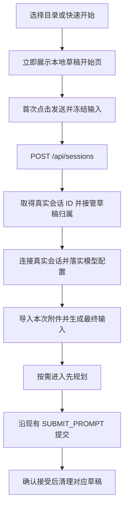

# Pulsara 首次发送时创建会话实施规格

日期：2026-09-27

状态：方案 2 已确定；本文待实施，未声明实现或验收完成。

## 1. 已确定的产品合同

点击新增入口并确定工作目录后，立即展示可以输入的开始页。此时只有浏览器内的草稿；**首次点击发送，才请求后端创建真实会话，创建后自动提交这次输入。**

- 打开开始页、输入文字、选择模型、切换推理档位或先规划、选择附件，都不创建 canonical session，不启动该会话的 Host，不分配快速开始目录。
- 允许读取模型配置、目录候选和技能候选。这些是开始页需要的查询，不得通过查询偷偷创建或恢复会话。
- 首次发送前不预热该会话的 MCP、Hooks、工具或 provider 输入，不在停留若干秒后自动创建，不根据输入长度或附件选择触发创建。
- 后端 Web 服务、设置、数据库连接池等全局资源保持现有生命周期。方案 2 延迟的是新会话及其运行环境，不能承诺整个后端直到发送才启动。
- 已有真实会话继续使用现有连接、恢复、排队、停止、归档和删除合同。

本规格实施后，替换 [文件路径实施规格](PULSARA_FILE_PATH_IMPORT_IMPLEMENTATION_SPEC.zh.md) §10 中“选择目录后立即创建会话”和“快速开始直接创建”的时机；文件表示、导入安全、图片链路、原生目录选择与目录归组合同继续有效。历史验收记录不作为本次验收证据。

不拆分一种持久的“待初始化会话”，不新增后端草稿表、后台创建任务或创建回执系统。首次发送复用现有 `POST /api/sessions` → 连接 → 配置 → 提交链路。

## 2. 当前代码真源与直接结论

以下为撰写时实际读取的生产入口；实施时按符号重新定位，不依赖固定行号。

| 位置 / 符号 | 当前行为 | 本次结论 |
| --- | --- | --- |
| `frontend/app/pulsara-app.tsx`：`createSession` | 调用 `adapter.createSession`，更新列表，再 `openRuntimeSession` | 新增入口必须停止调用这条创建链，改为打开本地草稿 |
| `frontend/components/session-sidebar.tsx`：`createFromShortcut`；`frontend/components/overlays.tsx`：`NewSessionDialog` | 三个侧栏快捷入口和对话框确认都直接创建 | 全部统一到草稿入口，不能漏掉快捷键和命令面板 |
| `src/pulsara_agent/web_app/http_server.py`：`_create_session` | 创建后还读取会话列表，取得 summary 才返回 201 | 创建响应失败不等于没有创建；列表读取失败也可能发生在创建之后 |
| `src/pulsara_agent/web_app/session_controller.py`：`create_session`、`_workspace_input_for_create` | quick 会创建物理目录；随后 `core.open_session` 并发布 live handle | 延迟这次调用，才能同时避免空会话、空 quick 目录和运行环境启动 |
| `src/pulsara_agent/conversation_kernel/host.py`：`open_session`、`_open_admitted` | 服务端生成新 ID，读取 Plugin/Hook/MCP 配置，取得 writer，构建 Host，`start_mcp` 后注册 | 当前创建不是单纯插入一条会话记录；无需为本需求重写整套 Host 生命周期 |
| `src/pulsara_agent/conversation_kernel/_repository/authority.py`：`acquire_host_writer` | `NEW` 在事务内创建 workspace/session、取得 writer；`EXISTING` 不补建缺失身份 | 创建和恢复必须继续分开；不允许浏览器提供可重放的新 session ID |
| `src/pulsara_agent/conversation_kernel/mcp/supervisor.py`：`start` | 启动 enabled server 的连接任务，等待 required 启动，给 optional 现有短等待窗口 | 首次发送可能需要等待实际初始化；不能把“收到创建请求”当作已经可提交 |
| `frontend/lib/prompt-draft.ts`：`PromptDraftStore` | 编辑器、图片 Blob、导入任务按真实 session ID 保存；`capture` 要求文件路径已经生成 | 需要把编辑器所有权与真实会话身份分开，并增加发送前的附件准备步骤 |
| `frontend/app/pulsara-app.tsx`：`setImporter`；`frontend/lib/runtime-adapter.ts`：`LocalRuntimeConnection.importFiles` | 导入要求当前 controller 连接及 generation | 本地草稿先保存 `File`，首次发送连接成功后再导入；不放宽导入权限 |
| `session_controller.py`：`complete_workspace_paths` | 从已有 canonical session 读取工作目录后列举路径 | 项目草稿需要无 session 的目录查询入口，复用同一文件系统 helper |
| `session_controller.py`：`inspect_session_capabilities` | 会调用 `resume_session` | 草稿禁止调用它取得 `$` 候选 |
| `session_controller.py`：`inspect_user_capabilities` | 基于服务启动时的 workspace 读取用户清单，并非所选项目的完整有效技能清单 | 不能直接拿它冒充草稿项目的有效技能候选 |
| `frontend/app/pulsara-app.tsx`：`sendPrompt` | 生成 command ID、处理先规划、提交，并按精确 ID 查询不确定结果；不自动重发未知提交 | 首次提交必须接入这条确认合同，不能另写一个“失败就再次发送”的分支 |
| `host.py`：`update_model_call_binding` | 更新下一次 NEW_TURN 的选择；提交入口会要求有效 binding | 创建后必须先落实草稿中的模型与推理选择，再提交首条消息 |

尤其注意：`acquire_host_writer(NEW)` 的事务提交早于 Host 全部初始化完成。后续异常可能已经留下真实会话。当前 `_create_session` 捕获的 `OSError` / `ValueError` 范围也覆盖深层创建错误，**不能仅凭 HTTP 400 或 `WORKSPACE_UNAVAILABLE` 就认定没有写入。**

## 3. 页面入口与草稿生命周期

### 3.1 入口行为

| 入口 | 新行为 |
| --- | --- |
| “从目录中打开”右侧图标 | 保留原生目录选择器；用户确认目录后直接打开该目录的草稿开始页 |
| 具体目录右侧图标 | 同步切到该目录的草稿开始页 |
| “快速开始”右侧图标 | 同步切到快速开始草稿 |
| 顶部“新建会话”、快捷键、命令面板 | 保留现有工作目录选择对话框；确认后打开草稿。确认按钮改为“开始”，不再显示“正在创建” |

原生窗口的等待属于用户选目录过程。选定之后，不等待创建、连接、能力查询或技能扫描才展示开始页。原生选择取消、关闭对话框、迟到选择结果的现有隔离合同保留。

开始页标题显示“新会话”；项目显示所选绝对目录，快速开始只显示“快速开始”。不提前生成 `quick-...` 路径，不展示虚构的 session ID、记录数或运行状态。开始页使用现有输入框和欢迎页布局。

草稿不加入后端会话列表，不作为 0 条记录的真实会话卡片展示，也不写入 `saveSessionId`。选中草稿时取消旧会话卡片的 active 状态。新增目录只有在真实会话已知后，才进入真实会话目录分组；已有分组按规范化完整路径归组，同名不同路径继续分开。

### 3.2 浏览器内所有权

将当前页面目标显式区分为：

```ts
type ConversationTarget =
  | { kind: 'draft'; draftKey: string }
  | { kind: 'session'; sessionId: string };
```

这只是前端身份，不加入 Kernel DTO，不作为 HTTP session ID。不要用假的 `SessionSummary`、空字符串 ID 或 `session:draft:...` 让现有会话流程误以为后端对象存在。

- 草稿记录保存工作目录选择、模型 binding、推理偏好、本轮权限、先规划状态及编辑器 owner。复用现有 `PromptDraftStore`，不另建第二套富文本/图片/附件管理器。
- 同一浏览器内，重复打开同一工作目录的新增入口，回到该目录尚未发送的草稿；quick 也有自己的草稿。已有真实会话不参与这种复用。
- 这是新增入口的草稿复用规则，不是会话数量限制。草稿落实为真实会话后，该目录下一次新增可以得到新草稿；不得拒绝创建更多真实会话。
- 切换目录或已有会话时，未发送内容留在本页内存，重新点击对应新增入口可以回来。显式丢弃草稿时释放编辑器、File/Blob 引用和 Object URL，终止它的只读查询。
- 刷新、关闭页面后的本地草稿恢复不在本轮合同中，不增加 IndexedDB、localStorage 附件副本或服务器恢复日志；保持当前编辑器的进程内持久性边界。
- 目录身份使用原生选择器或 canonical summary 返回的路径；路径有空格时不 trim。后端在首次创建时重新校验目录，不将早期校验当作持续可用证明。

草稿打开后，旧连接按已有切换机制解除浏览器观察；不得因此发送 stop、关闭其他会话 Host 或改变其运行权限。草稿视图不得沿用旧会话的任务、排队项、TODO、历史、Inspector 能力状态或 provider projection。真实会话的处理可以继续。

页面选择身份、连接请求 attempt 和草稿 owner 必须一起校验。迟到的连接、能力查询、路径候选或创建结果不能抢走用户当前页面。

## 4. 开始页可以做什么

### 4.1 模型、推理、权限和先规划

- 模型菜单使用已有 bootstrap / 模型配置目录；未选择模型时保留现有提示与动效，发送先引导选择，不创建会话。
- 草稿中的模型和推理只写本地草稿。不得以修改选择为由调用 session 的 `model-call-binding` 接口。
- 权限和先规划仍作用于这次待发送输入；草稿切换时各自保留，不误继承上一真实会话的运行状态。
- 首次发送冻结当前完整 binding，包括配置身份和推理偏好；后端继续通过现有 ModelRuntime 校验 / reconcile。不能只保存展示名称，不能静默换成另一个模型。
- “先规划”在真实连接建立、附件路径就绪以后，按已有命令顺序执行。打开菜单或点击先规划本身不启动 PlanMode。
- 草稿没有运行任务，因此不显示停止运行、压缩上下文、后台终端或任务进度控件。进入真实会话后由真实 projection 决定这些控件。

### 4.2 图片、上传文件、目录与路径引用

保持现有插入顺序、Figure 编号、chip、hover 动画、拖放区域和图片多模态形状。

1. 图片：仍保存在 `DraftAsset` 的 Blob / Object URL 中；原有读取、错误处理与发送字节校验继续有效。
2. 从浏览器选择或拖入的普通文件：只保留 `File` 及 chip，新增明确的本地待导入状态。此时不调用 `import-file`，不写 imports 目录。
3. “添加文件夹”仍遵循当前浏览器目录选择的整棵导入合同；选定的文件清单留在草稿，首次发送时导入。空目录限制不变；**拖入目录继续挡住并 toast**，不得顺便开放递归拖入。
4. `@` 或已有文本产生的真实绝对路径引用：按现有路径文字合同保存，无需复制，也不为了引用创建会话。
5. 本地待导入 chip 没有后端绝对路径。hover 不编造路径、不显示路径复制按钮；可以显示一行“发送时导入”。导入成功后恢复现有绝对路径 tooltip。
6. “本地待导入”不等于上传失败，也不应永久禁用发送。正在准备发送、确定读取失败或上传失败要与此区分，失败时仍可删除或重试对应附件。

首次发送后继续使用已有 `import-file` / `import-directory`，保留 controller、connection generation、Host/Origin、流式写入、只读发布、资源边界和失败清理。不新增无会话上传接口，不把非图片字节塞进 prompt JSON。

已返回的导入路径保留并复用；后续步骤失败不能把全部附件重新上传。导入响应丢失时仍遵循现有“可能留下未引用副本”的合同，允许用户重试这份文件得到新路径，不新增文件回执或摘要去重。

草稿转成真实会话时，在原 `PromptDraftStore` 内改变归属，保留同一个 editor / owner、节点 ID、撤销栈、资源和已确认路径。禁止先清空再从纯文本重建；不允许旧草稿键和真实会话键同时可写地持有同一个编辑器。

### 4.3 `@` 路径逐级补全

- 项目草稿：以选择的项目绝对目录为 root，仍按相对前缀逐级查找、游标分页，选择项得到实际绝对路径。
- quick 草稿：尚无 cwd，因此不发路径候选请求，输入 `@` 不弹空列表或“重试”。原样保留输入，仍可添加附件或粘贴绝对路径。真实 quick 会话创建后自动具备普通 `@` 补全。
- 不拿服务进程 cwd、上一个会话 cwd、用户主目录或未创建的猜测路径代替 quick cwd。
- 空结果不弹层；错误沿用当前轻量提示规则，不把原文字变成附件错误。切换草稿、前缀变化和组件卸载后丢弃迟到结果。

### 4.4 `$` 技能候选

草稿也保留“+ → 技能”和 `$` 名称前缀候选。

- 项目草稿：用户、所选项目、相应 Plugin 与 bundled 技能按现有 enablement、优先级和冲突规则得到候选。
- quick 草稿：只有用户、用户 Plugin 和 bundled 范围；不存在项目根，不扫描服务启动目录的项目技能。
- 插入仍然是现有 `$name` / skill chip，候选只匹配名字。不把 Skill 正文拼进用户消息，不把选择变成启用或安装操作。
- 返回的是当前可供选择的技能元数据，不声称已经装入某个会话的 provider 输入。首条运行按原 cold-epoch owner 重新采集；后续来源变化遵守已有 safe-point / epoch 合同。
- 查询失败不阻塞纯文字发送；不伪装成完整空清单，不回退使用上一个会话的候选。已输入 `$name` 仍按现有文字语义处理。

## 5. 必要的只读后端扩展

### 5.1 HTTP 形状与所有权

仅新增开始页需要的两个查询入口；它们不接受或产生草稿 ID，不在服务器保存草稿：

```text
POST /api/workspace-drafts/path-candidates
  { workspace_path: <absolute path>, prefix: <relative prefix>, cursor?: <cursor> }
  -> 与现有 path-candidates 相同的 directory / items / next_cursor

POST /api/workspace-drafts/skill-candidates
  { workspace_kind: "project", workspace_path: <absolute path> }
  或 { workspace_kind: "quick" }
  -> { status: "ready" | "unavailable", items: [...], details: [...] }
```

技能 `items` 只包含编辑器需要的 `name`、`description`、`location`、`path`、`source` 元数据；不得返回工具目录、凭据、Skill 正文或伪造 live/effective 标志。ready 表示这次候选读取完整；unavailable 必须带可展示原因，不能以部分列表冒充完整结果。现有 Skill 单次发现资源边界继续由原 owner 管理。

API 验证 exact shape、工作目录类型与绝对路径。project 先规范化并验证已有目录；quick 不接受 workspace_path。复用本地 Web 的 loopback Host、Origin、Sec-Fetch-Site、draining 检查；调用系统文件操作放入现有线程执行方式。此路径不需要取得 session writer，也不因查询而连接 MCP、执行 Hook、调用 provider 或写 session/workspace 行。

新增查询无需数据库 session 存在；数据库未就绪时创建和发送仍受既有 gate 约束。读取采用按需异步请求：技能菜单或 `$` 需要候选时查询，`@` 根据当前前缀查询；不将查询完成作为展示开始页的前提。目录不存在、权限不足、查询失败给明确结果，开始页已经展示的文字和附件不得丢失。

### 5.2 路径查询复用

继续由 `web_app/path_completion.py::complete_workspace_paths` 实现列举、排序、文件类型判断和分页；新增入口只负责确定 root。已有真实会话入口继续从 canonical session 取得 root。

二者共用同一 helper，不复制扫描实现，不新增递归搜索、总文件数限制或“前 N 个永久可见”的截断。路径可达性和 `../` 等现行相对路径语义保持原样，本轮不扩展或收缩模型文件权限；候选文字不构成工具执行授权。

### 5.3 技能查询的实际复用缺口

已检查以下现有机制，不能简单调用完整 session inspection：

- `capability/local_skills.py::LooseSkillDefinitionProducer` 拥有本地根绑定、解析和观察；目前 `prepare_root_policy` 要求项目根，`PreparedLooseSkillRootPolicy` 的完整性检查也要求两种 workspace root。
- `conversation_kernel/capability.py::KernelSkillProjectionComposer.freeze_owner_snapshot` 已包含 loose + Plugin + bundled 的采集、enablement 与 `SkillCatalogResolver.resolve`，之后才生成 provider capability source snapshot。
- `plugins/view.py::EnabledPluginViewOwner.observe` 会经过 `freeze_enabled_plugin_instance`；遇到有 MCP / Hook 的 Plugin 时，后者可能调用 `ensure_instance_data_root`。所以它当前并非无条件的纯只读候选接口。

实施方式明确如下：

1. 在既有 Skill 组合 owner 中抽出“读取并 resolve 技能目录”的共用入口。草稿只取 inspection 的 winners 元数据；原运行时 freeze 在这个同一结果上继续构造已有 provider source snapshot。不要复制 enablement / 优先级逻辑，也不要让草稿调用完整 provider freeze。
2. 扩展既有 loose 根策略以显式表达“用户范围”和“项目 + 用户范围”。quick 使用用户范围；完整性校验按声明范围验证，不能把不存在的项目目录当真实 root，不能把用户配置不可读降级成来源不存在。
3. 在已有 Plugin 观察 owner 中提供只读技能预览路径，复用 state/package 观察、解析与物理生命周期保护，但不准备运行数据目录、不启动进程。避免为了读取候选调用完整运行准备。它与运行观察共用源解析，不建立第二个 Plugin registry。
4. 复用 Core 已有 bundled distribution binding；请求结束或取消时释放此次 Plugin/package 的借用和观察资源，不创建一个永久驻留的“草稿 Host”。
5. 原 runtime 的所有来源完整性、权限、解析错误与启动行为保持有效；测试必须证明新增只读路径不会让 runtime 跳过运行资源准备。

这几处调整的产品理由仅为“没有真实会话时仍能选择正确的技能”。不增加技能启用语义、模型工具或 provider rebase 边界。

## 6. 首次发送顺序



### 6.1 本地 admission

首次发送由 App 层一个 process-local 操作 owner 持有，不能只靠 Workbench 的组件局部 `submitting`。同一草稿重复点击、Enter 与按钮重叠，只加入同一次正在执行的操作；不是创建两次。

先验证内容非空、模型选择和本地图片状态；在任何 create 请求前截取并固定：草稿 owner/revision、工作目录选择、编辑器文档、图片资产、待导入 File 清单、模型 binding、本轮权限和先规划选择。引用的 File / Blob 保持真实对象，不用 fingerprint 代替输入快照。

现有 `capture` 只能输出已经具备路径的 `EditablePromptContent`。在同一 DraftStore 内拆开“捕获待发送草稿”和“准备完附件后序列化最终输入”；本地待导入节点不能提前序列化成假的路径文字。

准备期间锁住这份输入的编辑、模型切换及重复发送，并给出简短“正在准备…”状态；允许导航到其他页面。失败或在提交前中止后恢复编辑。该状态不伪装成模型正在生成，也不复用运行停止按钮。

### 6.2 创建、连接和落实选择

1. 只有没有已知真实 session ID 的新发送操作才调用 `POST /api/sessions`，请求体保持现有 workspace selection 形状。服务端仍生成 ID。
2. 一收到可信成功响应，就记录真实 session ID，将原编辑器归属转为该 session，合并列表并按 canonical workspace 路径归组。后续任何失败都不能丢掉该身份重新创建。
3. 在当前页面仍属于这次操作时，沿现有 `openRuntimeSession` / adapter 连接，等 controller 和初始化完成。返回精确连接对象供后续使用；不等 React 渲染后再猜 `connectionRef.current`，不借用上一个会话的 projection。
4. 用已有 `updateModelCallBinding` 落实冻结的模型和推理偏好；按现有返回值显示可解释的推理偏好调整。配置失效就保留输入让用户选择，不能用另一个模型提交。
5. 将尚未导入的附件交给这条连接。所有引用就绪才构造最终输入，不能为了让发送成功而忽略失败附件、打乱顺序或丢掉图片。
6. 按既有 `enterPlan` 和 `SUBMIT_PROMPT` 顺序发送，使用冻结的本轮权限。首次发送和后续发送复用同一个命令提交 / 确认 owner。

模型配置与导入之间没有新增跨操作事务。任一步失败，保留真实会话和已成功的准备结果，允许继续完成剩余步骤。

### 6.3 接受、未决与编辑器清理

- 用户输入被既有 receipt 或 canonical 查询确认为已接受后，才清理对应 owner 的已发送内容，并按现有行为重置本轮选项。
- 导入会修改 chip 的内部属性和 revision；不能沿用导入前 revision，导致确认接受后旧消息仍留在输入框。冻结期间没有用户编辑时，在最终序列化处取得对应清理快照，继续使用 `clearIfSnapshot` 的所有权检查。
- 用户已切换页面，或输入 owner 已被显式替换时，禁止清理新页面草稿。确认结果归还原操作 / 原 session。
- 原始 `SUBMIT_PROMPT` 发出后，沿现有 command ID 查询与 `localSubmissions` 对账。未知结果不能生成新 command ID 自动补发，也不能恢复成一个可误点重发的普通未发送输入。
- 先规划响应不确定时，同样查询原命令并核对真实 plan 状态；确认以前不盲目再发 `ENTER_PLAN`。当前 adapter 的 `enterPlan` 在内部生成命令 ID，调用方丢失响应后拿不到这个 ID；实施时让发送 owner 持有它，并通过既有 `command(..., suppliedCommandId)` 传入。同步调整普通发送调用点，保持一个入口，不加兼容重载、不新增协议字段或计划准备回执。

## 7. 错误、导航和恢复边界

### 7.1 失败处理表

| 情况 | 必须发生的行为 |
| --- | --- |
| 没有内容、未选模型、图片读取失败 | 留在草稿处理问题；不发 create |
| 明确在创建 owner admission 之前拒绝，例如请求体形状非法、全局数据库 gate 拒绝 | 保留草稿；修正后可重新发送 |
| create 请求已发出，没有拿到可信 session ID；网络断开、深层创建异常或成功响应解析失败 | 标记“创建结果尚未确认”，保留输入；刷新列表，不自动再次 create |
| 已收到 session ID，但连接、模型配置、导入或先规划失败 | 错误绑定这一个 session；重试连接或未完成步骤，不再 create |
| 已知会话随后被归档或删除 | 沿现有 unavailable / 归档合同处理；不使用这个 ID 补建。用户显式新建才走另一次创建 |
| prompt 已发出但接受状态未知 | 按原 command ID 查询；不自动重发、不把 unknown 当 rejected |
| 服务或页面重启 | canonical session 按现有列表 / 恢复规则可见；不承诺恢复丢失的浏览器草稿或创建操作 |

创建结果不确定时的文案为：“尚未确认会话是否创建，请刷新会话列表查看。”提供“刷新列表”和明确的“重新创建并发送”动作；后一项必须说明可能留下前一次创建的空会话，是用户发起的新创建。普通 Enter / 发送按钮不能绕过这个未决状态直接重复创建；不要把重新创建包装为无副作用的自动重试。

不能靠相同目录、列表第一条、最新时间戳、空历史或随机标题匹配，自动把某个会话认领为本次创建结果。用户可以自行查看或选择列表中的会话；本轮不新增失联创建结果的自动认领机制。

这一取舍与 [永久删除规格](PULSARA_SESSION_PERMANENT_DELETION_HARD_CUT_IMPLEMENTATION_SPEC.zh.md) §5 一致：新身份由服务器生成；丢失新建类响应不自动重放，不用浏览器选定 ID、持久幂等表或墓碑换取新的恢复合同。

对于 `_create_session` 的错误分类，实施时必须缩小“确定未创建”的范围：仅 admission 前已知分支可以给出该结论；调用创建 owner 后的异常一律不能据普通错误码推断回滚。无须为了本需求重做 Host 的提交确认协议。

### 7.2 导航与取消

- 原生选择器 / 只读候选查询：导航后取消或忽略结果，维持当前 owner 检查。
- 首次准备尚未提交 prompt 时用户切走：阻止该操作继续占用当前页面连接或自动发送；已发出的 create 仍由其原操作等待结果，HTTP abort 不当作服务端回滚。
- create 迟到成功：保存已知 ID、接管原草稿并刷新列表；不把页面切回来、不自动连接并抢走当前会话。用户返回该会话后可以继续发送保留输入。
- 已提交 prompt 后切走：命令按现有后台运行与重连对账规则继续；切页面不自动 stop，不根据卸载去 delete session。
- 页面彻底关闭：允许丢失进程内准备状态。已经创建的会话 / quick 目录沿现有保留规则处理；不新增“清理空会话”后台任务，不自动删除用户目录。

只有发送前的草稿被丢弃才纯粹释放浏览器资源。已经创建的真实会话即便没有首条消息，也必须由现有归档 / 删除入口处理。

## 8. AGENTS.md 对照与不变项

| 规则 | 本规格要求 |
| --- | --- |
| Provider prefix continuity | 草稿没有 epoch；预览只读结果不作为 installed provider source。真实会话按既有 cold epoch 建根；新建页查询或 UI 选择不改写任何已有 epoch 的 SYSTEM/tools/messages |
| 最小持久性 | 新增持久表、event kind、subject slot、append guard、product relation、durable job 均为 **0**；仍由现有 session/workspace 行、命令和路径文字承载正式事实 |
| 长程可用性 | 不增加会话数、草稿所对应逻辑工作量、运行时长、重试次数或工具次数上限；复用分页与既有单操作资源边界 |
| Fingerprint subtraction | 草稿用对象身份、已有 revision、连接 generation 和 command ID；不加草稿摘要、DTO fingerprint、文档 SHA 或去重 registry |
| 可观测 dogfood | 真实运行从 `LocalSettingsStore` + `require_pulsara_home()` 读取生产配置；不写设置，不导出密钥。报告排除实际凭据，保留请求顺序、输出和失败证据 |
| Hard cut | 删除“新增入口立即创建”的前端路径；草稿功能全部走统一 target / owner。不存在实验开关或失败后退回方案 1 的兼容分支 |
| 复用 | 编辑器继续 Tiptap，文件/目录选择继续平台与现有入口，路径枚举和技能解析各只有一个实现，Host / writer / bridge / 提交确认继续由既有 owner 管理 |

不改 clean-v0 schema，不增加在线迁移。除上述只读接口及必要共用读取入口外，创建 API 的身份与基本形状、导入协议、模型工具 catalog、排队协议和删除语义均保持现有合同。

## 9. 实施拆分与文件落点

按以下依赖顺序落地；每一步完成后仍以本规格完整验收为准，不把中间“能显示开始页”作为完成。

1. **只读查询 owner**：`web_app/http_server.py`、`web_app/session_controller.py`；复用 `web_app/path_completion.py`，补充 Skill / Plugin 的只读范围与共用 resolve 入口。先证明它们不激活会话。
2. **草稿身份与附件暂存**：`frontend/lib/pulsara-types.ts`、`frontend/lib/prompt-draft.ts` 及 file-reference 节点/展示；分开真实 session ID 与本地编辑器 owner，支持冻结、导入和归属变更。
3. **adapter**：`frontend/lib/runtime-adapter.ts` 增加两个只读查询方法，保留既有 create / connect / import / command 路径与错误类型。
4. **App 首次发送**：`frontend/app/pulsara-app.tsx` 管理目标、草稿复用和首次发送操作；整理连接返回、精确所有权、已知 ID 复用、未知结果与原提交对账。
5. **UI 接入**：`session-sidebar.tsx`、`overlays.tsx`、`workbench-view.tsx` 及编辑器候选/拖放组件统一接入。草稿能输入和选模型，不依赖真实 session 的在线状态；发送仍检查服务 / 数据库准备条件。
6. **移除旧路径并更新文档**：删除快捷入口与对话框提前 create 的绑定、虚假已创建 toast、错误的 ID 判空 gate。更新文件规格中相关时机描述和验收状态，按现有构建方式更新本地静态资源。

运行时 Host / repository 不为本需求新建第二种 session 生命周期。若实现发现确需突破这一边界，先指出无法满足的具体产品条件并修订本文，不能局部加持久草稿、补偿删除或重放创建。

## 10. 验收门槛

### 10.1 有针对性的自动化

扩展已有 App、Sidebar、Dialog、Workbench、PromptDraft、adapter、候选和本地 HTTP 测试；后端命令使用仓库根 `uv` 管理的 `.venv`。重点检验可观察合同：

- 所有新增入口立即打开草稿；用未完成的网络 Promise 证明渲染 / 输入不等待初始化。未发送时，create/connect/session-capabilities/model-binding/import 请求数均为 0。
- 空草稿、取消目录选择、退出开始页、切换目录或反复打开新增入口，不增加 session/workspace 行，不创建 quick 目录，不启动 MCP/Hook/provider。
- 两个项目、同名不同路径、同一规范化目录的别名、quick 与已有会话之间切换，输入、候选、模型和 late response 都归正确 owner。
- 首次发送与双击并发只有一次 create；返回已知 ID 后的连接 / 导入 / 模型失败再继续，仍只有这一次 create。
- 延迟 create 直到用户切走再成功：只更新原草稿归属和列表，不抢页面、不偷用新连接发送。
- project 的 `@` 行为与真实会话一致，分页可继续访问全部结果；quick 未创建前不查错 cwd；空候选不弹重试框。
- `$` 的禁用、重名优先级、项目/用户 Plugin、bundled 来源与既有 resolver 一致；quick 没有项目来源。含 MCP/Hook 的 Plugin 预览不创建运行数据目录、不启动进程；真实 runtime 仍准备其所需资源。
- 纯文字、仅图片、仅文件、文字/多图/多个文件交错、目录选择、已有路径和技能 chip 的顺序与最终 provider 输入正确；拖入目录继续拒绝。
- 未发送时不上传；首次发送导入后生成真实路径，失败附件不被跳过，已确认路径不重复上传。归属改变不损伤撤销栈，接受后不会残留已发送输入，失败不丢 File / Blob。
- create 响应丢失、创建中后置异常和列表读取异常均呈现不确定，不自动重发或按目录猜会话。已知会话删除后不复活。
- 模型配置失效、controller 丢失、先规划拒绝/未决、prompt 接受但响应丢失，遵守原命令确认与权限合同；没有第二套 receipt、提交队列或重试次数上限。
- 原有真实会话发送、排队、TODO、回到最新、附件、停止与归档/删除的针对性回归保持通过。

必要的后端回归落在已有 `tests/test_local_web_http_surface.py`、`tests/test_local_web_browser_bridge.py`、`tests/test_workspace_path_completion.py` 及受影响 Skill/Plugin owner 测试中。Prefix 连续性使用既有验证方式，不能用截图代替。

### 10.2 浏览器与真实服务验证

1. 用生产组件检查桌面与窄屏：快捷新增、原生目录确认、开始页即时可编辑、模型菜单、附件 chip、技能 / 路径候选、准备状态和错误恢复。不能只在假页面看最终截图。
2. 在实际本地后端记录操作前后的会话列表、quick 目录和请求。打开开始页并编辑后，证明没有新增真实会话；发送后证明得到一个 session ID，并收到首条输入的接受结果。
3. project、quick 各走通一次，至少一条包含图片、普通文件和技能选择，并覆盖先规划。模型选择使用已保存可用配置，核对收到的内容、路径可读及图片链路；不使用假响应冒充真实 provider 通过。
4. 用可控故障分别验证慢创建、已知 ID 后的失败以及丢失创建响应；真实服务证据与故障注入证据分别标注。没有实际发送结果时不得宣称“自动发送已通过”。
5. 运行受影响前后端测试、TypeScript、相关 lint 和本地构建，`git diff --check` 通过。只有存在具体残余风险才扩大测试范围；不以本次懒创建为由增加无关长程跑测或新总量限制。

完成报告应包含：哪些路径通过、首次发送调用顺序、未发送零创建证据、已知身份重试证据、创建未知结果的实际表现及任何尚未覆盖项。本文当前仅提供实施合同，不预填通过数字。
