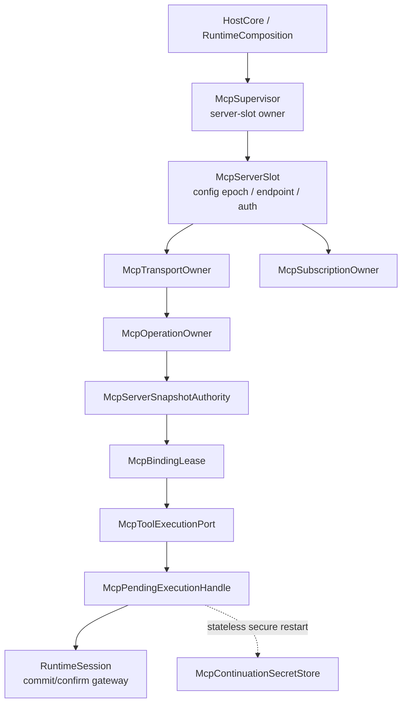

# Pulsara MCP 2026-07-28 / Python SDK v2 Hard Cut 调研与实施规格

_状态：MCP2 CLOSED（MCP2-0 至 MCP2-5 于 2026-07-31 完成代码、迁移、合同与机器审计）_

_实施编号：`MCP2`_

_目标协议修订：`2026-07-28`_

_目标 Python SDK：`mcp==2.0.0`_

本文档同时承担两项职责：

1. 记录 MCP `2026-07-28` 规范与 Python SDK `v2.0.0` 的官方调研结论，并校正社区文章中已经过时或不宜作为架构依据的表述；
2. 对照 Pulsara 当前代码真值，冻结下一轮 MCP hard cut 的 ownership、类型、迁移阶段、文件修改面、质检门控与 Definition of Done。

这不是“把依赖版本号从 beta 改成 stable”的小升级。协议已经从 connection/session-oriented 模型切换为 request-oriented 模型，而 Pulsara 同时拥有 durable binding、WAITING_USER、restart recovery、capability safe-point 与 Host close 等更高层 ownership。实施目标是让二者正确分层，不能把“协议无状态”误解为“Pulsara 不再需要状态”。

---

## 0. 结论先行

### 0.1 正确命名

本轮官方发布包含两个相关但不同的版本事实：

| 层级 | 正式版本 | 含义 |
|---|---|---|
| MCP 规范 | `2026-07-28` | wire protocol revision |
| Python SDK | `2.0.0` | SDK package major version |

因此本文统一使用：

> MCP `2026-07-28` 协议修订 + Python SDK `v2.0.0`

“MCP 2.0 协议”可以作为非正式简称，但不能进入 durable DTO、版本比较、capability negotiation 或 rollout gate。

### 0.2 Pulsara 应采用的总体策略

Pulsara 不应直接照搬 SDK 高层默认行为，而应保留自己的 durable ownership，并完成以下 hard cut：

```text
官方 SDK stable transport / codec
    -> Pulsara SDK facade
    -> exact negotiated protocol fact
    -> per-server binding/snapshot authority
    -> per-operation physical owner
    -> RuntimeSession durable suspension / settlement
```

最终必须同时成立：

1. `mcp==2.0.0` 成为唯一 SDK 版本，不再存在 beta compatibility branch；
2. exact protocol revision 与 closed behavior era 分开建模；`STATELESS_PER_REQUEST` 与 `HANDSHAKE_SESSIONFUL` 表达行为，不能用年份冒充 era；
3. `STATELESS_PER_REQUEST` HTTP 不再被建模为有协议 session 的长期 authority；长期 authority 仍属于 Pulsara server slot、snapshot 与 binding lease；
4. MRTR 继续由 Pulsara 手工驱动；state-only leg由operation owner自动重试，只有non-empty、已声明支持的client input requests才允许进入WAITING_USER；
5. `requestState` 是 opaque、potentially secret 的 continuation capability，绝不进入模型输入、普通 EventLog payload、普通 ArtifactStore、日志或 Inspector 明文；
6. SDK cache 默认关闭，直到 Pulsara 拥有可观测、可归因、auth-safe 的 cache contract；
7. `subscriptions/listen` 只产生 dirty signal，不能直接修改 capability snapshot；
8. MCP Apps 与 Tasks 不进入本轮生产面。Python SDK `2.0.0` 尚未实现 Tasks extension；Apps 需要独立的 UI sandbox/CSP/consent 设计；
9. Roots、Sampling、Logging 不作为新能力接入。earlier-revision compatibility 可以继续解码，但新 Pulsara capability 不得依赖这些 deprecated features；
10. event-safe authority与storage-only secret record使用不同sealed base/registry/repository，不能依赖sink denylist冒充类型边界；
11. SDK elicitation callback只在form与URL Host能力全部就绪时安装；否则不广告`elicitation/create`；
12. durable replay必须先把`REPLAY_READY -> DISPATCH_RESERVED`与typed event/account attribution原子提交FULL，才能发生physical send；
13. 每次companion commit都以sequence-null historical candidate与typed EventLog rebind receipt证明exact batch，stored sequence continuity是独立证明；
14. form/current-round responses统一使用sealed process-local secret vocabulary，durable authority只有keyed commitment，默认不投影给模型；
15. 现有 `PULSARA_STABLE_MCP_META_TOOL_SURFACE_DESIGN.zh.md` 仍是独立产品面设计。本轮不得顺带启用或改变 meta-tool surface。

### 0.3 分阶段裁决

本轮拆成六个连续阶段：

```text
MCP2-0  additive contracts、golden truth、stable probe
MCP2-1  Python SDK 2.0.0 mechanical hard cut
MCP2-2  behavior-era 与 transport ownership hard cut
MCP2-3  discovery/schema/cache-hint/subscription hard cut
MCP2-4  form/URL MRTR + secure carrier + dispatch/account companion subcut
MCP2-5  auth/trace/cleanup/contracts/DoD
```

`MCP2-0` 到 `MCP2-3` 不修改 EventLog durable schema，可以连续发布。`MCP2-4` 涉及 secret carrier、MCP suspension fact、materialization account与physical charge contract，必须作为显式 offline schema subcut；没有配置 production secret key 时，stateless MRTR restart继续typed fail-closed，绝不降级为明文persistence。

### 0.4 本轮审查意见闭环索引

| Finding | 本规格修订位置 |
|---|---|
| durable authority误用process-local base | 8：event-safe、storage-only、ordinary process-local与sealed secret五层类型边界 |
| `inputSchema` wire contract误读 | 2.7、8.4、11.1、19.2：object container、required root type、explicit dialect |
| SDK并非透明codec | 8.7、11.2、11.3：SDK-conformed listing + public `send_request()` raw-result seam |
| MRTR把所有leg都当human input | 14.1、14.8：state-only/client-input discriminated union与exact form+URL capability policy |
| suspension transaction companion无法穿透 | 14.8：pre-commit、single PostgreSQL transaction、post-confirm与account seam |
| carrier缺完整commitment/bounds | 14.4到14.7：full keyed commitment、envelope fingerprint、CAS与closed bounds |
| cache pagination/freshness owner缺失 | 8.5、12、13：page receipt、next-use freshness、reconnect-first-reconcile |
| `LEGACY_2025` era不准确 | 8.1：behavior-based era + exact revision |
| storage-only secret fact误用event-safe base | 8.0、14.6：`FrozenStorageFactBase`与sealed storage registry |
| callback同时广告form/URL | 2.3、8.1、9.2、14.1：typed mode union，MCP2-4同步激活两种Host port |
| replay dispatch缺durable CAS | 14.7、14.8：`DISPATCH_RESERVE` event + companion + FULL-before-send |
| original request不是closed replay carrier | 14.4：method-specific retryable payload union与wire reconstruction |
| dirty后new dispatch线性化不清 | 12.3：reason-aware dispatch admission matrix |
| absent/null与bounds DTO空洞 | 8.7、14.3、14.5：wire presence + complete bounds fields |
| dispatch stable candidate混入变化account guard | 14.3、14.8：durable fact删除account revision；process-local commit guard在writer lock内刷新 |
| companion identity未绑定ordered batch | 14.8：candidate IDs/payload fingerprints/batch accumulator进入plan与handle identity |
| multi-inputRequests缺round owner | 14.1：`McpElicitationBatchOwner`、per-key状态与all-or-nothing resolution |
| continuation expiry lineage未冻结 | 14.3到14.9：单一`operation_expires_at_utc`，所有round/carrier不得续期 |
| raw result structuredContent双真源 | 8.7：base result物理删除structuredContent字段，presence/value唯一owner |
| final exact discover未指定wire seam | 9.2：`send_discover(exact_revision)` + validate + `adopt(final)`；禁止用cached `discover()`作证明 |
| candidate/stored batch表示未冻结 | 14.8：sequence-null historical re-encode + typed EventLog rebind receipt |
| final discover缺typed receipt | 8.1、8.7、9.2：final-discover/legacy-initialize receipt union进入generation与negotiation attribution |
| response普通digest泄漏 | 14.1、14.3：raw hash只留sealed owner；durable只保存keyed commitment派生的attribution |
| form response未进入secret boundary | 8.0、14.1、14.11：统一sealed base，禁止pickle/asdict/model dump与LLM projection |

---

## 1. 调研来源与证据等级

### 1.1 官方来源

以下来源构成本规格的规范依据：

| 来源 | 用途 |
|---|---|
| [MCP 2026-07-28 Specification](https://modelcontextprotocol.io/specification/2026-07-28) | 最终规范真源 |
| [2026-07-28 changelog](https://modelcontextprotocol.io/specification/2026-07-28/changelog) | 相对 `2025-11-25` 的穷尽变更清单 |
| [官方发布说明](https://blog.modelcontextprotocol.io/posts/2026-07-28/) | 最终发布的架构解释 |
| [Release Candidate 说明](https://blog.modelcontextprotocol.io/posts/2026-07-28-release-candidate/) | stateless、MRTR 与扩展背景 |
| [Python SDK v2.0.0 release](https://github.com/modelcontextprotocol/python-sdk/releases/tag/v2.0.0) | stable package、known gaps 与 beta-to-stable 变化 |
| [Python SDK v2: What's new](https://py.sdk.modelcontextprotocol.io/whats-new/) | SDK v2 总览 |
| [Python SDK migration guide](https://py.sdk.modelcontextprotocol.io/migration/) | 机械迁移依据 |
| [Tool schema reference](https://modelcontextprotocol.io/specification/2026-07-28/schema) | wire schema的closed字段类型 |
| [Tools leaf specification](https://modelcontextprotocol.io/specification/2026-07-28/server/tools) | input/output schema、`x-mcp-header`与result contract |
| [MRTR leaf specification](https://modelcontextprotocol.io/specification/2026-07-28/basic/patterns/mrtr) | state-only/client-input leg、opaque string与retry规则 |
| [Elicitation leaf specification](https://modelcontextprotocol.io/specification/2026-07-28/client/elicitation) | form/URL capability、interaction、response与URL safety contract |
| [Caching contract](https://modelcontextprotocol.io/specification/2026-07-28/server/utilities/caching) | cacheable methods、分页TTL与notification invalidation |
| [SDK `ClientSession.call_tool`](https://github.com/modelcontextprotocol/python-sdk/blob/v2.0.0/src/mcp/client/session.py#L1014-L1071) | SDK pre-return output validation真值 |
| [SDK `list_tools` conformance](https://github.com/modelcontextprotocol/python-sdk/blob/v2.0.0/src/mcp/client/session.py#L1234-L1284) | `x-mcp-header`过滤、header map与output schema state |
| [SDK `ClientSession.send_request`](https://github.com/modelcontextprotocol/python-sdk/blob/v2.0.0/src/mcp/client/session.py#L507-L552) | public raw-result seam与protocol/name/parameter header stamping |
| [SDK client capability builder](https://github.com/modelcontextprotocol/python-sdk/blob/v2.0.0/src/mcp/client/session.py#L3189-L3195) | elicitation callback会同时广告form与URL的实现真值 |
| [SDK MRTR driver](https://github.com/modelcontextprotocol/python-sdk/blob/v2.0.0/src/mcp/client/_input_required.py) | state-only backoff与默认round cap |
| [SDK MRTR `_dispatch_all`](https://github.com/modelcontextprotocol/python-sdk/blob/v2.0.0/src/mcp/client/_input_required.py#L99-L127) | keyed inputRequests并发dispatch与all-response map真值 |
| [SDK pinned Client construction](https://github.com/modelcontextprotocol/python-sdk/blob/v2.0.0/src/mcp/client/client.py#L332-L343) | pinned mode与`prior_discover`只用于adopt的公开契约 |
| [SDK pinned enter implementation](https://github.com/modelcontextprotocol/python-sdk/blob/v2.0.0/src/mcp/client/client.py#L450-L463) | final Client enter不会自动re-discover |
| [SDK `send_discover` / cached `discover`](https://github.com/modelcontextprotocol/python-sdk/blob/v2.0.0/src/mcp/client/session.py#L684-L755) | 强制wire discover seam与`discover()` cached fast path |
| [MCP Tasks extension](https://modelcontextprotocol.io/extensions/tasks/overview) | Tasks 的扩展边界 |
| [MCP Apps extension](https://modelcontextprotocol.io/extensions/apps/overview) | Apps 的扩展边界 |

版本发布时间证据：Python SDK GitHub release 将 `v2.0.0` 标记为 2026-07-28 发布，明确支持 MCP `2026-07-28` 并兼容更早协议修订；`v1.x` 进入只接收安全修复的 maintenance mode。

### 1.2 用户提供文章的定位

参考文章为：[《MCP协议2026-07-28规范重大更新｜升级指南》](https://www.bilibili.com/opus/1230332994459271250)。

文章对三个主方向的概括基本正确：

1. 协议移除 initialize/session；
2. MRTR 用 `InputRequiredResult` 和原请求 replay 替代 server-initiated requests；
3. Apps、Tasks 进入 extension framework。

但以下内容不能直接进入 Pulsara architecture contract：

| 文章表述 | 本规格裁决 |
|---|---|
| 应安装 beta/RC | 已过时。2026-07-28 已发布 stable `mcp==2.0.0` |
| server 成为“纯函数” | 过度表述。协议请求无 session，不代表 server implementation、tool backend 或业务 continuation 没有状态 |
| `requestState` 可被 LLM 推理 | 不接受。它必须被视为 opaque continuation capability；模型只能看到 typed user-visible input requests |
| 企业托管成本下降 40% 到 60% | 非官方、不可验证估算，不进入容量或成本模型 |
| Prompt Cache 必然降低推理成本 | 只能作为可能收益。确定性排序与 MCP response cache 不等于 provider prompt cache 的可证明命中 |
| Tasks 已可直接用 | 规范扩展已经存在，但 Python SDK `2.0.0` release 明确列为 known gap，本轮不得依赖 |
| 网络中断天然可恢复 MRTR | 只在 client 安全保存原请求、`requestState` 与 exact target authority 时成立；协议本身不会替 Pulsara完成 durable ownership |

### 1.3 证据优先级

冲突时使用以下优先级：

```text
final specification
  > stable SDK release + stable migration docs
  > official release blog
  > SDK implementation behavior
  > community article
  > 本地推断
```

任何来自 SDK implementation 的临时行为都必须被 facade 隔离，不能成为 Pulsara durable identity。

---

## 2. MCP 2026-07-28 的实际变化

### 2.1 Stateless core

规范移除了：

- `initialize` / `notifications/initialized` handshake；
- Streamable HTTP 的 `Mcp-Session-Id`；
- list endpoints 随 connection/session 变化的语义；
- HTTP GET notification stream；
- SSE resumability、`Last-Event-ID` 与 redelivery；
- `ping`。

每个 `2026-07-28` stateless request 通过 `_meta` 携带 protocol version 与 client capabilities。server 必须支持 `server/discover`，用于声明支持的协议版本、capabilities 与 identity。

Pulsara 的解释必须是：

```text
wire protocol session removed
!=
Pulsara server slot / binding / operation ownership removed
```

server slot 仍拥有 config epoch、resolved endpoint、auth context、snapshot generation、binding leases、subscription owner 与 close/drain。

### 2.2 Multi Round-Trip Requests

所有 result 都有 required `resultType`：

```text
complete
input_required
```

`complete | input_required`是closed execution vocabulary，不是示例集合。SDK为了前向兼容可能把未知`resultType`保留为普通result model；Pulsara在tool/resource/prompt三路都必须在任何terminal lowering前检查exact discriminator。未知值进入typed `MCP_UNSUPPORTED_RESULT_TYPE` fail-closed，不能被投影成成功ToolResult，也不能触发同一side effect的自动重试。

`InputRequiredResult`至少包含`inputRequests`或`requestState`之一。它有两类不同时间语义：

```text
state-only leg:
  InputRequiredResult(requestState, no inputRequests)
  -> bounded backoff
  -> immediate replay same method-specific base params(requestState, no inputResponses)

client-input leg:
  InputRequiredResult(non-empty inputRequests, optional requestState)
  -> satisfy exactly the advertised/supported current-round requests
  -> replay same method-specific base params(current-round inputResponses, optional requestState)
```

只有client-input leg可以进入Pulsara durable suspension。state-only leg属于同一个physical operation owner，不能创建WAITING_USER、ToolResult suspension或human notification。

`requestState`的wire类型是opaque string。client必须byte-exact echo，不得parse、modify或推断。每次retry只携带紧邻上一leg的current-round responses，不得累计重发旧round responses。

这与Pulsara已经落地的durable suspension主线方向一致。真正需要升级的是leg classification、client capability exact binding、secure restart carrier与stable SDK lowering。

### 2.3 Elicitation modes

`elicitation/create`不是单一交互形态，而是closed mode union：

```text
form
  -> client内展示并验证structured form
  -> accept时response携带content

url
  -> client显示exact full URL/domain并征得显式同意
  -> 禁止prefetch与embedded inspectable webview
  -> accept/decline/cancel response都不携带form content
```

SDK `2.0.0`的capability builder只要安装elicitation callback，就同时广告`form` 与 `url`。因此Pulsara V1不允许“只实现form却安装callback”：

```text
form Host port ready AND URL Host port ready
  -> install callback
  -> advertise form + url

otherwise
  -> callback=None
  -> do not advertise elicitation/create
```

Form mode必须显示server identity、message与requested schema，允许review/modify/decline/cancel。URL mode必须显示exact full URL、突出host、在打开前获取explicit consent，并且不把URL内容或用户在网页中的输入交给LLM。两种mode的typed carrier、Host routing与security policy在14.1冻结。

### 2.4 Header routing

Streamable HTTP POST 现在使用标准 header：

- `Mcp-Method`；
- `Mcp-Name`；
- 由合法`x-mcp-header` annotation产生的`Mcp-Param-{name}` headers。

`x-mcp-header`不是未来可选policy。对Streamable HTTP，client必须拒绝包含非法annotation的tool，并对合法primitive argument发出对应header。Pulsara选择让stable SDK的`list_tools()`与request stamp拥有这项wire conformance，不复制header parser/emitter；binding必须精确绑定已经absorb该listing的SDK client generation。caller仍不得覆盖SDK routing headers。

### 2.5 Unified subscriptions

`subscriptions/listen` 取代旧 GET stream 与 `resources/subscribe`/`unsubscribe`，可订阅：

- `toolsListChanged`；
- `promptsListChanged`；
- `resourcesListChanged`；
- `resourceSubscriptions`。

request-scoped progress/log notifications仍属于原请求 response stream，不进入 subscription stream。

### 2.6 Cache hints

以下complete results提供cache hints：

- `server/discover`；
- `tools/list`；
- `prompts/list`；
- `resources/list`；
- `resources/templates/list`；
- `resources/read`；
- `ttlMs`；
- `cacheScope = public | private`。

分页result的每一页有独立TTL，freshness从该页received time计算；不同页TTL可以不同，分页之间没有一致性保证。需要完整snapshot时必须从`cursor=None`重新抓取。MRTR retry request不得缓存。

这些字段是freshness/sharing hints，不是capability semantic authority。Pulsara不能因为cache尚未过期就越过required reconcile、binding generation或permission freeze。

### 2.7 Schema 与 structured content

三项wire contract必须分开：

1. `inputSchema`必须是JSON object container，且根`type: "object"`为required；缺失或非object根使该tool无效；
2. `outputSchema`若存在也必须是JSON object container，但它描述的result根类型可以是object、array、scalar或其他合法schema形状；
3. `structuredContent`可以是任意JSON value，并在声明`outputSchema`时与之匹配。

若schema没有`$schema`，默认dialect为JSON Schema 2020-12；若显式声明draft-07等dialect，必须保存并按声明验证，不能一律改写为2020-12。

这要求 Pulsara 将以下两项分开：

1. SDK-conformed MCP listing/schema authority；
2. provider-specific tool schema projection。

当前“缺`type: object`时自动注入”的做法必须删除。无效input schema应被SDK/wire conformance过滤或由Pulsara标为invalid tool，不能修补后暴露。

### 2.8 Extension framework

client/server capability新增 `extensions`。Apps 与 Tasks 独立版本演进，不属于 core。

本轮只持久化、比对和投影 extension declarations，不激活 Apps 或 Tasks runtime。

### 2.9 Deprecated features

Roots、Sampling、Logging进入至少十二个月 deprecation window。新实现不应增加这些能力：

- Roots 改为 tool parameters、resource URI 或 server config；
- Sampling 改由 host 直接调用模型 provider；
- Logging 改为 stderr 或 OpenTelemetry。

### 2.10 Auth 与 tracing

规范增加/收紧：

- RFC 9207 `iss` validation；
- client credential issuer binding；
- `application_type`；
- refresh token 与 scope 规则；
- W3C `traceparent`、`tracestate`、`baggage` propagation。

Dynamic Client Registration 已进入 deprecated，优先使用 Client ID Metadata Documents。

---

## 3. Python SDK v2.0.0 调研结论

### 3.1 稳定版事实

Python SDK `v2.0.0`：

- 同时支持 `2026-07-28` 与 earlier protocol revisions；
- 提供 first-class `Client`；
- `FastMCP` 重命名为 `MCPServer`，主要影响 server side；
- protocol types位于 `mcp-types` package，`mcp.types` 是永久 alias；
- HTTP implementation 使用 `httpx2`；
- OpenTelemetry 默认集成；
- stdio shutdown 已强化；
- `Client(cache=False)` 在 stable 改为 `Client(cache=None)`；
- `server_info` 在 stateless request/result语义下不能被假设为始终非空；
- Tasks extension 尚未实现。

### 3.2 Pulsara 必须手工驱动 MRTR

SDK high-level `Client` 可以自动消费 input-required callback，但这会吞掉 Pulsara 的 durable WAITING_USER boundary。

`resources/read`与`prompts/get`可以继续通过public low-level session verbs并设置`allow_input_required=True`。`tools/call`采用3.3冻结的raw-result seam。三者都把`InputRequiredResult`交给Pulsara leg classifier，不调用SDK high-level MRTR driver。

概念入口为：

```python
client.session.read_resource(..., allow_input_required=True)
client.session.get_prompt(..., allow_input_required=True)
sdk_raw_call_tool(...)
```

是否立即state-only retry、是否suspend、何时写event、谁拥有pending lease、何时replay，仍由Pulsara MCP execution port、ToolExecutionTerminalRegistry与RuntimeSession决定。

### 3.3 SDK-conformed listing + Pulsara raw-result seam

stable SDK不是透明wire codec：

- `ClientSession.list_tools()`会按`2026-07-28` `x-mcp-header` MUST过滤invalid tools，并建立process-local argument-to-header map与output-schema map；
- `ClientSession.call_tool()`会在返回non-error result前调用`validate_tool_result()`，mismatch时caller拿不到raw result。

本轮明确选择以下边界，不复制完整protocol stack：

```text
discovery:
  public ClientSession.list_tools()
  -> SDK-conformed listing authority
  -> Pulsara freeze + additional bounded validation

tool call:
  public ClientSession.send_request(
      CallToolRequest,
      Pulsara-owned stable TypeAdapter[CallToolResult | InputRequiredResult]
  )
  -> SDK仍负责 protocol stamp、Mcp-Method/Mcp-Name/Mcp-Param headers
  -> Pulsara取得protocol-parsed raw result
  -> Pulsara freeze + bounded output validation
```

约束：

1. raw seam只能位于`runtime/mcp/sdk.py`；
2. 只使用stable public `send_request()`与official types，不读取`_call_tool_adapter`、`_x_mcp_header_maps`或其他private state；
3. 不激活claimed extension result，因此adapter只含core complete/input-required arms；
4. call必须借用exact SDK client generation，该generation已经完整absorb产生binding的tool listing；
5. reconcile不原地改写active generation，必须build新generation、complete listing、safe-point swap、drain旧generation；
6. SDK过滤前的rejected raw tool不是Pulsara authority，Inspector只能报告SDK conformance contract与post-filter surface，不能伪造被过滤tool清单；
7. output mismatch由Pulsara在raw result冻结后判定，因此可以保留bounded raw-result artifact且physical call count恒为1。

### 3.4 Stable API 的直接破坏点

当前 `_build_sdk_client()` 仍传入：

```python
Client(..., cache=False)
```

在 isolated stable `mcp==2.0.0` probe 中，构造路径得到：

```text
AttributeError: 'bool' object has no attribute 'target_id'
```

这说明现有 mock/ownership tests 虽然覆盖了 facade 上层行为，却没有证明真实 stable transport 可以构造。

### 3.5 当前测试证据的边界

本次调研确认现有定向测试在 beta 环境下通过：

```text
68 passed  # capability MCP / execution port / Host lifecycle
10 passed  # SDK discovery / architecture
78 passed total
```

该证据证明 SDK churn 已经被集中在 facade 内，但不能替代 stable package + real transport integration gate。

---

## 4. Pulsara 当前代码真值

### 4.1 依赖仍停在 beta

`pyproject.toml` 当前固定：

```toml
"mcp[cli]==2.0.0b1"
"mcp-types==2.0.0b1"
```

`runtime/mcp/sdk.py` 的 module contract 也明确写着 SDK beta。

### 4.2 SDK facade 隔离方向正确

只有 `runtime/mcp/sdk.py` 直接 import official SDK。上层 supervisor、tool execution、capability provider 与 Host 消费 Pulsara-owned DTO。这一边界必须保留。

### 4.3 当前 stable incompatibilities

| 代码真值 | stable 风险 |
|---|---|
| `cache=False` | stable 应使用 `cache=None` |
| `import httpx` 构造 MCP HTTP client | SDK v2 stable transport 使用 `httpx2` |
| 无条件 `client.server_info.model_dump(...)` | stateless/handshake 分支可能为 `None` |
| `_sdk_stdio_process()` 遍历 SDK private exit stack/frame locals | stable private implementation不构成契约 |
| 全 connection 一个 `asyncio.Lock` | stateless HTTP 被不必要地串行化 |
| snapshot不保存 exact capabilities/extensions/cache hints | 无法证明 negotiated surface |
| tool schema被静默修补为 object | 改写 server JSON Schema authority |

### 4.4 现有 durable MRTR 基础值得保留

当前代码已经具备：

- typed `McpInputRequiredSuspensionFact`；
- pending lease reservation identity；
- process-local pending execution handle；
- exact binding identity；
- typed resolution；
- method-specific base params + `requestState` replay；
- successor suspension与terminal settlement；
- Host/child closure与restart fail-close。

但当前lowering会把空`input_requests`也转成`McpInputRequired`，`McpInputRequestDTO.method`仍为开放字符串，SDK Client也没有安装明确的client-input capability callback。transaction方面，tool reservation writer拒绝generic companion，专用suspension path与materialization account均未接受companion。

因此本轮不重做MCP execution state machine的主干，但必须增加state-only leg、closed input method、exact client capability policy与accounted suspension companion。

### 4.5 Snapshot contract 不完整

当前 `McpServerSnapshot`包含：

- tools/resources/templates/prompts；
- protocol version；
- server info；
- instructions；
- lifecycle timing。

但缺少：

- exact client/server capabilities；
- behavior era；
- declared extensions；
- per-result cache hints；
- tool output schema、title、icons、execution metadata；
- schema projection disposition。

### 4.6 Auth 与 observability 现状

当前 remote HTTP支持静态 headers、env-backed headers与 bearer token env var，redirect默认 fail-closed。这是合理 V1 安全基线。

当前没有 Pulsara-owned OAuth credential/issuer owner，也没有 MCP operation-level W3C trace attribution。不得在 SDK upgrade PR 中悄悄开启隐式 credential persistence。

---

## 5. 范围与非目标

### 5.1 本轮必须完成

1. stable SDK依赖与 API hard cut；
2. behavior-era exact negotiation fact；
3. stateless HTTP、handshake-sessionful HTTP、stdio的closed transport ownership；
4. exact discovery/capability/extension snapshot；
5. schema object/container/root validation、explicit dialect preservation与provider projection分离；
6. arbitrary JSON `structuredContent` 与 optional output schema validation；
7. cache hint capture，SDK opaque cache保持关闭；
8. `subscriptions/listen` dirty-signal owner；
9. state-only MRTR、form+URL typed client-input policy、secret-safe durable continuation与typed fail-close；
10. auth-context binding、trace propagation与 stable failure taxonomy；
11. 更新长期 MCP contract、Inspector/doctor输出与 architecture guards；
12. 删除 beta/private compatibility代码。

### 5.2 明确非目标

- 不实现 MCP server；
- 不启用 MCP Apps UI；
- 不实现 MCP Tasks；
- 不把 Tasks映射为 `terminal_monitor`、D3 projection job或subagent；
- 不新增 Roots、Sampling、Logging；
- 不改变 MCP meta-tool public surface；
- 不把 SDK cache作为 product cache；
- 不将 remote MCP变成任意 header proxy；
- 不将 `requestState`暴露给模型；
- 不在本轮重构整个 capability registry或permission体系；
- 不保留 beta/stable dual runtime branch。

---

## 6. Hard-cut 不变量

### 6.1 协议与 SDK

1. durable protocol identity使用规范 revision字符串，不使用 SDK major；
2. behavior era由SDK confirmed negotiated revision中央factory计算，era名称不得包含年份；
3. 未知 revision为typed unsupported，不按字符串字典序猜测；
4. SDK types不得越过 `runtime/mcp/sdk.py` 与专用 lowering module；
5. production不得导入 SDK private module或读取 private attribute/frame local；
6. stable package只有一个版本真源；
7. event-safe/durable facts必须继承`FrozenFactBase`并注册schema/fingerprint；
8. storage-only durable secret records必须继承独立`FrozenStorageFactBase`，不得成为event candidate；
9. `FrozenRuntimeStateBase`只允许process-local owner、SDK binding与hydrated secret使用；
10. surface semantic identity与discovery/transport/cache/auth attribution必须物理分开。

### 6.2 Binding authority

1. `server_info`仅为display/diagnostic，不是security identity；
2. exact binding至少绑定 server slot、config epoch、resolved endpoint、auth context、snapshot generation、protocol fact与tool contract；
3. 同名 tool不能作为resume/replay authority；
4. subscription、cache与reconnect不能原地改写已安装snapshot；
5. snapshot replacement仍经过现有 reconcile candidate、safe-point与installation receipt。

### 6.3 MRTR

1. 模型只看到typed `inputRequests`、不含字段值的bounded resolution status与最终durable ToolResult；raw form/current-round responses永不自动进入provider payload；
2. `requestState`视为 bearer-grade secret；
3. retryable method-specific base params也可能含secret，与requestState放在同一secret carrier；
4. EventLog只保存user-visible request、opaque carrier reference/commitment与binding attribution；
5. ordinary ArtifactStore不得保存continuation plaintext；
6. stateless-era restart resume只允许exact target/auth/protocol rebind；
7. handshake-era restart不得新建同名connection冒充旧session；
8. secure store不可用、key不匹配或carrier过期时typed fail-close并terminalize；
9. replay失败不得自动重新执行一个不同physical request；
10.每个round的predecessor、resolution与successor suspension形成exact chain；
11. state-only leg不产生durable suspension，使用50ms起步、250ms封顶的bounded backoff；
12. 每次retry只提交紧邻上一leg的current-round responses；
13. MCP2-1到MCP2-3不广告elicitation；MCP2-4只有form与URL Host port同时READY才广告`elicitation/create`的两种mode；
14. URL mode必须先显示exact URL并取得明确同意，禁止prefetch与LLM projection；
15. 收到sampling/roots或其他未广告method时typed reject；
16. `requestState`必须是optional opaque string，不能generalize为任意JSON；
17. replay只保存closed method-specific base params，wire ID、`_meta`、历史responses/state与transport metadata必须重新生成或明确排除；
18. `REPLAY_READY`不能直接发网络请求；dispatch reservation event与control CAS FULL是唯一send authority。

### 6.4 Cache 与 subscriptions

1. cache是优化，不是authority；
2. cache hit仍必须生成可归因snapshot input；
3. private cache key必须绑定auth-context fingerprint；
4. V1不跨auth context共享public cache；
5. 每个分页page拥有独立request-params fingerprint、received time与TTL；
6. cache/page attribution不进入surface semantic fingerprint；
7. subscription notification只标记dirty；
8. subscription owner退出不改变最后committed snapshot；
9. reconnect后必须先从cursor=None完成full discovery/reconcile，再信任新subscription；
10. next-use freshness owner负责发现stale page并触发reconcile，不能只写“TTL会恢复”。

### 6.5 Cancellation 与 close

1. caller cancellation只detach waiter，不能遗弃physical operation；
2. operation owner负责deadline、cancel、physical exit与lease release；
3. Host close在释放HTTP client、stdio process、secret store lease前drain对应owner；
4. close deadline耗尽必须显式blocked，不得假装成功；
5. provider已返回后lowering失败不得再次physical execute/replay。

### 6.6 Accounted suspension commit

1. process-local pending owner必须在event write前reserve，但它不是PostgreSQL participant；
2. suspension events、physical materialization account CAS与encrypted carrier row必须由同一EventLog transaction提交；
3. MCP caller只能提交closed prepared companion，不得获得generic SQL/EventLog companion escape hatch；
4. `FULL`/`NONE`/`UNKNOWN`/`CONFLICT`之后才分别confirm、retain、latch或abort process-local owner；
5. stable event candidate、frozen ciphertext envelope与charge fact在`NONE`重试时byte-identical；
6. resolution、successor suspension与terminal delete各自使用closed state-transition companion与exact predecessor CAS；
7. companion payload bytes进入existing lifetime materialization account，不建立未计费的secret side channel；
8. candidate batch authority始终基于exact historical schema与`sequence=None` payload；EventLog分配sequence后通过typed rebind receipt证明同一candidate，不能混用stored payload hash；
9. form/current-round response的durable身份只来自keyed commitment attribution，raw ordinary fingerprint不得进入event、control或dispatch candidate。

---

## 7. 最终 ownership 拓扑



### 7.1 Server slot owner

`McpServerSlotOwner`稳定拥有：

- `server_id`；
- config epoch；
- resolved endpoint identity；
- auth context identity；
- current snapshot authority；
- reconcile generation；
- current transport owner或transport factory；
- optional subscription owner；
- active binding leases；
- close/drain state。

它不等于MCP protocol session。

### 7.2 Transport owner closed union

```python
McpTransportOwner = (
    StatelessHttpTransportOwner
    | HandshakeHttpSessionOwner
    | StdioProcessTransportOwner
)
```

#### Stateless-per-request HTTP

- `Client`/HTTP pool可以process-local复用以降低连接成本；
- authority属于每个request与server slot，不属于connection session；
- 使用bounded semaphore而不是全局serialization lock；
- 每个operation独立拥有request ID、deadline、trace、cancel与physical completion。

#### Handshake-sessionful HTTP

- 保留SDK-required session/connection owner；
- 同一physical owner内按SDK约束序列化；
- restart不伪造session continuation。

#### stdio

- subprocess与SDK client context由同一owner task管理；
- 使用stable SDK public close；
- 禁止遍历 `_exit_stack`、async-generator frame或private process；
- 若public close无法满足deadline，返回typed close-blocked并保留dependency lease，不得use-after-close。

### 7.3 Operation owner

```text
PREPARED
  -> IN_FLIGHT(g)
      -> RESULT_RECEIVED
          -> LOWERED
          -> LOWERING_FAILED
      -> INPUT_REQUIRED_RECEIVED
      -> TRANSPORT_FAILED
      -> CANCEL_REQUESTED
  -> PHYSICAL_EXITED
  -> RETIRED
```

`RESULT_RECEIVED`后physical request已经发生。任何lowering/schema/artifact错误都只能生成typed terminal outcome或reconciliation，不得再次调用server。

### 7.4 Subscription owner

`McpSubscriptionOwner`是process-local长期owner，拥有：

- exact server slot identity；
- subscription request与subscription ID；
- selected notification kinds；
- reconnect generation；
- bounded backoff；
- dirty-key coalescer；
- close task与deadline。

它不拥有capability installation。

---

## 8. Central typed contracts

### 8.0 Event-safe / storage-only / process-local 五层规则

所有central carrier先按owner分类：

| 层 | 基类 | 可序列化 | 例子 |
|---|---|---:|---|
| durable semantic/event-safe authority | `FrozenFactBase` | yes | protocol、server surface、tool semantic、provider projection |
| durable/event-safe attribution | `FrozenFactBase` | yes | endpoint、auth generation、discovery pages、cache hints、SDK conformance |
| durable/storage-only secret record | `FrozenStorageFactBase` | 仅storage codec | encrypted envelope、carrier control projection |
| ordinary process-local owner/live binding | `FrozenRuntimeStateBase`或frozen dataclass | no | SDK client、transport task、monotonic freshness |
| process-local continuation secret | `SealedMcpContinuationSecretBase` | 仅typed secret borrow | decrypted carrier、form response、round response set |

每个event-safe `FrozenFactBase` concrete type必须：

1. 使用string `schema_version`，例如`mcp_server_protocol_semantic.v1`；
2. 在`DURABLE_FACT_FINGERPRINT_REGISTRY`注册唯一domain separator与own fingerprint field；
3. 只通过`build_frozen_fact()`或对应central factory构造；
4. own fingerprint覆盖除自身fingerprint字段之外的全部字段；
5. copied nested fingerprint通过`DurableFingerprintJoinSpec`或writer exact-read证明；
6. 递归只含event-safe immutable值，不嵌入SDK object、live handle、monotonic clock或plaintext secret。

`FrozenStorageFactBase`是新的sealed low-level base，不继承`FrozenFactBase`：

```python
class FrozenStorageFactBase(BaseModel):
    """Immutable durable record accepted only by a typed storage repository."""

    model_config = ConfigDict(frozen=True, extra="forbid")

    @model_validator(mode="after")
    def _validate_registered_storage_fingerprint(self):
        DURABLE_STORAGE_FACT_FINGERPRINT_REGISTRY.validate(self)
        return self
```

Storage fact规则：

1. 使用独立`DURABLE_STORAGE_FACT_FINGERPRINT_REGISTRY`与`@_storage_fact(...)`；
2. Event writer/event candidate的类型签名只接受`FrozenFactBase`，不接受storage base；
3. secret repository mutation只接受明确的`FrozenStorageFactBase` union，不接受event fact或dict；
4. EventLog、Artifact、Inspector deny guard保留作为defense in depth，不再是主要类型边界；
5. 不提供`FrozenFactBase | FrozenStorageFactBase`的generic durable union或generic serializer；
6. storage record也必须有schema version、own fingerprint、central factory与recursive immutability。

禁止给`FrozenRuntimeStateBase`增加全局`arbitrary_types_allowed`来绕过ownership。

`SealedMcpContinuationSecretBase`是不继承Pydantic model、dataclass或任一durable base的独立sealed runtime vocabulary：

```python
class SealedMcpContinuationSecretBase:
    __slots__ = ()

    def __repr__(self) -> str:
        return "<sealed-mcp-continuation-secret>"

    __str__ = __repr__

    def __copy__(self):
        return self

    def __deepcopy__(self, memo):
        return self

    def __reduce__(self):
        raise TypeError("MCP continuation secret cannot be pickled")

    def __reduce_ex__(self, protocol: int):
        raise TypeError("MCP continuation secret cannot be pickled")

    def __getstate__(self):
        raise TypeError("MCP continuation secret cannot be serialized")
```

其concrete type只能由central sealed factory构造，使用private slots与递归immutable sealed JSON node；不得提供`__dict__`、`model_dump()`、`dict()`、`to_json()`或generic mapping view。因为它不是dataclass，`dataclasses.asdict()`必须立即`TypeError`；copy/deepcopy只能返回同一immutable object或拒绝。只有secret-store encryption factory与fresh MCP wire builder可凭borrower-scoped `McpContinuationSecretBorrow`读取内部值。Host UI通过窄typed accessor完成表单展示/提交，不得取得generic JSON serializer。日志、diagnostic、Inspector、EventLog与ordinary artifact sink按marker type二次拒绝。

### 8.1 Protocol semantic、negotiation attribution 与 live binding

```python
class McpProtocolBehaviorEra(StrEnum):
    STATELESS_PER_REQUEST = "stateless_per_request"
    HANDSHAKE_SESSIONFUL = "handshake_sessionful"


class McpClientInputMethod(StrEnum):
    ELICITATION_CREATE = "elicitation/create"
    SAMPLING_CREATE_MESSAGE = "sampling/createMessage"
    ROOTS_LIST = "roots/list"


class McpElicitationMode(StrEnum):
    FORM = "form"
    URL = "url"


@_fact(
    "mcp_server_protocol_semantic.v1",
    "semantic_fingerprint",
    "mcp-server-protocol-semantic:v1",
)
class McpServerProtocolSemanticFact(FrozenFactBase):
    schema_version: Literal["mcp_server_protocol_semantic.v1"]
    protocol_revision: str
    behavior_era: McpProtocolBehaviorEra
    server_capabilities: FrozenJsonObjectFact
    ordered_extension_contracts: tuple[McpExtensionSemanticFact, ...]
    semantic_fingerprint: Fingerprint


@_fact(
    "mcp_client_capability_policy.v1",
    "policy_fingerprint",
    "mcp-client-capability-policy:v1",
)
class McpClientCapabilityPolicyFact(FrozenFactBase):
    schema_version: Literal["mcp_client_capability_policy.v1"]
    supported_input_methods: tuple[McpClientInputMethod, ...]
    elicitation_modes: tuple[McpElicitationMode, ...]
    elicitation_host_contract_fingerprint: Fingerprint | None
    sampling_advertised: bool
    roots_advertised: bool
    logging_advertised: bool
    ordered_extension_ads: tuple[McpExtensionSemanticFact, ...]
    policy_fingerprint: Fingerprint


@_fact(
    "mcp_final_discover_wire_receipt.v1",
    "receipt_fingerprint",
    "mcp-final-discover-wire-receipt:v1",
)
class McpFinalDiscoverWireReceiptFact(FrozenFactBase):
    schema_version: Literal["mcp_final_discover_wire_receipt.v1"]
    physical_operation_id: str
    sdk_client_generation_id: str
    exact_protocol_revision: str
    client_capability_policy_fingerprint: Fingerprint
    endpoint_attribution_fingerprint: Fingerprint
    auth_attribution_fingerprint: Fingerprint
    raw_result_payload_fingerprint: Fingerprint
    receipt_fingerprint: Fingerprint


@_fact(
    "mcp_legacy_initialize_wire_receipt.v1",
    "receipt_fingerprint",
    "mcp-legacy-initialize-wire-receipt:v1",
)
class McpLegacyInitializeWireReceiptFact(FrozenFactBase):
    schema_version: Literal["mcp_legacy_initialize_wire_receipt.v1"]
    physical_operation_id: str
    sdk_client_generation_id: str
    exact_protocol_revision: str
    client_capability_policy_fingerprint: Fingerprint
    endpoint_attribution_fingerprint: Fingerprint
    auth_attribution_fingerprint: Fingerprint
    raw_result_payload_fingerprint: Fingerprint
    receipt_fingerprint: Fingerprint


McpNegotiationWireReceiptFact = (
    McpFinalDiscoverWireReceiptFact | McpLegacyInitializeWireReceiptFact
)


@_fact(
    "mcp_protocol_negotiation_attribution.v1",
    "attribution_fingerprint",
    "mcp-protocol-negotiation-attribution:v1",
)
class McpProtocolNegotiationAttributionFact(FrozenFactBase):
    schema_version: Literal["mcp_protocol_negotiation_attribution.v1"]
    protocol_semantic_fingerprint: Fingerprint
    client_capability_policy_fingerprint: Fingerprint
    negotiation_source: Literal["server_discover", "legacy_initialize"]
    negotiation_wire_receipt_fingerprint: Fingerprint
    sdk_version: Literal["2.0.0"]
    sdk_conformance_contract_fingerprint: Fingerprint
    server_info: FrozenJsonObjectFact | None
    endpoint_attribution_fingerprint: Fingerprint
    auth_attribution_fingerprint: Fingerprint
    attribution_fingerprint: Fingerprint
```

Process-local binding使用frozen dataclass：

```python
@dataclass(frozen=True, slots=True)
class McpSdkNegotiatedProtocolBinding:
    sdk_client_generation_id: str
    transport_generation: int
    client: object
    negotiation_wire_receipt: McpNegotiationWireReceiptFact
    protocol_semantic_fingerprint: Fingerprint
    client_capability_policy_fingerprint: Fingerprint


@dataclass(frozen=True, slots=True)
class McpSdkProtocolBinding(McpSdkNegotiatedProtocolBinding):
    complete_listing_accumulator: Fingerprint
```

Rules：

- exact revision `2026-07-28`映射到`STATELESS_PER_REQUEST`；
- SDK支持的`2024-11-05`及2025 revisions映射到`HANDSHAKE_SESSIONFUL`；
- unknown revision不得自动映射；
- `server_info=None`合法，只属于attribution/display；
- SDK client object永不进入durable fact。
- `McpSdkNegotiatedProtocolBinding`只证明final discover/initialize已完成；它是listing期间的provisional owner，不得被manager installation、operation admission或dispatch borrow消费；
- `McpSdkProtocolBinding`只能在全部listing页、tool rejection与provider projection冻结后构造，`complete_listing_accumulator` required且non-empty；不存在`None`占位或同一对象原地补字段；
- `STATELESS_PER_REQUEST` binding只能携带`McpFinalDiscoverWireReceiptFact`，`HANDSHAKE_SESSIONFUL`只能携带`McpLegacyInitializeWireReceiptFact`；branch、exact revision、generation、capability policy、endpoint与auth必须逐字段join；
- receipt只能由SDK facade在matching physical operation收到并冻结raw wire result后构造，不能由`adopt()`、cached `discover()`结果、布尔`did_network_io`或caller自报operation ID构造；
- `McpProtocolNegotiationAttributionFact.negotiation_wire_receipt_fingerprint`必须精确引用matching branch的receipt；durable snapshot不复制raw result，只保存该registered receipt fingerprint与现有bounded attribution；
- SDK `2.0.0`下`elicitation_modes`只允许`() | (FORM, URL)`；不得构造form-only policy；
- `ELICITATION_CREATE`出现时，两个mode和non-null Host contract fingerprint必须同时存在；
- callback absence对应no elicitation ad，callback presence必须exact join两种ready Host port。

### 8.2 Endpoint 与 auth attribution

```python
@_fact(
    "mcp_endpoint_attribution.v1",
    "attribution_fingerprint",
    "mcp-endpoint-attribution:v1",
)
class McpEndpointAttributionFact(FrozenFactBase):
    schema_version: Literal["mcp_endpoint_attribution.v1"]
    transport_kind: Literal["streamable_http", "stdio"]
    canonical_target_fingerprint: Fingerprint
    tls_policy_fingerprint: Fingerprint | None
    redirect_policy: Literal["deny", "same_origin"]
    executable_identity_fingerprint: Fingerprint | None
    attribution_fingerprint: Fingerprint


@_fact(
    "mcp_auth_attribution.v1",
    "attribution_fingerprint",
    "mcp-auth-attribution:v1",
)
class McpAuthAttributionFact(FrozenFactBase):
    schema_version: Literal["mcp_auth_attribution.v1"]
    auth_kind: Literal["none", "static_headers", "bearer_env", "oauth"]
    issuer_identity_fingerprint: Fingerprint | None
    client_identity_fingerprint: Fingerprint | None
    effective_scope_fingerprint: Fingerprint | None
    credential_generation: int
    keyed_credential_commitment: str | None
    attribution_fingerprint: Fingerprint
```

secret value不进入payload。endpoint/auth/config/transport generation均为attribution，不进入server surface semantic identity。

### 8.3 Server surface semantic 与 snapshot authority

Tool之外的surface item也必须是registered durable facts，不允许用普通dict或未版本化DTO填充snapshot：

```python
@_fact("mcp_resource_semantic.v1", "semantic_fingerprint", "mcp-resource-semantic:v1")
class McpResourceSemanticFact(FrozenFactBase):
    schema_version: Literal["mcp_resource_semantic.v1"]
    server_id: str
    uri: str
    name: str
    title: str | None
    description: str | None
    mime_type: str | None
    size: int | None
    annotations: FrozenJsonObjectFact
    icons: tuple[FrozenJsonObjectFact, ...]
    protocol_meta: FrozenJsonObjectFact | None
    semantic_fingerprint: Fingerprint


@_fact(
    "mcp_resource_template_semantic.v1",
    "semantic_fingerprint",
    "mcp-resource-template-semantic:v1",
)
class McpResourceTemplateSemanticFact(FrozenFactBase):
    schema_version: Literal["mcp_resource_template_semantic.v1"]
    server_id: str
    uri_template: str
    name: str
    title: str | None
    description: str | None
    mime_type: str | None
    annotations: FrozenJsonObjectFact
    icons: tuple[FrozenJsonObjectFact, ...]
    protocol_meta: FrozenJsonObjectFact | None
    semantic_fingerprint: Fingerprint


@_fact(
    "mcp_prompt_argument_semantic.v1",
    "semantic_fingerprint",
    "mcp-prompt-argument-semantic:v1",
)
class McpPromptArgumentSemanticFact(FrozenFactBase):
    schema_version: Literal["mcp_prompt_argument_semantic.v1"]
    name: str
    title: str | None
    description: str | None
    required: bool
    semantic_fingerprint: Fingerprint


@_fact("mcp_prompt_semantic.v1", "semantic_fingerprint", "mcp-prompt-semantic:v1")
class McpPromptSemanticFact(FrozenFactBase):
    schema_version: Literal["mcp_prompt_semantic.v1"]
    server_id: str
    name: str
    title: str | None
    description: str | None
    arguments: tuple[McpPromptArgumentSemanticFact, ...]
    icons: tuple[FrozenJsonObjectFact, ...]
    protocol_meta: FrozenJsonObjectFact | None
    semantic_fingerprint: Fingerprint
```

Resource/read content、prompt/get result与execution result不是snapshot semantic fact；它们继续由各自protocol result/ToolResult owner承载。

```python
@_fact(
    "mcp_server_surface_semantic.v1",
    "surface_semantic_fingerprint",
    "mcp-server-surface-semantic:v1",
)
class McpServerSurfaceSemanticFact(FrozenFactBase):
    schema_version: Literal["mcp_server_surface_semantic.v1"]
    server_id: str
    protocol_semantic: McpServerProtocolSemanticFact
    tools: tuple[McpToolSemanticFact, ...]
    resources: tuple[McpResourceSemanticFact, ...]
    resource_templates: tuple[McpResourceTemplateSemanticFact, ...]
    prompts: tuple[McpPromptSemanticFact, ...]
    instructions: str | None
    surface_semantic_fingerprint: Fingerprint


@_fact(
    "mcp_discovery_attribution.v1",
    "attribution_fingerprint",
    "mcp-discovery-attribution:v1",
)
class McpDiscoveryAttributionFact(FrozenFactBase):
    schema_version: Literal["mcp_discovery_attribution.v1"]
    snapshot_id: str
    config_epoch: int
    discovery_generation: int
    transport_generation: int
    endpoint: McpEndpointAttributionFact
    auth: McpAuthAttributionFact
    negotiation: McpProtocolNegotiationAttributionFact
    page_set_receipts: tuple[McpDiscoveryPageSetAttributionFact, ...]
    ordered_tool_rejections: tuple[McpToolDiscoveryRejectionFact, ...]
    reconcile_attempt_id: str
    attribution_fingerprint: Fingerprint


@_fact(
    "mcp_server_snapshot_authority.v1",
    "authority_fingerprint",
    "mcp-server-snapshot-authority:v1",
)
class McpServerSnapshotAuthorityFact(FrozenFactBase):
    schema_version: Literal["mcp_server_snapshot_authority.v1"]
    surface_semantic: McpServerSurfaceSemanticFact
    discovery_attribution: McpDiscoveryAttributionFact
    ordered_provider_projections: tuple[McpProviderSchemaProjectionFact, ...]
    surface_semantic_fingerprint: Fingerprint
    projection_accumulator: Fingerprint
    authority_fingerprint: Fingerprint
```

`surface_semantic_fingerprint`只覆盖protocol/server/tool/resource/prompt/instructions语义。它明确排除：

- config/discovery/transport generation；
- endpoint/auth/credential generation；
- cache TTL、received time、cursor与page ordinal；
- reconcile attempt、timing与SDK live identity；
- provider target-specific projection。

`authority_fingerprint`覆盖semantic与全部attribution，用于exact installation/replay；不能拿它代替surface semantic dedupe。

### 8.4 Tool semantic、SDK conformance attribution 与 provider projection

```python
class McpProviderProjectionDisposition(StrEnum):
    EXACTLY_SUPPORTED = "exactly_supported"
    LOSSLESS_NORMALIZED = "lossless_normalized"
    NOT_EXPOSABLE = "not_exposable"


class McpToolWireRejectionCode(StrEnum):
    INVALID_INPUT_SCHEMA = "invalid_input_schema"
    INVALID_OUTPUT_SCHEMA = "invalid_output_schema"
    UNSUPPORTED_DIALECT = "unsupported_dialect"
    SCHEMA_BOUNDS_EXCEEDED = "schema_bounds_exceeded"


class McpProviderProjectionRejectCode(StrEnum):
    PROVIDER_SCHEMA_UNSUPPORTED = "provider_schema_unsupported"
    LOSSLESS_PROJECTION_UNAVAILABLE = "lossless_projection_unavailable"


@_fact(
    "mcp_tool_discovery_rejection.v1",
    "rejection_fingerprint",
    "mcp-tool-discovery-rejection:v1",
)
class McpToolDiscoveryRejectionFact(FrozenFactBase):
    schema_version: Literal["mcp_tool_discovery_rejection.v1"]
    server_id: str
    observed_tool_name: str
    source_page_receipt_fingerprint: Fingerprint
    observed_tool_payload_fingerprint: Fingerprint
    reason_code: McpToolWireRejectionCode
    sdk_conformed_listing_generation_fingerprint: Fingerprint
    rejection_fingerprint: Fingerprint


@_fact(
    "mcp_tool_semantic.v1",
    "tool_semantic_fingerprint",
    "mcp-tool-semantic:v1",
)
class McpToolSemanticFact(FrozenFactBase):
    schema_version: Literal["mcp_tool_semantic.v1"]
    server_id: str
    name: str
    title: str | None
    description: str
    input_schema: FrozenJsonObjectFact
    input_schema_dialect: str
    output_schema: FrozenJsonObjectFact | None
    output_schema_dialect: str | None
    annotations: FrozenJsonObjectFact
    icons: tuple[FrozenJsonObjectFact, ...]
    execution: FrozenJsonObjectFact | None
    protocol_meta: FrozenJsonObjectFact | None
    tool_semantic_fingerprint: Fingerprint


@_fact(
    "mcp_tool_discovery_attribution.v1",
    "attribution_fingerprint",
    "mcp-tool-discovery-attribution:v1",
)
class McpToolDiscoveryAttributionFact(FrozenFactBase):
    schema_version: Literal["mcp_tool_discovery_attribution.v1"]
    tool_semantic_fingerprint: Fingerprint
    source_page_receipt_fingerprint: Fingerprint
    sdk_conformance_contract_fingerprint: Fingerprint
    sdk_conformed_listing_generation_fingerprint: Fingerprint
    sdk_header_routing_contract_fingerprint: Fingerprint
    pulsara_output_validation_contract_fingerprint: Fingerprint
    attribution_fingerprint: Fingerprint


@_fact(
    "mcp_provider_schema_projection.v1",
    "projection_fingerprint",
    "mcp-provider-schema-projection:v1",
)
class McpProviderSchemaProjectionFact(FrozenFactBase):
    schema_version: Literal["mcp_provider_schema_projection.v1"]
    tool_semantic_fingerprint: Fingerprint
    provider_schema_contract_fingerprint: Fingerprint
    disposition: McpProviderProjectionDisposition
    projected_schema: FrozenJsonObjectFact | None
    lossless_proof_fingerprint: Fingerprint | None
    reason_code: McpProviderProjectionRejectCode | None
    projection_fingerprint: Fingerprint
```

Validation matrix：

- `input_schema`container必须object，根`type`必须exact `"object"`；
- `output_schema`container若存在必须object，但其根`type`可为合法JSON Schema类型；
- `$schema`缺失时resolved dialect=`https://json-schema.org/draft/2020-12/schema`；
- 显式dialect按allowlist/validator registry解析，draft-07不得被改写；
- invalid input schema或invalid `x-mcp-header` tool不能修补；
- SDK `list_tools()`之后才允许构造`McpToolSemanticFact`；因此它是SDK-conformed authority，不声称保存SDK已过滤的raw listing；
- Pulsara不重算、不保存、不查看SDK process-local argument-to-header map；
- `sdk_conformed_listing_generation_fingerprint`仅绑定exact SDK client/listing generation与conformance contract，不伪造map payload；
- model-visible capability只能消费confirmed provider projection。

### 8.5 Cache page attribution 与 process-local freshness

```python
class McpCacheableMethod(StrEnum):
    SERVER_DISCOVER = "server/discover"
    TOOLS_LIST = "tools/list"
    PROMPTS_LIST = "prompts/list"
    RESOURCES_LIST = "resources/list"
    RESOURCE_TEMPLATES_LIST = "resources/templates/list"
    RESOURCES_READ = "resources/read"


@_fact(
    "mcp_cache_page_attribution.v1",
    "page_receipt_fingerprint",
    "mcp-cache-page-attribution:v1",
)
class McpCachePageAttributionFact(FrozenFactBase):
    schema_version: Literal["mcp_cache_page_attribution.v1"]
    method: McpCacheableMethod
    request_params_fingerprint: Fingerprint
    request_cursor: str | None
    page_ordinal: int
    received_at_utc: str
    raw_ttl_ms: int | None
    resolved_ttl_ms: int
    raw_cache_scope: Literal["public", "private"] | None
    resolved_cache_scope: Literal["public", "private"]
    hint_disposition: Literal[
        "exact",
        "absent_earlier_revision",
        "negative_normalized",
    ]
    result_payload_fingerprint: Fingerprint
    next_cursor: str | None
    page_receipt_fingerprint: Fingerprint


@_fact(
    "mcp_discovery_page_set_attribution.v1",
    "page_set_fingerprint",
    "mcp-discovery-page-set-attribution:v1",
)
class McpDiscoveryPageSetAttributionFact(FrozenFactBase):
    schema_version: Literal["mcp_discovery_page_set_attribution.v1"]
    method: McpCacheableMethod
    started_from_cursor_none: bool
    ordered_pages: tuple[McpCachePageAttributionFact, ...]
    page_receipt_accumulator: Fingerprint
    common_resolved_cache_scope: Literal["public", "private"]
    complete_capture: bool
    page_set_fingerprint: Fingerprint
```

Process-local freshness：

```python
class McpPageFreshnessState(FrozenRuntimeStateBase):
    page_receipt_fingerprint: Fingerprint
    received_monotonic: float
    expires_monotonic: float
```

restart后monotonic state不可恢复，全部page按stale处理并从`cursor=None`做full discovery。cache/page facts只进入attribution，不进入surface semantic fingerprint。Stateless complete result缺少required hint不构造伪造的page fact，而是产生`MCP_CACHE_HINT_INVALID`；earlier revision缺失hint时按`resolved_ttl_ms=0`、`resolved_cache_scope="private"`保守lower，并保留raw absence attribution。

wire presence必须来自SDK/Pydantic `model_fields_set`（或等价raw receipt），不能把`ttl_ms=0`、`cache_scope=private`的model default当成server已发送字段。同一个paginated method的全部page必须具有exact相同的resolved cache scope；`public/private`混合在page-set factory与central fact validator两层fail-closed，不得静默聚合为`private`。

### 8.6 Extension semantic

```python
@_fact(
    "mcp_extension_semantic.v1",
    "semantic_fingerprint",
    "mcp-extension-semantic:v1",
)
class McpExtensionSemanticFact(FrozenFactBase):
    schema_version: Literal["mcp_extension_semantic.v1"]
    extension_id: str
    extension_version: str | None
    declaration: FrozenJsonObjectFact
    support_disposition: Literal[
        "declared_not_activated",
        "activated_by_owned_runtime",
        "unsupported"
    ]
    semantic_fingerprint: Fingerprint
```

本轮所有Apps/Tasks均为`declared_not_activated`或`unsupported`。

### 8.7 SDK client generation与raw-result carrier

```python
@dataclass(frozen=True, slots=True)
class McpSdkConformedClientGeneration:
    generation_id: str
    sdk_protocol_binding: McpSdkProtocolBinding
    final_negotiation_wire_receipt: McpNegotiationWireReceiptFact
    client: object
    snapshot_id: str
    snapshot_semantic_fingerprint: Fingerprint
    snapshot_authority_fingerprint: Fingerprint
    complete_tool_listing_accumulator: Fingerprint
    ordered_tool_attribution_fingerprints: tuple[Fingerprint, ...]
    accepting_operations: bool


class McpRawToolCallResultCarrier(FrozenRuntimeStateBase):
    operation_id: str
    sdk_client_generation_id: str
    tool_semantic_fingerprint: Fingerprint
    result_kind: Literal["complete", "input_required"]
    frozen_protocol_result_without_structured_content: FrozenJsonObjectFact
    structured_content_present: bool
    structured_content: FrozenJsonValue
    carrier_fingerprint: Fingerprint
```

SDK client object只在frozen dataclass live owner中存在。`final_negotiation_wire_receipt`必须与`sdk_protocol_binding.negotiation_wire_receipt`为同一个immutable fact identity，且receipt中的generation ID等于owner `generation_id`；READY guard不得另存布尔位替代它。`McpRawToolCallResultCarrier`已经脱离SDK object，但仍是pre-durable process carrier；只有完成Pulsara schema/result lowering后才能形成durable ToolResult facts。

完整listing完成后必须在production从provisional `McpSdkNegotiatedProtocolBinding`构造新的final `McpSdkProtocolBinding`与该generation；final binding的required `complete_listing_accumulator`必须等于generation的`complete_tool_listing_accumulator`。`from_connected_server()`只消费final binding与该owner，并要求传入snapshot的ID、semantic fingerprint、完整authority fingerprint、wire receipt、protocol与tool attribution全部exact join；dispatch borrow再次要求同一个accepting generation与SDK client object identity。不存在“snapshot READY但generation未构造”或“provisional binding直接接单”的合法安装路径。

`structuredContent`的wire presence与value必须分别冻结，且不能同时留在base result中。唯一raw-result factory在任何`model_dump()`、`exclude_none`或JSON normalization之前读取SDK/Pydantic的`model_fields_set`，随后从base object物理删除`structuredContent`再冻结：

```text
field absent
  -> structured_content_present = false
  -> structured_content = null       # placeholder, 不代表wire null

field present with explicit null
  -> structured_content_present = true
  -> structured_content = null

field present with JSON value
  -> structured_content_present = true
  -> structured_content = exact frozen JSON value
```

`frozen_protocol_result_without_structured_content`的factory/validator必须拒绝任何大小写或alias解析后仍代表`structuredContent`的字段。`carrier_fingerprint`覆盖base result、presence bit与value，三者只能由同一个factory产生。若tool声明`outputSchema`，只有`structured_content_present=true`才能进入schema validation；显式`null`按schema本身判断合法性。validator、terminal lowering和artifact renderer都不得再用`value is None`推断presence，也不得从base result第二次读取该字段。

---

## 9. SDK v2 stable mechanical hard cut

### 9.1 Dependency truth

`pyproject.toml`改为：

```toml
"mcp[cli]==2.0.0"
```

规则：

1. production source使用 `import mcp.types as types`；
2. 删除project-level direct `mcp-types` pin，避免两份版本真源；
3. lock gate验证resolved `mcp-types`版本与SDK声明兼容；
4. MCP facade若直接构造HTTP client，则显式声明与SDK stable兼容的`httpx2`依赖；
5. repo其他非MCP HTTP代码可继续使用`httpx`，两者不得互换对象。

### 9.2 Client construction 与 capability binding

Client capability policy分为两个可部署状态：

```text
MCP2-1 .. MCP2-3:
  elicitation/create = not advertised
  callback = None

MCP2-4 activated deployment:
  elicitation/create = advertised
  modes = form + url
  form Host port = READY
  URL Host port = READY

sampling/createMessage = not advertised
roots/list = not advertised
logging = not advertised
extensions = no active claims
```

SDK根据callback presence构造client capabilities，且v2.0.0将elicitation callback投影为form + URL。因此composition root必须先构造closed binding：

```text
McpElicitationCapabilityDisabled
  callback=None

McpElicitationCapabilityFull
  exact form interaction port
  exact URL interaction/launch port
  capability policy (FORM, URL)
  manual raw-MRTR advertisement callback
```

不存在form-only或“callback已安装、Host port未安装”的合法组合。连接采用两阶段owner：

```text
ProtocolProbeOwner
  Client(transport, cache=None, callbacks=None, mode="auto")
  -> exact revision/discover or initialize
  -> close probe physical owner

FinalSdkClientGenerationOwner
  stateless:
    Client(
      transport,
      mode=exact_revision,
      prior_discover=confirmed_discover,
      elicitation_callback=resolved_elicitation_binding.callback,
      sampling_callback=None,
      list_roots_callback=None,
      cache=None,
    )
    -> enter: SDK adopts prior_discover only; no wire I/O
    -> client.session.send_discover(exact_revision)  # required wire I/O
    -> validate raw final DiscoverResult
    -> freeze McpFinalDiscoverWireReceiptFact from physical operation + raw result
    -> client.session.adopt(final_discover_result)
    -> build READY generation from final result + exact receipt

  handshake:
    Client(
      transport,
      mode="legacy",
      callbacks=None,
      cache=None,
    )
    -> initialize exact handshake-sessionful surface
    -> freeze McpLegacyInitializeWireReceiptFact
```

Advertisement callback只用于SDK capability ad。production不得使用会dispatch callback的high-level MRTR driver；若callback被意外调用，它typed fail-closed并触发architecture test。MCP2-4激活时必须restart server slot，用full binding创建新SDK generation；不得在open generation上动态改callback/capability。

Pinned Client的`__aenter__()`只会`adopt(prior_discover)`，而`ClientSession.discover()`在已有result时直接返回缓存；二者都不能证明final endpoint发生过新wire I/O。唯一合法的final verification seam是public `send_discover(exact_revision)`。流程必须：

1. final session先adopt probe result以安装exact protocol stamp；
2. 调用`send_discover(exact_revision)`并从operation registry取得matching physical operation identity；
3. 对raw final result执行schema、revision、endpoint/security attribution与cache-hint验证；
4. 在任何`adopt(final)`或READY installation前，由central factory以raw final result canonical bytes、physical operation、generation、exact policy、endpoint与auth冻结`McpFinalDiscoverWireReceiptFact`；
5. 只比较probe与final之间必须稳定的部分：selected protocol revision、resolved physical endpoint/TLS authority与配置绑定；
6. 不要求整个`DiscoverResult` byte-equal，因为final Client广告的form/URL capabilities可能与probe不同，server catalog/capabilities也可据此合法变化；
7. 调用`adopt(final_discover_result)`，仅以final result和matching receipt构造READY snapshot、tool catalog与capability authority。

禁止调用cached `discover()`后把返回值标记成final network receipt，也禁止把probe receipt换写为final generation ID。`raw_result_payload_fingerprint`必须来自本次physical operation返回的raw final result，不能来自adopted object的事后dump。stdio允许启动一个短期probe process与一个final process，两者都由Supervisor bounded drain；final process同样必须完成上述wire discover。Handshake-era branch以同一receipt factory family从真实initialize operation生成`McpLegacyInitializeWireReceiptFact`，不能复用server slot的旧initialize结果。

不得：

- 传 `cache=False`；
- 使用URL shorthand绕过Pulsara HTTP policy；
- 开启SDK default opaque cache；
- 将SDK client object暴露到manager port以上；
- 对stateless/handshake era广告同一套callback capabilities；
- 使用SDK high-level `call_tool()`吞掉input-required或pre-return output validation。

### 9.3 HTTP client

remote Streamable HTTP必须由Pulsara创建owned `httpx2.AsyncClient`，冻结：

- redirect默认deny；
- timeout按operation quote；
- static/env headers经过secret redaction；
- SDK protocol headers不可被user config覆盖；
- endpoint canonicalization与auth-context identity在connect前冻结；
- close由transport owner完成。

### 9.4 Optional server info

lowering必须接受：

```text
server_info = None | typed JSON object
```

不得无条件 `.model_dump()`。server info缺失不应使READY snapshot失败，只产生bounded diagnostic。

### 9.5 Stdio close

删除：

- `_terminate_sdk_stdio_process()`；
- `_sdk_stdio_process()`；
- 对 `_exit_stack`、`_exit_callbacks`、generator frame locals的读取。

保留一个Pulsara owner task的前提是它只通过public context manager管理enter/exit。若stable SDK已保证同task close，则owner task继续负责deadline与physical exit，不负责private process kill。

### 9.6 Stable integration gate

mock测试之外必须增加：

1. real stable in-process stateless server；
2. real stable stdio subprocess server；
3. handshake-sessionful protocol fixture；
4. `cache=None` construction smoke；
5. optional `server_info=None`；
6. cancellation + bounded close；
7. state-only input-required manual retry；
8. callback=None时elicitation不被广告，raw elicitation result typed unadvertised；
9. sampling/roots input request typed reject；
10. SDK-conformed `x-mcp-header` filter与`Mcp-Param-*` emission；
11. public `send_request()` raw-result seam能在output mismatch时保留result且physical call count=1。

---

## 10. Behavior-era 与 transport ownership hard cut

### 10.1 Negotiation

SDK仍可负责wire negotiation，但Pulsara必须从validated raw result与matching typed wire receipt构造唯一`McpServerProtocolSemanticFact`与`McpProtocolNegotiationAttributionFact`。单独的SDK cached state不构成confirmed authority。

```text
connect/probe
  -> final send_discover or legacy initialize physical operation
  -> typed negotiation wire receipt
  -> SDK confirmed revision/capabilities
  -> central protocol fact factory
  -> snapshot candidate
  -> safe-point installation
```

不得从：

- config预期值；
- `server_info`；
- HTTP response文本；
- method存在性；
- exception message

推断最终protocol behavior era。

### 10.2 Protocol + transport concurrency

并发模式只能由同一个closed resolver从exact protocol binding与transport owner共同产生：

| Transport | Behavior era | `McpSdkConcurrencyMode` |
|---|---|---|
| Streamable HTTP | `STATELESS_PER_REQUEST` | `BOUNDED_PARALLEL` |
| Streamable HTTP | `HANDSHAKE_SESSIONFUL` | `SERIALIZED` |
| stdio | 任意supported era | `SERIALIZED` |

`BOUNDED_PARALLEL`使用：

```python
class StatelessMcpOperationLimiter:
    semaphore: asyncio.Semaphore
    active_operation_registry: McpOperationRegistry
```

V1默认每server最多4个并发ordinary operations。一个discovery/reconcile attempt仍是单一owner，但其内部tools/resources/templates/prompts listing也必须消费同一个concurrency resolver与bounded semaphore；不能让discovery固定并发而operation固定串行，或反之。Subscription只做O(1) dirty signal，不借ordinary lane。具体bounds由resolved policy冻结并进入diagnostic fingerprint，不进入tool semantic identity。

同一个MRTR pending handle仍是single-flight；并发只适用于独立operation。

### 10.3 Handshake-era serialization

handshake-era HTTP与所有stdio operation/listing使用per-owner lock；lock归`HandshakeHttpSessionOwner`/`StdioProcessTransportOwner`。现代protocol revision不会把stdio提升成stateless physical transport，只有Streamable HTTP + `STATELESS_PER_REQUEST`可以取得bounded-parallel mode。

### 10.4 Reconnect与snapshot

reconnect产生新transport generation。即使discovery内容字节相同，也必须：

- exact confirm endpoint/auth/protocol identity；
- 创建新reconcile attempt；
- 若snapshot semantic相同，可写no-change receipt；
- 不得悄悄把旧binding lease指向新physical owner。

---

## 11. Discovery、schema 与 output contract

### 11.1 SDK-conformed schema authority

`McpDiscoveredTool.__post_init__()`不得再：

```python
schema.setdefault("type", "object")
schema.setdefault("properties", {})
```

SDK `list_tools()`先完成`2026-07-28` `x-mcp-header` conformance过滤。Pulsara只对SDK返回的post-filter tool构造authority，不声称拥有被SDK过滤前的raw listing。

每个schema使用`FrozenJsonObjectFact`保存，并冻结：

- canonical JSON bytes；
- explicit `$schema` dialect；缺失时才resolve为2020-12；
- input container为object且根`type == "object"`；
- output container为object，描述的result根类型不受object限制；
- maximum encoded bytes；
- maximum nesting depth；
- maximum composition branch count；
- maximum local `$ref` resolution count；
- no network/external ref fetch。

input schema container缺失/非object、input root `type`缺失/不为`"object"`、present output schema container非object、unsupported dialect或越界schema只使该tool `not_exposable`，不得修补，也不得使其他server/tool discovery失败。

对Streamable HTTP：

1. invalid `x-mcp-header`由SDK从`list_tools()`结果过滤；
2. Pulsara只保存SDK-conformed listing generation receipt，不复制SDK的argument-to-header map；
3. SDK client generation内部拥有absorbed map，该map不越过facade；
4. tool call通过同一generation的public `send_request()`，由SDK发出`Mcp-Param-*`；
5. listing generation与operation generation不一致时拒绝dispatch；
6. x-mcp-header正确性由SDK版本绑定的real transport conformance test证明，不由Pulsara平行实现证明。

### 11.2 Provider projection

model provider通常要求object-shaped function arguments。projection factory必须：

1. exact-read `McpToolSemanticFact.input_schema`；
2. 按provider schema contract验证；
3. 仅执行有lossless proof的normalization；
4. unsupported时不暴露tool，并记录typed disposition；
5. projection fingerprint进入capability descriptor与binding identity。

### 11.3 Output validation

tool call不使用会自动验证的public `call_tool()`，而使用8.7/3.3冻结的public `send_request()` seam。server返回complete result后：

```text
SDK protocol-parsed raw result received
  -> freeze complete result + structuredContent wire presence + arbitrary JSON value
  -> if outputSchema exists, require presence then bounded validate exact value
  -> lower ToolResult
```

output schema mismatch产生`MCP_OUTPUT_SCHEMA_MISMATCH` terminal error；physical tool不得重执行。完整result只可进入existing bounded artifact path，并使用secret-aware redaction policy。

若output schema存在：

- non-error result缺少`structuredContent`为mismatch；
- explicit `structuredContent: null`不是“缺少”，按schema是否接受null判定；
- validation使用schema声明的dialect；
- external ref不触发network；
- SDK/Pulsara validation contract差异由golden corpus阻止；
- error result按MCP application-error contract保留，不因缺structured content重新分类为transport failure。

`structuredContent`必须接受：

```text
null | boolean | number | string | array | object
```

### 11.4 Deterministic ordering

server list顺序进入page attribution，但surface semantic使用contract规定的deterministic ordering。若server顺序不稳定但item set相同，不得制造无意义capability churn；duplicate names仍为authority conflict。

---

## 12. Cache hard cut

### 12.1 MCP2 initial policy

SDK cache始终：

```python
cache=None
```

`ttlMs`与`cacheScope`逐result/page lower为`McpCachePageAttributionFact`，但不立即启用response reuse。cacheable methods穷尽为：

```text
server/discover
tools/list
prompts/list
resources/list
resources/templates/list
resources/read
```

带`inputResponses`或`requestState`的MRTR retry永不缓存。

### 12.2 Full snapshot page capture

每次capability reconcile要求：

```text
cursor=None
  -> page 0 receipt(received_monotonic, ttl, scope, next_cursor)
  -> page 1 receipt(...)
  -> ...
  -> final page(next_cursor=None)
```

规则：

1. 每页request key覆盖method与完整request params/cursor；
2. 每页freshness从该页received time独立计算；
3. 同一次paginated list的所有page必须有相同cache scope；
4. cursor chain必须exact，duplicate/loop/cap overflow为discovery failure；
5. capability snapshot只接受`started_from_cursor_none=True`且`complete_capture=True`的page set；
6. 规范不保证跨页一致性，因此Pulsara不把page set称为server-atomic snapshot，只称为一个bounded complete capture；
7. 任何page stale、cursor invalid或notification dirty后，下一次full reconcile从cursor=None重建，不能把新单页拼到旧surface；
8. `ttlMs`缺失只允许handshake-era server并按0处理；negative值按0处理并写typed diagnostic。

### 12.3 Process-local freshness owner

每个server slot安装唯一`McpSnapshotFreshnessOwner`：

```text
current page monotonic states
dirty reasons
reconcile task generation
next-use check
subscription reconnect barrier
```

Dirty reason是closed union：

```python
class McpSnapshotDirtyReason(StrEnum):
    TTL_EXPIRED = "ttl_expired"
    LIST_CHANGED = "list_changed"
    AUTH_GENERATION_CHANGED = "auth_generation_changed"
    CONFIG_GENERATION_CHANGED = "config_generation_changed"
    TRANSPORT_RECONNECTED = "transport_reconnected"
    BINDING_ERROR = "binding_error"
```

唯一physical-dispatch线性化点是`McpBindingDispatchBorrow`在server-slot lock内从当前snapshot/binding generation成功借出。它冻结operation ID、tool/resource/prompt semantic fingerprint、snapshot authority、endpoint/auth/transport generation与dirty generation。所谓“当前一次调用可以继续”只指该borrow已经在dirty barrier安装前FULL admission；不包括仅完成permission、ToolCall或queue admission但尚未取得borrow的工作。

TTL synchronous revalidation不得替换active snapshot，也不得原地更新`McpSdkConformedClientGeneration`。语义未变化时只构造process-local immutable：

```python
@dataclass(frozen=True, slots=True)
class McpFreshnessRevalidationReceipt:
    physical_operation_id: str
    server_id: str
    sdk_client_generation_id: str
    installed_snapshot_id: str
    installed_snapshot_semantic_fingerprint: Fingerprint
    installed_snapshot_authority_fingerprint: Fingerprint
    refreshed_snapshot_id: str
    refreshed_snapshot_semantic_fingerprint: Fingerprint
    refreshed_snapshot_authority_fingerprint: Fingerprint
    refreshed_page_set_accumulator: Fingerprint
    request_count: int
    page_count: int
    observed_at_utc: str
    receipt_fingerprint: Fingerprint
```

One-shot permit绑定exact dispatch operation ID与该receipt。Dispatch borrow必须同时保存installed full-authority fingerprint和receipt fingerprint；后续clean revalidation不得使已签发permit失效，但任何list/auth/config/reconnect dirty barrier都会阻止尚未取得borrow的operation。若revalidation发现semantic变化，只能进入safe-point安装新snapshot + new generation，不能签发permit。

Reason-aware matrix：

| Dirty reason / timing | 新physical dispatch | 已取得exact borrow的in-flight operation |
|---|---|---|
| signal前已取得borrow | not applicable | 允许在原generation上drain；不得rebind |
| `TTL_EXPIRED`、尚未borrow | 同步full revalidation；semantic不变时保持installed snapshot/generation不动，并用exact one-shot receipt借一次；变化时进入safe-point reconcile | 不影响既有operation |
| `LIST_CHANGED` | 禁止，先从`cursor=None`同步full reconcile | 允许drain |
| auth/config generation change | 禁止；旧generation立即停止admission并同步reconcile/rebind | 允许drain或按security policy取消；不得偷换credential |
| reconnect barrier | 禁止；new transport先discover/reconcile，再开放admission | 旧transport owner按close matrix drain |
| tool-not-found / invalid-params / binding error | 失败调用不得自动重复；先reconcile影响后续admission | 当前调用保持原terminal outcome |

实现规则：

- dirty signal与“禁止新borrow”的barrier必须在同一个server-slot critical section线性化，之后才O(1)唤醒coalesced reconcile；
- process restart后没有可信monotonic state，server slot必须full discover后才能READY；
- next-use发现任一page stale时标记`TTL_EXPIRED`；TTL不是poll interval，不为每页创建timer；
- `stale_once`只允许TTL expiry，不能扩展到notification、auth/config变化或reconnect；
- `tool-not-found`、`invalid-params`只证明snapshot可能stale，不授予重复有副作用tool call的authority；resource/prompt read若未来需要自动retry，必须另有read-only exact policy，不得复用tool路径；
- freshness owner不直接安装或替换snapshot/generation；clean result只签发operation-bound receipt，变化后的installation仍经过safe-point；
- reconnect成功后先完成full discovery/reconcile，之后才安装新的subscription owner。

### 12.4 Future Pulsara-owned cache

若后续启用，唯一key必须覆盖：

```text
canonical endpoint identity
protocol revision
method/name/uri
complete request-params fingerprint including cursor
snapshot/config generation
auth context fingerprint
cache scope
cache contract version
```

V1即使`cacheScope=public`也不跨auth context共享。解除该限制需要独立security review。

### 12.5 Cache receipt

每次cache读取返回closed receipt：

```text
miss
hit_fresh
hit_stale_rejected
bypass_refresh
invalidated_by_subscription
```

snapshot sync、doctor与explicit/full reconnect reconcile必须`bypass_refresh`。cache receipt是process-local observation；page hint/receipt属于attribution，二者都不进入surface semantic identity。

---

## 13. subscriptions/listen hard cut

### 13.1 Admission

仅当全部条件满足时安装subscription owner：

1. protocol behavior era为`STATELESS_PER_REQUEST`；
2. server capability声明支持；
3. server slot为READY；
4. config policy允许；
5. exact endpoint/auth generation未变化。

### 13.2 Dirty signal contract

notification只可提交：

```python
McpServerDirtySignal(
    server_id,
    config_epoch,
    transport_generation,
    dirty_kinds,
    observed_monotonic,
)
```

coalescer按server合并dirty kinds并唤醒existing supervisor reconcile。只有reconcile完成discovery、构造candidate并经过installation safe-point后，capability surface才能变化。

### 13.3 Failure与reconnect

subscription stream失败：

- 不清空current snapshot；
- 写bounded process diagnostic；
- 使用100ms到30s deterministic bounded backoff；
- reconnect前exact-read current slot generation；
- reconnect transport成功后先从cursor=None执行full discovery/reconcile；
- reconcile FULL/no-change confirmation后才允许新`subscriptions/listen`成为trusted invalidation owner；
- generation变化时旧owner直接retire；
- Host close可绕过backoff并立即drain。

### 13.4 Durable边界

subscription notification不是durable EventLog event。若进程在notification与reconcile之间崩溃，reopen因缺少monotonic freshness state而强制full discovery；live notification loss由next-use freshness owner或reconnect-first-reconcile恢复，不从历史notification replay。

---

## 14. MRTR secure durable continuation subcut

### 14.1 MRTR leg discriminated union

SDK result先lower为process-local closed union：

```python
class McpStateOnlyRetryLeg(FrozenRuntimeStateBase):
    leg_kind: Literal["state_only"]
    request_state: str
    leg_ordinal: int
    retryable_payload_fingerprint: Fingerprint
    operation_deadline_monotonic: float
    leg_fingerprint: Fingerprint


class McpClientInputRequiredLeg(FrozenRuntimeStateBase):
    leg_kind: Literal["client_input_required"]
    input_requests: tuple[McpElicitationRequestFact, ...]  # non-empty, canonical key order
    ordered_request_keys: tuple[str, ...]
    request_set_fingerprint: Fingerprint
    request_state: str | None
    leg_ordinal: int
    retryable_payload_fingerprint: Fingerprint
    operation_deadline_monotonic: float
    leg_fingerprint: Fingerprint
```

Validation：

- `inputRequests`为空且`requestState`存在，只能构造state-only leg；
- `inputRequests`非空，构造client-input leg，`requestState`可空；
- 二者都空是protocol error；
- `requestState`只能是opaque `str`；
- input request method先解析为`McpClientInputMethod`；unknown method为protocol error；
- V1只有`ELICITATION_CREATE`在activated client policy allowlist中；sampling/roots即使可解码也返回`MCP_UNADVERTISED_INPUT_REQUEST`；
- `elicitation/create` params必须lower为以下form/URL closed union；mode缺失exact normalize为form；
- wire `inputRequests`是keyed map；key保持byte-exact，不做casefold/NFC等语义改写，并按central canonical-JSON key ordering冻结；
- `ordered_request_keys`必须唯一、非空，逐项等于request fact key；`request_set_fingerprint = H(domain, ordered(key, request_fingerprint))`；
- callback/capability未激活时收到任何elicitation为`MCP_UNADVERTISED_INPUT_REQUEST`；
- client-input leg才可以调用`prepare_mcp_input_required_suspension()`。

#### Form / URL request union

```python
@_fact(
    "mcp_form_elicitation_request.v1",
    "request_fingerprint",
    "mcp-form-elicitation-request:v1",
)
class McpFormElicitationRequestFact(FrozenFactBase):
    schema_version: Literal["mcp_form_elicitation_request.v1"]
    key: str
    method: Literal["elicitation/create"]
    mode: Literal["form"]
    wire_mode_was_omitted: bool
    message: str
    requested_schema: FrozenJsonObjectFact
    requested_schema_fingerprint: Fingerprint
    request_fingerprint: Fingerprint


@_fact(
    "mcp_url_elicitation_request.v1",
    "request_fingerprint",
    "mcp-url-elicitation-request:v1",
)
class McpUrlElicitationRequestFact(FrozenFactBase):
    schema_version: Literal["mcp_url_elicitation_request.v1"]
    key: str
    method: Literal["elicitation/create"]
    mode: Literal["url"]
    message: str
    display_origin: str
    ascii_host: str
    unicode_host: str
    explicit_port: int | None
    punycode_warning_required: bool
    commitment_key_id: str
    keyed_full_url_commitment: str
    url_policy_fingerprint: Fingerprint
    request_fingerprint: Fingerprint


McpElicitationRequestFact = (
    McpFormElicitationRequestFact | McpUrlElicitationRequestFact
)
```

Form schema使用official restricted elicitation schema validator，不复用tool-schema validator。V1 client policy拒绝请求password、token、private key、authentication secret或其他credential的form；姓名、邮箱等规范允许但仍属个人数据，因此同样进入sealed response boundary且默认不投影给模型。URL factory在构造fact前必须：

1. 用structured URI parser解析，production只接受`https`；
2. 拒绝userinfo、invalid host、control characters与超过8 KiB的URL；
3. 保存IDNA ASCII/unicode host并对punycode/confusable生成warning；
4. full URL只进入encrypted continuation plaintext，EventLog只保存display origin与keyed commitment；
5. 不发起HEAD/GET、DNS preflight、favicon/metadata fetch或safe-browsing network lookup；
6. 不把full URL投影给LLM或ordinary artifact。

#### Response union 与 Host state

```python
class McpElicitationAction(StrEnum):
    ACCEPT = "accept"
    DECLINE = "decline"
    CANCEL = "cancel"


class SealedMcpJsonObject(SealedMcpContinuationSecretBase):
    """Recursively immutable JSON object with no generic serialization API."""


class McpFormElicitationResponse(SealedMcpContinuationSecretBase):
    __slots__ = (
        "_request_key",
        "_action",
        "_content_present",
        "_content",
        "_process_local_response_fingerprint",
    )
    _request_key: str
    _action: McpElicitationAction
    _content_present: bool
    _content: SealedMcpJsonObject | None
    _process_local_response_fingerprint: Fingerprint
    # mode is the closed literal "form".


class McpUrlElicitationResponse(SealedMcpContinuationSecretBase):
    __slots__ = (
        "_request_key",
        "_action",
        "_content_present",
        "_process_local_response_fingerprint",
    )
    _request_key: str
    _action: McpElicitationAction
    _content_present: Literal[False]
    _process_local_response_fingerprint: Fingerprint
    # mode is the closed literal "url".


McpElicitationResponse = McpFormElicitationResponse | McpUrlElicitationResponse


class McpFrozenRoundInputResponses(SealedMcpContinuationSecretBase):
    __slots__ = (
        "_response_schema_version",
        "_request_set_fingerprint",
        "_ordered_request_keys",
        "_ordered_process_local_response_fingerprints",
        "_wire_responses",
        "_process_local_response_set_fingerprint",
        "_commitment_key_id",
        "_keyed_current_round_responses_commitment",
        "_response_attribution_fingerprint",
    )
    _response_schema_version: Literal[1]
    _request_set_fingerprint: Fingerprint
    _ordered_request_keys: tuple[str, ...]
    _ordered_process_local_response_fingerprints: tuple[Fingerprint, ...]
    _wire_responses: SealedMcpJsonObject
    _process_local_response_set_fingerprint: Fingerprint
    _commitment_key_id: str
    _keyed_current_round_responses_commitment: str
    _response_attribution_fingerprint: Fingerprint
```

这些类型都不是Pydantic model或dataclass，只能由`McpSealedElicitationResponseFactory`构造。Form `ACCEPT`要求`content_present=true`并通过request的restricted schema；`DECLINE/CANCEL`要求false/None。URL三种action都要求`content_present=false`。普通`process_local_response_fingerprint`与`process_local_response_set_fingerprint`只存在sealed object的private slot中，不得复制到event-safe fact、storage control、diagnostic或Inspector。

Batch factory在持有commitment-key borrow时从canonical full wire response map计算：

```text
keyed_current_round_responses_commitment =
  HMAC-SHA-256(
    derived response-commitment key,
    domain || canonical full current-round response bytes
  )

response_attribution_fingerprint = H(
  "mcp-response-attribution:v1",
  request_set_fingerprint,
  ordered_response_keys,
  commitment_key_id,
  keyed_current_round_responses_commitment
)
```

`response_attribution_fingerprint`不覆盖、嵌套或引用任何ordinary raw-content hash；其唯一content commitment是domain-separated keyed commitment。Form content与URL response只进入current-round encrypted response payload；EventLog resolution fact只保存ordered keys、key ID、keyed commitment与上述attribution fingerprint。

#### Round-level batch owner

```python
class McpElicitationBatchState(StrEnum):
    COLLECTING = "collecting"
    RESOLUTION_READY = "resolution_ready"
    COMMITTING = "committing"
    FULL = "full"
    ABORTING = "aborting"
    RECONCILIATION_REQUIRED = "reconciliation_required"
    RETIRED = "retired"


class McpFormItemState(StrEnum):
    AWAITING_FORM_RESPONSE = "awaiting_form_response"
    TERMINAL_RESPONSE_FROZEN = "terminal_response_frozen"


class McpUrlItemState(StrEnum):
    AWAITING_URL_CONSENT = "awaiting_url_consent"
    LAUNCHING = "launching"
    AWAITING_URL_RETRY = "awaiting_url_retry"
    TERMINAL_RESPONSE_FROZEN = "terminal_response_frozen"


@dataclass(frozen=True, slots=True)
class McpFormItemSlot:
    request: McpFormElicitationRequestFact
    state: McpFormItemState
    response: McpFormElicitationResponse | None


@dataclass(frozen=True, slots=True)
class McpUrlItemSlot:
    request: McpUrlElicitationRequestFact
    private_url_payload_fingerprint: Fingerprint
    state: McpUrlItemState
    launch_attempt_generation: int
    response: McpUrlElicitationResponse | None


@dataclass(frozen=True, slots=True)
class McpElicitationBatchIdentity:
    owner_id: str
    runtime_session_id: str
    interaction_id: str
    round_ordinal: int
    request_set_fingerprint: Fingerprint
    ordered_request_keys: tuple[str, ...]
    owner_generation: int


class McpElicitationBatchOwner:
    identity: McpElicitationBatchIdentity
    state: McpElicitationBatchState
    item_slots: tuple[McpFormItemSlot | McpUrlItemSlot, ...]
    frozen_resolution: McpFrozenRoundInputResponses | None
    physical_tasks: tuple[asyncio.Task[object], ...]
```

`McpElicitationBatchOwner`由唯一factory从完整`McpClientInputRequiredLeg`原子安装；不允许逐项安装后再补齐request set。每个key拥有独立closed状态：

```text
form item:
  AWAITING_FORM_RESPONSE
    -- accept(valid content) / decline / cancel --> TERMINAL_RESPONSE_FROZEN

URL item:
  AWAITING_URL_CONSENT
    -- decline/cancel --> TERMINAL_RESPONSE_FROZEN
    -- explicit accept --> LAUNCHING

  LAUNCHING
    -- launched --> AWAITING_URL_RETRY
    -- rejected_by_platform / failed --> AWAITING_URL_CONSENT + bounded diagnostic

  AWAITING_URL_RETRY
    -- user retry --> TERMINAL_RESPONSE_FROZEN(action=accept, content absent)
    -- cancel --> TERMINAL_RESPONSE_FROZEN(action=cancel, content absent)
```

External-browser port必须在当前live Host UI接收explicit user action并冻结one-shot process-local consent receipt后才被调用，使用system browser而不是LLM-readable embedded webview；它不会回传page content、redirect target或用户输入。Host UI必须在consent前显示exact full URL与突出的domain。其closed接口只接受`McpConfirmedUrlLaunchAuthority(request_key, private_url_payload_fingerprint, consent_receipt_fingerprint)`，返回`launched | rejected_by_platform | failed`，不得接受caller提供的新URL。Consent receipt不持久化、不在reopen后replay；崩溃后若仍需打开，必须重新显示URL并取得新的人类同意。

Batch规则：

1. mixed form/URL items可以并行等待、按任意人类交互顺序完成，但mutation全部经batch owner lock；
2. `rejected_by_platform/failed`不伪造accept/cancel，也不自动终结整轮；该URL item回到consent state，用户可重试、decline或cancel；
3. API waiter cancellation只detach，不取消batch owner或已启动browser launch；browser task physical exit仍由owner drain；
4. explicit user cancel只终结对应key；Host close、operation expiry、binding loss会abort整批并走typed terminal closure，不用synthetic responses越过server；
5. partial responses只存在process-local owner；进程崩溃后全部未提交进度丢弃，reopen从durable request set重建所有item，URL再次要求consent；
6. 只有每个key都处于`TERMINAL_RESPONSE_FROZEN`，owner才能按canonical key order构造一次`McpFrozenRoundInputResponses`并进入`RESOLUTION_READY`；
7. response key set必须exact等于request key set；missing、unknown、duplicate或request/response mode不匹配均fail closed；
8. `current_round_input_responses`只能来自该owner的frozen carrier，resolution API不接受`dict`或caller-built `FrozenJsonObjectFact`；
9. resolution candidate NONE复用同一frozen response set；FULL后batch retired；UNKNOWN保留owner并进入reconciliation；不得提交partial或第二个resolution。

State-only owner使用SDK相同的deterministic schedule：

```text
50ms -> 100ms -> 200ms -> 250ms -> 250ms ...
```

input-required leg总数上限为10，state-only与client-input共享ordinal。state-only retry只携带latest requestState，不携带inputResponses，也不写EventLog。

### 14.2 为什么client-input leg需要durable secret carrier

stateless server可以把continuation状态封装进`requestState`，但client-input suspension跨越human wait。Pulsara必须保存：

- 可安全重放的method-specific base params，不是原始JSON-RPC envelope；
- optional opaque string `requestState`；
- 当前round resolution responses，仅在resolution FULL后存在；
- URL elicitation等待期间的exact private URL payload；
- target/auth/protocol/binding authority；
- round、bounds与expiry。

旧round responses不得累计到successor carrier。它们丢失后，Pulsara不能从ordinary fingerprint重建。

### 14.3 Durable event facts

EventLog只保存registered event-safe facts：

```python
class McpContinuationCarrierState(StrEnum):
    AWAITING_CLIENT_INPUT = "awaiting_client_input"
    REPLAY_READY = "replay_ready"
    DISPATCH_RESERVED = "dispatch_reserved"


@_fact(
    "mcp_continuation_bounds.v1",
    "bounds_fingerprint",
    "mcp-continuation-bounds:v1",
)
class McpContinuationBoundsFact(FrozenFactBase):
    schema_version: Literal["mcp_continuation_bounds.v1"]
    maximum_request_state_utf8_bytes: int
    maximum_retryable_base_params_bytes: int
    maximum_current_round_response_bytes: int
    maximum_input_requests_event_bytes: int
    maximum_private_url_utf8_bytes: int
    maximum_plaintext_bytes: int
    maximum_ciphertext_bytes: int
    maximum_stored_envelope_bytes: int
    maximum_input_requests: int
    maximum_rounds: int
    maximum_ttl_seconds: int
    bounds_fingerprint: Fingerprint


@_fact(
    "mcp_continuation_expiry.v1",
    "expiry_fingerprint",
    "mcp-continuation-expiry:v1",
)
class McpContinuationExpiryFact(FrozenFactBase):
    schema_version: Literal["mcp_continuation_expiry.v1"]
    first_input_required_observed_at_utc: str
    resolved_operation_ttl_seconds: int
    operation_expires_at_utc: str
    expiry_policy_fingerprint: Fingerprint
    expiry_fingerprint: Fingerprint


@_fact(
    "mcp_input_required_durable_continuation.v1",
    "continuation_fact_fingerprint",
    "mcp-input-required-durable-continuation:v1",
)
class McpInputRequiredDurableContinuationFact(FrozenFactBase):
    schema_version: Literal["mcp_input_required_durable_continuation.v1"]
    continuation_carrier_id: str
    initial_carrier_state: Literal["awaiting_client_input"]
    carrier_plaintext_commitment: str
    retryable_base_params_commitment: str
    request_state_commitment: str | None
    retryable_payload_kind: Literal["tool_call", "resource_read", "prompt_get"]
    source_method: Literal["tools/call", "resources/read", "prompts/get"]
    source_method_schema_fingerprint: Fingerprint
    request_set_fingerprint: Fingerprint
    stored_envelope_fingerprint: Fingerprint
    commitment_key_id: str
    bounds: McpContinuationBoundsFact
    protocol_semantic_fingerprint: Fingerprint
    endpoint_attribution_fingerprint: Fingerprint
    auth_attribution_fingerprint: Fingerprint
    binding_contract_fingerprint: Fingerprint
    round_ordinal: int
    expiry: McpContinuationExpiryFact
    continuation_fact_fingerprint: Fingerprint


@_fact(
    "mcp_input_required_resolution.v2",
    "resolution_semantic_fingerprint",
    "mcp-input-required-resolution:v2",
)
class McpInputRequiredResolutionSemanticFact(FrozenFactBase):
    schema_version: Literal["mcp_input_required_resolution.v2"]
    request_set_fingerprint: Fingerprint
    ordered_response_keys: tuple[str, ...]
    commitment_key_id: str
    keyed_current_round_responses_commitment: str
    response_attribution_fingerprint: Fingerprint
    resolution_semantic_fingerprint: Fingerprint


@_fact(
    "mcp_continuation_resolution_carrier.v1",
    "resolution_carrier_fact_fingerprint",
    "mcp-continuation-resolution-carrier:v1",
)
class McpContinuationResolutionCarrierFact(FrozenFactBase):
    schema_version: Literal["mcp_continuation_resolution_carrier.v1"]
    source_continuation_carrier_id: str
    replay_continuation_carrier_id: str
    source_suspension_event_reference: ContextEventReferenceFact
    source_carrier_plaintext_commitment: str
    source_stored_envelope_fingerprint: Fingerprint
    replay_plaintext_commitment: str
    retryable_base_params_commitment: str
    ordered_response_keys: tuple[str, ...]
    keyed_current_round_responses_commitment: str
    response_attribution_fingerprint: Fingerprint
    replay_stored_envelope_fingerprint: Fingerprint
    retryable_payload_kind: Literal["tool_call", "resource_read", "prompt_get"]
    source_method: Literal["tools/call", "resources/read", "prompts/get"]
    source_method_schema_fingerprint: Fingerprint
    request_set_fingerprint: Fingerprint
    commitment_key_id: str
    bounds_fingerprint: Fingerprint
    protocol_semantic_fingerprint: Fingerprint
    endpoint_attribution_fingerprint: Fingerprint
    auth_attribution_fingerprint: Fingerprint
    binding_contract_fingerprint: Fingerprint
    resolution_event_id: str
    round_ordinal: int
    operation_expires_at_utc: str
    expiry_fingerprint: Fingerprint
    resolution_carrier_fact_fingerprint: Fingerprint


@_fact(
    "mcp_continuation_dispatch_reservation.v1",
    "dispatch_reservation_fingerprint",
    "mcp-continuation-dispatch-reservation:v1",
)
class McpContinuationDispatchReservationFact(FrozenFactBase):
    schema_version: Literal["mcp_continuation_dispatch_reservation.v1"]
    dispatch_reservation_id: str
    runtime_session_id: str
    interaction_id: str
    physical_operation_id: str
    replay_continuation_carrier_id: str
    source_resolution_event_reference: ContextEventReferenceFact
    source_physical_operation_reservation_event_reference: ContextEventReferenceFact
    expected_control_revision: int
    expected_control_fingerprint: Fingerprint
    resulting_control_revision: int
    resulting_control_fingerprint: Fingerprint
    retryable_payload_kind: Literal["tool_call", "resource_read", "prompt_get"]
    source_method: Literal["tools/call", "resources/read", "prompts/get"]
    source_method_schema_fingerprint: Fingerprint
    protocol_semantic_fingerprint: Fingerprint
    endpoint_attribution_fingerprint: Fingerprint
    auth_attribution_fingerprint: Fingerprint
    binding_contract_fingerprint: Fingerprint
    sdk_client_generation_id: str
    dispatch_ordinal: int
    operation_expires_at_utc: str
    expiry_fingerprint: Fingerprint
    dispatch_reservation_fingerprint: Fingerprint


class McpContinuationDispatchReservedEvent(EventBase):
    type: Literal[EventType.MCP_CONTINUATION_DISPATCH_RESERVED] = (
        EventType.MCP_CONTINUATION_DISPATCH_RESERVED
    )
    dispatch_reservation: McpContinuationDispatchReservationFact


@dataclass(frozen=True, slots=True)
class McpDispatchReservationCommitGuard:
    stable_dispatch_event_id: str
    stable_dispatch_payload_fingerprint: Fingerprint
    stable_companion_id: str
    stable_companion_plan_fingerprint: Fingerprint
    exact_ordered_batch_fingerprint: Fingerprint
    physical_operation_id: str
    physical_reservation_identity_fingerprint: Fingerprint
    attempt_generation: int
    observed_materialization_account_revision: int
    observed_materialization_account_fingerprint: Fingerprint
    deadline_monotonic: float
    guard_fingerprint: Fingerprint
```

`McpInputRequiredResolutionSemanticFact`只能由resolution precommit factory从sealed batch carrier和exact suspension source构造。Reducer必须从source suspension重建canonical request keys，要求其与`ordered_response_keys`完全相等，并按14.1公式重算`response_attribution_fingerprint`；caller-provided attribution不能自证。`resolution_semantic_fingerprint`覆盖这些safe fields，但不能读取sealed carrier中的ordinary process-local fingerprints。

`McpInputRequiredDurableContinuationFact`嵌入`McpInputRequiredSuspensionFact`；resolution event与carrier都使用`McpInputRequiredResolutionSemanticFact.v2`，只保存request set、ordered response keys、commitment key ID、keyed response commitment及其safe attribution，绝不保存entry/raw-set ordinary fingerprint。`McpContinuationDispatchReservationFact`作为`McpContinuationDispatchReservedEvent`的唯一payload，在任何HTTP/stdin physical send之前提交；它通过`source_resolution_event_reference`读取response attribution，不再重复保存request/response identity，并且不包含base params、requestState、responses、URL、ciphertext、plaintext或会随无关ledger commit推进的materialization-account revision/fingerprint。

`McpDispatchReservationCommitGuard`是process-local per-write-attempt carrier，不进入event payload、event ID、companion plan或storage row。RuntimeSession precommit reducer必须exact-read两条source reference，重算event/reservation ID，并验证runtime session、run/interaction、physical operation、replay carrier、binding/protocol/endpoint/auth、control predecessor/result、expiry与SDK generation的完整join；caller-provided fingerprint不能自证。随后writer在持有materialization-account lock时读取latest account，验证exact physical reservation仍active，再从latest state确定性派生本次account transition与新的commit guard。

`NONE`只允许增加`attempt_generation`、刷新observed account fields与deadline；stable dispatch event candidate、payload fingerprint、ordered batch、control companion plan和envelope必须byte-identical。若physical reservation已经不active，结果是typed conflict/terminalization，不得通过改写durable candidate“追上”新account head。

MCP2-4同一schema subcut必须完成三个现有fact的硬切：

1. `McpUserVisibleInputRequestFact`升级为`mcp_user_visible_input_request.v2`，`method: McpClientInputMethod`，不再接受开放字符串；
2. `McpInputRequiredSuspensionFact`升级schema，删除`original_request_semantic_fingerprint`、`request_state_semantic_fingerprint`与response payload普通SHA join，嵌入`McpInputRequiredDurableContinuationFact`。
3. `McpInputRequiredResolutionSemanticFact`升级为v2，物理删除`response_payload_receipt_fingerprint`、per-entry `response_semantic_fingerprint`及任何raw response ordinary digest，只保留上述keyed commitment attribution。

不能同时保留secret-bearing普通digest作为第二真源。reset-only rollout下不增加v1-to-v2 historical decoder；旧event world在offline cutover时清理。

### 14.4 Process-local plaintext branches

```python
class McpRetryableToolCallPayload(SealedMcpContinuationSecretBase):
    payload_schema_version: Literal[1]
    payload_kind: Literal["tool_call"]
    source_method: Literal["tools/call"]
    tool_name: str
    arguments: SealedMcpJsonObject
    source_method_schema_fingerprint: Fingerprint
    process_local_payload_fingerprint: Fingerprint


class McpRetryableResourceReadPayload(SealedMcpContinuationSecretBase):
    payload_schema_version: Literal[1]
    payload_kind: Literal["resource_read"]
    source_method: Literal["resources/read"]
    uri: str
    source_method_schema_fingerprint: Fingerprint
    process_local_payload_fingerprint: Fingerprint


class McpRetryablePromptGetPayload(SealedMcpContinuationSecretBase):
    payload_schema_version: Literal[1]
    payload_kind: Literal["prompt_get"]
    source_method: Literal["prompts/get"]
    prompt_name: str
    arguments: SealedMcpJsonObject | None
    source_method_schema_fingerprint: Fingerprint
    process_local_payload_fingerprint: Fingerprint


McpRetryableRequestPayload = (
    McpRetryableToolCallPayload
    | McpRetryableResourceReadPayload
    | McpRetryablePromptGetPayload
)


class McpPrivateUrlElicitationPayload(SealedMcpContinuationSecretBase):
    request_key: str
    exact_url: str
    url_policy_fingerprint: Fingerprint
    event_safe_request_fingerprint: Fingerprint
    process_local_private_payload_fingerprint: Fingerprint


class McpAwaitingInputCarrierPlaintext(SealedMcpContinuationSecretBase):
    carrier_schema_version: Literal[1]
    runtime_session_id: str
    interaction_id: str
    suspension_event_id: str
    round_ordinal: int
    retryable_request_payload: McpRetryableRequestPayload
    request_state: str | None
    request_set_fingerprint: Fingerprint
    private_url_requests: tuple[McpPrivateUrlElicitationPayload, ...]
    protocol_semantic_fingerprint: Fingerprint
    endpoint_attribution_fingerprint: Fingerprint
    auth_attribution_fingerprint: Fingerprint
    binding_contract_fingerprint: Fingerprint
    created_at_utc: str
    operation_expires_at_utc: str
    expiry_fingerprint: Fingerprint


class McpReplayReadyCarrierPlaintext(SealedMcpContinuationSecretBase):
    carrier_schema_version: Literal[1]
    runtime_session_id: str
    interaction_id: str
    suspension_event_id: str
    resolution_event_id: str
    round_ordinal: int
    retryable_request_payload: McpRetryableRequestPayload
    request_state: str | None
    current_round_input_responses: McpFrozenRoundInputResponses
    request_set_fingerprint: Fingerprint
    response_attribution_fingerprint: Fingerprint
    protocol_semantic_fingerprint: Fingerprint
    endpoint_attribution_fingerprint: Fingerprint
    auth_attribution_fingerprint: Fingerprint
    binding_contract_fingerprint: Fingerprint
    created_at_utc: str
    operation_expires_at_utc: str
    expiry_fingerprint: Fingerprint
```

以上代码块描述closed field schema；concrete implementation必须由sealed metaclass/factory把每个字段降为private slot，不得按普通annotated class生成`__dict__`。这些类型全部继承`SealedMcpContinuationSecretBase`，不是Pydantic durable fact或dataclass；其constant-redacted repr、pickle/asdict/model-dump拒绝与typed borrow规则直接继承8.0的统一contract。ordinary `process_local_*_fingerprint`永不离开sealed owner。successor suspension创建new round/new carrier ID，响应集合与private URL集合重新为空。

`McpRetryableRequestPayload`是唯一可重放request authority，明确排除：

- JSON-RPC request ID；
- `_meta`中的protocol/client/capability、trace或progress stamp；
- previous-round `inputResponses`与`requestState`；
- HTTP headers、transport generation与connection metadata；
- SDK/private request object。

每次physical replay由SDK facade在当前confirmed generation上生成新的JSON-RPC ID，重新写入当前protocol/client capability `_meta`，再仅添加latest `requestState`与current-round responses。factory必须按`payload_kind`验证method、base params与`source_method_schema_fingerprint`；解密得到的任意JSON不能直接进入`send_request()`。URL private payload只存在于`AWAITING_CLIENT_INPUT` plaintext中，并逐项exact join event-safe URL request commitment；resolution形成replay carrier时必须删除它。

### 14.5 Closed physical bounds

V1 bounds固定为：

```text
requestState UTF-8                     <= 64 KiB
retryable base params canonical JSON    <= 256 KiB
current-round inputResponses            <= 64 KiB
user-visible inputRequests event bytes  <= 64 KiB
each exact private URL UTF-8             <= 8 KiB
carrier plaintext                       <= 512 KiB
AEAD ciphertext binary                  <= 512 KiB + 16 bytes
stored AEAD envelope                    <= 576 KiB
input request count                     <= 64
total InputRequiredResult legs          <= 10
default durable wait TTL                = 300 seconds
maximum durable wait TTL                = 1800 seconds
```

所有bounds逐字段进入`McpContinuationBoundsFact`与physical reservation contract，禁止在live admission或recovery中另用隐藏常量。`maximum_ciphertext_bytes = 512 * 1024 + 16`，`maximum_stored_envelope_bytes = 576 * 1024`；后者按canonical storage encoding计算，不按driver/string object大小估算。Storage codec将nonce/ciphertext写为PostgreSQL `bytea`，不经过base64/JSON膨胀；base64只可用于明确的bounded diagnostic fixture，不能成为production row contract。单项或总量越界在写event/row前产生typed `MCP_CONTINUATION_BOUNDS_EXCEEDED`，不得截断requestState、base params、input requests、URL、responses、plaintext或ciphertext。

#### Operation expiry lineage

首次client-input leg admission同时冻结唯一`McpContinuationExpiryFact`：

```text
resolved_operation_ttl_seconds = min(
  configured_durable_wait_ttl_seconds,  # default 300
  bounds.maximum_ttl_seconds            # 1800
)

operation_expires_at_utc =
  first_input_required_observed_at_utc + resolved_operation_ttl_seconds
```

`first_input_required_observed_at_utc`来自首次suspension stable candidate的canonical UTC clock reading，并在NONE retry中保持不变。V1不允许per-round续期：

```text
initial awaiting operation_expires_at_utc
  == resolution resulting replay-ready operation_expires_at_utc
  == dispatch reservation operation_expires_at_utc
  == every successor-round awaiting operation_expires_at_utc
  == every envelope operation_expires_at_utc
```

Resolution、dispatch和successor reducer必须从exact predecessor重算`expiry_fingerprint`与deadline join；storage adapter不能选择或刷新TTL。Successor round只有在`now < operation_expires_at_utc`时可建立，剩余等待时间自然缩短。deadline到达后，所有unresolved batch item与`REPLAY_READY` carrier进入typed expiry terminalization；不得通过新round、新envelope、reconnect或key rotation获得新的完整TTL。

### 14.6 Commitments、envelope 与 idempotency

Secret relation的immutable row contract也必须版本化：

```python
@_storage_fact(
    "mcp_stored_continuation_envelope.v1",
    "stored_envelope_fingerprint",
    "mcp-stored-continuation-envelope:v1",
)
class McpStoredContinuationEnvelopeFact(FrozenStorageFactBase):
    schema_version: Literal["mcp_stored_continuation_envelope.v1"]
    continuation_carrier_id: str
    carrier_kind: Literal["awaiting_client_input", "replay_ready"]
    algorithm: Literal["AES-256-GCM"]
    key_id: str
    nonce_bytes: bytes
    ciphertext_bytes: bytes
    aad_fingerprint: Fingerprint
    carrier_plaintext_commitment: str
    created_at_utc: str
    operation_expires_at_utc: str
    expiry_fingerprint: Fingerprint
    stored_envelope_fingerprint: Fingerprint


@_storage_fact(
    "mcp_continuation_carrier_control.v1",
    "control_fingerprint",
    "mcp-continuation-carrier-control:v1",
)
class McpContinuationCarrierControlFact(FrozenStorageFactBase):
    schema_version: Literal["mcp_continuation_carrier_control.v1"]
    continuation_carrier_id: str
    carrier_state: McpContinuationCarrierState
    control_revision: int
    source_event_id: str
    stored_envelope_fingerprint: Fingerprint
    control_fingerprint: Fingerprint
```

Envelope是immutable content row；control fact是由exact CAS替换的current-state projection。两者都是durable storage-only fact，只能出现在`mcp_continuation_secret_carriers`与secret-store adapter内。其primary安全边界是独立Python base、独立registry、closed repository method与storage codec：它们在类型上不能成为`AgentEvent` payload或`FrozenEventWriteCandidate`。EventLog serializer、ordinary artifact codec、Inspector和logger的显式deny guard保留为defense in depth，不承担“正确调用方不会误传”的主要证明。

production secret store冻结：

- PostgreSQL `mcp_continuation_secret_carriers`只存immutable AEAD envelope与storage-only control projection，不存plaintext；
- V1算法为AES-256-GCM；
- key来自process secret provider，不进入数据库或EventLog；
- HMAC commitment key与AEAD key从master key按不同domain派生；
- `carrier_plaintext_commitment = HMAC(canonical full plaintext bytes)`；
- retryable base params、optional requestState、current-round responses与private URL payload各有domain-separated keyed subcommitment；
- `stored_envelope_fingerprint = SHA-256(domain-separated canonical binary encoding of schema version, carrier ID/kind, algorithm, key ID, nonce bytes, ciphertext bytes, AAD fingerprint, plaintext commitment, created timestamp, operation expiry, expiry fingerprint)`；该公式覆盖除自身外的全部storage fact字段；
- AAD绑定carrier ID、runtime session、interaction、source event、round、operation expiry fingerprint与contract version；
- 加密完成后冻结nonce/ciphertext；NONE retry必须复用同一个prepared envelope，不得重新随机加密；
- 解密后重算full/subcommitments并与event fact exact compare；
- key缺失/rotation不可解密时fail-closed，不把ciphertext当作requestState。

Idempotency matrix：

```text
same carrier ID + same plaintext commitment + same envelope fingerprint
  -> identical/FULL confirmation

same carrier ID + different plaintext commitment
  -> authority conflict

same carrier ID + same plaintext commitment + different envelope fingerprint
  -> envelope conflict（只有显式key-rotation migration可改变）
```

Resolution不例外：它不在原carrier ID下改写plaintext，而是在同一transaction中删除awaiting carrier并插入新的replay-ready carrier。只有control projection可在同一carrier ID下做`REPLAY_READY -> DISPATCH_RESERVED`的revision CAS，envelope与plaintext commitment不变。

新增依赖必须使用widely reviewed crypto library；禁止手写AEAD。

### 14.7 Stable IDs 与 carrier row state machine

```text
awaiting_carrier_id = H(
  "mcp-continuation-awaiting-carrier:v1",
  runtime_session_id,
  interaction_id,
  suspension_event_id,
  round_ordinal,
  binding_contract_fingerprint
)

replay_carrier_id = H(
  "mcp-continuation-replay-carrier:v1",
  runtime_session_id,
  interaction_id,
  suspension_event_id,
  resolution_event_id,
  round_ordinal,
  binding_contract_fingerprint
)

dispatch_reserved_event_id = H(
  "mcp-continuation-dispatch-reserved-event:v1",
  runtime_session_id,
  replay_carrier_id,
  resolution_event_id,
  dispatch_ordinal,
  expected_control_revision
)

dispatch_reservation_id = H(
  "mcp-continuation-dispatch-reservation:v1",
  dispatch_reserved_event_id,
  physical_operation_reservation_event_id,
  sdk_client_generation_id
)
```

carrier ID不覆盖plaintext，但覆盖生成该内容阶段的exact event authority；内容一致性由full keyed commitment证明；ciphertext、nonce、physical row sequence不进入ID。

Durable row lifecycle：

```text
AWAITING_CLIENT_INPUT
  -- resolution event + companion FULL --> source DELETED + new replay carrier REPLAY_READY
  -- cancel/expiry terminal batch FULL --> DELETED

REPLAY_READY
  -- dispatch-reserved event + companion FULL --> DISPATCH_RESERVED

DISPATCH_RESERVED
  -- successor suspension FULL --> old DELETED + new round AWAITING_CLIENT_INPUT
  -- terminal ToolResult FULL --> DELETED
  -- process crash/unknown outcome --> no replay; reconciliation/typed terminalization
```

只有`AWAITING_CLIENT_INPUT`与`REPLAY_READY`可在reopen后继续。`DISPATCH_RESERVED`表示network side effect可能已经发生，禁止自动replay。即使进程在dispatch event FULL之后、socket send之前崩溃，也按“可能已经发送”保守terminalize；不能通过缺少网络证据把control倒退为`REPLAY_READY`。

### 14.8 Accounted suspension transaction companion

当前generic `RuntimeSession.write_events()`在tool reservation存在时拒绝transaction companion，专用suspension path也没有companion。MCP2-4必须增加closed、purpose-specific seam，不能把generic writer escape hatch开放给MCP caller。

```python
class McpContinuationCompanionKind(StrEnum):
    SUSPENSION_INSERT = "suspension_insert"
    RESOLUTION_REPLAY_READY = "resolution_replay_ready"
    DISPATCH_RESERVE = "dispatch_reserve"
    SUCCESSOR_REPLACE = "successor_replace"
    TERMINAL_DELETE = "terminal_delete"


@_fact(
    "mcp_continuation_companion_charge.v1",
    "charge_fingerprint",
    "mcp-continuation-companion-charge:v1",
)
class McpContinuationCompanionChargeFact(FrozenFactBase):
    schema_version: Literal["mcp_continuation_companion_charge.v1"]
    companion_kind: McpContinuationCompanionKind
    charged_payload_bytes: int
    charge_contract_fingerprint: Fingerprint
    storage_mutation_plan_fingerprint: Fingerprint
    charge_fingerprint: Fingerprint


@_fact(
    "mcp_continuation_companion_plan.v1",
    "plan_fingerprint",
    "mcp-continuation-companion-plan:v1",
)
class McpContinuationCompanionPlanFact(FrozenFactBase):
    schema_version: Literal["mcp_continuation_companion_plan.v1"]
    companion_kind: McpContinuationCompanionKind
    runtime_session_id: str
    source_event_id: str
    source_continuation_carrier_id: str | None
    resulting_continuation_carrier_id: str | None
    expected_row_state: McpContinuationCarrierState | None
    resulting_row_state: McpContinuationCarrierState | None
    expected_control_revision: int | None
    expected_control_fingerprint: Fingerprint | None
    resulting_control_revision: int | None
    resulting_control_fingerprint: Fingerprint | None
    source_stored_envelope_fingerprint: Fingerprint | None
    resulting_stored_envelope_fingerprint: Fingerprint | None
    exact_ordered_batch_fingerprint: Fingerprint
    charge: McpContinuationCompanionChargeFact
    plan_fingerprint: Fingerprint


@dataclass(frozen=True, slots=True)
class McpPreparedCompanionIdentity:
    companion_id: str
    companion_kind: McpContinuationCompanionKind
    plan_fingerprint: Fingerprint
    ordered_candidate_event_ids: tuple[str, ...]
    ordered_candidate_schema_binding_fingerprints: tuple[Fingerprint, ...]
    ordered_candidate_payload_fingerprints: tuple[Fingerprint, ...]
    exact_ordered_batch_fingerprint: Fingerprint
    issuer_provider_id: str
    issuer_generation: int


class McpContinuationTransactionCompanionHandle(Protocol):
    @property
    def identity(self) -> McpPreparedCompanionIdentity: ...


@dataclass(frozen=True, slots=True)
class PreparedMcpContinuationTransaction:
    identity: McpPreparedCompanionIdentity
    plan: McpContinuationCompanionPlanFact
    private_handle: McpContinuationTransactionCompanionHandle


@dataclass(frozen=True, slots=True)
class EventLogStoredCandidateBatchRebindIdentity:
    runtime_session_id: str
    previous_ledger_high_water: int
    ordered_event_ids: tuple[str, ...]
    ordered_candidate_schema_binding_fingerprints: tuple[Fingerprint, ...]
    ordered_candidate_payload_fingerprints: tuple[Fingerprint, ...]
    ordered_assigned_sequences: tuple[int, ...]
    exact_ordered_batch_fingerprint: Fingerprint
    historical_schema_binding_accumulator: Fingerprint
    stored_sequence_continuity_fingerprint: Fingerprint
    receipt_fingerprint: Fingerprint


class EventLogStoredCandidateBatchRebindReceipt(Protocol):
    @property
    def identity(self) -> EventLogStoredCandidateBatchRebindIdentity: ...


class CandidateBoundEventLogTransactionCompanion(
    EventLogTransactionCompanion,
    Protocol,
):
    @property
    def frozen_candidate_batch(self) -> tuple[FrozenEventWriteCandidate, ...]: ...

    @property
    def prepared_exact_ordered_batch_fingerprint(self) -> Fingerprint: ...
```

`McpContinuationTransactionCompanionHandle`是sealed process-local protocol，不是Pydantic durable DTO；它只能由PostgreSQL secret-store adapter在完整ordered event batch冻结后签发，绑定exact provider、borrower、generation、plan与batch fingerprint。每个candidate先计算：

```text
candidate_schema_binding_fingerprint = H(
  "event-candidate-schema-binding:v1",
  event_type,
  event_schema_version,
  event_schema_fingerprint,
  event_domain_contract_fingerprint
)

exact_ordered_batch_fingerprint = H(
  "mcp-continuation-event-batch:v2",
  ordered(
    event_id,
    candidate_schema_binding_fingerprint,
    candidate_payload_fingerprint
  )
)
```

三个ordered tuple长度必须相同、非空，并与plan中的copy exact相等。`candidate_payload_fingerprint`严格定义为`SHA-256(exact historical schema binding canonical encode(event with sequence=None))`，不能用stored event bytes或带sequence的payload计算。

`RuntimeSession`只在purpose-specific commit API中校验handle对象身份，将incoming `FrozenEventWriteCandidate` tuple重算并与identity/plan比较后，才适配为内部`CandidateBoundEventLogTransactionCompanion`；该内部adapter保留exact frozen candidate objects供EventLog配对，不接受事后重建的`AgentEvent`。MCP port不导入`event_log.protocol`，也不能自行执行SQL。任何MCP continuation plan若被包装为普通、无candidate batch的generic companion，EventLog必须在transaction mutation前拒绝。

EventLog第二道验证不能直接hash带canonical sequence的stored payload。它必须在同一transaction、companion mutation之前，对candidate/stored pair执行唯一算法：

```text
for each ordered (candidate, stored_event):
  validate event ID/type and candidate schema identity
  validate stored sequence == previous_ledger_high_water + ordinal + 1
  historical_binding = resolve_exact(
      candidate.event_type,
      candidate.event_schema_version,
      candidate.event_schema_fingerprint,
      candidate.event_domain_contract_fingerprint,
  )
  normalized = stored_event.model_copy(sequence=None)
  normalized_bytes = historical_binding.canonical_encode_owned(normalized)
  require normalized_bytes == candidate.canonical_payload_bytes
  require SHA-256(normalized_bytes) == candidate.payload_fingerprint

recompute candidate schema-binding tuple + payload tuple + exact batch fingerprint
validate stored sequence/envelope continuity separately
freeze module-private EventLogStoredCandidateBatchRebindReceipt handle
```

只允许把`sequence`归一回`None`；ID、type、created-at或domain payload任何其他变化都必须冲突。Historical encoder必须来自candidate中冻结的exact binding，不能使用current/latest registry binding。带sequence的stored-envelope fingerprint与sequence-continuity proof另行计算，绝不与candidate payload fingerprint混用。

`EventLogStoredCandidateBatchRebindIdentity.receipt_fingerprint = H("event-log-stored-candidate-batch-rebind:v1", all preceding identity fields)`，只能由EventLog的module-private factory重算。Receipt本身是sealed process-local handle，绑定exact EventLog instance、transaction generation与identity；caller只能读取identity，不能实例化合法handle。

`EventLogTransactionCompanion.apply_postgres()`与`apply_in_memory()`增加required `EventLogStoredCandidateBatchRebindReceipt`参数。MCP companion在执行secret/account mutation前必须验证receipt identity中的batch fingerprint、ordered IDs、schema bindings与prepared identity完全一致；缺receipt、caller仿造identity/handle或任一差异都使整笔transaction rollback。由此第二道验证拥有真实proof carrier，而不是从stored event直接重复一个必然不同的hash。

Handle lifecycle为`ISSUED -> IN_FLIGHT(g)`：`FULL -> CONSUMED`，`NONE -> ISSUED(g+1)`，`UNKNOWN -> RECONCILIATION_REQUIRED`，`CONFLICT -> ABORTED`。NONE复用相同identity/plan/batch，只更新process-local write-attempt guard与deadline；不接受caller自选subset、重排event、替换payload或换入新ciphertext。

#### Pre-commit

```text
classify non-empty, advertised form-or-URL client-input leg
freeze complete ordered suspension/event candidate batch + payload fingerprints
freeze plaintext + commitments + envelope exactly once
reserve process-local pending owner
sign exact `PreparedMcpContinuationTransaction(kind=suspension_insert, batch_fingerprint=...)`
compute deterministic companion storage charge
validate physical reservation headroom
```

Secret-store production写入口改为：

```python
class McpContinuationSecretStorePort(Protocol):
    def prepare_suspension_companion(...) -> PreparedMcpContinuationTransaction: ...
    def prepare_resolution_companion(...) -> PreparedMcpContinuationTransaction: ...
    def prepare_dispatch_reserve_companion(...) -> PreparedMcpContinuationTransaction: ...
    def prepare_successor_companion(...) -> PreparedMcpContinuationTransaction: ...
    def prepare_terminal_delete_companion(...) -> PreparedMcpContinuationTransaction: ...
    def exact_read(
        ...,
        deadline_monotonic: float,
    ) -> McpContinuationCarrierReadOutcome: ...
```

`Prepared*`是process-local stable candidate，包含完整ordered event candidate batch、event-safe facts、storage-only frozen envelope/control row、expected predecessor state/revision、deterministic charge与`PreparedMcpContinuationTransaction`。不再提供可绕过EventLog transaction的production `put_full()`或direct control CAS，也不得在handle签发后添加/移除/重排附属event。

`McpContinuationCarrierReadOutcome`是closed process-local union：`missing | exact(envelope, decrypted_plaintext) | expired | commitment_mismatch | envelope_conflict | key_unavailable | deadline_exceeded`。只有`exact`可进入resume；它必须在返回前完成AEAD验证、full/subcommitment重算与durable fact exact join。

#### Single PostgreSQL transaction

新增closed call chain：

```text
ToolExecutionStableCandidateCommitPort.commit_suspension(..., companion)
  -> RuntimeSession.suspend_physical_operation_from_thread(..., companion)
  -> LedgerMaterializationCoordinator.commit_reserved_suspension(..., companion, charge)
  -> EventLog.extend_with_materialization_state(..., transaction_companion=companion)
```

同一transaction提交：

```text
business suspension events / ToolExecutionSuspendedEvent
+ PhysicalOperationReservationSuspendedEvent
+ materialization account CAS and companion charge
+ encrypted carrier row INSERT/CAS
```

process-local Supervisor pending lease map不是PostgreSQL participant，绝不能写成“同事务transition”。

#### Physical charge extension

`PhysicalOperationReservationFact`、active reservation state、burst/charge contract与settlement增加：

```text
reserved_companion_payload_bytes_total
charged_companion_payload_bytes_lifetime
remaining_companion_payload_bytes
companion_charge_contract_fingerprint
```

`McpContinuationCompanionChargeFact`从frozen storage mutation plan确定性计算：insert/replace按新immutable envelope的canonical storage bytes收费；dispatch control-only CAS与terminal delete的payload charge为0，但仍要求exact charge contract和mutation-plan fingerprint。carrier INSERT/CAS与account charge同事务；terminal delete不退回已消耗的lifetime charge。

#### Post-confirm

```text
FULL
  confirm process-local pending owner
  install exact carrier/lease join

NONE
  retain same event/envelope/owner candidate
  retry with new physical write generation/deadline

UNKNOWN
  retain owner and stable candidate
  latch RuntimeSession reconciliation
  block resolution admission

CONFLICT
  fail closed; do not expose WAITING_USER
```

Resolution event同样通过purpose-specific companion exact-read awaiting envelope/control，删除source carrier，并插入独立`replay_carrier_id`的current-round response envelope/control。该入口只接受由matching `McpElicitationBatchOwner`冻结的`McpFrozenRoundInputResponses`；它在writer lock内重算request/response key set、keyed current-round commitment与safe response-attribution fingerprint，不接受普通mapping、单项response、ordinary raw-content hash或caller自行拼装的carrier。Successor suspension在一个transaction中删除replay predecessor并插入new-round awaiting carrier，并从predecessor精确继承同一个`McpContinuationExpiryFact`。Terminal batch用delete companion与ToolResult settlement同事务。

main与child reopen terminalization都必须经required MCP execution/recovery port取得exact continuation repository并构造`TERMINAL_DELETE` companion。production API不存在`continuation_repository=None`分支；若repository或row不可用，closure/ToolResult/RunEnd不得被误报为完整成功。Child temporary RuntimeSession只提供目标ledger，secret mutation authority仍由parent composition中持有repository lease的MCP execution port拥有。

#### Replay dispatch reservation

`REPLAY_READY -> DISPATCH_RESERVED`不是secret repository内部的小更新，而是新的durable side-effect boundary：

```text
freeze exact dispatch-reserved event candidate
+ prepare DISPATCH_RESERVE companion
+ exact-read/decrypt replay carrier
+ validate method-specific payload and all authority joins
+ create per-attempt McpDispatchReservationCommitGuard

RuntimeSession.commit_mcp_continuation_dispatch_reservation(
  stable_candidate,
  stable_companion,
  attempt_guard,
)
  -> append McpContinuationDispatchReservedEvent
  -> under writer/account lock read latest materialization account
  -> validate exact physical reservation remains active
  -> derive current account transition without changing stable event payload
  -> control CAS:
       REPLAY_READY/revision n/fingerprint A
       -> DISPATCH_RESERVED/revision n+1/fingerprint B
  -> keep immutable envelope row unchanged
```

四态矩阵：

```text
FULL
  -> only now construct fresh SDK wire envelope
  -> only now permit HTTP/stdin physical send

NONE
  -> retain exact event candidate, companion plan and replay envelope
  -> refresh only process-local commit guard, writer generation and deadline
  -> no physical send

UNKNOWN
  -> retain stable candidate and dispatch owner
  -> RuntimeSession reconciliation latch
  -> no physical send until exact confirmation; confirmed FULL still means no automatic replay after restart

CONFLICT
  -> no physical send
  -> typed authority conflict / terminalization
```

`DISPATCH_RESERVE` companion不新增carrier payload charge，因为immutable envelope未改变；它只验证既有lifetime charge与physical operation reservation/account identity。任何production transport入口必须required接收confirmed dispatch receipt，且receipt中的event ID、control revision、operation ID与current SDK generation全部exact join。Architecture test禁止从`REPLAY_READY`直接调用SDK。

### 14.9 Restart resume

SESSION_REOPEN仅在以下全部成立时允许stateless-era continuation：

1. suspension或resolution event FULL；
2. carrier row exact存在并可解密；
3. row state为`AWAITING_CLIENT_INPUT`或`REPLAY_READY`；
4. full plaintext/subcommitments与stored envelope fingerprint全部匹配；
5. protocol revision=`2026-07-28`且protocol semantic exact match；
6. endpoint/auth/binding/tool contract exact match；
7. event、control与envelope中的`operation_expires_at_utc`和`expiry_fingerprint`与首个input-required predecessor完全相同，且carrier未过期；
8. interaction没有terminal disposition；
9. durable materialization suspension/account authority可恢复；
10. `AWAITING_CLIENT_INPUT`的request-set fingerprint与durable suspension exact join；
11. `REPLAY_READY`的request set、ordered response keys、keyed response commitment、safe attribution与resolution event exact join；
12. exact resolution只引用同一suspension与current round。

新的physical HTTP transport可以被创建，因为stateless-era协议不依赖旧session；这不允许改绑到另一个同名server/tool。

process-local partial batch progress不是durable authority。若在全批resolution FULL前崩溃，reopen必须从durable request set重建全部item；已填form值不得从日志、UI cache或普通artifact猜测恢复，URL item也必须重新展示exact URL并重新取得consent。`REPLAY_READY`只能从一个已经FULL的全批resolution恢复。

`DISPATCH_RESERVED`、state-only leg中的crash或physical result UNKNOWN均不得自动replay，必须进入reconciliation/typed terminalization。

### 14.10 Handshake-era与disabled-secret-store分支

```text
handshake-era protocol restart
  -> recovered lease-unavailable terminal ToolResult
  -> settlement
  -> close interaction/run

stateless era + secret store disabled/unavailable
  -> same typed fail-close
```

不得提供明文fallback。

### 14.11 Model visibility

context renderer只可投影：

- interaction message；
- typed input request labels/schema；
- bounded resolution status，例如`submitted | declined | cancelled`，不含字段值；
- 最终已经durable FULL的ToolResult。

禁止投影：

- `requestState`；
- carrier ID；
- commitment；
- ciphertext；
- key ID；
- original hidden protocol request body；
- form field values、current-round wire responses、private URL response与任何sealed response fingerprint。

V1明确不把form response当作canonical conversation evidence。Resolution event只证明matching request set收到了一组keyed-committed response；terminal settlement删除encrypted replay carrier后，历史replay只能恢复“resolution曾提交”的authority，不能也不应重建表单值。若未来产品确实需要向模型披露某些字段，必须新增独立、用户逐字段明确同意、经过redaction且event-safe的`McpConsentedResponseProjectionFact`；它有自己的schema、consent receipt与model-render policy，绝不能复用wire response或secret carrier。

---

## 15. Auth 与 observability

### 15.1 Static auth保留

现有static headers、env headers、bearer env继续支持。需要收紧：

- protocol headers进入denylist；
- secret values不得进入snapshot/event-safe config；
- resolved auth context使用keyed commitment/generation；
- redirect后不得转发Authorization，默认完全禁止redirect。

### 15.2 OAuth profile

OAuth只能由显式typed config启用：

```python
McpOAuthClientProfileFact(
    issuer,
    client_id_metadata_document_uri,
    application_type,
    requested_scopes,
    credential_store_binding,
    profile_fingerprint,
)
```

必须实现：

- present `iss` exact validation；
- credential按issuer分区；
- auth server变化时禁止credential reuse；
- scope accumulation/refresh规则；
- browser/user authorization与Host WAITING_USER边界；
- no generic token logging。

若这些owner未落地，MCP2-5只保留static auth，不得启用SDK隐式OAuth store。

### 15.3 Trace context

MCP operation可生成W3C trace context，但它属于operational telemetry：

- trace ID不进入tool semantic fingerprint；
- traceparent不成为replay authority；
- baggage必须allowlist与redact；
- telemetry exporter failure不改变tool result；
- durable event最多保存optional bounded correlation ID，不能依赖它recovery。

---

## 16. Failure taxonomy

新增/冻结typed failures：

| Code | Retry | Fault domain |
|---|---:|---|
| `MCP_SDK_STABLE_CONSTRUCTION_FAILED` | no | deployment/config |
| `MCP_PROTOCOL_REVISION_UNSUPPORTED` | no | server slot |
| `MCP_NEGOTIATION_WIRE_RECEIPT_INVALID` | no | SDK generation/server slot |
| `MCP_DISCOVERY_CONTRACT_INVALID` | conditional | item/server snapshot |
| `MCP_TOOL_WIRE_SCHEMA_INVALID` | no | single tool |
| `MCP_TOOL_SCHEMA_NOT_EXPOSABLE` | no | single tool |
| `MCP_CACHE_HINT_INVALID` | conditional | page/server snapshot |
| `MCP_INPUT_REQUIRED_CONTRACT_INVALID` | no | single MRTR leg |
| `MCP_UNADVERTISED_INPUT_REQUEST` | no | single MRTR leg |
| `MCP_ELICITATION_URL_POLICY_REJECTED` | no | single URL request |
| `MCP_INPUT_REQUIRED_ROUNDS_EXCEEDED` | no | single invocation |
| `MCP_OUTPUT_SCHEMA_MISMATCH` | no physical retry | single invocation |
| `MCP_TRANSPORT_UNAVAILABLE` | yes | operation/server slot |
| `MCP_SUBSCRIPTION_UNAVAILABLE` | yes | subscription only |
| `MCP_CONTINUATION_BOUNDS_EXCEEDED` | no | interaction |
| `MCP_CONTINUATION_CARRIER_UNAVAILABLE` | no same-run replay | interaction |
| `MCP_CONTINUATION_AUTHORITY_MISMATCH` | no | interaction/reconciliation |
| `MCP_CONTINUATION_ENVELOPE_CONFLICT` | no | interaction/reconciliation |
| `MCP_CONTINUATION_ACCOUNT_CONFLICT` | no | RuntimeSession/materialization account |
| `MCP_CONTINUATION_BATCH_REBIND_CONFLICT` | no | EventLog transaction/reconciliation |
| `MCP_CONTINUATION_RESPONSE_COMMITMENT_MISMATCH` | no | interaction/secret carrier |
| `MCP_CONTINUATION_DISPATCH_RESERVATION_CONFLICT` | no | interaction/control projection |
| `MCP_CONTINUATION_EXPIRED` | no | interaction |
| `MCP_CONTINUATION_DECRYPTION_FAILED` | no | secret-store/key generation |
| `MCP_CONTINUATION_DISPATCH_OUTCOME_UNKNOWN` | no automatic replay | interaction/reconciliation |
| `MCP_AUTH_ISSUER_MISMATCH` | no | auth profile |
| `MCP_CLOSE_BLOCKED` | no silent close | Host/server slot |

`OUTPUT_SCHEMA_MISMATCH`、lowering failure与artifact failure发生在provider已返回之后，绝不能触发physical re-execution。

---

## 17. 分阶段实施

### 17.1 MCP2-0：additive contracts 与真值门控

新增但不接production binding：

- registered protocol semantic/negotiation attribution facts；
- endpoint/auth attribution facts；
- SDK-conformed tool semantic/provider projection contracts；
- cache page/extension facts；
- operation/subscription owner states；
- MRTR leg union、carrier/bounds/companion contracts；
- event-safe与storage-only base/registry/type ownership；
- sealed continuation-secret base/factory/borrow contract；
- final-discover/legacy-initialize typed wire receipt union；
- form/URL elicitation request、batch owner与Host port contracts（dormant）；
- method-specific retryable request payload与dispatch-reservation contracts；
- continuation expiry lineage、dispatch commit guard与exact ordered batch identity；
- sequence-null candidate/stored rebind receipt contract；
- stable SDK probe tests；
- official-source research fixture/golden。

Gate：

```text
现有全量测试通过
new DTO recursive immutability tests通过
所有event-safe fact继承FrozenFactBase并在registry注册
所有storage-only fact继承FrozenStorageFactBase并只在storage registry注册
event writer拒绝storage-only fact，secret repository拒绝event fact
durable dispatch fact不含materialization account revision/fingerprint
companion identity可证明exact ordered candidate batch
mixed elicitation batch/expiry DTO validator通过
sealed form/round/plaintext types拒绝pickle/asdict/model_dump并使用constant repr
wire receipt branch/generation/endpoint/auth/policy validator通过
stored-event sequence-null historical re-encode golden通过
所有process-local owner无法被authority serializer接受
fingerprint golden通过
unknown protocol revision fail-closed
no SDK import outside facade guard通过
production behavior unchanged
```

### 17.2 MCP2-1：stable SDK mechanical hard cut

同一PR完成：

- pin `mcp==2.0.0`；
- lock更新；
- import迁移；
- `cache=None`；
- `httpx2` client；
- optional server info；
- 删除private stdio introspection；
- two-stage protocol probe/final generation；
- elicitation callback保持None，client capability不广告elicitation；
- SDK-conformed listing与public send_request raw-result seam；
- stable real transport tests。

不允许beta/stable runtime branch。

Gate：

```text
rg无2.0.0b1/rc literal
rg无cache=False MCP调用
rg无SDK private attribute access
stateless HTTP integration通过
final pinned client执行真实send_discover wire I/O，不能以cached discover冒充
READY authority只来自validated final discover result + matching typed wire receipt
probe receipt/cached result/boolean marker无法构造final generation
handshake-era protocol matrix通过
stdio start/cancel/close通过
state-only manual retry通过
elicitation result在未广告时typed reject，不安装WAITING_USER
sampling/roots input typed reject
x-mcp-header filter与Mcp-Param emission通过
output mismatch可保留raw result且physical call count=1
raw base result中不存在structuredContent second copy
```

### 17.3 MCP2-2：behavior-era 与 transport ownership

接线：

- central protocol semantic/attribution factory；
- snapshot记录exact capability/extension；
- transport owner closed union；
- stateless bounded concurrency；
- handshake/stdio serialization；
- operation owner、cancel、close；
- reconnect generation与binding exact join。

Gate：

```text
stateless parallel independent calls可并发
same MRTR handle保持single-flight
caller cancellation不遗弃physical owner
close先drain operation再释放client
reconnect不能偷换active binding
handshake-era restart不能伪造session
```

### 17.4 MCP2-3：discovery/schema/cache/subscription

同一PR完成：

- SDK-conformed schema authority hard cut；
- provider projection；
- explicit schema dialect与output schema；
- arbitrary JSON structured content；
- per-page cache attribution/freshness owner，SDK cache仍关闭；
- subscriptions/listen owner与dirty coalescer；
- Inspector/doctor projection。

Gate：

```text
不存在schema.setdefault("type", "object")修补
input schema object/root matrix通过
2020-12 default与explicit draft-07 corpus通过
external ref不触发network
unsupported single tool不拖垮server snapshot
output mismatch不重执行tool
structuredContent absent/null wire presence corpus通过
每页TTL/request params/received time exact receipt通过
stale next-use触发coalesced full reconcile
listChanged/auth/config/reconnect dirty阻止new dispatch borrow
dirty前已admitted operation只在exact old generation上drain
tool-not-found/invalid-params不自动重放tool call
subscription reconnect先full reconcile再listen
subscription只能唤醒reconcile
notification loss可由explicit reconcile恢复
```

### 17.5 MCP2-4：secure durable client-input MRTR

这是不可拆分offline subcut：

- schema migration `0010_mcp_continuation_secret_store.sql`；
- encrypted secret store、row state machine与closed physical bounds；
- storage-only `FrozenStorageFactBase` repository hard cut；
- process-local `SealedMcpContinuationSecretBase`与typed secret borrow hard cut；
- form与URL两种Host interaction port、exact capability advertisement与URL安全策略；
- multi-request batch owner、per-key状态与all-or-nothing resolution；
- method-specific retryable base params carrier与fresh wire reconstruction；
- single operation expiry lineage，successor round不得续期；
- full plaintext commitment、stored-envelope fingerprint与domain-separated keyed subcommitments；
- 删除secret-bearing ordinary SHA fingerprint；
- 扩展physical materialization reservation/account的companion payload charge；
- purpose-specific suspension/resolution/dispatch-reserve/successor/terminal-delete transaction companion；
- exact ordered event batch identity与post-canonicalization rebind；
- EventLog sequence-null historical-schema re-encode与typed rebind receipt；
- dispatch stable event candidate与process-local account commit guard分离；
- `RuntimeSession`、materialization account与EventLog writer seam一次性穿透；
- process-local pending owner的pre-commit reserve与post-confirm settlement；
- reopen exact rebind；
- terminal delete/expiry repair；
- handshake-sessionful/disabled-store typed fail-close；
- event schema/contract更新。

State-only leg仍是process-local operation state，不安装WAITING_USER、不写suspension event、不建secret row。

Rollout前停止新Host admission并drain active MCP operation。若项目采用reset-only event-world策略，则该阶段必须显式reset旧EventLog/session world，不提供旧suspension decoder shim。

Gate：

```text
database无continuation plaintext
EventLog/ArtifactStore无requestState plaintext
logs/Inspector/model input无carrier secret
event authority facts全部使用registered FrozenFactBase
secret envelope/control facts全部使用registered FrozenStorageFactBase且无法进入event candidate
requestState wire只接受opaque string
state-only leg不进入WAITING_USER且按50/100/200/250ms bounded schedule
elicitation callback只在form+URL Host ports同时READY时安装并广告两种mode
URL interaction显示exact URL、explicit consent、no prefetch、no LLM projection
mixed form/URL batch只有exact full response key set才能提交resolution
partial answer/caller detach/browser failure/reopen矩阵通过
form/round/plaintext secret carrier的repr/pickle/asdict/model_dump/sink deny矩阵通过
durable event只含keyed response commitment与safe attribution，无ordinary response hash
client-input retry只携带current-round responses
retry carrier不含JSON-RPC ID、_meta、旧responses/state或transport metadata
stateless exact target成功restart resume
endpoint/auth/tool mismatch fail-closed
wrong/missing key fail-closed
same ID + different plaintext commitment产生typed conflict
single transaction原子提交suspension events + materialization account + encrypted row
process-local pending owner在FULL/NONE/UNKNOWN/CONFLICT后精确结算
FULL/NONE/UNKNOWN/CONFLICT transaction matrix通过
unrelated account advance后NONE retry只刷新commit guard，stable event payload不变
companion batch reorder/subset/payload substitution均被拒绝
stored sequence assignment后normalize-to-null可确认原candidate；direct stored-payload hash不参与比较
historical schema binding drift、non-sequence mutation与sequence gap均rollback
dispatch-reserved event/control CAS FULL之前physical send count=0
dispatch FULL后crash不自动replay
initial/replay/successor/envelope operation expiry完全相同且不可续期
companion bytes超界在event/row写入前拒绝
terminal settlement后carrier删除确认
```

### 17.6 MCP2-5：auth、trace、cleanup 与 DoD

完成：

- static auth hardening；
- optional OAuth profile，若owner未齐则保持禁用；
- W3C trace propagation；
- 长期contract与运维文档；
- architecture guards；
- 删除旧字段、旧failure mapping与dead compatibility code；
- 全量tests与real MCP bench。

Gate：

```text
issuer mismatch tests通过
redirect/auth leakage tests通过
telemetry failure不改变domain result
no deprecated new capability exposure
Apps/Tasks未进入production registry
DoD audit全部有机器证据
```

---

## 18. 文件级修改面

### 18.1 Dependency 与 contracts

| 文件 | 修改 |
|---|---|
| `pyproject.toml` | pin stable SDK；删除direct beta types pin；按需增加`httpx2`/crypto依赖 |
| `uv.lock` | stable lock与transitive types lockstep |
| `contracts/MCP_CAPABILITY_CONTRACT.zh.md` | behavior era、cache page、MRTR restart、schema、subscription、auth长期契约 |
| `PULSARA_MCP_2026_07_28_AND_SDK_V2_HARD_CUT_IMPLEMENTATION.zh.md` | 阶段状态与审计证据 |

### 18.2 Low-level facts/ports

| 文件 | 修改 |
|---|---|
| `src/pulsara_agent/primitives/storage_frozen.py` | sealed `FrozenStorageFactBase`、storage fingerprint registry/factory；不继承event-safe base |
| `src/pulsara_agent/primitives/mcp.py` | binding identity接入endpoint/auth/protocol fact；保留低层closed vocabulary |
| `src/pulsara_agent/primitives/mcp_protocol.py` | 新增registered event-safe protocol/cache/extension/schema semantic、final-discover/legacy-initialize wire receipt与attribution facts |
| `src/pulsara_agent/primitives/mcp_continuation_storage.py` | registered storage-only encrypted envelope/control facts；closed storage codec vocabulary |
| `src/pulsara_agent/primitives/authority_materialization.py` | companion payload reservation/charge的event-safe contract |
| `src/pulsara_agent/ports/mcp_secret.py` | `SealedMcpContinuationSecretBase`、sealed JSON、typed secret borrow与sink marker；无generic serializer |
| `src/pulsara_agent/ports/mcp.py` | execution request/outcome加入exact protocol/binding；method-specific retry payload、expiry、dispatch commit guard、secret-store prepared companion与settlement carrier |
| `src/pulsara_agent/ports/mcp_elicitation.py` | form/URL Host interaction ports、batch owner request/response carriers、external-browser consent/launch closed outcomes |
| `src/pulsara_agent/ports/tool_execution.py` | closed MCP suspension/resolution/terminal companion commit seam |
| `src/pulsara_agent/ports/event_write.py` | purpose-specific candidate/companion carrier与candidate schema-binding identity；不对MCP暴露generic writer |
| `src/pulsara_agent/ports/tool_registry.py` | MCP binding contract引用新snapshot/tool contract |
| `src/pulsara_agent/primitives/runtime_event_vocabulary.py` | MCP2-4 durable continuation/resolution-v2/dispatch reservation facts与keyed response attribution；删除entry/set ordinary secret digest |
| `src/pulsara_agent/event/events.py` | `McpContinuationDispatchReservedEvent`及event schema registration |
| `src/pulsara_agent/event_log/serialization.py` | exact historical binding的sequence-null candidate normalize/re-encode helper |
| `src/pulsara_agent/event_log/protocol.py` | `EventLogStoredCandidateBatchRebindReceipt`与required companion receipt参数 |
| `src/pulsara_agent/event_log/postgres.py` | 分配sequence后生成rebind receipt；先校验receipt再执行companion mutation |
| `src/pulsara_agent/event_log/in_memory.py` | 与PostgreSQL相同的candidate/stored rebind算法和receipt语义 |

### 18.3 Runtime MCP

| 文件 | 修改 |
|---|---|
| `src/pulsara_agent/runtime/mcp/sdk.py` | stable SDK facade、httpx2、cache=None、optional server info、explicit `send_discover` final wire verification与typed receipt factory、SDK-conformed listing、public `send_request()` raw-result/presence seam、fresh wire envelope、删除private stdio introspection |
| `src/pulsara_agent/runtime/mcp/protocol.py` | SDK result到Pulsara protocol fact的唯一lowering；保留structuredContent absent/null并从base result删除该字段 |
| `src/pulsara_agent/runtime/mcp/schema.py` | input/output object-container wire validation、dialect registry、bounded provider projection |
| `src/pulsara_agent/runtime/mcp/transport.py` | closed transport owner与operation registry |
| `src/pulsara_agent/runtime/mcp/subscriptions.py` | listen owner、reason-aware dirty barrier、backoff、drain |
| `src/pulsara_agent/runtime/mcp/types.py` | 迁出protocol facts；删除schema mutation；input method改为closed enum；snapshot使用final owner |
| `src/pulsara_agent/runtime/mcp/supervisor.py` | behavior-era slot、disabled/full(form+URL) capability binding、dispatch borrow barrier、subscription、reconcile wake、close ordering |
| `src/pulsara_agent/runtime/mcp/installation.py` | exact new snapshot/binding join |
| `src/pulsara_agent/runtime/mcp/tool_execution_port.py` | state-only与round-level elicitation batch driver、stateless secure carrier、single expiry、dispatch-reserve FULL-before-send、lowering failure no-reexecute |
| `src/pulsara_agent/runtime/mcp/elicitation_batch.py` | keyed batch owner、per-key form/URL slots、browser task drain、sealed response factory与atomic keyed response attribution |
| `src/pulsara_agent/runtime/mcp/lifecycle.py` | continuation event reducer与terminal carrier disposition |
| `src/pulsara_agent/runtime/mcp/recovery.py` | stateless secure rebind；handshake/disabled fail-close |
| `src/pulsara_agent/runtime/mcp/continuation_store.py` | storage-only sealed encrypted carrier repository、expiry lineage与exact-batch suspension/resolution/dispatch/successor/terminal companions |
| `src/pulsara_agent/runtime/tool_execution.py` | stable suspension/terminal candidate与companion confirmation owner |
| `src/pulsara_agent/runtime/session.py` | purpose-specific companion exact-batch穿透、dispatch account guard refresh、confirmation与reconciliation latch |
| `src/pulsara_agent/runtime/authority_materialization/contracts.py` | MCP companion charge的closed contract |
| `src/pulsara_agent/runtime/authority_materialization/account.py` | suspension event、account CAS与companion同事务提交 |

### 18.4 Capability/render/Host

| 文件 | 修改 |
|---|---|
| `src/pulsara_agent/capability/providers/mcp.py` | 只消费confirmed provider schema projection |
| `src/pulsara_agent/capability/registry.py` | extension/output schema/tool contract fingerprint join |
| `src/pulsara_agent/runtime/context_input/render.py` | 明确禁止requestState/carrier/raw form/current-round response projection；只渲染request、bounded status与final ToolResult |
| `src/pulsara_agent/host/session.py` | form/URL interaction routing；close/drain subscription、operation、continuation owners；不读SDK objects |
| `src/pulsara_agent/host/core.py` | secret store/transport/elicitation port composition；任一URL/form port或key缺失时显式disabled binding |
| `src/pulsara_agent/inspector/service.py` | exact revision、behavior era、extensions、schema disposition、page freshness、secret-safe continuation status |
| `src/pulsara_agent/cli.py` | MCP doctor/status显示stable SDK、exact revision与behavior era，不显示secret |

### 18.5 Storage migration

| 文件 | 修改 |
|---|---|
| `src/pulsara_agent/storage/migrations/sql/0010_mcp_continuation_secret_store.sql` | encrypted carrier relation、materialization companion charge columns、constraints、indexes |
| `src/pulsara_agent/storage/migrations/registry.py` | immutable v10 definition |
| `src/pulsara_agent/storage/migrations/manifest.py` | complete relation shape/grants |
| `src/pulsara_agent/storage/migrations/expected_catalog_v10.json` | v10 logical catalog golden |
| `src/pulsara_agent/storage/migrations/resources/0010_*.json` | runtime write protection与contract resources |

### 18.6 Tests

至少修改/新增：

```text
tests/test_mcp_sdk_stable_integration.py
tests/test_mcp_protocol_era.py
tests/test_mcp_transport_ownership.py
tests/test_mcp_sdk_discovery.py
tests/test_mcp_final_discover_wire_seam.py
tests/test_mcp_final_discover_wire_receipt.py
tests/test_mcp_schema_contract.py
tests/test_mcp_structured_content_presence.py
tests/test_mcp_subscriptions.py
tests/test_mcp_dirty_dispatch_barrier.py
tests/test_mcp_tool_execution_port.py
tests/test_mcp_elicitation_modes.py
tests/test_mcp_elicitation_batch_owner.py
tests/test_mcp_response_secret_boundary.py
tests/test_mcp_host_lifecycle.py
tests/test_mcp_continuation_secret_store.py
tests/test_mcp_continuation_dispatch_reservation.py
tests/test_mcp_continuation_expiry.py
tests/test_mcp_companion_batch_identity.py
tests/test_mcp_event_batch_rebind.py
tests/test_mcp_accounted_suspension_companion.py
tests/test_mcp_restart_recovery.py
tests/test_mcp_architecture.py
tests/test_storage_fact_boundaries.py
tests/test_capability_mcp.py
tests/test_runtime_context_input.py
tests/test_authority_materialization_account.py
tests/test_postgres_migrations.py
```

---

## 19. Test matrix

### 19.1 Protocol/transport

| Scenario | Expected |
|---|---|
| exact `2026-07-28` HTTP discover | `STATELESS_PER_REQUEST` + exact revision fact |
| SDK-supported 2024/2025 HTTP or stdio | `HANDSHAKE_SESSIONFUL` + exact revision fact |
| unknown revision | typed unsupported |
| stateless Streamable HTTP 4 independent calls | bounded parallel, no global lock |
| stateless revision over stdio的discovery与ordinary call | serialized by stdio owner |
| same pending MRTR double resume | second admission rejected |
| caller cancellation | waiter detach, owner drains |
| stdio ignores normal close | typed blocked or public SDK close; no private introspection |
| invalid `x-mcp-header` annotation | SDK listing filters tool; Pulsara不构造raw authority |
| valid `x-mcp-header` argument | physical request emits exact `Mcp-Param-*` header |
| final pinned client只调用cached `discover()` | 无wire receipt，不能进入READY |
| final pinned client调用`send_discover(exact_revision)` | exactly one new wire discover receipt；validated final result成为READY authority |
| final generation复用probe receipt或caller布尔marker | generation/operation/policy join失败，不能进入READY |
| handshake initialize完成 | exact `McpLegacyInitializeWireReceiptFact`；不能使用discover receipt branch |
| probe/final capability catalog不同但stable endpoint/protocol一致 | 允许；catalog与capability authority只取final discover |

### 19.2 Discovery/schema

| Scenario | Expected |
|---|---|
| input schema container non-object | invalid MCP tool; no repair/no exposure |
| input schema root缺`type: object` | invalid MCP tool; no automatic insertion |
| output schema object描述scalar/array root | valid wire authority |
| boolean `structuredContent` | preserved as arbitrary JSON value |
| `structuredContent` absent、no output schema | presence=false；不伪造explicit null |
| `structuredContent: null` explicit | presence=true；按declared schema验证null |
| absent/null/value raw result lowering | base result均物理不含`structuredContent`；presence/value是唯一owner |
| base result alias仍可解析为`structuredContent` | central factory拒绝carrier |
| output schema declared、`structuredContent` absent | mismatch；physical call count=1 |
| boolean schema container | invalid input/output wire contract |
| explicit draft-07 | exact dialect preserved and validated by registry |
| local recursive `$ref` within bound | deterministic validation |
| external `$ref` | no network fetch; disposition per policy |
| over-depth schema | single tool not exposable |
| scalar/array structuredContent | preserved |
| output schema mismatch | error terminal, physical call count=1 |
| unstable server list order | same snapshot semantic identity |

### 19.3 Cache/subscription

| Scenario | Expected |
|---|---|
| Pulsara SDK facade construction | explicit `cache=None`; SDK default cache not used |
| cache hints present | each page captures params/cursor/ordinal/received time/TTL |
| stateless complete result missing required hint | typed cache-contract invalid |
| earlier-revision result missing TTL | normalized to 0 with attribution |
| two pages with different TTL | each page expires independently |
| `server/discover` cache hint | captured as cacheable-method attribution |
| complete snapshot requested | refetch starts at `cursor=None`; no cross-page consistency assumption |
| restart or reconnect | all monotonic freshness lost; full reconcile before trust |
| stale page on next use | coalesced full reconcile, not partial page reuse |
| toolsListChanged | dirty signal then reconcile |
| in-flight borrow precedes dirty barrier | exact old-generation operation may drain |
| toolsListChanged before new borrow | new dispatch blocked until full reconcile |
| auth/config/reconnect dirty | no stale-once; synchronous reconcile/rebind |
| TTL expiry with stale-once disabled | synchronous reconcile before borrow |
| tool-not-found/invalid-params | reconcile for future calls; no automatic side-effecting retry |
| subscription event before safe-point | old snapshot remains active |
| stream loss | current snapshot retained, bounded reconnect |
| Host close during backoff | immediate drain |

### 19.4 MRTR

| Scenario | Expected |
|---|---|
| state-only `InputRequiredResult` | bounded automatic retry; no WAITING_USER/event/secret row |
| state-only exceeds 10 total legs | typed rounds-exceeded terminal result |
| MCP2-1..3 elicitation result | typed unadvertised；no WAITING_USER |
| MCP2-4 form elicitation | durable suspension + schema-valid form response |
| form请求credential/password/token字段 | client policy typed reject；不展示、不提交response |
| MCP2-4 URL elicitation | exact URL display + explicit consent + external browser + content absent |
| URL pre-consent instrumentation | zero HEAD/GET/DNS/favicon/page-read operation |
| form Host port ready、URL port missing | callback=None；elicitation not advertised |
| unordered multi-request wire map | canonical key order与request-set fingerprint确定且跨进程一致 |
| mixed form/URL batch部分完成 | per-key状态可独立推进；resolution candidate不存在 |
| response key missing/unknown/duplicate/mode mismatch | whole-round typed reject；不提交partial resolution |
| external-browser rejected/failed | 该URL item回到consent-awaiting；不伪造response、不隐式终止其他item |
| batch waiter cancellation | waiter detach；batch/browser physical owner继续由session drain |
| crash after partial answers | 丢弃process-local partial progress；reopen重建全部item并重新取得URL consent |
| all batch items terminal | 唯一owner原子冻结exact full response set；只允许一个resolution candidate |
| form response执行`repr()` | constant redacted value；无姓名/邮箱/字段值 |
| form/round/plaintext执行pickle、asdict或model_dump | typed rejection；无generic serialized payload |
| form canary提交并完成resolution | EventLog/provider input/log/Inspector均无raw值或ordinary SHA；只有keyed commitment attribution |
| terminal carrier删除后历史render | 只显示bounded resolution status；不能重建或投影form值 |
| sampling/roots request while unadvertised | typed reject; no user suspension |
| unknown input method | protocol error |
| second round | exact predecessor chain |
| second round wire request | only current-round responses; old responses absent |
| provider returns then lowering fails | physical replay count=1 |
| suspension commit FULL | events + account CAS + encrypted row FULL; then pending owner confirmed |
| suspension commit NONE | same candidate/envelope/owner retained and retried |
| suspension commit UNKNOWN | stable owner retained; RuntimeSession reconciliation latched |
| suspension commit CONFLICT | no WAITING_USER exposure; fail closed |
| resolution FULL | awaiting ID deleted + distinct replay-ready ID inserted atomically |
| replay-ready before dispatch reservation | physical send count=0 |
| dispatch reservation FULL | event + control revision CAS FULL, then exactly one physical send permitted |
| dispatch reservation NONE | same event/companion retained; physical send count=0 |
| unrelated event推进materialization account后dispatch NONE retry | durable event/plan/envelope byte-identical；仅commit guard刷新并可对latest account重试 |
| companion attached to reordered/subset/substituted batch | RuntimeSession或EventLog adapter在mutation前拒绝并rollback |
| candidate sequence=null、stored sequence assigned | historical binding re-encode归一回null后candidate fingerprint exact match，并生成typed receipt |
| MCP continuation使用无candidate batch的generic companion | EventLog admission拒绝；companion mutation count=0 |
| 直接hash带sequence的stored payload | 与candidate fingerprint不同且绝不作为batch确认算法 |
| stored event除sequence外任一字段变化 | rebind conflict；companion mutation count=0 |
| stored sequence gap/order drift | continuity conflict；companion mutation count=0 |
| latest schema与candidate historical schema不同 | 使用candidate exact historical binding；latest binding不得改写结果 |
| dispatch reservation UNKNOWN | reconciliation latch; no automatic send/replay |
| crash after dispatch FULL before socket send | conservative terminalization; no automatic replay |
| stateless restart + valid carrier | exact resume succeeds |
| stateless restart + endpoint changed | terminal authority mismatch |
| stateless restart + auth generation changed | terminal authority mismatch |
| wrong key/corrupt ciphertext | decryption failure, no plaintext fallback |
| same carrier ID/different plaintext commitment | envelope authority conflict |
| carrier/bounds overflow | rejected before event/row write and before account charge |
| inputRequests event or stored-envelope bound overflow | rejected by fields in durable bounds fact, no hidden constant |
| successor round near operation expiry | 只获得剩余时间；不得重新分配完整TTL |
| initial/replay/dispatch/successor/envelope expiry comparison | exact same operation expiry与expiry fingerprint |
| operation expiry reached with partial batch or replay-ready carrier | typed terminalization；不得续期或自动dispatch |
| handshake-sessionful restart | lease unavailable terminal closure |
| secret store disabled | explicit fail-close |
| terminal FULL | carrier delete confirmed |

### 19.5 Security

扫描并断言以下位置不包含canary requestState/secret：

- EventLog JSON；
- tool transcript；
- provider input；
- ordinary artifact tables；
- logs；
- Inspector output；
- exception diagnostics；
- snapshot semantic payload。

只有encrypted carrier ciphertext允许存在于secret relation。另外必须扫描并断言：

- durable event payload不再保存retryable base params/requestState/current response/private URL的ordinary unkeyed digest；
- `McpContinuationSecretStorePort`的production mutation只能由prepared transaction companion进入EventLog transaction；
- storage-only facts不继承`FrozenFactBase`，EventLog candidate拒绝它们，secret repository拒绝event-safe facts；
- process-local pending lease不被伪装成PostgreSQL transaction participant；
- ciphertext解密后必须重算full commitment、subcommitments与envelope fingerprint；
- raw result base object不含`structuredContent`，presence/value carrier是唯一raw authority；
- durable dispatch event/companion plan不含materialization-account revision/fingerprint，account observation只存在process-local commit guard；
- companion identity的ordered event IDs、payload fingerprints与batch accumulator在RuntimeSession和EventLog adapter两次重算；
- resolution只接受matching batch owner产生的full response carrier，request/response key set exact相等；
- EventLog第二次校验使用exact historical binding把stored event的sequence唯一归一为null，并产出typed rebind receipt；不得hash带sequence payload冒充candidate proof；
- form response、round response set与decrypted plaintext全部继承`SealedMcpContinuationSecretBase`，且pickle/asdict/model dump/generic diagnostics fail closed；
- durable resolution不存在per-entry/raw-set ordinary fingerprint；response attribution只能由ordered keys、key ID与keyed commitment派生；
- context renderer与provider input不含raw form/current-round response，terminal删除后也不从其他sink重建；
- READY generation、live protocol binding和durable negotiation attribution精确join同一typed final-discover或legacy-initialize wire receipt；
- storage row、successor event或adapter不得刷新operation expiry。

---

## 20. Rollout 与 rollback

### 20.1 MCP2-1到MCP2-3

采用restart cutover：

1. 停止新Host/run admission；
2. drain active model/tool/MCP operations；
3. close MCP server slots；
4. 部署唯一stable binary；
5. reopen并重新discover/install snapshot；
6. 验证每个READY generation都持有matching final-discover或legacy-initialize typed wire receipt，且probe/cached result不能通过canary。

不得让beta generation与stable generation在同一open HostSession内共存。

### 20.2 MCP2-4

MCP2-4前必须：

1. 停止新Host/run/tool admission，drain active MCP operation与input interaction；
2. 安装并验证v10 schema、materialization account column/constraint与runtime grants；
3. 配置secret key provider、commitment key derivation与rotation policy；
4. 运行secret-store encryption/decryption/full-commitment canary；
5. 验证purpose-specific companion可在同一PostgreSQL transaction中写event、account与carrier row；
6. 验证form interaction、URL consent/display、external-browser port全部READY；否则保持callback=None且不广告elicitation；
7. 验证dispatch-reserved event/control CAS是所有replay transport的required predecessor，且account推进后的NONE重试只刷新process-local guard；
8. 验证每种companion在RuntimeSession与EventLog adapter都重算exact ordered batch；stored event必须经historical binding normalize sequence=null并生成typed receipt，subset/reorder/substitution/non-sequence mutation全部rollback；
9. 验证mixed form/URL batch、sealed response sink denial、keyed-only durable attribution、full-key-set resolution与single operation expiry canary；
10. 按event schema策略执行明确reset或offline cutover，不保留旧secret-digest decoder；
11. 只启动new binary，并为MCP2-4 capability policy重建所有server slot/SDK generation。

### 20.3 Rollback

- MCP2-1到MCP2-3可以回滚到最后stable-compatible commit，但不能回滚到beta binary继续使用已经open的stable transport owner；必须restart；
- MCP2-4后若已写新event schema/secret rows，只能回滚到理解v10 schema与新event contract的binary；
- 不提供plaintext export作为rollback；
- key丢失意味着pending continuations typed terminalize，不尝试恢复明文。

---

## 21. Architecture guards

必须增加静态/运行时guard：

1. `src/pulsara_agent`中official SDK import仅允许在`runtime/mcp/sdk.py`与明确allowlist lowering文件；
2. 禁止`2.0.0b*`、`2.0.0rc*` literal；
3. 禁止MCP `Client(cache=False)`；
4. 禁止访问SDK `_exit_stack`、`_exit_callbacks`、transport private process；
5. 禁止production tool execution调用SDK high-level `call_tool()`；必须经public `send_request()` raw-result seam；
6. 所有event-safe MCP fact必须继承`FrozenFactBase`并在durable event fingerprint registry注册；
7. 所有secret envelope/control record必须继承`FrozenStorageFactBase`并只在storage registry注册；storage base不得继承event-safe base；
8. Event writer/candidate静态类型与runtime validator都拒绝storage-only facts；secret repository只接受closed storage union并拒绝event-safe fact/dict；
9. `FrozenRuntimeStateBase`只能出现在ordinary process-local owner/binding allowlist；form response、round response与decrypted continuation plaintext必须使用独立sealed secret base；
10. 禁止raw `request_state`字段进入durable event serializer、context renderer或ordinary artifact DTO；
11. 禁止retryable base params/requestState/current responses/private URL的unkeyed durable digest；
12. continuation plaintext只能保存closed method-specific retryable payload；AST/validator拒绝JSON-RPC ID、`_meta`、历史responses/state与transport metadata字段；
13. 禁止MCP schema factory使用`setdefault("type", "object")`等authority repair；
14. input schema factory必须拒绝non-object container或缺失root `type: object`；
15. raw-result factory必须读取wire field-set并保留`structuredContent` absent/null差异；base result必须物理删除该字段及其alias，presence/value carrier是唯一owner；
16. capability provider只能消费`McpProviderSchemaProjectionFact`；
17. x-mcp-header validation/routing只由SDK-conformed generation拥有；Pulsara不得从raw annotation另建second map；
18. MCP2-1到MCP2-3的elicitation callback必须为`None`；MCP2-4 callback presence必须exact join form与URL两个READY Host port以及`(FORM, URL)` policy；
19. 禁止form-only capability policy；URL consent前禁止任何network prefetch、external-browser launch、LLM或ordinary artifact projection；
20. state-only leg禁止写suspension event或安装WAITING_USER；
21. successor wire retry禁止携带historical/accumulated input responses；
22. secret-store production mutation只能来自prepared MCP transaction companion；
23. generic MCP caller不得取得任意`EventLogTransactionCompanion`；
24. process-local Supervisor pending lease不得写入PostgreSQL transaction state；
25. `REPLAY_READY` transport dispatch必须持有confirmed `McpContinuationDispatchReservedEvent` receipt；FULL之前调用SDK/transport为architecture failure；
26. dispatch reservation NONE/UNKNOWN/CONFLICT路径physical send count必须为0；`DISPATCH_RESERVED` restart禁止自动replay；
27. dirty reason barrier必须先于reconcile wake安装；listChanged/auth/config/reconnect dirty下禁止new dispatch borrow；
28. tool-not-found/invalid-params不得自动重复side-effecting tool call；
29. subscription callback不能调用installation mutation；
30. result settlement不能触发第二次physical MCP call；
31. Apps/Tasks extension不能进入production tool registry；
32. Roots/Sampling/Logging不能成为new capability exposure；
33. continuation relation只接受storage-only encrypted envelope/control DTO；EventLog/ordinary artifact/Inspector serializer deny仍必须存在；
34. secret store key不得来自database row；
35. `server_info`不得进入endpoint/auth security identity；
36. Streamable HTTP + `STATELESS_PER_REQUEST`不得经过handshake-sessionful global lock；stdio在任意era都必须经过stdio owner serialization；
37. durable enum/type/test不得使用`MODERN_2026`、`LEGACY_2025`等年份era。
38. final pinned client的READY installation必须持有`send_discover(exact_revision)`产生的registered `McpFinalDiscoverWireReceiptFact`；`prior_discover` adoption、probe receipt、cached `discover()`返回值或布尔marker不能充当该证明；handshake branch必须使用legacy-initialize receipt；
39. durable `McpContinuationDispatchReservationFact`、stable event ID与companion plan禁止覆盖materialization-account revision/fingerprint；这些值只允许存在于process-local attempt guard；
40. `McpPreparedCompanionIdentity`必须携带exact ordered event IDs、candidate schema-binding fingerprints、sequence-null payload fingerprints与batch accumulator；RuntimeSession pre-transaction和EventLog pre-mutation都必须重算，禁止subset/reorder/substitution；
41. client-input resolution入口只接受matching `McpElicitationBatchOwner`产生的`McpFrozenRoundInputResponses`；普通mapping、partial response set与caller-built carrier全部拒绝；
42. request/response canonical key set必须exact相等；任何单项完成都不能单独推进durable continuation control；
43. initial suspension、resolution、dispatch、successor与storage envelope必须共享同一个operation expiry/fingerprint；storage adapter、reconnect、new round和key rotation均禁止续期；
44. dispatch NONE重试只能换process-local guard generation/deadline并对latest account重新验证；stable event candidate、companion plan、ordered batch与envelope不得变化；
45. partial elicitation state只属于process-local batch owner，不能进入EventLog、ordinary artifact、Inspector或reopen recovery source；
46. EventLog candidate二次验证只能通过exact historical binding将stored event的`sequence`归一为`None`后重编码；带sequence payload hash不得与candidate fingerprint比较，其他字段不得归一；
47. MCP continuation只能使用`CandidateBoundEventLogTransactionCompanion`；mutation前必须持有EventLog生成的`EventLogStoredCandidateBatchRebindReceipt`并与prepared identity exact join，generic companion、缺失/caller自造receipt或continuity不匹配必须rollback；
48. `McpFormElicitationResponse`、`McpFrozenRoundInputResponses`、retry payload与carrier plaintext必须继承`SealedMcpContinuationSecretBase`，不得是Pydantic/dataclass、拥有`__dict__`或支持pickle/asdict/model dump；
49. durable resolution只允许keyed current-round response commitment与由其派生的safe attribution；禁止per-entry/raw-set ordinary fingerprint，dispatch fact不得复制response content identity；
50. context renderer、provider input、ordinary artifact、logs与Inspector禁止raw form/current-round response；V1 terminal删除后不得从其他sink重建字段值；
51. `McpSdkConformedClientGeneration`、`McpSdkProtocolBinding`与`McpProtocolNegotiationAttributionFact`必须精确join同一wire receipt branch/fingerprint。

---

## 22. Definition of Done

只有以下全部成立，才能将MCP2标记为CLOSED。

### 22.1 Dependency与SDK

- [x] `mcp[cli]==2.0.0`为唯一SDK真源；
- [x] lock中不存在beta/RC MCP package；
- [x] production使用stable import/API；
- [x] `cache=None`；
- [x] MCP HTTP使用compatible `httpx2` owner；
- [x] optional server info路径通过；
- [x] private stdio introspection物理删除；
- [x] listing只消费SDK-conformed tool set，tool execution经public `send_request()` raw-result seam；
- [x] final pinned client在adopt probe后执行真实`send_discover(exact_revision)`；cached `discover()`不被当作wire proof，READY authority只取validated final result；
- [x] stateless final discover与handshake initialize分别生成closed typed wire receipt；generation、binding与durable negotiation attribution精确join，probe receipt/boolean marker不可替代；
- [x] x-mcp-header filter与`Mcp-Param-*` emission有real transport证据；
- [x] real stateless/handshake/stdio integration全绿。

### 22.2 Protocol与ownership

- [x] 每个READY snapshot拥有exact negotiated protocol fact；
- [x] 每个READY generation拥有matching registered negotiation wire receipt及physical operation attribution；
- [x] exact revision与behavior era分开建模；
- [x] stateless/handshake/stdio owner closed union进入production；
- [x] stateless Streamable HTTP independent operations bounded parallel；handshake HTTP与任意era stdio serialized；
- [x] binding lease exact join endpoint/auth/protocol/snapshot/tool；
- [x] cancellation、close、reconnect无owner gap；
- [x] Host close不能越过active physical MCP operation。

### 22.3 Discovery/schema

- [x] exact client/server capabilities与extensions进入snapshot；
- [x] SDK-conformed input/output schema object container递归immutable；
- [x] input schema root必须exact `type: object`，非法tool不修补；
- [x] output schema可描述scalar/array root，structured content保留arbitrary JSON；
- [x] 缺失`$schema`才使用2020-12，explicit dialect不改写；
- [x] 不再静默修补schema；
- [x] provider projection是唯一model-visible schema；
- [x] arbitrary JSON structured content支持完成；
- [x] `structuredContent` absent与explicit null由wire presence bit区分，output-schema validation不再用`None`猜测；
- [x] raw base result物理不含`structuredContent`或其alias，presence/value carrier是唯一raw authority；
- [x] output mismatch不重执行；
- [x] deterministic snapshot identity通过golden。

### 22.4 Cache/subscription

- [x] SDK opaque cache关闭；
- [x] `server/discover`与全部list/read cacheable methods进入closed method enum；
- [x] cache hints按页完整captured，包括params/cursor/ordinal/received time/TTL；
- [x] 每页freshness独立计算，不伪造cross-page consistent snapshot；
- [x] subscriptions/listen owner进入production；
- [x] notification只产生dirty signal；
- [x] dirty reason与dispatch-borrow线性化矩阵进入production；listChanged/auth/config/reconnect阻止new dispatch；
- [x] 只有TTL policy可选择stale-once；tool-not-found/invalid-params不自动重放side-effecting call；
- [x] reconcile/safe-point仍是唯一snapshot mutator；
- [x] reconnect先从`cursor=None`完成full reconcile，再信任subscription；
- [x] next-use stale owner可在notification丢失后唤醒full reconcile；
- [x] reconnect/backoff/close矩阵通过。

### 22.5 MRTR与security

- [x] low-level manual input-required路径保留；
- [x] state-only与client-input leg是closed discriminated union；
- [x] state-only leg按50/100/200/250ms schedule自动重试，不进入WAITING_USER；
- [x] MCP2-1到MCP2-3 callback=None且不广告elicitation；MCP2-4只在form+URL Host ports同时READY时广告两种mode；
- [x] form与URL request/response是closed union；URL exact display、explicit consent、no prefetch、content-absent与external-browser contract通过；
- [x] form response、round response set、retry payload与decrypted plaintext全部使用统一sealed secret base；constant repr且pickle/asdict/model dump/generic sinks fail closed；
- [x] 每个client-input round由唯一batch owner持有canonical request set与per-key状态；只有exact full response key set可原子形成resolution；
- [x] partial form/URL进度不持久化，caller cancellation只detach，reopen重建全部item并重新取得URL consent；
- [x] sampling/roots request typed reject；
- [x] 每次retry只携带current-round responses；
- [x] retry carrier只含method-specific base params；JSON-RPC ID、`_meta`、历史responses/state和transport metadata由fresh wire factory排除；
- [x] `requestState`从模型、EventLog、ordinary artifact、日志、Inspector明文中消失；
- [x] raw form/current-round response不进入模型、EventLog、ordinary artifact、日志或Inspector；模型只看到request、bounded status与最终ToolResult；
- [x] durable event-safe MCP authority facts全部使用registered `FrozenFactBase`；
- [x] encrypted envelope/control全部使用独立registered `FrozenStorageFactBase`，且无法成为event candidate；
- [x] encrypted continuation store、full keyed commitment、subcommitments与envelope fingerprint通过审计；
- [x] encrypted-envelope/control fact只能进入typed secret repository；EventLog/ordinary artifact/Inspector serializer deny作为第二道防线；
- [x] 旧secret-bearing ordinary fingerprint物理删除；
- [x] response per-entry/raw-set ordinary fingerprint物理删除；durable resolution只保存keyed commitment与不覆盖raw hash的safe attribution，dispatch不复制response identity；
- [x] requestState/base params/inputRequests/private URL/responses/plaintext/ciphertext/stored envelope/round/TTL的closed bounds全部来自同一fact并在write admission前执行；
- [x] suspension event、materialization-account CAS与encrypted carrier row在同一PostgreSQL transaction；
- [x] process-local pending owner在pre-commit reserve、post-confirm settlement，不写入DB transaction；
- [x] resolution用distinct replay carrier ID原子替换awaiting row，terminal delete经独立purpose-specific companion提交；
- [x] replay dispatch先原子提交dispatch-reserved event、physical reservation attribution与control revision CAS；FULL前send count=0；
- [x] dispatch durable fact不含materialization-account revision/fingerprint；writer以process-local guard在lock内读取latest account并验证exact active reservation；
- [x] dispatch NONE只刷新attempt guard/deadline并复用byte-identical stable event、companion batch与envelope；UNKNOWN latch，FULL后crash/reopen不自动replay；
- [x] 每个companion identity绑定exact ordered event IDs、historical schema identities、sequence-null payload fingerprints与batch accumulator；RuntimeSession/EventLog两层拒绝subset、reorder或payload substitution；
- [x] EventLog分配sequence后以exact historical binding唯一normalize sequence=null，生成typed rebind receipt；stored direct hash、schema drift、非sequence mutation与sequence gap均不能进入companion mutation；
- [x] initial awaiting、resolution、dispatch、successor与storage envelope共享唯一operation expiry；new round、reconnect、storage rewrite与key rotation均不能续期；
- [x] stateless exact restart resume通过；
- [x] handshake-sessionful/disabled-store restart typed fail-close；
- [x] mismatch/expiry/key failure不产生plaintext fallback；
- [x] terminal carrier deletion与recovery repair通过；
- [x] provider已返回后的所有failure physical call count恒为1。

### 22.6 Auth/trace/product boundary

- [x] static auth secret-safe；
- [x] OAuth若启用，issuer/credential/scope owner完整；否则production明确禁用；
- [x] trace context不进入semantic/durable authority；
- [x] telemetry failure不改变ToolResult；
- [x] Apps、Tasks未被误报为已支持；
- [x] Roots、Sampling、Logging无新增依赖；
- [x] meta-tool surface未被本轮隐式改变。

### 22.7 Tests与文档

- [x] 每个MCP2阶段独立通过对应gate；
- [x] 全量`pytest`通过；
- [x] real MCP stable bench通过；
- [x] architecture guards通过；
- [x] `contracts/MCP_CAPABILITY_CONTRACT.zh.md`与代码一致；
- [x] CLI doctor/Inspector输出secret-safe且版本准确；
- [x] 本文状态更新为`MCP2 CLOSED`并记录commit/test证据。

### 22.8 机器审计证据（2026-07-31）

实施基线为 `55bfe2d0c2037d20144edefa9cd382777f56ab8e`。本轮按请求只完成工作区代码落地，没有擅自 stage 或创建实现 commit；最终实现 commit 应在后续明确的版本控制操作中补充到本节。当前关闭裁决由以下可重复执行的工作区证据支撑：

| 证据 | 结果 |
|---|---|
| `uv lock --check` | 通过；唯一 MCP SDK 为 `mcp[cli] 2.0.0`，HTTP owner 为 `httpx2 2.9.1` |
| 首次完整 `uv run pytest -q` | `2595 passed, 2 skipped, 25 failed`；失败均属于本轮 MCP2 代码/夹具收口面 |
| exact failed-node rerun union | 修复后原 25 个失败节点 `25/25 passed`；遵循“不重复完整 pytest，只复跑失败/受影响节点”的既定质检要求 |
| MCP/authority focused regression | `173 passed in 63.92s` |
| PostgreSQL continuation + migration | `44 passed in 17.90s`，使用真实 PostgreSQL v10 schema 与 restricted runtime role |
| architecture guards | `87 passed in 25.92s` |
| CLI/Inspector MCP projection | `7 passed in 1.80s` |
| real stable MCP dogfood | `2 passed in 7.55s`；真实 LangChain docs MCP + bounded unreachable endpoint |
| `uv run ruff check .` | `All checks passed!` |
| `git diff --check` | 通过 |

因此全量质检采用一次完整收集加失败节点精确复跑的并集口径：原完整运行的 `2595` 个通过节点与修复后 `25` 个精确复跑节点共同构成 `2620` 个通过节点，另有 `2` 个既定 skip。后续代码若发生变化，必须重新执行受影响门控；本节证据不得被当作未来 diff 的豁免。

最终反向审阅后的增量hard-cut继续采用受影响节点精确复跑：

| 增量证据 | 结果 |
|---|---|
| SDK/result/cache/generation/MRTR focused | `59 passed in 10.89s`；覆盖三路unknown `resultType`、wire-missing hints、mixed scope、provisional/final binding、TTL receipt不替换installed authority，以及HTTP/stdio四格concurrency matrix |
| Host/Supervisor/Subagent composition union | 首轮`200 passed, 1 failed`；唯一无关child rollout节点精确复跑`1 passed`，并集`201/201` |
| MCP/Host/architecture final focused | `125 passed in 204.42s` |
| MCP Host lifecycle/tool execution/subscription复核 | `25 passed in 36.14s` |
| real SDK stdio/HTTP transport | `3 passed in 9.10s` |
| real stable MCP dogfood复核 | `2 passed in 8.99s` |
| PostgreSQL continuation selected | `1 passed, 43 deselected in 1.55s` |

本增量同时由architecture guard证明：production构造`McpSdkConformedClientGeneration`；Host只通过closed `disabled | full(form+URL)` composition广告elicitation；child reopen只调用required execution-port terminalizer；底层terminalizer的continuation repository参数没有optional/default分支。

---

## 23. 最终裁决

MCP `2026-07-28` 对Pulsara是一次有价值的升级，因为它让协议层与Pulsara已经建立的durable ownership更容易对齐：server不再依赖隐式session，MRTR显式返回continuation，capability变化有统一subscription channel，schema与extension边界也更清楚。

但收益不会由升级package自动产生。Pulsara必须明确保留自己的：

- exact binding authority；
- typed negotiation wire receipt；
- RuntimeSession commit/confirm gateway；
- WAITING_USER suspension chain；
- pending lease与physical operation owner；
- capability safe-point；
- event-safe authority与storage-only secret vocabulary的类型隔离；
- form/URL elicitation安全边界；
- sealed form/current-round response boundary与keyed-only durable attribution；
- dispatch-reserved FULL-before-send side-effect authority；
- sequence-null candidate/stored EventLog rebind proof；
- secret storage与restart recovery；
- Host close/drain。

因此推荐的下一步不是直接启用Tasks/Apps，也不是重写MCP工具面，而是按`MCP2-0 -> MCP2-5`完成一次稳定版SDK、behavior-era ownership、SDK-conformed schema、subscription与secure MRTR的连续hard cut。完成后，Pulsara才能真实地声明：既支持MCP `2026-07-28`，又没有用SDK convenience API牺牲自身durable runtime contract。
