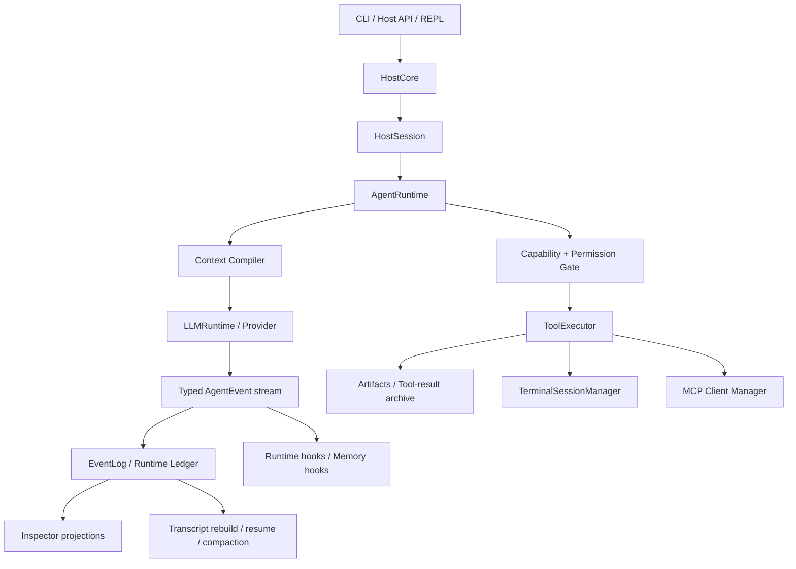
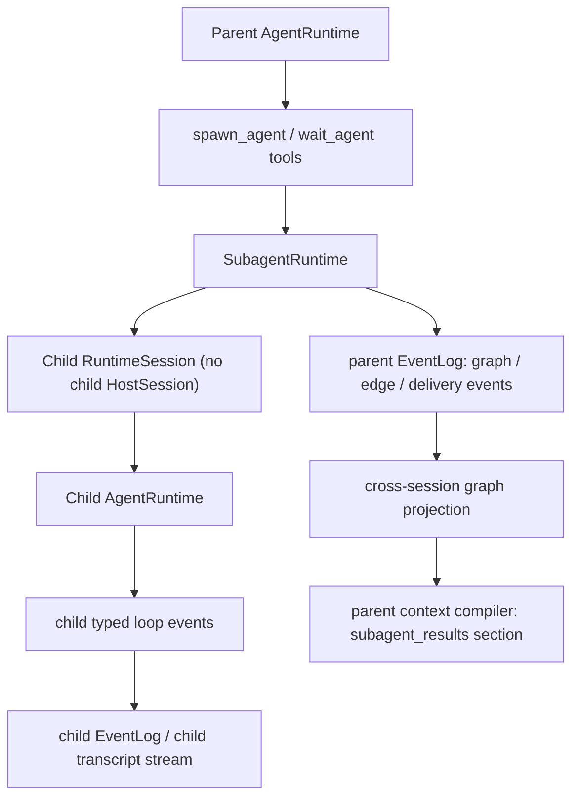
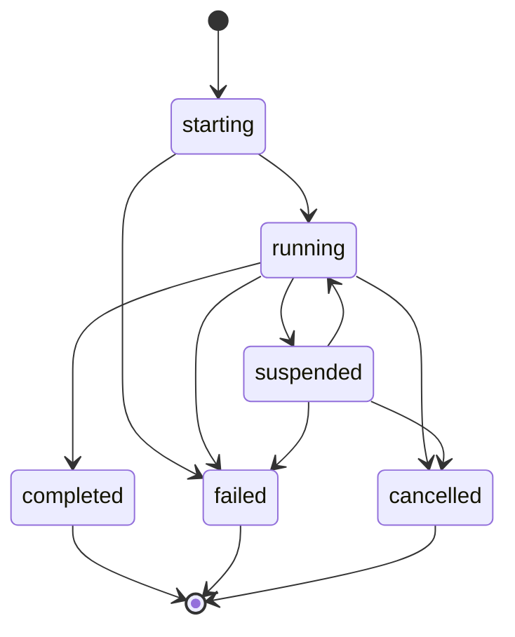

# Pulsara Subagent Runtime 本地对标调研

## Summary

本调研记录对本地几个 agent 产品 / runtime 的 multi-agent 实践观察：

- `/Users/plumliu/Desktop/python_workspace/openclaw`
- `/Users/plumliu/Desktop/python_workspace/claude-code`
- `/Users/plumliu/Desktop/python_workspace/codex`
- `/Users/plumliu/Desktop/python_workspace/hermes-agent`

核心结论：

1. 这些项目的 multi-agent 核心都不是 Deno。
2. 它们普遍把 multi-agent 真相放在宿主 runtime：session / thread / task / event / graph / result delivery。
3. 脚本或 workflow DSL 如果存在，只是 authoring surface，不是最终事实源。
4. 对 Pulsara 来说，最自然的路线是先做 Pulsara-owned Subagent Runtime，再把 Deno WorkflowScript 作为可选编排入口。
5. Subagent 必须沿着 Pulsara 现有 HostSession / AgentRuntime / ContextCompiler / EventLog / Inspector 边界扩展，而不能绕开这些来时路。
6. V1 应共享 HostCore / durable resources，但不共享 parent transcript stream：child 有独立 RuntimeSession，parent 只记录 graph / delivery events。

换句话说：

> Deno 可以是 Orchestrator 写 workflow 的笔；但 Pulsara Runtime 才应该是 multi-agent 的脑、账本和事实源。

---

## 1. 调研问题

我们要回答的问题是：

- 其他本地 agent 产品是否使用 Deno 来实现 multi-agent？
- 它们是如何表达 subagent / worker / teammate / workflow 的？
- 它们是否让主 agent 生成脚本？如果是，脚本和 runtime 的边界在哪里？
- Pulsara 下一步做 subagent runtime 时应借鉴什么，避免什么？

---

## 2. OpenClaw

### 2.1 核心形态

OpenClaw 的 subagent 是 session 工具化，而不是脚本 runtime。

主要文档：

- `/Users/plumliu/Desktop/python_workspace/openclaw/docs/tools/subagents.md`
- `/Users/plumliu/Desktop/python_workspace/openclaw/skills/taskflow/SKILL.md`
- `/Users/plumliu/Desktop/python_workspace/openclaw/skills/taskflow/examples/pr-intake.lobster`

关键原语：

- `sessions_spawn`
- `sessions_yield`
- `subagents`
- TaskFlow runtime API

`sessions_spawn` 会创建独立子 session：

```text
agent:<agentId>:subagent:<uuid>
```

默认语义：

- 子 agent 是 background run。
- 默认上下文隔离：`context: "isolated"`。
- 必要时可以 `context: "fork"`。
- 完成后通过 requester / parent session 回传 completion。
- 子 agent completion 是 runtime-generated internal context，不是用户消息。
- 子 agent 默认不拿 session tools，避免误用。
- 每个 subagent run 被 background task ledger 跟踪。

### 2.2 TaskFlow 的边界

OpenClaw 的 TaskFlow 很值得 Pulsara 借鉴。它明确拥有：

- flow identity
- owner session
- requester origin
- current step
- persisted state
- wait state
- linked child tasks
- finish / fail / cancel / waiting / blocked 状态
- revision tracking

但它不拥有业务分支逻辑。

文档明确说：

> It does not own branching or business logic. Put that in Lobster, acpx, or the calling code.

这说明 OpenClaw 的 runtime 负责持久状态与任务关联；业务编排可以由外部脚本、插件、技能或调用代码完成。

### 2.3 对 Pulsara 的启发

OpenClaw 的正确抽象不是“让模型写一个大脚本就完事”，而是：

```text
runtime owns:
  session / child run / task ledger / completion delivery / wait / resume

authoring layer owns:
  branching / phase / fan-out / business logic
```

Pulsara 应借鉴：

- `spawn` 是非阻塞的，结果通过事件回到 parent。
- `yield/wait` 是明确的等待原语，不鼓励轮询。
- child result 是 evidence / report，不是用户指令。
- `isolated` 是默认，`fork` 是显式选择。
- task ledger / workflow ledger 要可 inspect。

---

## 3. Claude Code

### 3.1 两层 multi-agent

Claude Code 里看到两种相关机制：

1. Coordinator mode：主 agent 通过 Agent / SendMessage / TaskStop 编排 workers。
2. Local workflow scripts：主 agent 写 JS 风格 workflow script，通过 `phase()` / `parallel()` / `agent()` 编排多 agent。

核心文件：

- `/Users/plumliu/Desktop/python_workspace/claude-code/src/coordinator/coordinatorMode.ts`
- 本地 workflow 示例目录：
  `/Users/plumliu/.claude/projects/-Users-plumliu-Desktop-python-workspace-pulsara-agent/9e990844-f595-4403-a8dd-0478d6c518c1/workflows/scripts`

### 3.2 Coordinator mode

Coordinator prompt 的核心思想：

- 主 agent 是 coordinator。
- worker 通过 Agent tool 启动。
- worker 可以通过 SendMessage 继续。
- worker 可以通过 TaskStop 停止。
- worker 看不到主对话，所以 prompt 必须自包含。
- worker result 作为 `<task-notification>` 回到主 agent。
- 主 agent 负责综合、验证和对用户输出。

特别值得注意的是，Claude Code 明确要求：

- 不要用 worker 去检查另一个 worker。
- worker 完成后，主 agent 必须自己综合，不要“感谢”或“转述”为对话伙伴。
- 研究阶段可并行，写操作要控制并发。
- verifier 应该 fresh，避免带着 implementer 的偏见。

这是一套很成熟的 Orchestrator 行为协议。

### 3.3 Workflow scripts

本地 workflow 脚本形态类似：

```js
phase('Verify')

const [a, b, c] = await parallel([
  () => agent("...", { label: "verify-a", phase: "Verify", schema: V }),
  () => agent("...", { label: "verify-b", phase: "Verify", schema: V }),
])

phase('Synthesize')

const final = await agent("...", { label: "synthesize" })

return final
```

workflow JSON 会持久化：

- `runId`
- `timestamp`
- `taskId`
- `script`
- `scriptPath`
- `workflowName`
- `status`
- `phases`
- `workflowProgress`
- 每个 workflow agent 的 label / phase / agentId / model / state / tokens / toolCalls / resultPreview

错误栈显示它运行在 Claude Code 自己的 CLI bundle 中，例如 `$bunfs/root/src/entrypoints/cli.js`。未看到 Deno 作为 workflow runtime 的证据。

### 3.4 对 Pulsara 的启发

Claude Code 说明两件事：

1. 主 agent 写 workflow script 是很自然的。
2. workflow script 不是事实源；事实源仍是 runtime 的 task / progress / agent state。

Pulsara 如果做 Deno WorkflowScript，应采用同样边界：

```text
Deno script:
  authoring surface
  phase / parallel / agent / send / wait

Pulsara:
  WorkflowRun
  WorkflowNode
  SubagentRun
  AgentEdge
  events
  artifacts
  budget
  permissions
```

此外，Claude Code 的 agent prompt discipline 很值得直接吸收：

- worker prompt 必须自包含。
- research worker 输出后，coordinator 必须综合成具体实施 prompt。
- 是否继续同一个 worker，取决于上下文重叠度。
- verifier 通常应 fresh。
- worker result 是内部 signal，不是用户消息。

---

## 4. Codex

### 4.1 核心形态

Codex 的 multi-agent 更像 thread graph，而不是 workflow script。

相关文件：

- `/Users/plumliu/Desktop/python_workspace/codex/codex-rs/core/src/context/multi_agent_mode_instructions.rs`
- `/Users/plumliu/Desktop/python_workspace/codex/codex-rs/core/src/session/multi_agents.rs`
- `/Users/plumliu/Desktop/python_workspace/codex/codex-rs/rollout-trace/README.md`
- `/Users/plumliu/Desktop/python_workspace/codex/codex-rs/state/src/runtime/threads.rs`
- `/Users/plumliu/Desktop/python_workspace/codex/codex-rs/agent-graph-store/src`

Codex 的 multi-agent mode 有：

```rust
ExplicitRequestOnly
Proactive
```

这与 Pulsara 当前“默认不主动 spawn sub-agent，除非用户明确要求”的产品边界一致。

### 4.2 Thread spawn graph

Codex rollout trace 文档把 multi-agent v2 描述成图：

```text
root ToolCall: spawn_agent / followup_task / send_message
  -> child ConversationItem
  -> child AgentThread
  -> child assistant result
  -> root ConversationItem notification
```

它关注的是 interaction edge：

- spawn task edge
- send message edge
- followup task edge
- close agent edge
- child result edge

这是非常 Pulsara-like 的做法，因为它把 multi-agent 解释为事件与图，而不是运行一段脚本后只拿最终文本。

### 4.3 对 Pulsara 的启发

Codex 给 Pulsara 的启发可能比 Deno 更关键：

- Subagent 应首先是 runtime thread / session。
- Parent-child 关系应进入持久化图。
- `spawn_agent` / `send_message` / `followup_task` / `wait_agent` 是 runtime tools。
- inspect 不应只看 transcript，而应能看 interaction graph。
- 多 agent 的可解释性来自 raw events + reduced graph。

这和 Pulsara 现有事件系统、artifact store、context compiler、inspector 很契合。

---

## 5. Hermes Agent

### 5.1 核心形态

Hermes 的 multi-agent 更朴素，是 Python 内部同步 delegation。

相关文件：

- `/Users/plumliu/Desktop/python_workspace/hermes-agent/AGENTS.md`
- `/Users/plumliu/Desktop/python_workspace/hermes-agent/tools/delegate_tool.py`

`delegate_task` 的特点：

- spawn child `AIAgent`
- child 有独立上下文和 terminal session
- parent 阻塞等待 child summary
- 支持 `tasks: [...]` 并行，内部使用 `ThreadPoolExecutor`
- 并发由 `delegation.max_concurrent_children` 控制
- child 有 restricted toolsets
- `role="leaf"` 默认不能继续 delegate
- `role="orchestrator"` 可继续 delegate，但受 depth cap 控制
- child timeout / heartbeat / interrupt 有独立处理

Hermes 文档明确说：

> delegate_task is not durable. For long-running work that must outlive the current turn, use cronjob or background terminal instead.

### 5.2 对 Pulsara 的启发

Hermes 展示了一个低成本实现：

```text
delegate_task(...)
  -> build child AIAgent
  -> restrict tools
  -> run in thread pool
  -> parent waits
  -> return summary JSON
```

这适合快速做 MVP，但不适合作为 Pulsara 的终极形态。原因：

- parent 阻塞等待，长任务体验一般。
- 不天然 durable。
- child intermediate events 不自然进入统一事件系统。
- workflow graph / inspector 需要额外补。

但是 Hermes 的几个工程点很值得借鉴：

- subagent auto-deny / auto-approve approval callback，避免 worker thread 阻塞 stdin。
- depth cap。
- max concurrent children。
- child timeout。
- heartbeat，避免 parent 看起来无活动。
- role 分为 `leaf` / `orchestrator`。
- child toolset 不能超过 parent toolset。

---

## 6. Deno 的定位

调研后，Deno 的位置更清楚了：

> Deno 不应该是 Pulsara 的 multi-agent runtime。  
> Deno 可以是 workflow authoring runner。

也就是说，Deno 适合承担：

- 执行模型生成的 TypeScript / JavaScript workflow script。
- 提供熟悉的 `async/await` 表达。
- 支持 `phase()` / `parallel()` / `agent()` / `send()` / `wait()` 这类 SDK。
- 通过权限沙箱禁止直接读文件、读环境变量、联网、执行命令。

Deno 不应该拥有：

- 子 agent session 真相。
- tool permission 真相。
- event log 真相。
- context compiler 真相。
- memory / artifact / inspector 真相。
- durable workflow 状态真相。

### 6.1 为什么不是直接手搓 JSON DAG

JSON DAG 更安全，但模型写起来不自然。复杂任务里常见逻辑包括：

- phase 之间组合结果
- 并行 fan-out
- schema 约束
- 根据结果选择继续某个 worker 还是 spawn fresh
- 聚合多个 worker 结果后 synthesize

这些用脚本表达明显更自然。

### 6.2 为什么不是 LangGraph

LangGraph 适合作为应用框架，但 Pulsara 的核心已有自己的：

- session model
- event log
- artifact store
- permission gate
- tool runtime
- context compiler
- memory system
- inspector projection

如果把 LangGraph 放进 core，容易出现双 runtime：

```text
LangGraph owns graph/state/checkpoint
Pulsara also owns graph/state/event/session
```

这会让审计、恢复、权限、工具归因变复杂。

更合适的是：

- 借鉴 LangGraph 的概念。
- 可做 exporter / importer / optional skill。
- core 不依赖 LangGraph。

### 6.3 为什么不是原生 Python 执行模型脚本

原生 Python 对模型很友好，但作为不可信 workflow script runtime 很危险：

- import 太强。
- filesystem / env / network 很难安全限制。
- `RestrictedPython` 类方案也不应被当作真正安全边界。

如果想要 Python-like 体验，Starlark 更像安全 DSL 候选；但它不是 Python runtime，模型熟悉度也不如 JS/TS。

---

## 7. 当前 Pulsara Agent Runtime 重新梳理

在落 subagent runtime 前，需要先把当前 Pulsara runtime 的事实边界重新捋顺。Subagent 会触碰几乎所有已建设的 runtime 层：HostSession、AgentRuntime、ContextCompiler、Capability / Permission、ToolExecutor、MCP、terminal、compaction、memory、event log 和 inspector。它不是加几个工具，而是扩展运行时拓扑。

当前主链路可以概括为：



### 7.1 HostCore：进程级资源所有者

`HostCore` 是最外层资源协调器。它负责 open / resume / close host session、workspace terminal supervisor、terminal lease、retrieval resources、memory governance coordinator、MCP supervisor 创建、durable session manifest，以及 shutdown / close ordering。

Subagent 不应该自己打开一套新的 `HostCore`。它应该运行在 parent HostCore 之内，借用同一组进程级资源，同时拥有自己的 runtime identity、parent-child edge 和 child run state。

### 7.2 HostSession：用户会话与 pending interaction 所有者

`HostSession` 持有一段用户对话的 host-visible 状态：`active_run_id`、`stopping_run_id`、`suspended_run_id`、`pending_interaction`、`plan_state`、`_active_state`、`_suspended_state`、`_active_task`，以及 MCP safe-point sync。

它是用户可见 run-control 的门：`run_turn` / `stream_turn`、approval resume、plan interaction resume、MCP input-required resume、stop / drain / close。

因此 V1 subagent 不应直接占用 parent `HostSession.pending_interaction`。多个 child 同时触发 approval、plan question、MCP input-required 时，当前 HostSession 的单 pending slot 无法表达。V1 应 fail-closed 或写 child suspended event，未来再设计 multi-pending router。

### 7.3 RuntimeSession：事件、artifact、terminal、tool executor 的事实边界

`RuntimeSession` 是运行时事实写入边界。它拥有 `event_log`、`archive`、`tool_result_artifacts`、`publisher`、`terminal_sessions`、`artifact_service`、`extra_tool_bindings` 和 `create_tool_executor(...)`。

事件必须通过 `RuntimeSession.emit()` 分配 sequence 并 publish。ToolRegistry 也从 RuntimeSession 构造，terminal ownership 与 artifact service 都挂在这里。

Subagent 的 started / completed / failed / suspended / cancelled 不能是脚本日志，也不能只存在内存里；必须成为 typed events。child 如果使用 terminal / artifact / MCP，也必须继续走 RuntimeSession / ToolExecutor 这条边界。

这里需要钉死一个关键分叉：V1 不应让 child 的完整模型-工具 loop 原始事件写进 parent 的同一个 `runtime_session_id` event stream。

原因很现实：`rebuild_prior_messages()`、compaction、resume 和 recovery 目前都以 runtime session 的 event stream 为基本 replay 边界。如果 child 的 `RunStartEvent`、`ReplyEndEvent`、`ToolResultEndEvent` 混进 parent session，parent transcript rebuild 很容易把 child 原始对话当成 parent 历史重放。可以给 transcript / compaction / recovery 加一大片 scope filter，但那会污染已经稳定下来的主线边界。

V1 冻结为：

```text
HostCore / durable resources shared
  ├─ parent RuntimeSession
  │   └─ parent EventLog: parent loop events + subagent graph / edge / delivery events
  └─ child RuntimeSession
      └─ child EventLog: child RunStart / Reply / Tool / ContextCompiled 等原始 loop events

shared resources:
  archive / artifact DB / terminal manager / MCP snapshot + bindings / retrieval resources
```

也就是说：

- 不创建 child `HostSession`；
- 创建 child `RuntimeSession` / child `runtime_session_id`；
- child `RuntimeSession` 共享 `HostCore` 进程资源、archive/db、terminal binding、MCP snapshot/bindings；
- parent EventLog 只写 subagent graph / edge / result delivery events；
- child EventLog 写 child 自己的模型-工具 loop 原始事件；
- Inspector 跨 parent-child runtime session id 做 graph projection。

不要把 child 做成独立用户级 HostSession；那会把 UI 会话、pending interaction、terminal lease 和 inspector 语义搅乱。也不要把 child 原始 loop 写进 parent transcript stream；那会把 replay/compact/recovery 搅乱。正确口径是：共享 durable store，不共享 parent transcript stream。

### 7.4 AgentRuntime：模型-工具 loop

`AgentRuntime` 是当前核心 loop。它拥有 `LLMRuntime`、`CapabilityRuntime`、`PermissionGate`、`ToolExecutor`、`ContextLifecycleCoordinator`、`ToolResultRenderDecisionCache`、`MemoryHooks`、`ContextCompactor` 和 `LoopBudget`。

单轮流程是：

1. append prior messages；
2. append current user message；
3. emit `RunStartEvent`；
4. run memory `on_turn_start`；
5. resolve capability exposure；
6. emit capability exposure resolved；
7. enter model loop。

模型 loop 每次调用前：

1. project memory；
2. render runtime context prompt；
3. build compiled context；
4. emit `ContextCompiledEvent`；
5. stream model；
6. replay assistant message；
7. parse and execute tool calls；
8. run after-tool hooks；
9. maybe mid-turn compact；
10. continue or finalize。

Subagent 应复用这条 loop，而不是让 Deno / workflow script 直接调用模型、拼 prompt、执行工具。否则 Pulsara 已建设的 context compiler、capability gate、tool result artifact、compaction、event inspector 都会失效。

### 7.5 LoopState：活跃 run 工作缓存，不是 ledger

`LoopState` 明确是 working context cache，不是 durable fact source。它保存 `messages`、`pending_tool_calls`、`pending_interaction_kind`、`pending_interaction_payload`、`tool_results`、`memory_projection`、`token_usage`、`scratchpad` 和 `budget`。

Subagent run、edge、completion、budget、status 不能放在 parent `LoopState.scratchpad` 里。scratchpad 可以缓存派生值，但不能成为恢复、inspect 或 graph projection 的事实源。

### 7.6 ContextCompiler：模型可见事实的唯一编译器

当前 Pulsara 已经从“直接拼 messages”升级为 context compiler：

- current user 有 anchor；
- prior history / current user / current run tail 分段；
- tool result renderer 做 artifact-backed preview、budget、render decisions；
- runtime context、memory projection、capability catalog、active skill 作为 sections；
- `ContextCompiledEvent` 持久化 sections、tool specs、diagnostics、lifecycle decisions、tool-result render decisions、budget report；
- `ModelCallStartEvent` 通过 `context_id` / `model_call_index` 与 compiled context 关联。

Subagent result 进入 parent 也必须通过 ContextCompiler，而不是 append 成 user message。建议新增 parent-visible internal section：

```text
subagent_results
  -> child summaries
  -> result artifacts
  -> diagnostics
  -> graph refs
```

child 完整 transcript 不应默认进入 parent context，只能通过 artifact / inspect / explicit wait 读取。

### 7.7 Capability / Permission：工具可见性与执行允许不是一回事

当前工具面由两层组成：

- `CapabilityRuntime` 每轮解析 descriptors、catalog、active skill injection，产生 `CapabilityExposurePlan`；
- `PermissionGate` 对具体 call 做 allow / deny / wait_for_user；
- canonical gate fact 是 typed `CapabilityGateDecisionEvent`。

Subagent 的 capability profile 必须由 runtime 计算，不应让主 agent 手写 raw tool subset。child effective tools 应满足：

```text
child effective tools
  = parent current exposure
  ∩ child capability profile
  ∩ hard-deny filters
  ∩ child permission policy
```

child 的 gate decision 也必须写 typed event。不能让 Deno 脚本、workflow log 或模型文本成为权限事实。

### 7.8 ToolExecutor：工具结果必须变成事件 + block + artifact

Tool execution 统一由 `ToolExecutor` 产出 `ToolResultStartEvent`、`ToolResultTextDeltaEvent` / `ToolResultDataDeltaEvent`、`ToolResultEndEvent`、artifact refs、`ToolResultBlock` 和 after-tool hooks。

这给 subagent 带来一个重要区分：

| 场景 | delivery 方式 | 是否 provider-native tool_result |
|---|---|---|
| `spawn_agent` 立即返回 started | `spawn_agent` tool result | 是 |
| child 后台完成 | typed event + parent internal section | 否 |
| parent 显式 `wait_agent` | `wait_agent` tool result | 是 |

child background completion 不能凭空注入 tool_result，因为 parent 当时没有新的 assistant tool call。它应成为 typed event 与 parent context section。

### 7.9 Memory：main agent 的长期语义层

当前 memory hooks 负责 turn start recall / working context projection、memory proposal sink drain、after model reply / after tool results hook、session end working context update、reflection 和 governance。

V1 subagent 更适合完全不参与 memory system：

- 不做 memory recall；
- 不持有 `memory_*` tools；
- 不直接提出 memory write；
- 不参与 governance；
- 不更新 working context。

parent 可以把已召回且裁剪过的 memory projection 作为普通 task context 注入 child。child result 可以作为 evidence，被 parent 采纳后再进入 memory governance。

### 7.10 Compaction：ledger-aware handoff

当前 compaction 不是“缩短聊天记录”，而是 ledger-aware handoff：

- preflight / manual / mid-turn；
- mid-turn 只能在 safe point 运行；
- 不能破坏 current user anchor；
- 不能破坏 tool-call / tool-result pairing；
- compact summary 写 artifact；
- compaction events 进入 event log；
- ContextCompiler 使用 model-visible estimate 而不是 raw event size。

Subagent 应有自己的 compaction 生命周期。parent compaction 不应吞 child native transcript；parent 只应压缩 parent-visible child result section。

如果 child 中有长程 terminal process，handoff summary 应告诉后续 worker / parent 如何继续 poll / log / wait。

### 7.11 MCP：session-owned supervisor，runtime-owned binding

MCP supervisor 已经是 session-owned。每个 safe point sync 会刷新 server snapshot，并原子替换 model-facing capability provider 与 ToolRegistry execution binding。

Subagent 不应该创建自己的 MCP supervisor。child 可使用 parent session 当前 MCP snapshot 的 profile-filtered subset。

MCP input-required 在 child 中 V1 应 fail-closed 或 child-suspended，不能抢 parent pending slot。

### 7.12 Inspector：未来必须看 graph，而不是 transcript

Inspector 现在已经能投影 capability exposure / gate decisions、context compilations、compaction windows、assistant replies、tool artifacts、recall traces 和 run timeline。

Subagent 应继续这条路线。inspect 不应该只是“把所有 child transcript 拼在一起”，而要能看 graph：

- parent run；
- child runs；
- parent-child edges；
- spawn reason；
- context policy；
- capability profile；
- child status；
- result artifact；
- delivery status；
- parent 是否消费 child result。

### 7.13 当前 runtime 对 subagent 的十条铁律

1. `EventLog` 是唯一事实源。
2. `LoopState` 不是事实源。
3. `ContextCompiler` 是模型可见边界。
4. `ToolExecutor` 是工具执行边界。
5. `HostSession` 是用户交互边界。
6. Memory 是 parent-owned 长期语义层。
7. Capability profile 由 runtime 计算。
8. 默认 isolated，fork 显式。
9. child result 是 internal evidence。
10. inspect 看 graph，不只看 transcript。

### 7.14 Subagent Runtime 在现有架构中的位置

Subagent Runtime 应插在 parent `AgentRuntime` 和 child `AgentRuntime` 之间：



也就是说：

- `spawn_agent` 只是入口工具；
- 真正事实源是 `SubagentRuntime`；
- `SubagentRuntime` 创建 child run、child edge、child `RuntimeSession`、child `AgentRuntime`、child state；
- child `AgentRuntime` 复用现有模型 loop；
- child 原始 loop events 写入 child runtime session；
- parent graph / delivery events 写入 parent runtime session；
- parent 下一次 compile 时通过 cross-session projection 看到 child result section；
- `wait_agent` 显式取结果时才生成 tool_result。

这个方向最符合 Pulsara 已经走过的路：不再造一个脚本型 agent 框架，而是扩展已有 runtime ledger。Deno / WorkflowScript 可以晚点作为 Orchestrator authoring layer，但不能成为 truth owner。

---

## 8. Pulsara Subagent Runtime 的硬原则

这部分从“调研结论”升级为实施边界。后续代码可以调整细节，但不应突破这些原则。

### 8.1 Subagent 首先是 runtime thread / session，不是脚本函数

`spawn_agent(...)` 可以是模型可调用工具，Deno / WorkflowScript 也可以调用 `agent(...)`。但这些入口都只是 adapter。

事实源必须是 Pulsara runtime：

```text
SubagentRuntime
  -> SubagentRun
  -> SubagentEdge
  -> child RuntimeSession
  -> typed events
  -> graph projection
  -> context compiler section
  -> inspector
```

这里的 “session” 指 runtime identity / runtime session，不是用户级 `HostSession`。child 不拥有自己的用户交互入口。

脚本函数不能拥有：

- child run status；
- child permission / capability；
- child pending interaction；
- child artifacts；
- child completion；
- parent-child graph；
- inspect 真相。

如果某个实现让脚本返回值成为唯一事实，那就偏离了 Pulsara 的路线。

### 8.2 Child result 是 internal evidence，不是 user message

worker completion 不应被伪造成用户输入，也不应作为 provider-native `user` message append 到 parent transcript。

正确路径是：

```text
child final reply / artifacts / diagnostics
  -> SubagentRunCompletedEvent / SubagentRunFailedEvent
  -> SubagentResult artifact / evidence refs
  -> parent context compiler internal section
  -> Orchestrator synthesis
```

这点非常关键。child result 的语义是“内部证据 / 工作报告”，不是“用户又说了一句话”。如果把它伪装成 user message，会污染权限、记忆写入、context attribution、inspect 和模型角色语义。

### 8.3 默认 isolated，fork 必须显式

默认策略：

```text
context_policy = isolated
```

`fork` 只能由 Orchestrator 明确指定，并且必须进入事件与 inspect。

原因：

- worker prompt 应自包含；
- worker 不应偷吃 parent 的巨大上下文；
- worker 不应继承不必要的用户隐私与项目历史；
- Orchestrator 要能清楚解释每个 worker 为什么拥有某些上下文。

### 8.4 Inspect 看 graph，不只是 transcript

Subagent Runtime 的 inspect 目标不是“把所有对话串起来”，而是投影一张可解释图：

```text
parent run
  ├─ edge: spawn -> child A
  ├─ edge: spawn -> child B
  ├─ edge: send  -> child A
  ├─ edge: result from child A
  └─ edge: result from child B
```

Pulsara 已经有 typed event、`context_id`、`model_call_index`、capability gate event、artifact store 和 context compiler。Subagent graph 应继续使用 typed event + projection，而不是 `CustomEvent` 或脚本日志。

### 8.5 CapabilityRuntime 必须显式传给 child runtime

当前 `AgentRuntime` 已经要求 `CapabilityRuntime`。Subagent spawn 时必须构造明确的 child capability profile，不能隐式复用全局默认。

默认规则：

- child capability 不得超过 parent 当前可见 exposure；
- child permission 不得超过 parent 当前 effective permission；
- child tools / MCP / skills 必须经过 child capability profile 重新投影；
- child 如果需要更宽权限，必须由 parent 明确请求，并被 gate / approval 记录。

这避免了“parent 只允许轻量检查，child 却获得全工具面”的权限逃逸。

### 8.6 Tool surface 由 runtime profile 计算，不让主 agent 手搓子集

本地对标里有一个很现实的教训：成熟产品通常不会要求主 agent 每次枚举子 agent 的完整工具清单。

原因是这会给 Orchestrator 增加额外认知税，而且模型很容易剪错：

- 忘了 `artifact_read`，导致大输出无法继续读；
- 忘了 `terminal_process`，导致长程进程无法继续轮询；
- 漏掉某个 MCP docs tool，导致 worker 明明该查文档却不能查；
- 误给了 memory / delivery / admin / auth 工具，扩大权限面。

因此 V1 建议：

```text
Orchestrator chooses:
  role / capability_profile_name / context_policy

Runtime computes:
  concrete child tools / descriptors / skills / MCP subset
```

也就是说，模型入口应该更像：

```json
{
  "task": "...",
  "role": "verification_worker",
  "context": "isolated"
}
```

而不是：

```json
{
  "allowed_tools": [
    "read_file",
    "search_files",
    "terminal",
    "terminal_process",
    "artifact_read",
    "..."
  ]
}
```

建议内置 profiles：

| Profile | 语义 | 默认工具面 |
|---|---|---|
| `general_worker` | 普通研究 / 实施 worker | parent exposure 的普通工具子集，剥离硬禁工具 |
| `research_worker` | 读代码、查文档、搜索事实 | read/search/docs/MCP docs；无写入 |
| `verification_worker` | 测试、验证、复现 | read + terminal/test；默认禁止项目文件写入 |
| `synthesizer` | 综合多个 child result | 无工具或 read-only |
| `orchestrator` | 可继续 spawn child | 显式 opt-in，受 depth / concurrency cap |

硬禁工具类别：

- `memory_*`；
- 用户可见 delivery / message 工具；
- auth / config / admin 工具；
- subagent control 工具，除非 profile 是 `orchestrator`；
- HostSession pending/approval 目前不能安全路由的工具；
- 超出 parent current exposure / permission 的任何工具。

允许高级 override，但应当是 runtime-facing，而不是鼓励模型手写清单：

```json
{
  "capability_profile": "research_worker"
}
```

如果未来真的需要显式工具 allowlist，也应只作为高级接口，并且 runtime 必须与 parent exposure 取交集。

### 8.7 Subagent 与 memory system 解耦

V1 建议写成硬原则：

> Subagent 不参与 memory recall，不持有 `memory_*` 工具，不直接提出 memory write，不参与 memory governance。

child 的职责是：

```text
接收自包含任务
执行当前委派
产出 result / artifact / diagnostics
结束
```

如果 parent 认为某些长期记忆对 child 有用，parent/context compiler 可以把“已经召回且裁剪过的记忆”作为普通任务上下文注入 child。child 不需要知道这些文本来自 memory system。

同样，child result 可以作为 parent 后续 memory governance 的证据，但 child 不直接操作记忆系统：

```text
parent memory recall
  -> selected context text
  -> child task context
  -> child result / artifact
  -> parent synthesis
  -> parent/runtime memory governance
```

这样可以避免：

- child 召回到超出任务所需的用户/项目记忆；
- child 把局部观察误写成长期事实；
- 并行 child 产生互相冲突的 memory proposals；
- inspect 难以解释 child 的知识来源；
- 记忆权限被 subagent profile 绕开。

### 8.8 Child ledger 不能放 LoopState / scratchpad

`LoopState` 是短期工作上下文缓存。Subagent run、edge、completion、budget、status、pending interaction 都必须进入 durable event / projection。

允许放进 scratchpad 的只有派生缓存，例如：

- graph projection 的短期 memo；
- context compiler section render cache；
- inspector query cache。

不允许把 scratchpad 作为恢复真相。

---

## 9. Runtime 对象模型

### 9.1 `SubagentRun`

`SubagentRun` 是 child agent 的运行实例，类似 runtime-owned child thread。

建议字段：

```python
@dataclass(frozen=True, slots=True)
class SubagentRun:
    subagent_run_id: str
    parent_runtime_session_id: str
    parent_run_id: str
    parent_turn_id: str | None
    parent_reply_id: str | None
    parent_context_id: str | None
    parent_model_call_index: int | None
    spawning_tool_call_id: str | None
    spawning_tool_name: str | None
    child_runtime_session_id: str
    child_run_id: str | None
    label: str | None
    role: Literal["worker", "verifier", "synthesizer", "orchestrator"]
    status: Literal[
        "starting",
        "running",
        "suspended",
        "completed",
        "failed",
        "cancelled",
    ]
    task: str
    created_at: datetime
    updated_at: datetime
    context_policy: SubagentContextPolicy
    capability_profile: SubagentCapabilityProfile
    budget: SubagentBudget
    metadata: Mapping[str, object]
```

身份原则：

- `subagent_run_id` 是 parent graph 里的稳定 id。
- `child_runtime_session_id` 是实际 child runtime session/thread id，不是 child HostSession。
- `child_run_id` 可为空，因为非阻塞 spawn 可能先创建 session，稍后才进入模型 run。
- `spawning_tool_call_id` / `spawning_tool_name` 记录是哪一次 parent assistant tool call 触发了 spawn；如果由 host API 创建，则为空并在 metadata 中记录 caller。

### 9.2 `SubagentEdge`

`SubagentEdge` 描述 parent 与 child 的关系或消息流。它是 graph projection 的基本边。

建议字段：

```python
@dataclass(frozen=True, slots=True)
class SubagentEdge:
    edge_id: str
    edge_kind: Literal[
        "spawn",
        "send",
        "followup",
        "wait",
        "cancel",
        "result",
        "suspend",
        "resume",
    ]
    parent_runtime_session_id: str
    parent_run_id: str
    parent_turn_id: str | None
    parent_reply_id: str | None
    subagent_run_id: str
    child_runtime_session_id: str
    child_run_id: str | None
    source_context_id: str | None
    source_model_call_index: int | None
    source_tool_call_id: str | None
    source_tool_name: str | None
    target_context_id: str | None
    created_at: datetime
    payload_artifact_id: str | None
    result_id: str | None
    result_artifact_id: str | None
    returned_to_tool_call_id: str | None
    metadata: Mapping[str, object]
```

`edge_id` 必须稳定、可持久化。建议形态：

```text
subagent_edge:<subagent_run_id>:spawn
subagent_edge:<subagent_run_id>:wait:<uuid-or-event-sequence>
subagent_edge:<subagent_run_id>:send:<uuid-or-event-sequence>
subagent_edge:<subagent_run_id>:cancel:<uuid-or-event-sequence>
```

不要用脚本 line number 或临时 Promise id 作为主身份。V1 不建议使用 `subagent_edge:<parent_run_id>:<monotonic_index>`，因为这需要额外 durable allocator；如果未来要用 parent-run monotonic index，PR 必须同时实现 allocator、并发冲突处理和 replay 校验。

`wait_agent` 成功返回 completed result 时，必须写一条 durable wait edge：

```text
edge_kind = "wait"
result_id = <SubagentResult.result_id>
result_artifact_id = <result artifact>
returned_to_tool_call_id = <wait_agent tool call id>
```

这条 edge 是 result consumption marker。它表示 parent 已通过显式 `wait_agent` tool result 领取该 child result；后续 background `subagent_results` 默认不应再自动投影同一 result，除非 parent 明确请求重新展示或 runtime 策略允许 repeat delivery。

V1 冻结为：`result_id` / `result_artifact_id` / `returned_to_tool_call_id` 是 `SubagentEdge` 的一等字段，不能只塞进 `metadata`。`metadata` 只能承载展示辅助信息或未来扩展字段，inspect normalized shape 必须从一等字段投影 consumption 语义。

### 9.3 `SubagentResult`

`SubagentResult` 是 child completion 的摘要与证据索引。

建议字段：

```python
@dataclass(frozen=True, slots=True)
class SubagentResult:
    subagent_run_id: str
    result_id: str
    status: Literal["completed", "failed", "cancelled"]
    summary: str
    output_preview: str | None
    final_message_artifact_id: str | None
    artifact_ids: tuple[str, ...]
    diagnostics: tuple[Mapping[str, object], ...]
    token_usage: Mapping[str, object] | None
    tool_call_count: int | None
    completed_at: datetime
```

`summary` 可以进入 parent context；完整 child transcript 不应默认进入 parent context，只能通过 artifact / inspect 读取。

V1 不在 `SubagentRunCompletedEvent` 上重复增加 `completed_at` 字段，避免它和 `EventBase.created_at` 漂移。`SubagentResult.completed_at` 必须等于对应 `SubagentRunCompletedEvent.created_at`；graph projection / inspect 如需完成时间，也统一使用 completed event 的 `created_at`。

### 9.4 `SubagentContextPolicy`

```python
@dataclass(frozen=True, slots=True)
class SubagentContextPolicy:
    mode: Literal["isolated", "fork"]
    include_parent_summary: bool
    include_parent_current_task: bool
    include_parent_memory_projection: bool
    include_parent_artifact_refs: bool
    max_parent_context_chars: int | None
    fork_source_context_id: str | None
```

V1 默认：

```python
SubagentContextPolicy(
    mode="isolated",
    include_parent_summary=False,
    include_parent_current_task=True,
    include_parent_memory_projection=False,
    include_parent_artifact_refs=False,
    max_parent_context_chars=None,
    fork_source_context_id=None,
)
```

如果 `mode="fork"`，必须记录 `fork_source_context_id`，并在 event 中说明 fork 的来源。

### 9.5 `SubagentCapabilityProfile`

```python
@dataclass(frozen=True, slots=True)
class SubagentCapabilityProfile:
    profile_id: str
    profile_name: Literal[
        "general_worker",
        "research_worker",
        "verification_worker",
        "synthesizer",
        "orchestrator",
    ]
    inherited_from_parent_context_id: str | None
    permission_mode: str
    permission_policy: Mapping[str, object]
    allowed_tool_names: tuple[str, ...]
    allowed_descriptor_ids: tuple[str, ...]
    allowed_skill_names: tuple[str, ...]
    allowed_mcp_server_ids: tuple[str, ...]
    can_spawn_subagents: bool
    max_spawn_depth_from_root: int
    memory_enabled: bool
    computed_from_parent_exposure_generation: int | None
    diagnostics: tuple[Mapping[str, object], ...]
```

V1 默认：

- `can_spawn_subagents=False`；
- `max_spawn_depth_from_root=0`；
- `memory_enabled=False`；
- child capability 是 parent current exposure 的子集；
- child 默认没有更高 permission mode。

这要在 spawn 时 fail-closed 校验，不能靠 prompt 约定。

### 9.6 `SubagentBudget`

`SubagentBudget` 是防止 orchestrator 无限 fan-out 的硬边界，不能等到“高级策略”阶段才有。PR0/PR1 就需要最小字段：

```python
@dataclass(frozen=True, slots=True)
class SubagentBudget:
    max_concurrent_children_per_parent_run: int
    max_concurrent_children_per_host_session: int
    max_spawn_depth_from_root: int
    child_timeout_seconds: float | None
    max_total_child_runs_per_parent_run: int
    max_result_summary_chars_per_child: int
    max_subagent_results_per_parent_compile: int
```

默认建议保守：

- non-orchestrator child：`max_spawn_depth_from_root=0`；
- parent run：`max_concurrent_children_per_parent_run` 必须有小的硬上限；
- HostSession：`max_concurrent_children_per_host_session` 防止 detached child 绕过单 run 上限；
- 超出上限时不创建 child，写 stable diagnostic / typed deny result；
- Deno / WorkflowScript 不能绕开这些 budget。

scope 语义：

- `max_concurrent_children_per_parent_run` 统计同一个 parent run 创建且尚未 completed / failed / cancelled 的 child；
- `max_concurrent_children_per_host_session` 统计同一个 HostSession 下所有 running / detached child；
- detached child 仍计入 host-session 池，直到 terminal state；
- `max_spawn_depth_from_root` 从用户可见 parent root run 开始计算，child-of-child 逐层 +1；
- V1 可以先只实现 host-session hard cap，但文档和 DTO 必须保留 run-level 与 depth-level 字段，避免后续语义漂移。

---

## 10. 状态机

### 10.1 SubagentRun state machine



状态语义：

- `starting`：runtime 已接受 spawn，但 child run 还没开始。
- `running`：child 正在执行或等待模型/tool loop。
- `suspended`：child 触发 pending interaction，但 V1 不一定支持继续。
- `completed`：child 产出 final result。
- `failed`：child run 失败。
- `cancelled`：parent/user/runtime 取消 child。

### 10.2 Pending interaction 策略

当前 Pulsara HostSession 只有一套 pending interaction 语义。多个 child 同时触发 approval、plan question、MCP input-required 时，不能直接塞进 parent 的单 pending slot。

V1 不把 child pending interaction 暴露成可恢复的 parent pending slot。更稳的行为是 child 内部 fail-closed，让 child 有一次机会自我恢复：

- child 触发 approval：在 child runtime 内生成 typed deny/error tool result，reason_code=`subagent_pending_unsupported`；
- child 触发 plan question：生成 child-local error result，禁止占用 parent pending；
- child 触发 MCP input-required：生成 child-local error result，禁止占用 parent pending；
- child 可以继续一次模型 loop，尝试用其它路径完成任务；
- 如果 child 最终无可用输出，写 `SubagentRunFailedEvent(reason_code="subagent_pending_unsupported")`；
- parent 可以看到 `SubagentRunFailedEvent`，必要时也可以看到 non-resumable `SubagentRunSuspendedEvent` 作为诊断；
- 不创建 parent pending interaction，避免 UI/HostSession 语义混乱。

V2 再设计 `PendingInteractionRouter`：

```text
pending_interaction_id
  -> owner_runtime_session_id
  -> parent_runtime_session_id
  -> subagent_run_id
  -> kind
  -> resolution routing
```

### 10.3 Completion delivery

非阻塞 child completion 不能伪装成 provider-native tool result，因为 parent 当时没有新的 assistant tool call。

正确方式：

```text
child completed
  -> SubagentRunCompletedEvent
  -> result durable / available
  -> parent next compile may include subagent_results section
  -> SubagentResultDeliveredEvent only if the section actually enters compiled context
```

如果 parent 显式调用 `wait_agent(subagent_run_id)`，则可以返回 provider-native tool result，因为这次有对应的 assistant tool call。

`completed` 与 `delivered` 必须分开：

- `SubagentRunCompletedEvent`：child result 已 durable，可被 parent 读取；
- `SubagentResultDeliveredEvent`：某次 parent model call 的实际 payload 已包含该 result；
- 如果 parent compile 因 pressure / failed 没有把 result 放进模型上下文，不能标记 delivered；
- 如果只产生 `ContextCompiledEvent`，但 provider call 尚未开始就失败，也不能标记 delivered；
- delivered event 必须带 `context_id`、`model_call_index`、`section_id`，并能 join 到同一次 `ModelCallStartEvent`，方便 inspect 证明“这次 parent 模型调用实际看见了哪个 child result”。

因此 V1 有两条 delivery path：

| 场景 | delivery 方式 | 是否 provider-native tool_result |
|---|---|---|
| `spawn_agent` 立即返回 started | `spawn_agent` tool result | 是 |
| child 后台完成 | typed event + parent internal section | 否 |
| parent 调 `wait_agent` | `wait_agent` tool result；不写 delivered event | 是 |

`SubagentResultDeliveredEvent` V1 只表示 model-visible delivery。`wait_agent` 返回本身由普通 `ToolResultStartEvent` / `ToolResultEndEvent` 表达；它不证明后续模型一定看见了该 result。若要证明模型可见，仍看后续 `ContextCompiledEvent` 与 `SubagentResultDeliveredEvent(delivery_kind="internal_section")`。

更精确地说，delivered 表示 result 已进入一次实际发起的 parent model-call payload。它必须发生在对应 `ModelCallStartEvent` 可关联之后，或至少与其在同一 `context_id` / `model_call_index` 上可 join。只有 `ContextCompiledEvent` 不足以证明模型可见。

V1 冻结为：`SubagentResultDeliveredEvent` 是 after-model-call-start fact。它不能作为同一次 compile 是否纳入 result 的输入；同一次 compile 的 inclusion 只能依据 durable completed result、wait consumption edge、delivery policy 和 section budget。delivered event 只是事后证明“这次实际发起的 model call payload 已包含该 result”。

### 10.4 Parent / child lifecycle 与关闭语义

V1 必须在 PR0/PR1 就定义最小生命周期规则，否则 child 一旦能后台运行，就会影响 stop、close、terminal process、resume 与 inspect。

建议冻结：

| 场景 | V1 行为 | 事件 |
|---|---|---|
| parent 当前 run 正常结束，child 仍 running | 默认 detach，child 继续运行；parent graph 显示 background child | `SubagentRunStartedEvent` + status projection |
| parent 调 `stop_agent` | 取消目标 child，尽力 drain tool/terminal | `SubagentRunCancelledEvent(cancelled_by="parent_agent")` |
| 用户 stop 当前 turn | 只停止 parent active run；默认不取消已 detach child，除非 spawn policy `cancel_with_parent_turn=true` | parent stop event + optional child cancelled |
| `HostSession.close` / `HostCore.shutdown` | 进入 drain window；超时后取消 running child；repair dangling state | `SubagentRunCancelledEvent(cancelled_by="host_shutdown")` 或 repair diagnostic |
| resume session 时发现 child dangling | 从 child runtime session event log 投影状态；无法恢复则标记 failed/cancelled diagnostic | graph repair event / diagnostic |

这不是高级策略，而是安全地拥有后台 child 的最低成本。高级调度可以晚做，但最小 cancel/drain/repair 语义必须早于真实 child AgentRuntime。

---

## 11. Typed events

Subagent Runtime 不使用 `CustomEvent` 作为 canonical 写路径。

事件 type 落地必须遵循当前 `EventType` enum / serialization 风格。文档中的 Python snippet 使用：

```python
type: Literal[EventType.SUBAGENT_RUN_STARTED] = EventType.SUBAGENT_RUN_STARTED
```

而不是小写字符串。新增 enum value 应保持现有大写风格，例如 `SUBAGENT_RUN_STARTED`、`SUBAGENT_RESULT_DELIVERED`。

这些 events 分两类：

- parent runtime session events：subagent graph / edge / completion / failure / suspension / delivery / cancellation facts；
- child runtime session events：child 自己的 RunStart / Reply / Tool / ContextCompiled 等原始 loop facts。

Graph projection 通过 `parent_runtime_session_id`、`child_runtime_session_id`、`subagent_run_id`、`edge_id` 把两条 event stream 关联起来。parent transcript rebuild 不读取 child raw loop events。

V1 冻结写入位置：

- `SubagentRunStartedEvent`
- `SubagentMessageSentEvent`
- `SubagentRunSuspendedEvent`
- `SubagentRunCompletedEvent`
- `SubagentRunFailedEvent`
- `SubagentRunCancelledEvent`
- `SubagentEdgeRecordedEvent`
- `SubagentResultDeliveredEvent`

全部写 parent runtime session EventLog。child runtime session 只写普通 `AgentRuntime` loop events，例如 `RunStartEvent`、`ContextCompiledEvent`、`ModelCallStartEvent`、assistant reply events、tool result events、capability gate events 等。

这条规则的目的不是隐藏 child timeline，而是防止 parent transcript stream 被 child raw loop 污染。Inspector 通过 cross-session graph projection 读取 child EventLog。

### 11.0 EventBase context 归属

当前所有 `AgentEvent` 都继承 `EventBase`，因此都有 `run_id`、`turn_id`、`reply_id`。Subagent typed event 的 EventBase context 必须固定：

| Event | 写入 stream | `EventBase.run_id / turn_id / reply_id` |
|---|---|---|
| `SubagentRunStartedEvent` | parent | owning parent spawn context；通常是触发 `spawn_agent` 的 parent run/turn/reply |
| `SubagentMessageSentEvent` | parent | owning parent send/followup context；若由 runtime maintenance 触发，则沿用原 spawn parent run 并在 metadata 标明 maintenance |
| `SubagentRunCompletedEvent` | parent | 原 spawn parent run/turn/reply；即使 child detached 后完成，也继续挂原 spawn context |
| `SubagentRunFailedEvent` | parent | 原 spawn parent run/turn/reply；runtime repair 失败也挂原 spawn context，并写 repair diagnostic |
| `SubagentRunCancelledEvent` | parent | 如果由 parent/user 当前操作触发，使用该操作 context；如果由 host shutdown / repair 触发，沿用原 spawn parent run 并记录 `cancelled_by` |
| `SubagentRunSuspendedEvent` | parent | 原 spawn parent run/turn/reply |
| `SubagentEdgeRecordedEvent` | parent | 产生该 edge 的 parent 操作 context；`wait_agent` edge 使用实际 wait tool call 所在 run/turn/reply |
| `SubagentResultDeliveredEvent` | parent | 实际 delivery 所在 parent compile/run context |

因此 detached child completion 不创建 “graph-maintenance run”。V1 统一挂回原 spawn parent run；只有 delivery event 挂实际 parent delivery run，因为它表示“某次 parent 模型调用实际看见了该 result”。

post-RunEnd graph events 是允许的：detached child completed / failed / cancelled 可能追加在 parent `RunEndEvent` 之后。它们不重新打开 parent run，不修改 parent `runs.status` / `completed_at`，也不作为 conversational turn 参与 parent transcript rebuild。Inspector / run projection 必须把它们识别为 graph-maintenance facts，而不是 parent run 仍在活跃的证据。

### 11.1 `SubagentRunStartedEvent`

```python
class SubagentRunStartedEvent(AgentEvent):
    type: Literal[EventType.SUBAGENT_RUN_STARTED] = EventType.SUBAGENT_RUN_STARTED
    subagent_run_id: str
    edge_id: str
    parent_runtime_session_id: str
    parent_run_id: str
    parent_turn_id: str | None
    parent_reply_id: str | None
    parent_context_id: str | None
    parent_model_call_index: int | None
    spawning_tool_call_id: str | None
    spawning_tool_name: str | None
    child_runtime_session_id: str
    label: str | None
    role: str
    task_preview: str
    context_policy: dict[str, object]
    capability_profile: dict[str, object]
```

`spawning_tool_call_id` / `spawning_tool_name` 是重要归因字段：inspect 不能只知道“某个 parent reply 里出现了 child”，还要知道是哪一次 `spawn_agent` tool call 触发了 child。

`SubagentRunStartedEvent.task_preview` 只保存短预览。完整 task prompt 必须通过同一 spawn 流程中的 `SubagentMessageSentEvent(delivery_kind="spawn_task", message_artifact_id=...)` 持久化。`RunStarted` 与 spawn-task `MessageSent` 必须原子写入，或至少具备同一事务语义：不能出现只有 preview、没有完整 task artifact 的可审计缺口。

### 11.2 `SubagentMessageSentEvent`

```python
class SubagentMessageSentEvent(AgentEvent):
    type: Literal[EventType.SUBAGENT_MESSAGE_SENT] = EventType.SUBAGENT_MESSAGE_SENT
    edge_id: str
    subagent_run_id: str
    parent_runtime_session_id: str
    parent_run_id: str
    child_runtime_session_id: str
    message_artifact_id: str | None
    message_preview: str
    delivery_kind: Literal["spawn_task", "send", "followup"]
```

### 11.3 `SubagentRunSuspendedEvent`

```python
class SubagentRunSuspendedEvent(AgentEvent):
    type: Literal[EventType.SUBAGENT_RUN_SUSPENDED] = EventType.SUBAGENT_RUN_SUSPENDED
    subagent_run_id: str
    parent_runtime_session_id: str
    child_runtime_session_id: str
    pending_kind: str
    reason_code: str
    reason_message: str | None
    resumable: bool
```

V1 通常 `resumable=False`，直到 pending routing 设计完成。

### 11.4 `SubagentRunCompletedEvent`

```python
class SubagentRunCompletedEvent(AgentEvent):
    type: Literal[EventType.SUBAGENT_RUN_COMPLETED] = EventType.SUBAGENT_RUN_COMPLETED
    subagent_run_id: str
    parent_runtime_session_id: str
    child_runtime_session_id: str
    child_run_id: str | None
    result_id: str
    summary: str
    result_artifact_id: str | None
    artifact_ids: list[str]
    token_usage: dict[str, object] | None
    tool_call_count: int | None
```

### 11.5 `SubagentRunFailedEvent`

```python
class SubagentRunFailedEvent(AgentEvent):
    type: Literal[EventType.SUBAGENT_RUN_FAILED] = EventType.SUBAGENT_RUN_FAILED
    subagent_run_id: str
    parent_runtime_session_id: str
    child_runtime_session_id: str | None
    reason_code: str
    reason_message: str | None
    diagnostics: list[dict[str, object]]
```

### 11.6 `SubagentRunCancelledEvent`

```python
class SubagentRunCancelledEvent(AgentEvent):
    type: Literal[EventType.SUBAGENT_RUN_CANCELLED] = EventType.SUBAGENT_RUN_CANCELLED
    subagent_run_id: str
    parent_runtime_session_id: str
    child_runtime_session_id: str | None
    reason_code: str
    reason_message: str | None
    cancelled_by: Literal["user", "parent_agent", "runtime", "host_shutdown"]
```

### 11.7 `SubagentResultDeliveredEvent`

```python
class SubagentResultDeliveredEvent(AgentEvent):
    type: Literal[EventType.SUBAGENT_RESULT_DELIVERED] = EventType.SUBAGENT_RESULT_DELIVERED
    subagent_run_id: str
    parent_runtime_session_id: str
    parent_run_id: str | None
    parent_turn_id: str | None
    parent_reply_id: str | None
    context_id: str | None
    model_call_index: int | None
    section_id: str | None
    delivery_kind: Literal["internal_section"]
    result_id: str
    result_artifact_id: str | None
    summary: str
```

这个 event 是 “child result 真的进入 parent 处理流程” 的边界事件。它不等于 user message，也不等于 child completion。

- `delivery_kind="internal_section"`：只有 result 已进入一次实际发起的 parent model-call payload 时才写，必须带 `context_id` / `model_call_index` / `section_id`，并能 join 到同一次 `ModelCallStartEvent`。
- `wait_agent` 不写 `SubagentResultDeliveredEvent`；它的返回由普通 tool result events 表达。
- compile pressure / failed 时不能写 delivered event，因为模型并没有看见该 result。
- 只有 `ContextCompiledEvent` 但没有同 `context_id` / `model_call_index` 的 `ModelCallStartEvent` 时，也不能写 delivered event。
- delivered event 是 after-model-call-start fact，不能反过来作为同一次 compile 的 inclusion input。

---

## 12. Graph projection 与 inspect

### 12.1 Projection

Inspector 应从 typed events 投影：

```python
@dataclass(frozen=True, slots=True)
class SubagentGraphProjection:
    parent_runtime_session_id: str
    nodes: tuple[SubagentGraphNode, ...]
    edges: tuple[SubagentGraphEdge, ...]
    diagnostics: tuple[Mapping[str, object], ...]
```

实现上需要显式的 event-log locator / registry：

```text
SubagentGraphProjector
  -> parent EventLog
  -> read parent Subagent* events
  -> collect child_runtime_session_id list
  -> EventLogLocator / EventLogFactory
  -> open child EventLog(s)
  -> project child raw run timeline / tool timeline / diagnostics
  -> join graph by subagent_run_id + child_runtime_session_id
```

`PostgresEventLog` 当前按 `runtime_session_id` 打开，因此 inspector 不能只拿 parent event log 就假装能看到 child raw timeline。PR0 必须定义 `EventLogLocator` 这类入口，或者在 HostCore/Inspector service 中提供等价 factory。

节点包括：

- parent run；
- parent spawning tool call；
- child runtime session；
- child run；
- result artifact；
- suspended pending point。

边包括：

- spawn；
- send/followup；
- wait；
- result delivery；
- cancel；
- failure。

### 12.2 Inspect 必须能回答的问题

V1 inspect 至少要回答：

- parent 在哪个 run/reply/model_call 的哪一次 `spawn_agent` tool call 中 spawn 了 child？
- child task 是什么？
- child 是 isolated 还是 fork？
- child 拿到了哪些 capability？
- child 是否完成 / 失败 / 被取消 / 挂起？
- child result 是否进入 parent context？
- parent synthesis 使用了哪些 child result？
- 哪些 child 仍在后台运行？

### 12.3 Transcript 不是 graph

不要把 graph projection 建在 transcript 文本上。Transcript 只能辅助展示；真相来自 typed events。

---

## 13. Tool adapters

工具入口可以叫：

```text
spawn_agent
send_agent
wait_agent
stop_agent
inspect_agents
```

但这些 adapter 只调用 `SubagentRuntime`，不直接写状态。

### 13.1 `spawn_agent`

输入建议：

```json
{
  "task": "Review the context compiler implementation",
  "label": "context-reviewer",
  "role": "worker",
  "context": "isolated",
  "capability_profile": "general_worker",
  "wait": false
}
```

输出：

```json
{
  "subagent_run_id": "subagent_run:...",
  "status": "running",
  "label": "context-reviewer",
  "wait_tool": "wait_agent"
}
```

### 13.2 `wait_agent`

`wait_agent` 是显式取 result 的 provider-native tool path。

如果 child 已完成：

```json
{
  "subagent_run_id": "subagent_run:...",
  "status": "completed",
  "summary": "...",
  "result_artifact_id": "..."
}
```

成功返回 completed result 时，`wait_agent` 必须通过 `SubagentRuntime` 写 durable wait edge。该 edge 至少记录：

- `result_id`；
- `result_artifact_id`；
- `returned_to_tool_call_id`；
- `source_context_id` / `source_model_call_index`；

这条 edge 是 consumption marker，用于阻止同一 result 默认再次进入 background `subagent_results` section。

如果仍在运行：

```json
{
  "subagent_run_id": "subagent_run:...",
  "status": "running",
  "message": "Subagent is still running."
}
```

### 13.3 `send_agent`

用于给 running/suspended child 追加 follow-up。V1 可以只允许 parent runtime 对自己创建的 child 发送消息。

### 13.4 `stop_agent`

取消 child。必须写 `SubagentRunCancelledEvent`。

---

## 14. Parent context compiler 接入

### 14.1 新 section：`subagent_results`

Parent compile 时新增 internal section：

```python
ContextSection(
    section_id="subagent:results",
    source="subagent_runtime",
    channel="subagent_results",  # future native channel
    priority="high",
    must_keep=False,
    content=rendered_child_result_summaries,
)
```

这不是 user message，也不是 provider-native tool result。更稳的长期形态是给 ContextCompiler 增加 special channel（例如 `subagent_results`）。V1 可以先复用现有 runtime context lowering，将它作为 `component_prompts` 中的 `subagent:results` section 编译进 `<pulsara_context>` leading-user wrapper；但 `source_id` 必须固定为 `subagent_runtime`，`section.id` 必须稳定为 `subagent:results`，并且 `ContextCompiledEvent.sections` 必须能 inspect 到它的真实来源。这样即便 wire format 暂时借用 leading-user，语义上仍是 internal runtime section，而不是用户输入。

```text
Internal subagent results available for synthesis:

- context-reviewer (completed): ...
  result_artifact_id: ...
- tests-reviewer (failed): ...
```

### 14.2 Delivery rule

只有满足以下条件的 result 才进入 parent next compile：

- child result 已 durable；
- runtime projection 判定该 result 尚未通过 `wait_agent` consumption edge 被显式领取，或策略允许再次展示；
- parent 当前 run/turn 允许接收 background completion；
- result summary 在预算内，完整内容只给 artifact ref。

`SubagentResultDeliveredEvent(delivery_kind="internal_section")` 不能作为“准备进入”的预写事件。它必须在 compile 成功、section 实际进入 `CompiledContext`，并且同一 `context_id` / `model_call_index` 的 `ModelCallStartEvent` 已经发出后写入。事件必须携带 `context_id`、`model_call_index`、`section_id`。如果 compile pressure/fail，或 provider call 尚未开始就失败，不能写 delivered。

V1 冻结为：同一次 compile 是否包含某个 child result，不依赖 `SubagentResultDeliveredEvent`；它依赖 completed result、wait consumption edge、delivery policy 与 section budget。`SubagentResultDeliveredEvent` 只能在 inclusion 已经发生且 `ModelCallStartEvent` 已发出后追加，用于 inspect / replay 证明模型可见性。

### 14.3 不进入的位置

child result 不应进入：

- `state.messages` 作为 `role="user"`；
- provider-native `tool_result`，除非 parent 显式调用了 `wait_agent`；
- memory write queue，除非 parent later synthesis 明确采用该事实并有证据。

### 14.4 Context budget

`subagent_results` section 要有自己的预算：

- default result summary cap；
- max delivered results per compile；
- artifact-backed full result；
- old consumed result 可降级成 compact notice。

否则多个 child 同时完成时，会重演 tool-result context starvation。

---

## 15. Capability / permission 边界

### 15.1 Child profile 构造

`SubagentRuntime.spawn(...)` 必须接收：

- parent current `CapabilityRuntime`；
- parent current exposure plan / generation；
- parent effective permission policy；
- requested child profile。

然后产出 `SubagentCapabilityProfile`。

### 15.2 Profile 不是 raw tool allowlist

`requested child profile` 指的是 profile 名称或小型策略对象，不是主 agent 手写的一长串工具名。

推荐输入：

```json
{
  "capability_profile": "research_worker"
}
```

不推荐 V1 暴露：

```json
{
  "allowed_tools": ["read_file", "search_files", "..."]
}
```

如果内部需要支持 explicit allowlist，也必须遵守：

```text
effective_child_tools = requested_tools ∩ parent_current_exposure ∩ profile_hard_constraints
```

并且把被剔除的工具写进 `SubagentCapabilityProfile.diagnostics`。

### 15.3 默认 profile

默认 child profile：

```text
profile_name = general_worker
allowed_tools = parent current exposure minus hard-deny categories
mcp = subset of parent visible MCP tools
skills = none unless task/profile explicitly activates
memory = disabled
spawn_subagents = false
```

具体默认可以调整，但必须满足：

```text
child_capability ⊆ parent_current_capability
child_permission <= parent_effective_permission
```

### 15.4 Hard-deny categories

所有 child profile 默认剥离：

- `memory_*`；
- 用户可见 message / delivery 工具；
- auth / config / admin 工具；
- subagent control 工具，除非 profile 是 `orchestrator`；
- HostSession pending/approval 当前无法安全路由的工具；
- parent 当前不可见或不可调用的工具。

### 15.5 Built-in profile semantics

| Profile | 工具面 |
|---|---|
| `general_worker` | parent 普通工具子集，剥离 hard-deny categories |
| `research_worker` | read/search/docs/MCP docs；无写入；无 terminal mutating |
| `verification_worker` | read + terminal/test/process polling；默认不写项目文件 |
| `synthesizer` | no tools 或 read-only；用于综合 child results |
| `orchestrator` | 可 spawn child，但仍受 parent exposure、depth cap、concurrency cap |

`verification_worker` 的“默认不写项目文件”不是说完全不能产生临时文件。可以允许 `/tmp` / workspace 外临时 harness，但项目目录写入必须被 gate 或 profile 显式允许。

### 15.6 Memory disabled

`memory_enabled=False` 是 V1 的固定语义：

- child 不持有 `memory_search`；
- child 不持有 `memory_write`；
- child 不持有 memory governance 工具；
- child context 中如出现 memory-derived text，它只是普通 injected context；
- child result 不直接变成 memory proposal。

### 15.7 Gate events

Subagent tool calls 仍使用现有 capability gate event。事件应带：

- child runtime session id；
- parent runtime session id；
- subagent_run_id；
- capability profile id。

这样 inspect 能解释 child 的每次工具调用为什么被允许或拒绝。

V1 不建议给所有 child raw event schema 都加 subagent 字段。统一 attribution 规则如下：

```python
metadata["subagent"] = {
    "subagent_run_id": "...",
    "parent_runtime_session_id": "...",
    "parent_run_id": "...",
    "capability_profile_id": "...",
}
```

child raw `AgentRuntime` events 使用上述 metadata。child `CapabilityGateDecisionEvent` 还应在 `capability_context["subagent"]` 中写入同一 stable shape，方便 inspector 从 gate projection 直接还原 subagent attribution。

这个 attribution 必须由 child `RuntimeSession` 边界统一注入，不能依赖每个 event 创建点手写。推荐实现：

```text
ChildRuntimeSession.default_event_metadata["subagent"] = ...
  -> RuntimeSession.emit(...)
  -> RuntimeSession.emit_many(...)
  -> RuntimeSession.emit_from_thread(...)
  -> RuntimeSession.make_thread_recorder(...)
  -> EventLog.append(...) / EventLog.extend(...)
```

或等价的 event decorator / EventLog wrapper。PR 实现时禁止要求 `AgentRuntime` 内每个 emit call site 手动设置 `metadata["subagent"]`，因为事件类型太多，一定会漏。

V1 冻结为：child runtime 使用 decorated EventLog / RuntimeSession boundary，在 append / extend 前统一补齐 `metadata["subagent"]`。`publish_stored_event(...)` / `publish_stored_events(...)` 不负责补 metadata；它们只能 publish 已经持久化且已有 attribution 的事件，并应在 child runtime 下校验缺失 attribution 时 fail closed 或记录 diagnostic。`RuntimeThreadRecorder` 产生的 tool streaming events 也必须走同一 attribution 边界。

`CapabilityGateDecisionEvent.capability_context["subagent"]` 可以由 child gate fact builder 额外填写，但普通事件 attribution 必须在 session / EventLog 边界兜底。

### 15.8 Child capability / MCP snapshot 生命周期

child capability snapshot 在 spawn 时冻结：

- 使用 parent 当前 `CapabilityExposurePlan`；
- 使用 parent 当前 MCP snapshot / bindings 的 profile-filtered subset；
- 使用 spawn 时的 effective permission policy；
- 写入 `SubagentCapabilityProfile`，作为 child run 的审计事实。

V1 不做 child 长程运行期间的 live refresh。原因是 refresh 会引入复杂的 tool binding 替换、tool-call pairing、permission drift 和 inspect 解释问题。

但是安全性收窄必须 fail-closed：

- parent MCP safe-point sync 后，若相关 server 变成 disabled / needs_auth / failed；
- parent permission mode / policy 变窄；
- parent capability exposure 撤销了 child 仍在使用的 descriptor；
- MCP config 删除或 auth 被撤销；

SubagentRuntime 必须 mark child failed，reason_code 类似：

```text
subagent_capability_revoked
subagent_mcp_server_unavailable
subagent_permission_narrowed
```

不要静默让 child 使用已撤销的 tool binding。未来如果要支持 child snapshot refresh，应作为单独 PR，带 typed event、binding generation、tool registry refresh 和 inspector projection。

V1 冻结为：安全性收窄不是用户取消，统一进入 `SubagentRunFailedEvent`，而不是 `SubagentRunCancelledEvent`。`cancelled` 只用于显式 `stop_agent`、用户 stop 策略、host shutdown / close drain 等取消语义。这样 inspect 能稳定区分“被撤权失败”和“被取消”。

检测时机也必须明确：

- `SubagentRuntime` 必须观察 HostSession MCP safe-point sync；
- 必须观察 permission-policy / permission-mode 变化；
- 必须观察 MCP config / capability provider config mutation；
- child executor 在每次 child tool execution 前 re-check revocation；
- child model-loop continuation 前也要 re-check revocation，避免撤销后继续进入下一次 tool-call-producing model call。

也就是说，spawn-time freeze 不是“永远允许旧能力继续使用”，而是“普通能力不 live refresh；安全性收窄立即 fail-closed”。

---

## 16. 实施 PR 顺序

### PR0：Contract + typed events + graph projection + scope model

PR0 不应叫“runtime tools”。工具只是外壳。PR0 先决定 scope：child 有独立 `RuntimeSession`，不创建 child `HostSession`；parent EventLog 只写 graph / edge / delivery events；child EventLog 写 child 原始 loop events。

实现：

- `SubagentRun` / `SubagentEdge` / `SubagentResult` DTO；
- `SubagentContextPolicy`；
- `SubagentCapabilityProfile`；
- `SubagentBudget`，至少包含 `max_concurrent_children_per_parent_run`、`max_concurrent_children_per_host_session`、`max_spawn_depth_from_root`、`child_timeout_seconds`；
- built-in capability profile names and hard-deny categories；
- state machine；
- typed events；
- `EventType.SUBAGENT_*` enum values，遵循现有大写 serialization 风格；
- EventBase context mapping；
- `SubagentResult.completed_at = SubagentRunCompletedEvent.created_at` 的投影规则；
- `SubagentEdge.result_id` / `result_artifact_id` / `returned_to_tool_call_id` 一等字段；
- event log schema / serialization；
- Subagent* events parent-stream write contract；
- EventLogLocator / EventLogFactory for child runtime session lookup；
- cross-session graph projection；
- inspector projection skeleton；
- parent/child runtime session scope contract；
- hard concurrency / depth caps 的 fail-closed 规则；
- no Deno。

验收：

- 可以用 internal API 创建一个 fake child run；
- parent EventLog 与 child EventLog 分离；
- 所有 `SubagentRunStarted/Completed/Failed/Cancelled/Suspended/MessageSent/ResultDeliveredEvent` 都写 parent runtime session；
- detached child completed / failed / cancelled event 的 EventBase context 挂原 spawn parent run；
- delivered event 的 EventBase context 挂实际 delivery parent compile/run；
- post-RunEnd graph events 不 reopen parent run，不改变 parent run status / completed_at；
- event log 能跨 runtime session 投影 parent-child graph；
- projection 通过 EventLogLocator 打开 child EventLog，而不是只读 parent EventLog；
- inspect 能看到 graph node/edge；
- parent transcript rebuild 不包含 child raw loop events；
- `SubagentCapabilityProfile` 由 runtime 根据 profile + parent exposure 计算；
- child profile 默认 `memory_enabled=False`；
- 默认 `max_spawn_depth_from_root=0`，默认 child 不能继续 spawn；
- 超过 run-level / host-session-level concurrency cap 或 depth cap 时 fail closed 并写 stable diagnostic；
- 不依赖 tool adapter；
- 不写 CustomEvent。

### PR1：SubagentRuntime skeleton + fake child，不接模型

PR1 先让 runtime 状态机跑通，而不是立刻接真实模型。

实现：

- `SubagentRuntime` 内部 API；
- fake child executor；
- child status projection；
- fake completion / failure / cancellation；
- result artifact / result summary DTO；
- RunStarted + spawn-task MessageSent 的原子写入语义；
- delivery / consumption 状态机；
- close/shutdown drain/cancel/repair 的最小实现；
- concurrency / depth hard caps 接入 runtime。

验收：

- `SubagentRuntime.spawn_fake(...)` 生成 graph events；
- fake child completed 后 result durable；
- fake child result 的 `completed_at` 来自 completed event `created_at`；
- fake spawn 只有 task_preview 不够，必须有 spawn-task message artifact；
- completed 不等于 delivered；
- delivered 只有在 projection/compile 模拟消费后才写；
- stop/cancel/drain 都有 typed event；
- dangling child repair 有 deterministic diagnostic。

### PR2：spawn/wait/stop tool adapters

实现：

- `spawn_agent`；
- `wait_agent`；
- `stop_agent`；
- adapter 只调用 SubagentRuntime；
- capability descriptors；
- permission gate events；
- started result；
- completed result wait path。
- wait consumption edge。

验收：

- `spawn_agent(wait=false)` 返回 started；
- `wait_agent` 能取 completed result；
- 成功 `wait_agent` 写 durable wait edge，带 `result_id` / `returned_to_tool_call_id`；
- wait edge 的 `result_id` / `result_artifact_id` / `returned_to_tool_call_id` 是一等字段；
- `stop_agent` 能取消 child；
- adapter 不直接写 durable state。

### PR3：真实 child AgentRuntime

实现：

- child `RuntimeSession` 创建，不创建 child `HostSession`；
- child AgentRuntime wiring；
- child Noop memory hooks；
- child CapabilityRuntime profile；
- child permission policy；
- spawn-time capability / MCP snapshot freeze；
- parent safety narrowing detector：MCP disabled / needs_auth / permission narrowed / descriptor revoked 时 mark child failed；
- isolated context；
- child event attribution；
- child RuntimeSession / decorated EventLog 在写入边界统一注入 `metadata["subagent"]`，不是各 call site 手写；
- parent graph linkage；
- child final result extraction；
- timeout / cancellation；
- child event stream 写 child runtime session。

验收：

- child 可以实际回答一个小任务；
- parent 能 wait 到 result；
- child 事件带 parent/subagent attribution；
- child `RuntimeThreadRecorder` / stored-event publish 路径不会漏 subagent attribution；
- child capability 不超过 parent。
- parent replay / compaction 不会混入 child raw loop events。
- parent MCP / permission 安全性收窄时，child 写 `SubagentRunFailedEvent`，不继续使用已撤销 binding。
- child tool execution 前与 model-loop continuation 前会 re-check safety narrowing。

### PR4：parent ContextCompiler `subagent_results` section

实现：

- child 后台完成后写 `SubagentRunCompletedEvent`；
- parent next compile 投影 pending child results；
- 注入 `subagent_results` internal section；
- section 进入 `CompiledContext` 且对应 `ModelCallStartEvent` 发出后写 `SubagentResultDeliveredEvent`；
- 同一 `context_id` / `model_call_index` 的 `ModelCallStartEvent` 已发出后才写 delivered；
- delivered event 是 after-model-call-start fact，不参与同一次 compile 的 inclusion decision；
- delivered event 带 `context_id`、`model_call_index`、`section_id`；
- 不伪造成 user message；
- 不伪造成 provider-native tool_result。

验收：

- parent 不调用 `wait_agent` 时，下一轮也能看到 child completion；
- context compiler section 可 inspect；
- `SubagentResultDeliveredEvent` 只在模型实际可见后出现；
- 只有 ContextCompiledEvent、没有 ModelCallStartEvent 时不写 delivered；
- compile pressure / failed 不写 delivered；
- state.messages 中没有 fake user message；
- result artifact 可读。

### PR5：pending fail-closed + lifecycle repair

实现：

- child approval / plan question / MCP input-required 检测；
- V1 child-local fail-closed；
- typed event；
- parent 不进入混乱 pending slot；
- diagnostics / inspector。
- parent run stop / HostSession close / HostCore shutdown 的 drain/cancel；
- resume repair dangling child；
- timeout/cancel policy。

验收：

- child 触发 terminal approval 时不挂死 host；
- parent inspect 能看到 child pending unsupported；
- child 有机会自我恢复；无结果时进入 failed；
- close/shutdown 后没有孤儿 child 占用 terminal/process；
- resume 能修复 dangling child graph。

### PR6：Deno WorkflowScript authoring layer

在 Subagent Runtime 稳定后再做。

实现：

- Deno doctor；
- script artifact；
- sandbox runner；
- generated SDK；
- JSON-RPC bridge；
- `phase()` / `parallel()` / `agent()` / `send()` / `wait()`；
- workflow graph events 复用 SubagentRuntime。

验收：

- script 不能直接读 workspace/env/network/run shell；
- `agent()` 只通过 host bridge spawn child；
- Deno 崩溃不破坏 durable graph；
- inspect 显示 script artifact + subagent graph。

### PR7：workflow durability / memoization

实现：

- stable node label；
- node result cache；
- retry failed node；
- resume workflow；
- parent-child graph replay。

### PR8：高级 orchestrator policy

实现：

- write conflict policy；
- worker role policy；
- verifier fresh policy；
- synthesis evidence trace。

---

## 17. 测试矩阵

### Runtime / event

- 创建 `SubagentRun` 会写 `SubagentRunStartedEvent`。
- `SubagentRunStartedEvent` 记录 parent `context_id`、`model_call_index`、`spawning_tool_call_id`、`spawning_tool_name`。
- `SubagentRunStartedEvent` 与 spawn-task `SubagentMessageSentEvent` 原子写入；完整 task artifact 不缺失。
- 完成 child 会写 `SubagentRunCompletedEvent` 和 result artifact。
- `SubagentResult.completed_at` 等于对应 `SubagentRunCompletedEvent.created_at`；completed event 不重复持有独立 completed_at 字段。
- 取消 child 会写 `SubagentRunCancelledEvent`。
- failed child 会写 `SubagentRunFailedEvent`。
- 所有 Subagent* graph events 都写 parent runtime session。
- completed / failed / cancelled 的 EventBase context 默认挂原 spawn parent run；delivered 挂实际 delivery run。
- post-RunEnd graph events 不 reopen parent run，不改变 parent run status / completed_at。
- child 原始 loop events 写 child runtime session，不写 parent runtime session。
- parent transcript rebuild 不包含 child `RunStartEvent` / `ReplyEndEvent` / tool result。
- event projection 能跨 parent/child runtime session 还原 graph。
- graph projector 通过 EventLogLocator 打开 child EventLog。

### Tool adapter

- `spawn_agent(wait=false)` 不阻塞 parent。
- `wait_agent` 对 running child 返回 running。
- `wait_agent` 对 completed child 返回 result。
- successful `wait_agent` 写 durable wait edge / consumption marker，带 `result_id` 与 `returned_to_tool_call_id`。
- wait consumption 的 `result_id` / `result_artifact_id` / `returned_to_tool_call_id` 是 `SubagentEdge` 一等字段，不只存在于 metadata。
- `stop_agent` 对 completed child 幂等或返回 stable diagnostic。
- adapter 不直接写 event log，只调用 runtime API。

### Context

- child completion 不进入 parent `state.messages` user role。
- background completion 进入 parent `subagent_results` internal section。
- `subagent_results` 语义上不 lowering 成 user message，也不写入 parent transcript；V1 可借用 `<pulsara_context>` leading-user wrapper 作为 wire format，但 `source_id=subagent_runtime`、`section.id=subagent:results` 必须稳定可 inspect。
- `SubagentResultDeliveredEvent(delivery_kind="internal_section")` 只有在 section 进入 compiled context 且对应 ModelCallStartEvent 发出后写。
- delivered event 是 after-model-call-start fact，不能作为同一次 compile 的 inclusion input。
- compile pressure/fail 时不写 delivered。
- 只有 ContextCompiledEvent、没有 ModelCallStartEvent 时不写 delivered。
- delivered event 带 `context_id`、`model_call_index`、`section_id`。
- 显式 `wait_agent` result 可以作为 provider-native tool result。
- `wait_agent` 不写 `SubagentResultDeliveredEvent`；模型可见性仍由后续 ContextCompiledEvent / delivered event 证明。
- 多个 child result 受 section budget 限制。

### Permission / capability

- child capability 默认是 parent exposure 子集。
- child 默认不能 spawn subagents。
- child terminal 默认关闭或按 profile 显式打开。
- child tool call gate event 带 subagent attribution。
- `memory_*` 工具不会进入任何 V1 child profile。
- 主 agent 不需要枚举 raw tool allowlist；runtime 根据 profile 计算 concrete tools。
- requested explicit tool override 必须与 parent exposure 取交集，并记录被剔除工具。
- child raw events 使用 `metadata["subagent"]` attribution。
- `metadata["subagent"]` 由 child RuntimeSession / decorated EventLog 写入边界统一注入，不靠每个 call site 手写。
- child `RuntimeThreadRecorder` 产生的 streaming tool events 也带 `metadata["subagent"]`。
- child `publish_stored_event(s)` 只能 publish 已有 attribution 的事件；缺失 attribution 时 fail closed 或记录 diagnostic。
- child `CapabilityGateDecisionEvent.capability_context["subagent"]` 使用同一 stable shape。
- parent MCP / permission / capability 安全性收窄时，child 写 `SubagentRunFailedEvent`，不能继续用旧 binding。
- child tool execution 前和 model-loop continuation 前都会 re-check safety narrowing。

### Pending

- child approval request V1 child-local fail-closed，不占 parent pending slot。
- child MCP input-required V1 child-local fail-closed。
- 多 child 同时 pending 不覆盖 parent pending。
- child pending unsupported 后如果无法自我恢复，最终写 `SubagentRunFailedEvent(reason_code="subagent_pending_unsupported")`。

### Lifecycle / limits

- PR0/PR1 即有 `max_concurrent_children_per_parent_run`、`max_concurrent_children_per_host_session`、`max_spawn_depth_from_root` hard cap。
- 超过 cap 时不创建 child，并写 stable diagnostic。
- detached child 仍计入 host-session concurrency pool。
- parent run 正常结束时 running child 默认 detach。
- `stop_agent` / HostSession close / HostCore shutdown 会 cancel/drain child。
- resume 能 repair dangling child graph。

### Inspect

- inspect 能列出 parent 的所有 child runs。
- inspect 能显示 graph edge：spawn / wait / result / cancel。
- inspect 能显示 child result 是否已 delivered 到 parent context。
- inspect 能从 delivered event 追到具体 parent `context_id` / `model_call_index` / `section_id`。

---

## 18. 最终判断

本地四个项目的经验可以浓缩成一句话：

> Multi-agent 的核心不是 workflow 语言，而是 runtime 对“谁产生了什么、为什么、给了谁、下一步如何继续”的持久化解释能力。

Deno 值得用，但它不是核心答案。Pulsara 的优势本来就在：

- event log
- artifact store
- context compiler
- permission / capability gate
- memory / recall
- inspector

Subagent Runtime 应该把这些优势延伸到多 agent，而不是引入一个并行的外部运行时真源。

推荐路线：

```text
先做 Pulsara-owned Subagent Runtime
再做可选 Deno WorkflowScript authoring layer
最后做 durable workflow replay / memoization / graph inspect
```

这样既能拥有 Claude Code 那种脚本化编排体验，也不会丢掉 Pulsara 最重要的东西：可审计、可恢复、可解释的长程 agent runtime。
