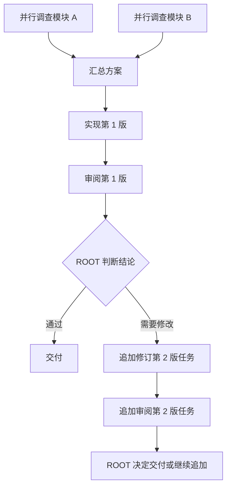

# Pulsara Subagent Workflow 增强设计

状态：**P1–P4 已按本文 hard cut 实施并完成本轮回归；独立代码审阅已完成**。设计审阅日期：2026-09-28；实施日期：2026-09-29。

本文最初是设计文档；本轮依此实施 P1–P4。设计依据当时工作树代码、仓库 [AGENTS.md](AGENTS.md)、GPT-6 Luna max 对 ZCode v3.14.3 的完整链路调研，以及随后关于语义任务图的产品讨论。Pulsara 调研基线为 Git `2701aa61`；实施起点为 `27e8334b`；ZCode 基线为 `29628c9acdb81b703bbd4080c207a0e7ce5e276e`。这些 Git 标识用于定位阅读对象，不增加内容 fingerprint。

## 1. 产品决策与实施顺序

Pulsara 沿用 ROOT 主 Agent 编排、worker 执行的单层结构。主 Agent 根据结果逐步扩展任务图；runtime 执行已确定的依赖、容量、权限和结果交付规则。普通研究、实现、审阅、修订、批量处理可以由这一条路径完成。

四项增强保持以下顺序：

1. **大任务图的增量更新与按需加载**：先让长期积累的任务仍可观察、查询和控制。
2. **统一容量所有者，支持运行中调整并发**：修改物理调度容量，额外逻辑任务继续排队。
3. **子任务独立选择模型**：在任务接纳时确定目标模型与推理配置。
4. **基于旧 worker 上下文创建后续任务**：新任务承接历史材料，旧任务及结果保持终态。

第 3 节的任务图语义是四个阶段的共同合同。其中已有行为继续复用；结构化结果、材料引用等新增能力随 P4 完成，不作为 P1、P2 的前置大型重构。

首版不增加脚本 VM、通用表达式语言、任意图解释器、持久 workflow run、执行重放或崩溃自动续跑。未来若有大量重复的确定流程，再单独评估少量自动路由规则；本设计不授权提前实现。

## 2. 当前代码事实

| 链路 | 当前事实 | 代码入口 |
|---|---|---|
| 创建 | `spawn_agent` 归一到 `create_agent_tasks`；后者一次最多接纳 16 项 | `conversation_kernel/subagent.py::_spawn/_create_agent_tasks` |
| 图 | canonical task/dependency/result rows；同批 key 或已有 task ID 建立成功依赖；接纳时验证无环 | `_repository/subagents.py`、`subagents/contracts.py::derive_subagent_batch_initial_dispositions` |
| 执行 | 每个 HostSession 创建自己的 manager；4 个物理执行槽，其余等待 | `host.py::HostSession`、`subagent.py::_start_available_tasks_worker` |
| 容量耦合 | manager、可运行任务查询、TODO child 与 provider continuity child scope 各有 4 槽约束 | `subagent.py`、`_repository/subagents.py::list_runnable_subagent_tasks`、`todo_runtime.py`、`input_continuity.py::_admit_scope_capacity_locked` |
| 权限 | ROOT 编排工具只在 bypass 模式执行；worker 不能创建后代 | `subagent.py::invoke`、`capability/builtin_catalog.py` |
| 上下文 | 默认 NONE，可选父会话 LAST_N；直接依赖的成功结果摘要作为协作材料 | `subagents/contracts.py`、`subagent.py::initial_context_sources` |
| 模型 | child turn 复制父 turn 的 `model_call_binding`；profile 是工作角色 | `_repository/subagents.py::start_subagent_turn` |
| 消息 | `send_agent_message` 仅发送到 ACTIVE worker；下一个安全点消费 | `subagent.py::_send_message/_consume_mailbox_safe_point_worker` |
| 收尾 | 显式报告或自然语言最终回复形成结果；终态释放槽位并推进依赖 | `subagent.py`、`_repository/completions.py` |
| ROOT 交付 | completion inbox 在安全边界追加；wait 是同步屏障；晚到结果可显式继续主会话 | `subagent.py`、`_repository/completions.py` |
| 观察 | canonical 事件、控制快照、process-local live 增量共同投影；独立任务清单支持分页 | `terminal_protocol/canonical_v3.py`、`frontend/lib/runtime-adapter.ts` |
| UI | 任务组、依赖图、详情与取消已有；清单读取会逐页读完整个会话 | `frontend/components/task-workspace.tsx`、`frontend/app/pulsara-app.tsx::loadSessionTasks` |
| 重启 | 原 generation 未完成任务被标为 INTERRUPTED；记录保留，执行不复活 | `_repository/kernel.py::_interrupt_prior_generation` |

上述路径未带前缀者均位于 `src/pulsara_agent/`。一次接纳 16 项、分页大小、消息字节等是现有操作边界，不是任务图总量上限；本设计不顺带取消这些边界。

### 2.1 本次确认的规模风险

- `_control` 要求每个控制区完整装入单次响应，默认条目预算 64、硬边界 128。任务区包含非终态任务及未被 ROOT 接收的终态结果；足够大的待办图可能使控制投影报资源异常，即使任务仍可执行。
- `read_observation` 可在同一批多个控制事件中重复携带同一份当前控制快照。
- 前端 `taskRefreshKey` 的任务状态变化会触发全任务组、逐组任务清单重读。
- `project()` 重建消息/子任务投影；图布局也可能在仅状态变化时重新计算。已有部分 Map 索引，实施前应测量热点，不能一概宣称需要重写。

以上为静态源码发现，尚无规模延迟或吞吐测量结果。P1 的验收必须补真实渲染与测量。

## 3. 具有明确语义、可逐步扩展的任务图

### 3.1 唯一执行单元

首版唯一执行单元仍是 task。它拥有目标、模型绑定、上下文选择、启动依赖及最终结果。batch 继续表示一次接纳的任务集合，不成为独立执行器；一个逻辑工作过程允许跨多个 batch。

ROOT 通过现有创建工具追加任务。worker 结果提供证据和建议，不能自行改图、提升权限或创建后代。图上没有自然语言自行获得执行权的边。

分清三种关系：

| 关系 | 含义 | 对调度的影响 |
|---|---|---|
| 成功依赖 `depends_on` | 下游必须等待上游成功终止并拥有合法结果 | 任一前置失败/取消/中断，沿现有规则阻断下游 |
| 终态材料引用 | 读取旧任务的结果或公开失败诊断 | 只允许引用接纳时已终止的任务；不新增等待或成功要求 |
| worker 历史来源 | 为新任务带入旧 worker 的有效历史上下文 | 只提供历史材料；不复活源任务、不继承它的执行权 |

当前已有成功依赖及其摘要传递。后两项由 P4 引入窄接口，不能靠滥用成功依赖实现。图展示用不同标签/线型区分；材料关联不参与拓扑调度，也不将所有来源边算作 DAG 依赖。

### 3.2 业务结论与执行终态

`COMPLETED` 表示任务成功产出结果，不表示结果赞同某个方案。审阅发现严重问题、研究得出证据不足，均可以是正常完成。

P4 为 `report_agent_result` 增加可选结构化 `data`，复用已有 JSON 编码与结果存储 owner；`summary` 仍是独立可读的交付。没有结构化需求时不要求模型填写空对象。示意：

```json
{
  "summary": "发现两个需要修订的问题，报告保存在 review.md。",
  "data": {"verdict": "needs_changes", "report_path": "review.md"}
}
```

首版 `data` 只供主 Agent 阅读和引用，不增加每任务任意 JSON Schema、条件解释器或供应商 structured-output 强制机制。不能从自然语言猜测、补造字段；没有显式 `data` 的推断结果保持缺省。

小 `data` 与 summary 一起随 ROOT completion 交付，也进入明确选择的结果材料。首版 `data` 是 JSON 对象；缺省与 JSON null 不混用，使现有可空 result child 字段能精确表示未提供。将现有 16 KiB summary 边界定义为本次主交付材料预算：`summary UTF-8 字节数 + 非缺省 data 的 canonical JSON 字节数 <= 16 KiB`。data 缺省时保留原 summary 容量；这是两种表现形式共用已有单次材料预算，不新增图/任务/历史总量上限。output_preview、diagnostics 继续服从原有独立边界；大数据使用文件或现有 artifact 引用。外层 result ID、状态等包装还必须进入完整 suffix 报价，不能把材料预算误作完整消息预算。

P4 必须同时修改 result canonical codec/确认读取、`build_subagent_completion_storage_body`、provider 投影、依赖与材料编译、查询/UI，并更新 `runner.py::_root_completion_followup_upper` 及实际 suffix admission。缺少这一闭环不能宣称结构化结果可用；也不能只把 data 存进数据库，或直接加到消息里却沿用低估的资源报价。

实施采用同一 provider input 预算逐档报价待交付 ROOT completion 批次，最多保留原有每安全点 16 件，首次未完成报价前只投递 1 件。报价实际可容纳数后再扩大，单件仍不能容纳时返回原有输入资源错误。这个数仅限制一次 suffix 的物理载荷，不限制总结果数、任务图或会话寿命；队列余项留到后续安全点。准备批次与提交之间若有新终态结果改变了待交付前缀，按精确过期错误重读并重报，不替换已安装的 SYSTEM/tools 或既有 messages。

未来自动分支若立项，必须先定义需要的字段类型、缺失/无效值的失败路径，以及规则的接纳者；不得以缺省值把未知结论当成通过。

### 3.3 分支、循环、批量和汇合

- **顺序/并行/汇合**：沿用成功依赖和就绪任务调度。汇合只引用实际创建的任务，不等待未选择的分支。
- **分支**：ROOT 读取结果后，仅为选中分支创建任务；首版不预建另一分支、SKIPPED 状态或虚构执行记录。
- **循环修订**：每轮新增任务，完成任务不回退为 ACTIVE；实际启动依赖始终无环。循环退出由任务要求、证据、用户控制和 ROOT 判断决定，不增加固定总轮数。
- **批量展开**：ROOT 根据真实输入清单分批创建任务，物理容量只控制执行数量。大输入清单可保存在普通工作文件中，模型按需读取；不要求把所有项一次塞进工具参数。
- **失败处理**：ROOT 获得真实失败结果后选择停止、修复或新任务。修复任务引用终态诊断，不成功依赖失败任务。取消不代表外部副作用已回滚。
- 模型调用失败详情沿现有 `terminal_public_detail` 保存错误分类和经现有脱敏边界处理的具体消息，供节点详情和后续任务读取；不能在异常转为文本时丢掉具体消息。adapter 复用当前请求的凭据边界，先替换错误消息中实际密钥值，再交给既有错误规范化；保留错误原因和请求编号。历史未保存的错误详情不推测补写。
- **复用结果**：明确引用旧结果和产物；不以输入相似或 hash 命中为由自动跳过新任务。文件路径指向当前文件，旧结论不证明文件仍是旧内容。



图中决策菱形表示 ROOT 的判断，不是新 runtime 节点。主 Agent 判断有模型延迟和判断误差，首版不宣称具有脚本确定性，也不保证任意自然语言条件会被严格遵守。文件编辑、测试、计算仍调用已有工具/脚本；本任务图只负责跨任务编排。

## 4. P1：增量观察与按需加载

### 4.1 所有权与最终形状

- canonical task/dependency/result rows 继续是任务事实来源。
- 现有 committed event sequence 提供变化边界；现有 live owner epoch/revision 提供进程内流边界。
- 协议投影、前端 Map、图布局及页缓存均可丢弃，不取得执行权。
- 概览显示精确计数和当前加载范围。列表分页、任务组按需展开、节点详情分页；未加载项可继续定位/读取，不能因不在缓存中而被标为已结束或不存在。
- 继续展示已有任务对话、思考摘要、工具输出、公开失败详情、等待原因与取消入口。旁观连接只有读取权限。

### 4.2 传输设计

P1 对 task 控制投影做一次完整 hard cut：常驻控制信息携带任务计数/摘要；任务行使用有界页与按 task ID 的完整条目更新。前端不再要求“所有活跃/待接收任务必须放入一张控制表”。其他控制区的既有保护不在此阶段顺带删除。

1. 首次快照给出已有 session 事件水位 S 与任务总数/未接收数摘要；首个任务组页另以有界读取取得，展开组后再取该组任务页。历史结果与依赖详情按需读取。未接收数包括待开始、等依赖、执行中以及尚未进入 ROOT transcript 的终态任务，并非只数终态结果。
2. 观察已有事件，提取受影响 task ID；同一批重复 ID 合并，从同一数据库读取视图获得最新完整任务摘要。无需新 durable event、task change journal 或每字段 patch。
3. 复用现有 event cursor 推进；每批公共控制快照最多携带一次。所有原有事件的语义与顺序仍可观察，合并的是重复派生数据。
4. 行更新携带完整的轻量字段，正文/历史/大结果走既有详情读取。移出“待处理集合”与“任务被删除”分开表达；完成后仍可从历史任务页找到。
5. 超过单次传输预算时分页或返回可继续读取的变更范围，不拒绝更多逻辑任务。单条大材料走已有内容读取，不能让重取相同超大快照成为无限错误循环。

worker 活动由已保留的 transcript/live 窗口派生，按准确 task ID 与已加载任务页合并；页中缺席不表示终止。既有 `TOOL_RESULT_START` 携带接纳时的 `assistant_entry_id`，工具结果按 task/assistant entry/tool call 关联，不依赖有界 active-turn/tool-attempt 控制页。`SUBAGENT_PROGRESS` 只提供已加载任务的临时进度文字；canonical 终态与已提交结果优先。

任务图由浏览器原生滚动承载视口，显式滚动尺寸包含缩放后的完整图形。鼠标可拖动空白区域，触摸使用原生滑动，节点点击继续打开详情；提供全图适应、缩放和 1:1。画布窄于 600px 时依赖方向上下排列，其余从左到右。首次打开聚焦本组节点，普通状态更新和滚动条尺寸变化不重排或重置视角。600px 为呈现断点，不是任务数量边界。

会话内的子任务结果接纳通知属于该轮“处理过程”，完成后随过程折叠；用户 steer 继续可见。过程内的思考、工具、通知和 steer 卡片采用紧凑间距。通知的说明浮层复用现有 hover 生命周期并通过 portal 显示，避免被折叠动画容器裁切；折叠、滚动、失焦和 Escape 会关闭浮层。左侧会话列表只显示名称和当前／已载入／可恢复状态，隐藏记录数及子任务计数。右侧并发摘要为只读“子任务并发数 · x 运行”，字体与任务 tab 留白沿用能力面板；节点模型仅展示名称与推理强度。跨组依赖节点可点击，通过现有单任务查询按需打开详情；不递归扩图或加载整个来源任务组，正文流式变化不触发重复读取，canonical 状态变化刷新所选任务。隐藏内部历史来源 ID、终态材料 ID 和结构化 JSON，保留可读任务对话与结果；取消操作位于详情右上角，仅控制窗口的未结束任务可用。

字段和消息包装应扩展现有 Protocol v3 的观察/查询载体，不复制 ZCode 的协议栈。允许增加必要的 wire 字段或 projection 类型；它们不成为新的 committed/live event kind。现有 canonical/live gap 路径继续负责重新同步。

### 4.3 一致性规则

必须区分两个复用既有 event sequence 的值：**完整交付的事件游标 C** 与 **行/摘要读取水位 R**。R 表示一份当前投影读到了哪里，不能证明中间事件已全部观察。

1. 初次连接或 gap 重建时，在一次快照读中固定基线 S。增量始终从 S 开始，分页与增量可以并行；不能等多页读完后用最大页水位作为新的起点。
2. 每个页/更新包的 R 与所读行来自同一 repeatable-read 视图。页 A 的 R=100、页 B 的 R=120 时，仍须从原基线接收事件 101–120；A 的旧数据依靠这些变化更新。
3. 每次 observe 只推进到已完整处理并交付的连续事件范围末端 C'。如果本批扫描至 110，而最新行读到 R=120，前端可采用这个较新的完整行，但事件 C 仍只能推进到 110。
4. 按行/摘要 R 拒绝旧页覆盖新值；即使新值已经来自较新页，后续事件的其他语义仍按序消费，不能因 task 行已新就跳过整个事件。
5. 传输超预算时缩小到完整事件范围，返回真实 C'；若无法完整交付最小单位，沿既有 gap/内容详情路径重建，不能越过未交付范围。实现时必须修改当前“整个 suffix 或 gap”的读取接缝，不能假定已支持这一算法。

所有水位复用 session 的既有序号，不新增数据库 per-task revision、观察 journal 或会话 generation。对 task 变更的精确关联也必须闭合：task subject 直接定位；result subject 通过 canonical result child 定位；ROOT 接收结果产生的 `InterAgentMessageAccepted` 通过对应 entry 的 `source_subagent_task_id` 定位。因此 completion accepted 后即使没有新的 task status 事件，也能更新行并移出待接收集合。其他间接 subject 必须有确切 canonical join，不能靠扫描工具正文猜任务 ID。

- 页序使用稳定的 `(accepted_at, task_id)`。分页中的计数来自 canonical 聚合，不用已加载行数冒充总数；过滤状态变化可能使页失效，应重读受影响可见页。
- 重连或 committed gap：废弃旧观察基线，重新读取可见页与摘要，再接增量；process-local 流按原 epoch 规则清理。已打开详情保持选中 ID，重新验明其存在与状态。
- 未知 ID 的完整摘要允许建立条目；稀疏 invalidation 必须触发读取，不能自行猜字段。
- `visibleDrafts` 当前对完整 `agentTasks` 的成员判断必须同步改造。流中缺少清单项不等于任务终态；需沿当前观察 scope/精确 task 查询确认，不能因分页丢掉 worker 输出。
- 窗口/缓存逐出不产生终态、删除事件或取消行为。缓存随可见页和展开详情释放，历史可再次读取。
- 取消继续使用现有 session、host session、task ID、command ID 的强身份 reference；结果不确定时按原 reference 查询/重试，不因列表刷新而重铸控制命令。分页缓存和旧状态显示均不是执行授权。

### 4.4 前端工作量

去除状态变化导致的全会话扫描；首屏只读取任务组页，展开组后读取它的任务页，选中节点后读取活动页。跨 batch 依赖按精确 ID 展示边界节点，按需展开；不能把单个 batch 误称为整个 workflow。

任务数据按 ID 合并；将结构变化与状态变化分开，稳定的结构复用布局。对大图优先提供分页列表、局部依赖视图和按 ID 定位，再根据实测决定是否需要虚拟化库；不自建图形引擎。布局缓存不保存到数据库。

## 5. P2：统一容量所有者与实时调节

### 5.1 容量语义

容量作用于当前 HostSession 的全部 worker，跨 ROOT turn、跨 batch 共用；默认仍为 4。它不是全进程模型请求上限。多个会话可以分别运行，首版不冒充全局供应商配额管理。

`KernelSubagentManager` 是唯一物理容量所有者，计算 `ACTIVE 执行 + 启动 reservation`。terminal 后的结果交付/清理尾部不继续占执行槽，但释放顺序必须保证 TODO/Hook/runner 的子资源不冲突。

kernel 和协议保留动态并发调整能力，沿现有连接认证、控制权和 Host writer 检查调用 manager。根据最新产品决定，前端不提供修改入口，只显示运行数量。模型侧暂不新增并发配置工具，也不改变正在运行的 SYSTEM/tools。

- 提高目标：在同一 owner 锁内修改并触发调度，等待任务及时补位。
- 降低目标：已有执行与启动 reservation 继续；待其退出使占用低于目标后再放新任务。UI 分别显示当前占用与目标，允许暂时 `6 / 2`。
- 相同目标：无副作用，不重启、不重复唤醒。
- 无效整数/非正值：参数错误；正整数仍受协议整数表示边界约束，不用 CPU 核数推断模型供应商并发额度。
- stop/close 与调整并发竞争时，以当前 owner 在锁内的裁决为准；失去 writer 的控制请求失败，不能操作新 Host。

查询前的 available 仅用于本次取行大小；**每个新 reservation 创建时都须在锁内重新比较当前目标、ACTIVE 和现有 reservation**。查询期间发生降容量，尚未获得 reservation 的行不享有继续启动资格。提高容量与 scheduler 正好退出竞争时，使用已有状态通知/调度 owner 保证再检查，不允许一次唤醒因旧 scheduler 尚未清理而丢失；不新建持久调度 job。

### 5.2 跨模块收敛

删除仓库查询中 `maximum_items <= 4` 的执行容量断言，保留分页查询本身的有界读取。查询分批取就绪任务，真实执行 admission 由 manager 的 reservation 裁决。

TODO owner 不再自行定义另一份物理容量；它只接纳当前 manager 已授权的 child 生命周期，复用启动许可/精确对象关联，不新建 token/fingerprint 注册表。

`input_continuity.py` 的 `MAXIMUM_CHILD_SCOPES = 4`、构造参数默认值及 `_admit_scope_capacity_locked` 是 P2 必改接缝。它们应消费 manager 同一个有效 child 启动授权，不能保留独立的固定 4 槽。必须保留 scope/session 身份、已安装 prefix、bootstrap 授权和终态释放规则；并发配置只控制可接纳多少 child，不放宽 provider-input 连续性。降低目标不能撤销现有 scope。

现有 per-epoch 与 Host 的 provider 输入驻留字节预算继续由 continuity owner 管理，不按新的并发数自动放大。更高 worker 目标不保证超过其他物理资源的工作都能同时启动；资源不足沿明确的 admission/错误路径反馈，不能吞成成功。其他相关运行态缓冲同样一并核对，采用分页、按需观察或同一 owner 容量，禁止只修改单个常量。

高并发也会扩大控制快照的 `active_turns` 和未完成 `tool_attempts`。P2 将与 worker 相关的这两部分接入 P1 的有界页/增量观察方式，保留 ROOT 当前执行和精确控制引用；不能只扩大 task 容量而让另一控制区超过 128 项后阻断整个会话。无关 Plan/交互控制区不顺带重构。

并发调节是当前 Host 的进程内设置；关闭/重启恢复默认值 4；前端只读展示运行数量，不展示目标输入或上限。首版不写全局配置、会话 journal 或并发变更 durable event。若以后需要持久偏好，复用设置 owner 并另行确定作用域。

没有新增总任务上限。没有为降并发暂停现有模型请求或工具调用，也不增加 ZCode SeatGate。供应商跨会话排队/公平性/自适应限流是后续独立议题，需要实际限流与并发测量。

## 6. P3：独立模型与推理配置

扩展现有任务创建接口，提供可选目标模型与推理选择。可选值来自现有模型目录/连接配置，不接受任意 URL、API key 或绕过已保存设置的临时路由。

1. 不指定时沿用父 turn 的已冻结 ModelCallBinding 与当次父 epoch 的有效目标事实；profile 仍只表达工作角色。
2. 指定时，接纳前由现有模型解析 owner 验证模型及推理组合；未指定推理时按该目标既有默认语义处理，不把不兼容的父模型 effort 强套过去。明确给出的非法组合使整批失败，不部分创建后再静默降级。
3. **ModelCallBinding 当前只有 connection_id + reasoning，不足以冻结实际目标。** 接纳时还必须通过现有 `freeze_resolution_snapshot` / target fact 接缝，捕获模型、route/wire、endpoint、推理合同等影响执行的非秘密闭合值。将可持久化的纯值与绑定保存到现有 task owner；不得序列化 transport、回调、client、完整带秘密 settings 或 process-local bundle。
4. 排队期间父会话换模型不影响该任务；同一个 connection ID 的元数据被改到另一个模型/endpoint 也不能静默改目标。启动时重新解析并与接纳时目标纯值 exact-match，再建立 child 自己的 epoch bundle；不匹配走 CHILD_START_FAILED。凭据更新不等于目标变化，仍按既有 credential owner 使用当前合法凭据。
5. task 值表示接纳的不可变选择，child turn 值表示该次执行绑定，两者 exact-match，不提供两套可变配置。连接已删除、目标不可用或认证失败，走既有启动/执行失败及公开诊断；不自动换供应商、换模型或修改用户设置。
6. 运行中的任务不能原地换模型；后续任务可以选另一个模型，并通过新 cold epoch 编译自己的输入。已启动 epoch 的 target bundle 继续由现有模型 runtime 校验。

复用 `llm/model_connections.py::ModelCallBinding`、目标解析与推理校验，不写第二份模型选择器。UI 在任务详情显示实际选择的模型/推理；默认不要求模型为每个任务重复填写全部配置。

模型必须能发现合法选项：P3 先检查现有模型/能力查询是否覆盖“可用于子任务的 connection 标识 + 允许的推理选择”，有则直接复用；当前只有 UI 可读取时，在现有能力查询 owner 下提供按需的模型可读查询，不把目录反复塞入 SYSTEM/tools，也不让模型猜供应商别名。典型流程为先查询一次可用目标，再只为需要区别的任务指定其中的 ID 和 effort；目录来源改变不修改已经接纳的任务。

工具 schema 更新只在新 cold epoch 或已批准的 compaction successor 安装。已冻结 epoch 不热更新 schema；它可以继续使用已安装的旧工具形状，实施切换时通过现有显式重载边界进入新能力，不能在存活 epoch 中替换 tools。

## 7. P4：历史材料、结构化结果与后续任务

### 7.1 三条窄路径

- **结果引用**：给新任务携带已完成任务的摘要、可选结构化 data 与产物引用。
- **失败材料**：给新任务携带已经 FAILED/CANCELLED/INTERRUPTED/BLOCKED_DEPENDENCY_FAILED 的公开诊断，保留原状态和不确定副作用说明。
- **worker 历史上下文**：给新任务带入一个已终止 worker 的有效上下文材料，用于连续审阅、研究追问、修订。

前两者通过任务创建的可选材料引用参数选择；同一来源已通过成功依赖注入时去重。第三者作为 context 的一种显式选择，与 NONE/LAST_N 互斥，避免模型组合多套历史来源。新任务可继续有独立成功依赖。

首版来源仅限当前会话中可查询、已终止的任务。worker-history 还要求来源确实启动过并拥有可读公共历史；ACTIVE/尚未启动的待办来源拒绝，不自动停止它、不读取变化中的转录来假装稳定快照。**终态失败材料允许没有 child turn 的来源**，包括 CHILD_START_FAILED、启动前取消和依赖阻断。工作区外/其他会话的任务 ID 不因可猜测而获得读取权。

### 7.2 接纳、来源与生命周期

接纳事务在验证权限、源任务终态和归属后，为目标任务冻结来源 task ID、适用时的 result ID、规范历史 cut 与源 turn 的既有 context binding revision ID；该不可变 revision 精确指向适用的 snapshot。利用源任务的不可变结果和已提交历史；不靠文件 hash 判断历史等价，不新增缓存命中表。

当前 worker 的初始 parent LAST_N 材料来自 `_start_materials`，终态后会清理；canonical 初始消息只保存 objective，任务行的 LAST_N 数字不能还原当时选中的具体材料。因此 P4 必须为**新接纳的任务**保存可回看的公开上下文来源：parent 选中内容在接纳事务冻结，成功依赖材料在 start 事务冻结，后续 inter-agent 消息沿现有 canonical entry 保存。使用现有 task/blob owner 的不可变内容或可精确重建的 canonical refs/cut，并纳入 blob 可达性；不能把进程内 cache 当作跨重载保证。

worker-history 包承诺的内容是目标、实际带入的公开 parent/dependency/材料来源，以及有效 cut 内已提交的公共对话；不包含旧 SYSTEM/tools、私有 reasoning、权限授予或未提交流。采用摘要覆盖的部分以摘要呈现，不重复递归展开全部祖先材料。此前没有保存来源的开发数据不能被宣称拥有完整历史包；hard cut 更新 clean-v0 和样例数据，缺失必需材料时明确不可用，不添加旧数据猜测恢复或静默降级路径。

新 task ID、child turn、模型绑定、权限、Hook/TODO/terminal 生命周期均独立。旧任务状态及结果不改变，下游已引用结果不失效。源 worker 曾做过什么不授权目标重新执行；目标执行任何副作用仍走本任务现有工具和权限。

目标排队后源材料无法合法读取，必须明确失败；不能静默退回 NONE、只带最后摘要或自动执行原任务。来源引用只能指向 canonical 材料；不能依赖进程内 mailbox、未提交流、工具活动进程或某个前端缓存。

### 7.3 上下文构建与前缀合同

历史通过现有 prompt compiler/context-source 接缝进入**新任务**的首个 cold epoch。旧 worker 的 SYSTEM、tools、权限说明和 provider 原生内部状态不作为新任务权威复制。

历史材料以有来源标记的协作数据呈现，保留可见角色、工具请求/结果对应和必要产物位置。没有对应结果的请求只能呈现为历史未完成/结果未知，不能伪造为新任务待执行的 tool call。跨模型时不搬运旧供应商私有 reasoning/replay；复用现有公共历史解码与兼容性校验。

源任务经过 compaction 时，读取该任务 scope 的有效“已采用摘要 + 保留材料 + 后续 canonical 历史”；不能把摘要标成完整原文。目标上下文超过实际 provider 输入预算时，由既有编译/compaction 路径处理；若该路径尚不能处理 imported worker source，P4 必须补这个窄接缝或返回明确的输入资源错误，不默默截掉历史。

**现有 fork 不能直接调用来实现此功能。** `fork_history.py::read_fork_anchor` 当前只接受 ROOT scope 的合法最终 assistant 锚点，且创建的是新会话历史。P4 应复用其底层历史读取/内容解码能力及现有 compiler，增加受 scope 约束的 worker 材料读取，不放宽 ROOT fork 的锚点规则，不复制整套 fork 执行链。

P4 不承诺“保留完整历史而没有 token 成本”；优先让模型按任务选择结果引用或 worker 历史。结果引用已经足够时，不默认携带整段工具输出。

### 7.4 重启、compact 与会话 fork

- 相同 Host 中 ROOT/child compaction 不重建执行器；当前任务 board 的既有 handoff 继续工作，显示未列出的计数并允许查询。
- Host 重启后旧未完成任务仍按既有规则中断；新用户请求可基于可读历史创建替代任务。UI 不写“自动恢复执行”。
- 已终止 worker 的 canonical 历史在同一会话重载后仍可作为新任务来源，前提是材料通过现有读取验证。
- 会话 fork 目前复制有效 ROOT 历史，不承诺复制 worker 任务图。首版不把父会话 task ID 伪装成子会话可引用来源；子会话可使用真正导入的 ROOT 结果材料，worker 历史选择只接受子会话自己的可读任务。后续若要复制任务图，需要独立 fork 产品合同。

### 7.5 模型使用说明的分层

内置 `pulsara-subagent` Skill 通过既有 bundled inventory、Skill catalog 和 `read_file` 路径提供按需指导。正文集中解释独立任务、ACTIVE 消息、终态 worker-history 后续任务、终态材料引用和成功依赖的选择，并提供普通审阅、连续追问和失败恢复的短例子。简单独立委派无需强制先读取 Skill；复杂上下文／连续追问／依赖／恢复可按目录说明读取。不新增 Skill 加载、执行或权限机制。

工具描述保留调用边界和参数合同：`worker_history` 接受当前会话已启动且公开历史可读的终态 worker，只给新任务传入历史；`send_agent_message` 仅用于 ACTIVE worker，并直接指向终态追问的创建路径。等待返回语义、分页、取消不回滚副作用和结果提交的 sole-call 规则仍在各工具说明中，不能把正确调用依赖于模型是否读过 Skill。系统提示只保留委派后继续独立工作、需要结果时等待、完成不自动开启新回复及按需读取 Skill 的常驻原则，删除重复的完整编排教程。Runtime 生命周期、schema 形状、资源边界与权限均不变；说明更新不构成旧 epoch 的 SYSTEM/tools 重建边界。

## 8. Prompt 与模型认知负担

工具表保持清晰分工：单任务用 spawn，真实依赖批次用 create，运行中补充用 send，需要同步才 wait。后续任务仍通过创建接口，不增加 resume/restart/followup 三组近义工具。

默认值承接普通用法：默认父模型、默认独立上下文、默认无结构化 data。只有实际需要时才填写材料来源、历史来源或模型选择。工具说明写产品行为、默认值和失败含义，不要求模型理解数据库、epoch、事件水位或缓存规则。

较长编排案例可以放进按需读取的说明/Skill；稳定工具 schema 和关键语义必须常驻，不能要求读取某个 Skill 才获得本来已经授权的工具执行权。读取 Skill 也不修改冻结 tools。

示例应包含真实区别：审阅完成但未通过；某个调查失败后基于诊断建立修复任务；跨批次引用已完成结果。避免只展示三个空任务串联，也避免让所有任务套用固定“研究—实施—critic”模板。

## 9. 持久化、协议与所有权预算

| 增强 | 最小持久化变化 | owner / 事务 / 失败路径 |
|---|---|---|
| P1 任务增量和分页 | 无新产品关系、事件、subject、guard、job | canonical reader + 同一读取视图；前端派生缓存丢失后重读 |
| P2 实时并发 | 无；Host-local 目标值 | manager 锁与既有 writer 检查；Host 关闭丢失，默认 4 |
| P3 模型选择 | 现有 task 增加非秘密模型绑定及执行目标纯值 | 批量接纳事务保存；启动解析 exact-match；不可用走已有失败路径 |
| P4 结构化结果 | 现有 result child 增加可选 data | 与 summary/终态同一结果提交；推断结果不捏造 data |
| P4 材料及历史来源 | 现有 task 增加闭合来源选择值及初始公开材料的内容/ref；引用现有 task/result/context/blob owner | 接纳/start 事务分别冻结已知来源，纳入 blob 可达性；compiler 读取失败为显式失败，无隐式降级 |

设计目标为 committed/live event kind、subject slot、append guard、product relation、durable job 数量均不增加。现有 task 接纳/结果事件承载已有产品动作，不新记“成功投影”“收到增量”“复用了结果”事件。

实现前确认最小列/约束变更；来源引用不能只是不可验证的任意 JSON ID。若现有 owner/约束无法支撑，需要修改本节写明独立产品必要性、事务边界与失败路径后再实施，不能临时补一张 registry 或 job 表。

clean-v0 baseline、canonical contracts、协议生成物、前后端和测试按阶段完整 hard cut。不得长期保留新旧任务全量/增量投影双写、字段 alias、legacy adapter 或模型路由 fallback；存活 epoch 的已冻结 provider 输入遵循原有连续性，不属于过渡数据兼容机制。

## 10. 实施拆分与验收

| 阶段 | 必须一起交付 | 完成证据 |
|---|---|---|
| P1 | 协议 task 投影、分页读取水位、前端局部合并、任务组/详情按需加载、live 成员判断改造 | 规模及乱序/重连测试，真实浏览器渲染和测量 |
| P2 | manager 容量 owner、所有 4 槽耦合清理、控制入口和 UI | reservation/关闭/调节竞争与排队公平性验证 |
| P3 | 创建 schema、任务绑定、模型解析、child admission、UI 目标展示 | 多模型确定绑定、等待期间配置变化、真实供应商小规模 dogfood |
| P4 | data、终态材料、worker 历史 cut/编译、后续任务查询来源 | 跨轮修订、失败恢复材料、源 compaction/重载及异模型输入验证 |

各阶段测试只证明自己的产品合同，不复制第三方库 conformance suite。以下规模是测试样本，不是生产总量上限。

### 10.1 P1：规模与观察一致性

- 覆盖 0、1、4、5 个任务，以及超过 64/128 个待处理任务；再用上千节点/大量历史组验证分页可达。
- 混合 ACTIVE、PENDING、WAITING、未接收终态；全部仍可精确查询/取消/接收，不能因当前页不可见而漏处理。
- 单任务状态变化不触发所有历史组重读；记录 HTTP 次数、响应字节、布局次数和浏览器响应时间，与同一机器/数据的旧路径比较，不预设未经测量的提速百分比。
- 页请求晚于新状态返回、重复更新、同批多次状态变化、任务移出待处理集合、用户切换页/组/会话、断线重连、committed/live gap。
- 固定 S=100、页 A=100、页 B=120、A 在 110 改变；扫描游标 C'=110 但行 R=120；首次加载期间连续新增/结束任务；超字节预算分页不跳事件；仅 ROOT 接收结果时待接收集合仍正确更新。
- 大摘要、长任务名、超宽/深依赖图、跨批次边、窄屏、仅旁观连接；必须实际渲染检查，而不只看单测。

### 10.2 P2：物理执行

- 4→2 不撤销已有执行，占用下降前不补位；2→6 及时补位；相同值不产生新工作。
- 调节与启动 reservation、结果提交、stop、Host close/takeover、TODO/continuity scope 释放竞争；任何任务至多启动一次。覆盖目标已降低但旧 scope 尚未退出的场景，不能丢 prefix 或误放第二个同身份 scope。
- 长队列按现有接纳顺序推进；多批次互不抢占已经接纳的早期就绪任务。仅统计这一会话的 child，主 Agent 不占 worker 槽。
- 更高容量下覆盖 TODO/Hook/live 投影等相关资源，不能将某一处容量不足吞成成功。
- 降目标发生在查询与 reservation 之间、提高目标发生在 scheduler 退出附近；worker active turns/tool attempts 超过旧控制页边界时，任务页和主会话仍可用，原控制 reference 的查询语义保持。

### 10.3 P3/P4：模型、材料和前缀

- 默认继承与显式不同模型/推理选择；批次有一项非法时没有半批任务。
- 排队期间父模型变更、同 connection ID 的 model/endpoint 元数据修改、推理合同变化、凭据更新、连接移除/认证失败；不出现静默目标替换或凭据泄漏。
- 当前 epoch 的 SYSTEM/tools 字节不变、messages 仅追加；后续任务拥有独立 cold epoch；源任务保持终态。
- 审阅 COMPLETED + needs_changes；缺省 data；summary/data 合计物理边界及 ROOT 自动/显式交付的完整报价；失败诊断引用能启动修复任务，成功依赖失败任务仍被阻断。
- 没有 child turn 的启动失败/启动前取消/依赖阻断可以提供失败材料，不能提供 worker-history；初始 parent/dependency 材料在 manager 清理、重载、源 compaction 后仍按合同可读，相关 blob 不被提前回收。
- 同一个旧结果被多次引用；跨模型 worker 历史；源 compaction 后读取；结果文件已改变/删除时不误称缓存命中。
- 未完成 tool call、不支持的多模态材料、损坏/缺失 blob、非法来源 ID、来源仍 ACTIVE、会话 fork 后父 ID 不可用等明确错误。
- 运行时重启不会执行旧任务；同会话已有终态材料可用于显式新任务。

真实模型验收优先使用用户已配置的 GPT-6 Luna high；只有独立高难审阅需要 Astra。通过 LocalSettingsStore/现有 home resolver 读取设置，保留可复核输入输出并去除实际秘密。此文档的静态审阅不等于运行验收。

## 11. ZCode 调研依据与取舍

本节整理 Luna 调研与后续纠正，供实施者和 critic 直接交叉检查；不把第三方设计视为 Pulsara 必須照搬的规范。

### 11.1 完整链路要点

ZCode Dynamic Workflow 的链路为：显式 workflow 入口/按需 Skill → 模型编写 TS → CreateWorkflow 分析确认 → RunService 编译并启动子进程 → VM facade 经 `__host` / NDJSON 连接 Engine → Scheduler/Driver 调用 actor → journal 保存执行事实 → 独立 workflowRuns 投影 → V4 传输 → UI。

控制流由脚本运行决定；静态因果图辅助分析和展示。run、actor、ask/node 各有不同生命周期；同 actor 的 ask 串行保持上下文。普通脚本计算和 world 操作也有相应执行边界。

源文件相对 `/Users/plumliu/Desktop/python_workspace/ZCode/`：

- `apps/zcode-cli/packages/core/src/tool/handlers/create-workflow.ts`
- `apps/zcode-cli/packages/dynamic-workflow/src/facade/dts.ts`
- `apps/zcode-cli/packages/dynamic-workflow/src/compiler/compile.ts`
- `apps/zcode-cli/packages/dynamic-workflow-runtime/src/harness.ts`
- `apps/zcode-cli/packages/bootstrap/src/app/dynamic-workflow-run-submit.ts`

### 11.2 三项升级的准确边界

**实时并发。** 每个 run 的 AskScheduler 和 SeatGate 共用 maxConcurrency 数值但计数独立；进程级 provider/model governor 又是另一层，按 `${providerId}/${modelId}` 共享并 AIMD 调节。调低不取消已准入请求；工具活跃 actor 对 SeatGate 的停驻有例外，但仍受 governor。Pulsara 采用提高补位、降低等待的产品语义，首版只保留自己的 worker 调度 owner。

- `apps/zcode-cli/packages/dynamic-workflow/src/engine/engine.ts::setMaxConcurrency`
- `apps/zcode-cli/packages/bootstrap/src/app/workflow-run-control.ts`
- `apps/zcode-cli/packages/bootstrap/src/app/workflow-seat-gate.ts`
- `apps/zcode-cli/packages/bootstrap/src/app/workflow-concurrency-governor.ts`

**修改与恢复。** Amend 创建新 run，先停旧 run 并等待结算/转录静止，再导入可复用的连续已完成 ask 前缀；v3.14.3 还可在严格条件下续用紧接前缀的一个 in-flight ask。actor 名称/persona、输入、序列、工作区变化和分歧都影响复用。Resume 使用原 run 与相同脚本身份，重放已有完成事实并安排未完成工作。Pulsara 首版采用不可变旧结果 + 新任务来源，不导入 in-flight ask、不新增脚本重放和工作区缓存失效体系。

- `apps/zcode-cli/packages/bootstrap/src/app/dynamic-workflow-run-submit.ts::amendDynamicWorkflowRun/resumeDynamicWorkflowRun`
- `apps/zcode-cli/packages/bootstrap/src/app/dynamic-workflow-import.ts`
- `apps/zcode-cli/packages/dynamic-workflow/src/engine/imported-cache.ts`

**大状态传输。** ZCode 用 workflowRun updated/removed、header 替换和 actor/node 按身份 upsert/remove，按连接合并事件；依靠既有序号/epoch 做 replay 或重新 snapshot，并优化 UI 索引和缓存。Pulsara采用按变化量传输、现有水位同步、派生缓存可丢弃的原则，复用自己的观察协议。

- `packages/shared/src/zcode-protocol-v4/workflow-runs-delta.ts`
- `apps/zcode-cli/packages/bootstrap/src/zcode-protocol-v4/conversation-topic-publisher.ts`
- `packages/ui/src/v4/conversationProjectionStore.ts`

Luna 特别纠正：ZCode 的 8 是整个投影保留最近 8 个 run；每 run actor、node 表分别最多 1,024 项；跨 run actor+node 总预算 6,144，某些活跃场景允许超出该预算。8-run 截断本身没有活跃 run 豁免。它们是展示投影容量，并非执行任务数量。Pulsara 不复制这些数字或静默遗忘行为，以分页/可再读取的窗口保持长期可观察性。

### 11.3 证据边界

Luna 调研及本文对照均主要来自源码静态阅读。没有声称 ZCode 已通过本地完整构建、长程故障注入或性能验证；本文也没有把 P1–P4 当成已实现能力。设计审阅要检查可行性、所有权和边界，运行验收按第 10 节另做。

## 12. 独立审阅记录

2026-09-28，初稿完成后新建 `subagent_workflow_design_critic`，使用 GPT-6 Astra、xhigh 推理进行独立 review，并在正文修订后复核。审阅输入为本文、当前 AGENTS.md、Luna 的 ZCode 调研结果及两仓库相关生产代码。

首轮提出的 3 项阻塞与 3 项重要问题均已改入正文：

| 发现 | 正文收口 |
|---|---|
| binding 只有连接 ID/推理，不能冻结实际目标 | P3 冻结非秘密目标事实、启动重解析核验，凭据仍由既有 owner 管理 |
| 页读取水位不能充当完整事件游标 | P1 固定 S，分开 C/R，并补事件到任务的精确关联与恢复测试 |
| worker 初始协作材料原本只在内存 | P4 接纳/start 保存公开来源材料及 blob 可达性，明确历史包范围 |
| continuity 固定 4 槽及 reservation 竞争 | P2 同一许可所有者、逐项锁内复查、释放/唤醒测试及相关控制区分页 |
| data 缺少 ROOT 交付和输入资源报价 | P4 完整 codec/查询/材料/UI/报价闭环，summary/data 共用既有主交付预算 |
| 未启动失败任务也应能提供诊断 | 终态失败材料与 worker-history 分别验明可用来源 |

收口结论：**可作为 P1–P4 分阶段实施依据，没有剩余阻塞或实质矛盾。** 该结论仅为独立静态审阅；具体方法签名、最小列/约束、前端布局及性能测量属于实施工作，不能据此跳过第 10 节的测试、浏览器规模验证与真实供应商验收。审阅未修改生产代码。

## 13. 本轮实施与验收记录

实施从 Git `27e8334b` 起，完成 clean-v0、后端、协议、浏览器和测试的单路径 hard cut。未增加 committed/live event kind、subject、guard、product relation 或 durable job 类别。保留的摘要用于既有协议身份、canonical 内容完整性和跨重启确认；没有增加 DTO 指纹或工作树代码 SHA。`0000_conversation_kernel_expected_catalog_v1.json` 的 catalog 指纹核验真实数据库结构，不充当执行权或代码版本证明。

交叉审阅后的代码包含：

- **P1**：S/C/R 各自推进；精确 task/batch 失效、同批合并、当前任务组按需读取；页请求与会话/快照 owner 绑定，重复“更多”请求合并。已加载 worker 的对话、实时文本、工具结果与进度均保持可见，超过 128 个控制页成员仍按身份关联。canonical 终态优先，不把缺席当结束。
- **P2**：manager 统一物理容量；降低目标时逐个复查 reservation，提高目标可唤醒调度。取消调用方先等共享调度结算，不取消别人的 scheduler；ROOT 不占 worker 槽。ROOT completion suffix 按完整输入报价，16 份放不下时逐步减到 1 份。
- **P3**：冻结实际已安装父 cohort 的非秘密目标及完整 typed reasoning contract；显式目标亦冻结。启动和首个 provider call 核验，同 connection ID 的模型或推理合同改变不会静默替换。没有新的 fingerprint DTO。
- **P4**：结果、失败材料与 worker-history 走既有 owner；task 行保存实际带入的公开来源。历史使用扁平 frames，采用源 compaction 后用其摘要/保留内容覆盖先前材料，避免递归包装与指数转义；不搬运旧 SYSTEM/tools、私有思考或执行权。已验证三代真实存储、重载/GC 与 1,000 代扁平读取。

### 13.1 自动化验证

根 agent 在修复后使用仓库 `.venv`、只读保存配置和核验后的本地临时 PostgreSQL，完整运行 **2,232 个 Python 测试通过**，51 个既有 aiohttp shutdown deprecation warning。日志：`/tmp/pulsara-workflow-root-full-python-final.log`。测试入口为 `/tmp/pulsara_review_test_env.py`，只向测试进程提供已核验的 PostgreSQL DSN，不导出模型凭据；它带标准主入口保护，避免 multiprocessing 子进程重复执行 pytest。早期错误测试入口产生的超时记录保留，随后原断言完整重跑通过。

前端最终完整运行 **546 个测试通过**，包含画布方向切换/滚动条变化不重置视口回归；TaskWorkspace **9 个测试通过**。完整前端日志：`/tmp/pulsara-workflow-root-full-frontend-final.log`；画布回归：`/tmp/pulsara-review-viewport-regression.log`。额外断言覆盖第 144 个 worker 的 START/DELTA/END 和 progress、同 call ID 不串消息、终态清理、迟到分页与重连快照、重复加载更多、跨组依赖失效、关闭组后释放任务缓存。`npx tsc --noEmit --pretty false`、协议生成物 `--check`、关键 Python 文件 Ruff 和 `git diff --check` 均通过。`npm run lint` 为 0 error/5 个既有 warning；`npm run build:local` 通过，保留既有大 chunk 提示，没有为了消除提示而提高阈值。

### 13.2 真实 HTTP 与浏览器规模验收

使用同一临时数据库的 **1,024 个 canonical 任务、64 个任务组**，通过生产 HTTP 读取接口和真实 `TaskWorkspace`/adapter 展示；页面壳为临时验收入口，应用完整连接竞态另由 app 测试覆盖。实际响应体测值：

| 操作 | HTTP 请求 | 响应体字节 | 浏览器观测耗时 |
|---|---:|---:|---:|
| 初始 50 个任务组 | 1 | 20,309 B | 26.5 ms |
| 初始展开 16 个任务 | 1 | 38,720 B | 27.9 ms |
| 已展开组状态稳定后刷新 | 2 | 41,160 B | 68 ms，总布局计数 2 → 2 |
| 同一当前数据全部任务页 | 21 | 2,620,402 B | 1,260 ms |

表中最后一行用于对比整表读取策略，不是运行旧版本二进制得出的整体提速比例。停止第一个任务并结算跨批次依赖后，一次刷新仍只读取组摘要和已展开页；包含该次结算的请求耗时约 2,682 ms，不等同于纯前端刷新时间。

已实际查看 1440×1000 和 390×844 截图，检查跨批次虚线边、长依赖链末端、鼠标拖拽、CDP 触摸滑动、fit→1:1、放大后两轴滚动，以及跨 600px 方向切换。窄屏改为上下链后，第一屏可以读到多个节点；末端在宽窄屏均可完整滚到并点击详情。验收发现并修复了“滚动条出现触发 resize 后视角回跳”的问题。截图在 `output/playwright/workflow-pan-final-mobile.png`、`workflow-pan-mobile-last.png`、`workflow-pan-mobile-fit.png`、`workflow-pan-mobile-zoomed-last.png`、`workflow-pan-desktop-last.png`、`workflow-pan-desktop-detail.png`。预览脚本位于本地忽略目录，不进入产品构建。

### 13.3 真实供应商与 critic

使用用户已保存的 OpenRouter `openai/gpt-6-luna`、推理 **high**，设置只读、临时数据库隔离。原实施阶段六节点依赖/fork-join 通过记录位于 `/tmp/pulsara-subagent-workflow-dogfood/real-provider.json`，审阅修订通过记录位于 `/tmp/pulsara-subagent-workflow-enhanced-dogfood-v8/real-provider.json`。后续六节点 v2/v3 的严格来源断言失败记录保留，没有弱化断言。

根 agent 修复后重新捕获完整 provider 输入，审阅 source 与 revision 均以显式 `data` 正确结算，通过报告位于 `/tmp/pulsara-workflow-root-review-dogfood-captured/real-provider.json`；8 份实际 SYSTEM/messages/tools 在 `/tmp/pulsara-workflow-root-provider-inputs.jsonl`，仅删除实际凭据值。前一次 source 输出了任务外的旧 MCP ordering 内容，保留在 `/tmp/pulsara-workflow-root-review-dogfood/real-provider.json`；该次没有完整 wire 证据，记为未归因的语义失败，不将其改写为成功。

原 Astra xhigh critic 完成五轮实现复核及新增画布复核，最后未发现剩余实质阻塞。它独立检查了 detached 工具结果、迟到请求关联、同 call ID 的跨 worker 隔离、独立 settlement 和终态优先；独立前端用例与内存探针通过。浏览器手势和尺寸由根 agent 实际验收，静态 review 不替代运行证据。

### 13.4 本地生产入口的真实浏览器验收（2026-09-29）

通过普通 `pulsara app` 与 headed Chromium 使用已保存配置，ROOT 与全部七个 worker 均为 `openai/gpt-6-luna` / `high`。已先核验本机 `localhost:5432/pulsara` 为可重置开发库，按 clean-v0 重置一次；后续修复与重启未再清库。设置文件未改写。

浏览器实测发现并修复三处集成问题：`subagent_capacity` 缺少客户端允许字段；提高容量时 Host 锁内等待 child TODO activation 造成重入死锁；接管旧进程任务时未清空 pending_reason，触发 canonical 表约束。容量目标在原 owner 锁内更新，释放 Host 锁后调用既有调度器；不增加后台调度 owner。旧 manager 清理遇到确认冲突时核验已有 writer 身份，失效 writer 不覆盖新 owner 的终态。

实测时尚保留并发修改 UI，后按用户要求隐藏该入口。实际会话 `51942d37` 先以并发 1 创建事实核对、使用指引审阅及依赖两者的综合审阅；界面调整至 2 后请求约 130ms 返回，两个就绪 worker 同时执行。使用指引任务出现 `unknown_provider_error`，综合任务按规则阻断。失败记录保留；ROOT 随后创建新审阅任务引用该失败材料，再跨批次依赖已完成事实核对，综合审阅得到 `needs_changes`。下一批以该综合任务的 WORKER_HISTORY（冻结 cut sequence 53）创建新修订任务，旧任务保持 COMPLETED；依赖修订的独立验收实际读取 `release-final.md`，返回 `ready`，正文含 769 个汉字。七项中五项 COMPLETED，一项 FAILED，一项 BLOCKED_DEPENDENCY_FAILED；没有把失败分支改写为成功。

工作目录为 `/Users/plumliu/Desktop/little_snake/workflow_release_review`。canonical task、模型绑定和依赖证据保存于 `output/playwright/workflow-live-canonical.json`，并发截图为 `workflow-live-capacity-two.png`，模型展示为 `workflow-live-model-detail.png`。最终重启后会话及任务结果仍可查看，并发恢复默认 4。

相关验证：协议与调度聚焦回归 86 项通过，接管回归所在 round10 模块 35 项通过；过程通知和图片 hover 相关前端 72 项通过，任务面板、应用集成与 runtime adapter 223 项通过，TypeScript 与本地构建通过。既有构建 chunk 大小提示仍存在。

最终界面验收：真实会话的桌面及 390px 窄屏通知浮层均完整显示；通知相邻间距为 8px，单独组合过程视图中工具、通知、steer 和思考之间也均测得 8px。折叠后通知和浮层不可见。跨组“事实核对”可点击并读取真实任务对话；取消按钮的窄屏尺寸为 80×28px，图标间距 6px 且不换行。截图保存于 `output/playwright/workflow-process-tooltip-desktop.png`、`workflow-process-tooltip-mobile.png`、`workflow-process-steer-spacing.png`、`workflow-cross-group-detail-desktop.png`、`workflow-cancel-header-mobile.png`、`workflow-sidebar-final.png`。既有 critic 完成本轮后续 UI/按需读取复核，最后无剩余实质问题。
