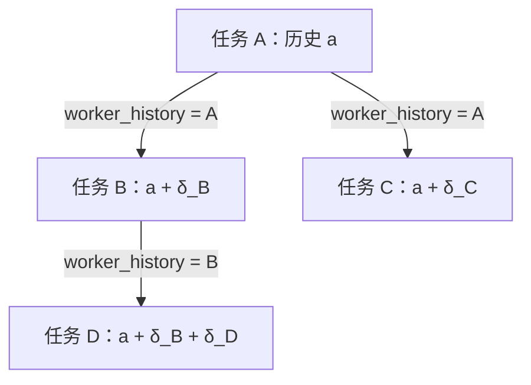

# Pulsara worker_history：基于 canonical 历史的上下文分支设计

状态：**设计已冻结，待实施；GPT-6 Astra high 两轮独立设计审阅完成，无设计阻塞项**。冻结日期：2026-10-02。

本文定义替代当前 `worker_history` JSON 历史材料链路的单一设计。实施后，覆盖 [Subagent Workflow 增强设计](PULSARA_SUBAGENT_WORKFLOW_ENHANCEMENT_DESIGN.zh.md) 第 7 节中有关历史包装、构建和保存的旧合同；独立模型、成功依赖、终态材料、调度、结果交付等合同继续保留。设计冻结不表示生产代码已经切换。

设计遵循 [AGENTS.md](AGENTS.md)。前缀约束与减法讨论见 [前缀一致性再思考](PULSARA_PREFIX_CONTINUITY_SIMPLIFICATION_REVIEW.zh.md)。

## 1. 核心决定

`worker_history` 创建一个拥有独立任务身份的上下文分支。它继承来源 worker 在指定截止点的有效公开对话历史，再追加新任务目标及自己的后续对话。来源任务保持终态。

- **新分支第一次启动**：可以根据该任务选定的模型、当前权限和能力重新编译，进入自己的 cold epoch。
- **分支启动后的同一 epoch**：严格保持 SYSTEM／tools 不变，messages 必须只追加；最终 provider wire 的既有前缀也不得改写。
- **跨 epoch**：尽量保持相同语义输入的公共前缀投影稳定，但不要求与来源请求逐字节相同，不以缓存命中为启动条件。

不复制来源的已安装 epoch，不保留来源 worker 进程等待“续用”，不增加 warm fork 与 cold fork 两条执行路径。cold 表示重新构建本地输入，不表示要求供应商清空缓存。

## 2. 用户想要的上下文树

设 A 完成时的有效历史为 `a`。ROOT 可以分别创建 B 和 C，让两者都从 A 出发：



`δ_B` 包括 B 的新目标、实际带入的新材料以及已提交的对话和工具结果。C 不继承 B 的目标或结果。D 从 B 出发，自然继承 B 的有效上下文；来源经过压缩时，继承的是压缩后的有效表示。

这是**上下文祖先关系**。ROOT 仍是唯一编排者，worker 不能因此创建自己的 worker；成功依赖图的调度规则不变。分支也不隔离工作目录：B 修改的文件可能被 C 读取，历史隔离不等于文件系统快照。

## 3. 当前实现与本次替换范围

当前 [history.py](src/pulsara_agent/conversation_kernel/subagents/history.py) 的 `read_terminal_worker_public_history` 读取任务、有效 snapshot、公开 transcript 和工具块，最终返回 `pulsara_worker_history.frames` JSON，标记为 `ADVISORY_HISTORY_NOT_EXECUTABLE`。[任务 repository](src/pulsara_agent/conversation_kernel/_repository/subagents.py) 在启动时保存 `worker_history_body`，[subagent.py](src/pulsara_agent/conversation_kernel/subagent.py) 再将它作为 WORKER_HISTORY 上下文来源注入 compiler。

这条路径提供的是带角色标记的历史说明材料。即使其中包含旧工具请求，它也没有成为正常历史投影中的 assistant tool call／tool result 对。

本设计改为：

```text
固定来源 task / cut / context binding
  → canonical 有效历史读取
  → 现有公共消息与工具历史 lowering
  → 新任务目标与材料作为后缀
  → 普通 cold 编译、最终 wire 报价和 epoch 安装
```

不把公开历史再序列化为一条巨型 JSON 消息；不只传来源的最终回复；不复制旧 SYSTEM、tools 或权限授予。canonical rows 提供历史语义事实，不等于来源当时完整 provider 请求的所有字节。

## 4. 模型接口保持简单

继续使用 `spawn_agent`／`create_agent_tasks` 的既有 context 选择：

```json
{
  "mode": "worker_history",
  "task_id": "从工具结果复制的来源任务 ID"
}
```

这是 context 字段的示意值，task ID 不是可直接执行的样例 ID。B、C 都填写 A 的真实 ID；从 B 继续则填写 B 的真实 ID。模型只需决定“独立任务、引用结果、承接历史”中的哪一种，不填写 epoch、cut、snapshot 或缓存参数。

| 入口／参数 | 产品含义 |
| --- | --- |
| context 缺省／`none` | 独立任务，不继承旧 worker 对话 |
| `last_n` | 选择主会话的近期公开材料，现有合同不变 |
| `worker_history` | 以一个终态 worker 的有效对话历史创建新分支 |
| `material_task_ids` | 引用终态摘要、data 或失败诊断，适合无需完整历史的任务 |
| `depends_on` | 成功依赖，影响启动；不能用来代替历史来源 |
| `send_agent_message` | 向 ACTIVE worker 补充消息，不重新启动终态任务 |

不增加 `resume_agent`、`fork_agent`、`followup_agent` 等同义工具。工具描述保留关键来源限制；按需的 `pulsara-subagent` Skill 解释选择及短例子，不向模型讲内部状态机。

## 5. 来源选择与接纳事务

来源必须属于当前会话、已终止、确实启动过，且拥有可读的有效公开历史。完成、失败、取消或中断后的任务，只要满足这些条件都可作为来源。未启动的依赖阻断、启动失败或启动前取消只能通过终态材料引用提供诊断。

在现有任务接纳事务中，验证归属与终态，冻结：

1. `history_source_task_id`：直接祖先任务。
2. `history_cut_sequence`：本次采用的来源 canonical 截止点。
3. `history_context_binding_revision_id`：该截止点适用的不可变有效上下文基准，精确指向已采用 snapshot 等既有 owner。

沿用现有字段与 canonical 所有权约束，不建立新的历史注册表、缓存命中表或 fork job。来源必须是接纳前已存在的终态任务，新任务不能引用自己或未来任务；通过这些接纳事实保持上下文来源无环。

引用验证必须同时确认 revision 属于来源任务的 child turn，cut 属于来源 scope 的合法已提交前沿，且不早于所选 snapshot 的覆盖截止点。clean-v0 为来源 task／revision 保留相应外键和不可变约束；不能仅凭同一 session 内某个 revision ID 存在就接纳。这里不新增产品关系或证明注册表。

排队不会把引用变为“启动时重新选择最新来源”。启动读取固定 cut 和 binding；来源已不可合法读取时，沿现有启动失败路径返回具体原因，不静默改成 NONE、最后摘要或另一个来源。

模型选择沿用现有接纳冻结合同：新分支可选不同模型；缺省仍继承本次委派的父模型绑定，而不是历史祖先的模型。排队期间目标配置变更不能偷偷替换已经接纳的目标。权限、能力按分支启动的合法读取边界准备；这一点不授权改写已接纳的模型选择。

## 6. 有效历史的唯一组成规则

### 6.1 未采用 snapshot 的来源

有效历史按语义顺序组成：来源继承的有效基准、来源实际带入的初始公开上下文、来源目标、其截止点内已提交的公开对话。新分支随后追加自己的目标和实际新材料。

来源初始 LAST_N、成功依赖及终态材料不能漏掉。当前部分内容保存在 task 的公开材料字段中，而非普通 transcript；新的 typed reader 必须从现有冻结 owner 读回，在原来的语义位置通过公共 lowering 呈现。不能声称“只查 transcript rows”就还原了完整有效历史，也不能让这些材料在每代重复注入。

这些初始材料在其所属 task 的 objective 之前，作为一次性的、有来源和不可信属性的公开材料项呈现；顺序固定为 parent LAST_N、成功依赖材料、终态材料，缺省项不产生空占位。随后读取已经包含 objective 的本任务 transcript，不再额外生成第二条 objective。

材料正文仍由现有 task 字段拥有；其 typed item 的顺序与覆盖锚点使用**该 task 真实 initial entry 的 ID／sequence**，并以材料种类区分同位置项。sequence 表示材料随这条 initial entry 进入有效上下文，不宣称材料拥有另一条 transcript row；不分配虚假 entry／sequence，也不能因正文没有独立 row 就使用无锚点的 `source_entry_sequence=None`。同一锚点的材料项和 objective 按上述稳定顺序作为一个初始组进入 compaction 选择与覆盖，不能在这个组中间切断。cold 读取、报价、frontier 与 compaction 都使用同一组 typed 项。某任务的已采用 snapshot 覆盖了该 initial entry 后，不再从 task 字段重新注入它；摘要及保留材料负责后续有效表示。

planner 选择本任务当前请求时，使用 initial entry 归属加 typed objective 种类／`SUBAGENT_OBJECTIVE` 来源属性定位唯一主项；不能仅按共享的 entry ID 匹配所有材料项。材料与 objective 共享覆盖锚点，不共享当前请求身份。

历史目标保留为历史；新目标只追加一次。历史中的工具输出、外部文本和协作材料继续保留来源及不可信属性，不通过伪造 user／SYSTEM 角色提高其指令优先级。

### 6.2 已采用 snapshot 的来源

有效历史为“已采用摘要 + 保留材料 + 该基准之后、截止点以内的 canonical 后缀”。snapshot 已覆盖的祖先不再递归展开，不能同时带回压缩前全文。摘要明确是摘要，不宣称原文恢复。

分支自己发生 compaction 后，未来从该分支创建的任务采用其当前有效 snapshot，而不是绕回最早祖先。这既保留现有压缩语义，也避免树越深、输入就重复展开越多。

来源 snapshot 中的 `RESUME_ACTIVE_TURN`／`active_request` 仅表示来源当时如何继续执行，不能成为新分支的当前请求。读取时校验其 canonical 来源并将 snapshot 内精确保留的请求转换为历史 retained request，复用 ROOT fork 已有的历史化语义，但校验 worker 自己的 scope／objective，保留 `SUBAGENT_OBJECTIVE` 来源属性。请求仍位于后缀时从后缀读取，不重复添加；不按文本相同去重不同请求。该转换只构建读取所得的 typed 历史视图，不修改来源 snapshot。目标分支唯一当前请求是它自己的新 objective，来源 continuation 状态不授予继续执行权。

### 6.3 工具历史与 provider 表示

保留合法的历史消息顺序、公开 assistant blocks、工具名与参数、请求／结果对应、已有 artifact 和内容引用。历史调用只是记录，不重新执行，不进入新任务待执行队列，也不把来源的工具权限带给分支。

已结束但结果缺失或状态未知的请求，必须通过既有公共历史 lowering 的可见未知结果表示形成协议合法的历史；不能编造成功结果、重新调度工具，或留下供应商拒绝的悬空调用。若现有 lowering 尚未覆盖 worker 的这种情况，实施时补这个窄适配并验证实际 wire。

每段祖先历史分别使用自己的来源 scope、context binding 和冻结 cut 判断可见结果及 closure。`next assistant` 只在这一段截止点内寻找，末尾调用的可见截止点使用该段 cut；不能跨到后代 assistant，也不能用 B 的全局读取 cut 判断 A 的调用。cut 内已经提交的晚到结果继续按既有 late observation 语义呈现；cut 之后提交的来源结果不得改变这个分支的祖先历史。原 session 可照常保存迟到结果，继承它必须另行选择新的合法来源，不补写已安装前缀。

跨模型使用现有 replay compatibility 与公共投影机制。供应商私有或不兼容片段不能被伪装成通用历史；已提交、可合法复用的兼容片段继续服从其既有合同，不另建私有 reasoning 保存路径。

图像等公开材料交给已有 canonical image／snapshot 读取和目标模型能力校验。当前 JSON reader 的统一拒绝不成为新设计的永久限制；具体目标确实不支持或材料损坏时明确失败，不能静默删除这些内容。

## 7. 读取、存储与回收的所有权

canonical transcript、task 初始公开材料、context binding、snapshot、blob／artifact 等已有 owner 拥有内容。branch reader 只组合它们，不成为第二个历史真源。

优先用现有任务上的来源引用加本任务自己的 canonical 后缀表达分支，不为每个后代复制整段祖先 rows。当前 ROOT fork 创建新会话并复制导入历史；可以复用其底层 canonical 读取、内容校验和公共 lowering，不能直接调用整个 ROOT fork handler，也不能放宽 ROOT-only 的锚点规则。

实施必须闭合三个接缝：

- **scope 读取**：分支的 effective reader 同时看见固定来源基准与自己的后缀；不能把 session 全局 sequence 区间当作一个 worker 的全部历史。
- **引用可达性**：分支及仍可作为来源的终态任务引用纳入现有内容／snapshot 可达性和删除约束，避免源任务结束清理后丢失材料；不得依赖 manager cache 或 provider epoch 存活。复用当前 transcript、snapshot、image／artifact 等 canonical 引用及 blob GC，不建立新的可达性图。任务终态不等于删除历史；整会话删除继续按现有级联规则处理。
- **压缩**：compaction 的输入读取及被采用的结果使用同一有效历史定义；新的 snapshot 覆盖哪些祖先材料必须明确，回收仍遵循实际引用。

### 7.1 唯一 effective view 与有效 base

来源引用不是只在第一次 cold 调用前拼接消息。现有 canonical reader 的 ordinary read、headroom／资源报价、frontier 构建、append 后缀选择，以及 compaction 的输入、dry run、post-adoption read 都必须消费同一个 effective view 规则；不得另写一套“首次启动专用”祖先扫描器。分支历史工具只参与输入读取，不进入新任务 dispatch 的待执行查询。

新 B 的 durable context binding 起初仍是本任务的 genesis；不为“继承历史”新增 durable base kind。effective reader 从不可变来源引用解析有效 base：

1. B 已有自己的 adopted snapshot：采用它作为唯一有效 snapshot，读取 B 的覆盖点之后的后缀；停止展开祖先与已经覆盖的初始材料。
2. B 尚无自己的 adopted snapshot：沿来源链找到第一个适用的 adopted snapshot，采用其摘要与历史化 retained 材料，接上其后的各段固定祖先后缀及 B 当前后缀。
3. 整条链都没有 snapshot：采用有效全文基准，按祖先到后代的固定顺序组成各段公开历史。

单次有效视图最多含一个 CONTEXT_SNAPSHOT。祖先 snapshot 与 B 自己的 raw FULL_HISTORY binding 不能分别传给不同消费者：compaction 的 base／lineage、genesis floor、预算与 items 必须反映同一个解析结果，避免出现“声明无 snapshot、items 却含 snapshot”的矛盾。B 的当前 binding 与来源 snapshot 的归属分别保留，不把 A 的 revision 冒充 B 的 durable binding；scope／来源校验复用现有 owner。

### 7.2 顺序与前沿

祖先到后代的 segment 顺序由不可变来源引用决定；segment 内按其原 canonical 顺序读取。B 的 session 全局 cut 只裁定 B 自己的后缀，不能扩大任何祖先 cut。初始材料项、snapshot 保留项、工具 closure 和普通消息在所有消费路径中具有同一顺序与计费方式。

同 epoch frontier 继续使用现有 process-local owner、完整有序项及前缀比较。有效基准与来源引用在本 epoch 内不变；源任务晚到结果不能通过重新读取祖先改变 ordered items。无需另存 lineage fingerprint／前缀 checkpoint，也无需复制祖先 rows 来获得顺序。B 自己采用新 snapshot 的变化只发生在明确的 compaction successor 边界。

采用按需、迭代的祖先读取与已有有界物化，不设置总祖先数、总任务数或分支深度上限。已有单次输入条目、字节及 provider 预算仍适用；超预算通过既有压缩或明确资源结果处理，不静默截断。不得先无界展开全部祖先再依赖最终报错控制内存。

不持久化已安装 SYSTEM／tools／wire 请求来实现分支。现有来源字段不足以表达某个必需语义时，先修订本文，说明唯一 owner、事务与失败路径；不能临时增加证明链、checkpoint 或执行恢复机制。

## 8. 新 epoch 与运行中变更

每个新任务创建独立 child turn、scope 和 cold epoch。compiler 基于固定历史、已接纳目标及启动时合法能力生成输入；完成最终 wire 预算校验后，由现有 continuity owner 安装。SOURCE、B、C 的 runtime cohort 相互独立。

例如，用户已关闭某 MCP 对子代理的开放权限，B 的新 tools 不应继续开放它。A 的旧调用仍可作为合法历史阅读，但不授权 B 再调用。若当前 MCP 数量使直接工具降级为元工具，新分支按当前曝光计划编译，无需继承 A 的工具表。

分支安装后，新的权限限制仍由执行 owner 检查；配置变化不能偷偷刷新 SYSTEM／tools、改写历史或触发隐式 cold reset。需要告知模型的变化走既有追加观察路径。真正重建只能进入 [AGENTS.md](AGENTS.md) 已批准的 cold／显式 adopted compaction 边界；本设计不增加运行中 rebase 例外。

相同历史、模型和环境下，公共 lowering 尽量保持既有顺序、文本和结构；不为说明“这是分支”添加无语义的时间戳、整段包装或刷新全部调用 ID。必要的协议身份重绑定沿现有 owner 做，不能为追求缓存而牺牲合法性。缓存命中只是收益，不是承诺。

Host 重启沿现有规则中断旧执行，不恢复其私有进程状态。可读终态历史仍可用于创建新分支；会话 fork 不顺带复制 worker 任务图或授予跨会话 task 引用权。

## 9. 实施时必须删除的旧路径

这是一次 hard cut，实施时同时更新代码、clean-v0、说明、测试和样例：

1. 删除 JSON `pulsara_worker_history.frames` 包装及 `ADVISORY_HISTORY_NOT_EXECUTABLE` 历史包生成路径。
2. 删除复制该包的 `worker_history_body` 存储与启动注入链路，移除专用 WORKER_HISTORY 巨型文本 observation 及其 compiler 接线。
3. 来源引用由有效历史 reader 消费；保留本设计需要的初始公开材料，不误删 LAST_N、依赖结果或终态材料功能。
4. 更新 `pulsara-subagent` Skill、工具描述、任务详情和旧规范，将“历史材料包”统一改为“承接有效对话历史的新分支”。

不保留 JSON／canonical 双路径、旧行猜测恢复、自动摘要 fallback 或 feature flag。已有开发数据按仓库 clean-v0 规则处理；运行中已安装前缀不能因代码更新而原地改写。

## 10. 实施验收要求

以下是未来实施的验证要求，本次文档工作没有执行这些测试。

- A→B、A→C、B→D：目标各出现一次；C 不含 B 后缀；D 保留 B 的有效上下文；A 的状态和结果不变。
- 实际 provider 输入包含正常的公共历史消息与工具请求／结果，而不是一条 JSON 历史包；历史工具没有被重新执行。
- 初始 LAST_N／依赖／材料、源失败与取消、未知结果、图像／artifact、来源已压缩及分支再压缩；覆盖材料损坏和不支持目标的明确失败。
- 来源 snapshot 含 RESUME_ACTIVE_TURN／active_request，分支仍以自己的 objective 为唯一当前请求；祖先 snapshot 与 child genesis 的有效 base 在 normal read、报价、compaction dry／post-adoption 中一致，初始材料压缩后不重复。
- 先接纳 B 并冻结 A 的来源 cut，再提交 A 末尾工具调用的迟到结果，最后启动／追加 B 的对话；B 的祖先 closure 不变，不跨 segment 使用 next assistant cut，当前消息与结果报价不遗漏祖先载荷。
- 接纳到启动之间的排队、配置变化、内容回收和 Host 重载；固定来源 cut，接受目标不被替换，无隐式历史降级。
- 分支启动时不同模型、MCP 子代理权限变化、直接／元工具曝光变化；安装后同 epoch SYSTEM／tools／最终 wire 前缀严格不变，messages 只追加。
- 多代分支按需读取、既有物理预算及 compaction 路径；没有人为历史深度／任务寿命上限，也没有重复嵌套祖先。
- 静态验证与独立 review 收口后，真实 Pulsara 会话验证“同一个终态来源创建两个不同后续分支”，检查输入和工具执行事实；不以缓存命中率作为通过条件。

## 11. 设计审阅收口

2026-10-02，GPT-6 Astra high 对照当前生产读取、compaction、工具结果结算、fork 和内容回收链路完成两轮只读审阅。第一轮提出的三项冻结阻塞——统一 effective base 与消费入口、来源 active request 历史化、祖先 segment 的固定 cut——已在第 5–7 节及验收中闭合。第二轮结论为可冻结、无新的独立阻塞；typed objective 主项定位和晚到结果验收顺序也已明确。

该结论只确认设计的可行性与合同完整性。尚未实施、未运行本设计的测试或真实 provider dogfood；后续实施必须完成第 9–10 节的 hard cut 和验收，不能把设计审阅当作运行时正确性证据。
