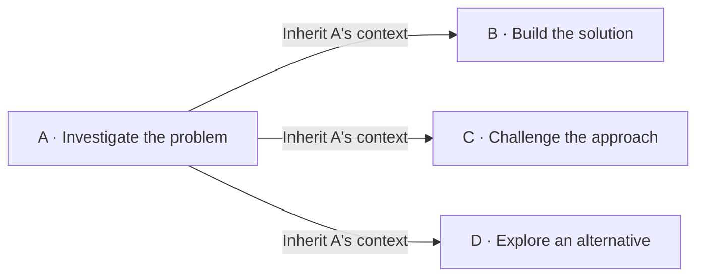

<h1 align="center">
  
  Pulsara
</h1>

<p align="center">
  <strong>A whole team of agents. Your models. Your machine.</strong>
</p>

<p align="center">
  
</p>

<p align="center">
  <a href="#open-the-workbench">Open the workbench</a> ·
  <a href="#built-for-the-whole-job">Explore</a> ·
  <a href="#put-a-team-on-it">Agent teams</a> ·
  <a href="#deliver-something-you-can-use">Artifacts</a> ·
  <a href="#make-it-your-own">Ecosystem</a> ·
  <a href="README.zh-CN.md">简体中文</a>
</p>

**Pulsara puts a personal AI team to work on your code, research, and data.** Give it an assignment: investigate a bug, compare competing approaches, turn a dataset into a dashboard, or prepare a document for review. It plans the work, delegates tasks, runs tools, and builds the deliverables in a local-first visual workbench.

Agents can work in parallel, branch from a shared investigation, and carry knowledge into future conversations. Stable prompt prefixes give long runs a foundation for cache reuse. Follow the work in your browser, steer it as it develops, and open the code, documents, or interactive results it produces.

**Bring an ambitious task. Give Pulsara room to work.**

## Built for the whole job

| Capability | What it brings to your work |
| --- | --- |
| **Parallel agent teams** | Put investigation, implementation, and review on separate agents, each with its own context and model. |
| **Branchable context** | Take several approaches from the same completed investigation, carrying its conversation and tool history into each branch. |
| **Persistent memory** | Bring your preferences, project knowledge, and earlier decisions into the next assignment. |
| **Long-running work** | Keep moving through lengthy investigations with context compaction, background terminals, and saved conversations. |
| **Prompt-cache reuse** | Keep exact prefixes stable so supported providers can reuse processed input, lowering input cost and response latency on cache hits. |
| **Useful deliverables** | Get working code, interactive dashboards, Word documents, editable spreadsheets, PDFs, and diagrams. |
| **Skills, MCP, and plugins** | Give agents the specialist workflows, external services, and project tools your assignment calls for. |
| **A visual control room** | Inspect task conversations and tool activity, review plans, and steer the work while it runs. |
| **Your choice of models** | Mix OpenAI-compatible providers and self-hosted endpoints, choosing a model and reasoning level for each job. |

## Put a team on it

Let one agent trace the implementation while another checks the assumptions and a third explores the data. Pulsara's coordinating agent delegates the assignments, gathers the findings, and turns them into the next step.

Each task has its own conversation and progress. Open the task graph to see the work unfold, read a worker's findings, or inspect its inherited context. Agents can arrange tasks in stages and pass results into later assignments.

### One investigation. Multiple paths forward.

A good investigation is worth building on. Pulsara can continue its conversation and tool history in a new task—or use it as the common starting point for several branches.



The implementation agent starts with the investigation in hand. The reviewer starts from the same findings and develops an independent continuation. Another agent can explore an alternative. Each branch builds its own history while working with the project files in your shared directory.

Use a fast model for a focused check and a stronger model for a difficult design problem. Give a reviewer a second look at the result. You can inspect every task's conversation as the team works.

## Keep the work moving

Take on the refactor that needs several passes, the investigation that keeps uncovering new questions, or the project you'll return to tomorrow.

Pulsara searches files, edits code, runs commands, and checks their output. Leave a long-running command in a background terminal while the agent takes another step. Context compaction makes room as the conversation grows, and saved history keeps the work available when you return.

Send a correction while the agent works, queue the next instruction, or stop to reconsider. Plan mode lets it investigate and propose an approach for your review before implementation begins.

## Built for prompt-cache reuse

**Long context is an investment. Pulsara keeps it ready for reuse.**

As agents work through successive steps in the same context, system instructions and tool definitions stay byte-identical. New messages, tool results, and user guidance append to the history, preserving the exact prefix established by earlier calls. After compaction, the fresh context follows the same discipline.

That continuity gives [provider prompt caching](https://developers.openai.com/api/docs/guides/prompt-caching) a stable foundation for repeated hits. Cached prefixes can reduce input-processing cost and speed up response starts. The more steps share a growing history, the more previously processed context remains available for reuse.

## Knowledge that carries forward

Start the next assignment with your preferences, project decisions, and recurring constraints already available.

Pulsara can remember your writing style, retain the reasoning behind a project decision, and retrieve knowledge from earlier conversations. Keyword and semantic search help the agent find what matters for the current task. Related memories connect the pieces, and newer decisions can supersede older ones.

Open the memory workspace to inspect what's stored, check available sources, edit a preference, or remove something that no longer applies. Your working relationship with the agent gains a history you can see and shape.

## Deliver something you can use

Open an interactive dashboard and explore the findings. Hand an editable workbook to a colleague. Review a Word document with comments and tracked changes. Run the fix against your project.

Pulsara brings those results into the workbench with inline interactive HTML, diagrams, mathematical notation, images, and file previews. Open a referenced file, inspect the full tool output, or export an artifact to take it into your next workflow.

Built-in Skills give agents practical workflows for substantial deliverables:

| Work | Built-in Skill |
| --- | --- |
| **Documents** | [pulsara-docs](src/pulsara_agent/bundled_skills/pulsara-docs/SKILL.md) — Create and edit Word documents, work with templates, comments, and tracked changes. |
| **Spreadsheets** | [pulsara-sheets](src/pulsara_agent/bundled_skills/pulsara-sheets/SKILL.md) — Transform data, build formulas, format workbooks, and produce editable charts. |
| **PDFs** | [pulsara-pdf](src/pulsara_agent/bundled_skills/pulsara-pdf/SKILL.md) — Read, extract, and create PDF documents. |
| **Data analysis** | [pulsara-data-analysis](src/pulsara_agent/bundled_skills/pulsara-data-analysis/SKILL.md) — Explore datasets, run Python and SQL analysis, and build interactive HTML reports. |

### Give it a real assignment

> **Engineering:** “Trace this bug, compare two fixes, have another agent review the chosen approach, and run the relevant tests.”

> **Research:** “Use the connected research tools to compare these approaches. Follow the sources, challenge the assumptions, and build a visual briefing.”

> **Analysis:** “Investigate these spreadsheets, explain what changed, and give me an interactive dashboard plus an editable workbook.”

> **Documents:** “Read these materials, draft a proposal in Word, and revise it around my comments.”

## Make it your own

Bring your research services, specialist workflows, and project tools into the same workbench.

- **Skills** teach agents a repeatable way to handle specialist work. Install one for a new domain or ask the agent to create one for a recurring assignment.
- **MCP** puts external tools, data sources, resources, and prompts within the agent's reach. Configure connections and authentication in the workbench.
- **Plugins** bring related Skills, MCP services, and hooks together in a package.
- **Hooks** attach configured actions to supported moments in the agent lifecycle.

Keep capabilities available across your work or scope them to a project. Manage them in the interface, or ask the agent to inspect and configure them. Built-in installer Skills guide the agent through adding Skills, MCP servers, and plugins.

## Choose the right model for the job

Choose a model for a quick lookup, another for a complex implementation, and a third for independent review. Each delegated task can use its own model and reasoning settings.

Connect OpenAI-compatible services and self-hosted endpoints through Chat Completions or Responses. Model selection and supported reasoning controls are available in the workbench, so you can shape the team's mix around the assignment.

Your workbench, conversation history, and memory live on your machine. You choose the model connections that power the work.

## Stay close to the work

Your control room brings conversations, agents, capabilities, memory, and terminals into view. Find a conversation by directory or search its history. Expand tool activity, open a worker's conversation, and watch background commands progress.

Select part of a response to give precise feedback. Fork a conversation to explore a different direction. Review a plan or answer the agent's questions before it takes the next step. When the goal changes, steer the run or stop it.

**Delegate the work. Stay involved where it matters.**

## Open the workbench

With Pulsara installed:

```bash
pulsara app
```

Pulsara starts the local service and opens the browser workbench. Choose a working directory and configure your models in the interface.

---

Built with a typed Python runtime, a React workbench, PostgreSQL-backed history and memory, and ripgrep-powered file search.

[Share an idea or report an issue](https://github.com/plumliu/pulsara-agent/issues) · [Contribute](https://github.com/plumliu/pulsara-agent/pulls)
