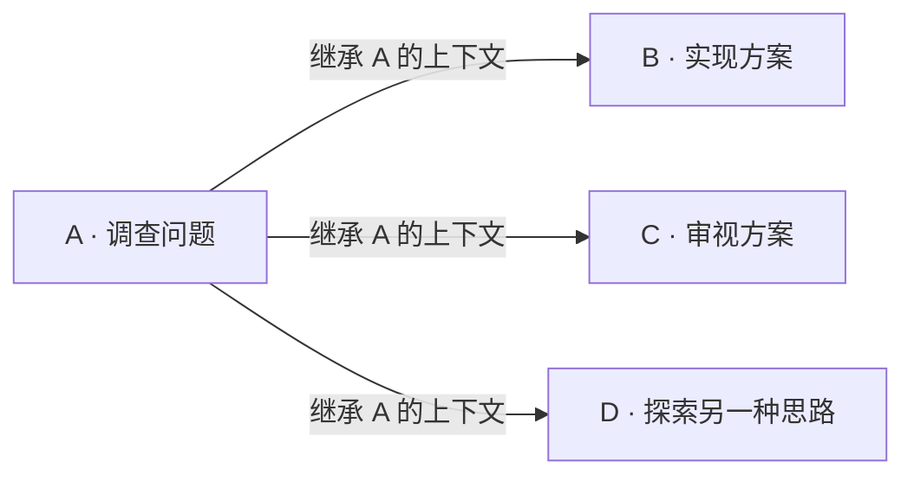

<h1 align="center">
  
  Pulsara
</h1>

<p align="center">
  <strong>一支 Agent 团队。你选的模型。你自己的电脑。</strong>
</p>

<p align="center">
  
</p>

<p align="center">
  <a href="#打开工作台">打开工作台</a> ·
  <a href="#全程工作所需">探索能力</a> ·
  <a href="#让一支团队一起推进">Agent 团队</a> ·
  <a href="#交付拿得走用得上的成果">成果交付</a> ·
  <a href="#打造你的工作台">扩展生态</a> ·
  <a href="README.md">English</a>
</p>

**Pulsara 让一支专属 AI 团队，投入你的代码、研究和数据工作。** 给它一个任务：追查 Bug、比较几种方案、把数据做成仪表盘，或准备一份可供审阅的文档。它会规划工作、委派任务、调用工具，并在本地优先的可视化工作台中完成交付。

多个 Agent 可以并行工作，从同一次调查分出不同方向，也能把积累的知识带入后续对话。稳定的提示词前缀为长任务的缓存复用打下基础。你可以在浏览器中跟进进展、随时调整方向，直接查看生成的代码、文档和交互成果。

**把值得投入的大任务，交给 Pulsara。**

## 全程工作所需

| 能力 | 你能用它做什么 |
| --- | --- |
| **并行 Agent 团队** | 让调查、实现和审阅分别由不同 Agent 推进，每个 Agent 都有自己的上下文与模型。 |
| **上下文分支** | 从同一次已完成的调查出发，让不同方案分别承接它的对话和工具调用历史。 |
| **持久记忆** | 把你的偏好、项目知识和已有决策带入下一个任务。 |
| **长任务推进** | 通过上下文压缩、后台终端和已保存的对话，持续推进复杂调查。 |
| **提示词缓存复用** | 保持输入前缀一致，让支持缓存的供应商复用已处理的输入，在命中时降低输入成本和响应延迟。 |
| **可用的成果** | 得到可运行的代码、交互式仪表盘、Word 文档、可编辑的工作簿、PDF 和图表。 |
| **Skills、MCP 与插件** | 为 Agent 接入任务所需的专业工作流程、外部服务和项目工具。 |
| **可视化工作台** | 查看任务对话与工具活动，审阅计划，并在工作进行时调整方向。 |
| **自由选择模型** | 组合兼容 OpenAI 的服务和自托管端点，为不同任务选择模型与推理强度。 |

## 让一支团队一起推进

让一个 Agent 追踪代码实现，另一个核对关键假设，再让第三个分析数据。Pulsara 的协调 Agent 会委派任务、汇总发现，并据此推进下一步。

每个任务都有自己的对话和进度。打开任务图，查看工作如何展开，阅读某个 Agent 的发现，或检查它继承的上下文。Agent 可以把工作安排成多个阶段，并将已有结果交给后续任务使用。

### 一次调查，多个方向

一次扎实的调查，值得继续发挥作用。Pulsara 可以让新任务承接这次调查的对话与工具调用历史，也可以让多个分支从这里分别出发。



负责实现的 Agent 带着调查结果开始工作。负责审阅的 Agent 从同一组发现出发，独立推进自己的判断。另一个 Agent 则可以探索替代方案。每个分支形成自己的后续历史，同时使用共享工作目录中的项目文件。

为明确的小检查选择快速模型，为复杂设计选择更强的模型，再让独立的审阅者复核结果。团队推进时，你可以查看每个任务的对话。

## 让长任务持续推进

接下需要反复打磨的重构、不断发现新问题的调查，或明天还要继续推进的项目。

Pulsara 能搜索文件、编辑代码、运行命令并检查输出。耗时的命令可以留在后台终端中运行，Agent 同时继续下一步。随着对话增长，上下文压缩会腾出空间；已保存的历史让你回来时仍能接着这份工作。

工作进行时，你可以补充纠正信息、排入下一条指令，或停止运行重新考虑。计划模式让 Agent 先调查并提出方案，供你审阅后再开始实施。

## 为提示词缓存而设计

**长上下文是一笔投入，Pulsara 让它保持可复用。**

在同一段连续上下文中，系统指令和工具定义逐字节保持不变。新消息、工具结果和你的补充指令只追加到历史末尾，保留此前调用已经建立的输入前缀。压缩后的新上下文同样遵循这一原则。

这种连续性为[供应商的提示词缓存](https://developers.openai.com/api/docs/guides/prompt-caching)提供了稳定的命中基础。复用缓存前缀可以降低输入处理成本，并让响应更快开始。越多步骤沿用不断增长的历史，越多已经处理过的上下文就能继续参与复用。

## 让积累的知识继续发挥作用

让下一次工作，从已有的偏好、项目决策和约束出发。

Pulsara 可以记住你的写作风格，保留项目决策背后的理由，并检索以前对话中的知识。关键词和语义搜索帮助 Agent 找到与当前任务相关的信息。记忆之间的关联连接已有知识，新的决策也可以取代旧的结论。

打开记忆页，查看保存了什么、检查可用的来源信息、修改偏好，或删除不再适用的内容。你可以直接查看和管理这份持续积累的记忆。

## 交付拿得走、用得上的成果

打开交互式仪表盘，探索分析结果。把可编辑的工作簿交给同事。用批注和修订审阅 Word 文档。直接在项目中运行修复后的代码。

Pulsara 把这些成果带进工作台：对话内的交互式 HTML、SVG 与 Mermaid 图表、数学公式、图片和文件预览。你可以打开引用的文件，查看完整工具输出，或导出成果，继续用于下一步工作。

内置 Skills 为这些交付提供专门的工作流程：

| 工作 | 内置 Skill |
| --- | --- |
| **文档** | [pulsara-docs](src/pulsara_agent/bundled_skills/pulsara-docs/SKILL.md)：创建和编辑 Word 文档，处理模板、批注与修订。 |
| **电子表格** | [pulsara-sheets](src/pulsara_agent/bundled_skills/pulsara-sheets/SKILL.md)：转换数据、编写公式、设置工作簿格式，并生成可编辑图表。 |
| **PDF** | [pulsara-pdf](src/pulsara_agent/bundled_skills/pulsara-pdf/SKILL.md)：阅读、提取和创建 PDF 文档。 |
| **数据分析** | [pulsara-data-analysis](src/pulsara_agent/bundled_skills/pulsara-data-analysis/SKILL.md)：探索数据集，使用 Python 和 SQL 分析，并构建交互式 HTML 报告。 |

### 给它一个真正的任务

> **工程开发：**“追查这个 Bug，比较两种修复方式，让另一个 Agent 审阅选定的方案，然后运行相关测试。”

> **研究：**“用已经连接的研究工具比较这些方案。核对来源，质疑关键假设，再做一份可视化简报。”

> **数据分析：**“分析这些表格，解释发生了什么变化，给我一个交互式仪表盘和一份可编辑的工作簿。”

> **文档：**“阅读这些材料，用 Word 起草一份提案，再根据我的批注修改。”

## 打造你的工作台

把你的研究服务、专业工作流程和项目工具，接入同一个工作台。

- **Skills** 教会 Agent 用可重复的流程处理专业工作。为新领域安装一个 Skill，或让 Agent 为经常重复的任务创建一个。
- **MCP** 让 Agent 能调用外部工具，访问数据源、资源和提示词。在工作台中配置连接与认证。
- **插件** 将相关的 Skills、MCP 服务和 Hooks 打包在一起。
- **Hooks** 在 Agent 工作过程中的受支持时点，执行你配置的动作。

你可以让能力在不同项目中通用，也可以把它们限定在某个项目内。在界面中管理，或让 Agent 检查和配置。内置安装 Skills 会指导 Agent 添加 Skills、MCP 服务和插件。

## 为每个任务选择合适的模型

为快速查询选择一个模型，为复杂实现选择另一个，再为独立审阅安排第三个。每个委派任务都可以使用自己的模型与推理设置。

通过 Chat Completions 或 Responses 接入兼容 OpenAI 的服务与自托管端点。在工作台中选择模型和受支持的推理强度，按任务需要搭配你的 Agent 团队。

工作台、对话历史和记忆保存在你的电脑上。由你选择驱动工作的模型连接。

## 工作进展尽在眼前

对话、Agent、能力、记忆和终端，都汇集在工作台中。按目录查找会话，或搜索历史。展开工具活动，打开某个 Agent 的对话，查看后台命令的进展。

选中回复的一部分，给出精确反馈。分叉会话，探索另一个方向。在 Agent 采取下一步行动前审阅计划、回答它的问题。目标变化时，随时调整方向或停止运行。

**把工作交给 Agent，把关键判断留在你手中。**

## 打开工作台

安装 Pulsara 后，运行：

```bash
pulsara app
```

Pulsara 会启动本地服务并打开浏览器工作台。在界面中选择工作目录，配置你的模型。

---

基于带类型约束的 Python 运行时、React 工作台和 PostgreSQL 构建，提供持久会话与记忆，以及 ripgrep 驱动的文件搜索。

[分享想法或反馈问题](https://github.com/plumliu/pulsara-agent/issues) · [参与贡献](https://github.com/plumliu/pulsara-agent/pulls)
