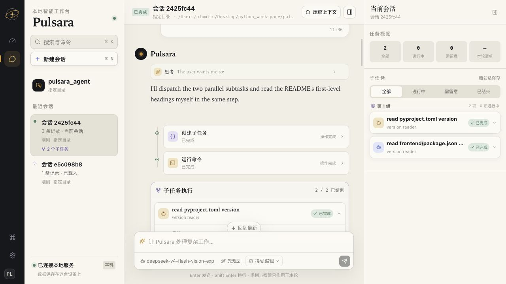
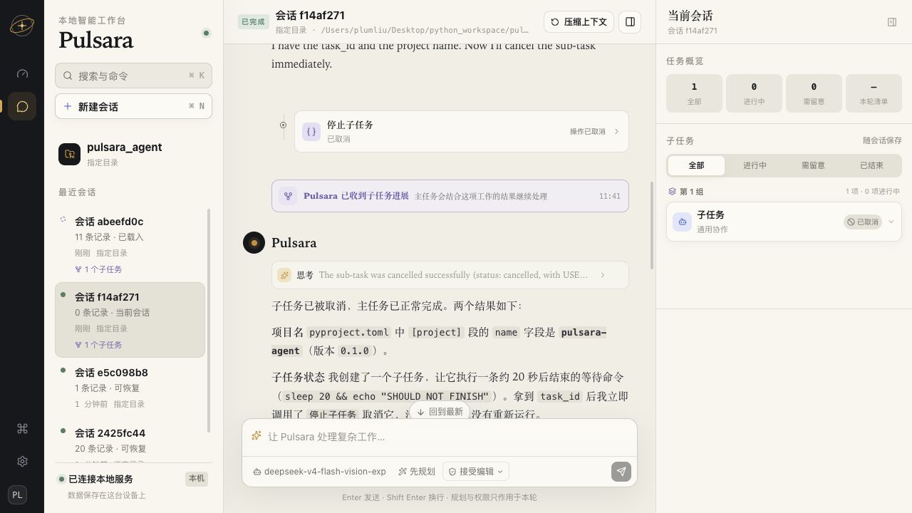
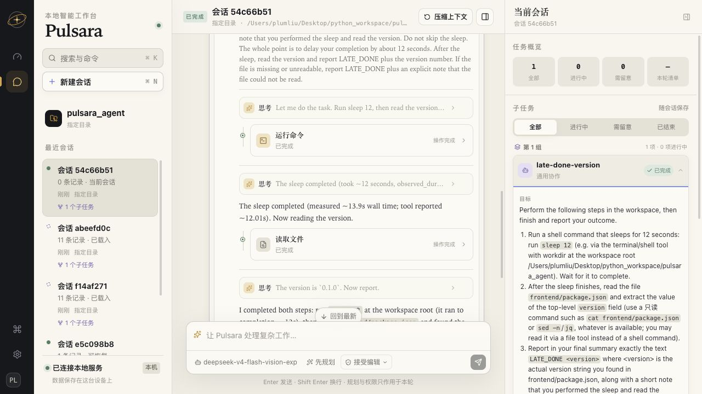
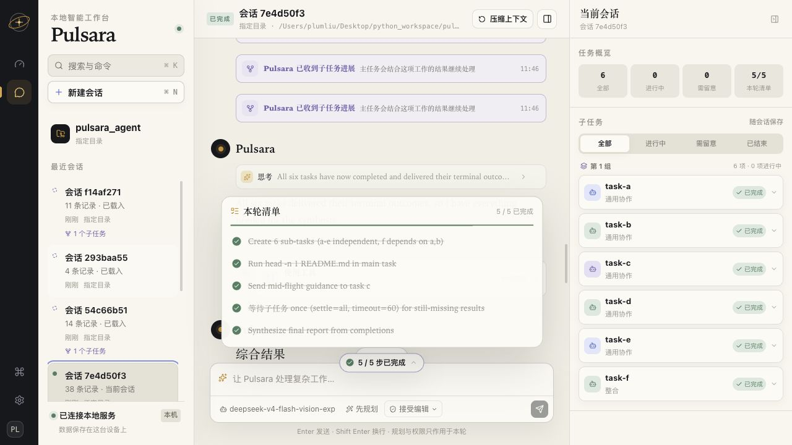
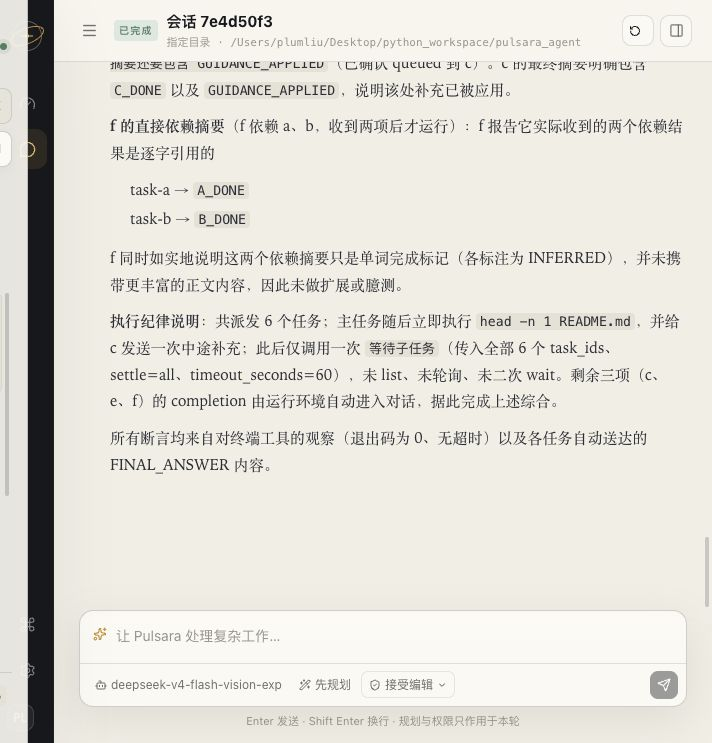

# Pulsara 子任务异步完成交付：Real-provider 前端 Dogfood 证据

> 结论：**PASS**
>
> 日期：2026-08-31
>
> 入口：本地 Web 应用 `http://127.0.0.1:8765/`
>
> 前端显示的真实模型：`deepseek-v4-flash-vision-exp`

## 1. 验证方法

本轮不是把 dogfood prompt 接入测试代码后只看断言。每个场景都从真实前端创建会话、发送消息、
观察模型流式输出、思考摘要、工具执行、子任务队列/依赖/状态、完成交付和最终自然语言回答；关键
状态用 1280×720 浏览器截图留证，并在 PostgreSQL canonical rows 中反查 session、turn、task、
completion、command 和 tool call 数量。

界面验收边界是：Pulsara 自己生成的文案、状态、提示和错误不直接展示内部协议名、枚举码、
storage envelope 或不透明 task ID；模型自行生成的内容仍按普通 Markdown 渲染，偶尔复述内部术语
不作为本轮前端验收失败。
所有记录均未输出或持久化 `PULSARA_API_KEY` 的值。

## 2. 场景结果

### 2.1 并行成功，ROOT 不 wait

- session：`2425fc44`
- 请求：创建两个并行子任务，分别读取 Python 与前端版本；ROOT 自己同时读取 README 一级标题；
  不为取回结果提前等待。
- 肉眼观察：两个 worker 同时运行；ROOT 的文件读取与 child trace 都持续可见；两个结果以中性的
  “Pulsara 已收到子任务进展”进入当前轮，未显示原始 JSON；ROOT 最终综合出两个 `0.1.0` 和
  `# 🪐 Pulsara`。
- canonical 核对：2 tasks、2 ROOT completion entries、0 manual acceptance、0 wait。

### 2.2 非成功完成仍能闭合主回答

- session：`f14af271`
- 请求：创建一个长等待 worker 后停止它；ROOT 自己读取项目名；不 wait、不重跑。
- 肉眼观察：任务变为“已取消”，取消事实以同一中性事件进入当前轮；ROOT 仍返回项目名
  `pulsara-agent` 和自然语言收尾，没有因 child 非成功而吞掉 assistant answer。
- canonical 核对：1 task，状态 `CANCELLED`，有面向产品的公开说明；1 ROOT completion entry；
  0 manual acceptance、0 wait。
- 证据边界：这里只证明 canonical 取消、自动交付和 ROOT 回答闭合；不据此宣称运行中的任意外部
  进程都能被瞬时物理终止。

### 2.3 Answer boundary 与空闲态 late join

- session：`54c66b51`
- 请求：worker 等待 12 秒后报告前端版本；ROOT 不 wait，立即结束本轮。
- 肉眼观察：第一轮先以“主任务先结束，子任务稍后完成。”闭合。worker 后续完成时，旧回答没有
  被后台追加，也没有偷偷重开 turn。任务详情显示“结果尚未用于对话”和“用这份结果继续”；悬停
  解释这是新一轮且不会重跑。点击后出现中性进展事件，Pulsara 在新一轮综合 `LATE_DONE 0.1.0`，
  同一任务变为“已用于对话”。
- canonical 核对：1 task、1 completion entry、2 ROOT turns、1 manual acceptance command、0 wait；
  第二个 ROOT turn 来自 completion continuation，只有一个 worker task/turn。

### 2.4 Batch、四 worker capacity、DAG、message 与单次 wait

- session：`7e4d50f3`
- 请求：一次创建 a–f 六个任务；a–e 独立，f 依赖 a/b；ROOT 自己读取 README，并向运行中的 c
  发送一次追加要求；只允许一次针对全部任务的 wait，不允许 list、轮询或第二次 wait。
- 肉眼观察：a–d 同时运行，e 处于待开始，f 等待依赖；容量释放后 e/f 启动。c 的最终摘要包含
  `GUIDANCE_APPLIED`；f 只引用直接依赖 a/b 的 `A_DONE`、`B_DONE`。唯一一次 wait 之后，剩余完成
  自动进入当前轮；ROOT 汇总 README、五个 marker、中途补充和依赖摘要。
- canonical 核对：6 tasks、6 ROOT completion entries、0 manual acceptance、1 wait。wait 返回
  `input_available`，其中 3 个 satisfied、3 个 pending；没有携带任何 task result body。

### 2.5 两个会话并行

- session A：`7e4d50f3`，ROOT `11:45:46.872–11:47:04.178`。
- session B：`293baa55`，ROOT `11:46:34.616–11:46:39.763`；在 A 仍有运行中 worker 时读取项目名并
  返回 `pulsara-agent`。
- 时间区间重叠；切回 A 后任务继续完成，没有全局单会话锁、无限重连或跨会话阻塞。

## 3. Canonical 汇总

| session | ROOT turns | tasks | completion entries | manual continuations | wait calls |
| --- | ---: | ---: | ---: | ---: | ---: |
| `2425fc44` | 1 | 2 | 2 | 0 | 0 |
| `f14af271` | 1 | 1 | 1 | 0 | 0 |
| `54c66b51` | 2 | 1 | 1 | 1 | 0 |
| `7e4d50f3` | 1 | 6 | 6 | 0 | 1 |
| `293baa55` | 1 | 0 | 0 | 0 | 0 |

自动场景没有为了证明交付而写 internal command；late-join 用户操作只有一个 durable command。
每个 terminal task 最多对应一个 ROOT completion entry。成功、取消、当前轮自动交付与下一轮手动
续接均经过同一个 canonical writer。

## 4. Dogfood 捕获并修复的真实缺陷

第一次真实前端请求在 provider 调用前失败：BASE_SYSTEM source contract 已升级，而统一 compiler
的唯一 source policy 仍停留在旧版本。该问题不会被纯 UI projection fixture 捕获。修复 compiler
policy 后，直接真实模型调用和上述全部前端场景均通过；没有新增第二条 provider 调用或绕过
compiler 的路径。

## 5. 最终自动化复核

- 指定后端契约集：41 passed；
- 直接受影响前端测试：32 passed；
- ESLint、local production bundle：passed；
- focused Ruff、Python `compileall`、`git diff --check`：passed。

按照用户要求，没有在修复夹具后重跑全部后端测试，只运行指定的三个后端文件。

最终 production bundle 重启后再次从真实浏览器恢复 `7e4d50f3`：页面直接进入本地工作台，约数秒内
从“正在连接”稳定为“已连接本地服务”，46 条记录与 6 个已结束子任务完整恢复；输入框重新可用，
没有登录页、无限重连或全局锁死。

